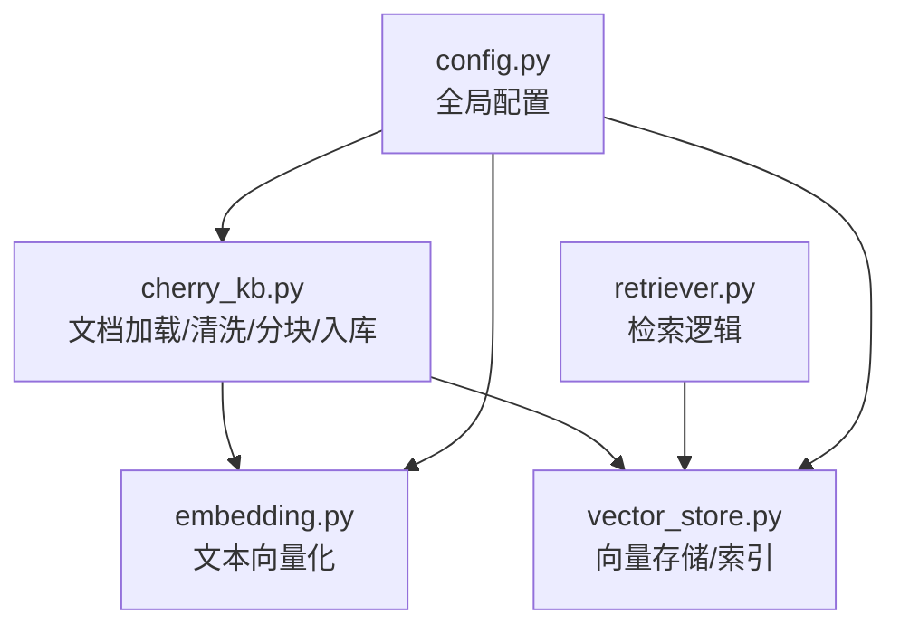
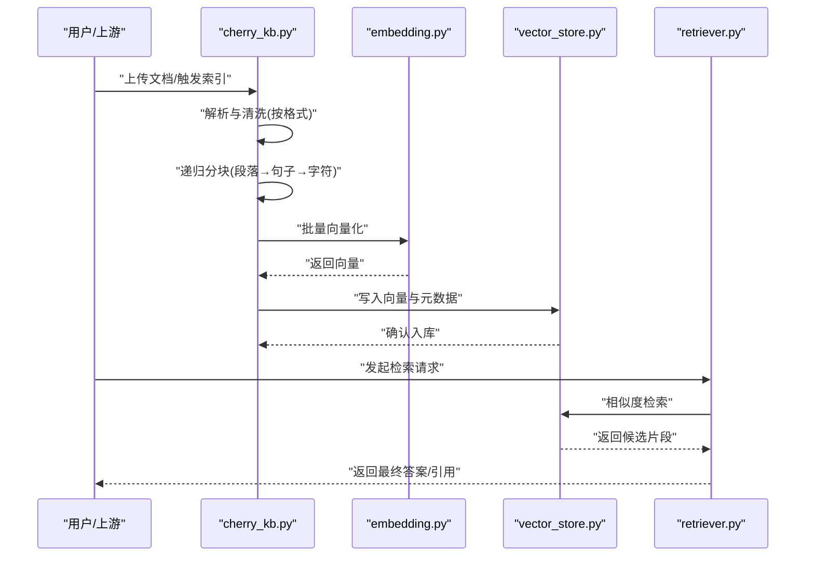
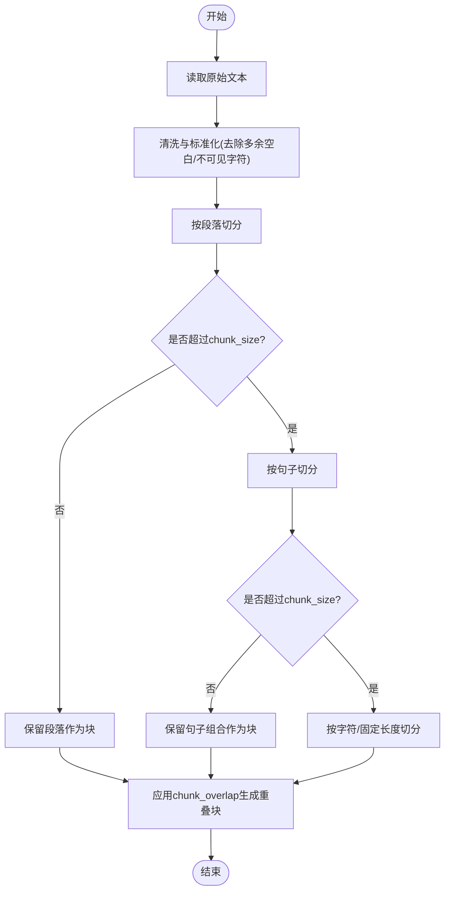
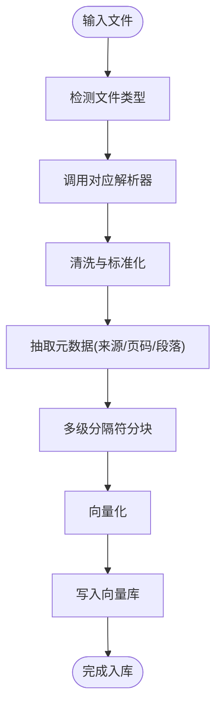
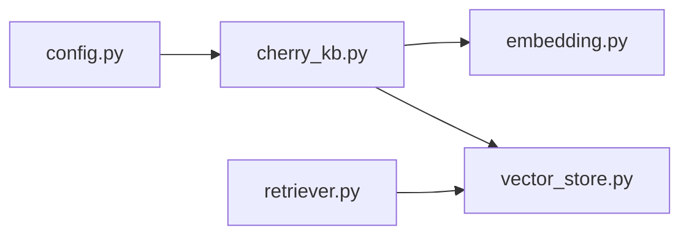

# 文档处理与分块

<cite>
**本文引用的文件**   
- [backend_design/nexus/rag/cherry_kb.py](file://backend_design/nexus/rag/cherry_kb.py)
- [backend_design/nexus/rag/embedding.py](file://backend_design/nexus/rag/embedding.py)
- [backend_design/nexus/rag/vector_store.py](file://backend_design/nexus/rag/vector_store.py)
- [backend_design/nexus/rag/retriever.py](file://backend_design/nexus/rag/retriever.py)
- [backend_design/nexus/config.py](file://backend_design/nexus/config.py)
</cite>

## 目录
1. [简介](#简介)
2. [项目结构](#项目结构)
3. [核心组件](#核心组件)
4. [架构总览](#架构总览)
5. [详细组件分析](#详细组件分析)
6. [依赖关系分析](#依赖关系分析)
7. [性能考虑](#性能考虑)
8. [故障排查指南](#故障排查指南)
9. [结论](#结论)
10. [附录](#附录)

## 简介
本技术文档聚焦于CherryKB的文档处理与文本分块系统，重点阐述：
- 基于RecursiveCharacterTextSplitter的分块策略与多级分隔符机制（段落→句子→字符）
- 中英文文本的智能分割思路与实现要点
- 关键参数配置（chunk_size=500, chunk_overlap=50）对检索效果的影响
- 不同文件格式的处理流程与预处理步骤
- 分块质量评估方法与性能优化建议

## 项目结构
与文档处理与分块相关的代码主要位于后端RAG模块中，核心文件包括：
- cherry_kb.py：负责文档加载、清洗、分块、入库等主流程
- embedding.py：负责文本向量化
- vector_store.py：负责向量存储与检索接口
- retriever.py：负责检索逻辑
- config.py：全局配置项（包含分块相关参数）

图表来源
- [backend_design/nexus/rag/cherry_kb.py](file://backend_design/nexus/rag/cherry_kb.py)
- [backend_design/nexus/rag/embedding.py](file://backend_design/nexus/rag/embedding.py)
- [backend_design/nexus/rag/vector_store.py](file://backend_design/nexus/rag/vector_store.py)
- [backend_design/nexus/rag/retriever.py](file://backend_design/nexus/rag/retriever.py)
- [backend_design/nexus/config.py](file://backend_design/nexus/config.py)

章节来源
- [backend_design/nexus/rag/cherry_kb.py](file://backend_design/nexus/rag/cherry_kb.py)
- [backend_design/nexus/rag/embedding.py](file://backend_design/nexus/rag/embedding.py)
- [backend_design/nexus/rag/vector_store.py](file://backend_design/nexus/rag/vector_store.py)
- [backend_design/nexus/rag/retriever.py](file://backend_design/nexus/rag/retriever.py)
- [backend_design/nexus/config.py](file://backend_design/nexus/config.py)

## 核心组件
- 文档处理器（cherry_kb.py）
  - 职责：统一接入多种格式文档，执行清洗、标准化、分块、元数据标注、写入向量库。
  - 关键点：使用RecursiveCharacterTextSplitter进行多级分隔符切分；维护chunk_size与chunk_overlap；为每个块附加来源、页码、段落位置等上下文信息。
- 嵌入器（embedding.py）
  - 职责：将文本块转换为向量表示，支持批量与流式处理。
  - 关键点：控制批次大小、重试与超时、异常降级。
- 向量存储（vector_store.py）
  - 职责：提供增删改查、相似度检索、过滤与分页能力。
  - 关键点：索引策略、召回数量top_k、距离度量、去重与更新策略。
- 检索器（retriever.py）
  - 职责：组合查询重写、多路召回、排序与结果融合。
  - 关键点：与分块粒度协同，保证召回片段语义完整。
- 配置（config.py）
  - 职责：集中管理分块参数、模型参数、存储参数等。
  - 关键点：chunk_size、chunk_overlap、max_chunk_length、语言检测开关、清洗规则开关。

章节来源
- [backend_design/nexus/rag/cherry_kb.py](file://backend_design/nexus/rag/cherry_kb.py)
- [backend_design/nexus/rag/embedding.py](file://backend_design/nexus/rag/embedding.py)
- [backend_design/nexus/rag/vector_store.py](file://backend_design/nexus/rag/vector_store.py)
- [backend_design/nexus/rag/retriever.py](file://backend_design/nexus/rag/retriever.py)
- [backend_design/nexus/config.py](file://backend_design/nexus/config.py)

## 架构总览
下图展示了从文档到检索的整体流程，突出分块在其中的作用。

图表来源
- [backend_design/nexus/rag/cherry_kb.py](file://backend_design/nexus/rag/cherry_kb.py)
- [backend_design/nexus/rag/embedding.py](file://backend_design/nexus/rag/embedding.py)
- [backend_design/nexus/rag/vector_store.py](file://backend_design/nexus/rag/vector_store.py)
- [backend_design/nexus/rag/retriever.py](file://backend_design/nexus/rag/retriever.py)

## 详细组件分析

### 分块策略与多级分隔符机制
- 目标
  - 在保证语义连贯的前提下，尽可能贴近chunk_size上限，减少碎片化。
  - 通过重叠保留上下文，降低跨句/跨段边界造成的语义断裂。
- 多级分隔符顺序
  - 段落级：优先以空行或段落标记切分，保持段落完整性。
  - 句子级：在段落内按句号、问号、感叹号等标点切分，兼顾中英文差异。
  - 字符级：当仍超过限制时，退化为按固定长度切分，确保不越界。
- 中文与英文智能分割要点
  - 中文：优先识别全角标点与换行；必要时结合词边界或字面长度阈值。
  - 英文：按空格与标点切分，避免单词被截断；对缩写与数字序列做保护。
- 重叠策略
  - 通过chunk_overlap在相邻块间共享少量内容，提升跨块语义衔接与召回稳定性。

图表来源
- [backend_design/nexus/rag/cherry_kb.py](file://backend_design/nexus/rag/cherry_kb.py)

章节来源
- [backend_design/nexus/rag/cherry_kb.py](file://backend_design/nexus/rag/cherry_kb.py)

### 分块参数配置与检索影响
- 关键参数
  - chunk_size=500：控制单块最大长度，影响单次检索上下文窗口与向量维度稳定性。
  - chunk_overlap=50：相邻块共享内容长度，有助于缓解边界语义丢失。
- 对检索效果的影响
  - chunk_size过大：可能导致语义稀释、检索精度下降；过小：导致上下文碎片化，召回不完整。
  - overlap过小：跨块边界易丢上下文；overlap过大：冗余增加、存储与计算成本上升。
- 调参建议
  - 中文长文：适当增大chunk_size并配合合理overlap，保证段落/句子完整。
  - 英文技术文档：可略减小chunk_size，提高细粒度匹配度。
  - 领域术语密集：适度增大overlap，保留术语上下文。

章节来源
- [backend_design/nexus/config.py](file://backend_design/nexus/config.py)
- [backend_design/nexus/rag/cherry_kb.py](file://backend_design/nexus/rag/cherry_kb.py)

### 不同文件格式的处理流程与预处理
- 通用流程
  - 解析：根据扩展名选择对应解析器（如纯文本、Markdown、PDF、Word、HTML等）。
  - 清洗：去除噪声（广告、脚注、水印）、规范化空白与编码、提取正文。
  - 结构化：抽取标题、列表、表格等结构信息，转化为可读文本或轻量标记。
  - 分块：套用多级分隔符策略与参数。
  - 元数据：记录来源、路径、页码、段落序号、时间戳等。
  - 入库：向量化后写入向量库，建立索引。
- 特殊格式注意事项
  - PDF：注意版式复杂导致的乱序与重复；优先提取纯文本与锚点。
  - Word/Excel：保留层级结构与单元格语义，必要时转为表格文本。
  - HTML：清理脚本与样式，仅保留可见内容与链接文本。
  - Markdown：保留标题层级与列表，便于后续定位与展示。

图表来源
- [backend_design/nexus/rag/cherry_kb.py](file://backend_design/nexus/rag/cherry_kb.py)

章节来源
- [backend_design/nexus/rag/cherry_kb.py](file://backend_design/nexus/rag/cherry_kb.py)

### 分块质量评估方法
- 指标建议
  - 平均块长度与标准差：衡量粒度一致性。
  - 边界语义完整性：抽样人工评估跨块语义是否断裂。
  - 召回命中率：在测试集上统计Top-K命中比例。
  - 冗余率：基于重叠与重复子串统计冗余程度。
- 自动化评估
  - 基于关键词覆盖与N-gram重合度估算冗余。
  - 基于小样本问答对的端到端准确率/召回率对比。
- 持续改进
  - 针对低质量块进行规则微调（如调整分隔符优先级、修正清洗规则）。
  - 引入领域词典与正则，保护专有名词不被错误切分。

章节来源
- [backend_design/nexus/rag/cherry_kb.py](file://backend_design/nexus/rag/cherry_kb.py)

### 性能优化建议
- 批处理与并发
  - 向量化采用批量提交，合理设置batch_size与并发度。
  - 文件解析与分块可并行，但需控制内存占用。
- 缓存与增量索引
  - 对相同内容的哈希指纹进行去重，避免重复入库。
  - 增量更新：仅对变更文件重新分块与入库。
- 存储与检索
  - 选择合适的距离度量与索引算法，平衡召回速度与精度。
  - 控制top_k与过滤条件，减少无效召回。
- 资源监控
  - 监控CPU/GPU、内存、I/O与网络延迟，定位瓶颈。
  - 对慢查询与失败重试进行告警与降级。

章节来源
- [backend_design/nexus/rag/embedding.py](file://backend_design/nexus/rag/embedding.py)
- [backend_design/nexus/rag/vector_store.py](file://backend_design/nexus/rag/vector_store.py)
- [backend_design/nexus/rag/retriever.py](file://backend_design/nexus/rag/retriever.py)

## 依赖关系分析
- 内部依赖
  - cherry_kb.py依赖embedding.py与vector_store.py完成“分块→向量化→入库”闭环。
  - retriever.py依赖vector_store.py进行相似度检索。
  - config.py为各模块提供统一参数入口。
- 外部依赖
  - 文本解析库（按格式选择）
  - 分块器（RecursiveCharacterTextSplitter）
  - 向量模型与向量数据库
- 耦合与内聚
  - 分块逻辑集中在cherry_kb.py，内聚度高；与嵌入和存储解耦清晰。
  - 配置集中管理，便于统一调参与灰度切换。

图表来源
- [backend_design/nexus/config.py](file://backend_design/nexus/config.py)
- [backend_design/nexus/rag/cherry_kb.py](file://backend_design/nexus/rag/cherry_kb.py)
- [backend_design/nexus/rag/embedding.py](file://backend_design/nexus/rag/embedding.py)
- [backend_design/nexus/rag/vector_store.py](file://backend_design/nexus/rag/vector_store.py)
- [backend_design/nexus/rag/retriever.py](file://backend_design/nexus/rag/retriever.py)

章节来源
- [backend_design/nexus/config.py](file://backend_design/nexus/config.py)
- [backend_design/nexus/rag/cherry_kb.py](file://backend_design/nexus/rag/cherry_kb.py)
- [backend_design/nexus/rag/embedding.py](file://backend_design/nexus/rag/embedding.py)
- [backend_design/nexus/rag/vector_store.py](file://backend_design/nexus/rag/vector_store.py)
- [backend_design/nexus/rag/retriever.py](file://backend_design/nexus/rag/retriever.py)

## 性能考虑
- 分块阶段
  - 控制正则与清洗复杂度，避免O(n^2)操作。
  - 对超大文档采用流式读取与分段处理。
- 向量化阶段
  - 合理设置batch_size与并发，充分利用GPU/CPU。
  - 启用缓存与去重，减少重复计算。
- 存储与检索
  - 选择合适的索引结构与top_k，权衡延迟与精度。
  - 对热点数据进行预取与缓存。

[本节为通用指导，无需具体文件来源]

## 故障排查指南
- 常见问题
  - 分块过碎或过长：检查chunk_size与分隔符优先级，必要时调整overlap。
  - 中文标点未正确识别：确认清洗与分块逻辑对全角标点的处理。
  - 入库失败或索引不一致：核对向量维度、元数据完整性与幂等写入。
  - 检索延迟高：检查top_k、过滤条件与索引健康状态。
- 诊断手段
  - 输出分块统计（数量、长度分布、重叠率）。
  - 抽样可视化块边界与上下文。
  - 对失败任务记录日志与重试策略。

章节来源
- [backend_design/nexus/rag/cherry_kb.py](file://backend_design/nexus/rag/cherry_kb.py)
- [backend_design/nexus/rag/vector_store.py](file://backend_design/nexus/rag/vector_store.py)

## 结论
CherryKB的分块系统以RecursiveCharacterTextSplitter为核心，通过段落→句子→字符的多级分隔符策略，结合合理的chunk_size与chunk_overlap，实现了中英文混合场景下的稳健分割。配合统一的配置管理与清晰的模块解耦，系统在检索质量与性能之间取得良好平衡。建议在生产环境中持续评估分块质量，并结合业务场景动态调参，以获得最佳检索体验。

[本节为总结性内容，无需具体文件来源]

## 附录
- 术语说明
  - 分块：将长文本切分为适合检索与推理的片段。
  - 重叠：相邻分块共享的内容长度，用于保留上下文。
  - 向量化：将文本转换为数值向量以供相似度检索。
- 参考路径
  - 分块主流程：[backend_design/nexus/rag/cherry_kb.py](file://backend_design/nexus/rag/cherry_kb.py)
  - 向量化实现：[backend_design/nexus/rag/embedding.py](file://backend_design/nexus/rag/embedding.py)
  - 向量存储接口：[backend_design/nexus/rag/vector_store.py](file://backend_design/nexus/rag/vector_store.py)
  - 检索逻辑：[backend_design/nexus/rag/retriever.py](file://backend_design/nexus/rag/retriever.py)
  - 全局配置：[backend_design/nexus/config.py](file://backend_design/nexus/config.py)