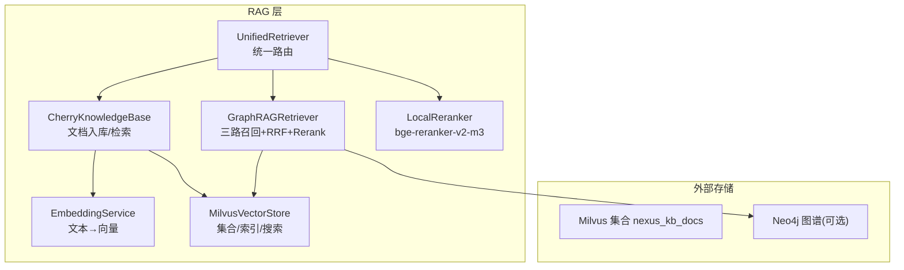
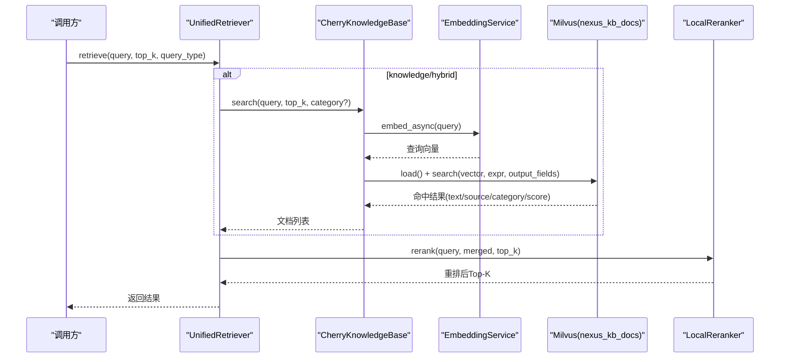
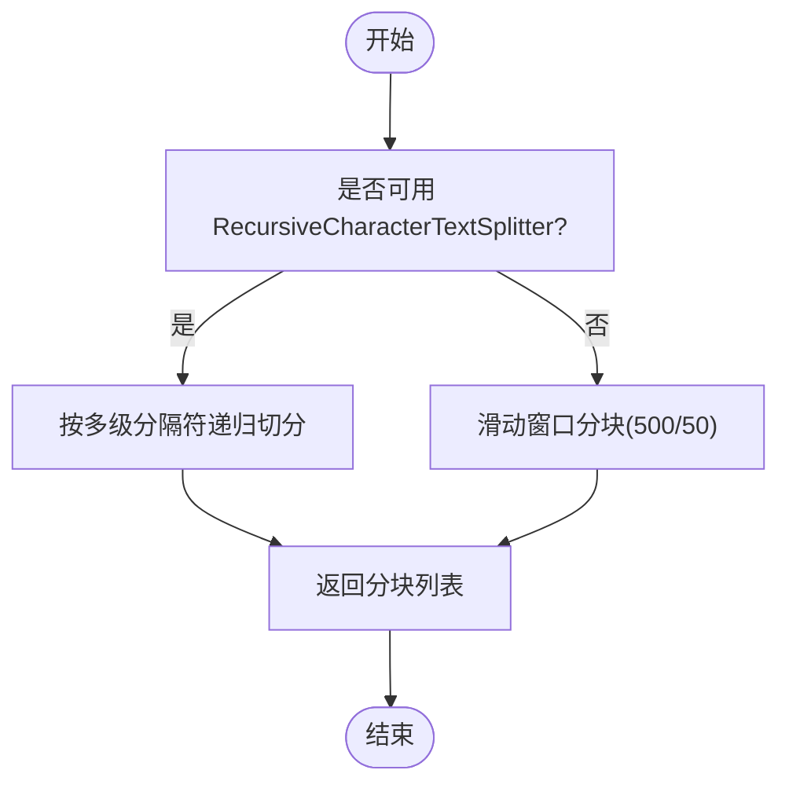
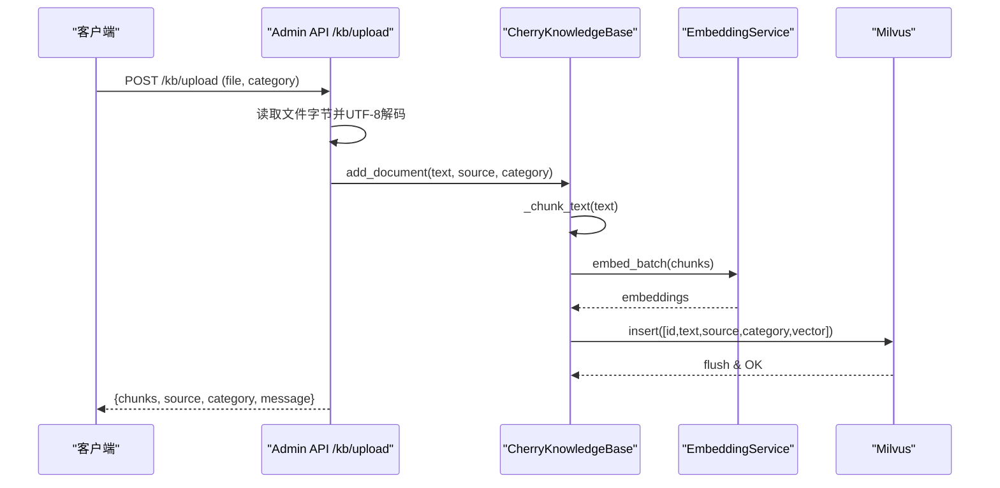
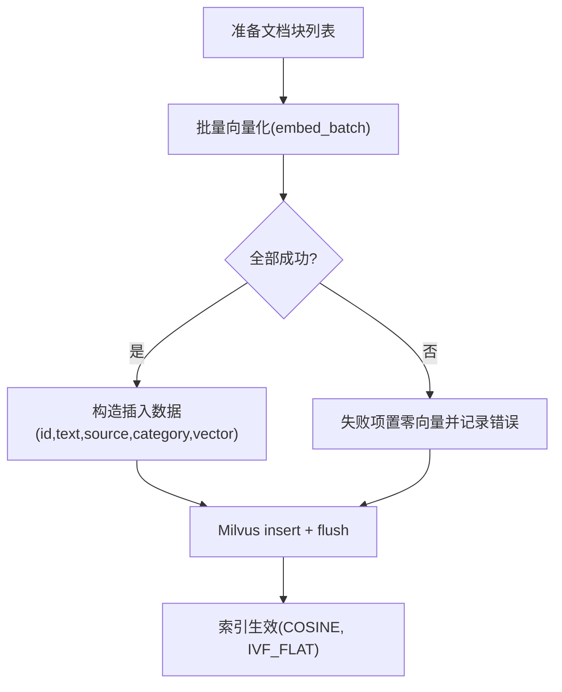
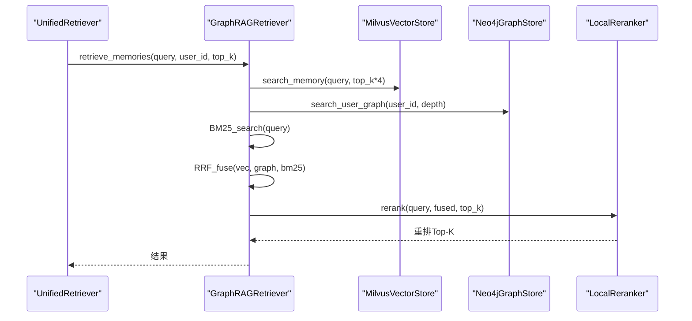
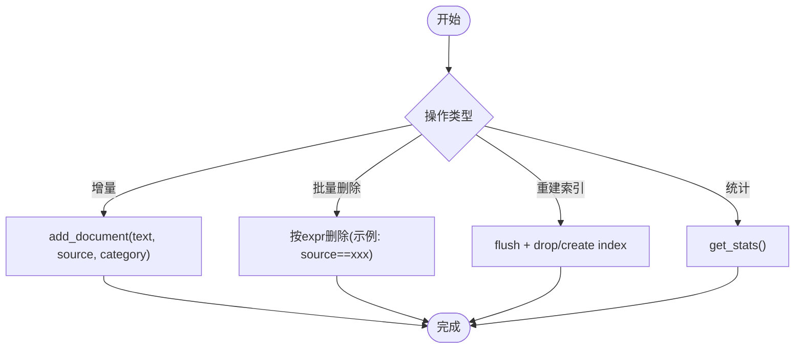
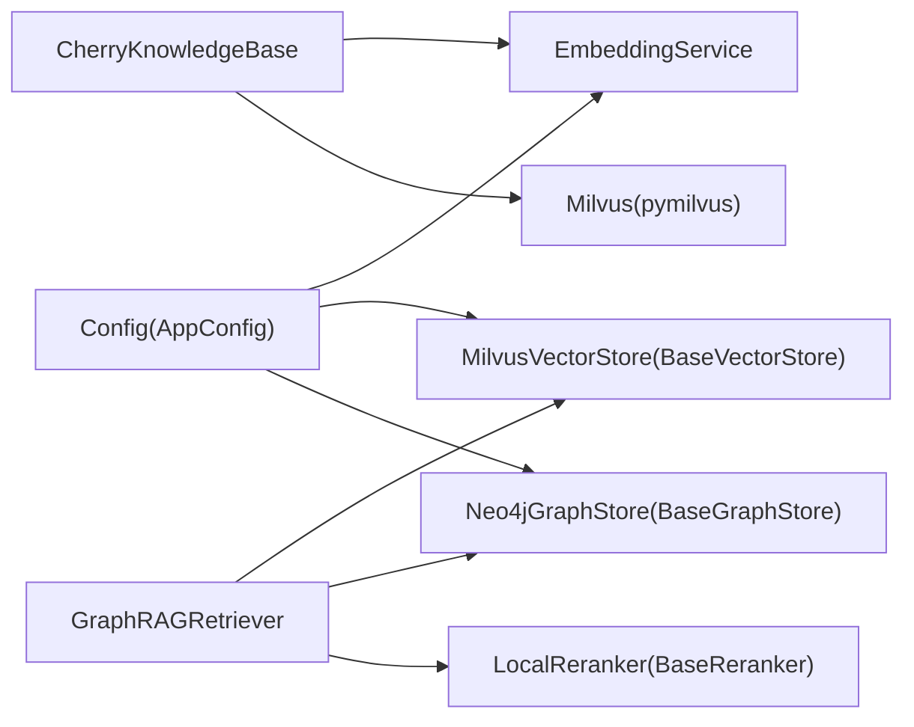

# 知识库管理

<cite>
**本文引用的文件**   
- [cherry_kb.py](file://backend_design/nexus/rag/cherry_kb.py)
- [embedding.py](file://backend_design/nexus/rag/embedding.py)
- [vector_store.py](file://backend_design/nexus/rag/vector_store.py)
- [retriever.py](file://backend_design/nexus/rag/retriever.py)
- [unified_retriever.py](file://backend_design/nexus/rag/unified_retriever.py)
- [reranker.py](file://backend_design/nexus/rag/reranker.py)
- [vector_base.py](file://backend_design/nexus/rag/vector_base.py)
- [graph_store.py](file://backend_design/nexus/rag/graph_store.py)
- [config.py](file://backend_design/nexus/config.py)
- [admin.py](file://backend_design/nexus/api/routes/admin.py)
- [metrics.py](file://backend_design/nexus/observability/metrics.py)
</cite>

## 目录
1. [简介](#简介)
2. [项目结构](#项目结构)
3. [核心组件](#核心组件)
4. [架构总览](#架构总览)
5. [详细组件分析](#详细组件分析)
6. [依赖关系分析](#依赖关系分析)
7. [性能与容量规划](#性能与容量规划)
8. [故障排查指南](#故障排查指南)
9. [结论](#结论)
10. [附录](#附录)

## 简介
本技术文档围绕 CherryKB 文档型知识库，系统阐述其数据结构、分块策略、元数据与版本控制思路、导入流程（支持文本类格式）、向量索引构建（分词、嵌入模型、索引优化），以及更新维护操作（增量更新、批量删除、索引重建）。同时给出检索链路、统一路由、重排与监控指标，帮助读者从整体到细节全面掌握知识库的落地实现与运维要点。

## 项目结构
CherryKB 位于 RAG 子系统中，核心由“文档入库 → 分块 → 向量化 → Milvus 存储 → 检索”构成，并与 GraphRAG（记忆/习惯）形成互补。关键文件组织如下：
- 文档知识库：cherry_kb.py
- 向量化服务：embedding.py
- 向量存储抽象与 Milvus 实现：vector_base.py、vector_store.py
- 检索器与统一路由：retriever.py、unified_retriever.py
- 重排：reranker.py
- 配置中心：config.py
- 管理接口：admin.py
- 可观测性指标：metrics.py



图示来源
- [cherry_kb.py:1-287](file://backend_design/nexus/rag/cherry_kb.py#L1-L287)
- [embedding.py:1-137](file://backend_design/nexus/rag/embedding.py#L1-L137)
- [vector_store.py:1-271](file://backend_design/nexus/rag/vector_store.py#L1-L271)
- [retriever.py:1-252](file://backend_design/nexus/rag/retriever.py#L1-L252)
- [unified_retriever.py:1-155](file://backend_design/nexus/rag/unified_retriever.py#L1-L155)
- [reranker.py:1-151](file://backend_design/nexus/rag/reranker.py#L1-L151)

章节来源
- [cherry_kb.py:1-287](file://backend_design/nexus/rag/cherry_kb.py#L1-L287)
- [embedding.py:1-137](file://backend_design/nexus/rag/embedding.py#L1-L137)
- [vector_store.py:1-271](file://backend_design/nexus/rag/vector_store.py#L1-L271)
- [retriever.py:1-252](file://backend_design/nexus/rag/retriever.py#L1-L252)
- [unified_retriever.py:1-155](file://backend_design/nexus/rag/unified_retriever.py#L1-L155)
- [reranker.py:1-151](file://backend_design/nexus/rag/reranker.py#L1-L151)

## 核心组件
- CherryKnowledgeBase：负责文档分块、向量化、写入 Milvus 集合 nexus_kb_docs，并提供按类别过滤的检索与统计。
- EmbeddingService：封装 Ark API 调用，提供单条与批量异步向量化能力，内置熔断与重试。
- MilvusVectorStore：定义 Milvus 连接、集合初始化、索引创建与搜索；CherryKB 直接通过 pymilvus 操作集合。
- GraphRAGRetriever：三路召回（向量/图谱/BM25）+ RRF 融合 + Rerank 重排。
- UnifiedRetriever：根据 query_type 分发至 GraphRAG 或 CherryKB，支持混合检索与结果合并。
- LocalReranker：本地 bge-reranker-v2-m3 重排，提升 Top-K 精度。
- Config：集中管理 LLM/Milvus/Neo4j/Providers 等配置，含 embedding_dim、index 参数等。
- Admin API：提供 /kb/upload、/kb/reindex、/kb/stats 等管理能力。
- Metrics：Prometheus 指标采集，便于监控 RAG 延迟与调用量。

章节来源
- [cherry_kb.py:1-287](file://backend_design/nexus/rag/cherry_kb.py#L1-L287)
- [embedding.py:1-137](file://backend_design/nexus/rag/embedding.py#L1-L137)
- [vector_store.py:1-271](file://backend_design/nexus/rag/vector_store.py#L1-L271)
- [retriever.py:1-252](file://backend_design/nexus/rag/retriever.py#L1-L252)
- [unified_retriever.py:1-155](file://backend_design/nexus/rag/unified_retriever.py#L1-L155)
- [reranker.py:1-151](file://backend_design/nexus/rag/reranker.py#L1-L151)
- [config.py:1-693](file://backend_design/nexus/config.py#L1-L693)
- [admin.py:100-170](file://backend_design/nexus/api/routes/admin.py#L100-L170)
- [metrics.py:1-113](file://backend_design/nexus/observability/metrics.py#L1-L113)

## 架构总览
CherryKB 与 GraphRAG 共同组成统一检索入口。CherryKB 面向手册/故障码/FAQ/保养规范等长文档，采用 IVF_FLAT 索引；GraphRAG 面向用户记忆与偏好，结合 Neo4j 图谱与 BM25 全文检索，最终经 RRF 融合与 Rerank 输出 Top-K。



图示来源
- [unified_retriever.py:63-155](file://backend_design/nexus/rag/unified_retriever.py#L63-L155)
- [cherry_kb.py:209-266](file://backend_design/nexus/rag/cherry_kb.py#L209-L266)
- [embedding.py:52-105](file://backend_design/nexus/rag/embedding.py#L52-L105)
- [reranker.py:79-139](file://backend_design/nexus/rag/reranker.py#L79-L139)

## 详细组件分析

### 数据结构与元数据设计
- 集合名：nexus_kb_docs
- 字段说明：
  - id：主键（UUID）
  - text：文档块文本
  - source：来源文件名
  - category：类别（manual/dtc/faq/maintenance/general）
  - vector：嵌入向量（维度来自配置 llm.embedding_dim）
- 索引类型：IVF_FLAT，度量 COSINE，nlist=128
- 查询参数：nprobe=10，支持按 category 过滤

```mermaid
classDiagram
class CherryKnowledgeBase {
+connect(milvus_client)
+add_document(text, source, category) int
+search(query, top_k, category) List[Dict]
+get_stats() Dict
-_chunk_text(text, chunk_size, overlap) List[str]
-_ensure_collection() void
}
class MilvusCollection {
+id : VARCHAR
+text : VARCHAR
+source : VARCHAR
+category : VARCHAR
+vector : FLOAT_VECTOR(dim)
+create_index("IVF_FLAT","COSINE",{"nlist" : 128})
+insert(data)
+search(data, anns_field, param, limit, expr, output_fields)
+flush()
+num_entities
}
CherryKnowledgeBase --> MilvusCollection : "写入/检索"
```

图示来源
- [cherry_kb.py:99-133](file://backend_design/nexus/rag/cherry_kb.py#L99-L133)
- [cherry_kb.py:134-182](file://backend_design/nexus/rag/cherry_kb.py#L134-L182)
- [cherry_kb.py:209-266](file://backend_design/nexus/rag/cherry_kb.py#L209-L266)

章节来源
- [cherry_kb.py:1-287](file://backend_design/nexus/rag/cherry_kb.py#L1-L287)

### 文档分块策略
- 首选 langchain_text_splitters.RecursiveCharacterTextSplitter，中文优先分隔符顺序为段落→句号→感叹号→问号→分号→逗号→空格→字符，避免硬截断。
- 默认块大小约 500 字，重叠 50 字，保持上下文连贯。
- 若未安装依赖，降级为滑动窗口分块。



图示来源
- [cherry_kb.py:184-207](file://backend_design/nexus/rag/cherry_kb.py#L184-L207)

章节来源
- [cherry_kb.py:32-82](file://backend_design/nexus/rag/cherry_kb.py#L32-L82)
- [cherry_kb.py:184-207](file://backend_design/nexus/rag/cherry_kb.py#L184-L207)

### 文档导入流程与预处理
- 管理接口 POST /kb/upload：接收 multipart/form-data 上传的文件，读取字节并解码为 UTF-8 文本，随后调用 add_document 完成分块、向量化与入库。
- 当前实现主要支持纯文本类文件（如 .txt/.md），不支持 PDF/HTML 解析；如需扩展，可在上传前增加解析步骤（见“扩展建议”）。



图示来源
- [admin.py:120-148](file://backend_design/nexus/api/routes/admin.py#L120-L148)
- [cherry_kb.py:134-182](file://backend_design/nexus/rag/cherry_kb.py#L134-L182)
- [embedding.py:74-105](file://backend_design/nexus/rag/embedding.py#L74-L105)

章节来源
- [admin.py:120-148](file://backend_design/nexus/api/routes/admin.py#L120-L148)
- [cherry_kb.py:134-182](file://backend_design/nexus/rag/cherry_kb.py#L134-L182)

### 向量索引构建与优化
- 嵌入模型：通过配置 llm.embedding_model 指定，维度由 llm.embedding_dim 决定。
- 索引类型：IVF_FLAT，度量 COSINE，nlist=128；查询 nprobe=10。
- 批量向量化：EmbeddingService.embed_batch 并行处理多个批次，失败时回退为零向量并记录日志。
- 连接与集合：CherryKB 在 connect 中确保集合存在并创建索引；MilvusVectorStore 展示 HNSW 用法（供其他场景参考）。



图示来源
- [cherry_kb.py:154-182](file://backend_design/nexus/rag/cherry_kb.py#L154-L182)
- [embedding.py:74-105](file://backend_design/nexus/rag/embedding.py#L74-L105)
- [cherry_kb.py:121-130](file://backend_design/nexus/rag/cherry_kb.py#L121-L130)

章节来源
- [cherry_kb.py:121-130](file://backend_design/nexus/rag/cherry_kb.py#L121-L130)
- [embedding.py:74-105](file://backend_design/nexus/rag/embedding.py#L74-L105)

### 检索与重排
- CherryKB 检索：将查询文本向量化后在 Milvus 执行 ANN 搜索，支持按 category 过滤，返回 text/source/category/score。
- GraphRAG 三路召回：向量路(Milvus)、图谱路(Neo4j)、BM25路（可选），使用 RRF 融合，再经 Rerank 重排 Top-K。
- 统一路由：根据 query_type 选择 memory/knowledge/hybrid/auto，自动检测关键词进行路由。



图示来源
- [retriever.py:141-178](file://backend_design/nexus/rag/retriever.py#L141-L178)
- [retriever.py:192-245](file://backend_design/nexus/rag/retriever.py#L192-L245)
- [reranker.py:79-139](file://backend_design/nexus/rag/reranker.py#L79-L139)
- [unified_retriever.py:63-155](file://backend_design/nexus/rag/unified_retriever.py#L63-L155)

章节来源
- [retriever.py:1-252](file://backend_design/nexus/rag/retriever.py#L1-L252)
- [unified_retriever.py:1-155](file://backend_design/nexus/rag/unified_retriever.py#L1-L155)
- [reranker.py:1-151](file://backend_design/nexus/rag/reranker.py#L1-L151)

### 更新与维护操作
- 增量更新：调用 add_document 即可追加新文档块，无需全量重建。
- 批量删除：当前 CherryKB 未暴露按 ID 或条件删除接口；如需，可在集合层基于 expr 删除（例如按 source 或 category）。
- 索引重建：管理接口 /kb/reindex 已预留，实际需触发 flush 与重新创建索引（IVF_FLAT 重建成本较高，建议低峰期执行）。
- 统计信息：/kb/stats 返回集合实体数量与连通状态。



图示来源
- [cherry_kb.py:134-182](file://backend_design/nexus/rag/cherry_kb.py#L134-L182)
- [cherry_kb.py:268-287](file://backend_design/nexus/rag/cherry_kb.py#L268-L287)
- [admin.py:151-170](file://backend_design/nexus/api/routes/admin.py#L151-L170)

章节来源
- [admin.py:151-170](file://backend_design/nexus/api/routes/admin.py#L151-L170)
- [cherry_kb.py:268-287](file://backend_design/nexus/rag/cherry_kb.py#L268-L287)

### 版本控制与一致性建议
- 当前集合未显式包含 version 字段，建议在 schema 中新增 version 字段以支持文档版本演进与回滚。
- 对同一 source 的多版本可通过 category 或额外 metadata 字段区分，并在检索时按最新 version 过滤。
- 变更审计：在写入时附带时间戳与操作者标识，便于追踪与回溯。

章节来源
- [cherry_kb.py:111-118](file://backend_design/nexus/rag/cherry_kb.py#L111-L118)

## 依赖关系分析
- CherryKB 依赖：
  - EmbeddingService：用于文本向量化（Ark API，带熔断与重试）
  - Milvus：pymilvus 集合操作（连接、索引、插入、搜索）
- GraphRAGRetriever 依赖：
  - MilvusVectorStore（BaseVectorStore 实现）
  - Neo4jGraphStore（BaseGraphStore 实现）
  - LocalReranker（可选）
- 配置依赖：
  - llm.embedding_model / embedding_dim
  - milvus.index_type / metric_type / index_params / search_params
  - providers.vector_store（local/cloud）



图示来源
- [cherry_kb.py:1-287](file://backend_design/nexus/rag/cherry_kb.py#L1-L287)
- [embedding.py:1-137](file://backend_design/nexus/rag/embedding.py#L1-L137)
- [vector_store.py:1-271](file://backend_design/nexus/rag/vector_store.py#L1-L271)
- [retriever.py:1-252](file://backend_design/nexus/rag/retriever.py#L1-L252)
- [config.py:1-693](file://backend_design/nexus/config.py#L1-L693)

章节来源
- [vector_base.py:1-70](file://backend_design/nexus/rag/vector_base.py#L1-L70)
- [graph_store.py:1-190](file://backend_design/nexus/rag/graph_store.py#L1-L190)
- [config.py:1-693](file://backend_design/nexus/config.py#L1-L693)

## 性能与容量规划
- 分块与重叠：
  - 推荐 chunk_size≈500，overlap≈50，兼顾召回与冗余度。
- 索引与检索：
  - IVF_FLAT 适合中等规模数据；nlist=128、nprobe=10 为默认值，可按数据规模调优（增大 nlist 提高建库质量，增大 nprobe 提高召回率但增加延迟）。
- 向量化吞吐：
  - 使用 embed_batch 并行批处理，batch_size 可根据 API 限流与网络带宽调整。
- 资源与容量：
  - 预估向量维度 = embedding_dim（默认 2560），集合大小随文档块数线性增长。
  - 定期 flush 保证写入可见性，重建索引建议在低峰期执行。
- 监控指标：
  - 使用 Prometheus 指标观察请求量、RAG 延迟、LLM 调用次数与延迟等，辅助容量规划与瓶颈定位。

章节来源
- [cherry_kb.py:121-130](file://backend_design/nexus/rag/cherry_kb.py#L121-L130)
- [embedding.py:74-105](file://backend_design/nexus/rag/embedding.py#L74-L105)
- [metrics.py:1-113](file://backend_design/nexus/observability/metrics.py#L1-L113)

## 故障排查指南
- 连接问题：
  - Milvus 连接失败：检查 URI、token、alias 与集合是否存在；查看日志中的连接错误信息。
  - Neo4j 连接失败：核对 uri/user/password，确认约束与索引初始化是否成功。
- 向量化失败：
  - Ark API 不可用：熔断器触发后重试指数退避；确认 ARK_API_KEY/ARK_BASE_URL 与网络连通性。
- 检索为空：
  - 检查集合是否加载（load）、查询向量是否为空、category 过滤是否过严。
- 重排不可用：
  - 本地模型路径不存在或依赖未安装，将回退为原始排序；检查 models/reranker/bge-reranker-v2-m3 路径与 sentence-transformers 安装。

章节来源
- [vector_store.py:52-70](file://backend_design/nexus/rag/vector_store.py#L52-L70)
- [graph_store.py:31-43](file://backend_design/nexus/rag/graph_store.py#L31-L43)
- [embedding.py:52-72](file://backend_design/nexus/rag/embedding.py#L52-L72)
- [reranker.py:52-77](file://backend_design/nexus/rag/reranker.py#L52-L77)

## 结论
CherryKB 提供了轻量而高效的文档型知识库方案：基于递归分块与 IVF_FLAT 索引，配合统一的 Embedding 服务与 Milvus 存储，满足手册/故障码/FAQ/保养规范等长文档的语义检索需求。通过 UnifiedRetriever 与 GraphRAG 的三路融合与重排，系统在召回精度与用户体验上取得良好平衡。建议在生产环境中完善版本控制与批量删除能力，并结合 Prometheus/Grafana 建立完善的监控与告警体系。

## 附录

### 支持的导入格式与扩展建议
- 当前支持：纯文本类文件（.txt/.md），通过 /kb/upload 上传后直接入库。
- 扩展建议：
  - PDF：引入 pdfplumber/pypdf 提取文本，保留页码与标题层级作为元数据。
  - HTML：使用 BeautifulSoup/lxml 清洗标签，提取正文与结构化元数据。
  - Word/Excel：引入 python-docx/openpyxl 转换为 Markdown 或 CSV，再进行分块入库。
  - 元数据增强：为每个块附加 page、section、author、version、updated_at 等字段，便于溯源与版本控制。

章节来源
- [admin.py:120-148](file://backend_design/nexus/api/routes/admin.py#L120-L148)
- [cherry_kb.py:111-118](file://backend_design/nexus/rag/cherry_kb.py#L111-L118)