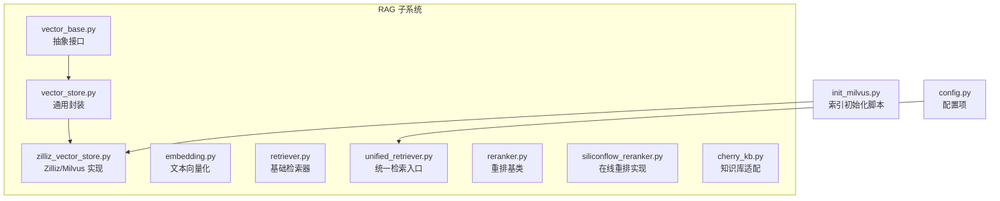
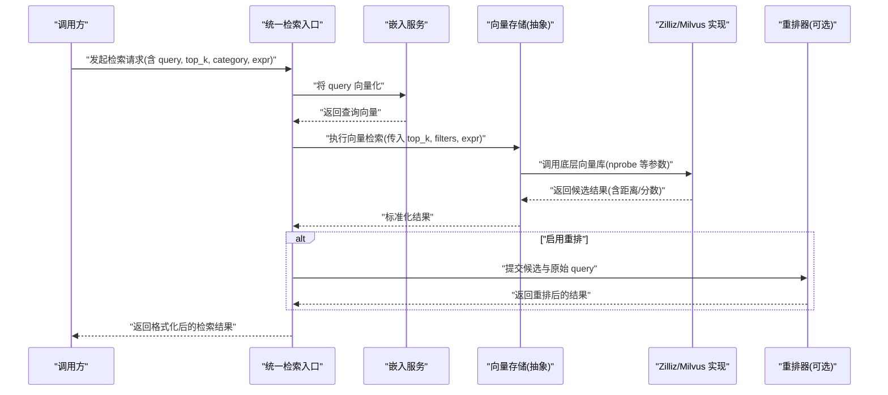
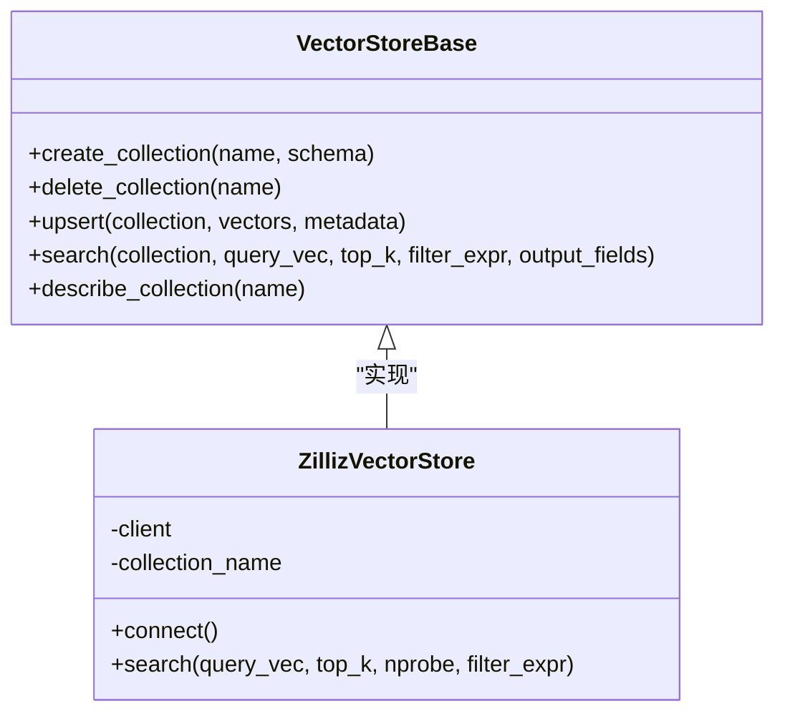
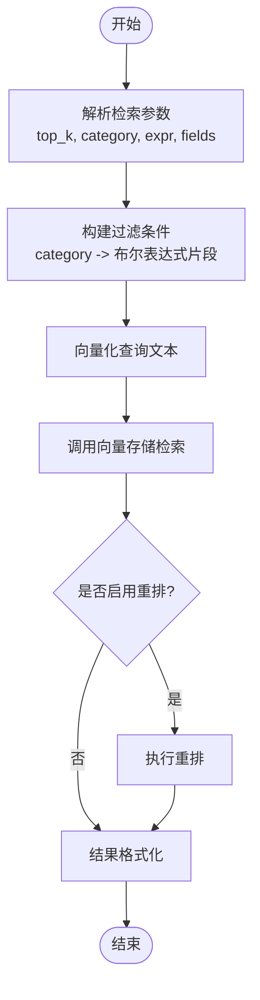
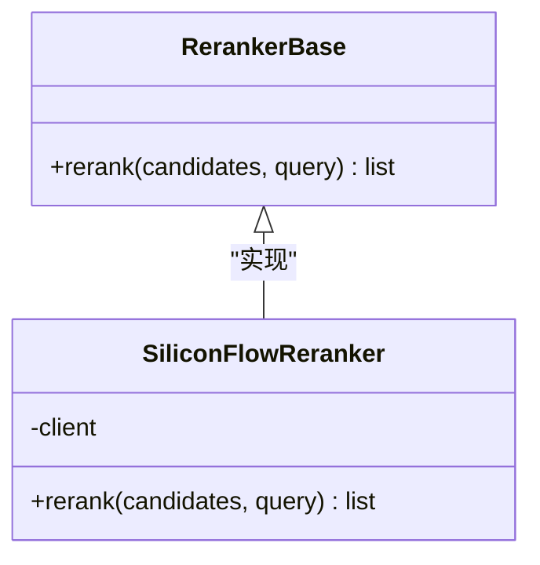
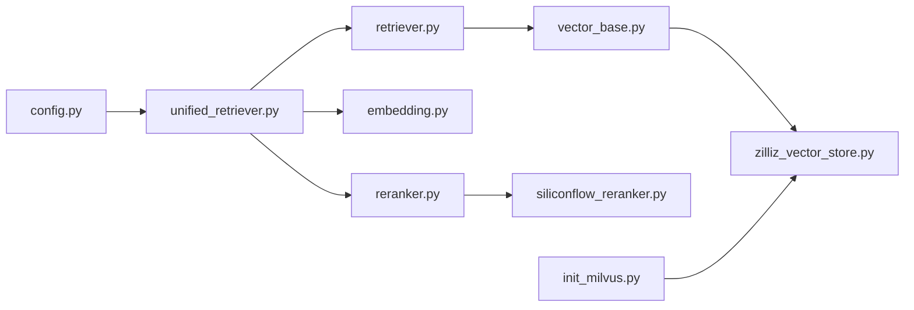

# 知识检索引擎

<cite>
**本文引用的文件**   
- [backend_design/nexus/rag/vector_base.py](file://backend_design/nexus/rag/vector_base.py)
- [backend_design/nexus/rag/vector_store.py](file://backend_design/nexus/rag/vector_store.py)
- [backend_design/nexus/rag/zilliz_vector_store.py](file://backend_design/nexus/rag/zilliz_vector_store.py)
- [backend_design/nexus/rag/retriever.py](file://backend_design/nexus/rag/retriever.py)
- [backend_design/nexus/rag/unified_retriever.py](file://backend_design/nexus/rag/unified_retriever.py)
- [backend_design/nexus/rag/embedding.py](file://backend_design/nexus/rag/embedding.py)
- [backend_design/nexus/rag/reranker.py](file://backend_design/nexus/rag/reranker.py)
- [backend_design/nexus/rag/siliconflow_reranker.py](file://backend_design/nexus/rag/siliconflow_reranker.py)
- [backend_design/nexus/rag/cherry_kb.py](file://backend_design/nexus/rag/cherry_kb.py)
- [backend_design/nexus/config.py](file://backend_design/nexus/config.py)
- [scripts/init_milvus.py](file://scripts/init_milvus.py)
</cite>

## 目录
1. [简介](#简介)
2. [项目结构](#项目结构)
3. [核心组件](#核心组件)
4. [架构总览](#架构总览)
5. [详细组件分析](#详细组件分析)
6. [依赖关系分析](#依赖关系分析)
7. [性能考量](#性能考量)
8. [故障排查指南](#故障排查指南)
9. [结论](#结论)
10. [附录](#附录)

## 简介
本技术文档聚焦于“知识检索引擎”的向量检索实现与使用，覆盖查询向量化、相似度计算、结果排序、搜索参数配置（top_k、category过滤、nprobe）、表达式过滤（expr）机制、结果格式化与后处理流程，以及性能基准测试与调优建议。读者无需深入底层细节即可理解整体工作原理并掌握高效使用方法。

## 项目结构
知识检索相关代码位于后端模块的 RAG 子系统中，采用分层与可插拔设计：
- 抽象层：定义统一的向量存储接口与检索器接口
- 实现层：提供具体向量库（如 Zilliz/Milvus）与重排器的实现
- 编排层：统一检索入口，组合嵌入、召回、重排等步骤
- 配置与初始化：集中管理模型、连接参数与索引初始化脚本

图表来源
- [backend_design/nexus/rag/vector_base.py](file://backend_design/nexus/rag/vector_base.py)
- [backend_design/nexus/rag/vector_store.py](file://backend_design/nexus/rag/vector_store.py)
- [backend_design/nexus/rag/zilliz_vector_store.py](file://backend_design/nexus/rag/zilliz_vector_store.py)
- [backend_design/nexus/rag/embedding.py](file://backend_design/nexus/rag/embedding.py)
- [backend_design/nexus/rag/retriever.py](file://backend_design/nexus/rag/retriever.py)
- [backend_design/nexus/rag/unified_retriever.py](file://backend_design/nexus/rag/unified_retriever.py)
- [backend_design/nexus/rag/reranker.py](file://backend_design/nexus/rag/reranker.py)
- [backend_design/nexus/rag/siliconflow_reranker.py](file://backend_design/nexus/rag/siliconflow_reranker.py)
- [backend_design/nexus/rag/cherry_kb.py](file://backend_design/nexus/rag/cherry_kb.py)
- [backend_design/nexus/config.py](file://backend_design/nexus/config.py)
- [scripts/init_milvus.py](file://scripts/init_milvus.py)

章节来源
- [backend_design/nexus/rag/vector_base.py](file://backend_design/nexus/rag/vector_base.py)
- [backend_design/nexus/rag/vector_store.py](file://backend_design/nexus/rag/vector_store.py)
- [backend_design/nexus/rag/zilliz_vector_store.py](file://backend_design/nexus/rag/zilliz_vector_store.py)
- [backend_design/nexus/rag/embedding.py](file://backend_design/nexus/rag/embedding.py)
- [backend_design/nexus/rag/retriever.py](file://backend_design/nexus/rag/retriever.py)
- [backend_design/nexus/rag/unified_retriever.py](file://backend_design/nexus/rag/unified_retriever.py)
- [backend_design/nexus/rag/reranker.py](file://backend_design/nexus/rag/reranker.py)
- [backend_design/nexus/rag/siliconflow_reranker.py](file://backend_design/nexus/rag/siliconflow_reranker.py)
- [backend_design/nexus/rag/cherry_kb.py](file://backend_design/nexus/rag/cherry_kb.py)
- [backend_design/nexus/config.py](file://backend_design/nexus/config.py)
- [scripts/init_milvus.py](file://scripts/init_milvus.py)

## 核心组件
- 向量存储抽象与实现
  - 抽象接口：定义集合创建、插入、删除、查询、元数据过滤等能力
  - 通用封装：对多后端进行统一调用与错误处理
  - Zilliz/Milvus 实现：基于 Milvus/Zilliz Cloud 的向量检索，支持 nprobe 等参数
- 检索编排
  - 基础检索器：封装 top_k、category 过滤、expr 表达式过滤、字段选择等
  - 统一检索入口：串联嵌入生成、召回、可选重排、结果格式化
- 嵌入与重排
  - 嵌入：将自然语言查询转换为稠密向量
  - 重排：对召回候选进行二次排序，提升相关性
- 配置与初始化
  - 配置项：包含向量库连接、模型路径、默认检索参数等
  - 初始化脚本：创建集合、构建索引、设置分区/标签等

章节来源
- [backend_design/nexus/rag/vector_base.py](file://backend_design/nexus/rag/vector_base.py)
- [backend_design/nexus/rag/vector_store.py](file://backend_design/nexus/rag/vector_store.py)
- [backend_design/nexus/rag/zilliz_vector_store.py](file://backend_design/nexus/rag/zilliz_vector_store.py)
- [backend_design/nexus/rag/retriever.py](file://backend_design/nexus/rag/retriever.py)
- [backend_design/nexus/rag/unified_retriever.py](file://backend_design/nexus/rag/unified_retriever.py)
- [backend_design/nexus/rag/embedding.py](file://backend_design/nexus/rag/embedding.py)
- [backend_design/nexus/rag/reranker.py](file://backend_design/nexus/rag/reranker.py)
- [backend_design/nexus/rag/siliconflow_reranker.py](file://backend_design/nexus/rag/siliconflow_reranker.py)
- [backend_design/nexus/config.py](file://backend_design/nexus/config.py)
- [scripts/init_milvus.py](file://scripts/init_milvus.py)

## 架构总览
下图展示了从用户查询到最终结果的端到端流程，包括向量化、向量检索、可选重排与结果格式化。

图表来源
- [backend_design/nexus/rag/unified_retriever.py](file://backend_design/nexus/rag/unified_retriever.py)
- [backend_design/nexus/rag/embedding.py](file://backend_design/nexus/rag/embedding.py)
- [backend_design/nexus/rag/vector_store.py](file://backend_design/nexus/rag/vector_store.py)
- [backend_design/nexus/rag/zilliz_vector_store.py](file://backend_design/nexus/rag/zilliz_vector_store.py)
- [backend_design/nexus/rag/reranker.py](file://backend_design/nexus/rag/reranker.py)
- [backend_design/nexus/rag/siliconflow_reranker.py](file://backend_design/nexus/rag/siliconflow_reranker.py)

## 详细组件分析

### 向量存储抽象与实现
- 抽象接口职责
  - 定义集合生命周期管理（创建/删除/存在性检查）
  - 定义数据写入（批量插入/更新/删除）
  - 定义检索接口（按向量+条件过滤检索，返回带分数的条目）
  - 定义元数据与标量字段操作（用于 category 过滤与 expr 表达式）
- 通用封装
  - 统一异常映射与重试策略
  - 参数校验与默认值填充
  - 结果规范化（ID、分数、元数据）
- Zilliz/Milvus 实现要点
  - 支持 nprobe 调参以平衡召回率与延迟
  - 支持布尔表达式过滤（expr），结合标量字段进行精确筛选
  - 支持分区/标签维度（如 category）加速过滤

图表来源
- [backend_design/nexus/rag/vector_base.py](file://backend_design/nexus/rag/vector_base.py)
- [backend_design/nexus/rag/zilliz_vector_store.py](file://backend_design/nexus/rag/zilliz_vector_store.py)

章节来源
- [backend_design/nexus/rag/vector_base.py](file://backend_design/nexus/rag/vector_base.py)
- [backend_design/nexus/rag/zilliz_vector_store.py](file://backend_design/nexus/rag/zilliz_vector_store.py)

### 检索编排与统一入口
- 基础检索器
  - 负责解析检索参数：top_k、category 过滤、expr 表达式、输出字段
  - 组装过滤条件：将 category 转为布尔表达式的一部分
  - 调用向量存储执行检索，并对结果做基础清洗
- 统一检索入口
  - 串联嵌入生成、召回、可选重排、结果格式化
  - 暴露高层 API，屏蔽底层差异

图表来源
- [backend_design/nexus/rag/retriever.py](file://backend_design/nexus/rag/retriever.py)
- [backend_design/nexus/rag/unified_retriever.py](file://backend_design/nexus/rag/unified_retriever.py)

章节来源
- [backend_design/nexus/rag/retriever.py](file://backend_design/nexus/rag/retriever.py)
- [backend_design/nexus/rag/unified_retriever.py](file://backend_design/nexus/rag/unified_retriever.py)

### 表达式过滤机制（expr）
- 作用范围
  - 在向量检索前对元数据/标量字段进行过滤，减少候选集规模，提升性能与准确性
- 典型用法
  - 基于 category 的精确匹配或集合匹配
  - 基于时间戳、状态码、来源等字段的范围或枚举过滤
- 性能影响
  - 合理 expr 可显著降低 IO 与计算开销
  - 过度复杂表达式可能增加服务端解析与扫描成本
- 最佳实践
  - 优先使用高选择性字段（如 category、tenant_id）
  - 避免在热点查询中使用深度嵌套或长链逻辑
  - 将常用过滤条件建为索引或分区键（若底层支持）

章节来源
- [backend_design/nexus/rag/retriever.py](file://backend_design/nexus/rag/retriever.py)
- [backend_design/nexus/rag/zilliz_vector_store.py](file://backend_design/nexus/rag/zilliz_vector_store.py)

### 搜索参数与调优
- top_k
  - 控制召回数量；增大可提升召回率但增加后续重排与传输开销
  - 建议根据业务场景与重排能力动态调整
- category 过滤
  - 通过元数据字段限定知识域，提高精准度
  - 建议与 expr 配合，形成强约束
- nprobe
  - 针对 IVF/HNSW 等近似最近邻索引，nprobe 越大召回越全但延迟越高
  - 建议在离线评估中绘制 nprobe-延迟-召回曲线，选取拐点

章节来源
- [backend_design/nexus/rag/zilliz_vector_store.py](file://backend_design/nexus/rag/zilliz_vector_store.py)
- [backend_design/nexus/rag/retriever.py](file://backend_design/nexus/rag/retriever.py)

### 结果格式化与后处理
- 标准化字段
  - 统一返回 ID、分数/距离、元数据摘要、正文片段等
- 去重与截断
  - 按内容哈希或标题去重；按长度限制截断过长片段
- 排序与展示
  - 若启用重排，则以重排分数为主序；否则以相似度分数排序
- 上下文增强
  - 合并相邻片段、补充来源信息、添加时间戳等

章节来源
- [backend_design/nexus/rag/unified_retriever.py](file://backend_design/nexus/rag/unified_retriever.py)

### 重排器（可选）
- 基类定义
  - 输入：候选列表与原始查询
  - 输出：重排后的有序列表及新分数
- 在线重排实现
  - 通过外部服务或本地模型对候选与查询进行相关性打分
  - 适合对精度要求高的场景，但会增加端到端延迟

图表来源
- [backend_design/nexus/rag/reranker.py](file://backend_design/nexus/rag/reranker.py)
- [backend_design/nexus/rag/siliconflow_reranker.py](file://backend_design/nexus/rag/siliconflow_reranker.py)

章节来源
- [backend_design/nexus/rag/reranker.py](file://backend_design/nexus/rag/reranker.py)
- [backend_design/nexus/rag/siliconflow_reranker.py](file://backend_design/nexus/rag/siliconflow_reranker.py)

### 知识库适配（Cherry KB）
- 职责
  - 将上层检索需求映射到特定知识库的数据结构与权限模型
  - 提供领域特定的过滤规则与字段映射
- 集成方式
  - 作为检索编排的一个适配器，与统一检索入口协作

章节来源
- [backend_design/nexus/rag/cherry_kb.py](file://backend_design/nexus/rag/cherry_kb.py)

## 依赖关系分析
- 内聚与耦合
  - 抽象层低耦合，便于替换底层向量库
  - 统一检索入口聚合嵌入、召回、重排，形成清晰管线
- 外部依赖
  - 向量库客户端（Milvus/Zilliz）
  - 嵌入模型服务或本地模型
  - 重排服务（在线或本地）
- 潜在循环依赖
  - 当前结构无直接循环导入风险；保持单向依赖（编排→实现）

图表来源
- [backend_design/nexus/rag/unified_retriever.py](file://backend_design/nexus/rag/unified_retriever.py)
- [backend_design/nexus/rag/retriever.py](file://backend_design/nexus/rag/retriever.py)
- [backend_design/nexus/rag/embedding.py](file://backend_design/nexus/rag/embedding.py)
- [backend_design/nexus/rag/reranker.py](file://backend_design/nexus/rag/reranker.py)
- [backend_design/nexus/rag/vector_base.py](file://backend_design/nexus/rag/vector_base.py)
- [backend_design/nexus/rag/zilliz_vector_store.py](file://backend_design/nexus/rag/zilliz_vector_store.py)
- [backend_design/nexus/rag/siliconflow_reranker.py](file://backend_design/nexus/rag/siliconflow_reranker.py)
- [backend_design/nexus/config.py](file://backend_design/nexus/config.py)
- [scripts/init_milvus.py](file://scripts/init_milvus.py)

章节来源
- [backend_design/nexus/rag/unified_retriever.py](file://backend_design/nexus/rag/unified_retriever.py)
- [backend_design/nexus/rag/retriever.py](file://backend_design/nexus/rag/retriever.py)
- [backend_design/nexus/rag/embedding.py](file://backend_design/nexus/rag/embedding.py)
- [backend_design/nexus/rag/reranker.py](file://backend_design/nexus/rag/reranker.py)
- [backend_design/nexus/rag/vector_base.py](file://backend_design/nexus/rag/vector_base.py)
- [backend_design/nexus/rag/zilliz_vector_store.py](file://backend_design/nexus/rag/zilliz_vector_store.py)
- [backend_design/nexus/rag/siliconflow_reranker.py](file://backend_design/nexus/rag/siliconflow_reranker.py)
- [backend_design/nexus/config.py](file://backend_design/nexus/config.py)
- [scripts/init_milvus.py](file://scripts/init_milvus.py)

## 性能考量
- 索引与参数
  - 选择合适的索引类型（IVF_FLAT/IVF_SQ8/HNSW）与参数（nlist/nprobe/m）
  - 对高选择性字段建立标量索引或分区键
- 查询优化
  - 合理设置 top_k，避免过大导致重排瓶颈
  - 使用 expr 缩小候选集，减少网络与计算开销
- 资源与并发
  - 控制并发度与批大小，避免向量库过载
  - 缓存热门查询向量与结果（注意一致性）
- 监控与回归
  - 记录 P95/P99 延迟、QPS、召回率、重排耗时
  - 定期回归测试不同 nprobe/top_k 的组合

[本节为通用指导，不直接分析具体文件]

## 故障排查指南
- 常见问题
  - 连接失败：检查向量库地址、认证、网络连通性与端口
  - 索引未就绪：确认初始化脚本执行成功，集合与索引已创建
  - 过滤无效：检查 expr 语法与字段名是否与 schema 一致
  - 超时：适当降低 top_k 或 nprobe，或扩容向量库实例
- 定位方法
  - 开启详细日志，记录关键阶段耗时（嵌入、检索、重排）
  - 对比不同参数下的延迟与召回变化，定位瓶颈点
  - 使用最小复现用例验证 expr 与 category 过滤

章节来源
- [backend_design/nexus/rag/zilliz_vector_store.py](file://backend_design/nexus/rag/zilliz_vector_store.py)
- [scripts/init_milvus.py](file://scripts/init_milvus.py)

## 结论
本知识检索引擎通过抽象接口与可插拔实现，提供了稳定的向量检索能力。通过合理的 top_k、category 过滤与 nprobe 调优，并结合 expr 表达式过滤与可选重排，可在延迟与召回之间取得良好平衡。建议在生产环境持续监控与回归，确保性能与质量稳定。

[本节为总结性内容，不直接分析具体文件]

## 附录
- 快速上手
  - 运行初始化脚本创建集合与索引
  - 配置嵌入与向量库连接参数
  - 调用统一检索入口完成一次检索
- 参考路径
  - 初始化脚本：[scripts/init_milvus.py](file://scripts/init_milvus.py)
  - 配置项：[backend_design/nexus/config.py](file://backend_design/nexus/config.py)
  - 统一检索入口：[backend_design/nexus/rag/unified_retriever.py](file://backend_design/nexus/rag/unified_retriever.py)