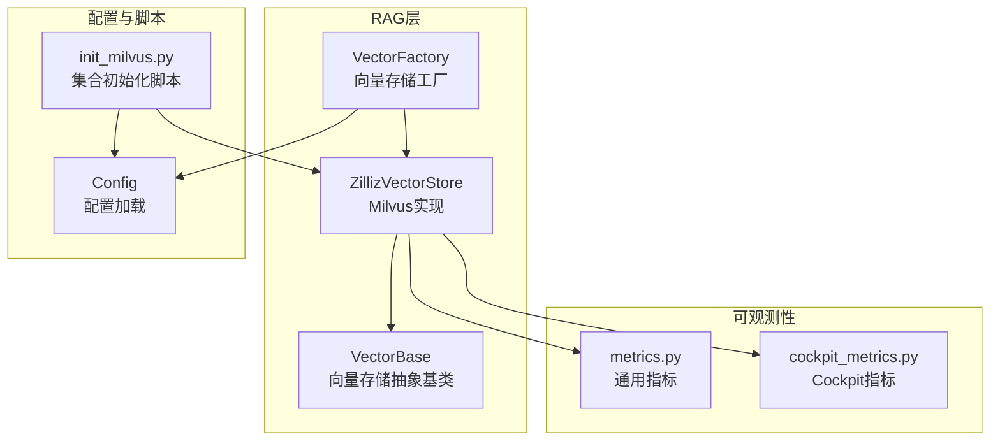
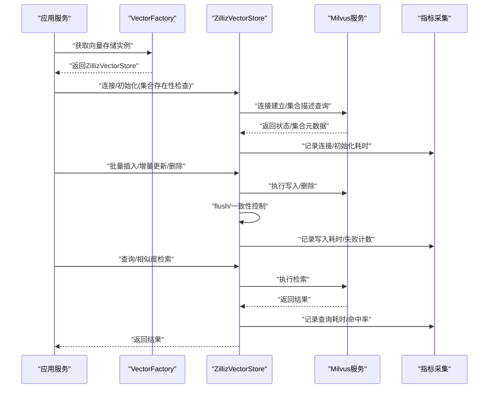
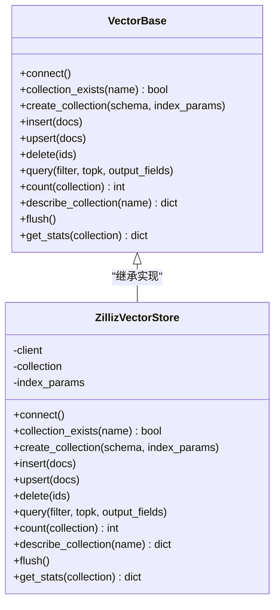
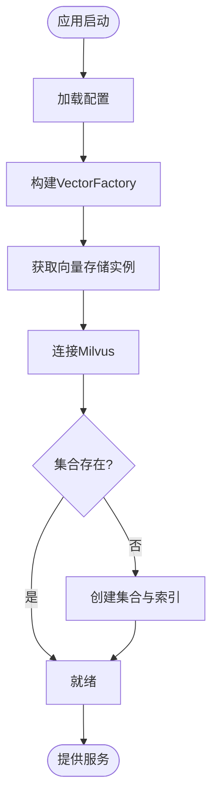
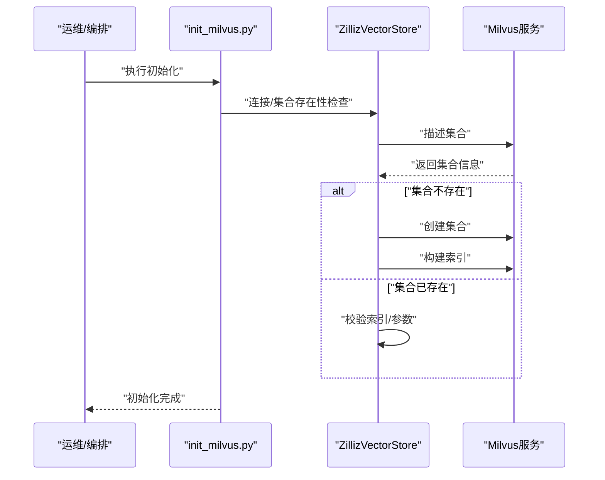
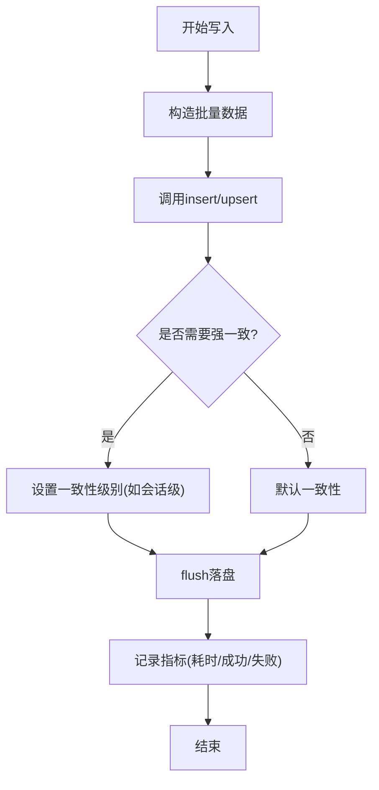
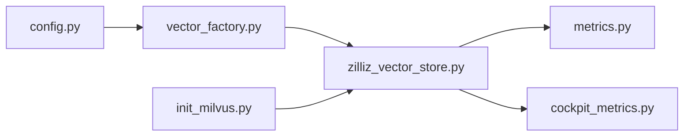
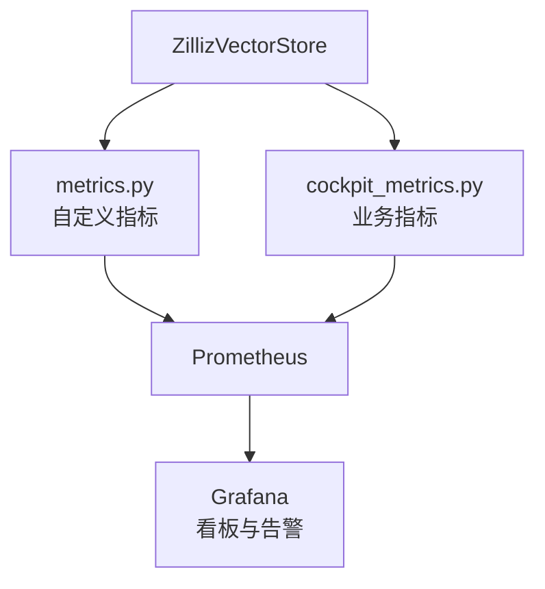

# 集合管理操作

<cite>
**本文引用的文件**   
- [zilliz_vector_store.py](file://backend_design/nexus/rag/zilliz_vector_store.py)
- [vector_base.py](file://backend_design/nexus/rag/vector_base.py)
- [vector_factory.py](file://backend_design/nexus/rag/vector_factory.py)
- [init_milvus.py](file://backend_design/scripts/init_milvus.py)
- [config.py](file://backend_design/nexus/config.py)
- [metrics.py](file://backend_design/nexus/observability/metrics.py)
- [cockpit_metrics.py](file://backend_design/nexus/observability/cockpit_metrics.py)
</cite>

## 目录
1. [简介](#简介)
2. [项目结构](#项目结构)
3. [核心组件](#核心组件)
4. [架构总览](#架构总览)
5. [详细组件分析](#详细组件分析)
6. [依赖关系分析](#依赖关系分析)
7. [性能与一致性](#性能与一致性)
8. [故障恢复与备份恢复](#故障恢复与备份恢复)
9. [监控与统计](#监控与统计)
10. [结论](#结论)

## 简介
本技术文档聚焦于Milvus集合的生命周期管理与数据操作，覆盖连接建立、集合创建与自动初始化、文档的增删改查（含批量插入、增量更新与删除策略）、数据持久化（flush）与一致性保证、集合统计信息获取与监控指标收集，以及故障恢复与数据备份恢复方案。文档面向具备基础向量检索知识的读者，力求以循序渐进的方式呈现从架构到实现细节的全景视图。

## 项目结构
与Milvus集合管理相关的代码主要位于RAG模块与脚本中：
- RAG层提供统一的向量存储抽象与具体实现（Zilliz/Milvus），并通过工厂进行实例化。
- 脚本负责环境初始化（如集合创建）。
- 配置模块集中管理Milvus连接参数。
- 可观测性模块暴露系统指标，便于监控与告警。

**图表来源**
- [vector_factory.py](file://backend_design/nexus/rag/vector_factory.py)
- [vector_base.py](file://backend_design/nexus/rag/vector_base.py)
- [zilliz_vector_store.py](file://backend_design/nexus/rag/zilliz_vector_store.py)
- [config.py](file://backend_design/nexus/config.py)
- [init_milvus.py](file://backend_design/scripts/init_milvus.py)
- [metrics.py](file://backend_design/nexus/observability/metrics.py)
- [cockpit_metrics.py](file://backend_design/nexus/observability/cockpit_metrics.py)

**章节来源**
- [vector_factory.py](file://backend_design/nexus/rag/vector_factory.py)
- [vector_base.py](file://backend_design/nexus/rag/vector_base.py)
- [zilliz_vector_store.py](file://backend_design/nexus/rag/zilliz_vector_store.py)
- [config.py](file://backend_design/nexus/config.py)
- [init_milvus.py](file://backend_design/scripts/init_milvus.py)
- [metrics.py](file://backend_design/nexus/observability/metrics.py)
- [cockpit_metrics.py](file://backend_design/nexus/observability/cockpit_metrics.py)

## 核心组件
- 向量存储抽象基类：定义统一的集合生命周期与CRUD接口契约，包括连接、集合存在性检查、创建、索引构建、插入、查询、删除、统计等。
- Milvus实现：基于Milvus SDK封装上述接口，处理连接参数、集合模式、字段映射、索引类型、分区策略、flush与一致性级别等。
- 工厂：根据配置选择并返回具体的向量存储实现（当前为Milvus）。
- 初始化脚本：在部署或启动时确保目标集合存在并完成必要索引。
- 配置：集中管理Milvus连接地址、认证、集合名、维度、索引类型等关键参数。
- 可观测性：记录向量操作的耗时、错误率、队列长度等指标，支撑监控与排障。

**章节来源**
- [vector_base.py](file://backend_design/nexus/rag/vector_base.py)
- [zilliz_vector_store.py](file://backend_design/nexus/rag/zilliz_vector_store.py)
- [vector_factory.py](file://backend_design/nexus/rag/vector_factory.py)
- [init_milvus.py](file://backend_design/scripts/init_milvus.py)
- [config.py](file://backend_design/nexus/config.py)
- [metrics.py](file://backend_design/nexus/observability/metrics.py)
- [cockpit_metrics.py](file://backend_design/nexus/observability/cockpit_metrics.py)

## 架构总览
下图展示了从上层调用到Milvus的数据流与控制流，涵盖连接建立、集合初始化、写入与读取路径。

**图表来源**
- [vector_factory.py](file://backend_design/nexus/rag/vector_factory.py)
- [zilliz_vector_store.py](file://backend_design/nexus/rag/zilliz_vector_store.py)
- [metrics.py](file://backend_design/nexus/observability/metrics.py)
- [cockpit_metrics.py](file://backend_design/nexus/observability/cockpit_metrics.py)

## 详细组件分析

### 组件A：向量存储抽象与实现
本节对向量存储抽象基类与Milvus实现进行深度解析，重点说明集合生命周期与CRUD语义。

要点说明
- 连接建立：通过配置中的连接参数完成客户端初始化；支持重试与超时控制。
- 集合存在性与自动初始化：若集合不存在则按schema与索引参数创建；必要时构建索引。
- 插入与更新：
  - 批量插入：将一批文档转换为Milvus行格式后一次性写入，减少网络往返。
  - 增量更新：采用upsert语义，依据主键或业务ID判断是否存在，存在则更新，不存在则插入。
- 删除策略：支持按主键列表删除；对于软删除场景可在schema中保留标记字段并在查询过滤中排除。
- 查询：支持标量过滤与向量相似度检索，返回top-k结果及可选输出字段。
- 统计信息：提供集合行数、大小、索引信息等元数据查询能力。
- flush与一致性：写入后可触发flush以确保落盘；结合一致性级别（如会话级）保障读一致。

**图表来源**
- [vector_base.py](file://backend_design/nexus/rag/vector_base.py)
- [zilliz_vector_store.py](file://backend_design/nexus/rag/zilliz_vector_store.py)

**章节来源**
- [vector_base.py](file://backend_design/nexus/rag/vector_base.py)
- [zilliz_vector_store.py](file://backend_design/nexus/rag/zilliz_vector_store.py)

### 组件B：工厂与配置
- 工厂根据配置决定使用Milvus实现，统一对外暴露相同的接口。
- 配置项包含连接地址、认证、集合名称、向量维度、索引类型、分区策略等。

**图表来源**
- [vector_factory.py](file://backend_design/nexus/rag/vector_factory.py)
- [config.py](file://backend_design/nexus/config.py)

**章节来源**
- [vector_factory.py](file://backend_design/nexus/rag/vector_factory.py)
- [config.py](file://backend_design/nexus/config.py)

### 组件C：初始化脚本
- 初始化脚本用于在部署阶段确保集合存在并完成必要的索引构建。
- 通常由运维流程或容器启动钩子触发，避免运行时首次请求延迟。

**图表来源**
- [init_milvus.py](file://backend_design/scripts/init_milvus.py)
- [zilliz_vector_store.py](file://backend_design/nexus/rag/zilliz_vector_store.py)

**章节来源**
- [init_milvus.py](file://backend_design/scripts/init_milvus.py)
- [zilliz_vector_store.py](file://backend_design/nexus/rag/zilliz_vector_store.py)

### 组件D：写入与一致性流程
本节给出批量插入与flush的一致性保障流程。

**图表来源**
- [zilliz_vector_store.py](file://backend_design/nexus/rag/zilliz_vector_store.py)
- [metrics.py](file://backend_design/nexus/observability/metrics.py)

**章节来源**
- [zilliz_vector_store.py](file://backend_design/nexus/rag/zilliz_vector_store.py)
- [metrics.py](file://backend_design/nexus/observability/metrics.py)

## 依赖关系分析
- 耦合与内聚
  - ZillizVectorStore与Milvus SDK紧密耦合，但通过VectorBase抽象屏蔽差异，提升内聚性。
  - 工厂与配置松耦合，便于扩展新的向量后端。
- 外部依赖
  - Milvus服务端：提供集合、索引、查询与统计能力。
  - 指标采集：Prometheus/Grafana生态（通过指标导出）。
- 潜在循环依赖
  - 当前分层清晰，未见循环导入风险。

**图表来源**
- [config.py](file://backend_design/nexus/config.py)
- [vector_factory.py](file://backend_design/nexus/rag/vector_factory.py)
- [zilliz_vector_store.py](file://backend_design/nexus/rag/zilliz_vector_store.py)
- [metrics.py](file://backend_design/nexus/observability/metrics.py)
- [cockpit_metrics.py](file://backend_design/nexus/observability/cockpit_metrics.py)
- [init_milvus.py](file://backend_design/scripts/init_milvus.py)

**章节来源**
- [config.py](file://backend_design/nexus/config.py)
- [vector_factory.py](file://backend_design/nexus/rag/vector_factory.py)
- [zilliz_vector_store.py](file://backend_design/nexus/rag/zilliz_vector_store.py)
- [metrics.py](file://backend_design/nexus/observability/metrics.py)
- [cockpit_metrics.py](file://backend_design/nexus/observability/cockpit_metrics.py)
- [init_milvus.py](file://backend_design/scripts/init_milvus.py)

## 性能与一致性
- 批量写入
  - 建议合并小批次为大批次以降低网络开销与索引压力。
  - 合理设置批大小，平衡吞吐与时延。
- 索引与查询
  - 根据数据规模与QPS选择合适索引类型（如HNSW、IVF_FLAT等）。
  - 调整topk与输出字段，减少不必要的数据传输。
- Flush与一致性
  - 在高吞吐场景下，可按需异步flush；对强一致需求开启会话级一致性。
  - 注意flush带来的写放大与延迟抖动。
- 资源规划
  - 预估向量维度、集合规模与索引内存占用，预留足够CPU/内存。
  - 关注Milvus节点磁盘IO与网络带宽瓶颈。

[本节为通用指导，不直接分析具体文件]

## 故障恢复与备份恢复
- 连接与集合异常
  - 连接失败：实现重试与退避策略；健康检查端点暴露连接状态。
  - 集合缺失：启动时自动检测并创建；初始化脚本作为兜底。
- 写入失败与幂等
  - 对upsert操作天然具备幂等性；对insert需引入去重键或幂等标识。
  - 失败重试需考虑重复写入风险，结合唯一约束或幂等表。
- 数据一致性
  - 读写分离场景下，优先使用会话级一致性或等待flush完成后再读。
- 备份与恢复
  - 利用Milvus提供的备份工具或底层对象存储快照进行冷备。
  - 定期全量+增量备份；恢复前校验集合元数据与索引完整性。
- 灾难恢复演练
  - 定期演练恢复流程，验证RTO/RPO是否满足SLA。

[本节为通用指导，不直接分析具体文件]

## 监控与统计
- 指标采集
  - 记录连接建立耗时、集合初始化耗时、写入/查询P95/P99、错误率、flush耗时等。
  - 暴露标准指标端点供Prometheus抓取。
- 集合统计
  - 获取集合行数、文件大小、索引信息、分区分布等元数据。
- 可视化与告警
  - 基于Grafana构建看板，设置阈值告警（如错误率突增、延迟飙升）。

**图表来源**
- [zilliz_vector_store.py](file://backend_design/nexus/rag/zilliz_vector_store.py)
- [metrics.py](file://backend_design/nexus/observability/metrics.py)
- [cockpit_metrics.py](file://backend_design/nexus/observability/cockpit_metrics.py)

**章节来源**
- [metrics.py](file://backend_design/nexus/observability/metrics.py)
- [cockpit_metrics.py](file://backend_design/nexus/observability/cockpit_metrics.py)
- [zilliz_vector_store.py](file://backend_design/nexus/rag/zilliz_vector_store.py)

## 结论
通过对向量存储抽象、Milvus实现、工厂与配置的解耦设计，本项目实现了集合生命周期的统一管理、稳定的CRUD能力与完善的可观测性。在生产环境中，建议结合批量写入、合理的索引策略与一致性级别，配合初始化脚本与监控告警，达成高可用、高性能与易维护的目标。同时，完善备份恢复与演练机制，进一步提升系统的韧性与可靠性。