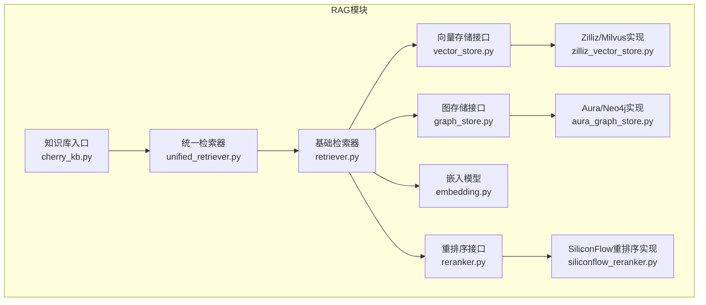
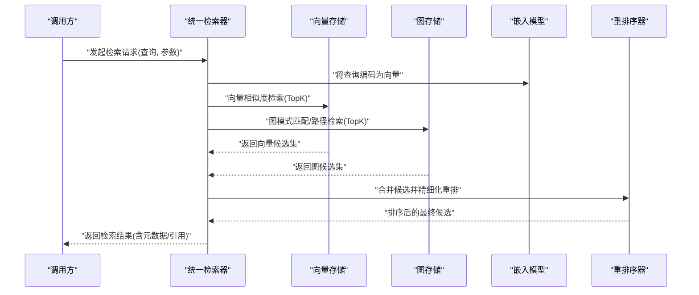
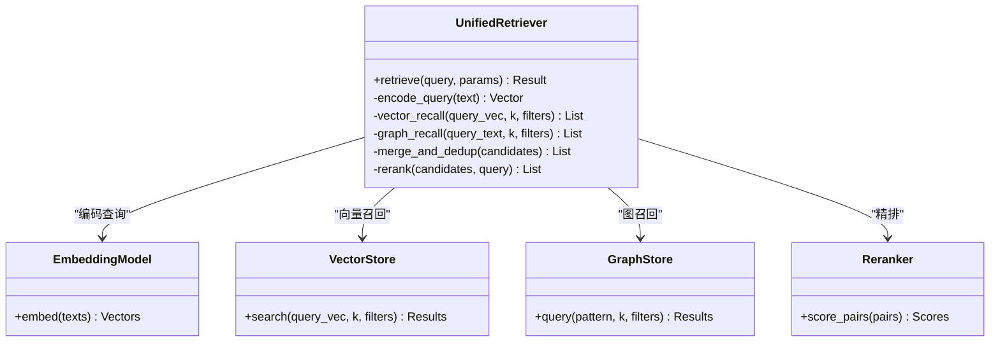
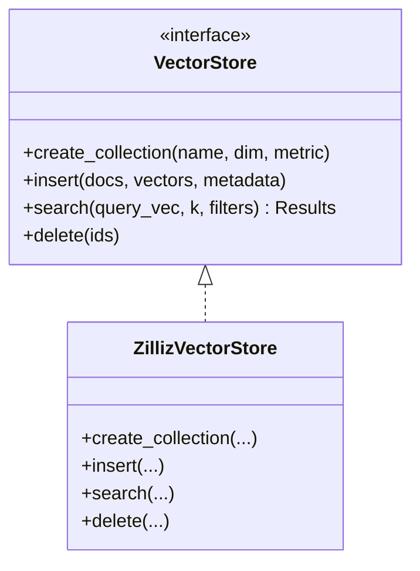
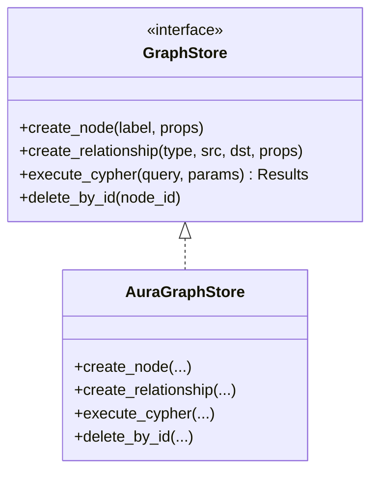
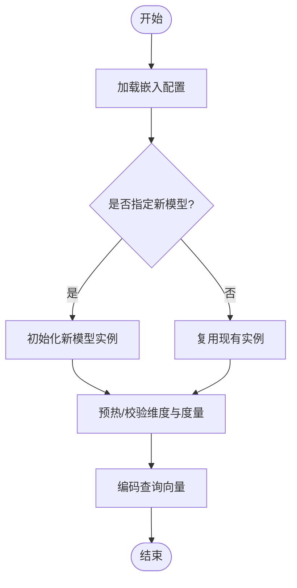
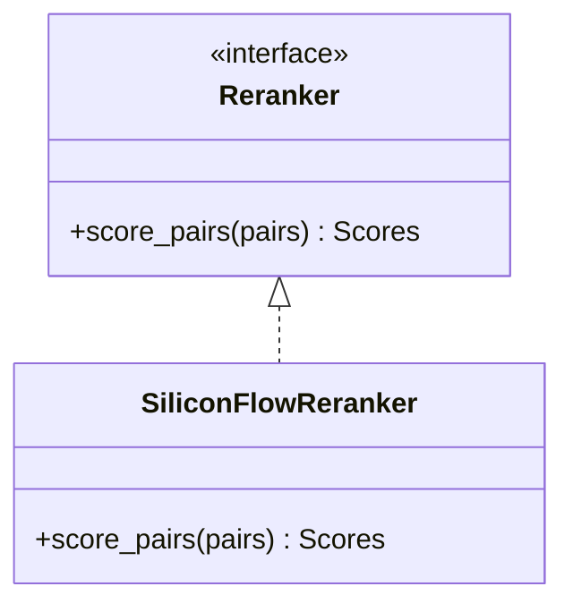
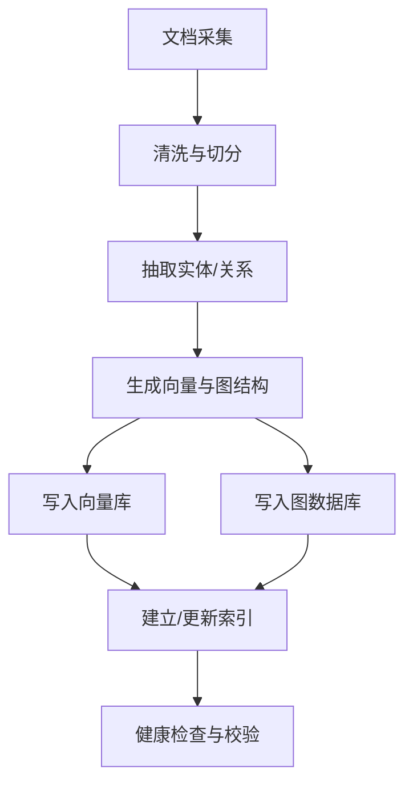
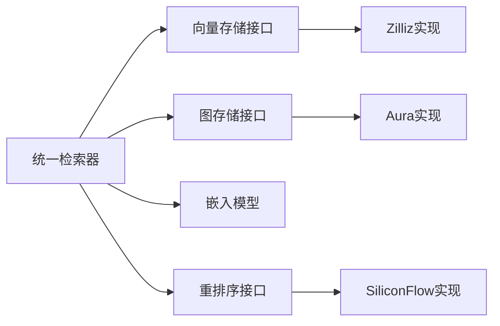

# RAG检索增强系统

<cite>
**本文引用的文件**   
- [backend_design/nexus/rag/unified_retriever.py](file://backend_design/nexus/rag/unified_retriever.py)
- [backend_design/nexus/rag/retriever.py](file://backend_design/nexus/rag/retriever.py)
- [backend_design/nexus/rag/vector_store.py](file://backend_design/nexus/rag/vector_store.py)
- [backend_design/nexus/rag/zilliz_vector_store.py](file://backend_design/nexus/rag/zilliz_vector_store.py)
- [backend_design/nexus/rag/graph_store.py](file://backend_design/nexus/rag/graph_store.py)
- [backend_design/nexus/rag/aura_graph_store.py](file://backend_design/nexus/rag/aura_graph_store.py)
- [backend_design/nexus/rag/embedding.py](file://backend_design/nexus/rag/embedding.py)
- [backend_design/nexus/rag/reranker.py](file://backend_design/nexus/rag/reranker.py)
- [backend_design/nexus/rag/siliconflow_reranker.py](file://backend_design/nexus/rag/siliconflow_reranker.py)
- [backend_design/nexus/rag/cherry_kb.py](file://backend_design/nexus/rag/cherry_kb.py)
- [backend_design/nexus/config.py](file://backend_design/nexus/config.py)
- [scripts/init_milvus.py](file://scripts/init_milvus.py)
- [scripts/init_neo4j.py](file://scripts/init_neo4j.py)
</cite>

## 目录
1. [简介](#简介)
2. [项目结构](#项目结构)
3. [核心组件](#核心组件)
4. [架构总览](#架构总览)
5. [详细组件分析](#详细组件分析)
6. [依赖关系分析](#依赖关系分析)
7. [性能考虑](#性能考虑)
8. [故障排查指南](#故障排查指南)
9. [结论](#结论)
10. [附录](#附录)

## 简介
本技术文档围绕RAG（检索增强生成）子系统，系统性阐述向量数据库与图数据库的集成架构、统一检索器的多路召回策略与结果融合算法、嵌入模型的配置与替换机制、重排序器的优化策略与性能调优方法、知识库构建流程与更新机制，以及不同后端（如Milvus、Neo4j等）的配置与使用指南。同时提供检索效果评估方法与索引优化建议，帮助读者快速理解并高效落地生产环境。

## 项目结构
RAG相关代码集中在 backend_design/nexus/rag 目录下，采用“接口抽象 + 工厂/后端实现”的分层组织方式：
- 接口与抽象层：定义统一的向量存储、图存储、嵌入、重排序、检索器接口
- 后端实现层：针对Milvus、Neo4j/Aura等具体后端的适配实现
- 编排与融合层：统一检索器负责多路召回与结果融合
- 配置与脚本：集中式配置与初始化脚本

图表来源
- [backend_design/nexus/rag/unified_retriever.py](file://backend_design/nexus/rag/unified_retriever.py)
- [backend_design/nexus/rag/retriever.py](file://backend_design/nexus/rag/retriever.py)
- [backend_design/nexus/rag/vector_store.py](file://backend_design/nexus/rag/vector_store.py)
- [backend_design/nexus/rag/zilliz_vector_store.py](file://backend_design/nexus/rag/zilliz_vector_store.py)
- [backend_design/nexus/rag/graph_store.py](file://backend_design/nexus/rag/graph_store.py)
- [backend_design/nexus/rag/aura_graph_store.py](file://backend_design/nexus/rag/aura_graph_store.py)
- [backend_design/nexus/rag/embedding.py](file://backend_design/nexus/rag/embedding.py)
- [backend_design/nexus/rag/reranker.py](file://backend_design/nexus/rag/reranker.py)
- [backend_design/nexus/rag/siliconflow_reranker.py](file://backend_design/nexus/rag/siliconflow_reranker.py)
- [backend_design/nexus/rag/cherry_kb.py](file://backend_design/nexus/rag/cherry_kb.py)

章节来源
- [backend_design/nexus/rag/unified_retriever.py](file://backend_design/nexus/rag/unified_retriever.py)
- [backend_design/nexus/rag/retriever.py](file://backend_design/nexus/rag/retriever.py)
- [backend_design/nexus/rag/vector_store.py](file://backend_design/nexus/rag/vector_store.py)
- [backend_design/nexus/rag/zilliz_vector_store.py](file://backend_design/nexus/rag/zilliz_vector_store.py)
- [backend_design/nexus/rag/graph_store.py](file://backend_design/nexus/rag/graph_store.py)
- [backend_design/nexus/rag/aura_graph_store.py](file://backend_design/nexus/rag/aura_graph_store.py)
- [backend_design/nexus/rag/embedding.py](file://backend_design/nexus/rag/embedding.py)
- [backend_design/nexus/rag/reranker.py](file://backend_design/nexus/rag/reranker.py)
- [backend_design/nexus/rag/siliconflow_reranker.py](file://backend_design/nexus/rag/siliconflow_reranker.py)
- [backend_design/nexus/rag/cherry_kb.py](file://backend_design/nexus/rag/cherry_kb.py)

## 核心组件
- 统一检索器：协调向量与图双通道检索，执行多路召回与结果融合，输出最终候选集供下游LLM消费
- 向量存储：面向相似性搜索的高维向量索引，支持Milvus/Zilliz等后端
- 图存储：面向实体与关系的结构化查询，支持Neo4j/Aura等后端
- 嵌入模型：将文本转换为向量表示，支持可插拔配置与替换
- 重排序器：对召回候选进行精细相关性打分与排序，提升最终质量
- 知识库入口：对外暴露知识入库、更新、删除等能力，串联构建与生命周期管理

章节来源
- [backend_design/nexus/rag/unified_retriever.py](file://backend_design/nexus/rag/unified_retriever.py)
- [backend_design/nexus/rag/vector_store.py](file://backend_design/nexus/rag/vector_store.py)
- [backend_design/nexus/rag/zilliz_vector_store.py](file://backend_design/nexus/rag/zilliz_vector_store.py)
- [backend_design/nexus/rag/graph_store.py](file://backend_design/nexus/rag/graph_store.py)
- [backend_design/nexus/rag/aura_graph_store.py](file://backend_design/nexus/rag/aura_graph_store.py)
- [backend_design/nexus/rag/embedding.py](file://backend_design/nexus/rag/embedding.py)
- [backend_design/nexus/rag/reranker.py](file://backend_design/nexus/rag/reranker.py)
- [backend_design/nexus/rag/siliconflow_reranker.py](file://backend_design/nexus/rag/siliconflow_reranker.py)
- [backend_design/nexus/rag/cherry_kb.py](file://backend_design/nexus/rag/cherry_kb.py)

## 架构总览
下图展示了从用户查询到最终答案的关键数据流与控制流，包括多路召回、重排序与结果融合。

图表来源
- [backend_design/nexus/rag/unified_retriever.py](file://backend_design/nexus/rag/unified_retriever.py)
- [backend_design/nexus/rag/vector_store.py](file://backend_design/nexus/rag/vector_store.py)
- [backend_design/nexus/rag/zilliz_vector_store.py](file://backend_design/nexus/rag/zilliz_vector_store.py)
- [backend_design/nexus/rag/graph_store.py](file://backend_design/nexus/rag/graph_store.py)
- [backend_design/nexus/rag/aura_graph_store.py](file://backend_design/nexus/rag/aura_graph_store.py)
- [backend_design/nexus/rag/embedding.py](file://backend_design/nexus/rag/embedding.py)
- [backend_design/nexus/rag/reranker.py](file://backend_design/nexus/rag/reranker.py)
- [backend_design/nexus/rag/siliconflow_reranker.py](file://backend_design/nexus/rag/siliconflow_reranker.py)

## 详细组件分析

### 统一检索器与多路召回
统一检索器承担以下职责：
- 解析查询意图，选择或组合向量与图两种检索通道
- 控制各通道的TopK、过滤条件、权重分配
- 合并两路候选，去重与多样性控制
- 调用重排序器进行精排，输出最终结果

图表来源
- [backend_design/nexus/rag/unified_retriever.py](file://backend_design/nexus/rag/unified_retriever.py)
- [backend_design/nexus/rag/embedding.py](file://backend_design/nexus/rag/embedding.py)
- [backend_design/nexus/rag/vector_store.py](file://backend_design/nexus/rag/vector_store.py)
- [backend_design/nexus/rag/graph_store.py](file://backend_design/nexus/rag/graph_store.py)
- [backend_design/nexus/rag/reranker.py](file://backend_design/nexus/rag/reranker.py)

章节来源
- [backend_design/nexus/rag/unified_retriever.py](file://backend_design/nexus/rag/unified_retriever.py)
- [backend_design/nexus/rag/retriever.py](file://backend_design/nexus/rag/retriever.py)

### 向量存储后端（Milvus/Zilliz）
- 接口抽象：定义集合/索引创建、插入、搜索、删除等通用操作
- 后端实现：基于Milvus/Zilliz SDK封装连接、索引类型、度量方式、分区/标签过滤等
- 关键配置：维度、索引类型（HNSW/IVF_FLAT等）、度量（IP/COSINE）、TopK、过滤表达式

图表来源
- [backend_design/nexus/rag/vector_store.py](file://backend_design/nexus/rag/vector_store.py)
- [backend_design/nexus/rag/zilliz_vector_store.py](file://backend_design/nexus/rag/zilliz_vector_store.py)

章节来源
- [backend_design/nexus/rag/vector_store.py](file://backend_design/nexus/rag/vector_store.py)
- [backend_design/nexus/rag/zilliz_vector_store.py](file://backend_design/nexus/rag/zilliz_vector_store.py)

### 图存储后端（Neo4j/Aura）
- 接口抽象：定义节点/关系增删改查、Cypher查询封装、事务边界
- 后端实现：对接Neo4j/Aura驱动，处理认证、连接池、超时与重试
- 典型用法：实体抽取、关系遍历、路径检索、属性过滤

图表来源
- [backend_design/nexus/rag/graph_store.py](file://backend_design/nexus/rag/graph_store.py)
- [backend_design/nexus/rag/aura_graph_store.py](file://backend_design/nexus/rag/aura_graph_store.py)

章节来源
- [backend_design/nexus/rag/graph_store.py](file://backend_design/nexus/rag/graph_store.py)
- [backend_design/nexus/rag/aura_graph_store.py](file://backend_design/nexus/rag/aura_graph_store.py)

### 嵌入模型配置与替换机制
- 配置项：模型名称、维度、归一化开关、批大小、设备（CPU/GPU）、缓存策略
- 替换机制：通过配置切换不同嵌入模型；在检索前将文本编码为向量，保证与向量库度量一致
- 最佳实践：离线批量编码入库，在线仅做查询编码；大模型优先GPU加速

图表来源
- [backend_design/nexus/rag/embedding.py](file://backend_design/nexus/rag/embedding.py)
- [backend_design/nexus/config.py](file://backend_design/nexus/config.py)

章节来源
- [backend_design/nexus/rag/embedding.py](file://backend_design/nexus/rag/embedding.py)
- [backend_design/nexus/config.py](file://backend_design/nexus/config.py)

### 重排序器优化策略与性能调优
- 策略：对召回候选与查询进行细粒度相关性打分；支持本地模型与远程服务（如SiliconFlow）
- 优化：批量打分、异步并发、结果截断、阈值过滤、缓存热点问答
- 指标：NDCG@K、Recall@K、MRR、时延P95/P99

图表来源
- [backend_design/nexus/rag/reranker.py](file://backend_design/nexus/rag/reranker.py)
- [backend_design/nexus/rag/siliconflow_reranker.py](file://backend_design/nexus/rag/siliconflow_reranker.py)

章节来源
- [backend_design/nexus/rag/reranker.py](file://backend_design/nexus/rag/reranker.py)
- [backend_design/nexus/rag/siliconflow_reranker.py](file://backend_design/nexus/rag/siliconflow_reranker.py)

### 知识库构建流程与更新机制
- 构建流程：文档切分 -> 元数据标注 -> 向量化 -> 入库（向量+图）-> 索引优化
- 更新机制：增量写入、版本化、冲突合并、回滚快照
- 入口：cherry_kb.py 提供统一API，屏蔽底层差异

图表来源
- [backend_design/nexus/rag/cherry_kb.py](file://backend_design/nexus/rag/cherry_kb.py)
- [backend_design/nexus/rag/vector_store.py](file://backend_design/nexus/rag/vector_store.py)
- [backend_design/nexus/rag/graph_store.py](file://backend_design/nexus/rag/graph_store.py)

章节来源
- [backend_design/nexus/rag/cherry_kb.py](file://backend_design/nexus/rag/cherry_kb.py)

## 依赖关系分析
- 低耦合高内聚：接口与实现分离，便于替换后端与扩展新能力
- 外部依赖：Milvus/Zilliz、Neo4j/Aura、嵌入模型服务、重排序服务
- 潜在风险：跨服务调用失败、索引不一致、模型维度不匹配

图表来源
- [backend_design/nexus/rag/unified_retriever.py](file://backend_design/nexus/rag/unified_retriever.py)
- [backend_design/nexus/rag/vector_store.py](file://backend_design/nexus/rag/vector_store.py)
- [backend_design/nexus/rag/zilliz_vector_store.py](file://backend_design/nexus/rag/zilliz_vector_store.py)
- [backend_design/nexus/rag/graph_store.py](file://backend_design/nexus/rag/graph_store.py)
- [backend_design/nexus/rag/aura_graph_store.py](file://backend_design/nexus/rag/aura_graph_store.py)
- [backend_design/nexus/rag/embedding.py](file://backend_design/nexus/rag/embedding.py)
- [backend_design/nexus/rag/reranker.py](file://backend_design/nexus/rag/reranker.py)
- [backend_design/nexus/rag/siliconflow_reranker.py](file://backend_design/nexus/rag/siliconflow_reranker.py)

章节来源
- [backend_design/nexus/rag/unified_retriever.py](file://backend_design/nexus/rag/unified_retriever.py)
- [backend_design/nexus/rag/vector_store.py](file://backend_design/nexus/rag/vector_store.py)
- [backend_design/nexus/rag/zilliz_vector_store.py](file://backend_design/nexus/rag/zilliz_vector_store.py)
- [backend_design/nexus/rag/graph_store.py](file://backend_design/nexus/rag/graph_store.py)
- [backend_design/nexus/rag/aura_graph_store.py](file://backend_design/nexus/rag/aura_graph_store.py)
- [backend_design/nexus/rag/embedding.py](file://backend_design/nexus/rag/embedding.py)
- [backend_design/nexus/rag/reranker.py](file://backend_design/nexus/rag/reranker.py)
- [backend_design/nexus/rag/siliconflow_reranker.py](file://backend_design/nexus/rag/siliconflow_reranker.py)

## 性能考虑
- 向量索引
  - 根据数据规模与延迟目标选择合适的索引类型（如HNSW/IVF_FLAT）
  - 合理设置TopK与过滤条件，减少扫描范围
  - 定期重建索引以平衡召回率与时延
- 图查询
  - 预建索引与约束，避免全表扫描
  - 限制遍历深度与返回条数，必要时分页
- 嵌入与重排序
  - 批量编码与打分，利用GPU/并行加速
  - 对高频查询启用缓存，降低重复计算
- 资源与容量
  - 监控内存、磁盘与网络IO，预留缓冲
  - 按QPS与峰值流量规划副本与分区

[本节为通用指导，无需特定文件来源]

## 故障排查指南
- 连接问题
  - 检查Milvus/Zilliz与Neo4j/Aura的连接参数、证书与权限
  - 确认端口、防火墙与代理设置
- 索引不一致
  - 对比向量维度与度量是否与嵌入模型一致
  - 验证图节点/关系键与约束是否完整
- 性能退化
  - 观察TopK、过滤条件与索引参数是否合理
  - 检查重排序服务的吞吐与延迟
- 日志与观测
  - 记录关键步骤耗时与错误码
  - 结合指标看板定位瓶颈

章节来源
- [backend_design/nexus/rag/vector_store.py](file://backend_design/nexus/rag/vector_store.py)
- [backend_design/nexus/rag/zilliz_vector_store.py](file://backend_design/nexus/rag/zilliz_vector_store.py)
- [backend_design/nexus/rag/graph_store.py](file://backend_design/nexus/rag/graph_store.py)
- [backend_design/nexus/rag/aura_graph_store.py](file://backend_design/nexus/rag/aura_graph_store.py)
- [backend_design/nexus/rag/embedding.py](file://backend_design/nexus/rag/embedding.py)
- [backend_design/nexus/rag/reranker.py](file://backend_design/nexus/rag/reranker.py)
- [backend_design/nexus/rag/siliconflow_reranker.py](file://backend_design/nexus/rag/siliconflow_reranker.py)

## 结论
本RAG检索增强系统通过统一检索器整合向量与图双通道检索，配合可插拔的嵌入模型与重排序器，实现了灵活、可扩展且高性能的知识检索方案。借助标准化的接口与后端实现，系统可在不同部署环境下稳定运行，并提供完善的构建、更新与运维能力。

[本节为总结性内容，无需特定文件来源]

## 附录

### 后端配置与使用指南
- Milvus/Zilliz
  - 连接参数：地址、端口、认证信息
  - 集合与索引：维度、度量、索引类型、分区策略
  - 初始化脚本：参考 scripts/init_milvus.py
- Neo4j/Aura
  - 连接参数：URI、用户名、密码、数据库名
  - 图模型：节点标签、关系类型、必要索引与约束
  - 初始化脚本：参考 scripts/init_neo4j.py

章节来源
- [scripts/init_milvus.py](file://scripts/init_milvus.py)
- [scripts/init_neo4j.py](file://scripts/init_neo4j.py)

### 检索效果评估与索引优化建议
- 评估指标
  - 召回率（Recall@K）、命中率（Hit Rate）、平均倒数排名（MRR）、NDCG@K
  - 端到端时延（P95/P99）、吞吐量（QPS）
- 实验设计
  - 构建测试集（查询-标准答案/相关片段）
  - 固定嵌入与重排序，对比不同向量索引与TopK
  - 对比图检索参与与否对结果的影响
- 优化建议
  - 调整TopK与过滤条件，平衡召回与精度
  - 引入重排序阈值与多样性惩罚，抑制冗余
  - 定期评估并滚动更新索引与模型版本

[本节为通用指导，无需特定文件来源]