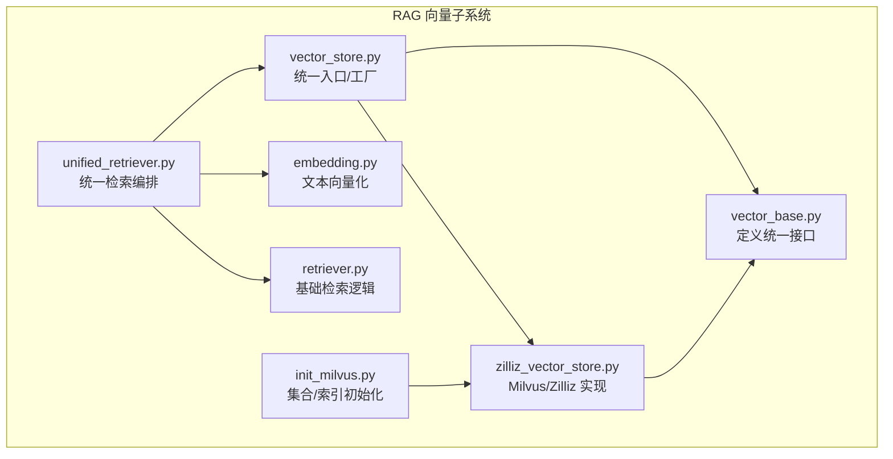
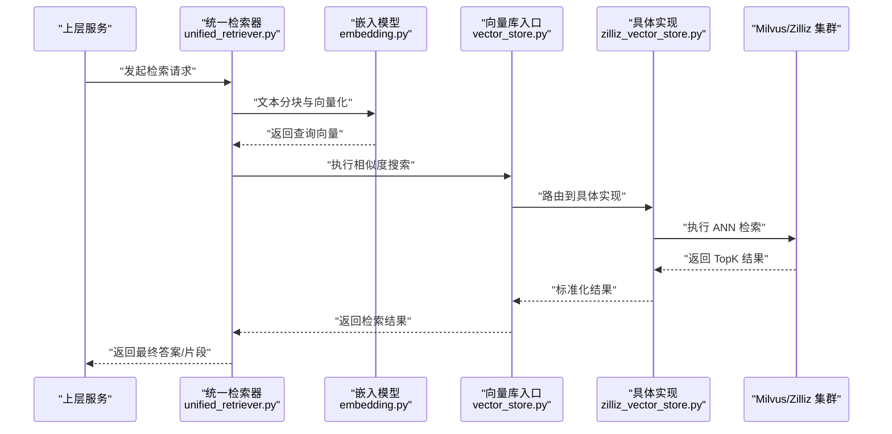
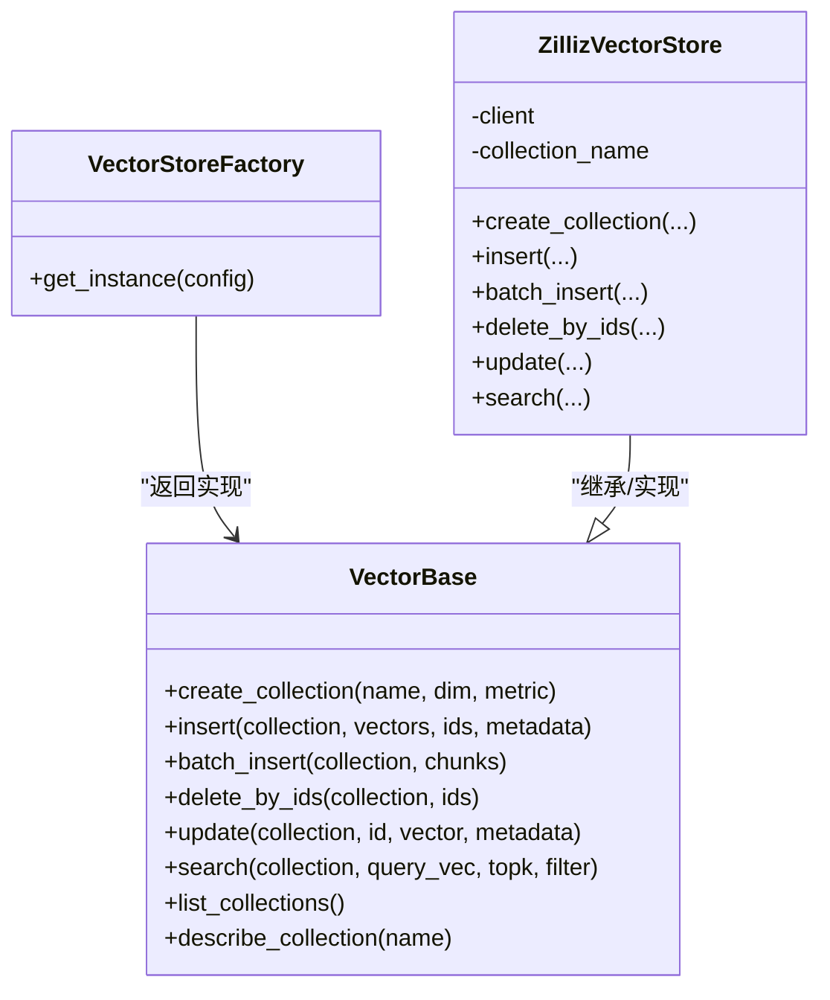
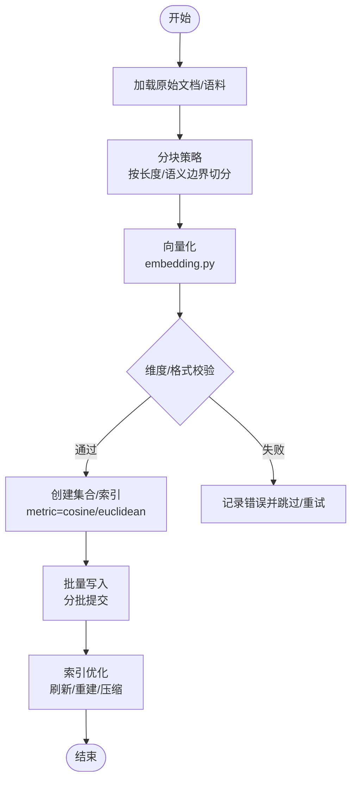
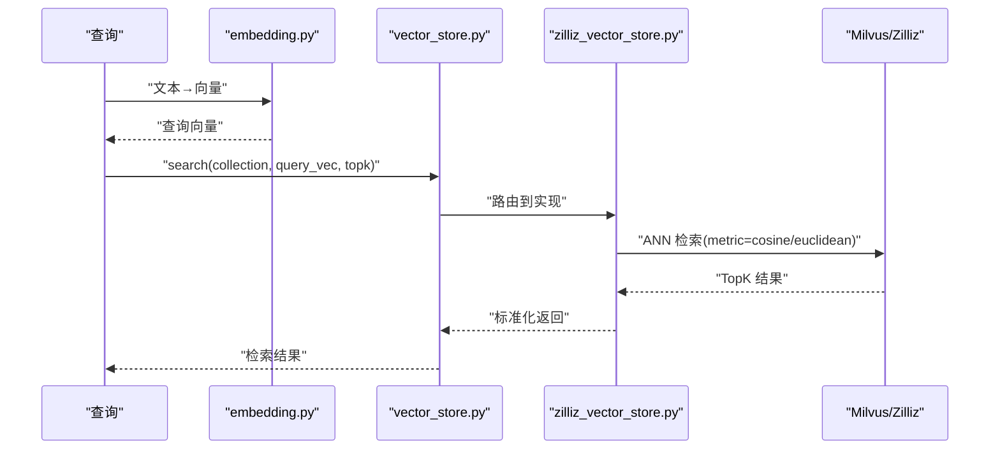
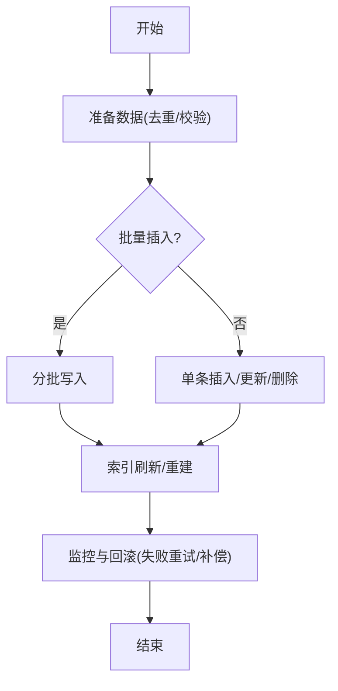
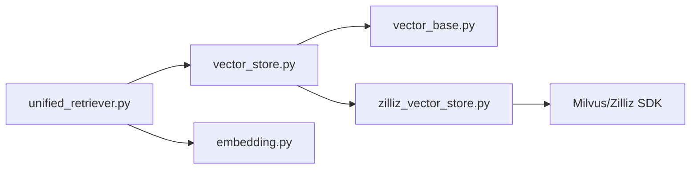

# 向量数据库存储

<cite>
**本文引用的文件**   
- [backend_design/nexus/rag/vector_base.py](file://backend_design/nexus/rag/vector_base.py)
- [backend_design/nexus/rag/vector_store.py](file://backend_design/nexus/rag/vector_store.py)
- [backend_design/nexus/rag/zilliz_vector_store.py](file://backend_design/nexus/rag/zilliz_vector_store.py)
- [backend_design/nexus/rag/embedding.py](file://backend_design/nexus/rag/embedding.py)
- [backend_design/nexus/rag/unified_retriever.py](file://backend_design/nexus/rag/unified_retriever.py)
- [backend_design/nexus/rag/retriever.py](file://backend_design/nexus/rag/retriever.py)
- [backend_design/scripts/init_milvus.py](file://backend_design/scripts/init_milvus.py)
</cite>

## 目录
1. [简介](#简介)
2. [项目结构](#项目结构)
3. [核心组件](#核心组件)
4. [架构总览](#架构总览)
5. [详细组件分析](#详细组件分析)
6. [依赖关系分析](#依赖关系分析)
7. [性能考虑](#性能考虑)
8. [故障排查指南](#故障排查指南)
9. [结论](#结论)
10. [附录](#附录)

## 简介
本技术文档聚焦于向量数据库存储子系统，围绕以下目标展开：
- 向量数据的索引构建过程：分块策略、向量化处理与索引优化
- 相似度搜索算法：余弦相似度、欧氏距离等度量方法的选择与应用
- 向量数据增删改操作：批量插入、更新删除与事务处理
- 不同向量数据库（Milvus、Zilliz）的配置指南与性能调优参数
- 向量数据生命周期管理与存储空间优化策略

该子系统位于后端 RAG 模块中，提供统一的向量检索接口，并支持多种后端实现。

## 项目结构
与向量数据库相关的代码主要分布在 backend_design/nexus/rag 目录下，关键文件包括：
- 抽象与工厂层：vector_base.py、vector_store.py
- 具体实现：zilliz_vector_store.py
- 嵌入模型：embedding.py
- 检索编排：unified_retriever.py、retriever.py
- 初始化脚本：scripts/init_milvus.py

图表来源
- [backend_design/nexus/rag/vector_base.py](file://backend_design/nexus/rag/vector_base.py)
- [backend_design/nexus/rag/vector_store.py](file://backend_design/nexus/rag/vector_store.py)
- [backend_design/nexus/rag/zilliz_vector_store.py](file://backend_design/nexus/rag/zilliz_vector_store.py)
- [backend_design/nexus/rag/embedding.py](file://backend_design/nexus/rag/embedding.py)
- [backend_design/nexus/rag/unified_retriever.py](file://backend_design/nexus/rag/unified_retriever.py)
- [backend_design/nexus/rag/retriever.py](file://backend_design/nexus/rag/retriever.py)
- [backend_design/scripts/init_milvus.py](file://backend_design/scripts/init_milvus.py)

章节来源
- [backend_design/nexus/rag/vector_base.py](file://backend_design/nexus/rag/vector_base.py)
- [backend_design/nexus/rag/vector_store.py](file://backend_design/nexus/rag/vector_store.py)
- [backend_design/nexus/rag/zilliz_vector_store.py](file://backend_design/nexus/rag/zilliz_vector_store.py)
- [backend_design/nexus/rag/embedding.py](file://backend_design/nexus/rag/embedding.py)
- [backend_design/nexus/rag/unified_retriever.py](file://backend_design/nexus/rag/unified_retriever.py)
- [backend_design/nexus/rag/retriever.py](file://backend_design/nexus/rag/retriever.py)
- [backend_design/scripts/init_milvus.py](file://backend_design/scripts/init_milvus.py)

## 核心组件
- 统一接口层（vector_base.py）
  - 定义向量库的通用能力：创建集合、插入/批量插入、删除、更新、查询（相似度搜索）、列出集合、获取统计信息等
  - 约定输入输出契约，屏蔽底层差异
- 统一入口/工厂（vector_store.py）
  - 根据配置选择具体实现（如 Milvus/Zilliz），对外暴露一致的 API
- 具体实现（zilliz_vector_store.py）
  - 基于 Milvus/Zilliz SDK 完成集合管理、索引构建、写入与检索
- 向量化（embedding.py）
  - 将原始文本切分为片段并生成向量，供写入流程使用
- 检索编排（unified_retriever.py、retriever.py）
  - 组合 embedding 与 vector_store，完成“查询→向量化→检索→排序”的流程

章节来源
- [backend_design/nexus/rag/vector_base.py](file://backend_design/nexus/rag/vector_base.py)
- [backend_design/nexus/rag/vector_store.py](file://backend_design/nexus/rag/vector_store.py)
- [backend_design/nexus/rag/zilliz_vector_store.py](file://backend_design/nexus/rag/zilliz_vector_store.py)
- [backend_design/nexus/rag/embedding.py](file://backend_design/nexus/rag/embedding.py)
- [backend_design/nexus/rag/unified_retriever.py](file://backend_design/nexus/rag/unified_retriever.py)
- [backend_design/nexus/rag/retriever.py](file://backend_design/nexus/rag/retriever.py)

## 架构总览
整体调用链从上层检索器进入，经统一入口选择具体向量库实现，再结合嵌入模型完成向量化与检索。

图表来源
- [backend_design/nexus/rag/unified_retriever.py](file://backend_design/nexus/rag/unified_retriever.py)
- [backend_design/nexus/rag/embedding.py](file://backend_design/nexus/rag/embedding.py)
- [backend_design/nexus/rag/vector_store.py](file://backend_design/nexus/rag/vector_store.py)
- [backend_design/nexus/rag/zilliz_vector_store.py](file://backend_design/nexus/rag/zilliz_vector_store.py)

## 详细组件分析

### 统一接口与实现类图

图表来源
- [backend_design/nexus/rag/vector_base.py](file://backend_design/nexus/rag/vector_base.py)
- [backend_design/nexus/rag/vector_store.py](file://backend_design/nexus/rag/vector_store.py)
- [backend_design/nexus/rag/zilliz_vector_store.py](file://backend_design/nexus/rag/zilliz_vector_store.py)

章节来源
- [backend_design/nexus/rag/vector_base.py](file://backend_design/nexus/rag/vector_base.py)
- [backend_design/nexus/rag/vector_store.py](file://backend_design/nexus/rag/vector_store.py)
- [backend_design/nexus/rag/zilliz_vector_store.py](file://backend_design/nexus/rag/zilliz_vector_store.py)

### 索引构建流程（含分块与向量化）

说明要点
- 分块策略：建议依据业务场景采用固定长度或语义边界切分，控制单条向量元数据大小，避免过大负载
- 向量化：确保输出维度与集合定义一致；必要时进行归一化以适配余弦相似度
- 索引优化：在大批量写入后触发索引刷新或重建，平衡写入吞吐与查询延迟

章节来源
- [backend_design/nexus/rag/embedding.py](file://backend_design/nexus/rag/embedding.py)
- [backend_design/nexus/rag/zilliz_vector_store.py](file://backend_design/nexus/rag/zilliz_vector_store.py)
- [backend_design/scripts/init_milvus.py](file://backend_design/scripts/init_milvus.py)

### 相似度搜索算法与度量选择
- 常用度量
  - 余弦相似度：适合高维稀疏或已归一化的向量，关注方向一致性
  - 欧氏距离：对绝对距离敏感，适合低维或数值分布稳定的向量
- 选择建议
  - 若嵌入模型输出已做 L2 归一化，优先使用余弦相似度
  - 若下游任务对绝对距离更敏感，可尝试欧氏距离并进行离线评估
- 检索流程
  - 查询文本→分块与向量化→ANN 检索（TopK）→可选重排→返回结果

图表来源
- [backend_design/nexus/rag/embedding.py](file://backend_design/nexus/rag/embedding.py)
- [backend_design/nexus/rag/vector_store.py](file://backend_design/nexus/rag/vector_store.py)
- [backend_design/nexus/rag/zilliz_vector_store.py](file://backend_design/nexus/rag/zilliz_vector_store.py)

章节来源
- [backend_design/nexus/rag/unified_retriever.py](file://backend_design/nexus/rag/unified_retriever.py)
- [backend_design/nexus/rag/retriever.py](file://backend_design/nexus/rag/retriever.py)
- [backend_design/nexus/rag/zilliz_vector_store.py](file://backend_design/nexus/rag/zilliz_vector_store.py)

### 增删改操作与事务处理
- 批量插入
  - 建议分批次写入，每批大小受内存与网络限制影响；写入后触发索引刷新
- 更新与删除
  - 通过主键 ID 定位记录进行更新或删除；注意并发冲突与幂等性设计
- 事务处理
  - 向量库通常不支持跨集合强事务；建议在应用层保证幂等与补偿机制
  - 对于需要一致性的场景，可采用“先写新版本+原子切换引用”的策略

章节来源
- [backend_design/nexus/rag/vector_base.py](file://backend_design/nexus/rag/vector_base.py)
- [backend_design/nexus/rag/zilliz_vector_store.py](file://backend_design/nexus/rag/zilliz_vector_store.py)

### Milvus/Zilliz 配置与初始化
- 初始化脚本
  - 用于创建集合、设置字段与索引类型、指定度量方式等
- 关键配置项
  - 连接信息（地址、认证）
  - 集合维度与数据类型
  - 索引类型（如 IVF_FLAT、HNSW 等）与参数（nlist、m、efConstruction 等）
  - 度量方式（cosine、euclidean）
  - 分区/标签过滤策略（如需）

章节来源
- [backend_design/scripts/init_milvus.py](file://backend_design/scripts/init_milvus.py)
- [backend_design/nexus/rag/zilliz_vector_store.py](file://backend_design/nexus/rag/zilliz_vector_store.py)

## 依赖关系分析
- 耦合与内聚
  - vector_store.py 作为工厂/入口，降低上层对具体实现的耦合
  - zilliz_vector_store.py 仅依赖底层 SDK，职责单一
- 外部依赖
  - Milvus/Zilliz SDK、嵌入模型服务
- 潜在循环依赖
  - 当前分层清晰，未见明显循环依赖

图表来源
- [backend_design/nexus/rag/unified_retriever.py](file://backend_design/nexus/rag/unified_retriever.py)
- [backend_design/nexus/rag/vector_store.py](file://backend_design/nexus/rag/vector_store.py)
- [backend_design/nexus/rag/vector_base.py](file://backend_design/nexus/rag/vector_base.py)
- [backend_design/nexus/rag/zilliz_vector_store.py](file://backend_design/nexus/rag/zilliz_vector_store.py)
- [backend_design/nexus/rag/embedding.py](file://backend_design/nexus/rag/embedding.py)

章节来源
- [backend_design/nexus/rag/unified_retriever.py](file://backend_design/nexus/rag/unified_retriever.py)
- [backend_design/nexus/rag/vector_store.py](file://backend_design/nexus/rag/vector_store.py)
- [backend_design/nexus/rag/vector_base.py](file://backend_design/nexus/rag/vector_base.py)
- [backend_design/nexus/rag/zilliz_vector_store.py](file://backend_design/nexus/rag/zilliz_vector_store.py)
- [backend_design/nexus/rag/embedding.py](file://backend_design/nexus/rag/embedding.py)

## 性能考虑
- 写入吞吐
  - 合理设置批量大小与并发度；避免单次写入过大导致 OOM
  - 写入完成后集中刷新索引，减少频繁重建带来的抖动
- 查询延迟
  - 选择合适的索引类型与参数；在高召回需求下适当增大 TopK 并在应用层重排
  - 对热点集合启用缓存（如 Redis）以降低重复查询开销
- 资源规划
  - 根据数据规模与 QPS 预估 CPU/内存/磁盘；为 Milvus/Zilliz 预留足够副本与分区
- 度量与归一化
  - 使用余弦相似度时确保向量归一化；否则可能影响召回质量

[本节为通用指导，不直接分析具体文件]

## 故障排查指南
- 常见问题
  - 维度不匹配：检查集合定义与嵌入模型输出维度是否一致
  - 索引未就绪：确认初始化脚本执行成功且索引状态正常
  - 连接异常：核对 Milvus/Zilliz 地址、端口与鉴权配置
  - 写入失败：检查批量大小、内存占用与网络超时
- 定位手段
  - 查看日志中的错误码与堆栈
  - 使用 describe/list 接口验证集合与索引状态
  - 小批量数据回归测试，逐步放大规模定位瓶颈

章节来源
- [backend_design/nexus/rag/zilliz_vector_store.py](file://backend_design/nexus/rag/zilliz_vector_store.py)
- [backend_design/scripts/init_milvus.py](file://backend_design/scripts/init_milvus.py)

## 结论
本向量数据库存储子系统通过统一接口与工厂模式屏蔽了底层差异，提供了可扩展的向量检索能力。合理的分块与向量化策略、恰当的度量与索引参数选择、以及完善的写入与检索流程，是保障系统性能与稳定性的关键。在生产环境中，应结合业务指标持续调优，并建立完善的监控与容错机制。

[本节为总结性内容，不直接分析具体文件]

## 附录
- 术语
  - ANN：近似最近邻搜索
  - TopK：返回最相似的 K 条结果
  - 归一化：将向量缩放到单位范数，便于余弦相似度计算
- 参考路径
  - 统一接口与实现：[vector_base.py](file://backend_design/nexus/rag/vector_base.py)、[vector_store.py](file://backend_design/nexus/rag/vector_store.py)、[zilliz_vector_store.py](file://backend_design/nexus/rag/zilliz_vector_store.py)
  - 向量化与检索编排：[embedding.py](file://backend_design/nexus/rag/embedding.py)、[unified_retriever.py](file://backend_design/nexus/rag/unified_retriever.py)、[retriever.py](file://backend_design/nexus/rag/retriever.py)
  - 初始化脚本：[init_milvus.py](file://backend_design/scripts/init_milvus.py)