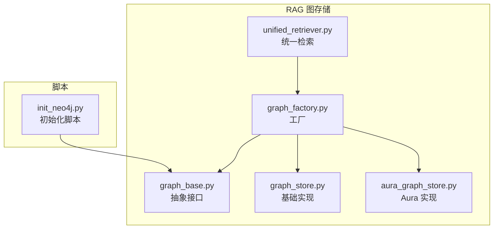
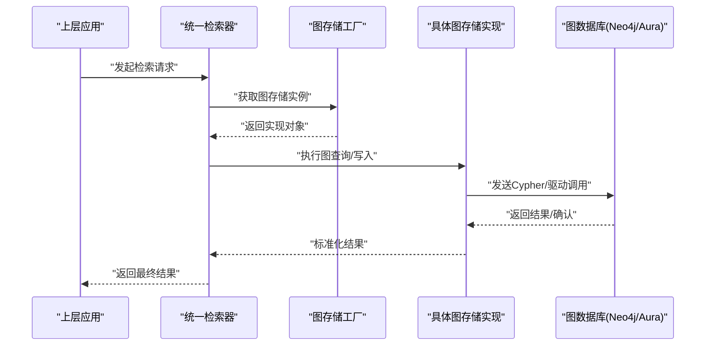
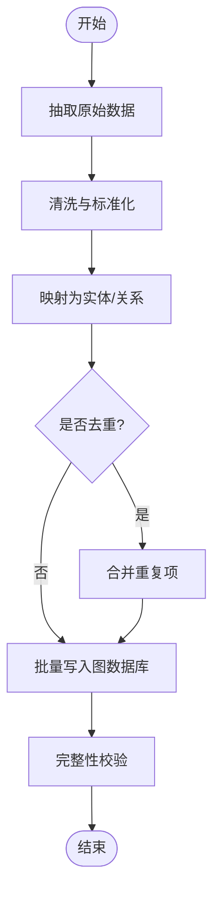
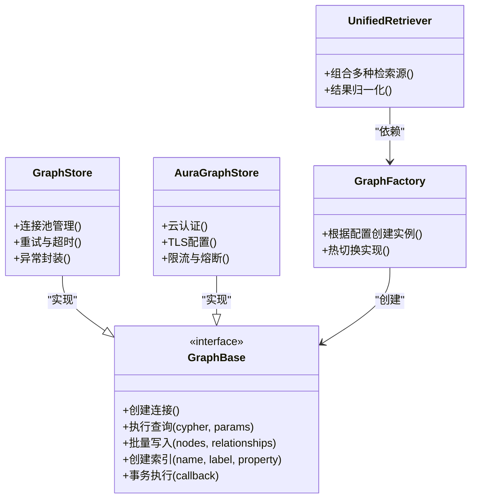

# 图数据库存储

<cite>
**本文引用的文件**   
- [backend_design/nexus/rag/graph_base.py](file://backend_design/nexus/rag/graph_base.py)
- [backend_design/nexus/rag/graph_store.py](file://backend_design/nexus/rag/graph_store.py)
- [backend_design/nexus/rag/aura_graph_store.py](file://backend_design/nexus/rag/aura_graph_store.py)
- [backend_design/nexus/rag/graph_factory.py](file://backend_design/nexus/rag/graph_factory.py)
- [backend_design/nexus/rag/unified_retriever.py](file://backend_design/nexus/rag/unified_retriever.py)
- [scripts/init_neo4j.py](file://scripts/init_neo4j.py)
</cite>

## 目录
1. [简介](#简介)
2. [项目结构](#项目结构)
3. [核心组件](#核心组件)
4. [架构总览](#架构总览)
5. [详细组件分析](#详细组件分析)
6. [依赖关系分析](#依赖关系分析)
7. [性能考虑](#性能考虑)
8. [故障排查指南](#故障排查指南)
9. [结论](#结论)
10. [附录](#附录)

## 简介
本技术文档面向知识图谱与图数据库存储系统，聚焦于以下目标：
- 定义实体、关系与属性的建模规范，形成统一的数据模型契约。
- 描述从原始数据到图谱实体的构建流程，包括抽取、清洗、去重与落库。
- 说明图查询语言（以Cypher为主）的编写要点与优化技巧。
- 给出Neo4j与Aura等后端的配置方法与连接管理策略。
- 提供增量更新策略与一致性保证机制。
- 总结图遍历算法的应用场景与性能注意事项。

## 项目结构
本项目中与图数据库相关的代码位于后端RAG模块中，采用“抽象接口 + 多实现 + 工厂”的分层设计：
- 抽象层：定义统一的图存储接口与通用能力。
- 实现层：针对具体图数据库（如Neo4j、Aura）提供适配实现。
- 工厂层：根据配置动态创建具体图存储实例。
- 检索层：将图检索与其他检索源进行统一封装，供上层调用。

图表来源
- [backend_design/nexus/rag/graph_base.py](file://backend_design/nexus/rag/graph_base.py)
- [backend_design/nexus/rag/graph_store.py](file://backend_design/nexus/rag/graph_store.py)
- [backend_design/nexus/rag/aura_graph_store.py](file://backend_design/nexus/rag/aura_graph_store.py)
- [backend_design/nexus/rag/graph_factory.py](file://backend_design/nexus/rag/graph_factory.py)
- [backend_design/nexus/rag/unified_retriever.py](file://backend_design/nexus/rag/unified_retriever.py)
- [scripts/init_neo4j.py](file://scripts/init_neo4j.py)

章节来源
- [backend_design/nexus/rag/graph_base.py](file://backend_design/nexus/rag/graph_base.py)
- [backend_design/nexus/rag/graph_store.py](file://backend_design/nexus/rag/graph_store.py)
- [backend_design/nexus/rag/aura_graph_store.py](file://backend_design/nexus/rag/aura_graph_store.py)
- [backend_design/nexus/rag/graph_factory.py](file://backend_design/nexus/rag/graph_factory.py)
- [backend_design/nexus/rag/unified_retriever.py](file://backend_design/nexus/rag/unified_retriever.py)
- [scripts/init_neo4j.py](file://scripts/init_neo4j.py)

## 核心组件
- 抽象接口层
  - 职责：定义图存储的统一API，包括节点/关系的增删改查、事务、索引与约束、批量写入、查询执行等。
  - 设计要点：通过抽象方法屏蔽底层差异，确保上层调用一致；为不同后端提供相同的语义契约。
- 基础实现层
  - 职责：提供通用的图操作实现，包含连接池、重试、错误处理、日志记录等横切关注点。
  - 设计要点：对异常进行规范化封装，便于上层统一处理；提供可插拔的连接参数与超时控制。
- Aura 实现层
  - 职责：对接云托管图数据库（如Aura），处理认证、TLS、连接复用与限流等特性。
  - 设计要点：兼容标准图协议，同时适配云端特有的安全与网络要求。
- 工厂层
  - 职责：依据配置选择并创建具体的图存储实现，支持运行时切换与扩展。
  - 设计要点：集中化配置解析，避免散落的if-else分支；支持热重载与降级策略。
- 统一检索层
  - 职责：将图检索结果与其他检索器（向量、关键词等）融合，对外暴露一致的检索接口。
  - 设计要点：在返回前进行结果归一化、去重与排序，保证上层体验一致。

章节来源
- [backend_design/nexus/rag/graph_base.py](file://backend_design/nexus/rag/graph_base.py)
- [backend_design/nexus/rag/graph_store.py](file://backend_design/nexus/rag/graph_store.py)
- [backend_design/nexus/rag/aura_graph_store.py](file://backend_design/nexus/rag/aura_graph_store.py)
- [backend_design/nexus/rag/graph_factory.py](file://backend_design/nexus/rag/graph_factory.py)
- [backend_design/nexus/rag/unified_retriever.py](file://backend_design/nexus/rag/unified_retriever.py)

## 架构总览
下图展示了从应用层到图数据库的整体交互路径，以及关键组件的职责边界。

图表来源
- [backend_design/nexus/rag/unified_retriever.py](file://backend_design/nexus/rag/unified_retriever.py)
- [backend_design/nexus/rag/graph_factory.py](file://backend_design/nexus/rag/graph_factory.py)
- [backend_design/nexus/rag/graph_base.py](file://backend_design/nexus/rag/graph_base.py)
- [backend_design/nexus/rag/aura_graph_store.py](file://backend_design/nexus/rag/aura_graph_store.py)

## 详细组件分析

### 数据模型设计规范（实体、关系、属性）
- 实体（节点）
  - 命名规范：使用具象名词，首字母大写或下划线分隔，体现领域概念。
  - 标识字段：每个实体需具备唯一标识（如ID），用于去重与关联。
  - 标签（Label）：按领域划分标签集合，避免过度细分导致维护成本上升。
  - 属性：仅保留查询与展示所需的最小必要属性，复杂内容下沉至外部存储并通过引用关联。
- 关系（边）
  - 类型：使用动词短语表达关系语义，保持方向性明确。
  - 属性：尽量精简，必要时将富文本或大对象外置。
  - 基数：遵循业务约束，避免无界膨胀；必要时引入中间节点表达多重关系。
- 索引与约束
  - 唯一性约束：对关键标识建立唯一约束，保障数据一致性。
  - 搜索索引：为高频过滤与匹配字段建立全文或范围索引。
- 版本与审计
  - 建议增加时间戳与版本号字段，便于增量同步与回溯。

章节来源
- [backend_design/nexus/rag/graph_base.py](file://backend_design/nexus/rag/graph_base.py)
- [backend_design/nexus/rag/graph_store.py](file://backend_design/nexus/rag/graph_store.py)

### 图数据构建流程（从原始数据到图谱实体）
整体流程分为抽取、清洗、映射、去重、落库与校验六个阶段：
- 抽取：从上游数据源读取原始记录，解析结构化/半结构化字段。
- 清洗：标准化格式、去除噪声、补齐缺失值、归一化枚举。
- 映射：将原始字段映射为实体与关系，生成待写入的图结构。
- 去重：基于唯一标识与规则进行合并，避免重复节点/关系。
- 落库：批量写入图数据库，必要时开启事务以保证一致性。
- 校验：运行完整性检查与抽样验证，输出质量报告。

章节来源
- [backend_design/nexus/rag/graph_store.py](file://backend_design/nexus/rag/graph_store.py)
- [scripts/init_neo4j.py](file://scripts/init_neo4j.py)

### 图查询语言（Cypher）使用与优化
- 编写要点
  - 明确模式：在查询中显式声明节点标签与关系类型，减少全图扫描。
  - 限制深度：合理设置遍历层级，避免指数级增长。
  - 选择性条件：尽早过滤，缩小中间结果集。
  - 聚合与投影：按需聚合与投影字段，降低传输开销。
- 优化技巧
  - 利用索引：为过滤字段建立合适索引，并在查询中命中。
  - 分页与游标：大数据量查询采用分页或流式读取。
  - 批量化：批量写入与批量查询优于逐条操作。
  - 缓存热点：对频繁访问的子图进行缓存或物化视图。
- 示例参考
  - 可在初始化脚本中查看建库、建索引与初始数据的Cypher语句组织方式。

章节来源
- [scripts/init_neo4j.py](file://scripts/init_neo4j.py)
- [backend_design/nexus/rag/graph_base.py](file://backend_design/nexus/rag/graph_base.py)

### 后端配置与连接管理（Neo4j/Aura）
- Neo4j本地/自建
  - 连接参数：主机、端口、用户名、密码、数据库名、TLS开关等。
  - 连接池：设置最大连接数、空闲回收、超时与重试策略。
  - 事务：短事务优先，长事务谨慎使用；失败自动重试与幂等写入。
- Aura云托管
  - 认证：支持令牌或证书认证，注意密钥管理与轮换。
  - TLS：强制启用加密通道，校验服务端证书。
  - 限流：遵循云服务配额与速率限制，实施退避与熔断。
- 工厂与配置
  - 通过工厂根据环境配置选择具体实现，支持热切换与降级。
  - 统一异常封装，便于上层监控与告警。

章节来源
- [backend_design/nexus/rag/aura_graph_store.py](file://backend_design/nexus/rag/aura_graph_store.py)
- [backend_design/nexus/rag/graph_factory.py](file://backend_design/nexus/rag/graph_factory.py)
- [backend_design/nexus/rag/graph_base.py](file://backend_design/nexus/rag/graph_base.py)

### 增量更新策略与一致性保证
- 增量策略
  - 变更捕获：基于时间戳、版本号或事件流识别新增/修改/删除。
  - 幂等写入：使用唯一键与UPSERT语义，避免重复写入。
  - 分批提交：小批次提交，降低锁竞争与回滚成本。
- 一致性
  - 事务边界：跨节点/关系更新包裹在同一事务内。
  - 冲突解决：检测并发冲突，采用最后写入获胜或业务合并策略。
  - 校验与补偿：定期运行一致性校验任务，发现不一致时触发补偿修复。

章节来源
- [backend_design/nexus/rag/graph_store.py](file://backend_design/nexus/rag/graph_store.py)
- [backend_design/nexus/rag/graph_base.py](file://backend_design/nexus/rag/graph_base.py)

### 图遍历算法应用场景与性能考虑
- 常见场景
  - 最短路径：推荐链路、故障传播分析。
  - 连通分量：社区发现、子图聚类。
  - 中心性度量：影响力评估、关键节点识别。
  - 模式匹配：复杂关系查询与合规检查。
- 性能要点
  - 限制遍历半径与分支因子。
  - 预计算常用指标并缓存结果。
  - 使用索引与谓词下推减少中间结果。
  - 异步与并行：对独立子图进行并行遍历。

章节来源
- [backend_design/nexus/rag/graph_base.py](file://backend_design/nexus/rag/graph_base.py)

## 依赖关系分析
组件间的依赖关系如下：
- 统一检索器依赖工厂，工厂负责创建具体图存储实现。
- 具体实现继承或实现抽象接口，屏蔽底层差异。
- 初始化脚本直接调用抽象接口提供的能力进行建库与索引。

图表来源
- [backend_design/nexus/rag/graph_base.py](file://backend_design/nexus/rag/graph_base.py)
- [backend_design/nexus/rag/graph_store.py](file://backend_design/nexus/rag/graph_store.py)
- [backend_design/nexus/rag/aura_graph_store.py](file://backend_design/nexus/rag/aura_graph_store.py)
- [backend_design/nexus/rag/graph_factory.py](file://backend_design/nexus/rag/graph_factory.py)
- [backend_design/nexus/rag/unified_retriever.py](file://backend_design/nexus/rag/unified_retriever.py)

章节来源
- [backend_design/nexus/rag/graph_base.py](file://backend_design/nexus/rag/graph_base.py)
- [backend_design/nexus/rag/graph_store.py](file://backend_design/nexus/rag/graph_store.py)
- [backend_design/nexus/rag/aura_graph_store.py](file://backend_design/nexus/rag/aura_graph_store.py)
- [backend_design/nexus/rag/graph_factory.py](file://backend_design/nexus/rag/graph_factory.py)
- [backend_design/nexus/rag/unified_retriever.py](file://backend_design/nexus/rag/unified_retriever.py)

## 性能考虑
- 连接与资源
  - 合理设置连接池大小与超时，避免连接泄漏。
  - 对高频查询建立索引与约束，减少全图扫描。
- 查询与写入
  - 批量操作优于单条操作；使用事务提升吞吐与一致性。
  - 分页与流式读取避免内存峰值。
- 缓存与预热
  - 热点子图与常用结果缓存，缩短响应时间。
  - 启动时预热关键索引与统计信息。
- 监控与告警
  - 采集延迟、吞吐、错误率与资源占用指标。
  - 设置阈值告警，快速定位瓶颈。

[本节为通用指导，不直接分析具体文件]

## 故障排查指南
- 常见问题
  - 连接失败：检查网络可达、认证凭据、TLS配置与防火墙策略。
  - 查询缓慢：确认索引命中、遍历深度与过滤条件是否合理。
  - 写入失败：检查事务边界、唯一约束冲突与幂等逻辑。
- 诊断步骤
  - 查看连接池状态与活跃连接数。
  - 抓取慢查询日志与执行计划，定位热点路径。
  - 复现问题并最小化数据集，逐步隔离根因。
- 恢复策略
  - 自动重试与退避，配合熔断防止雪崩。
  - 数据一致性校验与补偿任务定期运行。

章节来源
- [backend_design/nexus/rag/graph_store.py](file://backend_design/nexus/rag/graph_store.py)
- [backend_design/nexus/rag/aura_graph_store.py](file://backend_design/nexus/rag/aura_graph_store.py)

## 结论
本系统通过抽象接口与多实现的设计，实现了图存储的后端无关性与可扩展性。结合规范的建模、稳健的构建流程、高效的Cypher实践与完善的连接管理，能够在Neo4j与Aura等多种环境下稳定运行。通过增量更新与一致性机制，保障了数据质量与可用性；通过遍历算法与性能优化策略，提升了复杂查询与大规模数据的处理能力。

[本节为总结性内容，不直接分析具体文件]

## 附录
- 术语表
  - 实体：图中的节点，表示领域中的对象或概念。
  - 关系：图中的边，表示实体之间的语义联系。
  - 属性：附着在节点或关系上的键值对，承载元数据。
  - Cypher：图数据库的声明式查询语言。
  - 事务：一组原子操作的执行单元，保证一致性。
- 参考实现路径
  - 抽象接口与基础实现：见对应Python文件。
  - Aura适配实现：见对应Python文件。
  - 工厂与统一检索：见对应Python文件。
  - 初始化脚本：见对应脚本文件。

[本节为补充信息，不直接分析具体文件]