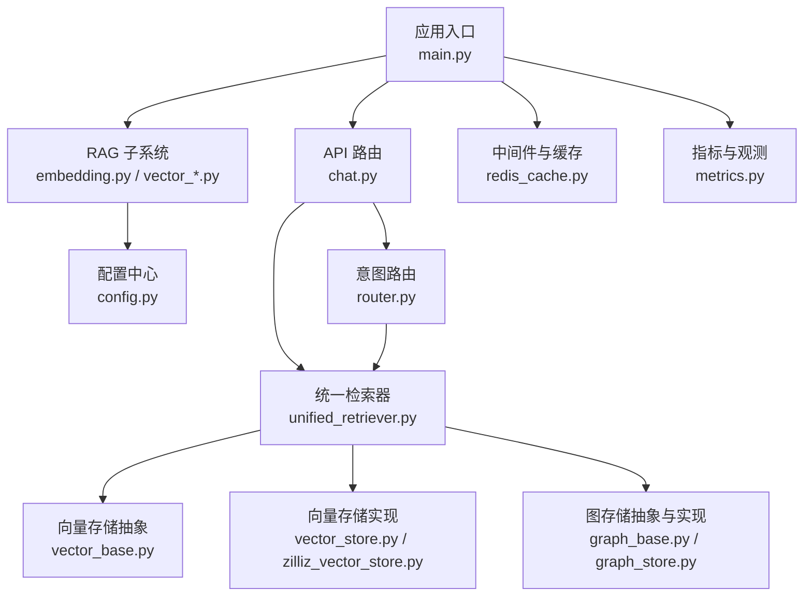
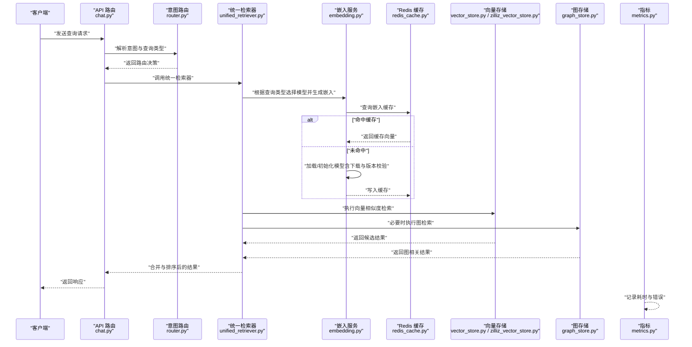
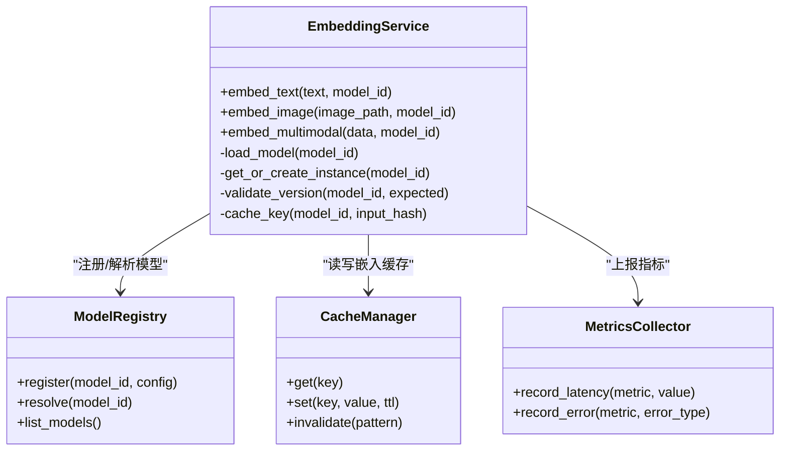
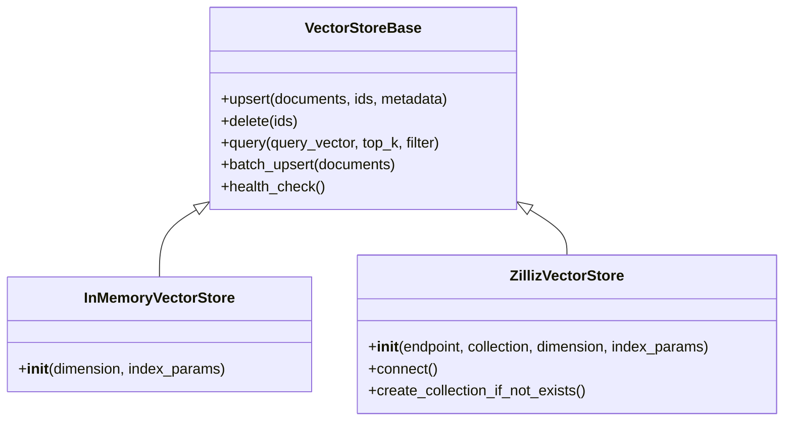
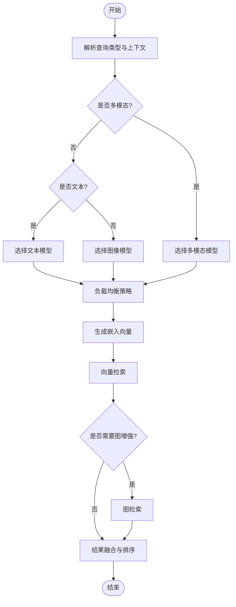
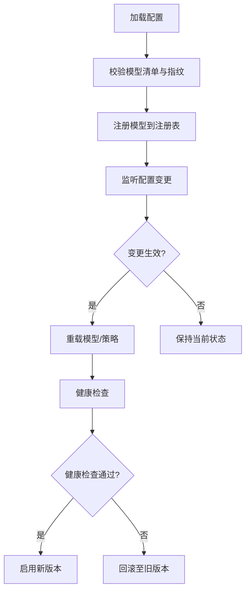
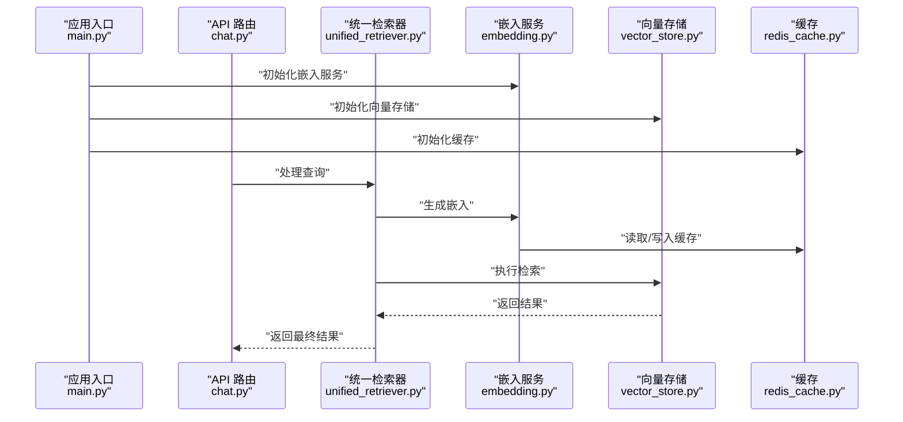
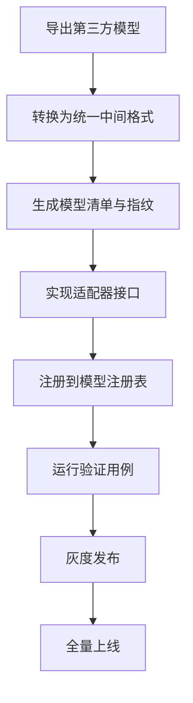
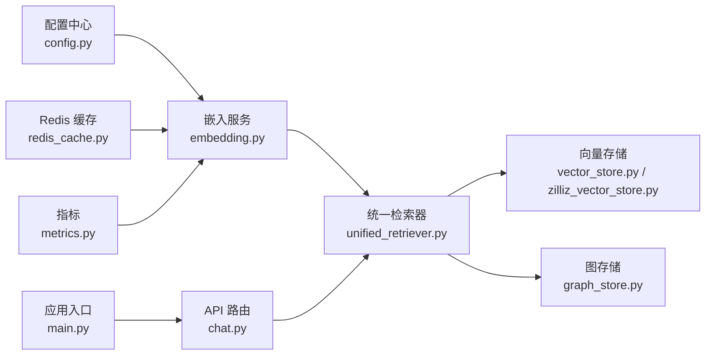

# 嵌入模型管理

<cite>
**本文引用的文件**   
- [backend_design/nexus/rag/embedding.py](file://backend_design/nexus/rag/embedding.py)
- [backend_design/nexus/rag/vector_store.py](file://backend_design/nexus/rag/vector_store.py)
- [backend_design/nexus/rag/vector_base.py](file://backend_design/nexus/rag/vector_base.py)
- [backend_design/nexus/rag/vector_factory.py](file://backend_design/nexus/rag/vector_factory.py)
- [backend_design/nexus/rag/unified_retriever.py](file://backend_design/nexus/rag/unified_retriever.py)
- [backend_design/nexus/config.py](file://backend_design/nexus/config.py)
- [backend_design/nexus/main.py](file://backend_design/nexus/main.py)
- [backend_design/nexus/api/routes/chat.py](file://backend_design/nexus/api/routes/chat.py)
- [backend_design/nexus/intent/router.py](file://backend_design/nexus/intent/router.py)
- [backend_design/nexus/core/cockpit_manager.py](file://backend_design/nexus/core/cockpit_manager.py)
- [backend_design/nexus/middleware/redis_cache.py](file://backend_design/nexus/middleware/redis_cache.py)
- [backend_design/nexus/observability/metrics.py](file://backend_design/nexus/observability/metrics.py)
- [backend_design/nexus/rag/graph_store.py](file://backend_design/nexus/rag/graph_store.py)
- [backend_design/nexus/rag/graph_base.py](file://backend_design/nexus/rag/graph_base.py)
- [backend_design/nexus/rag/zilliz_vector_store.py](file://backend_design/nexus/rag/zilliz_vector_store.py)
</cite>

## 目录
1. [简介](#简介)
2. [项目结构](#项目结构)
3. [核心组件](#核心组件)
4. [架构总览](#架构总览)
5. [详细组件分析](#详细组件分析)
6. [依赖关系分析](#依赖关系分析)
7. [性能考虑](#性能考虑)
8. [故障排查指南](#故障排查指南)
9. [结论](#结论)
10. [附录](#附录)

## 简介
本技术文档聚焦于“嵌入模型管理系统”，围绕以下目标展开：
- 嵌入模型的加载与初始化流程，包括模型文件下载、缓存管理与版本控制
- 不同嵌入模型的特点与适用场景（文本、图像、多模态）
- 基于查询类型的动态模型切换与负载均衡策略
- 自定义嵌入模型的集成方法（格式转换与接口适配）
- 嵌入质量评估方法与模型选择建议
- 嵌入向量维度优化与压缩策略

本仓库在 RAG 子系统中实现了统一的嵌入与检索能力，并通过工厂模式与配置驱动实现可插拔的模型与后端存储。

## 项目结构
与嵌入模型管理相关的代码主要位于 backend_design/nexus/rag 目录，配合全局配置与入口模块完成生命周期管理；API 路由与意图路由负责将请求分发到统一检索器，从而触发嵌入与检索流程。

图表来源
- [backend_design/nexus/main.py](file://backend_design/nexus/main.py)
- [backend_design/nexus/rag/embedding.py](file://backend_design/nexus/rag/embedding.py)
- [backend_design/nexus/rag/vector_store.py](file://backend_design/nexus/rag/vector_store.py)
- [backend_design/nexus/rag/vector_base.py](file://backend_design/nexus/rag/vector_base.py)
- [backend_design/nexus/rag/zilliz_vector_store.py](file://backend_design/nexus/rag/zilliz_vector_store.py)
- [backend_design/nexus/rag/unified_retriever.py](file://backend_design/nexus/rag/unified_retriever.py)
- [backend_design/nexus/config.py](file://backend_design/nexus/config.py)
- [backend_design/nexus/api/routes/chat.py](file://backend_design/nexus/api/routes/chat.py)
- [backend_design/nexus/intent/router.py](file://backend_design/nexus/intent/router.py)
- [backend_design/nexus/middleware/redis_cache.py](file://backend_design/nexus/middleware/redis_cache.py)
- [backend_design/nexus/observability/metrics.py](file://backend_design/nexus/observability/metrics.py)
- [backend_design/nexus/rag/graph_store.py](file://backend_design/nexus/rag/graph_store.py)
- [backend_design/nexus/rag/graph_base.py](file://backend_design/nexus/rag/graph_base.py)

章节来源
- [backend_design/nexus/main.py](file://backend_design/nexus/main.py)
- [backend_design/nexus/rag/embedding.py](file://backend_design/nexus/rag/embedding.py)
- [backend_design/nexus/rag/vector_store.py](file://backend_design/nexus/rag/vector_store.py)
- [backend_design/nexus/rag/vector_base.py](file://backend_design/nexus/rag/vector_base.py)
- [backend_design/nexus/rag/zilliz_vector_store.py](file://backend_design/nexus/rag/zilliz_vector_store.py)
- [backend_design/nexus/rag/unified_retriever.py](file://backend_design/nexus/rag/unified_retriever.py)
- [backend_design/nexus/config.py](file://backend_design/nexus/config.py)
- [backend_design/nexus/api/routes/chat.py](file://backend_design/nexus/api/routes/chat.py)
- [backend_design/nexus/intent/router.py](file://backend_design/nexus/intent/router.py)
- [backend_design/nexus/middleware/redis_cache.py](file://backend_design/nexus/middleware/redis_cache.py)
- [backend_design/nexus/observability/metrics.py](file://backend_design/nexus/observability/metrics.py)
- [backend_design/nexus/rag/graph_store.py](file://backend_design/nexus/rag/graph_store.py)
- [backend_design/nexus/rag/graph_base.py](file://backend_design/nexus/rag/graph_base.py)

## 核心组件
- 嵌入服务：提供文本/图像/多模态嵌入的统一接口，支持本地模型与远程 API 两种模式，具备模型缓存与热更新能力
- 向量存储抽象与实现：定义统一的增删改查与相似度检索接口，并对接多种后端（如内存、Zilliz）
- 统一检索器：根据查询类型与上下文选择合适的数据源（向量或图），并协调嵌入与检索流程
- 配置中心：集中管理模型名称、路径、维度、权重、开关与负载均衡策略
- 中间件与缓存：对高频嵌入结果进行缓存，降低重复计算成本
- 指标与观测：记录嵌入耗时、错误率、命中率等关键指标

章节来源
- [backend_design/nexus/rag/embedding.py](file://backend_design/nexus/rag/embedding.py)
- [backend_design/nexus/rag/vector_base.py](file://backend_design/nexus/rag/vector_base.py)
- [backend_design/nexus/rag/vector_store.py](file://backend_design/nexus/rag/vector_store.py)
- [backend_design/nexus/rag/zilliz_vector_store.py](file://backend_design/nexus/rag/zilliz_vector_store.py)
- [backend_design/nexus/rag/unified_retriever.py](file://backend_design/nexus/rag/unified_retriever.py)
- [backend_design/nexus/config.py](file://backend_design/nexus/config.py)
- [backend_design/nexus/middleware/redis_cache.py](file://backend_design/nexus/middleware/redis_cache.py)
- [backend_design/nexus/observability/metrics.py](file://backend_design/nexus/observability/metrics.py)

## 架构总览
下图展示了从 API 请求到嵌入生成与检索返回的整体流程，以及模型选择与缓存机制。

图表来源
- [backend_design/nexus/api/routes/chat.py](file://backend_design/nexus/api/routes/chat.py)
- [backend_design/nexus/intent/router.py](file://backend_design/nexus/intent/router.py)
- [backend_design/nexus/rag/unified_retriever.py](file://backend_design/nexus/rag/unified_retriever.py)
- [backend_design/nexus/rag/embedding.py](file://backend_design/nexus/rag/embedding.py)
- [backend_design/nexus/middleware/redis_cache.py](file://backend_design/nexus/middleware/redis_cache.py)
- [backend_design/nexus/rag/vector_store.py](file://backend_design/nexus/rag/vector_store.py)
- [backend_design/nexus/rag/zilliz_vector_store.py](file://backend_design/nexus/rag/zilliz_vector_store.py)
- [backend_design/nexus/rag/graph_store.py](file://backend_design/nexus/rag/graph_store.py)
- [backend_design/nexus/observability/metrics.py](file://backend_design/nexus/observability/metrics.py)

## 详细组件分析

### 嵌入服务（文本/图像/多模态）
- 功能要点
  - 统一接口：对外暴露文本、图像、多模态三种嵌入方法
  - 模型加载与初始化：支持本地模型与远程 API；首次访问时按需加载，支持后台预热
  - 模型缓存：按模型标识（名称、版本、维度）缓存实例，避免重复初始化
  - 版本控制：通过配置中的版本号字段与模型指纹（如 SHA）确保一致性
  - 动态切换：运行时依据配置或查询类型切换模型，支持灰度发布
  - 错误处理：网络异常、模型不兼容、维度不一致等异常分类与降级
- 适用场景
  - 文本嵌入：通用语义检索、问答、推荐召回
  - 图像嵌入：以图搜图、视觉相似性匹配
  - 多模态嵌入：图文联合检索、跨模态对齐

图表来源
- [backend_design/nexus/rag/embedding.py](file://backend_design/nexus/rag/embedding.py)
- [backend_design/nexus/config.py](file://backend_design/nexus/config.py)
- [backend_design/nexus/middleware/redis_cache.py](file://backend_design/nexus/middleware/redis_cache.py)
- [backend_design/nexus/observability/metrics.py](file://backend_design/nexus/observability/metrics.py)

章节来源
- [backend_design/nexus/rag/embedding.py](file://backend_design/nexus/rag/embedding.py)
- [backend_design/nexus/config.py](file://backend_design/nexus/config.py)
- [backend_design/nexus/middleware/redis_cache.py](file://backend_design/nexus/middleware/redis_cache.py)
- [backend_design/nexus/observability/metrics.py](file://backend_design/nexus/observability/metrics.py)

### 向量存储抽象与实现
- 抽象层
  - 定义统一的插入、删除、更新、批量操作与相似度检索接口
  - 支持元数据过滤、分页与排序
- 实现层
  - 内存实现：用于开发与测试
  - Zilliz 实现：生产级云原生向量数据库，支持高并发与水平扩展
- 关键特性
  - 索引类型与参数可调（HNSW、IVF 等）
  - 分片与副本策略由后端配置决定
  - 连接池与重试机制提升稳定性

图表来源
- [backend_design/nexus/rag/vector_base.py](file://backend_design/nexus/rag/vector_base.py)
- [backend_design/nexus/rag/vector_store.py](file://backend_design/nexus/rag/vector_store.py)
- [backend_design/nexus/rag/zilliz_vector_store.py](file://backend_design/nexus/rag/zilliz_vector_store.py)

章节来源
- [backend_design/nexus/rag/vector_base.py](file://backend_design/nexus/rag/vector_base.py)
- [backend_design/nexus/rag/vector_store.py](file://backend_design/nexus/rag/vector_store.py)
- [backend_design/nexus/rag/zilliz_vector_store.py](file://backend_design/nexus/rag/zilliz_vector_store.py)

### 统一检索器（基于查询类型的模型选择与负载均衡）
- 查询类型识别
  - 文本类：优先使用文本嵌入模型
  - 图像类：优先使用图像嵌入模型
  - 多模态类：使用多模态模型或组合策略
- 模型选择与负载均衡
  - 基于配置的权重轮询、最少连接数或延迟感知策略
  - 支持按租户/环境/灰度标签分流
- 数据源选择
  - 向量检索为主，必要时结合图检索增强召回
- 结果融合
  - 去重、重排与评分归一化

图表来源
- [backend_design/nexus/rag/unified_retriever.py](file://backend_design/nexus/rag/unified_retriever.py)
- [backend_design/nexus/rag/embedding.py](file://backend_design/nexus/rag/embedding.py)
- [backend_design/nexus/rag/vector_store.py](file://backend_design/nexus/rag/vector_store.py)
- [backend_design/nexus/rag/graph_store.py](file://backend_design/nexus/rag/graph_store.py)

章节来源
- [backend_design/nexus/rag/unified_retriever.py](file://backend_design/nexus/rag/unified_retriever.py)
- [backend_design/nexus/rag/embedding.py](file://backend_design/nexus/rag/embedding.py)
- [backend_design/nexus/rag/vector_store.py](file://backend_design/nexus/rag/vector_store.py)
- [backend_design/nexus/rag/graph_store.py](file://backend_design/nexus/rag/graph_store.py)

### 配置中心与动态切换
- 配置项
  - 模型清单：名称、类型、版本、维度、路径/端点、权重、开关
  - 负载均衡策略：轮询、最少连接、延迟感知
  - 缓存策略：TTL、最大条目数、失效键模式
  - 存储后端：集合名、索引参数、连接信息
- 动态切换
  - 热更新：在不重启进程的情况下刷新模型与策略
  - 灰度发布：按标签或比例逐步放量新模型
- 安全与一致性
  - 模型指纹校验（SHA）
  - 回滚策略：失败自动切回上一稳定版本

图表来源
- [backend_design/nexus/config.py](file://backend_design/nexus/config.py)
- [backend_design/nexus/rag/embedding.py](file://backend_design/nexus/rag/embedding.py)

章节来源
- [backend_design/nexus/config.py](file://backend_design/nexus/config.py)
- [backend_design/nexus/rag/embedding.py](file://backend_design/nexus/rag/embedding.py)

### API 路由与服务编排
- API 路由
  - 接收查询请求，解析参数与认证信息
  - 调用统一检索器获取结果
- 服务编排
  - 启动时初始化嵌入服务、向量存储与缓存
  - 注册健康检查与指标上报

图表来源
- [backend_design/nexus/main.py](file://backend_design/nexus/main.py)
- [backend_design/nexus/api/routes/chat.py](file://backend_design/nexus/api/routes/chat.py)
- [backend_design/nexus/rag/unified_retriever.py](file://backend_design/nexus/rag/unified_retriever.py)
- [backend_design/nexus/rag/embedding.py](file://backend_design/nexus/rag/embedding.py)
- [backend_design/nexus/rag/vector_store.py](file://backend_design/nexus/rag/vector_store.py)
- [backend_design/nexus/middleware/redis_cache.py](file://backend_design/nexus/middleware/redis_cache.py)

章节来源
- [backend_design/nexus/main.py](file://backend_design/nexus/main.py)
- [backend_design/nexus/api/routes/chat.py](file://backend_design/nexus/api/routes/chat.py)
- [backend_design/nexus/rag/unified_retriever.py](file://backend_design/nexus/rag/unified_retriever.py)
- [backend_design/nexus/rag/embedding.py](file://backend_design/nexus/rag/embedding.py)
- [backend_design/nexus/rag/vector_store.py](file://backend_design/nexus/rag/vector_store.py)
- [backend_design/nexus/middleware/redis_cache.py](file://backend_design/nexus/middleware/redis_cache.py)

### 自定义嵌入模型集成方法
- 模型格式转换
  - 将第三方模型导出为统一中间格式（包含权重、词表、配置与指纹）
  - 生成模型清单条目（名称、类型、版本、维度、路径/端点、权重）
- 接口适配
  - 实现嵌入服务的适配器，遵循统一接口（文本/图像/多模态）
  - 注册到模型注册表，支持热加载
- 验证与上线
  - 单元测试覆盖维度一致性与基本推理正确性
  - 灰度发布与回滚策略

[此图为概念流程，无需图表来源]

章节来源
- [backend_design/nexus/rag/embedding.py](file://backend_design/nexus/rag/embedding.py)
- [backend_design/nexus/config.py](file://backend_design/nexus/config.py)

### 嵌入质量评估与模型选择建议
- 评估方法
  - 离线评测集：构建领域语料与标注，计算 mAP、Recall@K、NDCG 等
  - 在线指标：点击率、转化率、停留时长、用户满意度
  - 回归测试：版本升级前后对比，确保不劣化
- 选择建议
  - 文本：优先选择领域微调模型，关注长文本与低资源语言表现
  - 图像：关注细粒度类别区分与跨域泛化
  - 多模态：关注图文对齐质量与跨模态检索效果
  - 成本与延迟权衡：小模型+缓存 vs 大模型+增量索引

[本节为通用指导，无需章节来源]

### 嵌入向量维度优化与压缩策略
- 维度优化
  - 降维：PCA、随机投影，平衡精度与体积
  - 量化：INT8/FP16，减少内存占用与带宽
- 压缩策略
  - 乘积量化（PQ）、标量量化（SQ）
  - 稀疏化与剪枝（针对特定模型）
- 索引与检索调优
  - 调整 HNSW/IVF 参数，平衡召回与延迟
  - 分片与副本策略，提升吞吐与可用性

[本节为通用指导，无需章节来源]

## 依赖关系分析
- 组件耦合
  - 嵌入服务依赖配置中心与缓存，间接依赖指标收集
  - 统一检索器依赖嵌入服务与向量/图存储
  - API 路由依赖统一检索器与应用入口的生命周期管理
- 外部依赖
  - 向量数据库（如 Zilliz）
  - Redis 缓存
  - 指标与日志系统

图表来源
- [backend_design/nexus/config.py](file://backend_design/nexus/config.py)
- [backend_design/nexus/rag/embedding.py](file://backend_design/nexus/rag/embedding.py)
- [backend_design/nexus/middleware/redis_cache.py](file://backend_design/nexus/middleware/redis_cache.py)
- [backend_design/nexus/observability/metrics.py](file://backend_design/nexus/observability/metrics.py)
- [backend_design/nexus/rag/unified_retriever.py](file://backend_design/nexus/rag/unified_retriever.py)
- [backend_design/nexus/rag/vector_store.py](file://backend_design/nexus/rag/vector_store.py)
- [backend_design/nexus/rag/zilliz_vector_store.py](file://backend_design/nexus/rag/zilliz_vector_store.py)
- [backend_design/nexus/rag/graph_store.py](file://backend_design/nexus/rag/graph_store.py)
- [backend_design/nexus/api/routes/chat.py](file://backend_design/nexus/api/routes/chat.py)
- [backend_design/nexus/main.py](file://backend_design/nexus/main.py)

章节来源
- [backend_design/nexus/config.py](file://backend_design/nexus/config.py)
- [backend_design/nexus/rag/embedding.py](file://backend_design/nexus/rag/embedding.py)
- [backend_design/nexus/middleware/redis_cache.py](file://backend_design/nexus/middleware/redis_cache.py)
- [backend_design/nexus/observability/metrics.py](file://backend_design/nexus/observability/metrics.py)
- [backend_design/nexus/rag/unified_retriever.py](file://backend_design/nexus/rag/unified_retriever.py)
- [backend_design/nexus/rag/vector_store.py](file://backend_design/nexus/rag/vector_store.py)
- [backend_design/nexus/rag/zilliz_vector_store.py](file://backend_design/nexus/rag/zilliz_vector_store.py)
- [backend_design/nexus/rag/graph_store.py](file://backend_design/nexus/rag/graph_store.py)
- [backend_design/nexus/api/routes/chat.py](file://backend_design/nexus/api/routes/chat.py)
- [backend_design/nexus/main.py](file://backend_design/nexus/main.py)

## 性能考虑
- 模型预热：启动阶段预加载常用模型，降低首请求延迟
- 缓存命中：合理设置 TTL 与键空间，提高嵌入缓存命中率
- 批处理：批量插入与检索，减少网络往返
- 连接池：向量数据库与 Redis 的连接复用
- 监控告警：对 P95/P99 延迟、错误率与缓存命中率设置阈值

[本节为通用指导，无需章节来源]

## 故障排查指南
- 常见问题
  - 模型加载失败：检查模型路径、权限与指纹校验
  - 维度不一致：确认输入与模型配置维度一致
  - 缓存异常：检查 Redis 连通性与键空间清理
  - 向量库连接失败：检查端点、集合存在性与索引参数
- 定位手段
  - 查看指标与日志，定位慢请求与错误堆栈
  - 使用健康检查接口确认各组件状态
  - 回滚到上一稳定版本，快速恢复服务

章节来源
- [backend_design/nexus/observability/metrics.py](file://backend_design/nexus/observability/metrics.py)
- [backend_design/nexus/middleware/redis_cache.py](file://backend_design/nexus/middleware/redis_cache.py)
- [backend_design/nexus/rag/zilliz_vector_store.py](file://backend_design/nexus/rag/zilliz_vector_store.py)
- [backend_design/nexus/rag/embedding.py](file://backend_design/nexus/rag/embedding.py)

## 结论
本系统通过统一的嵌入服务、可插拔的向量存储与灵活的配置驱动，实现了文本、图像与多模态嵌入的集中化管理。借助缓存、负载均衡与健康检查，系统在可用性与性能之间取得良好平衡。未来可进一步引入更丰富的评估体系与自动化模型选择策略，持续提升检索质量与用户体验。

[本节为总结，无需章节来源]

## 附录
- 术语
  - 嵌入：将文本/图像/多模态数据映射为向量的过程
  - 召回：从大规模数据中筛选出可能相关的候选集
  - 重排：对候选集进行精细化排序以提升相关性
- 最佳实践
  - 小步快跑：频繁灰度与回滚，降低风险
  - 数据先行：先建评测集，再上模型
  - 指标驱动：以业务指标为导向持续优化

[本节为补充说明，无需章节来源]