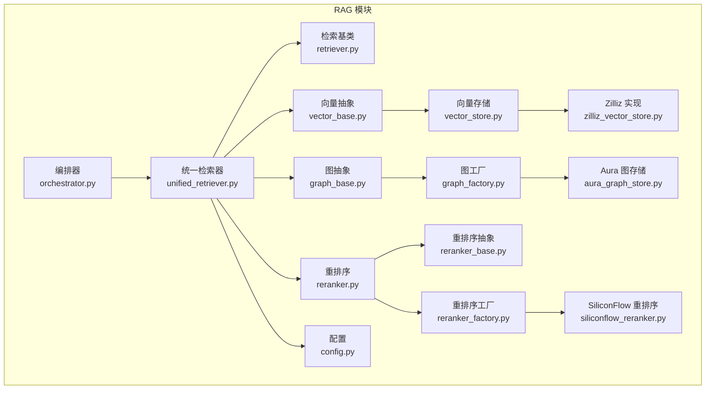
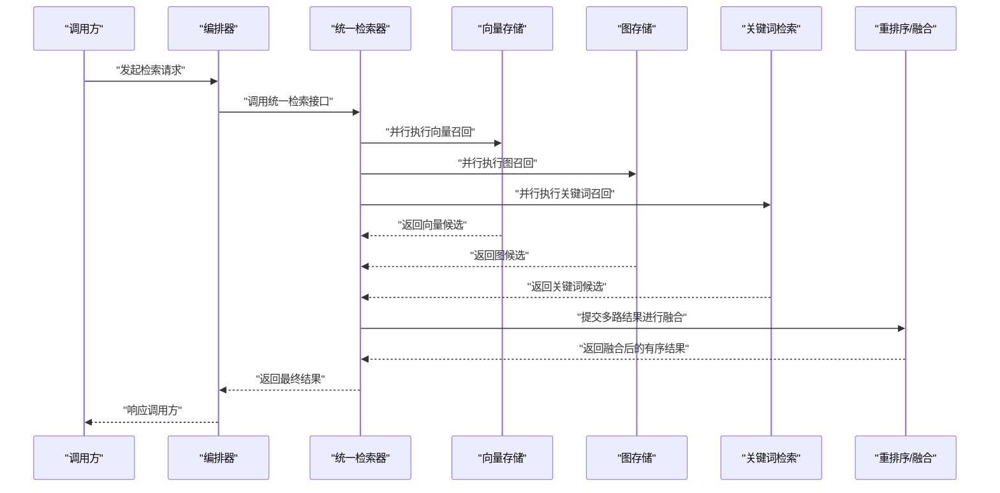
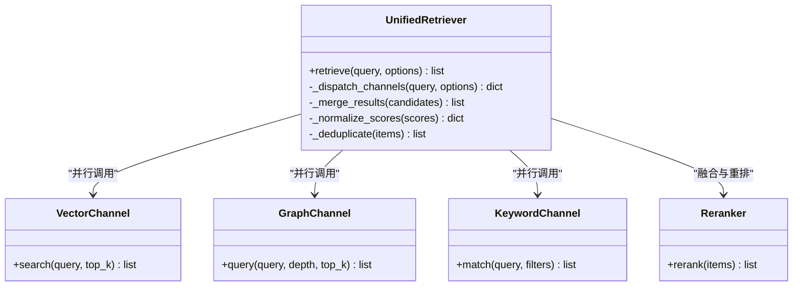
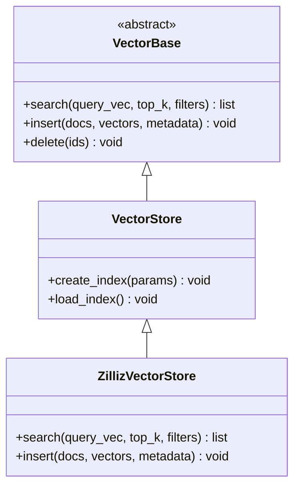
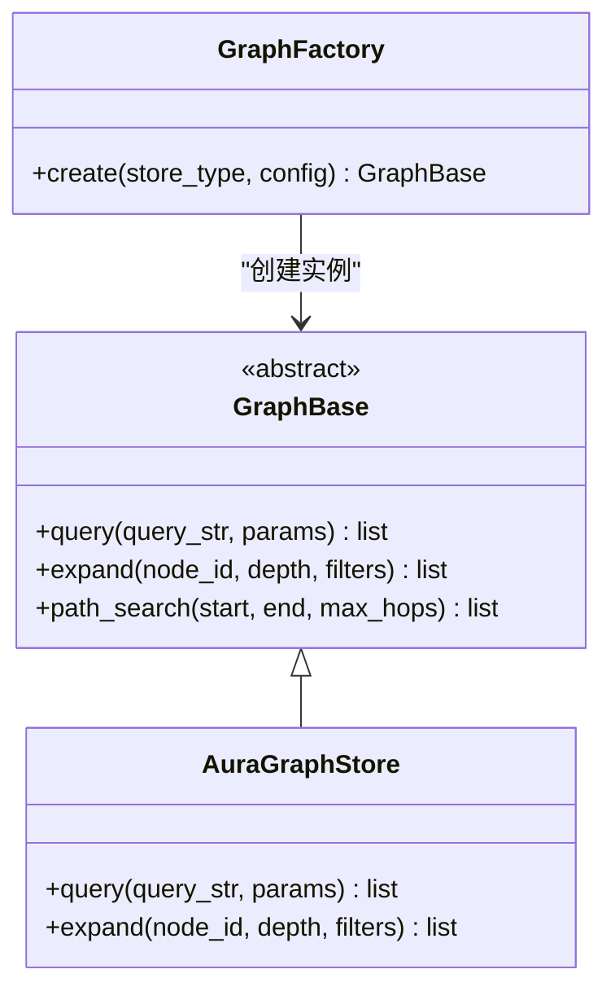
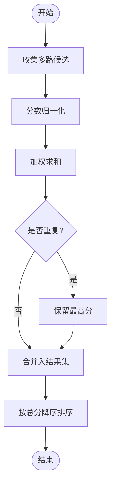
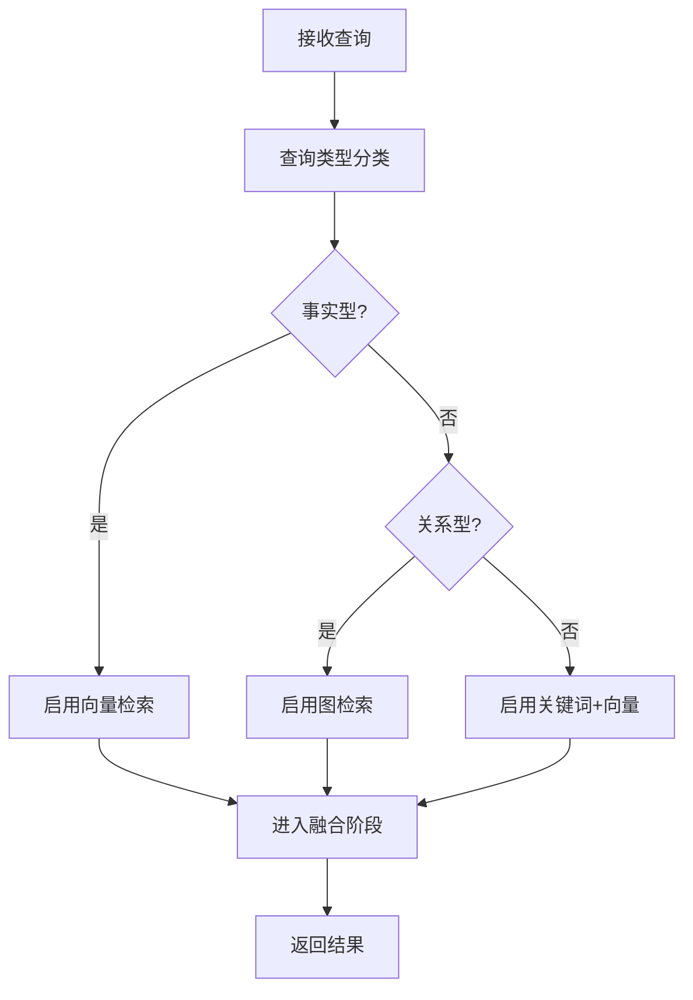
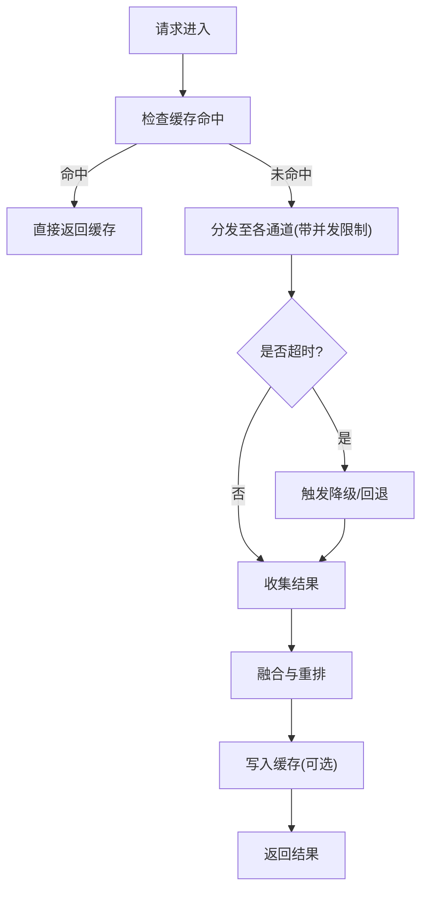
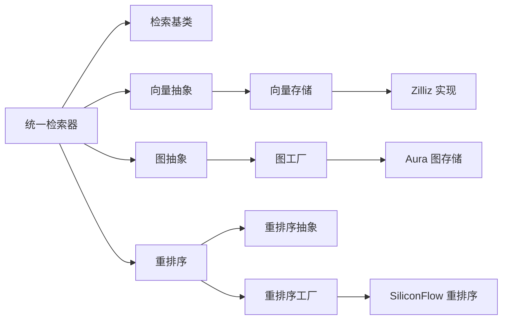

# 统一检索器

<cite>
**本文引用的文件**   
- [unified_retriever.py](file://backend_design/nexus/rag/unified_retriever.py)
- [retriever.py](file://backend_design/nexus/rag/retriever.py)
- [vector_base.py](file://backend_design/nexus/rag/vector_base.py)
- [vector_store.py](file://backend_design/nexus/rag/vector_store.py)
- [zilliz_vector_store.py](file://backend_design/nexus/rag/zilliz_vector_store.py)
- [graph_base.py](file://backend_design/nexus/rag/graph_base.py)
- [graph_factory.py](file://backend_design/nexus/rag/graph_factory.py)
- [aura_graph_store.py](file://backend_design/nexus/rag/aura_graph_store.py)
- [reranker.py](file://backend_design/nexus/rag/reranker.py)
- [reranker_base.py](file://backend_design/nexus/rag/reranker_base.py)
- [reranker_factory.py](file://backend_design/nexus/rag/reranker_factory.py)
- [siliconflow_reranker.py](file://backend_design/nexus/rag/siliconflow_reranker.py)
- [config.py](file://backend_design/nexus/config.py)
- [orchestrator.py](file://backend_design/nexus/skills/orchestrator.py)
</cite>

## 目录
1. [简介](#简介)
2. [项目结构](#项目结构)
3. [核心组件](#核心组件)
4. [架构总览](#架构总览)
5. [详细组件分析](#详细组件分析)
6. [依赖关系分析](#依赖关系分析)
7. [性能考虑](#性能考虑)
8. [故障排查指南](#故障排查指南)
9. [结论](#结论)
10. [附录](#附录)

## 简介
本文件面向“统一检索器”的技术实现与使用，聚焦以下目标：
- 多路召回策略：向量检索、图检索、关键词检索的并行执行机制
- 结果融合算法：分数归一化、权重分配与去重策略
- 检索路由逻辑：基于查询类型自动选择最优路径
- 性能优化配置：并发控制、缓存策略与超时处理
- 效果评估指标与调优建议

统一检索器位于 RAG 模块中，负责将多种检索后端（向量数据库、知识图谱、关键词匹配）进行统一封装，提供一致的接口与可插拔的后端实现。

## 项目结构
RAG 相关代码集中在 backend_design/nexus/rag 目录下，关键文件包括：
- unified_retriever.py：统一检索入口，协调多路召回与融合
- retriever.py：通用检索基类与抽象接口
- vector_*：向量检索相关（抽象、工厂、具体存储）
- graph_*：图检索相关（抽象、工厂、具体存储）
- reranker*：重排序与融合相关（抽象、工厂、具体实现）
- config.py：全局配置项（含检索相关参数）
- orchestrator.py：上层编排器（可能调用统一检索器）

图表来源
- [unified_retriever.py](file://backend_design/nexus/rag/unified_retriever.py)
- [retriever.py](file://backend_design/nexus/rag/retriever.py)
- [vector_base.py](file://backend_design/nexus/rag/vector_base.py)
- [vector_store.py](file://backend_design/nexus/rag/vector_store.py)
- [zilliz_vector_store.py](file://backend_design/nexus/rag/zilliz_vector_store.py)
- [graph_base.py](file://backend_design/nexus/rag/graph_base.py)
- [graph_factory.py](file://backend_design/nexus/rag/graph_factory.py)
- [aura_graph_store.py](file://backend_design/nexus/rag/aura_graph_store.py)
- [reranker.py](file://backend_design/nexus/rag/reranker.py)
- [reranker_base.py](file://backend_design/nexus/rag/reranker_base.py)
- [reranker_factory.py](file://backend_design/nexus/rag/reranker_factory.py)
- [siliconflow_reranker.py](file://backend_design/nexus/rag/siliconflow_reranker.py)
- [config.py](file://backend_design/nexus/config.py)
- [orchestrator.py](file://backend_design/nexus/skills/orchestrator.py)

章节来源
- [unified_retriever.py](file://backend_design/nexus/rag/unified_retriever.py)
- [retriever.py](file://backend_design/nexus/rag/retriever.py)
- [vector_base.py](file://backend_design/nexus/rag/vector_base.py)
- [vector_store.py](file://backend_design/nexus/rag/vector_store.py)
- [zilliz_vector_store.py](file://backend_design/nexus/rag/zilliz_vector_store.py)
- [graph_base.py](file://backend_design/nexus/rag/graph_base.py)
- [graph_factory.py](file://backend_design/nexus/rag/graph_factory.py)
- [aura_graph_store.py](file://backend_design/nexus/rag/aura_graph_store.py)
- [reranker.py](file://backend_design/nexus/rag/reranker.py)
- [reranker_base.py](file://backend_design/nexus/rag/reranker_base.py)
- [reranker_factory.py](file://backend_design/nexus/rag/reranker_factory.py)
- [siliconflow_reranker.py](file://backend_design/nexus/rag/siliconflow_reranker.py)
- [config.py](file://backend_design/nexus/config.py)
- [orchestrator.py](file://backend_design/nexus/skills/orchestrator.py)

## 核心组件
- 统一检索器：对外暴露统一的检索接口，内部组织多路召回任务，收集并融合结果。
- 检索基类：定义检索器的通用能力与扩展点，便于新增检索后端。
- 向量检索：通过向量存储抽象对接不同向量数据库（如 Zilliz）。
- 图检索：通过图存储抽象对接不同图数据库（如 Aura）。
- 重排序与融合：对多路召回结果进行归一化、加权与去重，输出最终候选集。
- 配置中心：集中管理检索相关的阈值、权重、超时与并发等参数。
- 编排器：上层业务编排，按需调用统一检索器。

章节来源
- [unified_retriever.py](file://backend_design/nexus/rag/unified_retriever.py)
- [retriever.py](file://backend_design/nexus/rag/retriever.py)
- [vector_base.py](file://backend_design/nexus/rag/vector_base.py)
- [graph_base.py](file://backend_design/nexus/rag/graph_base.py)
- [reranker.py](file://backend_design/nexus/rag/reranker.py)
- [config.py](file://backend_design/nexus/config.py)
- [orchestrator.py](file://backend_design/nexus/skills/orchestrator.py)

## 架构总览
统一检索器作为“检索网关”，屏蔽底层异构检索后端的差异，向上提供一致接口；向下通过工厂与抽象层动态加载具体实现。

图表来源
- [unified_retriever.py](file://backend_design/nexus/rag/unified_retriever.py)
- [vector_store.py](file://backend_design/nexus/rag/vector_store.py)
- [aura_graph_store.py](file://backend_design/nexus/rag/aura_graph_store.py)
- [reranker.py](file://backend_design/nexus/rag/reranker.py)
- [orchestrator.py](file://backend_design/nexus/skills/orchestrator.py)

## 详细组件分析

### 统一检索器（多路召回与融合）
职责与流程：
- 解析查询意图与上下文，确定需要启用的检索通道（向量、图、关键词）
- 并行调度各通道检索任务，支持超时与熔断保护
- 收集各通道结果，交由重排序/融合模块进行分数归一化、权重合并与去重
- 返回最终排序结果

图表来源
- [unified_retriever.py](file://backend_design/nexus/rag/unified_retriever.py)
- [reranker.py](file://backend_design/nexus/rag/reranker.py)

章节来源
- [unified_retriever.py](file://backend_design/nexus/rag/unified_retriever.py)

### 向量检索（向量抽象与具体存储）
- 向量抽象：定义相似度搜索、批量插入、元数据过滤等接口
- 具体存储：以 Zilliz 为例，封装连接、索引、查询与错误重试
- 关键点：向量维度一致性、索引类型选择、top_k 与距离阈值控制

图表来源
- [vector_base.py](file://backend_design/nexus/rag/vector_base.py)
- [vector_store.py](file://backend_design/nexus/rag/vector_store.py)
- [zilliz_vector_store.py](file://backend_design/nexus/rag/zilliz_vector_store.py)

章节来源
- [vector_base.py](file://backend_design/nexus/rag/vector_base.py)
- [vector_store.py](file://backend_design/nexus/rag/vector_store.py)
- [zilliz_vector_store.py](file://backend_design/nexus/rag/zilliz_vector_store.py)

### 图检索（图抽象与具体存储）
- 图抽象：定义节点/边查询、子图展开、路径检索等接口
- 具体存储：以 Aura 为例，封装 Cypher/GQL 查询、分页与游标
- 关键点：深度限制、跳数控制、结果裁剪与去重

图表来源
- [graph_base.py](file://backend_design/nexus/rag/graph_base.py)
- [graph_factory.py](file://backend_design/nexus/rag/graph_factory.py)
- [aura_graph_store.py](file://backend_design/nexus/rag/aura_graph_store.py)

章节来源
- [graph_base.py](file://backend_design/nexus/rag/graph_base.py)
- [graph_factory.py](file://backend_design/nexus/rag/graph_factory.py)
- [aura_graph_store.py](file://backend_design/nexus/rag/aura_graph_store.py)

### 重排序与融合（分数归一化、权重分配、去重）
- 归一化：将不同通道的原始分数映射到统一区间（如 [0,1]），常用 min-max 或 z-score
- 权重分配：按通道重要性设置权重，支持动态调整（如根据查询类型）
- 去重策略：基于文档 ID 或内容指纹去重，保留最高分版本
- 重排序：可选引入外部重排序模型（如 SiliconFlow）提升相关性

图表来源
- [reranker.py](file://backend_design/nexus/rag/reranker.py)
- [reranker_base.py](file://backend_design/nexus/rag/reranker_base.py)
- [reranker_factory.py](file://backend_design/nexus/rag/reranker_factory.py)
- [siliconflow_reranker.py](file://backend_design/nexus/rag/siliconflow_reranker.py)

章节来源
- [reranker.py](file://backend_design/nexus/rag/reranker.py)
- [reranker_base.py](file://backend_design/nexus/rag/reranker_base.py)
- [reranker_factory.py](file://backend_design/nexus/rag/reranker_factory.py)
- [siliconflow_reranker.py](file://backend_design/nexus/rag/siliconflow_reranker.py)

### 检索路由逻辑（按查询类型选择最优路径）
- 规则引擎：基于关键词、实体识别或轻量分类模型判断查询类型（事实型、关系型、开放型）
- 路径选择：
  - 事实型：优先向量检索
  - 关系型：优先图检索
  - 开放型：关键词检索+向量检索
- 降级策略：当某通道失败时，自动回退到其他通道，保证可用性

图表来源
- [unified_retriever.py](file://backend_design/nexus/rag/unified_retriever.py)

章节来源
- [unified_retriever.py](file://backend_design/nexus/rag/unified_retriever.py)

### 性能优化配置（并发、缓存、超时）
- 并发控制：为各通道设置最大并发度，避免资源争用
- 缓存策略：对高频查询与稳定结果进行短期缓存，减少重复计算
- 超时处理：为每个通道设置独立超时，整体请求设置兜底超时
- 熔断与限流：在异常率升高时快速失败，防止雪崩

图表来源
- [unified_retriever.py](file://backend_design/nexus/rag/unified_retriever.py)
- [config.py](file://backend_design/nexus/config.py)

章节来源
- [unified_retriever.py](file://backend_design/nexus/rag/unified_retriever.py)
- [config.py](file://backend_design/nexus/config.py)

## 依赖关系分析
统一检索器依赖多个抽象与工厂，形成松耦合的可插拔架构。

图表来源
- [unified_retriever.py](file://backend_design/nexus/rag/unified_retriever.py)
- [retriever.py](file://backend_design/nexus/rag/retriever.py)
- [vector_base.py](file://backend_design/nexus/rag/vector_base.py)
- [vector_store.py](file://backend_design/nexus/rag/vector_store.py)
- [zilliz_vector_store.py](file://backend_design/nexus/rag/zilliz_vector_store.py)
- [graph_base.py](file://backend_design/nexus/rag/graph_base.py)
- [graph_factory.py](file://backend_design/nexus/rag/graph_factory.py)
- [aura_graph_store.py](file://backend_design/nexus/rag/aura_graph_store.py)
- [reranker.py](file://backend_design/nexus/rag/reranker.py)
- [reranker_base.py](file://backend_design/nexus/rag/reranker_base.py)
- [reranker_factory.py](file://backend_design/nexus/rag/reranker_factory.py)
- [siliconflow_reranker.py](file://backend_design/nexus/rag/siliconflow_reranker.py)

章节来源
- [unified_retriever.py](file://backend_design/nexus/rag/unified_retriever.py)
- [retriever.py](file://backend_design/nexus/rag/retriever.py)
- [vector_base.py](file://backend_design/nexus/rag/vector_base.py)
- [vector_store.py](file://backend_design/nexus/rag/vector_store.py)
- [zilliz_vector_store.py](file://backend_design/nexus/rag/zilliz_vector_store.py)
- [graph_base.py](file://backend_design/nexus/rag/graph_base.py)
- [graph_factory.py](file://backend_design/nexus/rag/graph_factory.py)
- [aura_graph_store.py](file://backend_design/nexus/rag/aura_graph_store.py)
- [reranker.py](file://backend_design/nexus/rag/reranker.py)
- [reranker_base.py](file://backend_design/nexus/rag/reranker_base.py)
- [reranker_factory.py](file://backend_design/nexus/rag/reranker_factory.py)
- [siliconflow_reranker.py](file://backend_design/nexus/rag/siliconflow_reranker.py)

## 性能考虑
- 并发与资源隔离：为不同通道设置独立的线程池或协程池，避免相互阻塞
- 结果裁剪：在各通道内尽早裁剪（top_k、距离阈值），降低后续融合压力
- 缓存命中率：针对热点查询建立短 TTL 缓存，注意一致性更新
- 超时与熔断：合理设置通道级与全局超时，结合熔断器快速失败
- 重排序成本：仅在必要时启用外部重排序模型，或使用轻量打分器替代

[本节为通用指导，不直接分析具体文件]

## 故障排查指南
- 通道不可用：检查对应后端连接与认证信息，确认服务健康状态
- 超时频繁：增大通道超时或降低并发，检查网络与下游负载
- 结果质量差：调整归一化方式与权重，增加去重策略，启用重排序
- 缓存不一致：缩短缓存 TTL，或在数据更新时主动失效缓存
- 日志与指标：关注各通道耗时、错误率与融合耗时，定位瓶颈

章节来源
- [unified_retriever.py](file://backend_design/nexus/rag/unified_retriever.py)
- [config.py](file://backend_design/nexus/config.py)

## 结论
统一检索器通过抽象与工厂模式实现了多路召回的统一编排与融合，具备高可扩展性与良好的容错能力。通过合理的并发、缓存与超时配置，以及科学的融合与重排序策略，可在保证可用性的同时提升检索效果与性能。

[本节为总结性内容，不直接分析具体文件]

## 附录
- 评估指标建议：
  - 召回率（Recall@K）、精确率（Precision@K）、NDCG、MRR
  - 端到端延迟（P50/P95/P99）、吞吐（QPS）
  - 通道贡献度（各通道对最终结果的占比）
- 调优建议：
  - 先调通道参数（top_k、阈值），再调融合权重
  - 逐步引入重排序，观察收益与成本平衡
  - 定期回归测试，确保变更不影响稳定性

[本节为通用指导，不直接分析具体文件]