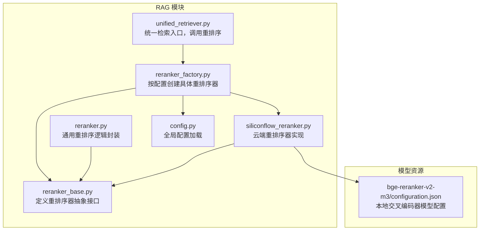
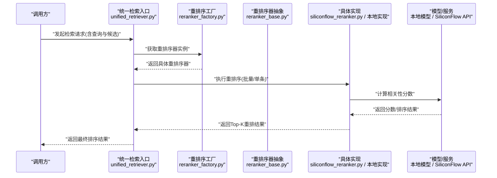
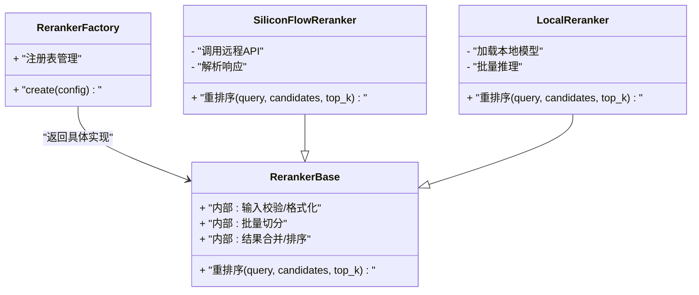
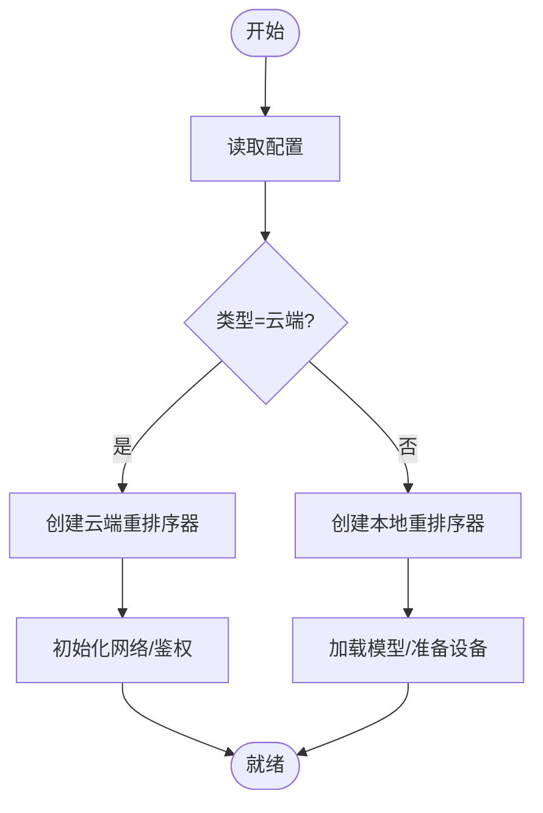
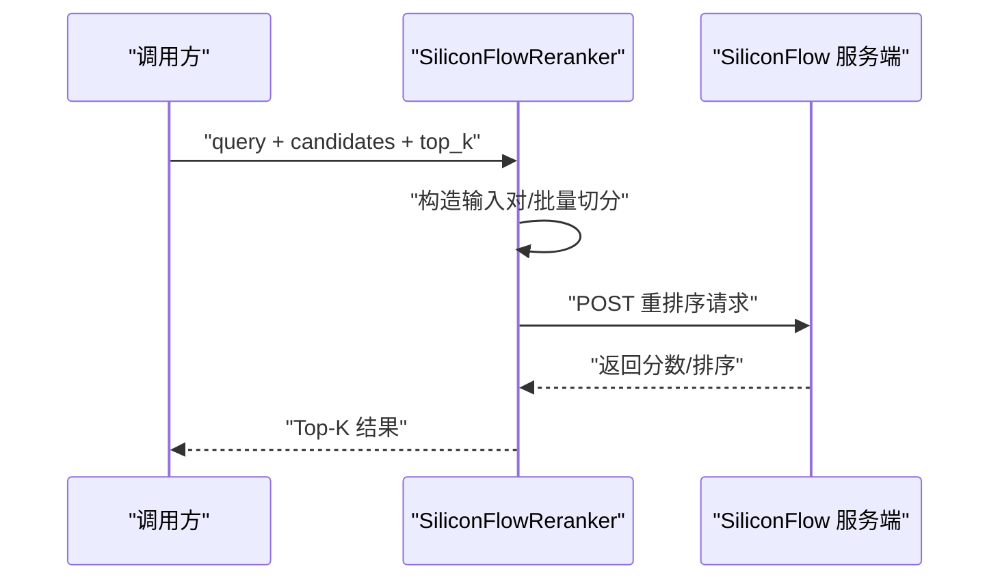
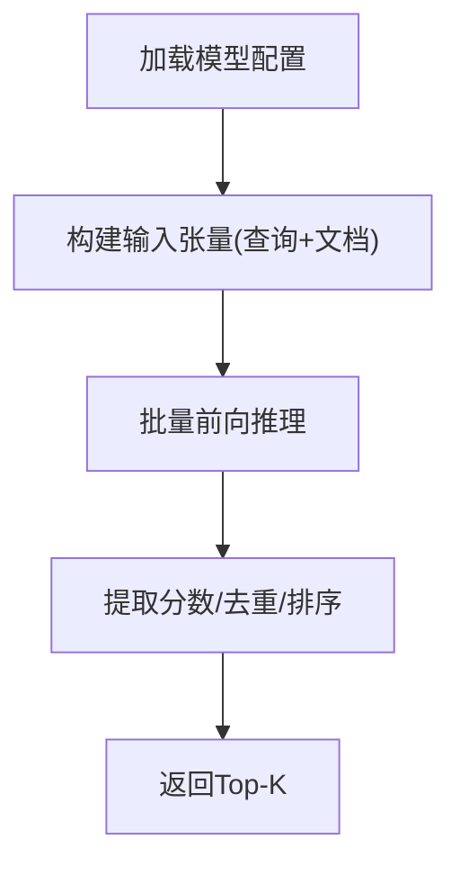
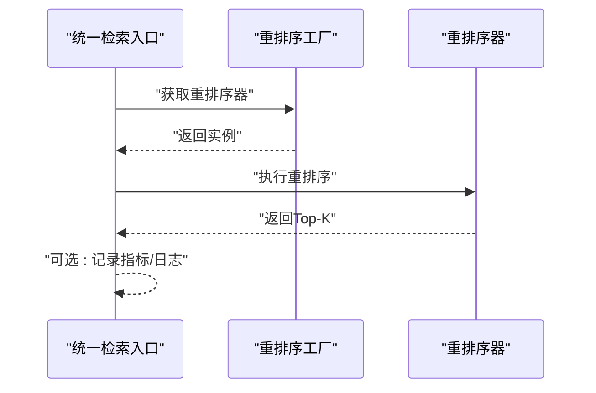
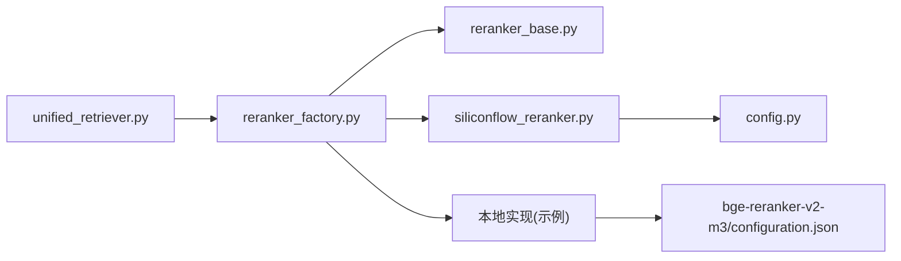

# 重排序系统

<cite>
**本文引用的文件**   
- [reranker.py](file://backend_design/nexus/rag/reranker.py)
- [reranker_base.py](file://backend_design/nexus/rag/reranker_base.py)
- [reranker_factory.py](file://backend_design/nexus/rag/reranker_factory.py)
- [siliconflow_reranker.py](file://backend_design/nexus/rag/siliconflow_reranker.py)
- [unified_retriever.py](file://backend_design/nexus/rag/unified_retriever.py)
- [config.py](file://backend_design/nexus/config.py)
- [bge-reranker-v2-m3/configuration.json](file://models/reranker/bge-reranker-v2-m3/configuration.json)
</cite>

## 目录
1. [简介](#简介)
2. [项目结构](#项目结构)
3. [核心组件](#核心组件)
4. [架构总览](#架构总览)
5. [详细组件分析](#详细组件分析)
6. [依赖关系分析](#依赖关系分析)
7. [性能考虑](#性能考虑)
8. [故障排查指南](#故障排查指南)
9. [结论](#结论)
10. [附录](#附录)

## 简介
本技术文档聚焦于RAG（检索增强生成）流程中的“重排序”子系统，系统性阐述：
- 交叉编码器模型的原理与优势
- 重排序器的集成架构（输入格式转换、批量处理、结果返回）
- 不同重排序器（SiliconFlow、本地模型等）的配置与使用方式
- 重排序效果评估指标（NDCG、MRR等）
- 性能优化策略（批大小、量化、缓存）
- 在RAG流程中的作用与最佳实践

## 项目结构
重排序相关代码位于后端RAG模块中，采用“抽象基类 + 工厂 + 多实现”的模块化设计，便于扩展新的重排序器。

图示来源
- [reranker_base.py](file://backend_design/nexus/rag/reranker_base.py)
- [reranker.py](file://backend_design/nexus/rag/reranker.py)
- [reranker_factory.py](file://backend_design/nexus/rag/reranker_factory.py)
- [siliconflow_reranker.py](file://backend_design/nexus/rag/siliconflow_reranker.py)
- [unified_retriever.py](file://backend_design/nexus/rag/unified_retriever.py)
- [config.py](file://backend_design/nexus/config.py)
- [bge-reranker-v2-m3/configuration.json](file://models/reranker/bge-reranker-v2-m3/configuration.json)

章节来源
- [reranker_base.py](file://backend_design/nexus/rag/reranker_base.py)
- [reranker.py](file://backend_design/nexus/rag/reranker.py)
- [reranker_factory.py](file://backend_design/nexus/rag/reranker_factory.py)
- [siliconflow_reranker.py](file://backend_design/nexus/rag/siliconflow_reranker.py)
- [unified_retriever.py](file://backend_design/nexus/rag/unified_retriever.py)
- [config.py](file://backend_design/nexus/config.py)
- [bge-reranker-v2-m3/configuration.json](file://models/reranker/bge-reranker-v2-m3/configuration.json)

## 核心组件
- 抽象接口层：定义统一的“查询-候选集 -> 评分/排序”能力，屏蔽不同实现的差异。
- 通用封装层：提供输入校验、批量切分、结果合并、异常兜底等通用逻辑。
- 工厂层：根据配置动态选择并实例化具体重排序器（云端或本地）。
- 具体实现：
  - SiliconFlow 重排序器：通过远程API进行交叉编码打分。
  - 本地重排序器：基于本地交叉编码器模型（如 bge-reranker-v2-m3）进行推理。
- 统一检索入口：在召回后调用重排序器对候选文档进行精排，输出最终Top-K。

章节来源
- [reranker_base.py](file://backend_design/nexus/rag/reranker_base.py)
- [reranker.py](file://backend_design/nexus/rag/reranker.py)
- [reranker_factory.py](file://backend_design/nexus/rag/reranker_factory.py)
- [siliconflow_reranker.py](file://backend_design/nexus/rag/siliconflow_reranker.py)
- [unified_retriever.py](file://backend_design/nexus/rag/unified_retriever.py)

## 架构总览
下图展示了从统一检索入口到重排序器的整体调用链与数据流。

图示来源
- [unified_retriever.py](file://backend_design/nexus/rag/unified_retriever.py)
- [reranker_factory.py](file://backend_design/nexus/rag/reranker_factory.py)
- [reranker_base.py](file://backend_design/nexus/rag/reranker_base.py)
- [siliconflow_reranker.py](file://backend_design/nexus/rag/siliconflow_reranker.py)

## 详细组件分析

### 抽象接口与通用封装
- 抽象接口职责
  - 定义统一的“重排序”方法签名，包括查询、候选列表、Top-K等参数。
  - 约定输入输出的数据结构，确保上层调用一致。
- 通用封装职责
  - 输入规范化：将外部传入的候选对象转换为模型可接受的文本对格式。
  - 批量处理：按批次切分候选集，控制单次推理规模，避免OOM。
  - 结果聚合：将各批次结果合并并按分数降序排列，返回Top-K。
  - 异常兜底：捕获网络/模型异常，降级为原始顺序或空结果。

图示来源
- [reranker_base.py](file://backend_design/nexus/rag/reranker_base.py)
- [reranker_factory.py](file://backend_design/nexus/rag/reranker_factory.py)
- [siliconflow_reranker.py](file://backend_design/nexus/rag/siliconflow_reranker.py)

章节来源
- [reranker_base.py](file://backend_design/nexus/rag/reranker_base.py)
- [reranker.py](file://backend_design/nexus/rag/reranker.py)
- [reranker_factory.py](file://backend_design/nexus/rag/reranker_factory.py)
- [siliconflow_reranker.py](file://backend_design/nexus/rag/siliconflow_reranker.py)

### 工厂与配置
- 工厂模式
  - 依据配置项选择具体重排序器类型（云端/本地）。
  - 集中管理重排序器生命周期与初始化参数。
- 配置项建议
  - 重排序器类型（siliconflow/local）
  - 模型路径/名称（本地）
  - 批大小、最大长度、设备（GPU/CPU）
  - 云端API密钥、端点、超时与重试策略

图示来源
- [reranker_factory.py](file://backend_design/nexus/rag/reranker_factory.py)
- [config.py](file://backend_design/nexus/config.py)

章节来源
- [reranker_factory.py](file://backend_design/nexus/rag/reranker_factory.py)
- [config.py](file://backend_design/nexus/config.py)

### SiliconFlow 重排序器
- 工作原理
  - 将查询与每个候选文档拼接为交叉编码输入对。
  - 通过远程API提交批量请求，获得相关性分数。
  - 按分数降序返回Top-K。
- 关键特性
  - 无需本地部署模型，适合快速上线与弹性伸缩。
  - 需关注网络延迟、配额限制与错误码处理。
- 典型配置要点
  - API密钥、端点URL、请求超时、重试次数、并发上限。

图示来源
- [siliconflow_reranker.py](file://backend_design/nexus/rag/siliconflow_reranker.py)

章节来源
- [siliconflow_reranker.py](file://backend_design/nexus/rag/siliconflow_reranker.py)

### 本地重排序器（以 bge-reranker-v2-m3 为例）
- 工作原理
  - 使用本地交叉编码器模型对查询-文档对进行联合编码，输出相关性分数。
  - 支持批量推理，充分利用GPU并行能力。
- 模型配置
  - 模型配置文件包含词表、特殊token、注意力掩码等元信息。
  - 可通过配置指定设备、精度、最大序列长度等。
- 适用场景
  - 对延迟敏感且具备GPU资源的部署环境。
  - 需要离线运行或数据不出域的合规场景。

图示来源
- [bge-reranker-v2-m3/configuration.json](file://models/reranker/bge-reranker-v2-m3/configuration.json)

章节来源
- [bge-reranker-v2-m3/configuration.json](file://models/reranker/bge-reranker-v2-m3/configuration.json)

### 统一检索入口中的重排序集成
- 位置与作用
  - 在召回阶段之后，对候选集合执行精排，提升最终结果的相关性与多样性。
- 调用流程
  - 接收召回候选集与查询。
  - 通过工厂获取重排序器实例。
  - 执行重排序并返回Top-K。
- 容错与降级
  - 当重排序失败时，可回退至召回顺序或空结果，保证主流程可用。

图示来源
- [unified_retriever.py](file://backend_design/nexus/rag/unified_retriever.py)
- [reranker_factory.py](file://backend_design/nexus/rag/reranker_factory.py)

章节来源
- [unified_retriever.py](file://backend_design/nexus/rag/unified_retriever.py)
- [reranker_factory.py](file://backend_design/nexus/rag/reranker_factory.py)

## 依赖关系分析
- 耦合度
  - 统一检索入口仅依赖工厂与抽象接口，不感知具体实现，解耦良好。
  - 工厂集中管理配置与实例化，降低散乱new带来的维护成本。
- 外部依赖
  - 云端实现依赖HTTP客户端与鉴权库。
  - 本地实现依赖深度学习框架与模型权重。
- 潜在风险
  - 循环依赖：应确保工厂与实现之间单向依赖。
  - 配置不一致：工厂与实现所需参数需保持一致。

图示来源
- [unified_retriever.py](file://backend_design/nexus/rag/unified_retriever.py)
- [reranker_factory.py](file://backend_design/nexus/rag/reranker_factory.py)
- [reranker_base.py](file://backend_design/nexus/rag/reranker_base.py)
- [siliconflow_reranker.py](file://backend_design/nexus/rag/siliconflow_reranker.py)
- [config.py](file://backend_design/nexus/config.py)
- [bge-reranker-v2-m3/configuration.json](file://models/reranker/bge-reranker-v2-m3/configuration.json)

章节来源
- [unified_retriever.py](file://backend_design/nexus/rag/unified_retriever.py)
- [reranker_factory.py](file://backend_design/nexus/rag/reranker_factory.py)
- [reranker_base.py](file://backend_design/nexus/rag/reranker_base.py)
- [siliconflow_reranker.py](file://backend_design/nexus/rag/siliconflow_reranker.py)
- [config.py](file://backend_design/nexus/config.py)
- [bge-reranker-v2-m3/configuration.json](file://models/reranker/bge-reranker-v2-m3/configuration.json)

## 性能考虑
- 批大小调整
  - 增大批大小可提升吞吐，但需平衡显存占用与延迟；建议根据GPU显存与QPS目标做压测寻优。
- 模型量化
  - 对本地模型采用INT8/FP16量化可降低显存与带宽压力，提高推理速度，同时监控精度损失。
- 缓存机制
  - 对相同查询-文档对的相似度分数进行缓存（键可为查询哈希+文档ID），命中直接返回，减少重复计算。
- 异步与并发
  - 云端实现可采用异步HTTP与连接池，合理设置并发上限与超时重试。
- 输入裁剪
  - 对超长文档进行截断或摘要，控制最大序列长度，避免无效Token带来的开销。
- 设备与内存
  - 优先使用GPU；CPU推理时启用多线程与内存复用，避免频繁分配释放。

[本节为通用指导，不涉及具体文件分析]

## 故障排查指南
- 常见问题定位
  - 云端重排序失败：检查网络连通性、鉴权令牌、配额与错误码；增加重试与熔断保护。
  - 本地模型加载失败：确认模型路径、配置文件完整性、设备可用性（CUDA驱动/版本）。
  - 结果异常：核对输入格式（查询-文档对）、是否出现空候选、Top-K是否越界。
- 观测与诊断
  - 记录关键指标：耗时分布、批次大小、命中率、错误率。
  - 打印必要上下文：查询长度、候选数量、模型配置、设备信息。
- 恢复策略
  - 自动降级：重排序失败时退回召回顺序或空结果，保障主流程可用。
  - 限流与熔断：防止雪崩效应，保护上游服务。

章节来源
- [reranker.py](file://backend_design/nexus/rag/reranker.py)
- [siliconflow_reranker.py](file://backend_design/nexus/rag/siliconflow_reranker.py)

## 结论
本重排序系统通过抽象接口与工厂模式实现了云端与本地两种重排序器的统一接入，既保证了扩展性，又兼顾了工程落地。结合合理的批大小、量化与缓存策略，可在保证质量的同时显著提升吞吐与稳定性。在RAG流程中，重排序作为召回后的精排环节，对最终答案的相关性与用户满意度具有决定性影响。

[本节为总结性内容，不涉及具体文件分析]

## 附录

### 重排序算法原理与优势
- 交叉编码器原理
  - 将查询与候选文档拼接为联合输入，通过共享编码器进行交互建模，输出相关性分数。
  - 相比双塔（独立编码再内积）方案，交叉编码器能捕捉细粒度语义匹配，精度更高。
- 优势
  - 更高的排序质量：对复杂语义与长尾问题更鲁棒。
  - 灵活性强：可适配多种任务与领域数据。
- 代价
  - 计算开销更大：需对每对查询-文档进行联合编码。
  - 延迟较高：通常用于小规模候选的精排阶段。

[本节为概念性说明，不涉及具体文件分析]

### 评估指标与实验方法
- 常用指标
  - NDCG（归一化折损累计增益）：衡量排序质量，考虑位置衰减与真实相关性。
  - MRR（平均倒数排名）：关注首个相关结果的排名位置。
  - Recall@K、Precision@K：基础检索质量度量。
- 实验建议
  - 构建带标注的测试集（查询-相关文档对）。
  - 对比不同重排序器与超参（批大小、阈值、Top-K）。
  - 统计延迟与吞吐，结合业务SLA综合评估。

[本节为概念性说明，不涉及具体文件分析]

### 配置与使用示例（路径指引）
- 云端重排序器
  - 参考实现路径：[siliconflow_reranker.py](file://backend_design/nexus/rag/siliconflow_reranker.py)
  - 配置项参考：[config.py](file://backend_design/nexus/config.py)
- 本地重排序器
  - 模型配置参考：[bge-reranker-v2-m3/configuration.json](file://models/reranker/bge-reranker-v2-m3/configuration.json)
- 统一入口
  - 调用参考：[unified_retriever.py](file://backend_design/nexus/rag/unified_retriever.py)
  - 工厂与抽象：[reranker_factory.py](file://backend_design/nexus/rag/reranker_factory.py)、[reranker_base.py](file://backend_design/nexus/rag/reranker_base.py)

章节来源
- [siliconflow_reranker.py](file://backend_design/nexus/rag/siliconflow_reranker.py)
- [config.py](file://backend_design/nexus/config.py)
- [bge-reranker-v2-m3/configuration.json](file://models/reranker/bge-reranker-v2-m3/configuration.json)
- [unified_retriever.py](file://backend_design/nexus/rag/unified_retriever.py)
- [reranker_factory.py](file://backend_design/nexus/rag/reranker_factory.py)
- [reranker_base.py](file://backend_design/nexus/rag/reranker_base.py)