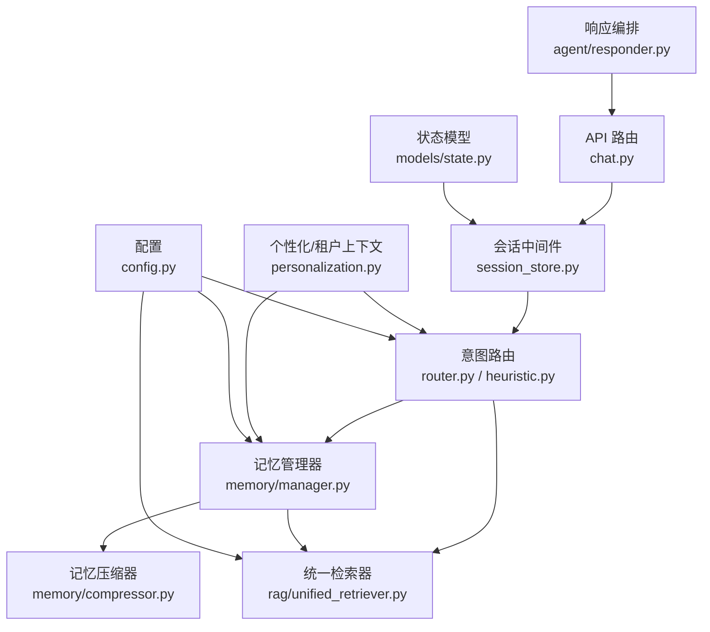
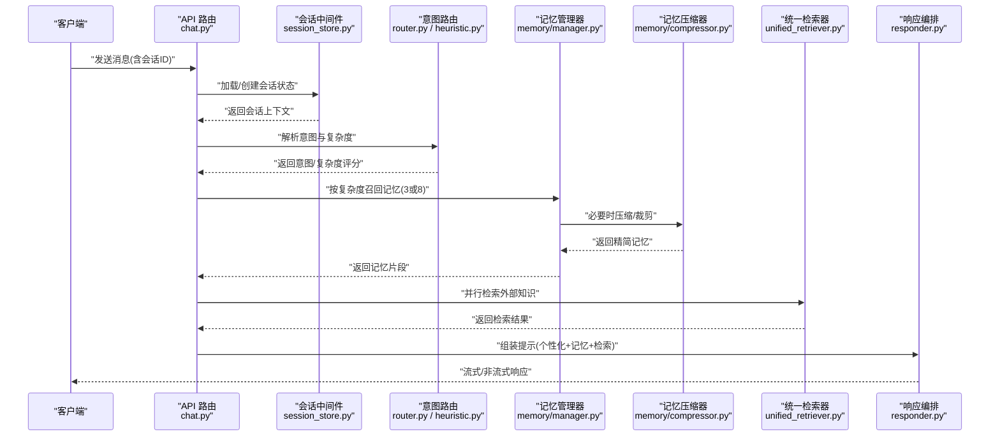
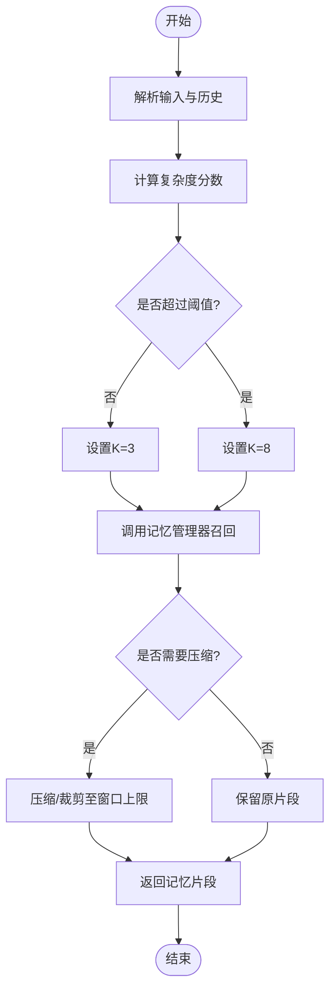
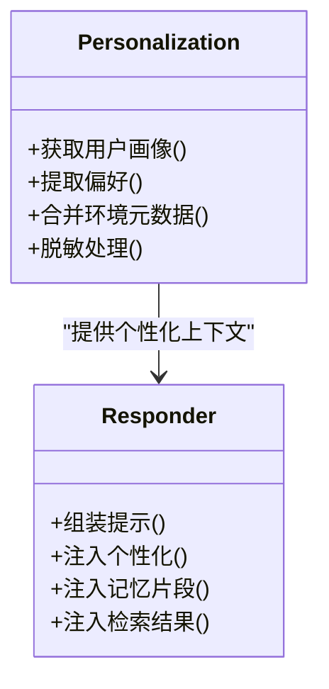
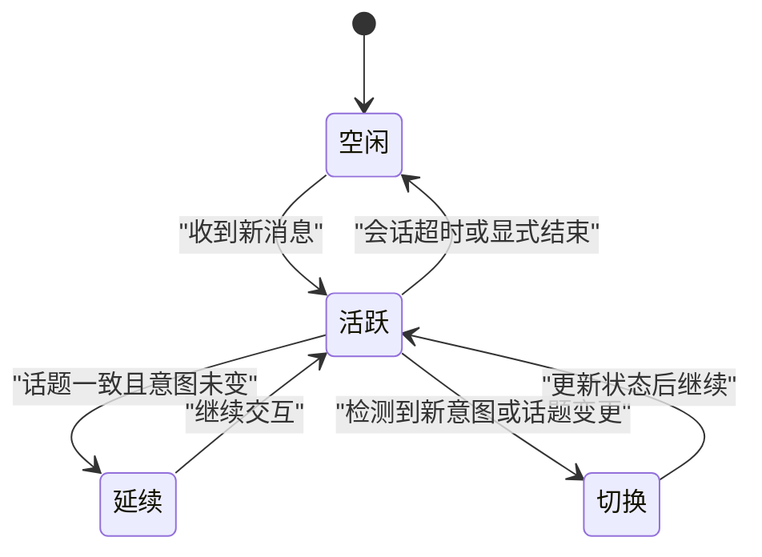
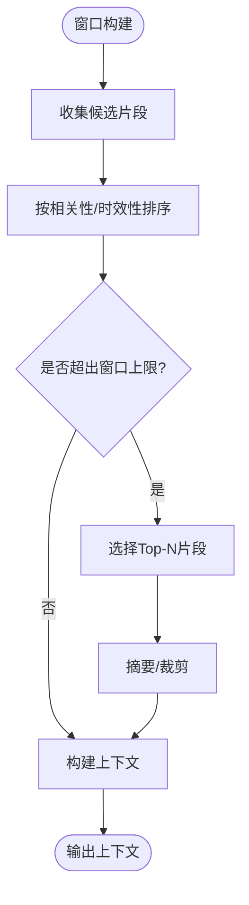
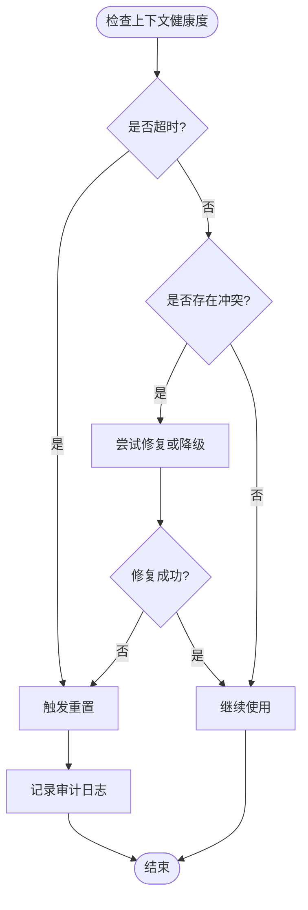
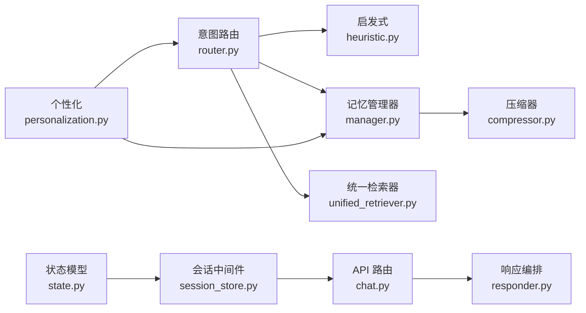

# 上下文感知增强

<cite>
**本文引用的文件**   
- [backend_design/nexus/core/personalization.py](file://backend_design/nexus/core/personalization.py)
- [backend_design/nexus/memory/manager.py](file://backend_design/nexus/memory/manager.py)
- [backend_design/nexus/memory/compressor.py](file://backend_design/nexus/memory/compressor.py)
- [backend_design/nexus/intent/router.py](file://backend_design/nexus/intent/router.py)
- [backend_design/nexus/intent/heuristic.py](file://backend_design/nexus/intent/heuristic.py)
- [backend_design/nexus/api/routes/chat.py](file://backend_design/nexus/api/routes/chat.py)
- [backend_design/nexus/middleware/session_store.py](file://backend_design/nexus/middleware/session_store.py)
- [backend_design/nexus/models/state.py](file://backend_design/nexus/models/state.py)
- [backend_design/nexus/config.py](file://backend_design/nexus/config.py)
- [backend_design/nexus/rag/unified_retriever.py](file://backend_design/nexus/rag/unified_retriever.py)
- [backend_design/nexus/agent/responder.py](file://backend_design/nexus/agent/responder.py)
</cite>

## 目录
1. [简介](#简介)
2. [项目结构](#项目结构)
3. [核心组件](#核心组件)
4. [架构总览](#架构总览)
5. [详细组件分析](#详细组件分析)
6. [依赖关系分析](#依赖关系分析)
7. [性能考量](#性能考量)
8. [故障排查指南](#故障排查指南)
9. [结论](#结论)
10. [附录](#附录)

## 简介
本技术文档聚焦 NexusCockpit 的“上下文感知增强”子系统，围绕以下目标展开：
- 基于用户历史对话、当前会话状态与环境信息实现智能决策
- 渐进式披露策略：按查询复杂度动态调整记忆召回数量（简单指令约3条，复杂查询约8条）
- 上下文注入机制：将个性化信息与检索结果无缝融入对话生成
- 多轮对话状态管理：话题延续、指代消解、意图保持
- 上下文窗口优化：在性能与准确性之间取得平衡
- 上下文失效检测与重置：识别并清理过期或冲突的上下文片段

## 项目结构
与上下文感知相关的代码主要分布在如下模块：
- 个性化与租户上下文：core/personalization.py
- 记忆管理与压缩：memory/manager.py, memory/compressor.py
- 意图路由与启发式判断：intent/router.py, intent/heuristic.py
- 会话中间件与状态模型：middleware/session_store.py, models/state.py
- 统一检索器与RAG：rag/unified_retriever.py
- 响应编排与提示组装：agent/responder.py
- API 入口与参数透传：api/routes/chat.py
- 配置项：config.py

图表来源
- [backend_design/nexus/api/routes/chat.py](file://backend_design/nexus/api/routes/chat.py)
- [backend_design/nexus/middleware/session_store.py](file://backend_design/nexus/middleware/session_store.py)
- [backend_design/nexus/intent/router.py](file://backend_design/nexus/intent/router.py)
- [backend_design/nexus/intent/heuristic.py](file://backend_design/nexus/intent/heuristic.py)
- [backend_design/nexus/memory/manager.py](file://backend_design/nexus/memory/manager.py)
- [backend_design/nexus/memory/compressor.py](file://backend_design/nexus/memory/compressor.py)
- [backend_design/nexus/rag/unified_retriever.py](file://backend_design/nexus/rag/unified_retriever.py)
- [backend_design/nexus/core/personalization.py](file://backend_design/nexus/core/personalization.py)
- [backend_design/nexus/models/state.py](file://backend_design/nexus/models/state.py)
- [backend_design/nexus/agent/responder.py](file://backend_design/nexus/agent/responder.py)
- [backend_design/nexus/config.py](file://backend_design/nexus/config.py)

章节来源
- [backend_design/nexus/api/routes/chat.py](file://backend_design/nexus/api/routes/chat.py)
- [backend_design/nexus/middleware/session_store.py](file://backend_design/nexus/middleware/session_store.py)
- [backend_design/nexus/intent/router.py](file://backend_design/nexus/intent/router.py)
- [backend_design/nexus/intent/heuristic.py](file://backend_design/nexus/intent/heuristic.py)
- [backend_design/nexus/memory/manager.py](file://backend_design/nexus/memory/manager.py)
- [backend_design/nexus/memory/compressor.py](file://backend_design/nexus/memory/compressor.py)
- [backend_design/nexus/rag/unified_retriever.py](file://backend_design/nexus/rag/unified_retriever.py)
- [backend_design/nexus/core/personalization.py](file://backend_design/nexus/core/personalization.py)
- [backend_design/nexus/models/state.py](file://backend_design/nexus/models/state.py)
- [backend_design/nexus/agent/responder.py](file://backend_design/nexus/agent/responder.py)
- [backend_design/nexus/config.py](file://backend_design/nexus/config.py)

## 核心组件
- 个性化与租户上下文：提供用户画像、偏好、设备与环境元数据，作为上下文注入的基础。
- 记忆管理器：维护会话级与跨会话的记忆条目，负责新增、更新、去重与回收。
- 记忆压缩器：对长上下文进行摘要与裁剪，控制上下文窗口大小。
- 意图路由与启发式：根据输入文本与历史推断意图类别与查询复杂度，决定后续策略。
- 统一检索器：聚合多种后端（向量/图/知识库），按策略召回相关片段。
- 会话中间件：承载会话状态、上下文缓存、失效检测与重置。
- 状态模型：定义会话状态机、话题标签、指代槽位与意图保持字段。
- 响应编排：组装最终提示词，融合个性化、记忆与检索结果，驱动 LLM 生成。

章节来源
- [backend_design/nexus/core/personalization.py](file://backend_design/nexus/core/personalization.py)
- [backend_design/nexus/memory/manager.py](file://backend_design/nexus/memory/manager.py)
- [backend_design/nexus/memory/compressor.py](file://backend_design/nexus/memory/compressor.py)
- [backend_design/nexus/intent/router.py](file://backend_design/nexus/intent/router.py)
- [backend_design/nexus/intent/heuristic.py](file://backend_design/nexus/intent/heuristic.py)
- [backend_design/nexus/rag/unified_retriever.py](file://backend_design/nexus/rag/unified_retriever.py)
- [backend_design/nexus/middleware/session_store.py](file://backend_design/nexus/middleware/session_store.py)
- [backend_design/nexus/models/state.py](file://backend_design/nexus/models/state.py)
- [backend_design/nexus/agent/responder.py](file://backend_design/nexus/agent/responder.py)

## 架构总览
下图展示了从请求进入 API 到响应返回的端到端流程，突出上下文感知链路的关键节点与数据流向。

图表来源
- [backend_design/nexus/api/routes/chat.py](file://backend_design/nexus/api/routes/chat.py)
- [backend_design/nexus/middleware/session_store.py](file://backend_design/nexus/middleware/session_store.py)
- [backend_design/nexus/intent/router.py](file://backend_design/nexus/intent/router.py)
- [backend_design/nexus/intent/heuristic.py](file://backend_design/nexus/intent/heuristic.py)
- [backend_design/nexus/memory/manager.py](file://backend_design/nexus/memory/manager.py)
- [backend_design/nexus/memory/compressor.py](file://backend_design/nexus/memory/compressor.py)
- [backend_design/nexus/rag/unified_retriever.py](file://backend_design/nexus/rag/unified_retriever.py)
- [backend_design/nexus/agent/responder.py](file://backend_design/nexus/agent/responder.py)

## 详细组件分析

### 渐进式披露策略（按复杂度动态调整记忆召回数量）
- 复杂度评估：由意图路由与启发式模块共同完成，结合关键词、句法特征、历史交互密度等指标计算复杂度分数。
- 阈值与档位：
  - 简单指令：复杂度低于阈值时，仅召回少量高置信度记忆（默认约3条）。
  - 中等查询：召回中等数量（默认约5条）。
  - 复杂查询：超过阈值时，扩大召回范围（默认约8条），并提高检索权重。
- 动态回退：当检索失败或超时，自动降级为较小召回规模，保证可用性。

图表来源
- [backend_design/nexus/intent/router.py](file://backend_design/nexus/intent/router.py)
- [backend_design/nexus/intent/heuristic.py](file://backend_design/nexus/intent/heuristic.py)
- [backend_design/nexus/memory/manager.py](file://backend_design/nexus/memory/manager.py)
- [backend_design/nexus/memory/compressor.py](file://backend_design/nexus/memory/compressor.py)

章节来源
- [backend_design/nexus/intent/router.py](file://backend_design/nexus/intent/router.py)
- [backend_design/nexus/intent/heuristic.py](file://backend_design/nexus/intent/heuristic.py)
- [backend_design/nexus/memory/manager.py](file://backend_design/nexus/memory/manager.py)
- [backend_design/nexus/memory/compressor.py](file://backend_design/nexus/memory/compressor.py)

### 上下文注入机制（个性化信息无缝融入对话生成）
- 个性化来源：用户画像、偏好、最近行为、设备与环境元数据。
- 注入位置：在响应编排阶段，将个性化摘要、关键偏好与记忆片段组合成提示模板，确保不泄露敏感细节，同时提升相关性。
- 安全与隐私：对个人信息进行脱敏与最小化展示；仅在必要字段中携带。

图表来源
- [backend_design/nexus/core/personalization.py](file://backend_design/nexus/core/personalization.py)
- [backend_design/nexus/agent/responder.py](file://backend_design/nexus/agent/responder.py)

章节来源
- [backend_design/nexus/core/personalization.py](file://backend_design/nexus/core/personalization.py)
- [backend_design/nexus/agent/responder.py](file://backend_design/nexus/agent/responder.py)

### 多轮对话的状态管理（话题延续、指代消解、意图保持）
- 状态模型：包含会话ID、话题标签、当前意图、指代槽位、时间戳与上下文指针。
- 话题延续：通过话题标签与相似度匹配，维持跨轮次的话题一致性。
- 指代消解：利用上一轮的实体与槽位信息，在当前轮次进行替换与补全。
- 意图保持：若新输入未明确切换意图，则沿用上一轮意图，减少误判。

图表来源
- [backend_design/nexus/models/state.py](file://backend_design/nexus/models/state.py)
- [backend_design/nexus/middleware/session_store.py](file://backend_design/nexus/middleware/session_store.py)

章节来源
- [backend_design/nexus/models/state.py](file://backend_design/nexus/models/state.py)
- [backend_design/nexus/middleware/session_store.py](file://backend_design/nexus/middleware/session_store.py)

### 上下文窗口优化策略（平衡性能与准确性）
- 窗口上限：根据模型上下文长度与系统资源设定最大 token 数。
- 优先级排序：按相关性、时效性与重要性对片段排序，优先保留高价值内容。
- 压缩与摘要：对长段落进行摘要，保留关键事实与实体。
- 分层缓存：热点上下文放入内存缓存，冷数据落盘或延迟加载。

图表来源
- [backend_design/nexus/memory/compressor.py](file://backend_design/nexus/memory/compressor.py)
- [backend_design/nexus/memory/manager.py](file://backend_design/nexus/memory/manager.py)

章节来源
- [backend_design/nexus/memory/compressor.py](file://backend_design/nexus/memory/compressor.py)
- [backend_design/nexus/memory/manager.py](file://backend_design/nexus/memory/manager.py)

### 上下文失效检测与重置机制
- 失效条件：长时间无交互、会话超时、用户主动退出、上下文冲突或错误累积。
- 检测策略：基于时间戳、交互频率与质量指标（如重复提问、低置信度）判定。
- 重置流程：清空会话状态、释放缓存、记录审计日志，并通知上层服务重建上下文。

图表来源
- [backend_design/nexus/middleware/session_store.py](file://backend_design/nexus/middleware/session_store.py)
- [backend_design/nexus/models/state.py](file://backend_design/nexus/models/state.py)

章节来源
- [backend_design/nexus/middleware/session_store.py](file://backend_design/nexus/middleware/session_store.py)
- [backend_design/nexus/models/state.py](file://backend_design/nexus/models/state.py)

## 依赖关系分析
- 耦合与内聚：
  - 意图路由与启发式模块相对独立，便于扩展新的复杂度评估规则。
  - 记忆管理器与压缩器紧密协作，形成“召回-压缩”的内聚单元。
  - 会话中间件与状态模型强耦合，保障状态一致性。
- 外部依赖：
  - 统一检索器对接多种后端（向量/图/知识库），通过工厂模式降低耦合。
  - 个性化模块可接入外部用户画像服务，支持热更新。
- 潜在循环依赖：
  - 避免 responder 直接依赖 session_store，应通过 API 路由层协调，防止循环引用。

图表来源
- [backend_design/nexus/intent/router.py](file://backend_design/nexus/intent/router.py)
- [backend_design/nexus/intent/heuristic.py](file://backend_design/nexus/intent/heuristic.py)
- [backend_design/nexus/memory/manager.py](file://backend_design/nexus/memory/manager.py)
- [backend_design/nexus/memory/compressor.py](file://backend_design/nexus/memory/compressor.py)
- [backend_design/nexus/rag/unified_retriever.py](file://backend_design/nexus/rag/unified_retriever.py)
- [backend_design/nexus/core/personalization.py](file://backend_design/nexus/core/personalization.py)
- [backend_design/nexus/models/state.py](file://backend_design/nexus/models/state.py)
- [backend_design/nexus/middleware/session_store.py](file://backend_design/nexus/middleware/session_store.py)
- [backend_design/nexus/api/routes/chat.py](file://backend_design/nexus/api/routes/chat.py)
- [backend_design/nexus/agent/responder.py](file://backend_design/nexus/agent/responder.py)

章节来源
- [backend_design/nexus/intent/router.py](file://backend_design/nexus/intent/router.py)
- [backend_design/nexus/intent/heuristic.py](file://backend_design/nexus/intent/heuristic.py)
- [backend_design/nexus/memory/manager.py](file://backend_design/nexus/memory/manager.py)
- [backend_design/nexus/memory/compressor.py](file://backend_design/nexus/memory/compressor.py)
- [backend_design/nexus/rag/unified_retriever.py](file://backend_design/nexus/rag/unified_retriever.py)
- [backend_design/nexus/core/personalization.py](file://backend_design/nexus/core/personalization.py)
- [backend_design/nexus/models/state.py](file://backend_design/nexus/models/state.py)
- [backend_design/nexus/middleware/session_store.py](file://backend_design/nexus/middleware/session_store.py)
- [backend_design/nexus/api/routes/chat.py](file://backend_design/nexus/api/routes/chat.py)
- [backend_design/nexus/agent/responder.py](file://backend_design/nexus/agent/responder.py)

## 性能考量
- 并发与缓存：
  - 会话中间件使用内存缓存加速热点会话读取。
  - 检索器支持并行调用多个后端，缩短整体延迟。
- 动态降级：
  - 当检索或压缩耗时过高时，自动降低 K 值或跳过压缩，保证响应时效。
- 资源限制：
  - 通过配置项限制最大上下文长度与最大召回数量，避免 OOM 或超时。
- 监控与观测：
  - 记录关键指标（复杂度分布、K 值选择、压缩率、检索命中率），用于调优。

[本节为通用指导，无需列出具体文件来源]

## 故障排查指南
- 常见问题定位：
  - 上下文未生效：检查会话中间件是否正确加载状态，确认个性化模块是否返回有效数据。
  - 召回过多或过少：查看复杂度评分与阈值配置，核对 K 值选择逻辑。
  - 上下文过长导致超时：启用压缩器并调整窗口上限，观察压缩率与命中效果。
  - 会话未重置：检查失效检测条件与重置流程，确认审计日志是否记录。
- 建议操作：
  - 开启调试日志，追踪意图评分、K 值、压缩前后长度变化。
  - 逐步放宽阈值与 K 值，观察准确率与延迟的变化曲线。
  - 对热点会话增加缓存命中率统计，定位瓶颈。

章节来源
- [backend_design/nexus/middleware/session_store.py](file://backend_design/nexus/middleware/session_store.py)
- [backend_design/nexus/memory/compressor.py](file://backend_design/nexus/memory/compressor.py)
- [backend_design/nexus/intent/router.py](file://backend_design/nexus/intent/router.py)
- [backend_design/nexus/config.py](file://backend_design/nexus/config.py)

## 结论
NexusCockpit 的上下文感知增强系统通过“意图评估—渐进式披露—记忆压缩—统一检索—个性化注入—状态管理”的闭环，实现了在多轮对话中的智能决策与高效生成。其设计兼顾了准确性与性能，具备可扩展的模块化结构与完善的失效检测机制，适合在车载与多终端场景下持续演进。

[本节为总结性内容，无需列出具体文件来源]

## 附录
- 配置项参考：
  - 复杂度阈值、K 值档位、上下文窗口上限、压缩策略开关、检索超时与重试次数等，均可在配置文件中集中管理。
- 最佳实践：
  - 定期评估复杂度阈值与 K 值，结合线上指标进行微调。
  - 对个性化信息进行最小化展示，遵循隐私合规要求。
  - 建立上下文健康度监控与告警，及时发现异常会话。

章节来源
- [backend_design/nexus/config.py](file://backend_design/nexus/config.py)