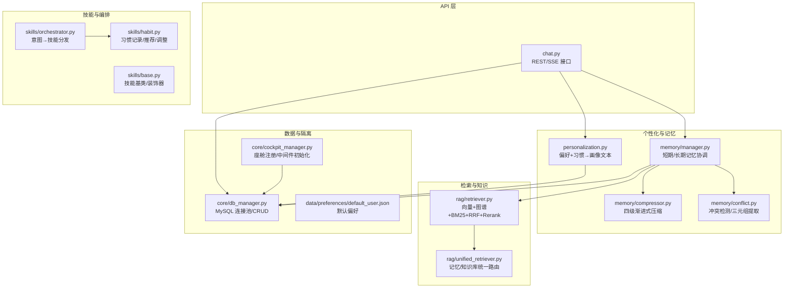
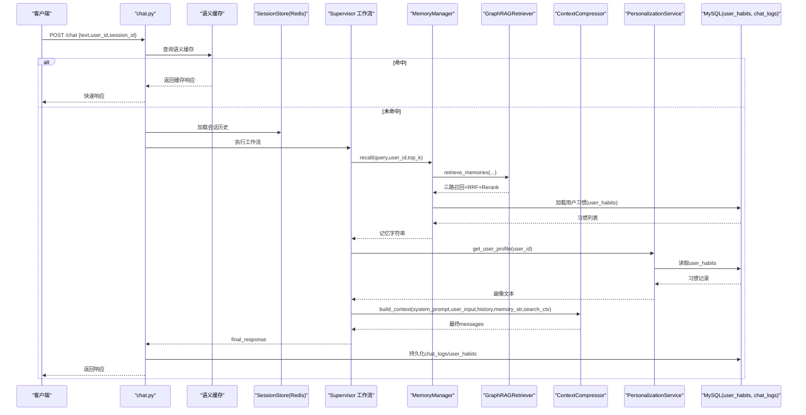
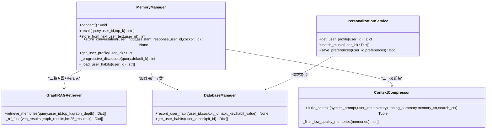
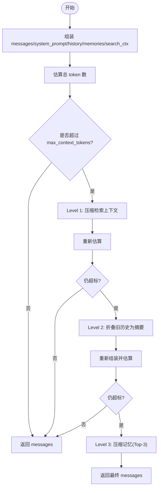
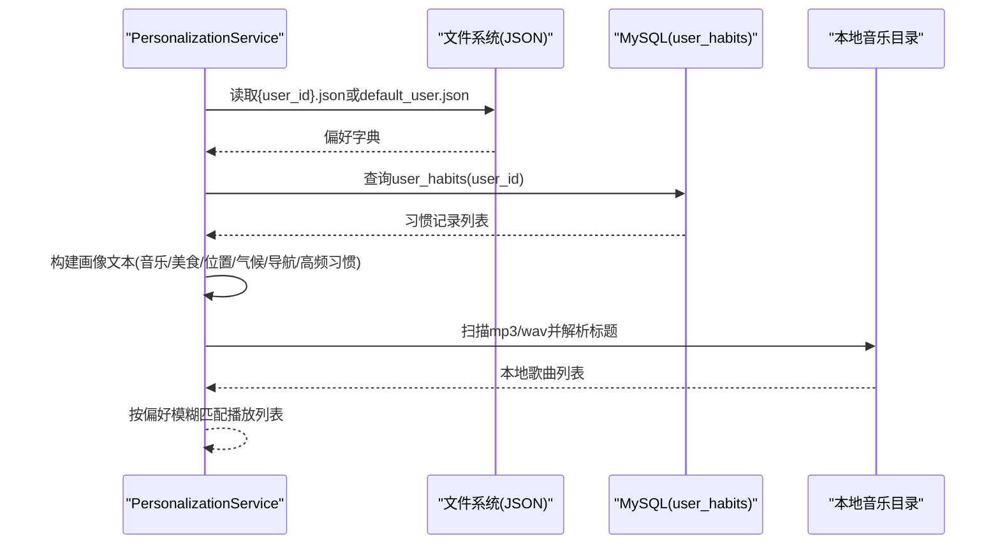
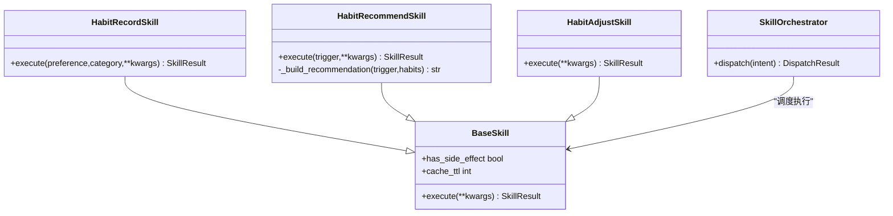
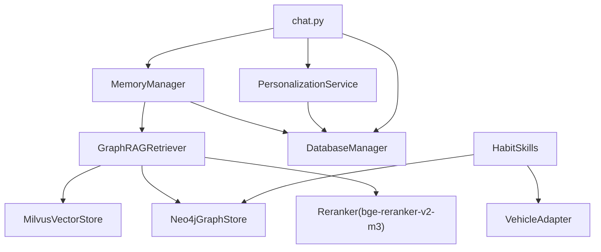

# 个性化服务

<cite>
**本文引用的文件**   
- [manager.py](file://backend_design/nexus/memory/manager.py)
- [compressor.py](file://backend_design/nexus/memory/compressor.py)
- [conflict.py](file://backend_design/nexus/memory/conflict.py)
- [personalization.py](file://backend_design/nexus/core/personalization.py)
- [habit.py](file://backend_design/nexus/skills/habit.py)
- [chat.py](file://backend_design/nexus/api/routes/chat.py)
- [retriever.py](file://backend_design/nexus/rag/retriever.py)
- [unified_retriever.py](file://backend_design/nexus/rag/unified_retriever.py)
- [db_manager.py](file://backend_design/nexus/core/db_manager.py)
- [orchestrator.py](file://backend_design/nexus/skills/orchestrator.py)
- [base.py](file://backend_design/nexus/skills/base.py)
- [cockpit_manager.py](file://backend_design/nexus/core/cockpit_manager.py)
- [default_user.json](file://data/preferences/default_user.json)
</cite>

## 目录
1. [引言](#引言)
2. [项目结构](#项目结构)
3. [核心组件](#核心组件)
4. [架构总览](#架构总览)
5. [详细组件分析](#详细组件分析)
6. [依赖关系分析](#依赖关系分析)
7. [性能考量](#性能考量)
8. [故障排查指南](#故障排查指南)
9. [结论](#结论)
10. [附录：记忆数据可视化管理与编辑工具使用说明](#附录记忆数据可视化管理与编辑工具使用说明)

## 引言
本技术文档聚焦于 NexusCockpit 的“个性化服务”，围绕记忆管理系统、记忆压缩算法、用户画像构建、上下文感知对话增强、个性化推荐策略与隐私保护机制展开，并提供记忆数据的可视化管理与编辑工具使用指引。目标是帮助开发者与产品运营人员深入理解系统如何基于短期会话上下文与长期用户画像实现高质量、可解释、可扩展的个性化交互体验。

## 项目结构
个性化服务相关代码主要分布在以下模块：
- 记忆管理：memory（短期/长期记忆存储、冲突检测、记忆提取）
- 检索与召回：rag（GraphRAG 三路融合检索、统一检索路由）
- 个性化服务：core.personalization（偏好读取、习惯加载、画像文本构建、音乐匹配）
- 技能编排与习惯画像：skills（习惯记录/推荐/调整、技能基类与编排器）
- API 层：api.routes.chat（对话接口、指标记录、日志持久化、会话并发控制）
- 数据库：core.db_manager（MySQL 连接池、多表 CRUD、用户习惯表）
- 座舱隔离：core.cockpit_manager（座舱注册、中间件初始化、统计键初始化）

图表来源
- [chat.py:1-392](file://backend_design/nexus/api/routes/chat.py#L1-L392)
- [personalization.py:1-354](file://backend_design/nexus/core/personalization.py#L1-L354)
- [manager.py:1-398](file://backend_design/nexus/memory/manager.py#L1-L398)
- [compressor.py:1-352](file://backend_design/nexus/memory/compressor.py#L1-L352)
- [conflict.py:1-174](file://backend_design/nexus/memory/conflict.py#L1-L174)
- [retriever.py:1-252](file://backend_design/nexus/rag/retriever.py#L1-L252)
- [unified_retriever.py:1-155](file://backend_design/nexus/rag/unified_retriever.py#L1-L155)
- [habit.py:1-215](file://backend_design/nexus/skills/habit.py#L1-L215)
- [orchestrator.py:1-131](file://backend_design/nexus/skills/orchestrator.py#L1-L131)
- [base.py:1-186](file://backend_design/nexus/skills/base.py#L1-L186)
- [db_manager.py:1-750](file://backend_design/nexus/core/db_manager.py#L1-L750)
- [cockpit_manager.py:1-398](file://backend_design/nexus/core/cockpit_manager.py#L1-L398)
- [default_user.json:1-46](file://data/preferences/default_user.json#L1-L46)

章节来源
- [chat.py:1-392](file://backend_design/nexus/api/routes/chat.py#L1-L392)
- [personalization.py:1-354](file://backend_design/nexus/core/personalization.py#L1-L354)
- [manager.py:1-398](file://backend_design/nexus/memory/manager.py#L1-L398)
- [compressor.py:1-352](file://backend_design/nexus/memory/compressor.py#L1-L352)
- [conflict.py:1-174](file://backend_design/nexus/memory/conflict.py#L1-L174)
- [retriever.py:1-252](file://backend_design/nexus/rag/retriever.py#L1-L252)
- [unified_retriever.py:1-155](file://backend_design/nexus/rag/unified_retriever.py#L1-L155)
- [habit.py:1-215](file://backend_design/nexus/skills/habit.py#L1-L215)
- [orchestrator.py:1-131](file://backend_design/nexus/skills/orchestrator.py#L1-L131)
- [base.py:1-186](file://backend_design/nexus/skills/base.py#L1-L186)
- [db_manager.py:1-750](file://backend_design/nexus/core/db_manager.py#L1-L750)
- [cockpit_manager.py:1-398](file://backend_design/nexus/core/cockpit_manager.py#L1-L398)
- [default_user.json:1-46](file://data/preferences/default_user.json#L1-L46)

## 核心组件
- 记忆管理器（MemoryManager）：协调短期记忆（Redis 会话历史）、长期记忆（Milvus 向量 + Neo4j 图谱）、习惯记忆（MySQL user_habits），提供 recall/store_from_text/store_conversation 等能力，并集成 GraphRAG 三路召回与 Rerank。
- 上下文压缩器（ContextCompressor）：四级渐进式压缩（Level 0-3），动态预算分配（记忆/检索/历史/回复），tiktoken 精准计数与 fallback 估算。
- 冲突检测与记忆提取（ConflictDetector/MemoryExtractor）：LLM 驱动的三元组提取与一致性裁决（DELETE/IGNORE/NONE）。
- 个性化服务（PersonalizationService）：合并 JSON 偏好与 MySQL 习惯频次，生成画像文本注入 Prompt，支持本地音乐匹配与偏好保存。
- 习惯画像技能（HabitRecord/HabitRecommend/HabitAdjust）：将用户偏好写入图谱、主动推荐、批量下发车控指令。
- 检索与统一路由（GraphRAGRetriever/UnifiedRetriever）：向量+图谱+BM25 三路召回，RRF 融合，Rerank 重排；自动/混合检索模式。
- API 对话接口（chat.py）：限流、语义缓存、Supervisor 执行、指标记录、聊天日志持久化、会话并发锁。
- 数据库管理器（DatabaseManager）：MySQL 连接池、自动迁移、用户习惯表读写、对话历史与审计日志。
- 座舱管理器（CockpitManager）：座舱注册、中间件资源初始化、统计键初始化、主题色配置。

章节来源
- [manager.py:1-398](file://backend_design/nexus/memory/manager.py#L1-L398)
- [compressor.py:1-352](file://backend_design/nexus/memory/compressor.py#L1-L352)
- [conflict.py:1-174](file://backend_design/nexus/memory/conflict.py#L1-L174)
- [personalization.py:1-354](file://backend_design/nexus/core/personalization.py#L1-L354)
- [habit.py:1-215](file://backend_design/nexus/skills/habit.py#L1-L215)
- [retriever.py:1-252](file://backend_design/nexus/rag/retriever.py#L1-L252)
- [unified_retriever.py:1-155](file://backend_design/nexus/rag/unified_retriever.py#L1-L155)
- [chat.py:1-392](file://backend_design/nexus/api/routes/chat.py#L1-L392)
- [db_manager.py:1-750](file://backend_design/nexus/core/db_manager.py#L1-L750)
- [cockpit_manager.py:1-398](file://backend_design/nexus/core/cockpit_manager.py#L1-L398)

## 架构总览
个性化服务的整体流程如下：
- 用户输入经 chat API 进入，进行限流与语义缓存检查。
- 从 SessionStore 加载短期会话历史，构造初始状态。
- Supervisor 工作流执行后，调用记忆管理器进行记忆召回（GraphRAG 三路融合 + Rerank），并追加用户习惯记忆。
- 上下文压缩器按四级策略组装最终消息，确保不超过模型上下文上限。
- 个性化服务根据声纹识别得到的 user_id 读取 JSON 偏好与 MySQL 习惯，生成画像文本注入 Prompt。
- 结果返回前记录指标与聊天日志，有副作用的技能响应禁止缓存。

图表来源
- [chat.py:146-293](file://backend_design/nexus/api/routes/chat.py#L146-L293)
- [manager.py:95-140](file://backend_design/nexus/memory/manager.py#L95-L140)
- [retriever.py:141-178](file://backend_design/nexus/rag/retriever.py#L141-L178)
- [personalization.py:51-75](file://backend_design/nexus/core/personalization.py#L51-L75)
- [db_manager.py:696-737](file://backend_design/nexus/core/db_manager.py#L696-L737)
- [compressor.py:237-351](file://backend_design/nexus/memory/compressor.py#L237-L351)

## 详细组件分析

### 记忆管理系统设计
- 短期记忆（会话上下文）：通过 Redis SessionStore 持久化会话历史，API 层在请求前后读写，保证跨请求的会话连续性。
- 长期记忆（用户画像）：
  - Milvus 向量存储：对话片段与事实三元组的嵌入向量，支持语义检索。
  - Neo4j 图谱存储：实体关系三元组，支持关系遍历召回。
  - MySQL user_habits：用户高频行为与偏好统计，用于频次加权注入。
- 记忆召回管道：
  - GraphRAGRetriever 三路召回（向量+图谱+BM25），RRF 融合排序，bge-reranker-v2-m3 重排。
  - 渐进式披露：简单指令 top_k=3，复杂查询 top_k=8，默认 top_k=5。
  - 追加用户习惯记忆：从 MySQL 加载 Top-N 习惯，以“[习惯] key: value (使用N次)”格式注入。

图表来源
- [manager.py:41-140](file://backend_design/nexus/memory/manager.py#L41-L140)
- [retriever.py:38-178](file://backend_design/nexus/rag/retriever.py#L38-L178)
- [compressor.py:56-351](file://backend_design/nexus/memory/compressor.py#L56-L351)
- [personalization.py:34-202](file://backend_design/nexus/core/personalization.py#L34-L202)
- [db_manager.py:696-737](file://backend_design/nexus/core/db_manager.py#L696-L737)

章节来源
- [manager.py:95-203](file://backend_design/nexus/memory/manager.py#L95-L203)
- [retriever.py:141-245](file://backend_design/nexus/rag/retriever.py#L141-L245)
- [personalization.py:51-202](file://backend_design/nexus/core/personalization.py#L51-L202)
- [db_manager.py:696-737](file://backend_design/nexus/core/db_manager.py#L696-L737)

### 记忆压缩算法实现
- 分级压缩策略：
  - Level 0：未超标直接返回。
  - Level 1：压缩检索上下文（search_ctx）。
  - Level 2：折叠旧历史对话为摘要（rolling summary）。
  - Level 3：压缩记忆上下文（仅保留 Top-3 高分记忆）。
- 动态上下文预算分配：记忆 20%、检索 30%、历史 30%、回复预留 20%。
- 质量评分与过滤：过滤 score < 0.3 的记忆，去重指纹，最多保留 5 条。
- Token 计数：优先 tiktoken cl100k_base，失败回退到估算（中文约 1.5 字/token，英文约 4 字/token）。

图表来源
- [compressor.py:237-351](file://backend_design/nexus/memory/compressor.py#L237-L351)

章节来源
- [compressor.py:56-351](file://backend_design/nexus/memory/compressor.py#L56-L351)

### 用户画像构建过程
- 偏好学习：读取 data/preferences/{user_id}.json，若不存在则回退 default_user.json。
- 习惯分析：从 MySQL user_habits 表按 hit_count 降序取 Top-N，形成高频习惯列表。
- 兴趣建模：合并音乐、美食、位置、空调、导航等维度，生成结构化画像文本注入 Prompt。
- 音乐匹配：扫描 assets/audio/music/ 目录，按用户偏好的歌曲名模糊匹配本地曲库。

图表来源
- [personalization.py:51-202](file://backend_design/nexus/core/personalization.py#L51-L202)
- [personalization.py:204-300](file://backend_design/nexus/core/personalization.py#L204-L300)
- [db_manager.py:696-737](file://backend_design/nexus/core/db_manager.py#L696-L737)
- [default_user.json:1-46](file://data/preferences/default_user.json#L1-L46)

章节来源
- [personalization.py:51-202](file://backend_design/nexus/core/personalization.py#L51-L202)
- [personalization.py:204-300](file://backend_design/nexus/core/personalization.py#L204-L300)
- [db_manager.py:696-737](file://backend_design/nexus/core/db_manager.py#L696-L737)
- [default_user.json:1-46](file://data/preferences/default_user.json#L1-L46)

### 上下文感知的对话增强机制
- 短期上下文：SessionStore 持久化会话历史，API 层在请求前后读写，避免并发交叉污染（会话级 asyncio.Lock）。
- 长期上下文：GraphRAG 三路召回 + Rerank，结合用户习惯注入，提升回答相关性。
- 渐进式披露：根据查询复杂度动态调整召回深度，减少延迟或提升深度。
- 质量过滤：低分记忆过滤与去重，确保注入信息的高价值密度。

章节来源
- [chat.py:54-75](file://backend_design/nexus/api/routes/chat.py#L54-L75)
- [chat.py:210-252](file://backend_design/nexus/api/routes/chat.py#L210-L252)
- [manager.py:142-173](file://backend_design/nexus/memory/manager.py#L142-L173)
- [compressor.py:199-235](file://backend_design/nexus/memory/compressor.py#L199-L235)

### 个性化推荐的实现策略
- 习惯画像技能：
  - habit_record：记录用户偏好到 Neo4j HABIT 关系。
  - habit_recommend：根据触发场景（morning_start/nav_start/evening_start）主动推荐。
  - habit_adjust：读取画像批量下发车控指令（如空调、媒体）。
- 编排器（SkillOrchestrator）：根据意图结果分发到对应技能，标记 has_side_effect 防止缓存。

图表来源
- [habit.py:26-75](file://backend_design/nexus/skills/habit.py#L26-L75)
- [habit.py:78-139](file://backend_design/nexus/skills/habit.py#L78-L139)
- [habit.py:141-214](file://backend_design/nexus/skills/habit.py#L141-L214)
- [orchestrator.py:44-131](file://backend_design/nexus/skills/orchestrator.py#L44-L131)
- [base.py:109-186](file://backend_design/nexus/skills/base.py#L109-L186)

章节来源
- [habit.py:26-214](file://backend_design/nexus/skills/habit.py#L26-L214)
- [orchestrator.py:44-131](file://backend_design/nexus/skills/orchestrator.py#L44-L131)
- [base.py:109-186](file://backend_design/nexus/skills/base.py#L109-L186)

### 隐私保护机制
- 管理员不可见具体对话内容：聊天日志持久化至 MySQL，但仅聚合指标暴露给运营看板，具体对话内容受权限控制。
- 会话隔离：每个座舱独立 Redis DB、Milvus collection 前缀（Demo 共享模式下通过 cockpit_id 过滤），避免跨座舱数据泄露。
- 副作用安全：有副作用的技能响应禁止缓存，防止误用缓存导致硬件操作不执行。
- 数据最小化：对话向量化存储时过滤短指令与纯车控，降低敏感信息冗余。

章节来源
- [chat.py:77-144](file://backend_design/nexus/api/routes/chat.py#L77-L144)
- [cockpit_manager.py:195-298](file://backend_design/nexus/core/cockpit_manager.py#L195-L298)
- [manager.py:281-308](file://backend_design/nexus/memory/manager.py#L281-L308)

## 依赖关系分析
- 记忆管理器依赖 GraphRAGRetriever 与 DatabaseManager，负责召回与习惯注入。
- 个性化服务依赖 DatabaseManager 与文件系统，负责画像文本构建与音乐匹配。
- API 层依赖 SessionStore、语义缓存、数据库与 Langfuse 监控，负责限流、缓存、指标与日志。
- 检索层依赖向量存储、图谱存储与 Rerank 服务，负责三路召回与重排。
- 技能层依赖图谱存储与车辆适配器，负责习惯记录、推荐与车控调整。

图表来源
- [manager.py:41-140](file://backend_design/nexus/memory/manager.py#L41-L140)
- [retriever.py:38-178](file://backend_design/nexus/rag/retriever.py#L38-L178)
- [personalization.py:51-202](file://backend_design/nexus/core/personalization.py#L51-L202)
- [chat.py:146-293](file://backend_design/nexus/api/routes/chat.py#L146-L293)
- [habit.py:26-214](file://backend_design/nexus/skills/habit.py#L26-L214)

章节来源
- [manager.py:41-140](file://backend_design/nexus/memory/manager.py#L41-L140)
- [retriever.py:38-178](file://backend_design/nexus/rag/retriever.py#L38-L178)
- [personalization.py:51-202](file://backend_design/nexus/core/personalization.py#L51-L202)
- [chat.py:146-293](file://backend_design/nexus/api/routes/chat.py#L146-L293)
- [habit.py:26-214](file://backend_design/nexus/skills/habit.py#L26-L214)

## 性能考量
- 渐进式披露：简单指令减少召回数量，降低延迟；复杂查询增加召回深度，提升相关性。
- 三级融合与重排：RRF 融合与 Rerank 提升召回质量，但引入额外计算开销，建议按需启用 BM25 与 Rerank。
- 异步任务：记忆存储与对话向量化采用 fire-and-forget 异步任务，避免阻塞主流程。
- 会话并发锁：同一 session 的并发请求串行处理，防止历史交叉污染。
- 动态上下文预算：按模型窗口动态计算上限，预留回复空间，避免溢出。

章节来源
- [manager.py:142-173](file://backend_design/nexus/memory/manager.py#L142-L173)
- [compressor.py:94-114](file://backend_design/nexus/memory/compressor.py#L94-L114)
- [chat.py:54-75](file://backend_design/nexus/api/routes/chat.py#L54-L75)
- [manager.py:309-387](file://backend_design/nexus/memory/manager.py#L309-L387)

## 故障排查指南
- 记忆提取失败：检查 LLM 客户端配置与 MEMORY_EXTRACTION_ENABLED 开关，确认异常日志。
- 冲突检测失败：查看 LLM 调用错误与 JSON 解析异常，必要时降级为 NONE。
- 检索失败：验证 Milvus/Neo4j/BM25 连接与索引状态，关注 Rerank 服务可用性。
- 习惯加载失败：检查 MySQL 连接池与 user_habits 表结构，确认 auto-migrate 是否成功。
- 会话并发问题：确认 _session_locks 清理逻辑与锁数量上限，避免内存泄漏。
- 指标与日志缺失：检查 Redis/MySQL 连通性与权限，确认 Langfuse 链路追踪是否正常。

章节来源
- [manager.py:204-279](file://backend_design/nexus/memory/manager.py#L204-L279)
- [conflict.py:34-92](file://backend_design/nexus/memory/conflict.py#L34-L92)
- [retriever.py:85-101](file://backend_design/nexus/rag/retriever.py#L85-L101)
- [db_manager.py:79-143](file://backend_design/nexus/core/db_manager.py#L79-L143)
- [chat.py:54-75](file://backend_design/nexus/api/routes/chat.py#L54-L75)

## 结论
NexusCockpit 的个性化服务通过三层记忆（短期会话、长期图谱/向量、习惯统计）与四级上下文压缩，实现了高质量、低延迟、可扩展的个性化对话体验。GraphRAG 三路召回与 Rerank 提升了召回质量，渐进式披露与动态预算分配优化了性能。个性化服务将 JSON 偏好与 MySQL 习惯融合，生成画像文本注入 Prompt，并结合本地音乐匹配与习惯画像技能，提供主动推荐与车控调整。同时，系统在隐私保护与会话隔离方面做了充分设计，保障数据安全与用户体验。

## 附录：记忆数据可视化管理与编辑工具使用说明
- 可视化入口：前端 dashboard 页面提供座舱概览与指标展示，便于运营人员观察个性化服务运行状态。
- 记忆查看：
  - 向量记忆：通过 Milvus 控制台或后端 API 查询用户 ID 对应的向量条目，查看 text/source/score。
  - 图谱记忆：通过 Neo4j Browser 查询用户节点及 HABIT/LIKES/DISLIKES 等关系边。
  - 习惯记忆：通过 MySQL 查询 user_habits 表，查看 habit_key/habit_value/hit_count/last_used_at。
- 记忆编辑：
  - 删除冲突记忆：调用 vector_store.delete_memory_by_ids 与 graph_store.delete_relation_by_mid 联动删除。
  - 更新习惯：通过 DatabaseManager.record_user_habit UPSERT 更新 hit_count 与 last_used_at。
  - 偏好文件：编辑 data/preferences/{user_id}.json，重启服务或调用 save_preferences 生效。
- 注意事项：
  - 修改记忆后需重建 BM25 索引（如需），确保检索一致性。
  - 大规模删除/更新建议在维护窗口执行，避免影响在线服务。
  - 所有变更应记录审计日志，便于追溯。

章节来源
- [manager.py:264-279](file://backend_design/nexus/memory/manager.py#L264-L279)
- [db_manager.py:696-737](file://backend_design/nexus/core/db_manager.py#L696-L737)
- [personalization.py:302-341](file://backend_design/nexus/core/personalization.py#L302-L341)
- [default_user.json:1-46](file://data/preferences/default_user.json#L1-L46)