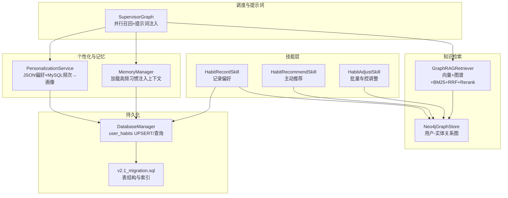
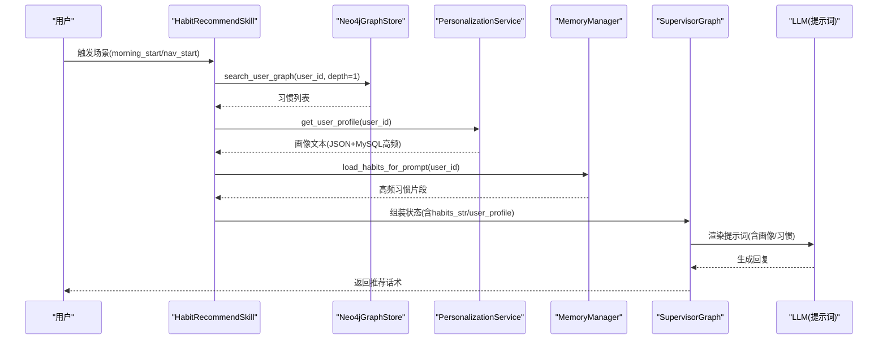
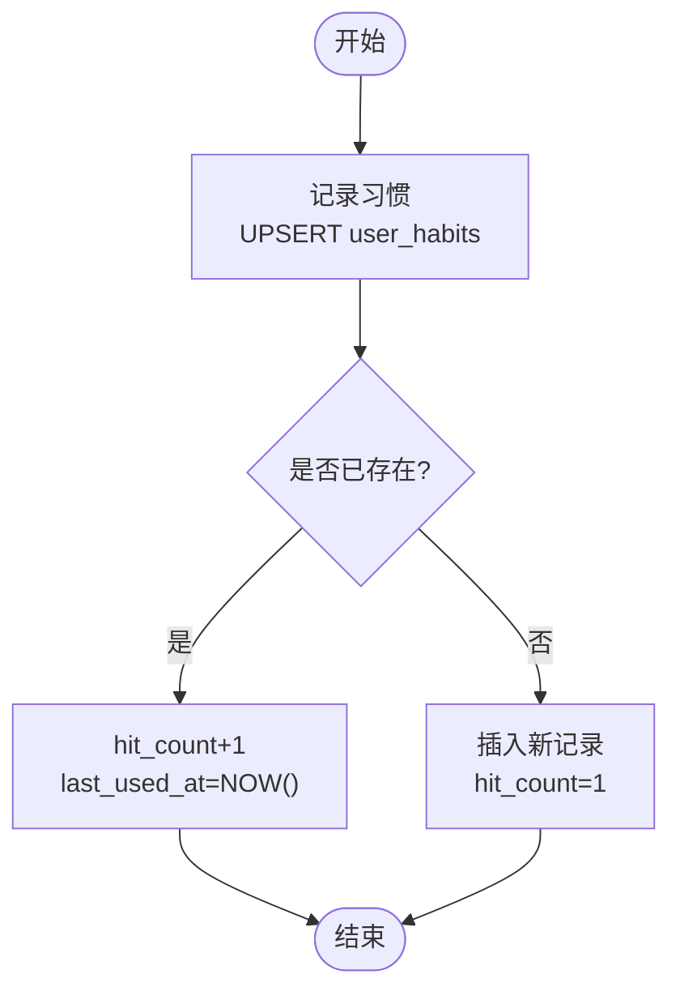
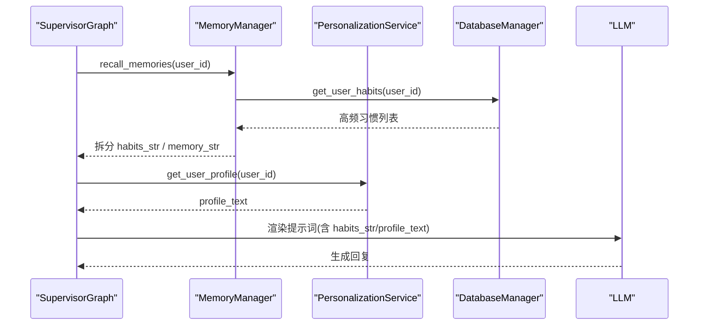
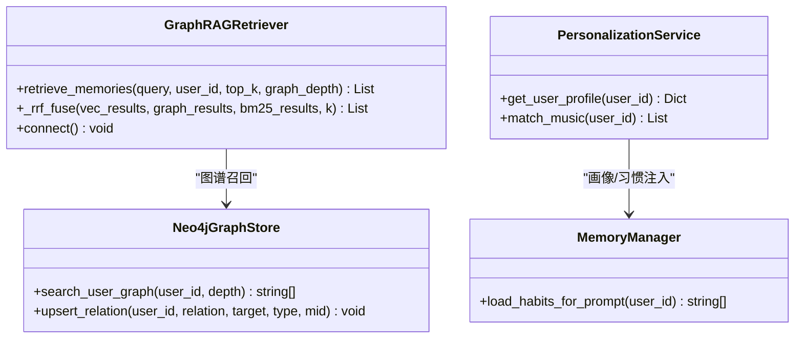
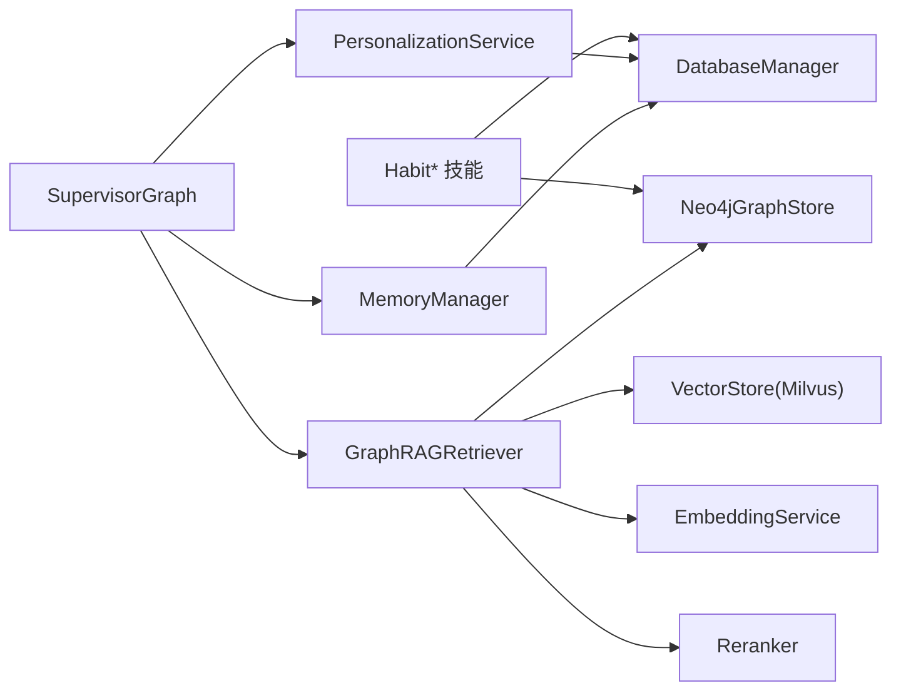

# 习惯学习与推荐

<cite>
**本文引用的文件**   
- [habit.py](file://backend_design/nexus/skills/habit.py)
- [db_manager.py](file://backend_design/nexus/core/db_manager.py)
- [personalization.py](file://backend_design/nexus/core/personalization.py)
- [manager.py](file://backend_design/nexus/memory/manager.py)
- [graph_store.py](file://backend_design/nexus/rag/graph_store.py)
- [retriever.py](file://backend_design/nexus/rag/retriever.py)
- [supervisor_graph.py](file://backend_design/nexus/agent/supervisor_graph.py)
- [v2.1_migration.sql](file://backend_design/scripts/v2.1_migration.sql)
</cite>

## 目录
1. [简介](#简介)
2. [项目结构](#项目结构)
3. [核心组件](#核心组件)
4. [架构总览](#架构总览)
5. [详细组件分析](#详细组件分析)
6. [依赖关系分析](#依赖关系分析)
7. [性能考量](#性能考量)
8. [故障排查指南](#故障排查指南)
9. [结论](#结论)
10. [附录](#附录)

## 简介
本技术文档聚焦 NexusCockpit 的“习惯学习与推荐”子系统，覆盖以下目标：
- 用户习惯识别算法：基于频率的模式发现、时间序列（最近使用）与上下文关联挖掘。
- 习惯存储结构：字段 habit_key、habit_value、hit_count 等含义与使用场景。
- 习惯注入机制：在对话召回时自动加载相关习惯信息并注入提示词。
- 推荐算法实现：协同过滤、内容基推荐、混合策略在本项目的落地方式与扩展点。
- 习惯管理 API：查看、编辑、删除能力与调用路径。
- 准确率评估与反馈学习：如何度量推荐质量并闭环优化。

## 项目结构
与习惯系统直接相关的后端模块分布如下：
- 技能层：记录、推荐、调整三类习惯技能
- 个性化服务：合并 JSON 偏好与 MySQL 频次，构建画像文本
- 记忆管理器：从 MySQL 读取高频习惯，注入到对话上下文
- 图谱存储：Neo4j 用户-实体关系，支持 N 阶查询
- 检索器：三路融合（向量+图谱+BM25）+ RRF + Rerank
- 调度器：并行召回记忆、画像、意图，组装提示词
- 数据库迁移：user_habits 表结构与索引

图表来源
- [habit.py:1-215](file://backend_design/nexus/skills/habit.py#L1-L215)
- [personalization.py:1-354](file://backend_design/nexus/core/personalization.py#L1-L354)
- [manager.py:180-379](file://backend_design/nexus/memory/manager.py#L180-L379)
- [graph_store.py:1-190](file://backend_design/nexus/rag/graph_store.py#L1-L190)
- [retriever.py:1-252](file://backend_design/nexus/rag/retriever.py#L1-L252)
- [supervisor_graph.py:235-271](file://backend_design/nexus/agent/supervisor_graph.py#L235-L271)
- [db_manager.py:690-750](file://backend_design/nexus/core/db_manager.py#L690-L750)
- [v2.1_migration.sql:294-301](file://backend_design/scripts/v2.1_migration.sql#L294-L301)

章节来源
- [habit.py:1-215](file://backend_design/nexus/skills/habit.py#L1-L215)
- [personalization.py:1-354](file://backend_design/nexus/core/personalization.py#L1-L354)
- [manager.py:180-379](file://backend_design/nexus/memory/manager.py#L180-L379)
- [graph_store.py:1-190](file://backend_design/nexus/rag/graph_store.py#L1-L190)
- [retriever.py:1-252](file://backend_design/nexus/rag/retriever.py#L1-L252)
- [supervisor_graph.py:235-271](file://backend_design/nexus/agent/supervisor_graph.py#L235-L271)
- [db_manager.py:690-750](file://backend_design/nexus/core/db_manager.py#L690-L750)
- [v2.1_migration.sql:294-301](file://backend_design/scripts/v2.1_migration.sql#L294-L301)

## 核心组件
- 习惯记录技能 HabitRecordSkill：将用户表达的偏好写入 Neo4j 图谱（User-HABIT-Entity），同时可落库 user_habits 用于频次统计。
- 习惯推荐技能 HabitRecommendSkill：根据触发场景（如 morning_start/nav_start）查询图谱，生成主动推荐话术。
- 习惯调整技能 HabitAdjustSkill：读取画像后批量下发车控指令（空调、媒体等）。
- 个性化服务 PersonalizationService：合并 JSON 偏好与 MySQL 高频习惯，构造画像文本注入 Prompt。
- 记忆管理器 MemoryManager：从 MySQL 读取高频习惯，格式化注入对话上下文。
- Neo4j 图谱存储 Neo4jGraphStore：维护用户-实体关系，支持 N 阶查询与双向绑定 Milvus ID。
- GraphRAG 检索器：三路召回（向量/图谱/BM25）、RRF 融合、Rerank 重排。
- 调度器 SupervisorGraph：并行召回记忆、画像、意图，组装提示词并分派专家。
- 数据库管理 DatabaseManager：user_habits 表的 UPSERT 与查询接口。
- 数据迁移脚本 v2.1_migration.sql：定义 user_habits 表结构与索引。

章节来源
- [habit.py:1-215](file://backend_design/nexus/skills/habit.py#L1-L215)
- [personalization.py:1-354](file://backend_design/nexus/core/personalization.py#L1-L354)
- [manager.py:180-379](file://backend_design/nexus/memory/manager.py#L180-L379)
- [graph_store.py:1-190](file://backend_design/nexus/rag/graph_store.py#L1-L190)
- [retriever.py:1-252](file://backend_design/nexus/rag/retriever.py#L1-L252)
- [supervisor_graph.py:235-271](file://backend_design/nexus/agent/supervisor_graph.py#L235-L271)
- [db_manager.py:690-750](file://backend_design/nexus/core/db_manager.py#L690-L750)
- [v2.1_migration.sql:294-301](file://backend_design/scripts/v2.1_migration.sql#L294-L301)

## 架构总览
下图展示一次“上车/导航启动”触发的习惯推荐流程，涵盖图谱查询、画像构建、提示词注入与结果返回。

图表来源
- [habit.py:78-139](file://backend_design/nexus/skills/habit.py#L78-L139)
- [graph_store.py:98-133](file://backend_design/nexus/rag/graph_store.py#L98-L133)
- [personalization.py:51-75](file://backend_design/nexus/core/personalization.py#L51-L75)
- [manager.py:180-202](file://backend_design/nexus/memory/manager.py#L180-L202)
- [supervisor_graph.py:755-784](file://backend_design/nexus/agent/supervisor_graph.py#L755-L784)

## 详细组件分析

### 习惯识别算法
- 基于频率的模式发现
  - 通过 user_habits 表的 hit_count 累计使用次数，按降序取 Top-N 作为高频习惯。
  - 更新策略为 UPSERT，命中则 hit_count+1 并刷新 last_used_at。
- 时间序列分析
  - last_used_at 提供最近使用时间，可用于衰减或时效性加权（当前实现以排序为主，可扩展为时间衰减函数）。
- 上下文关联挖掘
  - Neo4j 图谱中 (User)-[:RELATION]->(Entity) 的关系边承载语义关联；支持 N 阶遍历，便于发现间接偏好。
  - 记忆管理器将高频习惯格式化为“[习惯] key: value (使用N次)”片段，注入对话上下文，辅助 LLM 理解。

图表来源
- [db_manager.py:696-718](file://backend_design/nexus/core/db_manager.py#L696-L718)
- [v2.1_migration.sql:294-301](file://backend_design/scripts/v2.1_migration.sql#L294-L301)

章节来源
- [db_manager.py:690-750](file://backend_design/nexus/core/db_manager.py#L690-L750)
- [manager.py:180-202](file://backend_design/nexus/memory/manager.py#L180-L202)
- [graph_store.py:98-133](file://backend_design/nexus/rag/graph_store.py#L98-L133)
- [v2.1_migration.sql:294-301](file://backend_design/scripts/v2.1_migration.sql#L294-L301)

### 习惯存储结构
- 表名：user_habits
- 关键字段
  - user_id：用户标识
  - cockpit_id：座舱标识（多租户隔离）
  - habit_key：习惯键名（如 preferred_temp、favorite_music）
  - habit_value：习惯值（自由文本）
  - hit_count：使用频次（UPSERT 自增）
  - last_used_at：最近使用时间
- 约束与索引
  - 唯一键：(user_id, cockpit_id, habit_key)
  - 索引：idx_user(user_id), idx_cockpit(cockpit_id)
- 使用场景
  - 高频习惯注入：MemoryManager 读取 Top-N 注入对话上下文
  - 画像构建：PersonalizationService 合并 JSON 偏好与 MySQL 高频习惯，生成画像文本注入 Prompt
  - 推荐排序：可按 hit_count 与 last_used_at 进行排序或衰减加权

章节来源
- [db_manager.py:721-737](file://backend_design/nexus/core/db_manager.py#L721-L737)
- [personalization.py:108-147](file://backend_design/nexus/core/personalization.py#L108-L147)
- [manager.py:180-202](file://backend_design/nexus/memory/manager.py#L180-L202)
- [v2.1_migration.sql:294-301](file://backend_design/scripts/v2.1_migration.sql#L294-L301)

### 习惯注入机制
- 并行召回
  - SupervisorGraph 并行执行：_recall_memory（记忆/习惯）、_load_profile（画像）、_route_intent（意图路由）
  - 将记忆中的“[习惯]...”片段分离为 habits_str，其余为 memory_str
- 提示词注入
  - 根据 skill_action 选择不同模板（chat/search/vehicle），追加位置状态与画像/习惯文本
  - 画像文本由 PersonalizationService 构建，包含 JSON 偏好与 MySQL 高频习惯

图表来源
- [supervisor_graph.py:235-271](file://backend_design/nexus/agent/supervisor_graph.py#L235-L271)
- [supervisor_graph.py:755-784](file://backend_design/nexus/agent/supervisor_graph.py#L755-L784)
- [manager.py:180-202](file://backend_design/nexus/memory/manager.py#L180-L202)
- [personalization.py:51-75](file://backend_design/nexus/core/personalization.py#L51-L75)
- [db_manager.py:721-737](file://backend_design/nexus/core/db_manager.py#L721-L737)

章节来源
- [supervisor_graph.py:235-271](file://backend_design/nexus/agent/supervisor_graph.py#L235-L271)
- [supervisor_graph.py:755-784](file://backend_design/nexus/agent/supervisor_graph.py#L755-L784)
- [manager.py:180-202](file://backend_design/nexus/memory/manager.py#L180-L202)
- [personalization.py:51-75](file://backend_design/nexus/core/personalization.py#L51-L75)
- [db_manager.py:721-737](file://backend_design/nexus/core/db_manager.py#L721-L737)

### 推荐算法实现
- 内容基推荐（已实现）
  - 基于图谱关系与高频习惯，结合触发场景（morning_start/nav_start/evening_start）生成推荐话术
  - 依据关键词匹配（如“温度/空调/音乐/媒体”）驱动车控调整
- 协同过滤（可扩展）
  - 当前未内置显式协同过滤；可在 GraphRAGRetriever 的融合阶段引入用户-物品交互矩阵评分，或将用户-偏好关系作为图谱权重参与 RRF 打分
- 混合推荐策略（已具备基础）
  - GraphRAGRetriever 采用三路召回（向量/图谱/BM25）+ RRF 融合 + Rerank 重排
  - 可将“习惯相似度”作为额外信号融入融合公式，例如对命中高频习惯的结果加分

图表来源
- [retriever.py:141-178](file://backend_design/nexus/rag/retriever.py#L141-L178)
- [retriever.py:192-245](file://backend_design/nexus/rag/retriever.py#L192-L245)
- [graph_store.py:98-133](file://backend_design/nexus/rag/graph_store.py#L98-L133)
- [personalization.py:51-75](file://backend_design/nexus/core/personalization.py#L51-L75)
- [manager.py:180-202](file://backend_design/nexus/memory/manager.py#L180-L202)

章节来源
- [retriever.py:1-252](file://backend_design/nexus/rag/retriever.py#L1-L252)
- [graph_store.py:1-190](file://backend_design/nexus/rag/graph_store.py#L1-L190)
- [personalization.py:1-354](file://backend_design/nexus/core/personalization.py#L1-L354)
- [manager.py:180-379](file://backend_design/nexus/memory/manager.py#L180-L379)

### 习惯管理 API
- 查看习惯
  - 路径：DatabaseManager.get_user_habits(user_id, cockpit_id)
  - 行为：按 hit_count 降序返回 Top-N
- 编辑习惯
  - 路径：DatabaseManager.record_user_habit(user_id, cockpit_id, habit_key, habit_value)
  - 行为：UPSERT，已存在则更新 habit_value 并 hit_count+1
- 删除习惯
  - 当前未提供显式删除接口；可通过 UPSERT 将 habit_value 置空或新增“删除标记”键值，并在读取逻辑中过滤
- 前端/外部调用建议
  - 在 API 层封装 REST 接口，内部调用上述方法；注意 cockpit_id 的多租户隔离

章节来源
- [db_manager.py:696-737](file://backend_design/nexus/core/db_manager.py#L696-L737)

### 准确率评估与反馈学习
- 指标设计
  - 点击率/采纳率：推荐动作被用户采纳的比例（如自动调温成功、媒体播放命中）
  - 会话相关性：Rerank 后的 Top-K 结果与 query 的相关度（可用 CrossEncoder 分数近似）
  - 频次稳定性：Top-N 习惯的 hit_count 分布与 last_used_at 衰减曲线
- 反馈闭环
  - 将用户显式反馈（点赞/点踩）与隐式反馈（操作成功率）回写至 user_habits 或独立反馈表
  - 定期离线计算特征（频次、时间衰减、类别权重），在线融合进 RRF 或 Rerank 输入
- 在线 A/B
  - 对比不同融合参数 k、top_k、Rerank 开关的效果，监控命中率与延迟

章节来源
- [retriever.py:141-178](file://backend_design/nexus/rag/retriever.py#L141-L178)
- [retriever.py:192-245](file://backend_design/nexus/rag/retriever.py#L192-L245)
- [db_manager.py:696-718](file://backend_design/nexus/core/db_manager.py#L696-L718)

## 依赖关系分析
- 组件耦合
  - Habit* 技能依赖 Neo4jGraphStore 与可选 VehicleAdapter
  - PersonalizationService 依赖 DatabaseManager 与文件系统（JSON 偏好）
  - MemoryManager 依赖 DatabaseManager
  - GraphRAGRetriever 依赖 VectorStore、GraphStore、EmbeddingService、Reranker
  - SupervisorGraph 聚合以上组件，负责并行编排与提示词注入
- 外部依赖
  - Neo4j：图谱存储
  - Milvus：向量存储（由 GraphRAGRetriever 使用）
  - BM25：全文检索（可选）
  - Rerank：bge-reranker-v2-m3 或云端 rerank 服务

图表来源
- [habit.py:1-215](file://backend_design/nexus/skills/habit.py#L1-L215)
- [personalization.py:1-354](file://backend_design/nexus/core/personalization.py#L1-L354)
- [manager.py:180-379](file://backend_design/nexus/memory/manager.py#L180-L379)
- [graph_store.py:1-190](file://backend_design/nexus/rag/graph_store.py#L1-L190)
- [retriever.py:1-252](file://backend_design/nexus/rag/retriever.py#L1-L252)
- [supervisor_graph.py:235-271](file://backend_design/nexus/agent/supervisor_graph.py#L235-L271)

章节来源
- [habit.py:1-215](file://backend_design/nexus/skills/habit.py#L1-L215)
- [personalization.py:1-354](file://backend_design/nexus/core/personalization.py#L1-L354)
- [manager.py:180-379](file://backend_design/nexus/memory/manager.py#L180-L379)
- [graph_store.py:1-190](file://backend_design/nexus/rag/graph_store.py#L1-L190)
- [retriever.py:1-252](file://backend_design/nexus/rag/retriever.py#L1-L252)
- [supervisor_graph.py:235-271](file://backend_design/nexus/agent/supervisor_graph.py#L235-L271)

## 性能考量
- 并发与缓存
  - SupervisorGraph 并行召回记忆、画像、意图，减少端到端延迟
  - 习惯推荐技能设置缓存 TTL，避免频繁重复查询
- 检索效率
  - GraphRAGRetriever 先粗召回（Top-K*4/K*2），再 RRF 融合与 Rerank，兼顾召回率与精度
  - BM25 可选启用，需权衡分词与索引成本
- 数据库访问
  - user_habits 查询按 hit_count 排序，建议在热点用户上增加 Redis 缓存层（可复用现有中间件）

## 故障排查指南
- Neo4j 连接失败
  - 现象：图谱查询返回空或报错
  - 处理：检查连接配置与约束初始化日志
- MySQL 不可用
  - 现象：高频习惯为空，画像缺失“高频习惯”片段
  - 处理：确认连接池状态与权限，降级为仅 JSON 偏好
- Rerank 超时或失败
  - 现象：融合结果未重排或异常
  - 处理：关闭 rerank 开关，回退到 RRF 排序
- 习惯未生效
  - 现象：推荐无变化
  - 处理：确认 UPSERT 是否命中、cockpit_id 是否正确、是否被缓存拦截

章节来源
- [graph_store.py:31-43](file://backend_design/nexus/rag/graph_store.py#L31-L43)
- [personalization.py:108-147](file://backend_design/nexus/core/personalization.py#L108-L147)
- [retriever.py:141-178](file://backend_design/nexus/rag/retriever.py#L141-L178)

## 结论
NexusCockpit 的习惯学习与推荐系统以“图谱+频次+检索融合”为核心，实现了从记录、注入到推荐的完整链路。当前已具备内容基推荐与混合检索能力，后续可在协同过滤、时间衰减、反馈闭环等方面进一步增强，以提升推荐准确性与用户体验。

## 附录
- 关键实现路径参考
  - 习惯记录与推荐：[habit.py](file://backend_design/nexus/skills/habit.py)
  - 画像构建与音乐匹配：[personalization.py](file://backend_design/nexus/core/personalization.py)
  - 高频习惯注入：[manager.py](file://backend_design/nexus/memory/manager.py)
  - 图谱存储与查询：[graph_store.py](file://backend_design/nexus/rag/graph_store.py)
  - 检索融合与重排：[retriever.py](file://backend_design/nexus/rag/retriever.py)
  - 调度与提示词注入：[supervisor_graph.py](file://backend_design/nexus/agent/supervisor_graph.py)
  - 数据库接口与迁移：[db_manager.py](file://backend_design/nexus/core/db_manager.py)、[v2.1_migration.sql](file://backend_design/scripts/v2.1_migration.sql)