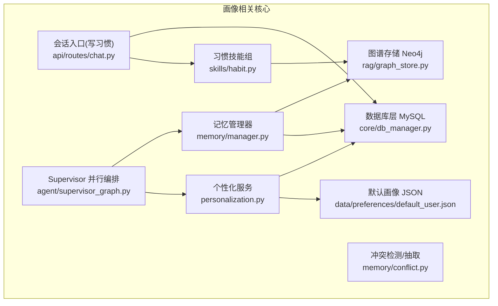
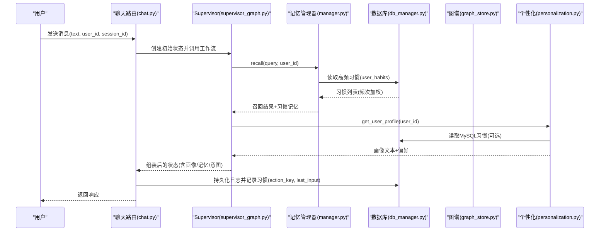
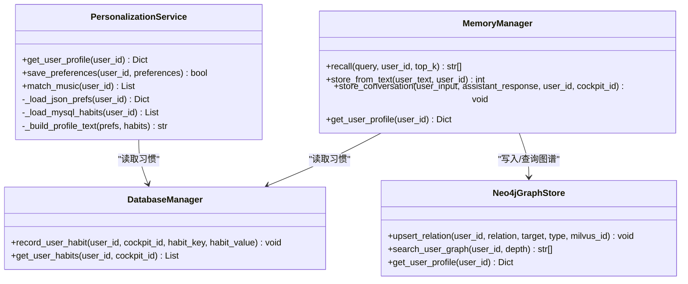
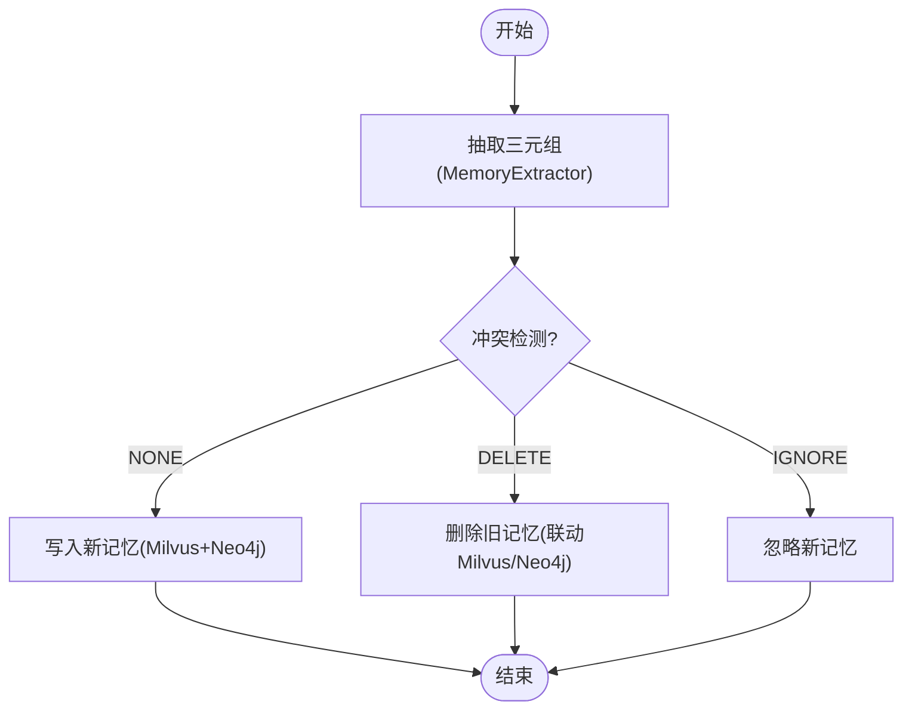
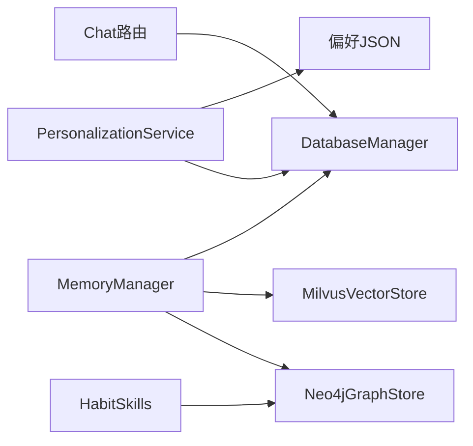

# 用户画像构建

<cite>
**本文引用的文件**   
- [personalization.py](file://backend_design/nexus/core/personalization.py)
- [manager.py](file://backend_design/nexus/memory/manager.py)
- [conflict.py](file://backend_design/nexus/memory/conflict.py)
- [graph_store.py](file://backend_design/nexus/rag/graph_store.py)
- [habit.py](file://backend_design/nexus/skills/habit.py)
- [db_manager.py](file://backend_design/nexus/core/db_manager.py)
- [chat.py](file://backend_design/nexus/api/routes/chat.py)
- [supervisor_graph.py](file://backend_design/nexus/agent/supervisor_graph.py)
- [default_user.json](file://data/preferences/default_user.json)
</cite>

## 目录
1. [引言](#引言)
2. [项目结构](#项目结构)
3. [核心组件](#核心组件)
4. [架构总览](#架构总览)
5. [详细组件分析](#详细组件分析)
6. [依赖关系分析](#依赖关系分析)
7. [性能与扩展性](#性能与扩展性)
8. [隐私与安全](#隐私与安全)
9. [故障排查指南](#故障排查指南)
10. [结论](#结论)
11. [附录：接口与数据模型](#附录接口与数据模型)

## 引言
本技术文档聚焦 NexusCockpit 的用户画像构建系统，系统性阐述以下方面：
- 画像数据结构设计：基本信息、偏好设置、行为习惯、兴趣标签等维度
- 画像构建流程：从对话历史提取特征、从车控行为学习习惯、从搜索记录分析兴趣
- 画像更新机制：增量更新策略、权重调整算法、时效性管理
- 画像查询接口：多维度筛选与相似度计算
- 隐私保护与数据脱敏
- 可视化工具使用指南与自定义字段扩展方法

## 项目结构
围绕用户画像的核心代码分布在后端 Python 服务中，关键模块如下：
- 个性化服务：读取 JSON 偏好与 MySQL 习惯，生成画像文本注入 Prompt
- 记忆管理器：GraphRAG 三路召回 + Rerank，并追加 MySQL 习惯记忆
- 冲突检测与记忆抽取：LLM 驱动的三元组抽取与一致性裁决
- 知识图谱存储：Neo4j 维护用户关系图谱，支持画像导出
- 习惯技能组：记录、推荐、批量调整车控
- 数据库层：MySQL 连接池与 user_habits 表自动迁移与读写
- 会话入口：聊天路由在指标与日志持久化时写入用户习惯
- 默认画像：JSON 示例用于无用户画像时的兜底

图表来源
- [personalization.py:51-75](file://backend_design/nexus/core/personalization.py#L51-L75)
- [manager.py:95-140](file://backend_design/nexus/memory/manager.py#L95-L140)
- [conflict.py:95-174](file://backend_design/nexus/memory/conflict.py#L95-L174)
- [graph_store.py:153-172](file://backend_design/nexus/rag/graph_store.py#L153-L172)
- [habit.py:26-75](file://backend_design/nexus/skills/habit.py#L26-L75)
- [db_manager.py:696-737](file://backend_design/nexus/core/db_manager.py#L696-L737)
- [chat.py:134-142](file://backend_design/nexus/api/routes/chat.py#L134-L142)
- [supervisor_graph.py:214-244](file://backend_design/nexus/agent/supervisor_graph.py#L214-L244)
- [default_user.json:1-46](file://data/preferences/default_user.json#L1-L46)

章节来源
- [personalization.py:51-75](file://backend_design/nexus/core/personalization.py#L51-L75)
- [manager.py:95-140](file://backend_design/nexus/memory/manager.py#L95-L140)
- [conflict.py:95-174](file://backend_design/nexus/memory/conflict.py#L95-L174)
- [graph_store.py:153-172](file://backend_design/nexus/rag/graph_store.py#L153-L172)
- [habit.py:26-75](file://backend_design/nexus/skills/habit.py#L26-L75)
- [db_manager.py:696-737](file://backend_design/nexus/core/db_manager.py#L696-L737)
- [chat.py:134-142](file://backend_design/nexus/api/routes/chat.py#L134-L142)
- [supervisor_graph.py:214-244](file://backend_design/nexus/agent/supervisor_graph.py#L214-L244)
- [default_user.json:1-46](file://data/preferences/default_user.json#L1-L46)

## 核心组件
- 个性化服务（PersonalizationService）
  - 职责：合并 JSON 偏好与 MySQL 习惯，生成画像文本注入到 Prompt；提供音乐匹配与偏好保存
  - 输入：user_id
  - 输出：包含 user_id、profile_text、preferences 的字典
- 记忆管理器（MemoryManager）
  - 职责：GraphRAG 三路召回 + Rerank，渐进式披露，追加 MySQL 习惯记忆；异步存储对话与三元组
  - 关键能力：recall、store_from_text、store_conversation、get_user_profile
- 冲突检测与抽取（ConflictDetector/MemoryExtractor）
  - 职责：从对话中提取结构化三元组；基于 LLM 进行冲突裁决（DELETE/IGNORE/NONE）
- 图谱存储（Neo4jGraphStore）
  - 职责：维护 (User)-[RELATION]->(Entity) 关系，绑定 Milvus ID；导出用户画像
- 习惯技能组（HabitRecord/HabitRecommend/HabitAdjust）
  - 职责：记录偏好到图谱；按场景主动推荐；根据画像批量下发车控指令
- 数据库层（DatabaseManager）
  - 职责：MySQL 连接池、自动建表（含 user_habits）、UPSERT 习惯计数、查询高频习惯
- 会话入口（Chat Routes）
  - 职责：在指标与日志持久化阶段写入用户习惯（action_key、last_input）
- Supervisor 编排
  - 职责：并行执行记忆召回、画像加载、意图路由，组装状态供后续专家处理

章节来源
- [personalization.py:51-75](file://backend_design/nexus/core/personalization.py#L51-L75)
- [manager.py:95-140](file://backend_design/nexus/memory/manager.py#L95-L140)
- [conflict.py:95-174](file://backend_design/nexus/memory/conflict.py#L95-L174)
- [graph_store.py:153-172](file://backend_design/nexus/rag/graph_store.py#L153-L172)
- [habit.py:26-75](file://backend_design/nexus/skills/habit.py#L26-L75)
- [db_manager.py:696-737](file://backend_design/nexus/core/db_manager.py#L696-L737)
- [chat.py:134-142](file://backend_design/nexus/api/routes/chat.py#L134-L142)
- [supervisor_graph.py:214-244](file://backend_design/nexus/agent/supervisor_graph.py#L214-L244)

## 架构总览
用户画像系统采用“多源融合”的架构：
- 短期记忆：Redis 会话历史（由外部管理）
- 长期记忆：Milvus 向量 + Neo4j 图谱（语义检索 + 关系推理）
- 习惯记忆：MySQL user_habits（频次加权）
- 画像合成：JSON 偏好 + MySQL 习惯 → 画像文本注入 Prompt
- 构建路径：对话/车控/搜索等行为触发记忆抽取与习惯记录，最终形成可查询画像

图表来源
- [chat.py:134-142](file://backend_design/nexus/api/routes/chat.py#L134-L142)
- [supervisor_graph.py:214-244](file://backend_design/nexus/agent/supervisor_graph.py#L214-L244)
- [manager.py:95-140](file://backend_design/nexus/memory/manager.py#L95-L140)
- [db_manager.py:696-737](file://backend_design/nexus/core/db_manager.py#L696-L737)
- [personalization.py:51-75](file://backend_design/nexus/core/personalization.py#L51-L75)

## 详细组件分析

### 画像数据结构设计
- 基本信息
  - 来源：声纹识别得到 user_id；JSON 偏好中的 name、created_at、updated_at
- 偏好设置
  - music.favorite_artists / favorite_songs / preferred_genres
  - food.favorite_cuisines / spicy_tolerance / allergies / preferred_price_range
  - location.frequent_destinations / home_address / work_address
  - climate.preferred_temp / preferred_mode / preferred_fan_speed
  - navigation.preferred_route / avoid_tolls / voice_navigation
- 行为习惯
  - MySQL user_habits：habit_key、habit_value、hit_count、last_used_at
  - 通过 UPSERT 实现增量累计，按 hit_count 降序取 Top-N
- 兴趣标签
  - 来自 MemoryExtractor 抽取的三元组（LIKES/DISLIKES/ALLERGY/HABIT/IS_A/LIVES_IN/STATUS）
  - 以 Neo4j 关系形式持久化，便于图谱检索与推荐

图表来源
- [personalization.py:51-75](file://backend_design/nexus/core/personalization.py#L51-L75)
- [db_manager.py:696-737](file://backend_design/nexus/core/db_manager.py#L696-L737)
- [graph_store.py:153-172](file://backend_design/nexus/rag/graph_store.py#L153-L172)
- [manager.py:95-140](file://backend_design/nexus/memory/manager.py#L95-L140)

章节来源
- [personalization.py:51-75](file://backend_design/nexus/core/personalization.py#L51-L75)
- [db_manager.py:696-737](file://backend_design/nexus/core/db_manager.py#L696-L737)
- [graph_store.py:153-172](file://backend_design/nexus/rag/graph_store.py#L153-L172)
- [manager.py:95-140](file://backend_design/nexus/memory/manager.py#L95-L140)
- [default_user.json:1-46](file://data/preferences/default_user.json#L1-L46)

### 画像构建流程
- 从对话历史提取特征
  - MemoryExtractor 将用户输入转为三元组（主体-关系-客体），经 ConflictDetector 裁决后写入 Milvus 与 Neo4j
- 从车控行为学习使用习惯
  - Chat 路由在持久化阶段记录 action_key 与 last_input 到 user_habits，hit_count 自增
- 从搜索记录分析兴趣偏好
  - GraphRAGRetriever 三路召回（向量+图谱+BM25）+ Rerank，结合习惯记忆增强上下文

图表来源
- [conflict.py:95-174](file://backend_design/nexus/memory/conflict.py#L95-L174)
- [manager.py:204-279](file://backend_design/nexus/memory/manager.py#L204-L279)

章节来源
- [conflict.py:95-174](file://backend_design/nexus/memory/conflict.py#L95-L174)
- [manager.py:204-279](file://backend_design/nexus/memory/manager.py#L204-L279)
- [chat.py:134-142](file://backend_design/nexus/api/routes/chat.py#L134-L142)

### 画像更新机制
- 增量更新策略
  - user_habits 使用 UPSERT，已存在则 hit_count+1，last_used_at 更新
  - JSON 偏好 save_preferences 合并已有字段并更新时间戳
- 权重调整算法
  - 习惯记忆按 hit_count 降序注入，Top-N 参与 Prompt 或推荐
  - 渐进式披露：简单指令减少召回深度，复杂查询增加深度
- 时效性管理
  - JSON 偏好 updated_at 标记最近修改时间
  - user_habits.last_used_at 反映最近使用时间
  - 记忆召回可配置 TTL（缓存侧）与阈值过滤

章节来源
- [db_manager.py:696-737](file://backend_design/nexus/core/db_manager.py#L696-L737)
- [personalization.py:302-341](file://backend_design/nexus/core/personalization.py#L302-L341)
- [manager.py:142-173](file://backend_design/nexus/memory/manager.py#L142-L173)

### 画像查询接口
- 图谱画像导出
  - Neo4jGraphStore.get_user_profile(user_id) 返回 relations 列表（relation/target/type/milvus_id）
- 习惯查询
  - DatabaseManager.get_user_habits(user_id, cockpit_id) 返回按 hit_count 排序的习惯列表
- 画像文本合成
  - PersonalizationService.get_user_profile(user_id) 合并 JSON 偏好与 MySQL 习惯，生成 profile_text 注入 Prompt
- 相似度计算
  - 语义缓存层提供余弦相似度与阈值过滤（非画像直接接口，但支撑画像相关检索体验）

章节来源
- [graph_store.py:153-172](file://backend_design/nexus/rag/graph_store.py#L153-L172)
- [db_manager.py:721-737](file://backend_design/nexus/core/db_manager.py#L721-L737)
- [personalization.py:51-75](file://backend_design/nexus/core/personalization.py#L51-L75)

### 隐私保护与数据脱敏
- 权限隔离
  - 管理员仅能查看聚合指标，无法查看具体对话内容（聊天日志持久化时按 cockpit_id 隔离）
- 最小化暴露
  - 写入 chat_logs 时对 user_input 和 response 做长度截断
- 脱敏建议
  - 对敏感字段（如地址、过敏信息）在入库前进行掩码或哈希处理（可在现有 record_user_habit/get_user_habits 处扩展）

章节来源
- [chat.py:111-143](file://backend_design/nexus/api/routes/chat.py#L111-L143)

### 可视化与自定义扩展
- 可视化
  - 前端设置中心展示当前座舱、用户账号与角色等信息，可作为画像入口
- 自定义画像字段
  - 在 default_user.json 基础上扩展新的偏好键值（如 entertainment、health）
  - 在 PersonalizationService._build_profile_text 中新增对应分支，将其拼接到画像文本
  - 在习惯记录与推荐技能中补充对新类别的处理逻辑

章节来源
- [default_user.json:1-46](file://data/preferences/default_user.json#L1-L46)
- [personalization.py:149-202](file://backend_design/nexus/core/personalization.py#L149-L202)
- [habit.py:26-75](file://backend_design/nexus/skills/habit.py#L26-L75)

## 依赖关系分析
- 组件耦合
  - PersonalizationService 依赖 DatabaseManager 与 JSON 偏好文件
  - MemoryManager 依赖 Neo4jGraphStore、MilvusVectorStore、DatabaseManager
  - HabitSkills 依赖 Neo4jGraphStore 与 VehicleAdapter（车控）
  - Chat 路由依赖 DatabaseManager 记录习惯
- 外部依赖
  - Neo4j（图谱）、MySQL（习惯）、Redis（缓存/限流）、Milvus（向量）

图表来源
- [personalization.py:51-75](file://backend_design/nexus/core/personalization.py#L51-L75)
- [manager.py:95-140](file://backend_design/nexus/memory/manager.py#L95-L140)
- [habit.py:26-75](file://backend_design/nexus/skills/habit.py#L26-L75)
- [chat.py:134-142](file://backend_design/nexus/api/routes/chat.py#L134-L142)

章节来源
- [personalization.py:51-75](file://backend_design/nexus/core/personalization.py#L51-L75)
- [manager.py:95-140](file://backend_design/nexus/memory/manager.py#L95-L140)
- [habit.py:26-75](file://backend_design/nexus/skills/habit.py#L26-L75)
- [chat.py:134-142](file://backend_design/nexus/api/routes/chat.py#L134-L142)

## 性能与扩展性
- 并行编排
  - Supervisor 并行执行记忆召回、画像加载、意图路由，降低端到端延迟
- 渐进式披露
  - 根据查询复杂度动态调整召回数量，平衡精度与速度
- 降级与容错
  - GraphRAG 失败回退至纯向量检索；MySQL 不可用时返回空习惯列表
- 可扩展点
  - 新增偏好维度与习惯类别，仅需扩展 JSON 结构与相应拼接逻辑
  - 引入更多外部信号（如日程、天气）作为画像输入

章节来源
- [supervisor_graph.py:214-244](file://backend_design/nexus/agent/supervisor_graph.py#L214-L244)
- [manager.py:142-173](file://backend_design/nexus/memory/manager.py#L142-L173)
- [manager.py:117-124](file://backend_design/nexus/memory/manager.py#L117-L124)

## 隐私与安全
- 访问控制
  - 管理员仅可见聚合指标，不可见具体对话内容
- 数据脱敏
  - 写入日志时对长文本截断；建议在入库前对敏感字段进行掩码/哈希
- 数据生命周期
  - 偏好文件与习惯记录具备时间戳，便于清理与审计

章节来源
- [chat.py:111-143](file://backend_design/nexus/api/routes/chat.py#L111-L143)
- [personalization.py:302-341](file://backend_design/nexus/core/personalization.py#L302-L341)

## 故障排查指南
- 常见问题
  - Neo4j 连接失败：检查 URI/认证与约束初始化
  - MySQL 未连接：确认连接池初始化与自动迁移是否成功
  - 画像为空：检查 JSON 偏好是否存在且可读；确认 MySQL 习惯查询是否返回空
  - 习惯未更新：确认 Chat 路由是否成功写入 user_habits
- 定位步骤
  - 查看日志中关于 GraphRAG 召回、MySQL 习惯加载、Neo4j 关系 upsert 的错误信息
  - 验证 user_habits 表是否存在及索引是否正确创建

章节来源
- [graph_store.py:31-43](file://backend_design/nexus/rag/graph_store.py#L31-L43)
- [db_manager.py:79-143](file://backend_design/nexus/core/db_manager.py#L79-L143)
- [personalization.py:108-147](file://backend_design/nexus/core/personalization.py#L108-L147)
- [chat.py:134-142](file://backend_design/nexus/api/routes/chat.py#L134-L142)

## 结论
NexusCockpit 的用户画像系统以“多源融合、增量更新、图谱增强”为核心，结合 JSON 偏好、MySQL 习惯与 GraphRAG 召回，实现了高可用、可扩展的个性化服务。通过 Supervisor 并行编排与渐进式披露，系统在保证低延迟的同时提升了画像质量。未来可通过引入更多外部信号与更精细的权重策略进一步优化画像准确性与时效性。

## 附录：接口与数据模型
- 画像获取（内部）
  - PersonalizationService.get_user_profile(user_id) → {user_id, profile_text, preferences}
- 习惯记录（内部）
  - DatabaseManager.record_user_habit(user_id, cockpit_id, habit_key, habit_value)
- 习惯查询（内部）
  - DatabaseManager.get_user_habits(user_id, cockpit_id) → [{habit_key, habit_value, hit_count, ...}]
- 图谱画像（内部）
  - Neo4jGraphStore.get_user_profile(user_id) → {user_id, relations: [{relation, target, type, milvus_id}]}

章节来源
- [personalization.py:51-75](file://backend_design/nexus/core/personalization.py#L51-L75)
- [db_manager.py:696-737](file://backend_design/nexus/core/db_manager.py#L696-L737)
- [graph_store.py:153-172](file://backend_design/nexus/rag/graph_store.py#L153-L172)