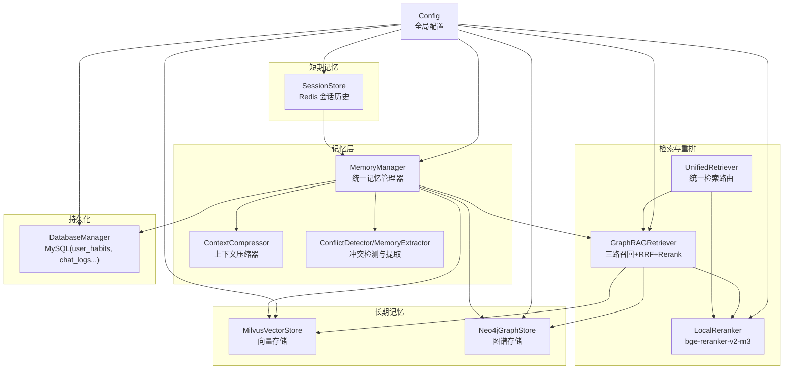
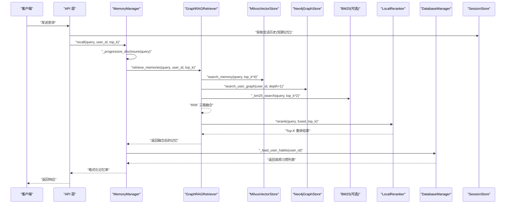
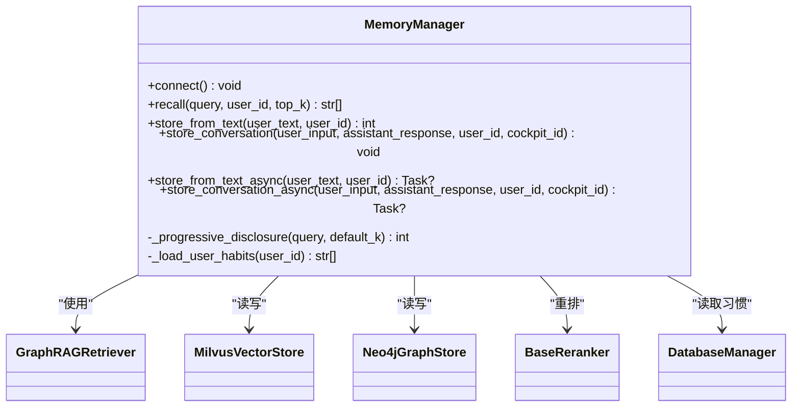
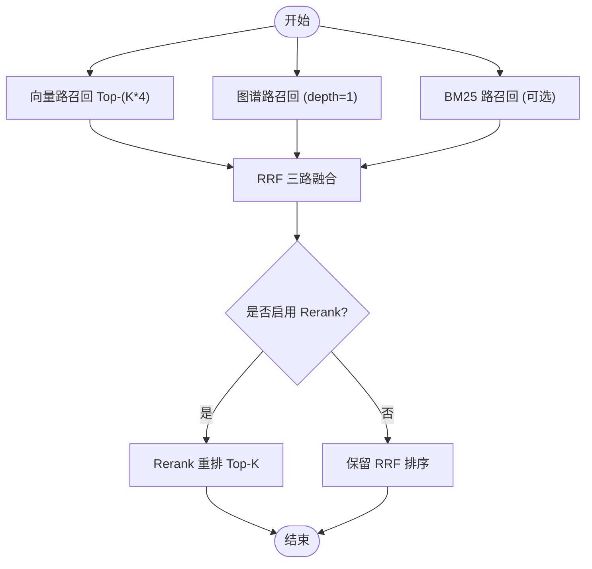
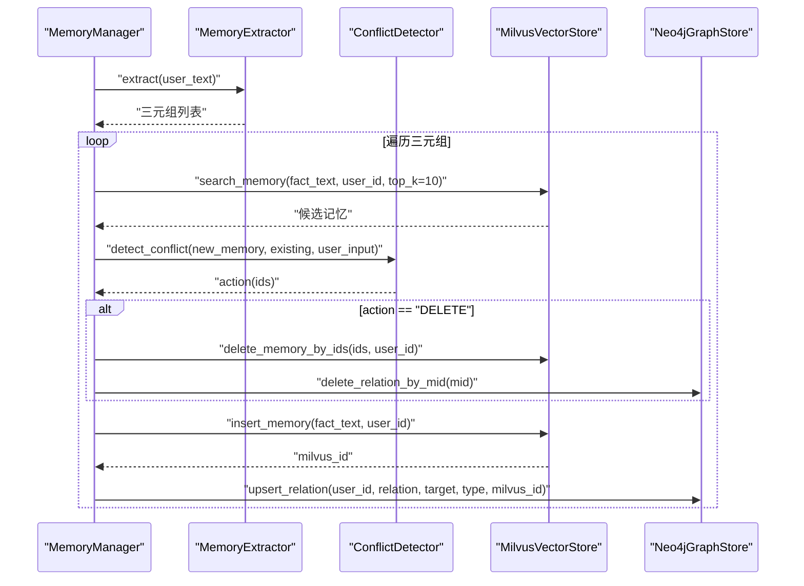
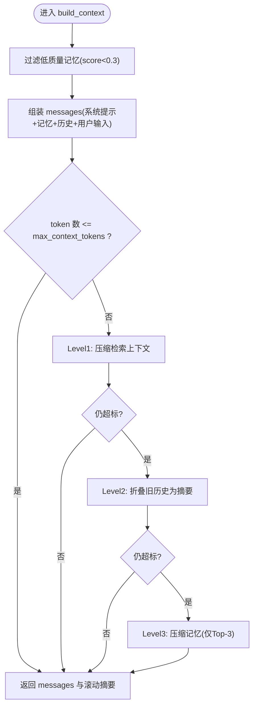
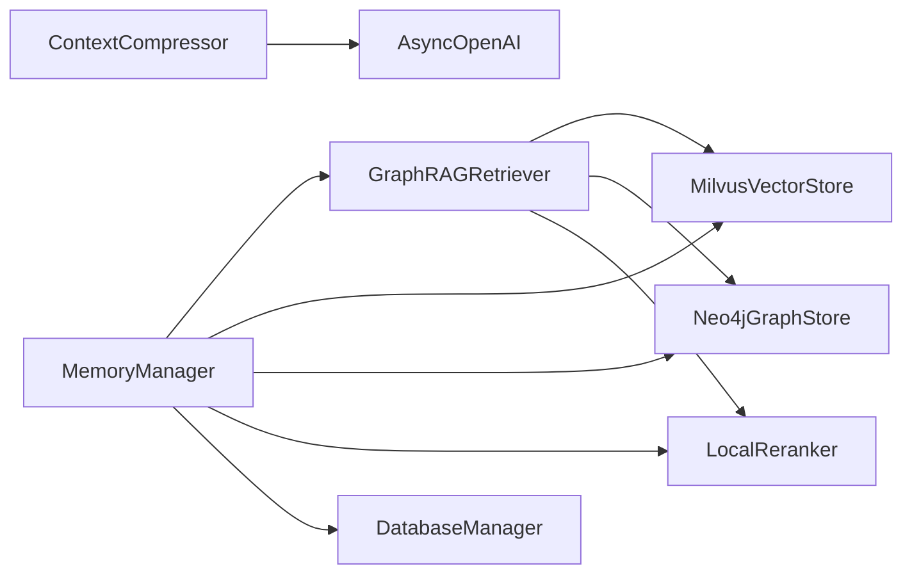

# 记忆管理系统

<cite>
**本文引用的文件**   
- [manager.py](file://backend_design/nexus/memory/manager.py)
- [compressor.py](file://backend_design/nexus/memory/compressor.py)
- [conflict.py](file://backend_design/nexus/memory/conflict.py)
- [session_store.py](file://backend_design/nexus/middleware/session_store.py)
- [retriever.py](file://backend_design/nexus/rag/retriever.py)
- [vector_store.py](file://backend_design/nexus/rag/vector_store.py)
- [graph_store.py](file://backend_design/nexus/rag/graph_store.py)
- [unified_retriever.py](file://backend_design/nexus/rag/unified_retriever.py)
- [reranker.py](file://backend_design/nexus/rag/reranker.py)
- [db_manager.py](file://backend_design/nexus/core/db_manager.py)
- [config.py](file://backend_design/nexus/config.py)
</cite>

## 目录
1. [引言](#引言)
2. [项目结构](#项目结构)
3. [核心组件](#核心组件)
4. [架构总览](#架构总览)
5. [详细组件分析](#详细组件分析)
6. [依赖关系分析](#依赖关系分析)
7. [性能考量](#性能考量)
8. [故障排查指南](#故障排查指南)
9. [结论](#结论)
10. [附录](#附录)

## 引言
本技术文档聚焦于 NexusCockpit 的记忆管理系统，系统性阐述三层记忆架构与端到端召回、存储、压缩与异步处理机制：
- 短期记忆：基于 Redis 的会话历史（SessionStore），提供即时上下文。
- 长期记忆：Milvus 向量 + Neo4j 图谱，支持语义检索与关系推理。
- 习惯记忆：MySQL user_habits，用于用户偏好统计与频次加权注入。
- 召回流程：GraphRAG 三路融合（向量+图谱+BM25）、RRF 融合排序、Rerank 重排、渐进式披露策略。
- 存储机制：从文本提取三元组、冲突检测与裁决、双向写入策略。
- 压缩算法：信息提取、去重合并、重要性评估与四级渐进式压缩。
- 异步存储与错误处理：事件循环内非阻塞任务与健壮异常捕获。

## 项目结构
记忆系统相关代码主要分布在以下模块：
- memory：统一记忆管理器、冲突检测与提取器、上下文压缩器
- middleware：Redis 会话存储
- rag：GraphRAG 检索器、向量/图谱存储、Rerank、统一检索路由
- core：数据库管理（MySQL）
- config：全局配置中心

图表来源
- [manager.py:1-120](file://backend_design/nexus/memory/manager.py#L1-L120)
- [retriever.py:1-120](file://backend_design/nexus/rag/retriever.py#L1-L120)
- [vector_store.py:1-120](file://backend_design/nexus/rag/vector_store.py#L1-L120)
- [graph_store.py:1-120](file://backend_design/nexus/rag/graph_store.py#L1-L120)
- [reranker.py:1-120](file://backend_design/nexus/rag/reranker.py#L1-L120)
- [session_store.py:1-120](file://backend_design/nexus/middleware/session_store.py#L1-L120)
- [db_manager.py:1-120](file://backend_design/nexus/core/db_manager.py#L1-L120)
- [config.py:1-120](file://backend_design/nexus/config.py#L1-L120)

章节来源
- [manager.py:1-120](file://backend_design/nexus/memory/manager.py#L1-L120)
- [retriever.py:1-120](file://backend_design/nexus/rag/retriever.py#L1-L120)
- [vector_store.py:1-120](file://backend_design/nexus/rag/vector_store.py#L1-L120)
- [graph_store.py:1-120](file://backend_design/nexus/rag/graph_store.py#L1-L120)
- [reranker.py:1-120](file://backend_design/nexus/rag/reranker.py#L1-L120)
- [session_store.py:1-120](file://backend_design/nexus/middleware/session_store.py#L1-L120)
- [db_manager.py:1-120](file://backend_design/nexus/core/db_manager.py#L1-L120)
- [config.py:1-120](file://backend_design/nexus/config.py#L1-L120)

## 核心组件
- MemoryManager：统一协调短期/长期/习惯记忆，封装 GraphRAG 召回管道与异步存储。
- ContextCompressor：四级渐进式压缩，动态预算分配与质量过滤。
- ConflictDetector/MemoryExtractor：LLM 驱动的三元组提取与冲突裁决。
- SessionStore：Redis 会话历史持久化，带内存降级。
- GraphRAGRetriever：三路召回（向量+图谱+BM25）、RRF 融合、Rerank 重排。
- MilvusVectorStore / Neo4jGraphStore：长期记忆的向量与图谱实现。
- LocalReranker：本地 bge-reranker-v2-m3 重排服务。
- DatabaseManager：MySQL 连接池与 user_habits 等表操作。
- Config：集中式配置，含 LLM、Milvus、Neo4j、Redis、MySQL 等。

章节来源
- [manager.py:40-120](file://backend_design/nexus/memory/manager.py#L40-L120)
- [compressor.py:56-120](file://backend_design/nexus/memory/compressor.py#L56-L120)
- [conflict.py:24-174](file://backend_design/nexus/memory/conflict.py#L24-L174)
- [session_store.py:35-154](file://backend_design/nexus/middleware/session_store.py#L35-L154)
- [retriever.py:38-120](file://backend_design/nexus/rag/retriever.py#L38-L120)
- [vector_store.py:38-120](file://backend_design/nexus/rag/vector_store.py#L38-L120)
- [graph_store.py:24-120](file://backend_design/nexus/rag/graph_store.py#L24-L120)
- [reranker.py:34-120](file://backend_design/nexus/rag/reranker.py#L34-L120)
- [db_manager.py:33-120](file://backend_design/nexus/core/db_manager.py#L33-L120)
- [config.py:97-160](file://backend_design/nexus/config.py#L97-L160)

## 架构总览
整体数据流与控制流如下：
- 输入：用户查询与对话历史
- 短期记忆：SessionStore 提供最近 N 条对话
- 长期记忆：GraphRAGRetriever 三路召回 → RRF 融合 → Rerank 重排
- 习惯记忆：DatabaseManager 读取 user_habits，按频次注入
- 输出：格式化记忆串，供上层组装 Prompt 并生成回复
- 异步写入：store_from_text_async/store_conversation_async 在事件循环中后台执行

图表来源
- [manager.py:95-140](file://backend_design/nexus/memory/manager.py#L95-L140)
- [retriever.py:141-178](file://backend_design/nexus/rag/retriever.py#L141-L178)
- [vector_store.py:134-168](file://backend_design/nexus/rag/vector_store.py#L134-L168)
- [graph_store.py:98-133](file://backend_design/nexus/rag/graph_store.py#L98-L133)
- [reranker.py:79-139](file://backend_design/nexus/rag/reranker.py#L79-L139)
- [db_manager.py:721-737](file://backend_design/nexus/core/db_manager.py#L721-L737)
- [session_store.py:72-91](file://backend_design/nexus/middleware/session_store.py#L72-L91)

## 详细组件分析

### 统一记忆管理器（MemoryManager）
职责与要点：
- 协调三层记忆：短期（外部传入 history）、长期（Milvus+Neo4j）、习惯（MySQL user_habits）。
- 调用 GraphRAGRetriever 进行三路召回+RRF+Rerank；失败时回退到仅向量检索。
- 渐进式披露：根据关键词与长度调整 top_k（简单指令 3 条，复杂查询 8 条）。
- 异步存储：在当前事件循环中通过 asyncio.create_task() 调度，避免跨事件循环问题。
- 双向写入：Milvus 插入成功后，再 upsert 图谱关系，并通过 mid 联动删除。

图表来源
- [manager.py:40-120](file://backend_design/nexus/memory/manager.py#L40-L120)
- [retriever.py:38-120](file://backend_design/nexus/rag/retriever.py#L38-L120)
- [vector_store.py:38-120](file://backend_design/nexus/rag/vector_store.py#L38-L120)
- [graph_store.py:24-120](file://backend_design/nexus/rag/graph_store.py#L24-L120)
- [reranker.py:34-120](file://backend_design/nexus/rag/reranker.py#L34-L120)
- [db_manager.py:33-120](file://backend_design/nexus/core/db_manager.py#L33-L120)

章节来源
- [manager.py:95-140](file://backend_design/nexus/memory/manager.py#L95-L140)
- [manager.py:204-279](file://backend_design/nexus/memory/manager.py#L204-L279)
- [manager.py:309-387](file://backend_design/nexus/memory/manager.py#L309-L387)

### 记忆召回流程（GraphRAG 三路融合 + RRF + Rerank）
- 三路召回：
  - 向量路：Milvus 语义相似度召回 Top-(top_k*4)
  - 图谱路：Neo4j 关系遍历召回（深度可配）
  - BM25 路：全文关键词匹配召回（需初始化索引）
- 融合排序：RRF 公式对三路结果打分并去重合并
- 重排：bge-reranker-v2-m3 将 Top-20 重排至 Top-K
- 渐进式披露：简单指令减少召回数量，降低延迟

图表来源
- [retriever.py:141-178](file://backend_design/nexus/rag/retriever.py#L141-L178)
- [retriever.py:192-245](file://backend_design/nexus/rag/retriever.py#L192-L245)
- [reranker.py:79-139](file://backend_design/nexus/rag/reranker.py#L79-L139)

章节来源
- [retriever.py:141-178](file://backend_design/nexus/rag/retriever.py#L141-L178)
- [retriever.py:192-245](file://backend_design/nexus/rag/retriever.py#L192-L245)

### 记忆存储机制（三元组提取、冲突检测、双向写入）
- 三元组提取：MemoryExtractor 通过 LLM 从用户输入中提取结构化三元组（relation/target/type）。
- 冲突检测：ConflictDetector 结合原始对话语境与现有记忆，判定 DELETE/IGNORE/NONE。
- 双向写入：
  - 先向 Milvus 插入记忆，获得 milvus_id
  - 再以 user_id/relation/target/type/mid 写入 Neo4j 关系
  - 若判定 DELETE，则按 ids 批量删除 Milvus 记录，并联动删除图谱关系

图表来源
- [manager.py:204-279](file://backend_design/nexus/memory/manager.py#L204-L279)
- [conflict.py:95-174](file://backend_design/nexus/memory/conflict.py#L95-L174)
- [vector_store.py:170-207](file://backend_design/nexus/rag/vector_store.py#L170-L207)
- [graph_store.py:55-97](file://backend_design/nexus/rag/graph_store.py#L55-L97)

章节来源
- [conflict.py:24-93](file://backend_design/nexus/memory/conflict.py#L24-L93)
- [conflict.py:95-174](file://backend_design/nexus/memory/conflict.py#L95-L174)
- [manager.py:204-279](file://backend_design/nexus/memory/manager.py#L204-L279)

### 记忆压缩算法（四级渐进式压缩）
- Level 0：未超标直接返回
- Level 1：压缩检索上下文（search_ctx）
- Level 2：折叠旧历史为摘要（rolling summary）
- Level 3：压缩记忆上下文（仅保留 Top-3 高分记忆）
- 动态预算：记忆 20% + 检索 30% + 历史 30% + 回复预留 20%
- 质量评分：过滤低分记忆（score < 0.3），去重指纹前 20 字符

图表来源
- [compressor.py:237-351](file://backend_design/nexus/memory/compressor.py#L237-L351)
- [compressor.py:199-236](file://backend_design/nexus/memory/compressor.py#L199-L236)

章节来源
- [compressor.py:56-120](file://backend_design/nexus/memory/compressor.py#L56-L120)
- [compressor.py:146-197](file://backend_design/nexus/memory/compressor.py#L146-L197)
- [compressor.py:237-351](file://backend_design/nexus/memory/compressor.py#L237-L351)

### 短期记忆（Redis SessionStore）
- 功能：以 session_key 为键保存最近 N 条对话历史，默认 20 条，TTL 24 小时
- 降级：Redis 不可用时自动降级为内存 dict，保证可用性
- 接口：async_get/async_set/list_sessions/is_redis_mode

章节来源
- [session_store.py:35-154](file://backend_design/nexus/middleware/session_store.py#L35-L154)

### 长期记忆（Milvus 向量 + Neo4j 图谱）
- MilvusVectorStore：
  - 集合：Food_List（食材知识库）、User_Memory（用户长期记忆）
  - 字段：user_id、vector、text、timestamp；HNSW 索引与 user_id Trie 索引
  - 方法：search_memory/insert_memory/delete_memory_by_ids/search_food
- Neo4jGraphStore：
  - 约束与索引：User.id 唯一、Entity.name 索引
  - 关系：(User)-[:RELATION {mid}]->(Entity)，支持多阶路径查询
  - 方法：upsert_relation/delete_relation_by_mid/search_user_graph/get_user_profile

章节来源
- [vector_store.py:38-271](file://backend_design/nexus/rag/vector_store.py#L38-L271)
- [graph_store.py:24-190](file://backend_design/nexus/rag/graph_store.py#L24-L190)

### 习惯记忆（MySQL user_habits）
- 表结构：user_id、cockpit_id、habit_key、habit_value、hit_count、last_used_at
- 操作：record_user_habits（UPSERT，hit_count+1）、get_user_habits（按 hit_count 降序）
- 注入：MemoryManager._load_user_habits 取 Top-5 高频习惯，格式化为记忆串追加到召回结果

章节来源
- [db_manager.py:108-141](file://backend_design/nexus/core/db_manager.py#L108-L141)
- [db_manager.py:696-737](file://backend_design/nexus/core/db_manager.py#L696-L737)
- [manager.py:175-202](file://backend_design/nexus/memory/manager.py#L175-L202)

### 异步存储与错误处理
- 事件循环安全：store_from_text_async/store_conversation_async 使用当前事件循环创建任务，避免“Event loop is closed”
- 任务回调：_task_done_callback 捕获未处理异常并记录日志
- 安全包装：_store_from_text_safe/_store_conversation_safe 包裹主逻辑，确保异常不静默丢失

章节来源
- [manager.py:309-387](file://backend_design/nexus/memory/manager.py#L309-L387)

### 统一检索路由（UnifiedRetriever）
- 路由策略：memory/knowledge/hybrid/auto
- 混合检索：并行调用 GraphRAG 与 Cherry KB，合并后 Rerank
- 自动判断：包含“故障码/保养/手册”→ knowledge；包含“我喜欢/习惯/记得”→ memory；否则 hybrid

章节来源
- [unified_retriever.py:33-155](file://backend_design/nexus/rag/unified_retriever.py#L33-L155)

## 依赖关系分析
- 组件耦合：
  - MemoryManager 强依赖 GraphRAGRetriever、MilvusVectorStore、Neo4jGraphStore、BaseReranker、DatabaseManager
  - GraphRAGRetriever 依赖 EmbeddingService、向量/图谱工厂、Reranker 工厂
  - ContextCompressor 依赖 LLM 客户端与 tiktoken（或估算）
- 外部依赖：
  - Milvus（pymilvus）、Neo4j（neo4j）、Redis（redis.asyncio）、MySQL（aiomysql）
  - LLM 客户端（OpenAI 兼容）、Reranker（sentence-transformers）

图表来源
- [manager.py:40-120](file://backend_design/nexus/memory/manager.py#L40-L120)
- [retriever.py:38-120](file://backend_design/nexus/rag/retriever.py#L38-L120)
- [reranker.py:34-120](file://backend_design/nexus/rag/reranker.py#L34-L120)
- [compressor.py:84-120](file://backend_design/nexus/memory/compressor.py#L84-L120)

章节来源
- [manager.py:40-120](file://backend_design/nexus/memory/manager.py#L40-L120)
- [retriever.py:38-120](file://backend_design/nexus/rag/retriever.py#L38-L120)
- [reranker.py:34-120](file://backend_design/nexus/rag/reranker.py#L34-L120)
- [compressor.py:84-120](file://backend_design/nexus/memory/compressor.py#L84-L120)

## 性能考量
- 渐进式披露：简单指令减少召回数量，降低延迟与计算开销
- 三路召回规模控制：向量路召回 K*4，BM25 路 K*2，平衡召回率与成本
- RRF 融合常数 k=60，兼顾排名稳定性与多样性
- Rerank 模型加载延迟：首次约 2 秒，后续 CPU 约 200ms/20 条
- 异步存储：后台任务不影响主请求链路
- 压缩策略：优先压缩检索上下文与旧历史，最后才压缩记忆，保障关键信息

[本节为通用指导，无需具体文件引用]

## 故障排查指南
- 记忆提取失败：检查 LLM 配置与网络连通性，确认 MEMORY_EXTRACTION_ENABLED 开关状态
- 冲突检测异常：查看日志中的 JSON 解析与正则匹配结果，必要时放宽 prompt 约束
- 向量检索失败：验证 Milvus 连接、集合存在性与索引参数；检查 embedding_dim 一致性
- 图谱写入失败：确认 Neo4j 连接、约束与索引；核对 mid 绑定是否正确
- Rerank 不可用：检查模型路径与 sentence-transformers 安装；确认 is_available 状态
- Redis 会话不可用：确认 Redis 连通性，观察是否已降级到内存模式
- MySQL 习惯表缺失：启动时自动迁移会创建 user_habits 与 chat_sessions 表，关注迁移日志

章节来源
- [manager.py:204-279](file://backend_design/nexus/memory/manager.py#L204-L279)
- [vector_store.py:52-71](file://backend_design/nexus/rag/vector_store.py#L52-L71)
- [graph_store.py:31-43](file://backend_design/nexus/rag/graph_store.py#L31-L43)
- [reranker.py:52-77](file://backend_design/nexus/rag/reranker.py#L52-L77)
- [session_store.py:50-61](file://backend_design/nexus/middleware/session_store.py#L50-L61)
- [db_manager.py:79-143](file://backend_design/nexus/core/db_manager.py#L79-L143)

## 结论
NexusCockpit 的记忆管理系统通过三层记忆架构与 GraphRAG 三路融合召回，实现了高可用、可扩展且高性能的用户个性化体验。其设计亮点包括：
- 渐进式披露与四级压缩，有效平衡上下文质量与 token 预算
- 冲突检测与双向写入，保障长期记忆的一致性与可追溯性
- 异步存储与健壮的错误处理，提升系统鲁棒性
- 灵活配置与双模式部署，适配本地与云端环境

[本节为总结性内容，无需具体文件引用]

## 附录

### 配置项速览（节选）
- LLM：模型名称、Embedding 维度、温度、超时、反思与记忆提取开关、并发限流、本地降级
- Milvus：URI、Token、集合名、索引类型与参数、搜索参数
- Neo4j：URI、用户名、密码
- Redis：Host/Port/Password/DB、语义缓存阈值与 TTL
- MySQL：Host/Port/User/Password/Database
- Providers：向量库/图谱/缓存/Rerank 的 provider 选择（local/cloud/none）

章节来源
- [config.py:97-160](file://backend_design/nexus/config.py#L97-L160)
- [config.py:167-247](file://backend_design/nexus/config.py#L167-L247)
- [config.py:253-275](file://backend_design/nexus/config.py#L253-L275)
- [config.py:458-504](file://backend_design/nexus/config.py#L458-L504)