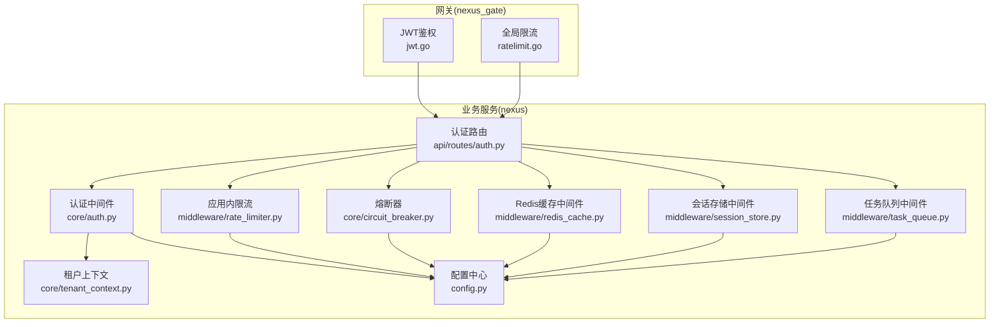
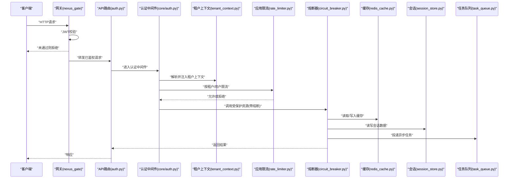
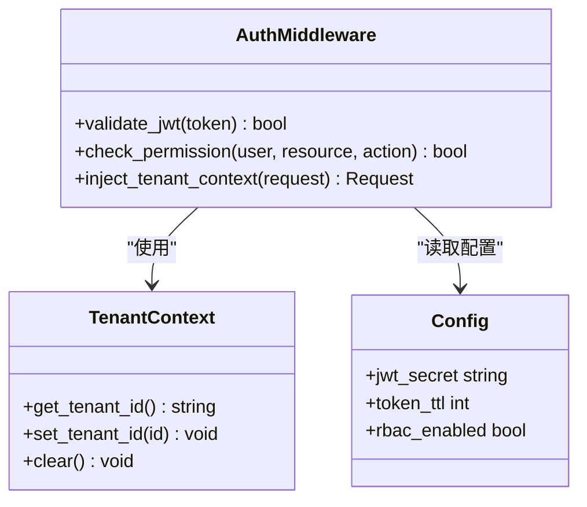
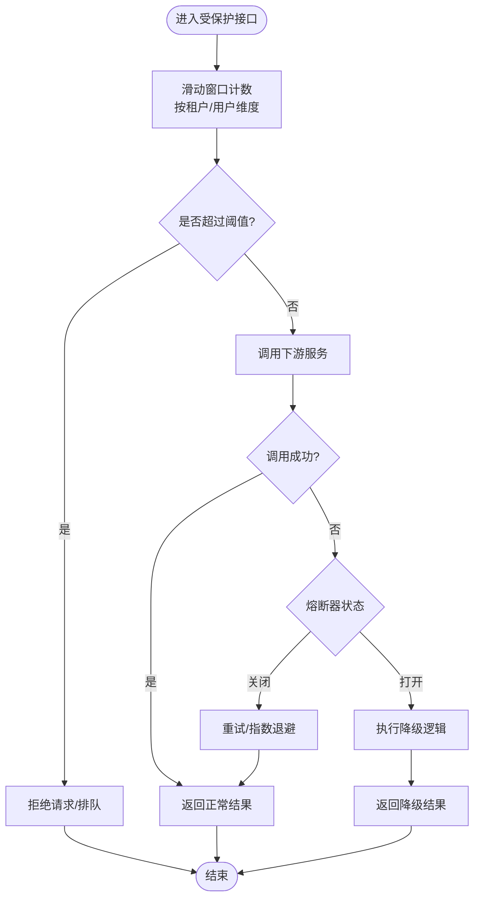
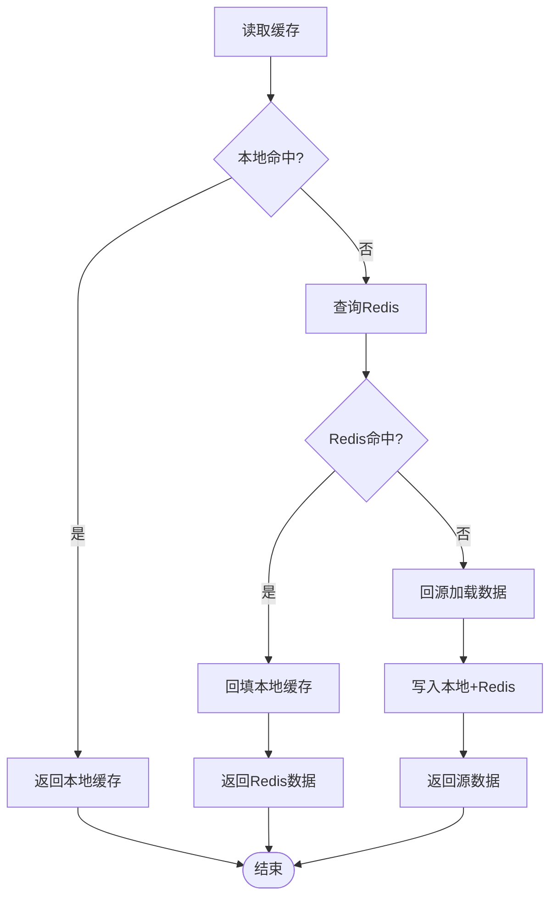
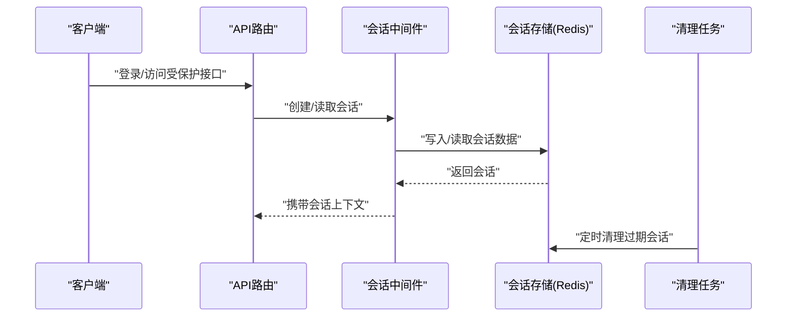
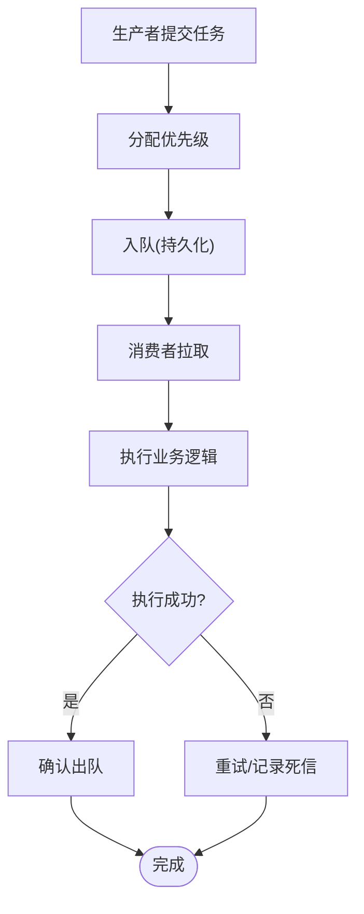
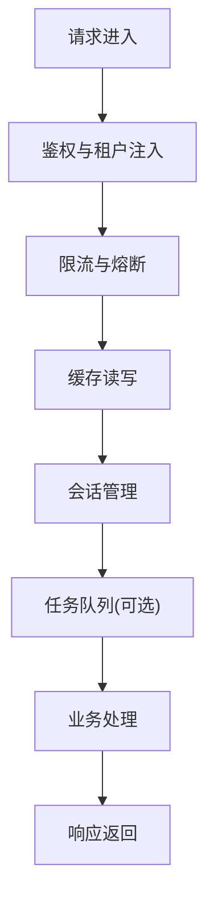
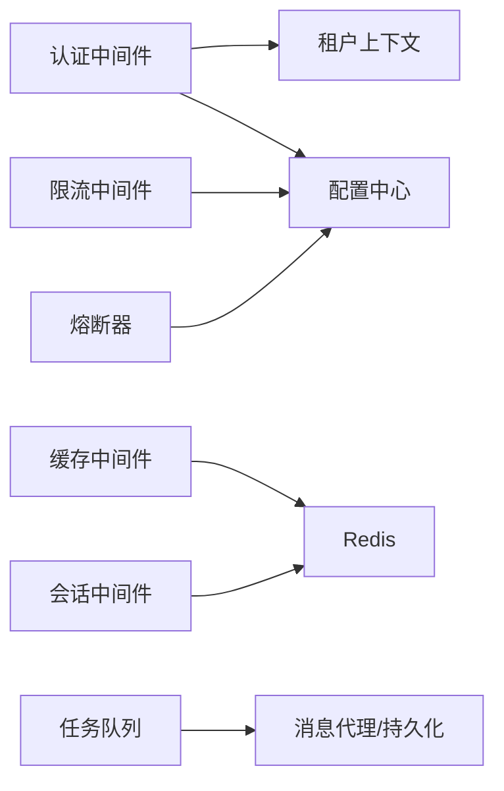

# 中间件和工具

<cite>
**本文引用的文件**   
- [backend_design/nexus/middleware/rate_limiter.py](file://backend_design/nexus/middleware/rate_limiter.py)
- [backend_design/nexus/middleware/redis_cache.py](file://backend_design/nexus/middleware/redis_cache.py)
- [backend_design/nexus/middleware/session_store.py](file://backend_design/nexus/middleware/session_store.py)
- [backend_design/nexus/middleware/task_queue.py](file://backend_design/nexus/middleware/task_queue.py)
- [backend_design/nexus/core/auth.py](file://backend_design/nexus/core/auth.py)
- [backend_design/nexus/core/circuit_breaker.py](file://backend_design/nexus/core/circuit_breaker.py)
- [backend_design/nexus/core/tenant_context.py](file://backend_design/nexus/core/tenant_context.py)
- [backend_design/nexus/api/routes/auth.py](file://backend_design/nexus/api/routes/auth.py)
- [backend_design/nexus_gate/internal/auth/jwt.go](file://backend_design/nexus_gate/internal/auth/jwt.go)
- [backend_design/nexus_gate/internal/ratelimit/ratelimit.go](file://backend_design/nexus_gate/internal/ratelimit/ratelimit.go)
- [backend_design/nexus/config.py](file://backend_design/nexus/config.py)
</cite>

## 目录
1. [简介](#简介)
2. [项目结构](#项目结构)
3. [核心组件](#核心组件)
4. [架构总览](#架构总览)
5. [详细组件分析](#详细组件分析)
6. [依赖分析](#依赖分析)
7. [性能考虑](#性能考虑)
8. [故障排查指南](#故障排查指南)
9. [结论](#结论)
10. [附录](#附录)

## 简介
本章节面向NexusCockpit系统的中间件与工具层，聚焦以下能力：
- 认证授权中间件：JWT验证、权限检查、租户隔离
- 限流熔断机制：滑动窗口算法、熔断器模式、降级策略
- 缓存中间件：多级缓存策略、失效机制、一致性保证
- 会话管理中间件：分布式会话存储、持久化与安全清理
- 任务队列中间件：异步处理、优先级、失败重试
- 开发规范与集成指南

## 项目结构
中间件与工具相关代码主要分布在后端Python服务与Go网关两个子系统中：
- Python侧（nexus）：认证、限流、缓存、会话、任务队列等中间件实现位于 backend_design/nexus/middleware 与 core 目录
- Go侧（nexus_gate）：网关层提供JWT校验与全局限流能力，位于 backend_design/nexus_gate/internal/auth 与 ratelimit

图表来源
- [backend_design/nexus_gate/internal/auth/jwt.go](file://backend_design/nexus_gate/internal/auth/jwt.go)
- [backend_design/nexus_gate/internal/ratelimit/ratelimit.go](file://backend_design/nexus_gate/internal/ratelimit/ratelimit.go)
- [backend_design/nexus/core/auth.py](file://backend_design/nexus/core/auth.py)
- [backend_design/nexus/core/tenant_context.py](file://backend_design/nexus/core/tenant_context.py)
- [backend_design/nexus/middleware/rate_limiter.py](file://backend_design/nexus/middleware/rate_limiter.py)
- [backend_design/nexus/core/circuit_breaker.py](file://backend_design/nexus/core/circuit_breaker.py)
- [backend_design/nexus/middleware/redis_cache.py](file://backend_design/nexus/middleware/redis_cache.py)
- [backend_design/nexus/middleware/session_store.py](file://backend_design/nexus/middleware/session_store.py)
- [backend_design/nexus/middleware/task_queue.py](file://backend_design/nexus/middleware/task_queue.py)
- [backend_design/nexus/api/routes/auth.py](file://backend_design/nexus/api/routes/auth.py)
- [backend_design/nexus/config.py](file://backend_design/nexus/config.py)

章节来源
- [backend_design/nexus/middleware/rate_limiter.py](file://backend_design/nexus/middleware/rate_limiter.py)
- [backend_design/nexus/middleware/redis_cache.py](file://backend_design/nexus/middleware/redis_cache.py)
- [backend_design/nexus/middleware/session_store.py](file://backend_design/nexus/middleware/session_store.py)
- [backend_design/nexus/middleware/task_queue.py](file://backend_design/nexus/middleware/task_queue.py)
- [backend_design/nexus/core/auth.py](file://backend_design/nexus/core/auth.py)
- [backend_design/nexus/core/circuit_breaker.py](file://backend_design/nexus/core/circuit_breaker.py)
- [backend_design/nexus/core/tenant_context.py](file://backend_design/nexus/core/tenant_context.py)
- [backend_design/nexus/api/routes/auth.py](file://backend_design/nexus/api/routes/auth.py)
- [backend_design/nexus_gate/internal/auth/jwt.go](file://backend_design/nexus_gate/internal/auth/jwt.go)
- [backend_design/nexus_gate/internal/ratelimit/ratelimit.go](file://backend_design/nexus_gate/internal/ratelimit/ratelimit.go)
- [backend_design/nexus/config.py](file://backend_design/nexus/config.py)

## 核心组件
本节概述各中间件职责与协作关系：
- 认证授权中间件：负责JWT校验、权限判定与租户上下文注入
- 限流熔断：网关与应用层双重限流；熔断器保护下游不稳定依赖
- 缓存中间件：基于Redis的共享缓存，支持多级缓存与失效策略
- 会话管理：分布式会话存储、持久化与安全清理
- 任务队列：异步任务调度、优先级与失败重试

章节来源
- [backend_design/nexus/core/auth.py](file://backend_design/nexus/core/auth.py)
- [backend_design/nexus/core/tenant_context.py](file://backend_design/nexus/core/tenant_context.py)
- [backend_design/nexus/middleware/rate_limiter.py](file://backend_design/nexus/middleware/rate_limiter.py)
- [backend_design/nexus/core/circuit_breaker.py](file://backend_design/nexus/core/circuit_breaker.py)
- [backend_design/nexus/middleware/redis_cache.py](file://backend_design/nexus/middleware/redis_cache.py)
- [backend_design/nexus/middleware/session_store.py](file://backend_design/nexus/middleware/session_store.py)
- [backend_design/nexus/middleware/task_queue.py](file://backend_design/nexus/middleware/task_queue.py)

## 架构总览
下图展示请求从网关到业务服务的完整链路，以及各中间件的介入点。

图表来源
- [backend_design/nexus_gate/internal/auth/jwt.go](file://backend_design/nexus_gate/internal/auth/jwt.go)
- [backend_design/nexus/api/routes/auth.py](file://backend_design/nexus/api/routes/auth.py)
- [backend_design/nexus/core/auth.py](file://backend_design/nexus/core/auth.py)
- [backend_design/nexus/core/tenant_context.py](file://backend_design/nexus/core/tenant_context.py)
- [backend_design/nexus/middleware/rate_limiter.py](file://backend_design/nexus/middleware/rate_limiter.py)
- [backend_design/nexus/core/circuit_breaker.py](file://backend_design/nexus/core/circuit_breaker.py)
- [backend_design/nexus/middleware/redis_cache.py](file://backend_design/nexus/middleware/redis_cache.py)
- [backend_design/nexus/middleware/session_store.py](file://backend_design/nexus/middleware/session_store.py)
- [backend_design/nexus/middleware/task_queue.py](file://backend_design/nexus/middleware/task_queue.py)

## 详细组件分析

### 认证授权中间件
- JWT验证：网关层完成令牌签名与有效期校验，业务层二次校验并解析用户信息
- 权限检查：基于角色/资源的访问控制，结合路径与动作进行判定
- 租户隔离：在请求上下文中注入租户标识，所有后续操作自动携带租户边界

图表来源
- [backend_design/nexus/core/auth.py](file://backend_design/nexus/core/auth.py)
- [backend_design/nexus/core/tenant_context.py](file://backend_design/nexus/core/tenant_context.py)
- [backend_design/nexus/config.py](file://backend_design/nexus/config.py)

章节来源
- [backend_design/nexus/core/auth.py](file://backend_design/nexus/core/auth.py)
- [backend_design/nexus/core/tenant_context.py](file://backend_design/nexus/core/tenant_context.py)
- [backend_design/nexus/api/routes/auth.py](file://backend_design/nexus/api/routes/auth.py)
- [backend_design/nexus_gate/internal/auth/jwt.go](file://backend_design/nexus_gate/internal/auth/jwt.go)
- [backend_design/nexus/config.py](file://backend_design/nexus/config.py)

### 限流熔断机制
- 滑动窗口限流：在网关与应用层分别实现，支持按IP、用户、租户维度统计
- 熔断器模式：对不稳定依赖进行快速失败与恢复，避免雪崩
- 降级策略：在熔断或限流触发时返回友好响应或默认值

图表来源
- [backend_design/nexus/middleware/rate_limiter.py](file://backend_design/nexus/middleware/rate_limiter.py)
- [backend_design/nexus/core/circuit_breaker.py](file://backend_design/nexus/core/circuit_breaker.py)
- [backend_design/nexus_gate/internal/ratelimit/ratelimit.go](file://backend_design/nexus_gate/internal/ratelimit/ratelimit.go)

章节来源
- [backend_design/nexus/middleware/rate_limiter.py](file://backend_design/nexus/middleware/rate_limiter.py)
- [backend_design/nexus/core/circuit_breaker.py](file://backend_design/nexus/core/circuit_breaker.py)
- [backend_design/nexus_gate/internal/ratelimit/ratelimit.go](file://backend_design/nexus_gate/internal/ratelimit/ratelimit.go)

### 缓存中间件
- 多级缓存策略：本地内存+Redis共享缓存，热点数据优先命中本地
- 失效机制：TTL过期、主动失效、版本化键名
- 一致性保证：写穿/回源策略、并发锁、版本号冲突检测

图表来源
- [backend_design/nexus/middleware/redis_cache.py](file://backend_design/nexus/middleware/redis_cache.py)

章节来源
- [backend_design/nexus/middleware/redis_cache.py](file://backend_design/nexus/middleware/redis_cache.py)

### 会话管理中间件
- 分布式会话存储：基于Redis集中式存储，支持多实例共享
- 会话持久化：关键会话字段落盘或持久化存储，保障重启恢复
- 安全清理：定期清理过期会话、敏感信息脱敏、强制登出

图表来源
- [backend_design/nexus/middleware/session_store.py](file://backend_design/nexus/middleware/session_store.py)

章节来源
- [backend_design/nexus/middleware/session_store.py](file://backend_design/nexus/middleware/session_store.py)

### 任务队列中间件
- 异步任务处理：将耗时操作放入队列，解耦主流程
- 任务优先级：高优任务优先消费，保障关键路径时效
- 失败重试：指数退避、死信队列、幂等处理

图表来源
- [backend_design/nexus/middleware/task_queue.py](file://backend_design/nexus/middleware/task_queue.py)

章节来源
- [backend_design/nexus/middleware/task_queue.py](file://backend_design/nexus/middleware/task_queue.py)

### 概念性概览
下图为通用中间件接入流程的概念示意，便于理解整体接入方式与扩展点。

[此图为概念流程，不直接映射具体源码文件]

## 依赖分析
中间件之间的耦合与外部依赖如下：
- 认证中间件依赖配置中心与租户上下文
- 限流与熔断依赖配置与共享存储（如Redis）
- 缓存与会话均依赖Redis作为共享存储
- 任务队列依赖消息代理与持久化存储

图表来源
- [backend_design/nexus/core/auth.py](file://backend_design/nexus/core/auth.py)
- [backend_design/nexus/core/tenant_context.py](file://backend_design/nexus/core/tenant_context.py)
- [backend_design/nexus/middleware/rate_limiter.py](file://backend_design/nexus/middleware/rate_limiter.py)
- [backend_design/nexus/core/circuit_breaker.py](file://backend_design/nexus/core/circuit_breaker.py)
- [backend_design/nexus/middleware/redis_cache.py](file://backend_design/nexus/middleware/redis_cache.py)
- [backend_design/nexus/middleware/session_store.py](file://backend_design/nexus/middleware/session_store.py)
- [backend_design/nexus/middleware/task_queue.py](file://backend_design/nexus/middleware/task_queue.py)
- [backend_design/nexus/config.py](file://backend_design/nexus/config.py)

章节来源
- [backend_design/nexus/core/auth.py](file://backend_design/nexus/core/auth.py)
- [backend_design/nexus/core/tenant_context.py](file://backend_design/nexus/core/tenant_context.py)
- [backend_design/nexus/middleware/rate_limiter.py](file://backend_design/nexus/middleware/rate_limiter.py)
- [backend_design/nexus/core/circuit_breaker.py](file://backend_design/nexus/core/circuit_breaker.py)
- [backend_design/nexus/middleware/redis_cache.py](file://backend_design/nexus/middleware/redis_cache.py)
- [backend_design/nexus/middleware/session_store.py](file://backend_design/nexus/middleware/session_store.py)
- [backend_design/nexus/middleware/task_queue.py](file://backend_design/nexus/middleware/task_queue.py)
- [backend_design/nexus/config.py](file://backend_design/nexus/config.py)

## 性能考虑
- 限流参数调优：根据QPS与P99延迟目标设置合适的窗口大小与阈值
- 熔断阈值与冷却时间：依据错误率与恢复时间动态调整，避免误判
- 缓存命中率优化：合理设计键空间与TTL，减少穿透与雪崩
- 会话存储容量：监控Redis内存与连接池，避免瓶颈
- 任务队列吞吐：并行消费者数量与批处理大小需平衡CPU与IO

[本节为通用指导，不直接分析具体文件]

## 故障排查指南
- 认证失败：检查JWT签名、过期时间与权限规则配置
- 限流触发：查看租户/用户维度的计数与阈值，确认是否异常流量
- 熔断频繁：观察下游错误率与超时，评估是否需要扩容或优化
- 缓存不一致：核对版本键与失效策略，检查并发写入冲突
- 会话丢失：确认Redis连通性与清理策略，检查会话ID传递
- 任务堆积：监控队列长度与消费者健康，排查死信与重试风暴

章节来源
- [backend_design/nexus/core/auth.py](file://backend_design/nexus/core/auth.py)
- [backend_design/nexus/middleware/rate_limiter.py](file://backend_design/nexus/middleware/rate_limiter.py)
- [backend_design/nexus/core/circuit_breaker.py](file://backend_design/nexus/core/circuit_breaker.py)
- [backend_design/nexus/middleware/redis_cache.py](file://backend_design/nexus/middleware/redis_cache.py)
- [backend_design/nexus/middleware/session_store.py](file://backend_design/nexus/middleware/session_store.py)
- [backend_design/nexus/middleware/task_queue.py](file://backend_design/nexus/middleware/task_queue.py)

## 结论
NexusCockpit的中间件与工具层围绕“安全、稳定、可扩展”的目标构建：
- 通过网关与业务层协同的认证授权，确保身份可信与租户隔离
- 以滑动窗口限流与熔断器为核心，提升系统韧性与可用性
- 借助多级缓存与会话管理，提高性能与用户体验
- 利用任务队列实现异步解耦与弹性伸缩
建议在生产环境持续观测指标，结合业务特征调优参数，保障系统长期稳定运行。

[本节为总结性内容，不直接分析具体文件]

## 附录
- 开发规范
  - 统一错误码与日志格式，便于追踪与排障
  - 所有对外部依赖的调用必须包裹熔断与重试
  - 缓存键命名遵循“模块:租户:资源:标识”的约定
  - 会话数据最小化，避免存储敏感明文
  - 任务幂等设计，确保重复投递不影响结果
- 集成指南
  - 在路由入口注册认证与租户中间件
  - 对热点接口启用限流与熔断保护
  - 使用缓存装饰器或封装方法读写缓存
  - 将耗时逻辑迁移至任务队列
  - 通过配置中心动态调整限流与熔断参数

[本节为通用指导，不直接分析具体文件]