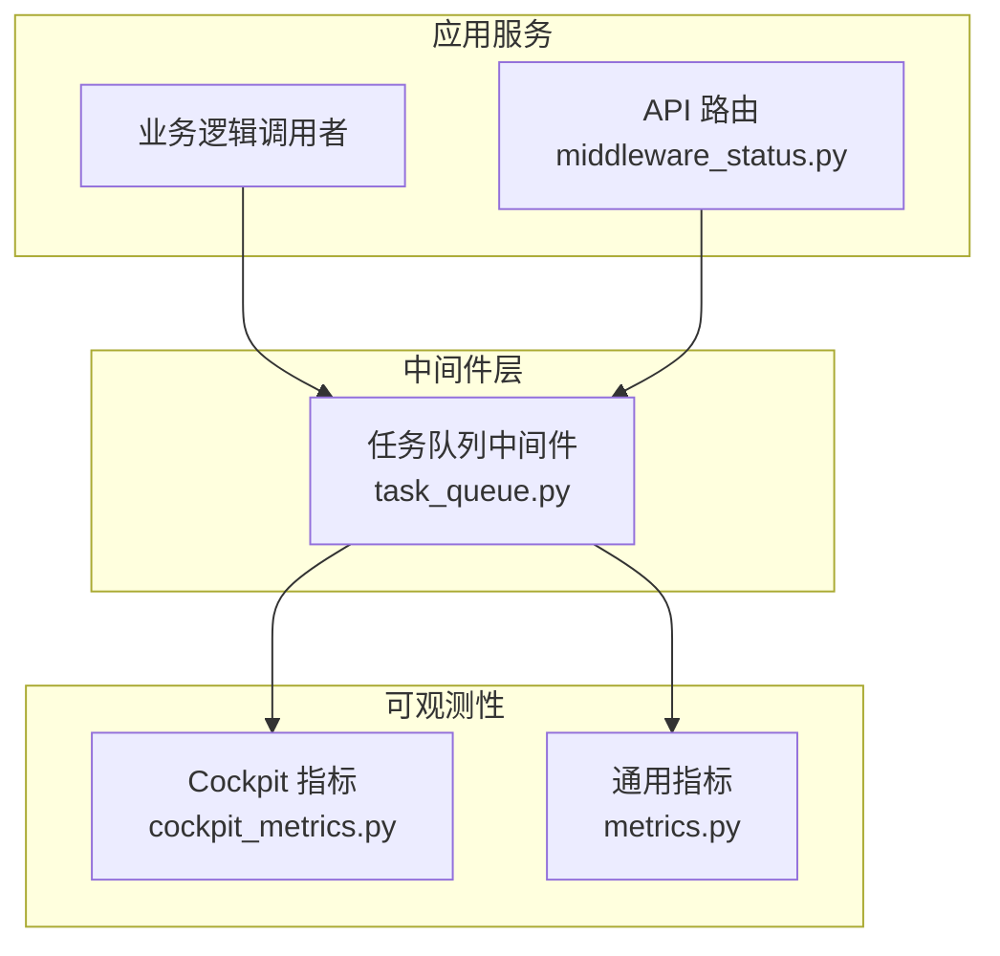
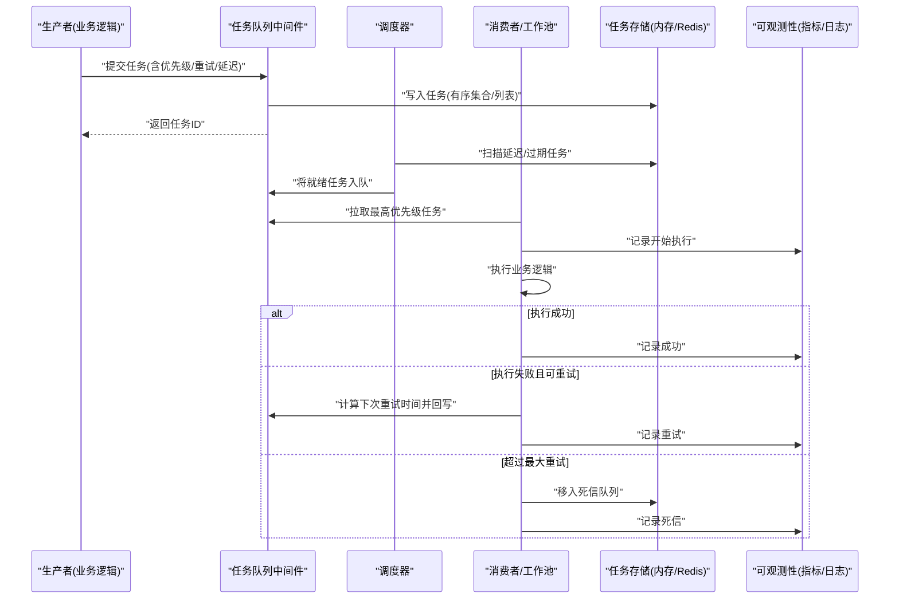
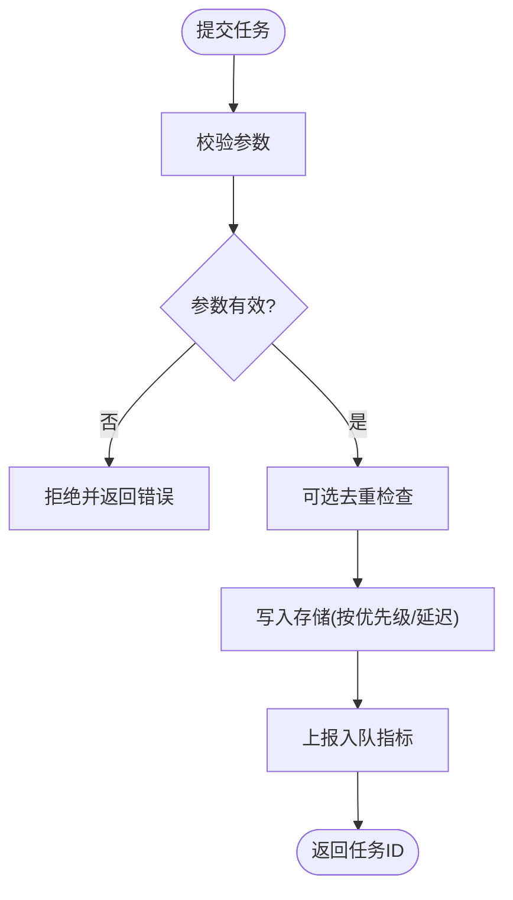
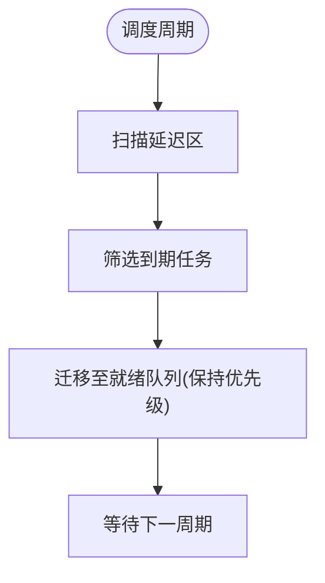
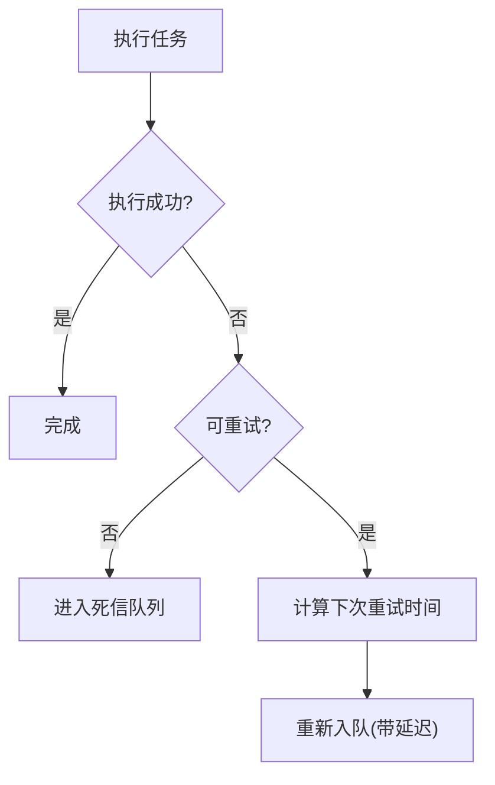
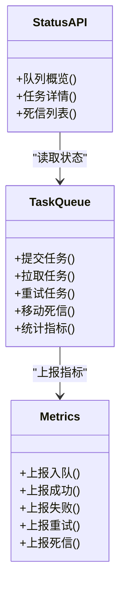
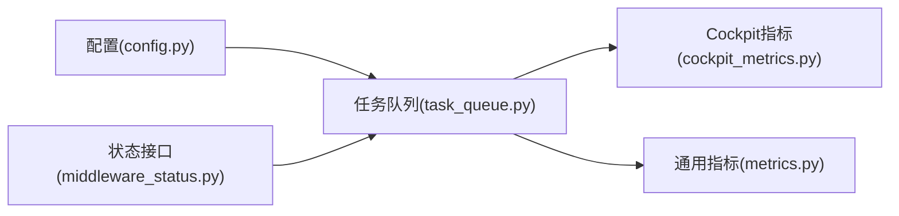

# 任务队列中间件

<cite>
**本文引用的文件**   
- [task_queue.py](file://backend_design/nexus/middleware/task_queue.py)
- [config.py](file://backend_design/nexus/config.py)
- [middleware_status.py](file://backend_design/nexus/api/routes/middleware_status.py)
- [cockpit_metrics.py](file://backend_design/nexus/observability/cockpit_metrics.py)
- [metrics.py](file://backend_design/nexus/observability/metrics.py)
</cite>

## 目录
1. [简介](#简介)
2. [项目结构](#项目结构)
3. [核心组件](#核心组件)
4. [架构总览](#架构总览)
5. [详细组件分析](#详细组件分析)
6. [依赖关系分析](#依赖关系分析)
7. [性能考量](#性能考量)
8. [故障排查指南](#故障排查指南)
9. [结论](#结论)
10. [附录](#附录)

## 简介
本文件面向 NexusCockpit 系统的“任务队列中间件”，聚焦异步任务处理架构与工程实践，覆盖以下主题：
- 生产者-消费者模型与消息传递机制
- 任务优先级管理与调度策略、资源分配
- 失败重试、退避算法与死信队列等容错机制
- 任务监控与调试（状态跟踪、执行日志、性能分析）
- 配置参数说明与扩展开发示例

该中间件位于后端模块的 middleware 层，提供统一的任务入队、出队、调度与可观测性能力，并与 API 路由和指标系统对接。

## 项目结构
与任务队列相关的代码主要分布在以下位置：
- 中间件实现：backend_design/nexus/middleware/task_queue.py
- 配置入口：backend_design/nexus/config.py
- 管理接口：backend_design/nexus/api/routes/middleware_status.py
- 可观测性：backend_design/nexus/observability/cockpit_metrics.py、backend_design/nexus/observability/metrics.py

图表来源
- [task_queue.py](file://backend_design/nexus/middleware/task_queue.py)
- [middleware_status.py](file://backend_design/nexus/api/routes/middleware_status.py)
- [cockpit_metrics.py](file://backend_design/nexus/observability/cockpit_metrics.py)
- [metrics.py](file://backend_design/nexus/observability/metrics.py)

章节来源
- [task_queue.py](file://backend_design/nexus/middleware/task_queue.py)
- [middleware_status.py](file://backend_design/nexus/api/routes/middleware_status.py)
- [cockpit_metrics.py](file://backend_design/nexus/observability/cockpit_metrics.py)
- [metrics.py](file://backend_design/nexus/observability/metrics.py)

## 核心组件
- 任务定义与元数据
  - 任务标识、类型、负载、优先级、超时、重试次数、延迟时间戳、创建/更新时间等
- 任务存储与队列
  - 基于内存或外部存储（如 Redis）的持久化队列；支持按优先级排序的有序集合
- 生产者接口
  - 提交任务到队列，支持设置优先级、延迟、重试策略
- 消费者与工作池
  - 多工作协程/线程从队列拉取任务并执行；支持并发度控制与资源隔离
- 调度器
  - 定时扫描延迟任务、触发过期任务、维护优先级顺序
- 重试与死信
  - 指数退避、最大重试次数、失败后进入死信队列
- 可观测性
  - 指标上报（入队/出队/成功/失败/重试/死信）、状态查询接口

章节来源
- [task_queue.py](file://backend_design/nexus/middleware/task_queue.py)

## 架构总览
下图展示任务从生产到消费、再到可观测性的端到端流程。

图表来源
- [task_queue.py](file://backend_design/nexus/middleware/task_queue.py)
- [middleware_status.py](file://backend_design/nexus/api/routes/middleware_status.py)
- [cockpit_metrics.py](file://backend_design/nexus/observability/cockpit_metrics.py)
- [metrics.py](file://backend_design/nexus/observability/metrics.py)

## 详细组件分析

### 任务模型与数据结构
- 关键字段
  - 任务ID、任务类型、负载数据、优先级、重试计数、最大重试次数、延迟时间戳、超时、状态、错误信息、创建/更新时间
- 复杂度与选择
  - 使用有序集合维护优先级时，插入/删除/范围查询为对数复杂度；适合高吞吐场景
  - 若采用内存堆/优先队列，需考虑序列化与持久化代价

章节来源
- [task_queue.py](file://backend_design/nexus/middleware/task_queue.py)

### 生产者接口与消息传递
- 提交流程
  - 校验输入参数（必填字段、优先级范围、重试上限）
  - 生成任务ID与初始时间戳
  - 根据是否延迟决定入队时机（立即入队或放入延迟区）
  - 写入存储并上报入队指标
- 幂等与去重
  - 可选基于任务键的去重策略，避免重复提交
- 背压与限流
  - 当队列长度超过阈值时，拒绝新任务或降级提示

图表来源
- [task_queue.py](file://backend_design/nexus/middleware/task_queue.py)

章节来源
- [task_queue.py](file://backend_design/nexus/middleware/task_queue.py)

### 消费者与工作池
- 拉取策略
  - 阻塞/非阻塞拉取；按优先级从高到低取出
- 并发控制
  - 通过工作池大小限制并发度，防止资源耗尽
- 执行上下文
  - 注入任务元数据、追踪ID、租户上下文等
- 异常处理
  - 捕获异常并分类（可重试/不可重试），更新状态与指标

章节来源
- [task_queue.py](file://backend_design/nexus/middleware/task_queue.py)

### 调度器与优先级管理
- 优先级队列
  - 数值越小优先级越高（或反之，取决于实现约定）
  - 同优先级内可按提交时间 FIFO
- 延迟任务
  - 定时扫描延迟区，将到期任务迁移至就绪队列
- 资源分配
  - 按任务类型或标签进行分组调度，绑定不同工作池或资源配额

图表来源
- [task_queue.py](file://backend_design/nexus/middleware/task_queue.py)

章节来源
- [task_queue.py](file://backend_design/nexus/middleware/task_queue.py)

### 失败重试与死信队列
- 重试策略
  - 固定间隔或指数退避；支持抖动以避免雪崩
  - 最大重试次数与重试窗口
- 死信队列
  - 超过最大重试次数的任务转入死信队列，供后续人工干预或离线分析
- 幂等执行
  - 消费者侧应保证幂等，避免重复执行造成副作用

图表来源
- [task_queue.py](file://backend_design/nexus/middleware/task_queue.py)

章节来源
- [task_queue.py](file://backend_design/nexus/middleware/task_queue.py)

### 可观测性与监控
- 指标维度
  - 入队/出队速率、成功率、失败率、重试次数、死信数量、平均/分位耗时、队列深度、优先级分布
- 状态查询
  - 通过管理接口获取队列概览、任务详情、死信列表
- 日志与追踪
  - 每个任务携带唯一追踪ID，贯穿生产、调度、消费全流程

图表来源
- [task_queue.py](file://backend_design/nexus/middleware/task_queue.py)
- [middleware_status.py](file://backend_design/nexus/api/routes/middleware_status.py)
- [cockpit_metrics.py](file://backend_design/nexus/observability/cockpit_metrics.py)
- [metrics.py](file://backend_design/nexus/observability/metrics.py)

章节来源
- [middleware_status.py](file://backend_design/nexus/api/routes/middleware_status.py)
- [cockpit_metrics.py](file://backend_design/nexus/observability/cockpit_metrics.py)
- [metrics.py](file://backend_design/nexus/observability/metrics.py)

## 依赖关系分析
- 内部依赖
  - 任务队列中间件依赖配置模块加载默认参数
  - 与可观测性模块耦合用于指标上报
  - 与 API 路由解耦，通过函数/类方法暴露状态查询能力
- 外部依赖
  - 存储后端（内存/Redis）用于持久化与优先级排序
  - 监控系统（Prometheus/Grafana）用于可视化

图表来源
- [config.py](file://backend_design/nexus/config.py)
- [task_queue.py](file://backend_design/nexus/middleware/task_queue.py)
- [middleware_status.py](file://backend_design/nexus/api/routes/middleware_status.py)
- [cockpit_metrics.py](file://backend_design/nexus/observability/cockpit_metrics.py)
- [metrics.py](file://backend_design/nexus/observability/metrics.py)

章节来源
- [config.py](file://backend_design/nexus/config.py)
- [task_queue.py](file://backend_design/nexus/middleware/task_queue.py)
- [middleware_status.py](file://backend_design/nexus/api/routes/middleware_status.py)
- [cockpit_metrics.py](file://backend_design/nexus/observability/cockpit_metrics.py)
- [metrics.py](file://backend_design/nexus/observability/metrics.py)

## 性能考量
- 队列容量与背压
  - 设置最大队列长度与丢弃/拒绝策略，避免 OOM
- 优先级排序成本
  - 在高吞吐下优先使用高效有序集合；必要时批量迁移
- 消费者并发度
  - 根据 CPU/IO 特性调整工作池大小，避免上下文切换开销
- 重试退避
  - 指数退避+抖动降低热点冲突；合理设置最大重试次数
- 存储选型
  - 内存队列低延迟但易丢失；Redis 具备持久化与原子操作优势

[本节为通用指导，不直接分析具体文件]

## 故障排查指南
- 常见问题定位
  - 任务堆积：检查消费者并发度、下游依赖可用性、死信增长趋势
  - 优先级异常：确认优先级数值约定与排序方向
  - 重复执行：检查消费者幂等性与去重键
  - 延迟未触发：核对调度周期与系统时钟
- 诊断手段
  - 通过状态接口查看队列深度、任务明细、死信列表
  - 结合指标面板观察入队/出队速率、失败率、重试与死信计数
  - 使用追踪ID串联日志，定位慢任务与异常栈

章节来源
- [middleware_status.py](file://backend_design/nexus/api/routes/middleware_status.py)
- [cockpit_metrics.py](file://backend_design/nexus/observability/cockpit_metrics.py)
- [metrics.py](file://backend_design/nexus/observability/metrics.py)

## 结论
NexusCockpit 的任务队列中间件以清晰的职责边界实现了高可用的异步任务处理能力：通过优先级队列与调度器保障关键任务及时执行，借助重试与死信提升鲁棒性，并通过完善的指标与状态接口支撑运维与排障。建议在生产环境启用持久化存储、合理配置并发与退避参数，并结合监控告警形成闭环。

[本节为总结性内容，不直接分析具体文件]

## 附录

### 配置参数参考
以下为常见配置项及其作用（具体默认值与取值范围以实现为准）：
- 队列存储
  - backend: 存储后端类型（内存/redis）
  - redis_url: Redis 连接地址
  - queue_name: 队列命名空间
- 优先级与调度
  - priority_min/max: 优先级范围
  - scheduler_interval: 调度周期秒数
- 重试与死信
  - max_retries: 最大重试次数
  - retry_base_delay: 基础退避秒数
  - retry_max_delay: 最大退避秒数
  - dead_letter_ttl: 死信保留时长
- 并发与资源
  - worker_count: 消费者并发度
  - task_timeout: 任务执行超时秒数
- 可观测性
  - metrics_enabled: 是否开启指标上报
  - log_level: 日志级别

章节来源
- [config.py](file://backend_design/nexus/config.py)
- [task_queue.py](file://backend_design/nexus/middleware/task_queue.py)

### 扩展开发示例（步骤指引）
- 新增任务类型处理器
  - 在消费者注册表中注册新的任务类型与处理函数
  - 确保处理函数幂等并正确上报指标
- 自定义优先级策略
  - 修改优先级计算函数，例如结合任务权重与截止时间
- 接入外部存储
  - 替换存储后端为 Redis 或其他持久化方案
  - 实现原子入队/出队与延迟区迁移
- 增强监控
  - 补充业务相关指标维度（如租户、设备、技能域）
  - 增加关键路径的分布式追踪

章节来源
- [task_queue.py](file://backend_design/nexus/middleware/task_queue.py)
- [cockpit_metrics.py](file://backend_design/nexus/observability/cockpit_metrics.py)
- [metrics.py](file://backend_design/nexus/observability/metrics.py)