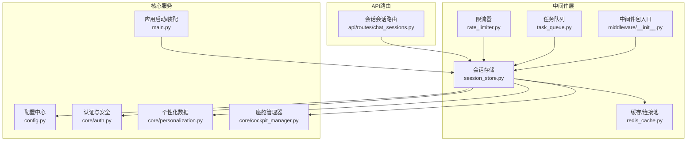
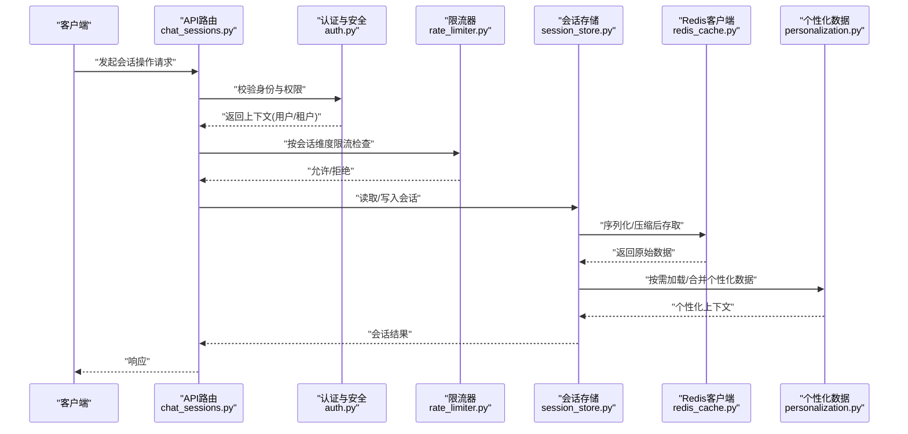
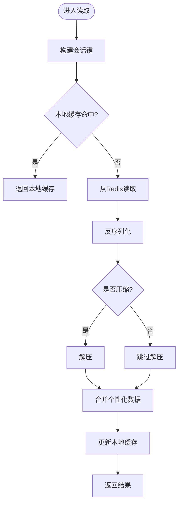
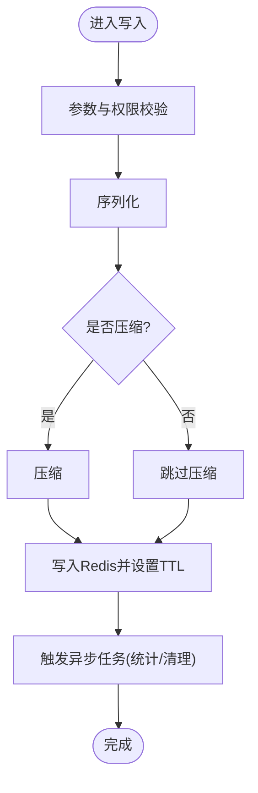
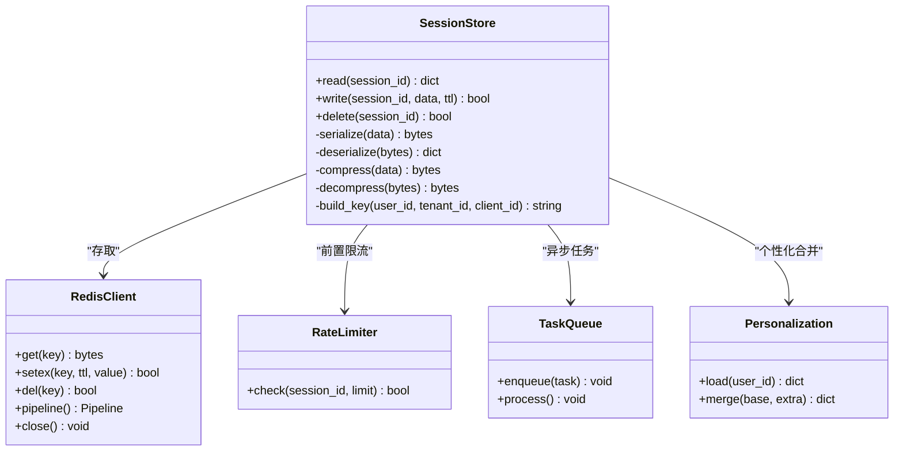

# 会话存储中间件

<cite>
**本文引用的文件**   
- [session_store.py](file://backend_design/nexus/middleware/session_store.py)
- [redis_cache.py](file://backend_design/nexus/middleware/redis_cache.py)
- [rate_limiter.py](file://backend_design/nexus/middleware/rate_limiter.py)
- [task_queue.py](file://backend_design/nexus/middleware/task_queue.py)
- [__init__.py](file://backend_design/nexus/middleware/__init__.py)
- [config.py](file://backend_design/nexus/config.py)
- [main.py](file://backend_design/nexus/main.py)
- [chat_sessions.py](file://backend_design/nexus/api/routes/chat_sessions.py)
- [auth.py](file://backend_design/nexus/core/auth.py)
- [personalization.py](file://backend_design/nexus/core/personalization.py)
- [cockpit_manager.py](file://backend_design/nexus/core/cockpit_manager.py)
</cite>

## 目录
1. [简介](#简介)
2. [项目结构](#项目结构)
3. [核心组件](#核心组件)
4. [架构总览](#架构总览)
5. [详细组件分析](#详细组件分析)
6. [依赖关系分析](#依赖关系分析)
7. [性能考量](#性能考量)
8. [故障排查指南](#故障排查指南)
9. [结论](#结论)
10. [附录](#附录)

## 简介
本文件面向NexusCockpit系统的“会话存储中间件”，围绕分布式会话存储的设计与实现进行系统化说明。内容覆盖：
- 会话数据结构与生命周期
- 存储后端选择与扩展点（Redis为主）
- 会话同步机制与一致性策略
- 持久化策略（序列化、压缩、过期清理）
- 安全管理（加密、防重放、防劫持）
- 个性化会话数据管理（偏好、临时数据、数据分析）
- 配置项与扩展开发指南

## 项目结构
会话存储相关代码位于后端模块的中间件层，并与API路由、核心服务及配置模块紧密协作。

图表来源
- [session_store.py](file://backend_design/nexus/middleware/session_store.py)
- [redis_cache.py](file://backend_design/nexus/middleware/redis_cache.py)
- [rate_limiter.py](file://backend_design/nexus/middleware/rate_limiter.py)
- [task_queue.py](file://backend_design/nexus/middleware/task_queue.py)
- [__init__.py](file://backend_design/nexus/middleware/__init__.py)
- [config.py](file://backend_design/nexus/config.py)
- [main.py](file://backend_design/nexus/main.py)
- [chat_sessions.py](file://backend_design/nexus/api/routes/chat_sessions.py)
- [auth.py](file://backend_design/nexus/core/auth.py)
- [personalization.py](file://backend_design/nexus/core/personalization.py)
- [cockpit_manager.py](file://backend_design/nexus/core/cockpit_manager.py)

章节来源
- [session_store.py](file://backend_design/nexus/middleware/session_store.py)
- [redis_cache.py](file://backend_design/nexus/middleware/redis_cache.py)
- [rate_limiter.py](file://backend_design/nexus/middleware/rate_limiter.py)
- [task_queue.py](file://backend_design/nexus/middleware/task_queue.py)
- [__init__.py](file://backend_design/nexus/middleware/__init__.py)
- [config.py](file://backend_design/nexus/config.py)
- [main.py](file://backend_design/nexus/main.py)
- [chat_sessions.py](file://backend_design/nexus/api/routes/chat_sessions.py)
- [auth.py](file://backend_design/nexus/core/auth.py)
- [personalization.py](file://backend_design/nexus/core/personalization.py)
- [cockpit_manager.py](file://backend_design/nexus/core/cockpit_manager.py)

## 核心组件
- 会话存储中间件：提供跨请求的会话读写、过期控制、序列化/反序列化、可选压缩、以及与其他中间件的协同（如限流、任务队列）。
- Redis缓存客户端：封装连接池、键空间隔离、错误重试与降级策略。
- 限流器：基于会话维度的访问频率控制，防止滥用。
- 任务队列：异步处理与会话相关的后台任务（如清理、统计上报）。
- 配置中心：集中管理会话TTL、压缩开关、加密开关、键前缀等。
- API路由：暴露会话查询、更新、销毁等接口。
- 安全与个性化：在会话读写前后注入安全校验与个性化数据加载/保存。

章节来源
- [session_store.py](file://backend_design/nexus/middleware/session_store.py)
- [redis_cache.py](file://backend_design/nexus/middleware/redis_cache.py)
- [rate_limiter.py](file://backend_design/nexus/middleware/rate_limiter.py)
- [task_queue.py](file://backend_design/nexus/middleware/task_queue.py)
- [config.py](file://backend_design/nexus/config.py)
- [chat_sessions.py](file://backend_design/nexus/api/routes/chat_sessions.py)
- [auth.py](file://backend_design/nexus/core/auth.py)
- [personalization.py](file://backend_design/nexus/core/personalization.py)

## 架构总览
下图展示一次典型会话读写的端到端流程，包括鉴权、限流、会话存取、个性化数据加载与结果返回。

图表来源
- [chat_sessions.py](file://backend_design/nexus/api/routes/chat_sessions.py)
- [auth.py](file://backend_design/nexus/core/auth.py)
- [rate_limiter.py](file://backend_design/nexus/middleware/rate_limiter.py)
- [session_store.py](file://backend_design/nexus/middleware/session_store.py)
- [redis_cache.py](file://backend_design/nexus/middleware/redis_cache.py)
- [personalization.py](file://backend_design/nexus/core/personalization.py)

## 详细组件分析

### 会话存储中间件（session_store.py）
职责与能力
- 会话键生成：结合用户ID、租户ID、设备/客户端标识生成唯一键，避免冲突。
- 序列化与压缩：根据配置决定是否启用压缩；支持多种序列化格式（JSON/MessagePack等），默认以可读性优先。
- TTL与过期：为会话设置合理TTL，支持动态调整；对热点会话可刷新TTL。
- 原子性与一致性：通过Redis事务或Lua脚本保证复合操作的原子性，减少竞态条件。
- 错误与降级：网络异常时回退到本地内存缓存或只读模式，保障可用性。
- 审计与指标：记录关键操作耗时、命中率、失败率，便于观测。

关键流程（读取）

图表来源
- [session_store.py](file://backend_design/nexus/middleware/session_store.py)
- [redis_cache.py](file://backend_design/nexus/middleware/redis_cache.py)
- [personalization.py](file://backend_design/nexus/core/personalization.py)

关键流程（写入）

图表来源
- [session_store.py](file://backend_design/nexus/middleware/session_store.py)
- [task_queue.py](file://backend_design/nexus/middleware/task_queue.py)

章节来源
- [session_store.py](file://backend_design/nexus/middleware/session_store.py)

### Redis缓存客户端（redis_cache.py）
职责与能力
- 连接池管理：多实例、分片、主从/哨兵/集群适配。
- 键空间隔离：按环境/租户/版本划分键前缀，避免污染。
- 重试与熔断：对超时、断连进行指数退避重试；连续失败触发熔断，快速失败。
- 监控埋点：记录延迟分布、错误码、吞吐。

章节来源
- [redis_cache.py](file://backend_design/nexus/middleware/redis_cache.py)

### 限流器（rate_limiter.py）
职责与能力
- 维度：支持按会话ID、用户ID、IP等多维度限流。
- 算法：滑动窗口/令牌桶，支持动态阈值。
- 与中间件集成：在会话读写前执行，超限直接拒绝或降级。

章节来源
- [rate_limiter.py](file://backend_design/nexus/middleware/rate_limiter.py)

### 任务队列（task_queue.py）
职责与能力
- 异步任务：会话清理、统计聚合、日志归档。
- 可靠性：至少一次投递、幂等消费、死信队列。
- 背压与批处理：高负载下自动批处理，降低下游压力。

章节来源
- [task_queue.py](file://backend_design/nexus/middleware/task_queue.py)

### 配置中心（config.py）
关键配置项（示例）
- 会话TTL：默认值、最大/最小限制、动态刷新策略。
- 序列化与压缩：格式选择、压缩级别、阈值（仅大于某大小才压缩）。
- 加密开关：敏感字段加密、密钥轮换策略。
- 键前缀与环境隔离：区分dev/staging/prod。
- 降级策略：本地缓存开关、只读模式开关。
- 监控与审计：采样率、指标名称、告警阈值。

章节来源
- [config.py](file://backend_design/nexus/config.py)

### API路由（chat_sessions.py）
职责与能力
- 会话查询/更新/删除接口。
- 批量操作与分页。
- 与认证、限流、会话中间件组合使用。

章节来源
- [chat_sessions.py](file://backend_design/nexus/api/routes/chat_sessions.py)

### 安全与个性化（auth.py / personalization.py）
- 认证与安全：在会话创建时绑定用户上下文，校验签名与时间戳，防止重放；会话ID随机化与定期轮换。
- 个性化数据：在会话读取时按需加载用户偏好、最近行为摘要，写入时增量合并，避免全量覆盖。

章节来源
- [auth.py](file://backend_design/nexus/core/auth.py)
- [personalization.py](file://backend_design/nexus/core/personalization.py)

## 依赖关系分析

图表来源
- [session_store.py](file://backend_design/nexus/middleware/session_store.py)
- [redis_cache.py](file://backend_design/nexus/middleware/redis_cache.py)
- [rate_limiter.py](file://backend_design/nexus/middleware/rate_limiter.py)
- [task_queue.py](file://backend_design/nexus/middleware/task_queue.py)
- [personalization.py](file://backend_design/nexus/core/personalization.py)

章节来源
- [session_store.py](file://backend_design/nexus/middleware/session_store.py)
- [redis_cache.py](file://backend_design/nexus/middleware/redis_cache.py)
- [rate_limiter.py](file://backend_design/nexus/middleware/rate_limiter.py)
- [task_queue.py](file://backend_design/nexus/middleware/task_queue.py)
- [personalization.py](file://backend_design/nexus/core/personalization.py)

## 性能考量
- 序列化与压缩权衡：大对象开启压缩可减少带宽与存储占用，但增加CPU开销；建议按大小阈值与对象类型差异化处理。
- 本地缓存：热点会话短期缓存可降低Redis压力，注意失效策略与一致性边界。
- 原子操作：复杂更新尽量使用Lua脚本或Pipeline，减少往返RTT。
- 过期与清理：合理设置TTL与滚动刷新，避免雪崩；配合定时任务做批量清理。
- 限流与背压：在高并发场景下，限流保护后端，任务队列削峰填谷。
- 监控与调优：关注P95/P99延迟、命中率、错误率、GC与CPU使用率。

[本节为通用指导，不直接分析具体文件]

## 故障排查指南
常见问题与定位步骤
- 无法连接Redis：检查连接串、网络连通、凭据、ACL；查看客户端重试与熔断状态。
- 会话丢失或过期过快：核对TTL配置、刷新逻辑、键前缀是否正确。
- 序列化/压缩异常：确认对象可序列化、压缩开关与阈值、版本兼容性。
- 限流误杀：检查限流维度与阈值、突发流量策略。
- 个性化数据未生效：确认加载时机、合并策略、权限范围。
- 指标缺失：确认埋点开关、采样率、下游采集链路。

章节来源
- [redis_cache.py](file://backend_design/nexus/middleware/redis_cache.py)
- [rate_limiter.py](file://backend_design/nexus/middleware/rate_limiter.py)
- [session_store.py](file://backend_design/nexus/middleware/session_store.py)

## 结论
会话存储中间件以Redis为核心，结合序列化/压缩、TTL管理、限流与异步任务，形成高可用、可扩展的分布式会话方案。通过安全加固与个性化数据融合，既满足业务体验，又兼顾系统稳定性与可观测性。建议在上线前完善监控告警与压测验证，并根据实际负载持续优化TTL、压缩阈值与限流策略。

[本节为总结性内容，不直接分析具体文件]

## 附录

### 配置清单（建议）
- 会话TTL：默认秒数、最大/最小、刷新策略
- 序列化：格式、兼容版本
- 压缩：开关、级别、阈值
- 加密：开关、算法、密钥轮换周期
- 键前缀：环境/租户/版本
- 降级：本地缓存开关、只读模式
- 限流：维度、阈值、算法
- 任务队列：批大小、重试次数、死信策略
- 监控：指标名、采样率、告警阈值

章节来源
- [config.py](file://backend_design/nexus/config.py)

### 扩展开发指南
- 新增存储后端：实现统一接口（get/set/del/pipeline），注册到客户端工厂。
- 自定义序列化器：实现序列/反序列方法，并在配置中切换。
- 插件式压缩：实现压缩/解压接口，按对象类型选择策略。
- 个性化数据源：接入外部偏好存储，提供加载与合并钩子。
- 安全增强：在会话创建/读取时注入签名校验、时间戳校验、设备指纹比对。

章节来源
- [session_store.py](file://backend_design/nexus/middleware/session_store.py)
- [redis_cache.py](file://backend_design/nexus/middleware/redis_cache.py)
- [personalization.py](file://backend_design/nexus/core/personalization.py)