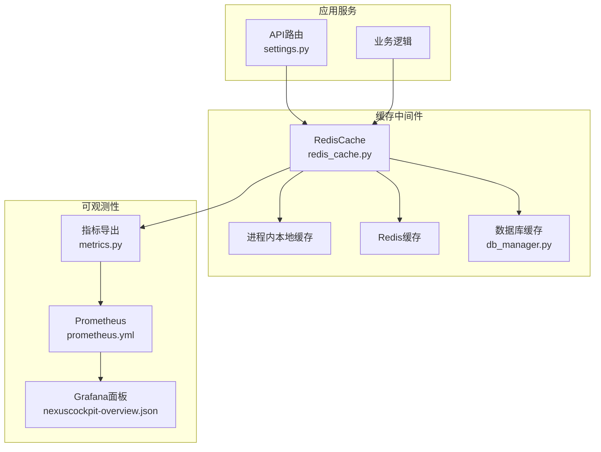
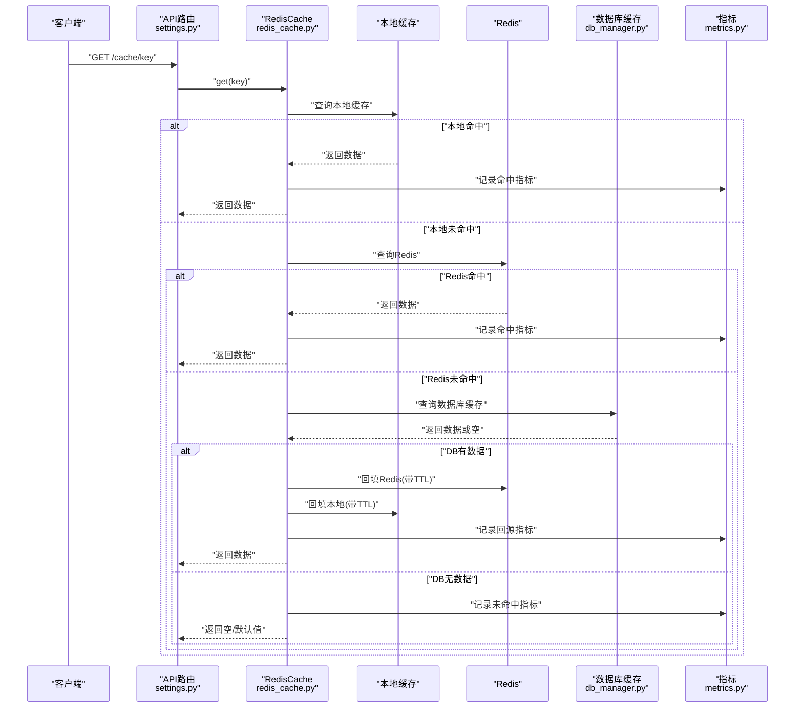
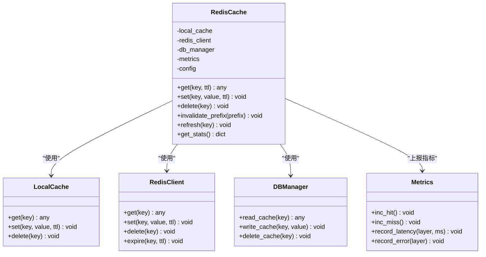
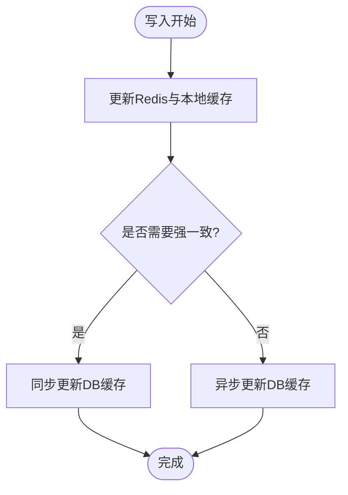
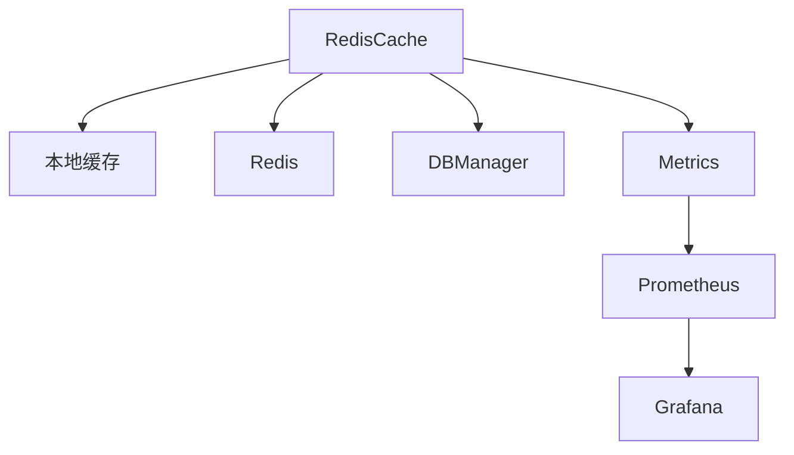

# 缓存中间件

<cite>
**本文引用的文件**   
- [backend_design/nexus/middleware/redis_cache.py](file://backend_design/nexus/middleware/redis_cache.py)
- [backend_design/nexus/config.py](file://backend_design/nexus/config.py)
- [backend_design/nexus/core/db_manager.py](file://backend_design/nexus/core/db_manager.py)
- [backend_design/nexus/observability/metrics.py](file://backend_design/nexus/observability/metrics.py)
- [backend_design/nexus/api/routes/settings.py](file://backend_design/nexus/api/routes/settings.py)
- [config/prometheus/prometheus.yml](file://config/prometheus/prometheus.yml)
- [config/grafana/provisioning/dashboards/nexuscockpit-overview.json](file://config/grafana/provisioning/dashboards/nexuscockpit-overview.json)
</cite>

## 目录
1. [简介](#简介)
2. [项目结构](#项目结构)
3. [核心组件](#核心组件)
4. [架构总览](#架构总览)
5. [详细组件分析](#详细组件分析)
6. [依赖分析](#依赖分析)
7. [性能考虑](#性能考虑)
8. [故障排查指南](#故障排查指南)
9. [结论](#结论)
10. [附录](#附录)

## 简介
本文件面向NexusCockpit系统的“缓存中间件”，聚焦多级缓存架构与工程实践，覆盖本地缓存、Redis缓存与数据库缓存的层次设计；说明TTL、键生成、失效策略等配置项；阐述读写穿透、写扩散、更新一致性机制；给出预热、批量操作、内存管理等优化手段；并提供使用示例与监控指标配置建议。

## 项目结构
与缓存中间件直接相关的后端代码位于 backend_design/nexus 目录下：
- 缓存实现：middleware/redis_cache.py
- 配置入口：config.py
- 数据访问层（用于DB缓存）：core/db_manager.py
- 可观测性指标：observability/metrics.py
- 设置接口（便于动态调整缓存参数）：api/routes/settings.py
- 监控采集与可视化：config/prometheus/prometheus.yml、config/grafana/provisioning/dashboards/nexuscockpit-overview.json

图表来源
- [backend_design/nexus/middleware/redis_cache.py](file://backend_design/nexus/middleware/redis_cache.py)
- [backend_design/nexus/config.py](file://backend_design/nexus/config.py)
- [backend_design/nexus/core/db_manager.py](file://backend_design/nexus/core/db_manager.py)
- [backend_design/nexus/observability/metrics.py](file://backend_design/nexus/observability/metrics.py)
- [config/prometheus/prometheus.yml](file://config/prometheus/prometheus.yml)
- [config/grafana/provisioning/dashboards/nexuscockpit-overview.json](file://config/grafana/provisioning/dashboards/nexuscockpit-overview.json)

章节来源
- [backend_design/nexus/middleware/redis_cache.py](file://backend_design/nexus/middleware/redis_cache.py)
- [backend_design/nexus/config.py](file://backend_design/nexus/config.py)
- [backend_design/nexus/core/db_manager.py](file://backend_design/nexus/core/db_manager.py)
- [backend_design/nexus/observability/metrics.py](file://backend_design/nexus/observability/metrics.py)
- [backend_design/nexus/api/routes/settings.py](file://backend_design/nexus/api/routes/settings.py)
- [config/prometheus/prometheus.yml](file://config/prometheus/prometheus.yml)
- [config/grafana/provisioning/dashboards/nexuscockpit-overview.json](file://config/grafana/provisioning/dashboards/nexuscockpit-overview.json)

## 核心组件
- RedisCache（多级缓存封装）
  - 职责：统一读/写/删除接口；按层级命中顺序读取；在写入后执行失效或更新策略；记录命中率与延迟等指标。
  - 关键能力：
    - 本地缓存：进程内快速命中，降低跨进程/网络开销。
    - Redis缓存：集群共享，支撑多实例一致性与高吞吐。
    - 数据库缓存：作为最终一致性兜底，支持持久化与恢复。
    - TTL管理：为不同层级提供过期控制。
    - 键空间管理：统一的键前缀与命名规范，避免冲突。
    - 降级与容错：当Redis不可用时回退到本地或直连DB。
- 配置模块（config.py）
  - 职责：集中管理缓存相关配置，如Redis连接、TTL默认值、是否启用本地缓存、键前缀、最大容量等。
- 数据访问层（db_manager.py）
  - 职责：提供对数据库缓存表的读写能力，供RedisCache在缺失时回填。
- 指标模块（metrics.py）
  - 职责：暴露缓存命中率、延迟、错误率、容量等指标，供Prometheus抓取与Grafana展示。
- 设置接口（settings.py）
  - 职责：提供运行时调整缓存参数的REST接口（例如刷新某键、切换开关），便于运维与灰度验证。

章节来源
- [backend_design/nexus/middleware/redis_cache.py](file://backend_design/nexus/middleware/redis_cache.py)
- [backend_design/nexus/config.py](file://backend_design/nexus/config.py)
- [backend_design/nexus/core/db_manager.py](file://backend_design/nexus/core/db_manager.py)
- [backend_design/nexus/observability/metrics.py](file://backend_design/nexus/observability/metrics.py)
- [backend_design/nexus/api/routes/settings.py](file://backend_design/nexus/api/routes/settings.py)

## 架构总览
下图展示了请求从API进入，经缓存中间件进行多级命中，必要时回源至数据库，并将结果回填各级缓存的完整流程。

图表来源
- [backend_design/nexus/middleware/redis_cache.py](file://backend_design/nexus/middleware/redis_cache.py)
- [backend_design/nexus/core/db_manager.py](file://backend_design/nexus/core/db_manager.py)
- [backend_design/nexus/observability/metrics.py](file://backend_design/nexus/observability/metrics.py)
- [backend_design/nexus/api/routes/settings.py](file://backend_design/nexus/api/routes/settings.py)

## 详细组件分析

### RedisCache 类与方法
- 设计要点
  - 分层读取：本地→Redis→DB，逐级回退。
  - 写扩散：写操作优先更新Redis并设置TTL，同时可选择性地同步更新本地缓存；根据业务需要决定是否立即写DB或异步落库。
  - 失效策略：支持按键精确失效、按前缀批量失效、按TTL自然过期。
  - 幂等与重试：对回源DB的查询具备超时与重试保护，避免雪崩。
  - 指标埋点：每次命中/未命中、各层耗时、错误计数均上报。
- 典型方法
  - get(key, ttl=None): 按层级读取，命中则返回，否则回源并回填。
  - set(key, value, ttl=None): 写入Redis与本地缓存，可选触发DB缓存更新。
  - delete(key): 删除指定键，支持级联失效。
  - invalidate_prefix(prefix): 按前缀批量失效。
  - refresh(key): 强制刷新某键（常用于热点键重建）。
  - get_stats(): 汇总命中率、容量、错误数等统计信息。

图表来源
- [backend_design/nexus/middleware/redis_cache.py](file://backend_design/nexus/middleware/redis_cache.py)
- [backend_design/nexus/core/db_manager.py](file://backend_design/nexus/core/db_manager.py)
- [backend_design/nexus/observability/metrics.py](file://backend_design/nexus/observability/metrics.py)

章节来源
- [backend_design/nexus/middleware/redis_cache.py](file://backend_design/nexus/middleware/redis_cache.py)
- [backend_design/nexus/core/db_manager.py](file://backend_design/nexus/core/db_manager.py)
- [backend_design/nexus/observability/metrics.py](file://backend_design/nexus/observability/metrics.py)

### 配置与键空间管理
- 配置项（由 config.py 提供）
  - redis_host/redis_port/redis_db：Redis连接参数。
  - local_cache_enabled：是否启用本地缓存。
  - default_ttl：默认TTL秒数。
  - key_prefix：全局键前缀，避免命名冲突。
  - max_local_size：本地缓存最大条目数。
  - db_cache_table：数据库缓存表名。
- 键生成规则
  - 格式：{key_prefix}:{domain}:{entity}:{id}
  - 示例：cockpit:user:profile:12345
  - 目的：通过前缀与域隔离，便于批量失效与权限隔离。

章节来源
- [backend_design/nexus/config.py](file://backend_design/nexus/config.py)

### 一致性保证与更新策略
- 读路径
  - 先查本地，再查Redis，最后查DB；命中即回填上层缓存，减少后续延迟。
- 写路径
  - 写扩散：优先更新Redis与本地缓存，随后异步或同步更新DB缓存，确保强一致场景下DB最终可达。
  - 失效策略：对于复杂聚合数据，采用“删除+懒加载”方式，避免脏读。
- 并发与锁
  - 热点键重建时使用分布式锁或单飞（singleflight）模式，防止缓存击穿。
- 幂等与重试
  - 对回源DB的写入具备幂等键与重试上限，失败走告警与降级。

图表来源
- [backend_design/nexus/middleware/redis_cache.py](file://backend_design/nexus/middleware/redis_cache.py)
- [backend_design/nexus/core/db_manager.py](file://backend_design/nexus/core/db_manager.py)

章节来源
- [backend_design/nexus/middleware/redis_cache.py](file://backend_design/nexus/middleware/redis_cache.py)
- [backend_design/nexus/core/db_manager.py](file://backend_design/nexus/core/db_manager.py)

### 使用示例与最佳实践
- 基本用法
  - 初始化：注入配置与依赖（Redis、DB、指标）。
  - 读取：调用 get(key)，自动处理多级命中与回填。
  - 写入：调用 set(key, value, ttl)，按需选择同步/异步落库。
  - 失效：调用 delete(key) 或 invalidate_prefix(prefix)。
- 推荐实践
  - 合理设置TTL：热点短命、冷数据长命；避免过长导致内存膨胀。
  - 键空间规划：按域与实体划分前缀，便于审计与批量清理。
  - 降级策略：Redis异常时回退本地或直连DB，保障可用性。
  - 限流与熔断：对回源DB加限流与熔断，防止雪崩。

章节来源
- [backend_design/nexus/middleware/redis_cache.py](file://backend_design/nexus/middleware/redis_cache.py)
- [backend_design/nexus/config.py](file://backend_design/nexus/config.py)

### 监控指标与可视化
- 指标维度
  - 命中率：按层（本地/Redis/DB）统计。
  - 延迟：P50/P95/P99，区分读/写。
  - 错误率：网络异常、序列化失败、DB超时等。
  - 容量：本地缓存条目数、Redis占用、DB缓存行数。
- 采集与展示
  - Prometheus抓取：通过 prometheus.yml 配置目标与指标端点。
  - Grafana面板：导入 nexuscockpit-overview.json 查看概览。

图表来源
- [backend_design/nexus/observability/metrics.py](file://backend_design/nexus/observability/metrics.py)
- [config/prometheus/prometheus.yml](file://config/prometheus/prometheus.yml)
- [config/grafana/provisioning/dashboards/nexuscockpit-overview.json](file://config/grafana/provisioning/dashboards/nexuscockpit-overview.json)

章节来源
- [backend_design/nexus/observability/metrics.py](file://backend_design/nexus/observability/metrics.py)
- [config/prometheus/prometheus.yml](file://config/prometheus/prometheus.yml)
- [config/grafana/provisioning/dashboards/nexuscockpit-overview.json](file://config/grafana/provisioning/dashboards/nexuscockpit-overview.json)

## 依赖分析
- 内部依赖
  - RedisCache 依赖：
    - 本地缓存：进程内数据结构（字典/队列等）。
    - Redis客户端：连接池、序列化/反序列化、过期控制。
    - DB管理器：数据库缓存表读写。
    - 指标模块：计数器、直方图、计时器。
- 外部依赖
  - Redis：高性能KV存储，提供原子操作与过期语义。
  - 数据库：持久化兜底，支持恢复与审计。
  - Prometheus/Grafana：指标采集与可视化。

图表来源
- [backend_design/nexus/middleware/redis_cache.py](file://backend_design/nexus/middleware/redis_cache.py)
- [backend_design/nexus/core/db_manager.py](file://backend_design/nexus/core/db_manager.py)
- [backend_design/nexus/observability/metrics.py](file://backend_design/nexus/observability/metrics.py)
- [config/prometheus/prometheus.yml](file://config/prometheus/prometheus.yml)
- [config/grafana/provisioning/dashboards/nexuscockpit-overview.json](file://config/grafana/provisioning/dashboards/nexuscockpit-overview.json)

章节来源
- [backend_design/nexus/middleware/redis_cache.py](file://backend_design/nexus/middleware/redis_cache.py)
- [backend_design/nexus/core/db_manager.py](file://backend_design/nexus/core/db_manager.py)
- [backend_design/nexus/observability/metrics.py](file://backend_design/nexus/observability/metrics.py)
- [config/prometheus/prometheus.yml](file://config/prometheus/prometheus.yml)
- [config/grafana/provisioning/dashboards/nexuscockpit-overview.json](file://config/grafana/provisioning/dashboards/nexuscockpit-overview.json)

## 性能考虑
- 缓存预热
  - 启动阶段或低峰期预加载热点键，降低首访延迟。
  - 分批预热，避免一次性冲击Redis与DB。
- 批量操作
  - 使用管道/批命令减少RTT；对无效键集合进行批量删除。
- 内存管理
  - 本地缓存限制最大容量与淘汰策略（LRU/LFU）。
  - 合理设置TTL，避免长期驻留造成内存泄漏。
- 热点与雪崩防护
  - 热点键加互斥锁或Singleflight，避免击穿。
  - TTL加入随机抖动，避免大规模同时过期。
- 压缩与序列化
  - 大对象压缩传输；选择高效序列化方案（如MessagePack）。
- 连接池与超时
  - Redis与DB连接池大小按QPS调优；设置合理的超时与重试上限。

[本节为通用性能指导，不直接分析具体文件]

## 故障排查指南
- 常见问题
  - 命中率下降：检查键空间是否被误删、TTL是否过短、是否存在大量冷数据。
  - 延迟升高：定位瓶颈层（本地/Redis/DB），查看指标中的P95/P99延迟分布。
  - 数据不一致：确认写扩散策略与失效时机，检查是否有并发写未加锁。
  - Redis不可用：观察错误率指标，确认连接池与重试策略是否生效。
- 定位步骤
  - 查看缓存统计：调用 get_stats() 获取命中率、容量、错误数。
  - 核对键空间：按前缀检索，确认键是否正确生成与失效。
  - 回放日志：结合指标时间戳，回溯异常时段的操作序列。
  - 压测复现：构造热点键与突发流量，验证熔断与降级效果。

章节来源
- [backend_design/nexus/middleware/redis_cache.py](file://backend_design/nexus/middleware/redis_cache.py)
- [backend_design/nexus/observability/metrics.py](file://backend_design/nexus/observability/metrics.py)

## 结论
本缓存中间件以“本地→Redis→DB”的多级架构为核心，兼顾性能与一致性。通过完善的TTL与键空间管理、写扩散与失效策略、以及全面的指标监控，能够在高并发与不稳定环境下保持稳定的服务能力。配合预热、批量操作与内存管理等优化手段，可进一步提升整体吞吐与用户体验。

[本节为总结性内容，不直接分析具体文件]

## 附录
- 运行时调整
  - 通过 settings.py 提供的接口，可在不重启的情况下刷新热点键、调整开关或触发批量失效。
- 监控接入
  - 在 prometheus.yml 中增加目标与指标端点，导入 Grafana 面板即可快速观测缓存健康度。

章节来源
- [backend_design/nexus/api/routes/settings.py](file://backend_design/nexus/api/routes/settings.py)
- [config/prometheus/prometheus.yml](file://config/prometheus/prometheus.yml)
- [config/grafana/provisioning/dashboards/nexuscockpit-overview.json](file://config/grafana/provisioning/dashboards/nexuscockpit-overview.json)