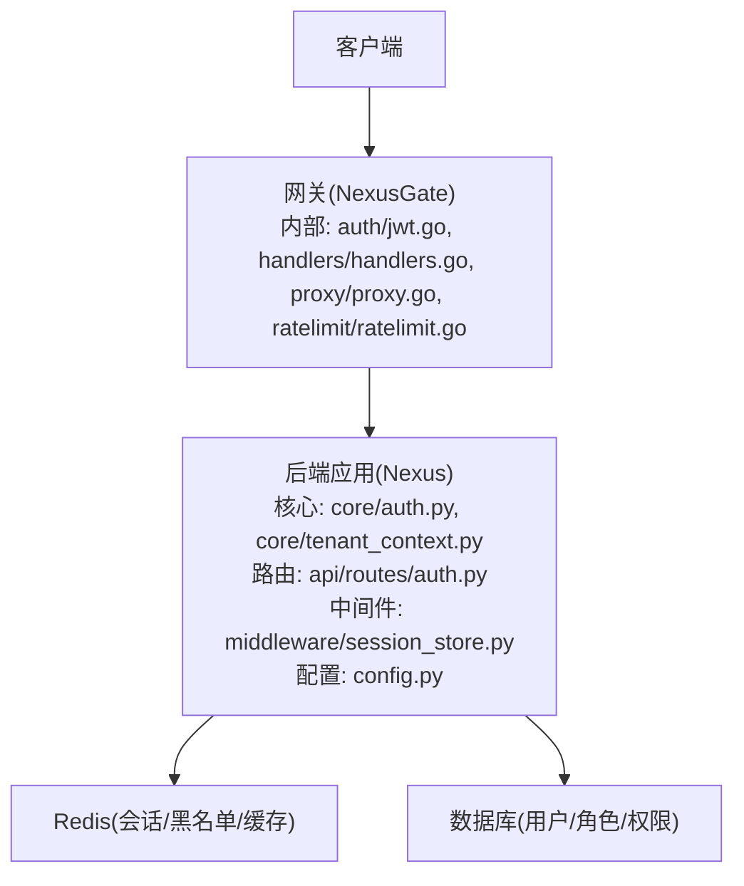
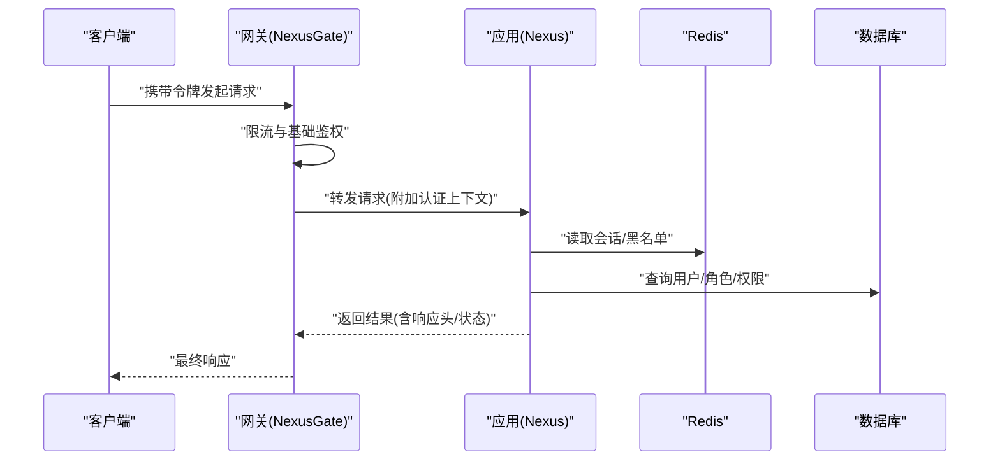
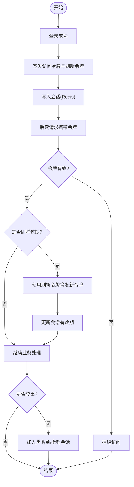
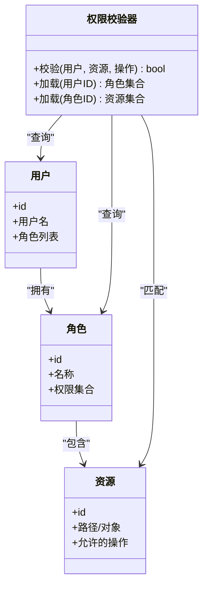
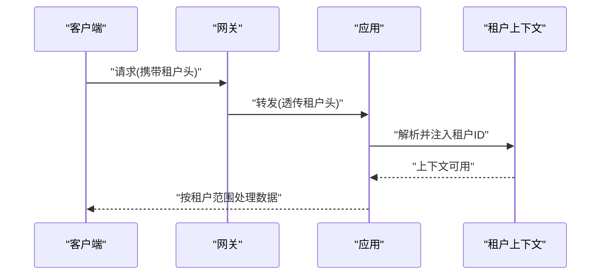
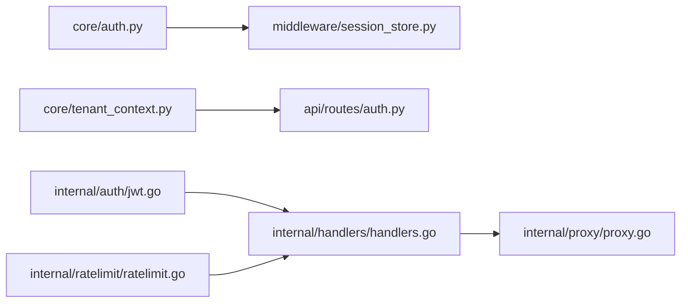

# 认证授权中间件

<cite>
**本文引用的文件**   
- [backend_design/nexus/core/auth.py](file://backend_design/nexus/core/auth.py)
- [backend_design/nexus/core/tenant_context.py](file://backend_design/nexus/core/tenant_context.py)
- [backend_design/nexus/api/routes/auth.py](file://backend_design/nexus/api/routes/auth.py)
- [backend_design/nexus_gate/internal/auth/jwt.go](file://backend_design/nexus_gate/internal/auth/jwt.go)
- [backend_design/nexus_gate/internal/handlers/handlers.go](file://backend_design/nexus_gate/internal/handlers/handlers.go)
- [backend_design/nexus_gate/internal/proxy/proxy.go](file://backend_design/nexus_gate/internal/proxy/proxy.go)
- [backend_design/nexus_gate/internal/ratelimit/ratelimit.go](file://backend_design/nexus_gate/internal/ratelimit/ratelimit.go)
- [backend_design/nexus/middleware/session_store.py](file://backend_design/nexus/middleware/session_store.py)
- [backend_design/nexus/config.py](file://backend_design/nexus/config.py)
</cite>

## 目录
1. [简介](#简介)
2. [项目结构](#项目结构)
3. [核心组件](#核心组件)
4. [架构总览](#架构总览)
5. [详细组件分析](#详细组件分析)
6. [依赖关系分析](#依赖关系分析)
7. [性能考虑](#性能考虑)
8. [故障排查指南](#故障排查指南)
9. [结论](#结论)
10. [附录](#附录)

## 简介
本文件面向 NexusCockpit 系统的“认证与授权中间件”，聚焦以下目标：
- JWT 令牌的生成、验证、刷新与撤销流程
- 权限检查系统：基于角色的访问控制（RBAC）、资源权限管理、动态权限校验
- 租户隔离机制：多租户数据隔离、上下文传递、跨租户访问控制
- 安全策略配置：密码加密、会话安全、CSRF 防护等
- 认证中间件的集成示例与自定义扩展指南

## 项目结构
NexusCockpit 的认证授权能力由网关层（Go）与应用层（Python）共同实现：
- 网关层负责入口鉴权、限流、转发，以及部分令牌校验逻辑
- 应用层提供登录、登出、刷新、权限校验、租户上下文注入等核心服务

图表来源
- [backend_design/nexus_gate/internal/auth/jwt.go](file://backend_design/nexus_gate/internal/auth/jwt.go)
- [backend_design/nexus_gate/internal/handlers/handlers.go](file://backend_design/nexus_gate/internal/handlers/handlers.go)
- [backend_design/nexus_gate/internal/proxy/proxy.go](file://backend_design/nexus_gate/internal/proxy/proxy.go)
- [backend_design/nexus_gate/internal/ratelimit/ratelimit.go](file://backend_design/nexus_gate/internal/ratelimit/ratelimit.go)
- [backend_design/nexus/core/auth.py](file://backend_design/nexus/core/auth.py)
- [backend_design/nexus/core/tenant_context.py](file://backend_design/nexus/core/tenant_context.py)
- [backend_design/nexus/api/routes/auth.py](file://backend_design/nexus/api/routes/auth.py)
- [backend_design/nexus/middleware/session_store.py](file://backend_design/nexus/middleware/session_store.py)
- [backend_design/nexus/config.py](file://backend_design/nexus/config.py)

章节来源
- [backend_design/nexus/core/auth.py](file://backend_design/nexus/core/auth.py)
- [backend_design/nexus/core/tenant_context.py](file://backend_design/nexus/core/tenant_context.py)
- [backend_design/nexus/api/routes/auth.py](file://backend_design/nexus/api/routes/auth.py)
- [backend_design/nexus_gate/internal/auth/jwt.go](file://backend_design/nexus_gate/internal/auth/jwt.go)
- [backend_design/nexus_gate/internal/handlers/handlers.go](file://backend_design/nexus_gate/internal/handlers/handlers.go)
- [backend_design/nexus_gate/internal/proxy/proxy.go](file://backend_design/nexus_gate/internal/proxy/proxy.go)
- [backend_design/nexus_gate/internal/ratelimit/ratelimit.go](file://backend_design/nexus_gate/internal/ratelimit/ratelimit.go)
- [backend_design/nexus/middleware/session_store.py](file://backend_design/nexus/middleware/session_store.py)
- [backend_design/nexus/config.py](file://backend_design/nexus/config.py)

## 核心组件
- 网关鉴权与转发
  - 在请求进入网关时进行基础鉴权与限流，随后将已认证的请求转发至后端应用
- 应用层认证与授权
  - 提供登录、登出、刷新接口；维护会话与令牌状态；执行 RBAC 与资源级权限校验
- 租户上下文
  - 从请求头或令牌中解析租户标识，注入到请求上下文中，贯穿后续业务处理
- 会话存储
  - 使用 Redis 作为会话与黑名单存储，支持快速失效与分布式共享

章节来源
- [backend_design/nexus_gate/internal/auth/jwt.go](file://backend_design/nexus_gate/internal/auth/jwt.go)
- [backend_design/nexus_gate/internal/handlers/handlers.go](file://backend_design/nexus_gate/internal/handlers/handlers.go)
- [backend_design/nexus_gate/internal/proxy/proxy.go](file://backend_design/nexus_gate/internal/proxy/proxy.go)
- [backend_design/nexus_gate/internal/ratelimit/ratelimit.go](file://backend_design/nexus_gate/internal/ratelimit/ratelimit.go)
- [backend_design/nexus/core/auth.py](file://backend_design/nexus/core/auth.py)
- [backend_design/nexus/core/tenant_context.py](file://backend_design/nexus/core/tenant_context.py)
- [backend_design/nexus/middleware/session_store.py](file://backend_design/nexus/middleware/session_store.py)

## 架构总览
下图展示了认证授权的端到端流程：客户端通过网关发起请求，网关完成基础鉴权与限流后转发至应用层；应用层根据令牌与会话信息完成身份确认、权限校验与租户隔离。

图表来源
- [backend_design/nexus_gate/internal/auth/jwt.go](file://backend_design/nexus_gate/internal/auth/jwt.go)
- [backend_design/nexus_gate/internal/handlers/handlers.go](file://backend_design/nexus_gate/internal/handlers/handlers.go)
- [backend_design/nexus_gate/internal/proxy/proxy.go](file://backend_design/nexus_gate/internal/proxy/proxy.go)
- [backend_design/nexus_gate/internal/ratelimit/ratelimit.go](file://backend_design/nexus_gate/internal/ratelimit/ratelimit.go)
- [backend_design/nexus/core/auth.py](file://backend_design/nexus/core/auth.py)
- [backend_design/nexus/core/tenant_context.py](file://backend_design/nexus/core/tenant_context.py)
- [backend_design/nexus/middleware/session_store.py](file://backend_design/nexus/middleware/session_store.py)

## 详细组件分析

### JWT 令牌生命周期（生成、验证、刷新、撤销）
- 生成
  - 登录成功后，应用层签发短期访问令牌与长期刷新令牌，并将会话写入 Redis
- 验证
  - 网关对令牌进行签名与过期校验；应用层进一步校验会话有效性、黑名单状态与租户一致性
- 刷新
  - 使用刷新令牌换取新的访问令牌，同时更新会话有效期并记录审计日志
- 撤销
  - 登出时将当前会话加入黑名单，或在网关侧设置短 TTL 的拒绝标记，确保立即失效

图表来源
- [backend_design/nexus/core/auth.py](file://backend_design/nexus/core/auth.py)
- [backend_design/nexus/middleware/session_store.py](file://backend_design/nexus/middleware/session_store.py)
- [backend_design/nexus_gate/internal/auth/jwt.go](file://backend_design/nexus_gate/internal/auth/jwt.go)

章节来源
- [backend_design/nexus/core/auth.py](file://backend_design/nexus/core/auth.py)
- [backend_design/nexus/middleware/session_store.py](file://backend_design/nexus/middleware/session_store.py)
- [backend_design/nexus_gate/internal/auth/jwt.go](file://backend_design/nexus_gate/internal/auth/jwt.go)

### 权限检查系统（RBAC、资源权限、动态校验）
- 角色与资源
  - 用户关联角色，角色绑定资源与操作；资源可细粒度到接口路径或业务对象
- 动态校验
  - 在请求到达控制器前，依据令牌中的角色与资源映射进行拦截与放行
- 上下文增强
  - 将当前用户、角色、租户等信息注入到请求上下文，供业务逻辑使用

图表来源
- [backend_design/nexus/core/auth.py](file://backend_design/nexus/core/auth.py)

章节来源
- [backend_design/nexus/core/auth.py](file://backend_design/nexus/core/auth.py)

### 租户隔离机制（多租户、上下文传递、跨租户访问控制）
- 租户识别
  - 从请求头或令牌载荷中提取租户标识，若缺失则拒绝或降级为默认租户
- 上下文传递
  - 将租户 ID 注入到请求上下文，贯穿认证、授权、数据访问链路
- 跨租户访问控制
  - 所有数据查询强制附加租户过滤条件；越权访问直接拒绝

图表来源
- [backend_design/nexus/core/tenant_context.py](file://backend_design/nexus/core/tenant_context.py)
- [backend_design/nexus/api/routes/auth.py](file://backend_design/nexus/api/routes/auth.py)

章节来源
- [backend_design/nexus/core/tenant_context.py](file://backend_design/nexus/core/tenant_context.py)
- [backend_design/nexus/api/routes/auth.py](file://backend_design/nexus/api/routes/auth.py)

### 安全策略配置（密码加密、会话安全、CSRF 防护）
- 密码加密
  - 使用强哈希算法存储密码，避免明文与弱哈希
- 会话安全
  - 会话存储在 Redis，设置合理 TTL；支持黑名单与主动失效
- CSRF 防护
  - 对写操作启用同源校验与额外令牌校验；网关层统一校验关键头部
- 其他
  - 传输层强制 HTTPS；敏感头白名单；速率限制与异常重试退避

章节来源
- [backend_design/nexus/config.py](file://backend_design/nexus/config.py)
- [backend_design/nexus/middleware/session_store.py](file://backend_design/nexus/middleware/session_store.py)
- [backend_design/nexus_gate/internal/ratelimit/ratelimit.go](file://backend_design/nexus_gate/internal/ratelimit/ratelimit.go)

### 认证中间件集成示例与自定义扩展指南
- 集成步骤
  - 在应用启动时注册认证中间件；定义受保护路由；在控制器内读取租户与用户上下文
- 自定义扩展
  - 新增权限规则：扩展权限校验器的资源映射与动态策略
  - 新增租户策略：在租户上下文中增加字段与校验逻辑
  - 自定义令牌格式：在网关与应用层同步调整载荷结构与签名算法

章节来源
- [backend_design/nexus/api/routes/auth.py](file://backend_design/nexus/api/routes/auth.py)
- [backend_design/nexus/core/auth.py](file://backend_design/nexus/core/auth.py)
- [backend_design/nexus/core/tenant_context.py](file://backend_design/nexus/core/tenant_context.py)

## 依赖关系分析
- 网关与应用耦合点
  - 网关负责令牌签名校验与限流；应用负责会话、权限与租户上下文
- 外部依赖
  - Redis：会话、黑名单、缓存
  - 数据库：用户、角色、权限、租户元数据

图表来源
- [backend_design/nexus/core/auth.py](file://backend_design/nexus/core/auth.py)
- [backend_design/nexus/middleware/session_store.py](file://backend_design/nexus/middleware/session_store.py)
- [backend_design/nexus/core/tenant_context.py](file://backend_design/nexus/core/tenant_context.py)
- [backend_design/nexus/api/routes/auth.py](file://backend_design/nexus/api/routes/auth.py)
- [backend_design/nexus_gate/internal/auth/jwt.go](file://backend_design/nexus_gate/internal/auth/jwt.go)
- [backend_design/nexus_gate/internal/handlers/handlers.go](file://backend_design/nexus_gate/internal/handlers/handlers.go)
- [backend_design/nexus_gate/internal/proxy/proxy.go](file://backend_design/nexus_gate/internal/proxy/proxy.go)
- [backend_design/nexus_gate/internal/ratelimit/ratelimit.go](file://backend_design/nexus_gate/internal/ratelimit/ratelimit.go)

章节来源
- [backend_design/nexus/core/auth.py](file://backend_design/nexus/core/auth.py)
- [backend_design/nexus/middleware/session_store.py](file://backend_design/nexus/middleware/session_store.py)
- [backend_design/nexus/core/tenant_context.py](file://backend_design/nexus/core/tenant_context.py)
- [backend_design/nexus/api/routes/auth.py](file://backend_design/nexus/api/routes/auth.py)
- [backend_design/nexus_gate/internal/auth/jwt.go](file://backend_design/nexus_gate/internal/auth/jwt.go)
- [backend_design/nexus_gate/internal/handlers/handlers.go](file://backend_design/nexus_gate/internal/handlers/handlers.go)
- [backend_design/nexus_gate/internal/proxy/proxy.go](file://backend_design/nexus_gate/internal/proxy/proxy.go)
- [backend_design/nexus_gate/internal/ratelimit/ratelimit.go](file://backend_design/nexus_gate/internal/ratelimit/ratelimit.go)

## 性能考虑
- 令牌校验
  - 网关侧优先做轻量签名与过期校验，减少应用层压力
- 会话与黑名单
  - 使用 Redis 原子操作与合理 TTL，避免热点键倾斜
- 权限缓存
  - 对角色-资源映射进行短时缓存，降低数据库压力
- 限流与熔断
  - 网关层实施全局与用户维度限流，结合熔断策略保护下游

[本节为通用指导，不直接分析具体文件]

## 故障排查指南
- 常见错误
  - 令牌无效或过期：检查签名算法、密钥、过期时间配置
  - 会话丢失：检查 Redis 连接、TTL 与网络延迟
  - 权限不足：核对用户-角色-资源映射与动态策略
  - 租户不一致：确认请求头与令牌载荷中的租户 ID 一致
- 定位方法
  - 查看网关与应用日志，关注鉴权失败原因码
  - 检查 Redis 中会话与黑名单条目是否存在
  - 复现最小用例，逐步关闭中间件以定位问题模块

章节来源
- [backend_design/nexus/core/auth.py](file://backend_design/nexus/core/auth.py)
- [backend_design/nexus/middleware/session_store.py](file://backend_design/nexus/middleware/session_store.py)
- [backend_design/nexus_gate/internal/auth/jwt.go](file://backend_design/nexus_gate/internal/auth/jwt.go)

## 结论
NexusCockpit 的认证授权中间件采用“网关前置鉴权 + 应用深度授权”的分层设计，结合 JWT 与 Redis 会话，实现了高可用、可扩展的安全体系。通过 RBAC 与租户上下文，系统在多租户场景下具备清晰的边界与可控的访问策略。建议在生产环境强化密钥轮换、会话审计与权限变更的可观测性。

[本节为总结性内容，不直接分析具体文件]

## 附录
- 术语
  - JWT：JSON Web Token，用于无状态身份凭证
  - RBAC：基于角色的访问控制
  - 租户：多租户系统中的独立业务域
- 参考实现位置
  - 应用层认证与授权：[backend_design/nexus/core/auth.py](file://backend_design/nexus/core/auth.py)
  - 租户上下文：[backend_design/nexus/core/tenant_context.py](file://backend_design/nexus/core/tenant_context.py)
  - 认证路由：[backend_design/nexus/api/routes/auth.py](file://backend_design/nexus/api/routes/auth.py)
  - 会话存储：[backend_design/nexus/middleware/session_store.py](file://backend_design/nexus/middleware/session_store.py)
  - 网关鉴权与转发：[backend_design/nexus_gate/internal/auth/jwt.go](file://backend_design/nexus_gate/internal/auth/jwt.go)、[backend_design/nexus_gate/internal/handlers/handlers.go](file://backend_design/nexus_gate/internal/handlers/handlers.go)、[backend_design/nexus_gate/internal/proxy/proxy.go](file://backend_design/nexus_gate/internal/proxy/proxy.go)
  - 限流：[backend_design/nexus_gate/internal/ratelimit/ratelimit.go](file://backend_design/nexus_gate/internal/ratelimit/ratelimit.go)
  - 配置：[backend_design/nexus/config.py](file://backend_design/nexus/config.py)