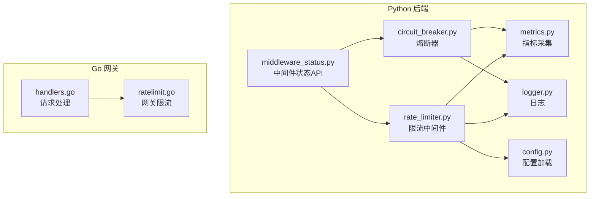
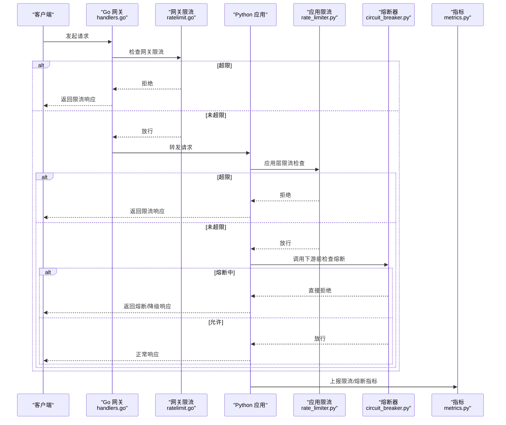
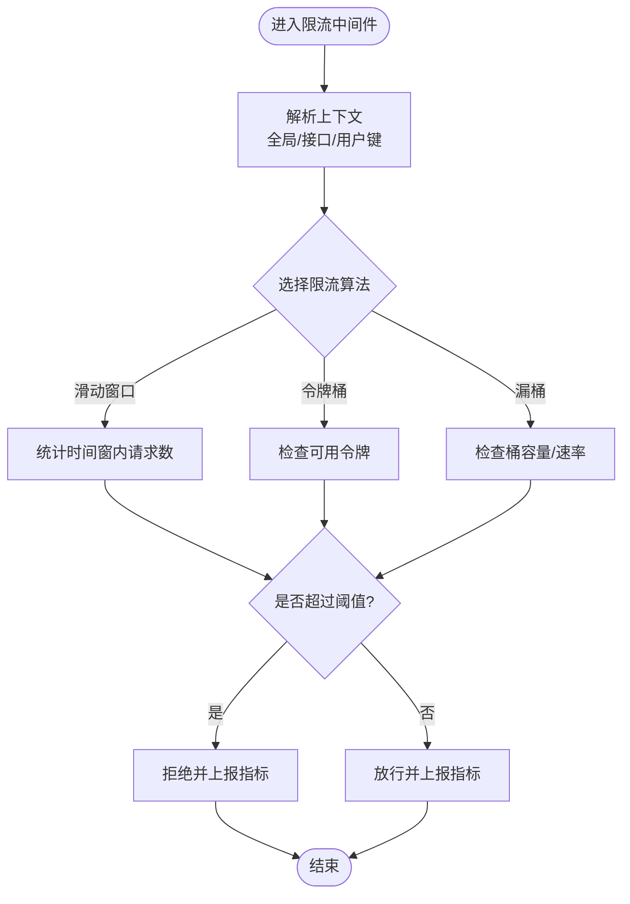
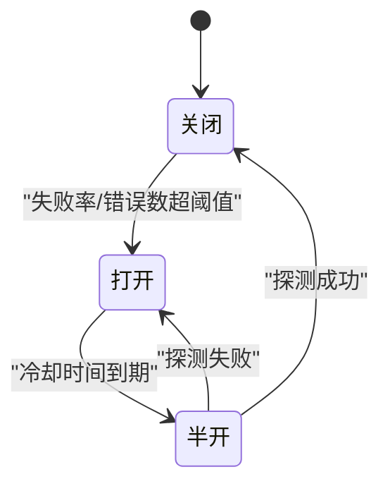
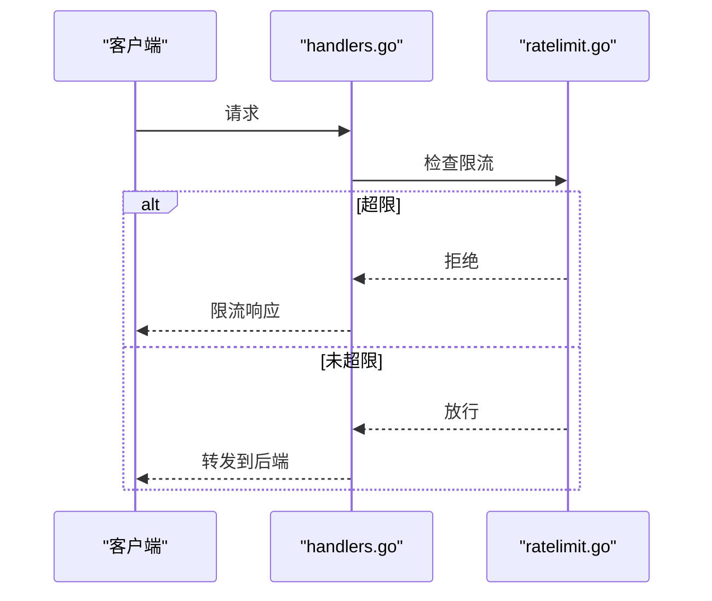
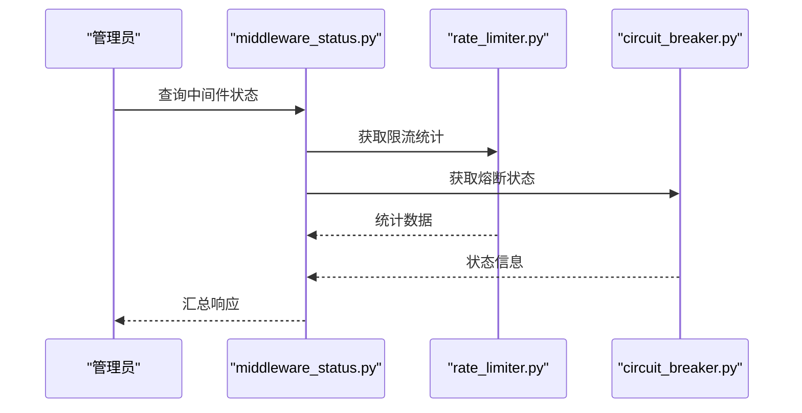
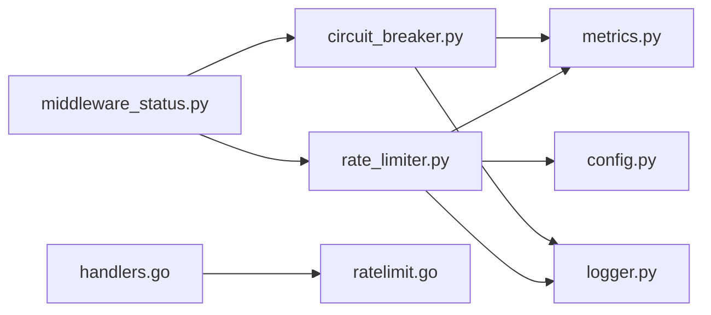

# 限流熔断中间件

<cite>
**本文引用的文件**   
- [backend_design/nexus/middleware/rate_limiter.py](file://backend_design/nexus/middleware/rate_limiter.py)
- [backend_design/nexus/core/circuit_breaker.py](file://backend_design/nexus/core/circuit_breaker.py)
- [backend_design/nexus/observability/metrics.py](file://backend_design/nexus/observability/metrics.py)
- [backend_design/nexus/api/routes/middleware_status.py](file://backend_design/nexus/api/routes/middleware_status.py)
- [backend_design/nexus_gate/internal/ratelimit/ratelimit.go](file://backend_design/nexus_gate/internal/ratelimit/ratelimit.go)
- [backend_design/nexus_gate/internal/handlers/handlers.go](file://backend_design/nexus_gate/internal/handlers/handlers.go)
- [backend_design/nexus/config.py](file://backend_design/nexus/config.py)
- [backend_design/nexus/core/logger.py](file://backend_design/nexus/core/logger.py)
</cite>

## 目录
1. [简介](#简介)
2. [项目结构](#项目结构)
3. [核心组件](#核心组件)
4. [架构总览](#架构总览)
5. [详细组件分析](#详细组件分析)
6. [依赖关系分析](#依赖关系分析)
7. [性能考虑](#性能考虑)
8. [故障排查指南](#故障排查指南)
9. [结论](#结论)
10. [附录](#附录)

## 简介
本文件面向 NexusCockpit 系统的“限流熔断中间件”，系统性阐述以下能力：
- 限流算法与策略：滑动窗口、令牌桶、漏桶等，并说明适用场景与复杂度。
- 熔断器模式：状态机设计、故障检测、半开探测与自动恢复。
- 降级策略：服务降级、缓存降级、默认响应等容错处理路径。
- 规则定义：全局限流、接口级限流、用户级限流等多粒度控制。
- 监控指标与调优建议：关键指标、观测手段与优化方向。

## 项目结构
NexusCockpit 在后端 Python 侧提供限流与熔断的核心实现，并在 Go 网关层提供高性能的分布式限流能力；同时通过可观测性模块暴露指标，并通过 API 路由暴露中间件运行状态。

图表来源
- [backend_design/nexus/middleware/rate_limiter.py](file://backend_design/nexus/middleware/rate_limiter.py)
- [backend_design/nexus/core/circuit_breaker.py](file://backend_design/nexus/core/circuit_breaker.py)
- [backend_design/nexus/observability/metrics.py](file://backend_design/nexus/observability/metrics.py)
- [backend_design/nexus/api/routes/middleware_status.py](file://backend_design/nexus/api/routes/middleware_status.py)
- [backend_design/nexus_gate/internal/ratelimit/ratelimit.go](file://backend_design/nexus_gate/internal/ratelimit/ratelimit.go)
- [backend_design/nexus_gate/internal/handlers/handlers.go](file://backend_design/nexus_gate/internal/handlers/handlers.go)
- [backend_design/nexus/config.py](file://backend_design/nexus/config.py)
- [backend_design/nexus/core/logger.py](file://backend_design/nexus/core/logger.py)

章节来源
- [backend_design/nexus/middleware/rate_limiter.py](file://backend_design/nexus/middleware/rate_limiter.py)
- [backend_design/nexus/core/circuit_breaker.py](file://backend_design/nexus/core/circuit_breaker.py)
- [backend_design/nexus/observability/metrics.py](file://backend_design/nexus/observability/metrics.py)
- [backend_design/nexus/api/routes/middleware_status.py](file://backend_design/nexus/api/routes/middleware_status.py)
- [backend_design/nexus_gate/internal/ratelimit/ratelimit.go](file://backend_design/nexus_gate/internal/ratelimit/ratelimit.go)
- [backend_design/nexus_gate/internal/handlers/handlers.go](file://backend_design/nexus_gate/internal/handlers/handlers.go)
- [backend_design/nexus/config.py](file://backend_design/nexus/config.py)
- [backend_design/nexus/core/logger.py](file://backend_design/nexus/core/logger.py)

## 核心组件
- 限流中间件（Python）：封装多种限流策略，支持按全局、接口、用户维度进行配额控制，并与指标系统对接。
- 熔断器（Python）：基于状态机的熔断保护，包含失败率/错误阈值判定、半开探测与自动恢复。
- 网关限流（Go）：在入口侧提供高吞吐的分布式限流能力，通常用于全局限流或热点接口限流。
- 指标与状态：统一采集限流与熔断相关指标，并提供中间件状态查询接口。

章节来源
- [backend_design/nexus/middleware/rate_limiter.py](file://backend_design/nexus/middleware/rate_limiter.py)
- [backend_design/nexus/core/circuit_breaker.py](file://backend_design/nexus/core/circuit_breaker.py)
- [backend_design/nexus_gate/internal/ratelimit/ratelimit.go](file://backend_design/nexus_gate/internal/ratelimit/ratelimit.go)
- [backend_design/nexus/observability/metrics.py](file://backend_design/nexus/observability/metrics.py)
- [backend_design/nexus/api/routes/middleware_status.py](file://backend_design/nexus/api/routes/middleware_status.py)

## 架构总览
整体采用“网关层 + 应用层”双层防护：
- 网关层（Go）：对进入流量进行粗粒度限流，快速拒绝超额请求，降低后端压力。
- 应用层（Python）：细粒度限流与熔断，结合业务上下文（如用户、接口）做精细化控制，并触发降级与告警。

图表来源
- [backend_design/nexus_gate/internal/handlers/handlers.go](file://backend_design/nexus_gate/internal/handlers/handlers.go)
- [backend_design/nexus_gate/internal/ratelimit/ratelimit.go](file://backend_design/nexus_gate/internal/ratelimit/ratelimit.go)
- [backend_design/nexus/middleware/rate_limiter.py](file://backend_design/nexus/middleware/rate_limiter.py)
- [backend_design/nexus/core/circuit_breaker.py](file://backend_design/nexus/core/circuit_breaker.py)
- [backend_design/nexus/observability/metrics.py](file://backend_design/nexus/observability/metrics.py)

## 详细组件分析

### 限流中间件（Python）
- 功能要点
  - 多策略支持：滑动窗口、令牌桶、漏桶等，可按需选择。
  - 多维粒度：全局限流、接口级限流、用户级限流，支持组合键（如 user_id + route）。
  - 指标上报：记录拒绝次数、通过率、延迟分布等。
  - 可配置化：从配置中心或配置文件加载策略参数。
- 典型流程
  - 解析请求上下文（全局/接口/用户标识）。
  - 计算当前时间窗内的计数或令牌/桶状态。
  - 判断是否允许通过，更新状态并上报指标。
  - 若被限流，返回标准限流响应码与消息。

图表来源
- [backend_design/nexus/middleware/rate_limiter.py](file://backend_design/nexus/middleware/rate_limiter.py)
- [backend_design/nexus/observability/metrics.py](file://backend_design/nexus/observability/metrics.py)

章节来源
- [backend_design/nexus/middleware/rate_limiter.py](file://backend_design/nexus/middleware/rate_limiter.py)
- [backend_design/nexus/observability/metrics.py](file://backend_design/nexus/observability/metrics.py)

#### 限流算法与复杂度
- 滑动窗口
  - 思路：维护固定长度时间窗内的请求计数，新请求到来时清理过期计数并判断是否超限。
  - 复杂度：O(1) 近似（使用分桶计数）或 O(N) 精确（逐条计数），空间 O(N)。
  - 适用：突发流量平滑、短时峰值控制。
- 令牌桶
  - 思路：以固定速率向桶中添加令牌，请求消耗令牌，不足则拒绝。
  - 复杂度：O(1)，空间 O(1)。
  - 适用：稳定速率限制，允许一定突发。
- 漏桶
  - 思路：以固定速率流出请求，入队超出容量的请求将被拒绝。
  - 复杂度：O(1)，空间 O(1)。
  - 适用：严格恒定速率输出，抑制突发。

章节来源
- [backend_design/nexus/middleware/rate_limiter.py](file://backend_design/nexus/middleware/rate_limiter.py)

### 熔断器（Python）
- 状态机
  - 关闭（Closed）：正常放行，统计失败率/错误数。
  - 打开（Open）：拒绝所有请求，等待冷却时间后进入半开。
  - 半开（Half-Open）：放行少量探测请求，根据结果决定恢复或继续打开。
- 故障检测
  - 基于失败率阈值、绝对错误数阈值、慢调用比例等条件触发打开。
- 自动恢复
  - 冷却时间到期后进入半开；探测成功则关闭，失败则重新打开。
- 降级联动
  - 熔断打开时可直接走降级逻辑（缓存/默认响应/空结果）。

图表来源
- [backend_design/nexus/core/circuit_breaker.py](file://backend_design/nexus/core/circuit_breaker.py)

章节来源
- [backend_design/nexus/core/circuit_breaker.py](file://backend_design/nexus/core/circuit_breaker.py)

### 网关限流（Go）
- 职责
  - 在入口侧执行高并发限流，避免将超额流量打入后端。
  - 支持全局限流与热点接口限流，常与 Redis 等外部存储配合实现分布式一致性。
- 集成点
  - 由网关处理器在转发前调用限流模块，超限直接返回。

图表来源
- [backend_design/nexus_gate/internal/handlers/handlers.go](file://backend_design/nexus_gate/internal/handlers/handlers.go)
- [backend_design/nexus_gate/internal/ratelimit/ratelimit.go](file://backend_design/nexus_gate/internal/ratelimit/ratelimit.go)

章节来源
- [backend_design/nexus_gate/internal/handlers/handlers.go](file://backend_design/nexus_gate/internal/handlers/handlers.go)
- [backend_design/nexus_gate/internal/ratelimit/ratelimit.go](file://backend_design/nexus_gate/internal/ratelimit/ratelimit.go)

### 降级策略
- 服务降级
  - 当熔断打开或下游不可用时，直接返回降级响应（如缓存数据、默认值、空列表）。
- 缓存降级
  - 优先读取本地/分布式缓存，缺失时再尝试调用下游；失败则回退到默认响应。
- 默认响应
  - 为关键接口提供兜底响应体，保证前端可用性。
- 配置项
  - 可通过配置开关不同降级策略，并按接口维度定制。

章节来源
- [backend_design/nexus/core/circuit_breaker.py](file://backend_design/nexus/core/circuit_breaker.py)
- [backend_design/nexus/config.py](file://backend_design/nexus/config.py)

### 限流规则定义与粒度
- 全局限流
  - 针对所有请求的统一上限，常用于保护系统整体稳定性。
- 接口级限流
  - 针对特定路由或资源设置独立配额，防止热点接口拖垮系统。
- 用户级限流
  - 基于用户标识（如 user_id、tenant_id）进行配额控制，保障公平性与隔离性。
- 组合键
  - 支持 user_id + route 的组合键，实现更精细的配额管理。

章节来源
- [backend_design/nexus/middleware/rate_limiter.py](file://backend_design/nexus/middleware/rate_limiter.py)

### 监控指标与状态查询
- 指标
  - 限流：拒绝次数、通过率、各策略命中率、P95/P99 延迟。
  - 熔断：状态切换次数、探测成功率、失败率、冷却时长。
- 状态查询
  - 提供中间件状态接口，便于运维查看当前限流/熔断情况。

图表来源
- [backend_design/nexus/api/routes/middleware_status.py](file://backend_design/nexus/api/routes/middleware_status.py)
- [backend_design/nexus/middleware/rate_limiter.py](file://backend_design/nexus/middleware/rate_limiter.py)
- [backend_design/nexus/core/circuit_breaker.py](file://backend_design/nexus/core/circuit_breaker.py)

章节来源
- [backend_design/nexus/observability/metrics.py](file://backend_design/nexus/observability/metrics.py)
- [backend_design/nexus/api/routes/middleware_status.py](file://backend_design/nexus/api/routes/middleware_status.py)

## 依赖关系分析
- 组件耦合
  - 限流中间件依赖指标与日志模块，必要时读取配置。
  - 熔断器依赖指标与日志，可与限流中间件协作触发降级。
  - 网关限流与处理器解耦，通过函数调用完成限流决策。
- 外部依赖
  - 网关限流可能依赖 Redis 等外部存储以实现分布式一致性。
- 潜在循环依赖
  - 限流与熔断之间通过指标与回调交互，避免直接双向依赖。

图表来源
- [backend_design/nexus/middleware/rate_limiter.py](file://backend_design/nexus/middleware/rate_limiter.py)
- [backend_design/nexus/core/circuit_breaker.py](file://backend_design/nexus/core/circuit_breaker.py)
- [backend_design/nexus/observability/metrics.py](file://backend_design/nexus/observability/metrics.py)
- [backend_design/nexus/core/logger.py](file://backend_design/nexus/core/logger.py)
- [backend_design/nexus/config.py](file://backend_design/nexus/config.py)
- [backend_design/nexus/api/routes/middleware_status.py](file://backend_design/nexus/api/routes/middleware_status.py)
- [backend_design/nexus_gate/internal/handlers/handlers.go](file://backend_design/nexus_gate/internal/handlers/handlers.go)
- [backend_design/nexus_gate/internal/ratelimit/ratelimit.go](file://backend_design/nexus_gate/internal/ratelimit/ratelimit.go)

章节来源
- [backend_design/nexus/middleware/rate_limiter.py](file://backend_design/nexus/middleware/rate_limiter.py)
- [backend_design/nexus/core/circuit_breaker.py](file://backend_design/nexus/core/circuit_breaker.py)
- [backend_design/nexus/observability/metrics.py](file://backend_design/nexus/observability/metrics.py)
- [backend_design/nexus/core/logger.py](file://backend_design/nexus/core/logger.py)
- [backend_design/nexus/config.py](file://backend_design/nexus/config.py)
- [backend_design/nexus/api/routes/middleware_status.py](file://backend_design/nexus/api/routes/middleware_status.py)
- [backend_design/nexus_gate/internal/handlers/handlers.go](file://backend_design/nexus_gate/internal/handlers/handlers.go)
- [backend_design/nexus_gate/internal/ratelimit/ratelimit.go](file://backend_design/nexus_gate/internal/ratelimit/ratelimit.go)

## 性能考虑
- 算法选择
  - 令牌桶/漏桶适合高吞吐场景，O(1) 操作开销小。
  - 滑动窗口在需要更精确的时间窗控制时使用，注意分桶数量与内存占用。
- 维度与键空间
  - 用户级与接口级组合键会增加键空间，需评估存储与访问成本。
- 指标采样
  - 对高频指标采用采样或聚合上报，避免写入放大。
- 网关与应用分层
  - 网关层承担大部分拒绝，减少应用层压力；应用层聚焦精细化控制与降级。

[本节为通用指导，不直接分析具体文件]

## 故障排查指南
- 常见问题
  - 误判限流：检查键生成逻辑与阈值配置，确认是否因热点用户/接口导致局部拥塞。
  - 熔断频繁打开：观察失败率与慢调用比例，调整阈值与冷却时间。
  - 降级未生效：确认熔断状态与降级开关配置，验证缓存命中与默认响应路径。
- 定位方法
  - 通过中间件状态接口查看实时统计。
  - 结合日志与指标，定位异常时间点与受影响范围。
  - 在网关与应用层分别开启调试日志，对比拒绝位置。

章节来源
- [backend_design/nexus/api/routes/middleware_status.py](file://backend_design/nexus/api/routes/middleware_status.py)
- [backend_design/nexus/observability/metrics.py](file://backend_design/nexus/observability/metrics.py)
- [backend_design/nexus/core/logger.py](file://backend_design/nexus/core/logger.py)

## 结论
NexusCockpit 的限流熔断中间件通过“网关层 + 应用层”的双层防护、多策略限流与状态机驱动的熔断机制，提供了高可用的流量治理方案。配合完善的指标与状态查询能力，可在复杂业务场景中实现精细化控制与快速排障。建议在上线前充分压测，合理设定阈值与降级策略，持续观测并迭代优化。

[本节为总结性内容，不直接分析具体文件]

## 附录
- 术语
  - 限流：限制单位时间内请求数量或速率。
  - 熔断：在检测到故障时快速失败，避免雪崩。
  - 降级：在异常情况下返回简化或缓存结果，保障基本可用性。
- 最佳实践
  - 先网关后应用：网关层拦截大流量，应用层做精细化控制。
  - 渐进式放开：逐步放宽阈值，观察指标变化。
  - 灰度发布：对新策略在小流量下验证，再全量推广。

[本节为概念性内容，不直接分析具体文件]