# 中间件和服务

<cite>
**本文引用的文件**   
- [backend_design/nexus/middleware/rate_limiter.py](file://backend_design/nexus/middleware/rate_limiter.py)
- [backend_design/nexus/middleware/redis_cache.py](file://backend_design/nexus/middleware/redis_cache.py)
- [backend_design/nexus/middleware/session_store.py](file://backend_design/nexus/middleware/session_store.py)
- [backend_design/nexus/middleware/task_queue.py](file://backend_design/nexus/middleware/task_queue.py)
- [backend_design/nexus/core/auth.py](file://backend_design/nexus/core/auth.py)
- [backend_design/nexus/core/db_manager.py](file://backend_design/nexus/core/db_manager.py)
- [backend_design/nexus/core/oss.py](file://backend_design/nexus/core/oss.py)
- [backend_design/nexus/config.py](file://backend_design/nexus/config.py)
- [backend_design/nexus/main.py](file://backend_design/nexus/main.py)
- [backend_design/nexus/api/routes/auth.py](file://backend_design/nexus/api/routes/auth.py)
- [backend_design/nexus/api/routes/chat_sessions.py](file://backend_design/nexus/api/routes/chat_sessions.py)
- [backend_design/nexus/api/routes/middleware_status.py](file://backend_design/nexus/api/routes/middleware_status.py)
</cite>

## 目录
1. [简介](#简介)
2. [项目结构](#项目结构)
3. [核心组件](#核心组件)
4. [架构总览](#架构总览)
5. [详细组件分析](#详细组件分析)
6. [依赖关系分析](#依赖关系分析)
7. [性能考虑](#性能考虑)
8. [故障排除指南](#故障排除指南)
9. [结论](#结论)
10. [附录](#附录)

## 简介
本章节面向 NexusCockpit 的中间件与服务层，聚焦以下能力：
- 限流中间件：基于 Redis 的全局与用户维度速率控制
- 缓存服务：Redis 键值缓存，支持 TTL、命名空间与序列化
- 会话管理：基于 Redis 的会话存储与清理策略
- 任务队列：异步任务调度与执行（可扩展）
- 认证授权：JWT 鉴权流程与权限校验
- 数据库连接管理：连接池、健康检查与错误处理
- 对象存储服务：统一 S3/OSS 客户端封装
- 配置项、性能调优与故障排除
- 中间件执行顺序与依赖关系
- 自定义中间件扩展指南与最佳实践

## 项目结构
NexusCockpit 后端采用分层组织方式：
- API 路由层：负责 HTTP/WebSocket 请求接入与路由分发
- 中间件层：横切关注点（限流、缓存、会话、任务等）
- 核心服务层：认证、数据库、对象存储、可观测性等
- 配置中心：集中化配置加载与校验

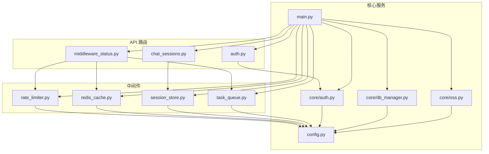

图表来源
- [backend_design/nexus/main.py](file://backend_design/nexus/main.py)
- [backend_design/nexus/api/routes/auth.py](file://backend_design/nexus/api/routes/auth.py)
- [backend_design/nexus/api/routes/chat_sessions.py](file://backend_design/nexus/api/routes/chat_sessions.py)
- [backend_design/nexus/api/routes/middleware_status.py](file://backend_design/nexus/api/routes/middleware_status.py)
- [backend_design/nexus/middleware/rate_limiter.py](file://backend_design/nexus/middleware/rate_limiter.py)
- [backend_design/nexus/middleware/redis_cache.py](file://backend_design/nexus/middleware/redis_cache.py)
- [backend_design/nexus/middleware/session_store.py](file://backend_design/nexus/middleware/session_store.py)
- [backend_design/nexus/middleware/task_queue.py](file://backend_design/nexus/middleware/task_queue.py)
- [backend_design/nexus/core/auth.py](file://backend_design/nexus/core/auth.py)
- [backend_design/nexus/core/db_manager.py](file://backend_design/nexus/core/db_manager.py)
- [backend_design/nexus/core/oss.py](file://backend_design/nexus/core/oss.py)
- [backend_design/nexus/config.py](file://backend_design/nexus/config.py)

章节来源
- [backend_design/nexus/main.py](file://backend_design/nexus/main.py)
- [backend_design/nexus/config.py](file://backend_design/nexus/config.py)

## 核心组件
本节概述各中间件与服务的关键职责与交互。

- 限流中间件
  - 功能：按全局或用户维度限制请求频率；支持滑动窗口/固定窗口策略；失败快速返回
  - 依赖：Redis、配置中心
  - 典型使用：在路由注册时挂载到特定路径或全局

- 缓存服务
  - 功能：通用键值缓存；支持 TTL、命名空间、序列化；读写穿透保护
  - 依赖：Redis、配置中心

- 会话管理
  - 功能：会话创建、读取、更新、过期清理；支持多端与会话迁移
  - 依赖：Redis、配置中心

- 任务队列
  - 功能：任务入队、出队、重试、死信队列；可扩展消费者
  - 依赖：Redis 或消息中间件、配置中心

- 认证授权
  - 功能：登录签发 JWT、令牌校验、权限校验、刷新令牌
  - 依赖：配置中心、可选数据库/缓存

- 数据库连接管理
  - 功能：连接池初始化、健康检查、事务与错误处理
  - 依赖：配置中心、数据库驱动

- 对象存储服务
  - 功能：上传、下载、删除、预签名 URL；桶/前缀管理
  - 依赖：配置中心、S3/OSS SDK

章节来源
- [backend_design/nexus/middleware/rate_limiter.py](file://backend_design/nexus/middleware/rate_limiter.py)
- [backend_design/nexus/middleware/redis_cache.py](file://backend_design/nexus/middleware/redis_cache.py)
- [backend_design/nexus/middleware/session_store.py](file://backend_design/nexus/middleware/session_store.py)
- [backend_design/nexus/middleware/task_queue.py](file://backend_design/nexus/middleware/task_queue.py)
- [backend_design/nexus/core/auth.py](file://backend_design/nexus/core/auth.py)
- [backend_design/nexus/core/db_manager.py](file://backend_design/nexus/core/db_manager.py)
- [backend_design/nexus/core/oss.py](file://backend_design/nexus/core/oss.py)
- [backend_design/nexus/config.py](file://backend_design/nexus/config.py)

## 架构总览
下图展示请求从入口到中间件再到业务处理的典型链路，以及关键外部依赖。

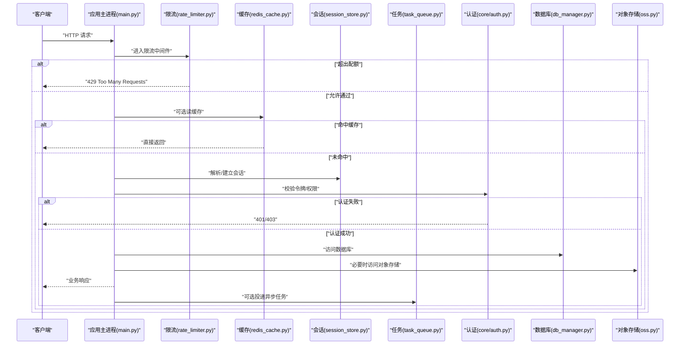

图表来源
- [backend_design/nexus/main.py](file://backend_design/nexus/main.py)
- [backend_design/nexus/middleware/rate_limiter.py](file://backend_design/nexus/middleware/rate_limiter.py)
- [backend_design/nexus/middleware/redis_cache.py](file://backend_design/nexus/middleware/redis_cache.py)
- [backend_design/nexus/middleware/session_store.py](file://backend_design/nexus/middleware/session_store.py)
- [backend_design/nexus/middleware/task_queue.py](file://backend_design/nexus/middleware/task_queue.py)
- [backend_design/nexus/core/auth.py](file://backend_design/nexus/core/auth.py)
- [backend_design/nexus/core/db_manager.py](file://backend_design/nexus/core/db_manager.py)
- [backend_design/nexus/core/oss.py](file://backend_design/nexus/core/oss.py)

## 详细组件分析

### 限流中间件
- 设计要点
  - 维度：全局、用户/IP/接口级别
  - 算法：固定窗口/滑动窗口（依据实现选择）
  - 状态存储：Redis 原子计数与过期时间
  - 行为：超限返回 429；正常放行并记录指标
- 配置项（示例字段，具体以实现为准）
  - 启用开关、默认 QPS、每用户上限、窗口大小、Redis 连接参数
- 集成方式
  - 在路由注册阶段挂载；可按路径前缀或正则匹配
- 性能与容量
  - 建议开启批量写入与管道操作；合理设置 TTL 避免内存膨胀
- 故障模式
  - Redis 不可用：降级为本地内存限流或直接放行（需权衡）
  - 时钟漂移：使用 Redis 时间戳而非系统时间

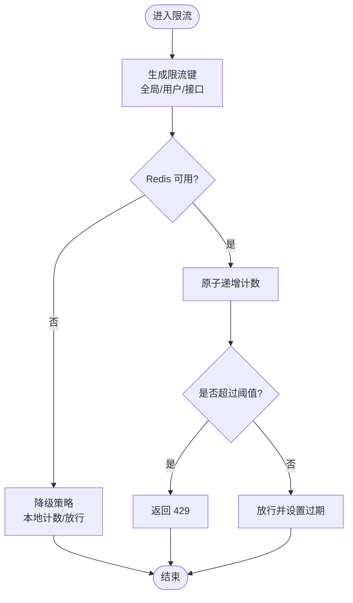

图表来源
- [backend_design/nexus/middleware/rate_limiter.py](file://backend_design/nexus/middleware/rate_limiter.py)
- [backend_design/nexus/config.py](file://backend_design/nexus/config.py)

章节来源
- [backend_design/nexus/middleware/rate_limiter.py](file://backend_design/nexus/middleware/rate_limiter.py)
- [backend_design/nexus/config.py](file://backend_design/nexus/config.py)

### 缓存服务
- 设计要点
  - 命名空间：按模块/租户隔离
  - 序列化：JSON/MessagePack 等
  - 一致性：先删后写或双写策略（根据场景）
  - 失效：TTL + 主动失效
- 配置项
  - Redis 地址、密码、库号、连接池大小、默认 TTL、序列化器
- 使用建议
  - 热点数据优先；大对象分片；避免缓存穿透（布隆过滤器/空值缓存）
- 监控
  - 命中率、延迟、错误率、内存占用

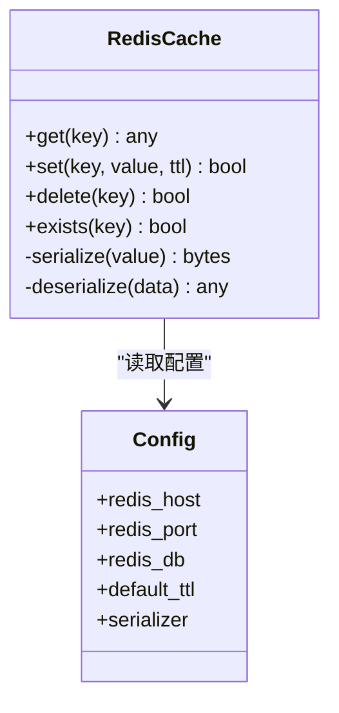

图表来源
- [backend_design/nexus/middleware/redis_cache.py](file://backend_design/nexus/middleware/redis_cache.py)
- [backend_design/nexus/config.py](file://backend_design/nexus/config.py)

章节来源
- [backend_design/nexus/middleware/redis_cache.py](file://backend_design/nexus/middleware/redis_cache.py)
- [backend_design/nexus/config.py](file://backend_design/nexus/config.py)

### 会话管理
- 设计要点
  - 存储：Redis Hash/List 结构
  - 生命周期：创建、续期、销毁、定期清理
  - 并发：单端互斥或多端并行（可配置）
- 配置项
  - 会话 TTL、最大长度、清理周期、加密开关
- 安全
  - 敏感字段加密；防重放；绑定设备指纹（可选）

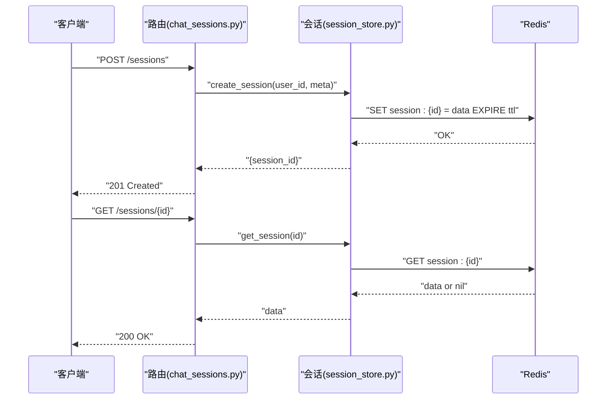

图表来源
- [backend_design/nexus/api/routes/chat_sessions.py](file://backend_design/nexus/api/routes/chat_sessions.py)
- [backend_design/nexus/middleware/session_store.py](file://backend_design/nexus/middleware/session_store.py)
- [backend_design/nexus/config.py](file://backend_design/nexus/config.py)

章节来源
- [backend_design/nexus/api/routes/chat_sessions.py](file://backend_design/nexus/api/routes/chat_sessions.py)
- [backend_design/nexus/middleware/session_store.py](file://backend_design/nexus/middleware/session_store.py)
- [backend_design/nexus/config.py](file://backend_design/nexus/config.py)

### 任务队列
- 设计要点
  - 模型：生产者/消费者/重试/死信
  - 持久化：Redis List/ZSet 或外部 MQ
  - 幂等：任务 ID 去重；消费端幂等处理
- 配置项
  - 队列名、并发度、重试次数、退避策略、超时
- 监控
  - 积压量、消费速率、失败率、平均耗时

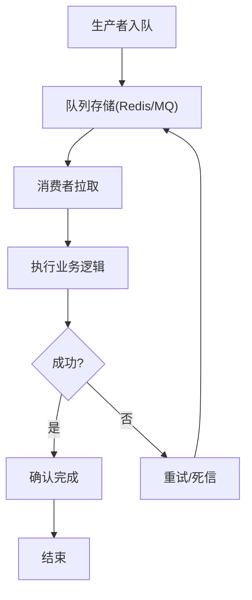

图表来源
- [backend_design/nexus/middleware/task_queue.py](file://backend_design/nexus/middleware/task_queue.py)
- [backend_design/nexus/config.py](file://backend_design/nexus/config.py)

章节来源
- [backend_design/nexus/middleware/task_queue.py](file://backend_design/nexus/middleware/task_queue.py)
- [backend_design/nexus/config.py](file://backend_design/nexus/config.py)

### 认证授权
- 设计要点
  - 登录：校验凭据，签发 JWT（含角色/权限），设置过期
  - 鉴权：中间件校验签名、有效期、权限范围
  - 刷新：短效访问令牌 + 长效刷新令牌
- 配置项
  - 密钥、算法、过期时间、刷新策略、黑名单（可选）
- 安全
  - 最小权限原则；敏感信息不落盘；审计日志

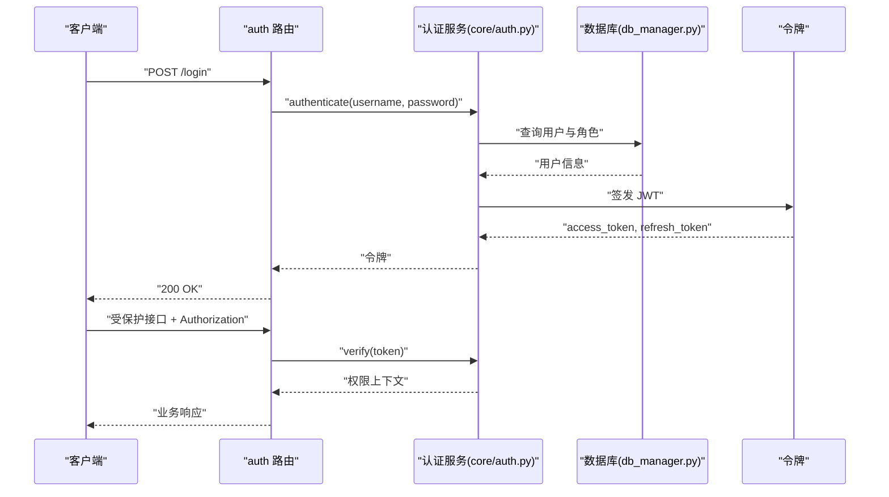

图表来源
- [backend_design/nexus/api/routes/auth.py](file://backend_design/nexus/api/routes/auth.py)
- [backend_design/nexus/core/auth.py](file://backend_design/nexus/core/auth.py)
- [backend_design/nexus/core/db_manager.py](file://backend_design/nexus/core/db_manager.py)
- [backend_design/nexus/config.py](file://backend_design/nexus/config.py)

章节来源
- [backend_design/nexus/api/routes/auth.py](file://backend_design/nexus/api/routes/auth.py)
- [backend_design/nexus/core/auth.py](file://backend_design/nexus/core/auth.py)
- [backend_design/nexus/core/db_manager.py](file://backend_design/nexus/core/db_manager.py)
- [backend_design/nexus/config.py](file://backend_design/nexus/config.py)

### 数据库连接管理
- 设计要点
  - 连接池：最大连接数、空闲回收、超时
  - 健康检查：周期性探测、自动恢复
  - 错误处理：重试、熔断、降级
- 配置项
  - DSN、池大小、超时、SSL、重试策略
- 监控
  - 活跃连接、等待队列、慢查询、错误率

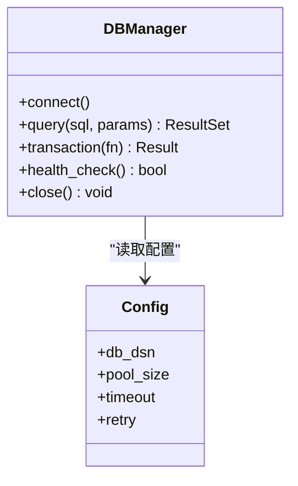

图表来源
- [backend_design/nexus/core/db_manager.py](file://backend_design/nexus/core/db_manager.py)
- [backend_design/nexus/config.py](file://backend_design/nexus/config.py)

章节来源
- [backend_design/nexus/core/db_manager.py](file://backend_design/nexus/core/db_manager.py)
- [backend_design/nexus/config.py](file://backend_design/nexus/config.py)

### 对象存储服务
- 设计要点
  - 抽象：统一上传/下载/删除/预签名接口
  - 兼容：S3/OSS 等多后端
  - 安全：最小权限、白名单域名、防盗链
- 配置项
  - 端点、AK/SK、桶名、区域、CDN 域名
- 监控
  - IOPS、带宽、错误码分布、延迟

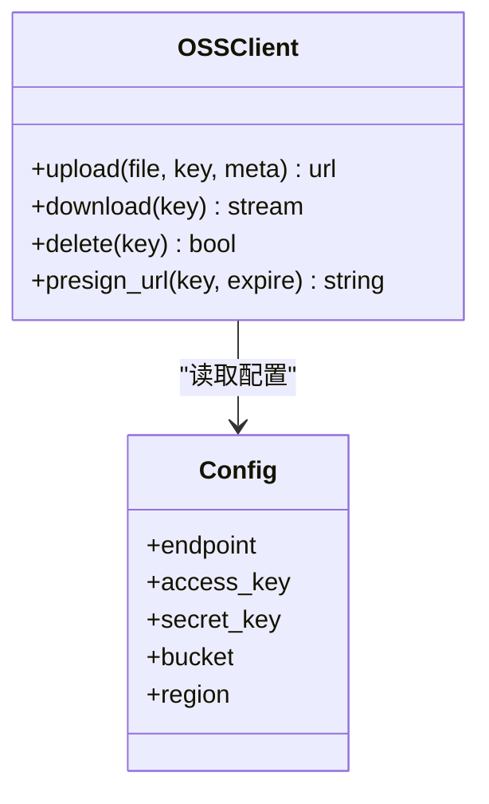

图表来源
- [backend_design/nexus/core/oss.py](file://backend_design/nexus/core/oss.py)
- [backend_design/nexus/config.py](file://backend_design/nexus/config.py)

章节来源
- [backend_design/nexus/core/oss.py](file://backend_design/nexus/core/oss.py)
- [backend_design/nexus/config.py](file://backend_design/nexus/config.py)

## 依赖关系分析
- 中间件对配置的强依赖：所有中间件均从配置中心获取运行时参数
- 中间件对外部依赖：Redis（限流/缓存/会话）、数据库（认证/业务）、对象存储（文件）
- 路由与中间件耦合：通过应用启动阶段注入中间件栈

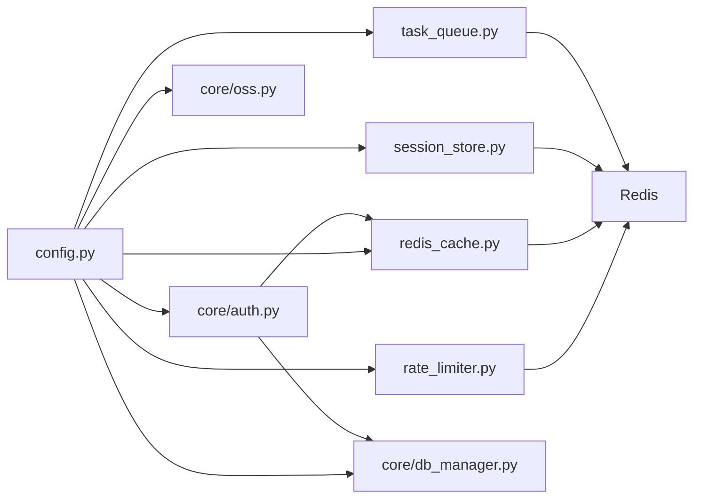

图表来源
- [backend_design/nexus/config.py](file://backend_design/nexus/config.py)
- [backend_design/nexus/middleware/rate_limiter.py](file://backend_design/nexus/middleware/rate_limiter.py)
- [backend_design/nexus/middleware/redis_cache.py](file://backend_design/nexus/middleware/redis_cache.py)
- [backend_design/nexus/middleware/session_store.py](file://backend_design/nexus/middleware/session_store.py)
- [backend_design/nexus/middleware/task_queue.py](file://backend_design/nexus/middleware/task_queue.py)
- [backend_design/nexus/core/auth.py](file://backend_design/nexus/core/auth.py)
- [backend_design/nexus/core/db_manager.py](file://backend_design/nexus/core/db_manager.py)
- [backend_design/nexus/core/oss.py](file://backend_design/nexus/core/oss.py)

章节来源
- [backend_design/nexus/config.py](file://backend_design/nexus/config.py)
- [backend_design/nexus/main.py](file://backend_design/nexus/main.py)

## 性能考虑
- 限流
  - 使用原子操作与管道减少网络往返；合理设置窗口与阈值
  - 热点用户单独限速，避免误伤
- 缓存
  - 提高命中率；冷热分离；大对象分片；避免缓存雪崩（随机 TTL）
- 会话
  - 压缩元数据；定期清理；跨节点共享会话
- 任务队列
  - 批处理消费；指数退避；死信告警；背压控制
- 数据库
  - 连接池大小与负载匹配；索引优化；慢查询治理
- 对象存储
  - 分片上传；CDN 加速；预签名直传

[本节为通用指导，不直接分析具体文件]

## 故障排除指南
- 限流异常
  - 现象：大量 429；Redis 连接失败
  - 排查：检查 Redis 连通性、限流键冲突、阈值配置
- 缓存问题
  - 现象：命中率低、脏数据
  - 排查：TTL 设置、序列化兼容性、并发更新策略
- 会话丢失
  - 现象：频繁掉线、无法续期
  - 排查：TTL 过短、清理任务未运行、跨域 Cookie 配置
- 任务堆积
  - 现象：积压增长、消费失败
  - 排查：消费者崩溃、重试风暴、死信队列溢出
- 认证失败
  - 现象：401/403 频发
  - 排查：密钥不一致、时钟偏差、权限不足、黑名单
- 数据库连接耗尽
  - 现象：超时、连接池打满
  - 排查：长事务、泄漏、池大小不足、慢查询
- 对象存储错误
  - 现象：上传失败、403/404
  - 排查：AK/SK、桶权限、网络 ACL、域名解析

章节来源
- [backend_design/nexus/api/routes/middleware_status.py](file://backend_design/nexus/api/routes/middleware_status.py)
- [backend_design/nexus/core/auth.py](file://backend_design/nexus/core/auth.py)
- [backend_design/nexus/core/db_manager.py](file://backend_design/nexus/core/db_manager.py)
- [backend_design/nexus/core/oss.py](file://backend_design/nexus/core/oss.py)
- [backend_design/nexus/middleware/rate_limiter.py](file://backend_design/nexus/middleware/rate_limiter.py)
- [backend_design/nexus/middleware/redis_cache.py](file://backend_design/nexus/middleware/redis_cache.py)
- [backend_design/nexus/middleware/session_store.py](file://backend_design/nexus/middleware/session_store.py)
- [backend_design/nexus/middleware/task_queue.py](file://backend_design/nexus/middleware/task_queue.py)

## 结论
NexusCockpit 的中间件与服务层围绕“高可用、可扩展、可观测”的目标构建：
- 通过限流、缓存、会话与任务队列提升吞吐与稳定性
- 借助认证授权与连接管理保障安全与资源可控
- 对象存储抽象简化多后端切换
- 统一的配置中心与监控指标支撑运维与排障

[本节为总结性内容，不直接分析具体文件]

## 附录

### 中间件执行顺序与依赖关系
- 推荐顺序
  1) 限流 → 2) 缓存(读) → 3) 会话解析 → 4) 认证授权 → 5) 业务处理 → 6) 缓存(写) → 7) 任务投递
- 依赖关系
  - 限流/缓存/会话/任务依赖 Redis
  - 认证依赖数据库与缓存
  - 对象存储独立于上述中间件

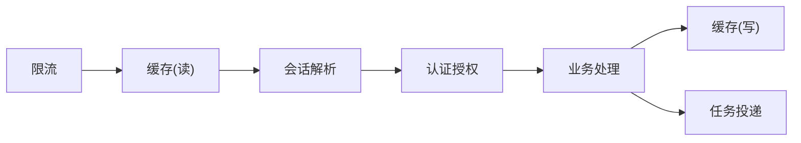

图表来源
- [backend_design/nexus/main.py](file://backend_design/nexus/main.py)
- [backend_design/nexus/middleware/rate_limiter.py](file://backend_design/nexus/middleware/rate_limiter.py)
- [backend_design/nexus/middleware/redis_cache.py](file://backend_design/nexus/middleware/redis_cache.py)
- [backend_design/nexus/middleware/session_store.py](file://backend_design/nexus/middleware/session_store.py)
- [backend_design/nexus/middleware/task_queue.py](file://backend_design/nexus/middleware/task_queue.py)
- [backend_design/nexus/core/auth.py](file://backend_design/nexus/core/auth.py)

### 自定义中间件扩展指南
- 步骤
  1) 定义中间件类/函数：接收请求上下文，返回处理结果或短路响应
  2) 注入配置：从配置中心读取参数
  3) 注册到应用：在启动阶段将中间件加入栈
  4) 暴露监控：记录指标与日志
- 最佳实践
  - 幂等与容错：外部依赖失败时快速失败或降级
  - 可观测：埋点、追踪、指标上报
  - 可测试：提供单元测试与集成测试用例
  - 文档化：说明配置项、行为与边界条件

章节来源
- [backend_design/nexus/main.py](file://backend_design/nexus/main.py)
- [backend_design/nexus/config.py](file://backend_design/nexus/config.py)