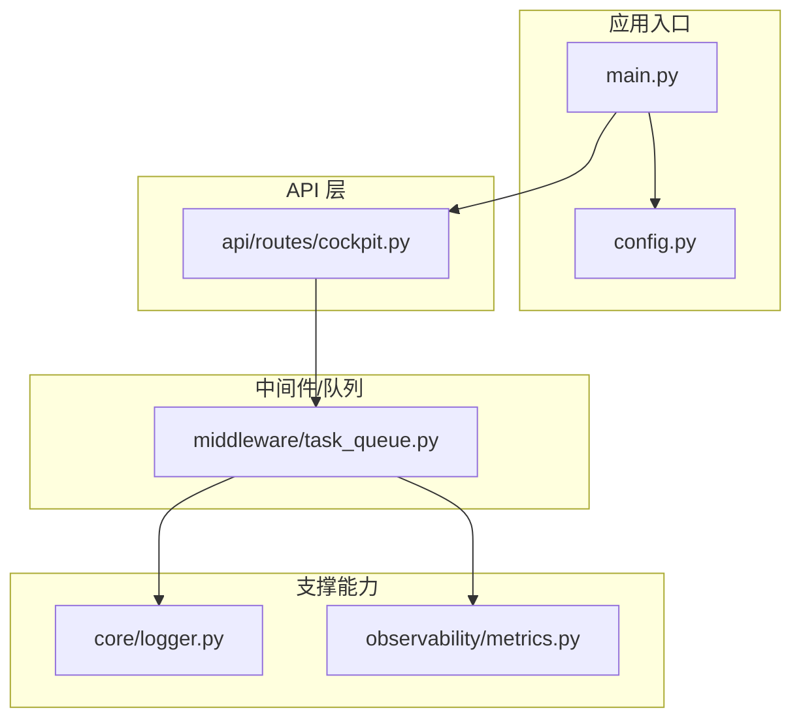
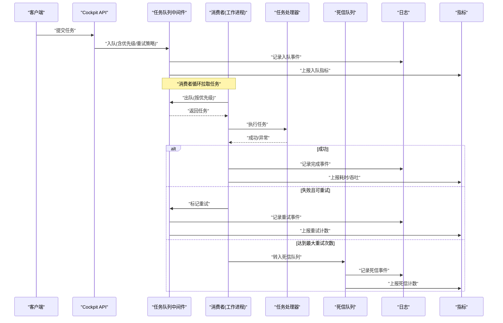
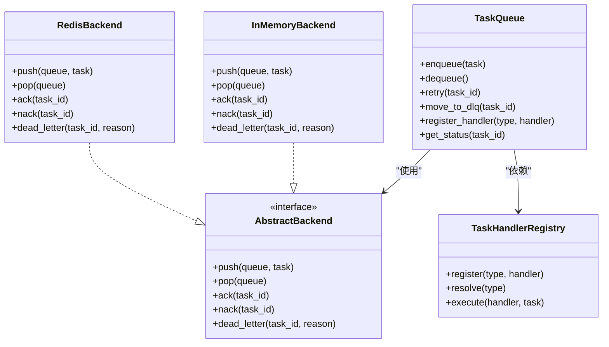
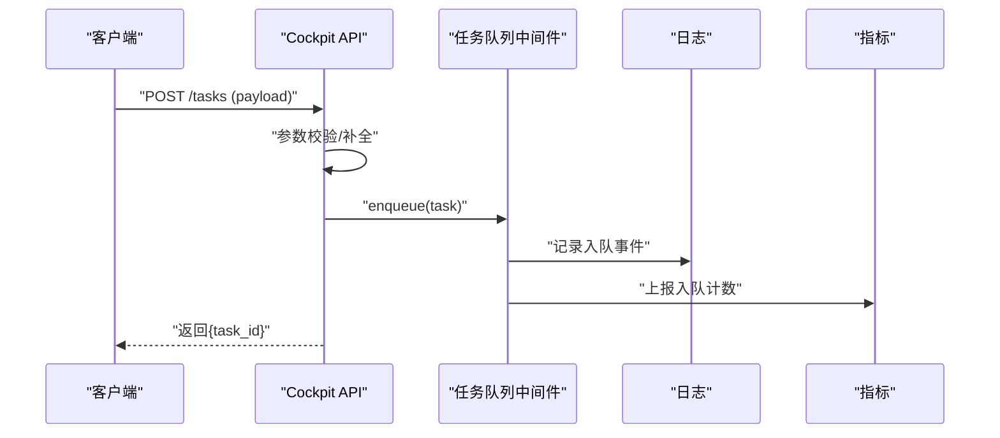
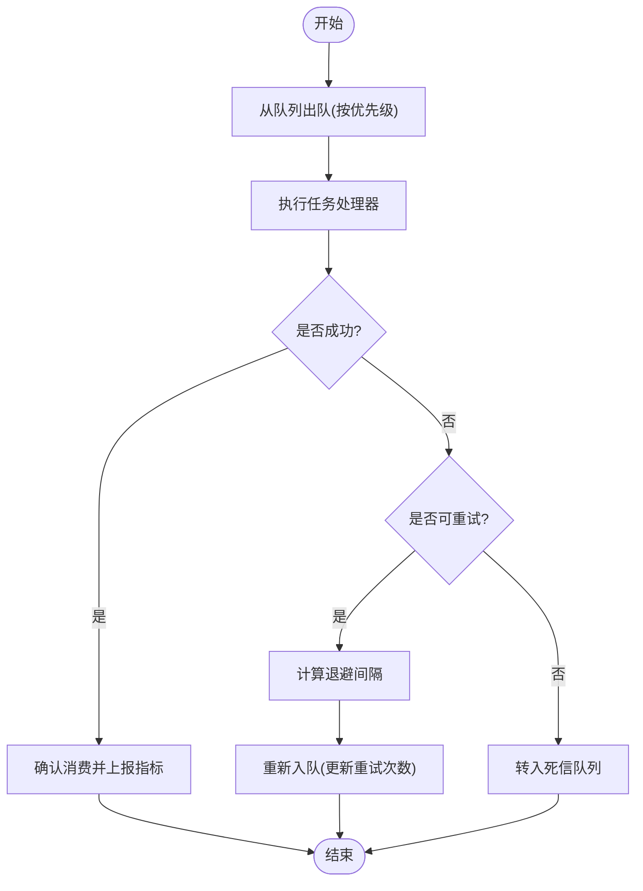
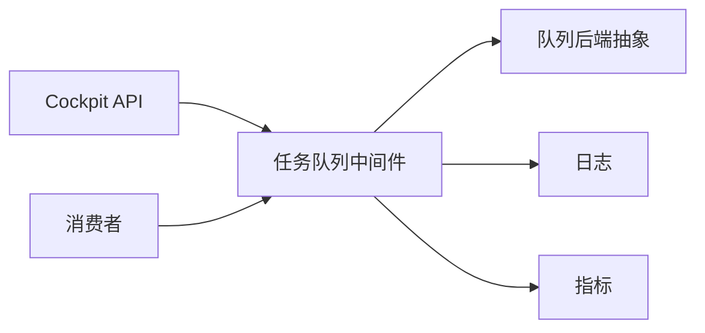

# 任务队列

<cite>
**本文引用的文件**   
- [backend_design/nexus/middleware/task_queue.py](file://backend_design/nexus/middleware/task_queue.py)
- [backend_design/nexus/api/routes/cockpit.py](file://backend_design/nexus/api/routes/cockpit.py)
- [backend_design/nexus/core/logger.py](file://backend_design/nexus/core/logger.py)
- [backend_design/nexus/observability/metrics.py](file://backend_design/nexus/observability/metrics.py)
- [backend_design/nexus/config.py](file://backend_design/nexus/config.py)
- [backend_design/nexus/main.py](file://backend_design/nexus/main.py)
</cite>

## 目录
1. [简介](#简介)
2. [项目结构](#项目结构)
3. [核心组件](#核心组件)
4. [架构总览](#架构总览)
5. [详细组件分析](#详细组件分析)
6. [依赖关系分析](#依赖关系分析)
7. [性能考量](#性能考量)
8. [故障排查指南](#故障排查指南)
9. [结论](#结论)
10. [附录](#附录)

## 简介
本技术文档聚焦于 NexusCockpit 的任务队列服务，围绕异步任务处理架构展开，涵盖任务调度、优先级管理、失败重试与死信队列机制；说明生产者-消费者模式实现与负载均衡策略；并给出任务监控、日志记录与性能指标收集的实现要点。同时提供自定义任务处理器与扩展队列后端的开发指南，帮助开发者快速接入与扩展。

## 项目结构
任务队列相关代码位于后端中间件层，并通过 API 路由暴露任务提交接口，结合配置、日志与可观测性模块形成完整链路。

图表来源
- [backend_design/nexus/main.py](file://backend_design/nexus/main.py)
- [backend_design/nexus/config.py](file://backend_design/nexus/config.py)
- [backend_design/nexus/api/routes/cockpit.py](file://backend_design/nexus/api/routes/cockpit.py)
- [backend_design/nexus/middleware/task_queue.py](file://backend_design/nexus/middleware/task_queue.py)
- [backend_design/nexus/core/logger.py](file://backend_design/nexus/core/logger.py)
- [backend_design/nexus/observability/metrics.py](file://backend_design/nexus/observability/metrics.py)

章节来源
- [backend_design/nexus/main.py](file://backend_design/nexus/main.py)
- [backend_design/nexus/config.py](file://backend_design/nexus/config.py)
- [backend_design/nexus/api/routes/cockpit.py](file://backend_design/nexus/api/routes/cockpit.py)
- [backend_design/nexus/middleware/task_queue.py](file://backend_design/nexus/middleware/task_queue.py)
- [backend_design/nexus/core/logger.py](file://backend_design/nexus/core/logger.py)
- [backend_design/nexus/observability/metrics.py](file://backend_design/nexus/observability/metrics.py)

## 核心组件
- 任务队列中间件：封装任务入队、出队、执行、重试、死信等核心流程，并提供可扩展的处理器注册与后端抽象。
- API 路由：提供任务提交接口，将外部请求转换为内部任务对象并投递到队列。
- 日志系统：统一结构化日志输出，便于追踪任务生命周期。
- 指标采集：对关键路径（入队、出队、执行耗时、失败率等）进行埋点统计。
- 配置中心：集中管理队列后端、并发度、重试策略、死信策略等参数。

章节来源
- [backend_design/nexus/middleware/task_queue.py](file://backend_design/nexus/middleware/task_queue.py)
- [backend_design/nexus/api/routes/cockpit.py](file://backend_design/nexus/api/routes/cockpit.py)
- [backend_design/nexus/core/logger.py](file://backend_design/nexus/core/logger.py)
- [backend_design/nexus/observability/metrics.py](file://backend_design/nexus/observability/metrics.py)
- [backend_design/nexus/config.py](file://backend_design/nexus/config.py)

## 架构总览
任务队列采用“生产者-消费者”模型：API 作为生产者将任务持久化或暂存至队列后端；消费者从队列拉取任务并按优先级调度执行；失败任务按策略重试，最终进入死信队列以便人工干预与审计。

图表来源
- [backend_design/nexus/api/routes/cockpit.py](file://backend_design/nexus/api/routes/cockpit.py)
- [backend_design/nexus/middleware/task_queue.py](file://backend_design/nexus/middleware/task_queue.py)
- [backend_design/nexus/core/logger.py](file://backend_design/nexus/core/logger.py)
- [backend_design/nexus/observability/metrics.py](file://backend_design/nexus/observability/metrics.py)

## 详细组件分析

### 任务队列中间件
- 职责
  - 定义任务模型与状态机（待处理、进行中、成功、失败、重试中、死信）。
  - 提供入队/出队/重试/转移死信等原子操作。
  - 支持优先级队列与多队列路由。
  - 暴露处理器注册表，支持动态加载自定义任务处理器。
  - 集成日志与指标埋点。
- 设计要点
  - 通过抽象接口隔离具体队列后端（如内存、Redis、消息队列），便于替换与横向扩展。
  - 消费者侧实现负载均衡：轮询/加权/亲和路由等策略可选。
  - 幂等性保障：任务携带唯一 ID，避免重复消费。
  - 超时控制：为任务设置执行超时，防止长尾阻塞。
- 扩展点
  - 新增处理器：在注册表中声明类型与处理函数。
  - 新增后端：实现抽象接口的入队/出队/重试/死信方法。
  - 自定义策略：实现优先级计算、重试退避、路由选择等策略。

图表来源
- [backend_design/nexus/middleware/task_queue.py](file://backend_design/nexus/middleware/task_queue.py)

章节来源
- [backend_design/nexus/middleware/task_queue.py](file://backend_design/nexus/middleware/task_queue.py)

### API 路由（任务提交）
- 职责
  - 接收外部任务提交请求，校验参数并构造任务对象。
  - 调用队列中间件入队，返回任务 ID 供后续查询。
- 关键点
  - 参数校验与默认值填充（如优先级、重试策略）。
  - 生成全局唯一任务 ID，确保幂等。
  - 记录入队日志与指标。

图表来源
- [backend_design/nexus/api/routes/cockpit.py](file://backend_design/nexus/api/routes/cockpit.py)
- [backend_design/nexus/middleware/task_queue.py](file://backend_design/nexus/middleware/task_queue.py)
- [backend_design/nexus/core/logger.py](file://backend_design/nexus/core/logger.py)
- [backend_design/nexus/observability/metrics.py](file://backend_design/nexus/observability/metrics.py)

章节来源
- [backend_design/nexus/api/routes/cockpit.py](file://backend_design/nexus/api/routes/cockpit.py)

### 消费者与调度器
- 职责
  - 持续从队列拉取任务，按优先级排序执行。
  - 捕获异常，根据策略决定重试或转入死信。
  - 上报执行耗时、成功率、失败率等指标。
- 调度策略
  - 优先级：数值越小优先级越高，或基于时间衰减的动态优先级。
  - 公平性：避免低优先级任务饥饿，可采用比例配额或时间片轮转。
  - 亲和性：同一租户/同类型任务尽量在同一消费者实例处理，提升缓存命中率。

图表来源
- [backend_design/nexus/middleware/task_queue.py](file://backend_design/nexus/middleware/task_queue.py)
- [backend_design/nexus/observability/metrics.py](file://backend_design/nexus/observability/metrics.py)

章节来源
- [backend_design/nexus/middleware/task_queue.py](file://backend_design/nexus/middleware/task_queue.py)
- [backend_design/nexus/observability/metrics.py](file://backend_design/nexus/observability/metrics.py)

### 日志与可观测性
- 日志
  - 统一结构化日志字段：任务 ID、类型、优先级、状态、耗时、错误码等。
  - 关键节点埋点：入队、出队、执行开始/结束、重试、死信。
- 指标
  - 计数器：入队数、出队数、成功数、失败数、重试数、死信数。
  - 直方图：任务执行耗时分布。
  - 标签维度：任务类型、队列名、消费者实例、错误类型。

章节来源
- [backend_design/nexus/core/logger.py](file://backend_design/nexus/core/logger.py)
- [backend_design/nexus/observability/metrics.py](file://backend_design/nexus/observability/metrics.py)

### 配置与环境
- 关键配置项
  - 队列后端类型（内存/Redis/其他）。
  - 消费者并发度与拉取频率。
  - 重试策略（最大重试次数、退避算法、初始延迟）。
  - 死信策略（保留时长、告警阈值）。
  - 优先级策略（静态权重/动态衰减）。
- 运行时生效
  - 支持热更新部分配置（如并发度、拉取频率），无需重启。

章节来源
- [backend_design/nexus/config.py](file://backend_design/nexus/config.py)

## 依赖关系分析
- 组件耦合
  - API 仅依赖队列中间件的入队接口，保持松耦合。
  - 消费者依赖队列中间件的出队/重试/死信接口，屏蔽后端差异。
  - 日志与指标作为横切关注点，被各组件按需调用。
- 外部依赖
  - 队列后端（内存/Redis/消息队列）通过抽象接口解耦。
  - 配置中心提供运行时参数注入。

图表来源
- [backend_design/nexus/api/routes/cockpit.py](file://backend_design/nexus/api/routes/cockpit.py)
- [backend_design/nexus/middleware/task_queue.py](file://backend_design/nexus/middleware/task_queue.py)
- [backend_design/nexus/core/logger.py](file://backend_design/nexus/core/logger.py)
- [backend_design/nexus/observability/metrics.py](file://backend_design/nexus/observability/metrics.py)

章节来源
- [backend_design/nexus/api/routes/cockpit.py](file://backend_design/nexus/api/routes/cockpit.py)
- [backend_design/nexus/middleware/task_queue.py](file://backend_design/nexus/middleware/task_queue.py)
- [backend_design/nexus/core/logger.py](file://backend_design/nexus/core/logger.py)
- [backend_design/nexus/observability/metrics.py](file://backend_design/nexus/observability/metrics.py)

## 性能考量
- 入队/出队
  - 批量入队减少网络往返。
  - 出队时采用非阻塞或短轮询，降低空转开销。
- 执行阶段
  - 合理设置超时与熔断，避免级联故障。
  - 处理器内实现幂等与去重，避免重复执行。
- 资源控制
  - 消费者并发度与队列深度联动，防止背压。
  - 针对热点任务类型启用亲和路由，提升缓存命中。
- 可观测性
  - 采样与聚合指标，避免高基数标签导致存储压力。
  - 日志脱敏与分级，控制写入成本。

[本节为通用指导，不直接分析具体文件]

## 故障排查指南
- 常见问题
  - 任务堆积：检查消费者并发度、后端容量、处理器耗时。
  - 频繁重试：查看错误类型与退避策略，必要时调整最大重试次数。
  - 死信增长：定位失败原因，修复业务逻辑或补充容错分支。
- 诊断手段
  - 通过任务 ID 检索日志，串联入队、出队、执行、重试、死信全链路。
  - 观察指标趋势，识别瓶颈与异常峰值。
  - 使用健康检查接口验证队列后端连通性与消费者存活。

章节来源
- [backend_design/nexus/core/logger.py](file://backend_design/nexus/core/logger.py)
- [backend_design/nexus/observability/metrics.py](file://backend_design/nexus/observability/metrics.py)

## 结论
NexusCockpit 的任务队列服务以中间件为核心，结合 API、消费者、日志与指标体系，构建了高可用、可扩展的异步任务处理平台。通过抽象后端与处理器注册机制，开发者可灵活扩展任务类型与存储方案，满足多样化业务场景需求。

[本节为总结性内容，不直接分析具体文件]

## 附录

### 自定义任务处理器开发指南
- 步骤
  - 在处理器注册表中声明新类型与处理函数。
  - 实现幂等逻辑与必要的资源清理。
  - 添加结构化日志与指标埋点。
  - 编写单元测试覆盖正常与异常路径。
- 最佳实践
  - 明确输入输出契约，避免隐式依赖。
  - 对第三方调用增加超时与重试保护。
  - 使用唯一键保证幂等，避免重复执行副作用。

章节来源
- [backend_design/nexus/middleware/task_queue.py](file://backend_design/nexus/middleware/task_queue.py)

### 扩展队列后端开发指南
- 步骤
  - 实现抽象后端接口的入队、出队、确认、拒绝、死信等方法。
  - 保证操作的原子性与一致性，处理网络抖动与分区问题。
  - 提供连接池与重试机制，提升稳定性。
  - 补充指标与日志，便于监控与排障。
- 注意事项
  - 严格遵循任务模型与状态机约定。
  - 避免引入新的全局锁，确保水平扩展能力。
  - 对大任务体进行序列化优化与压缩。

章节来源
- [backend_design/nexus/middleware/task_queue.py](file://backend_design/nexus/middleware/task_queue.py)