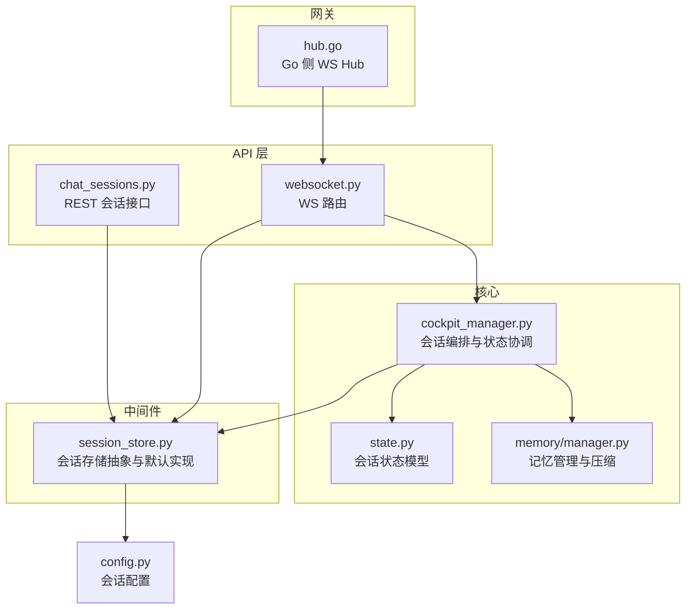
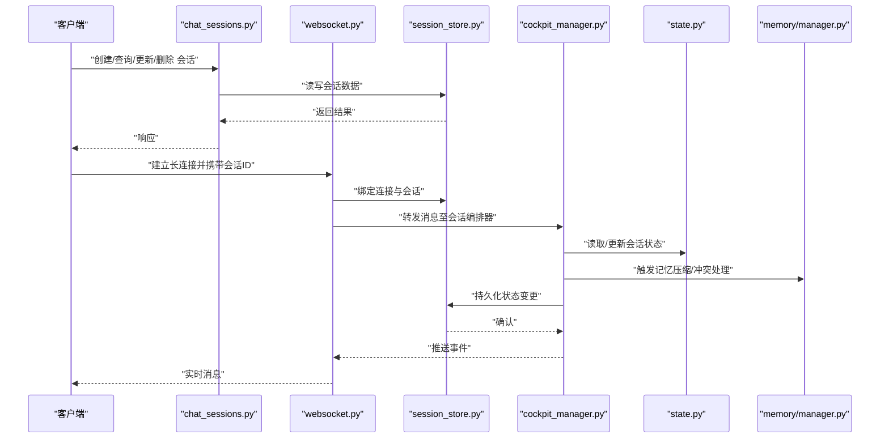
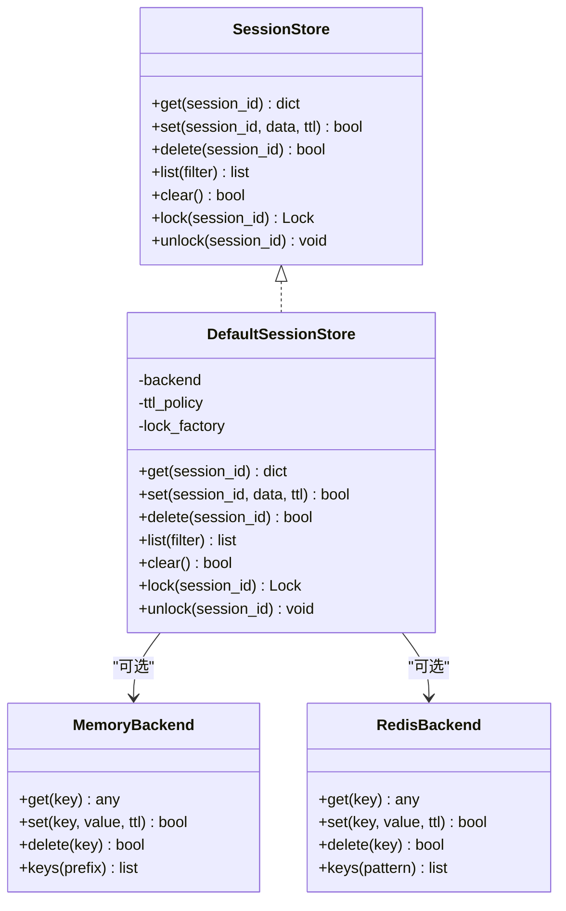
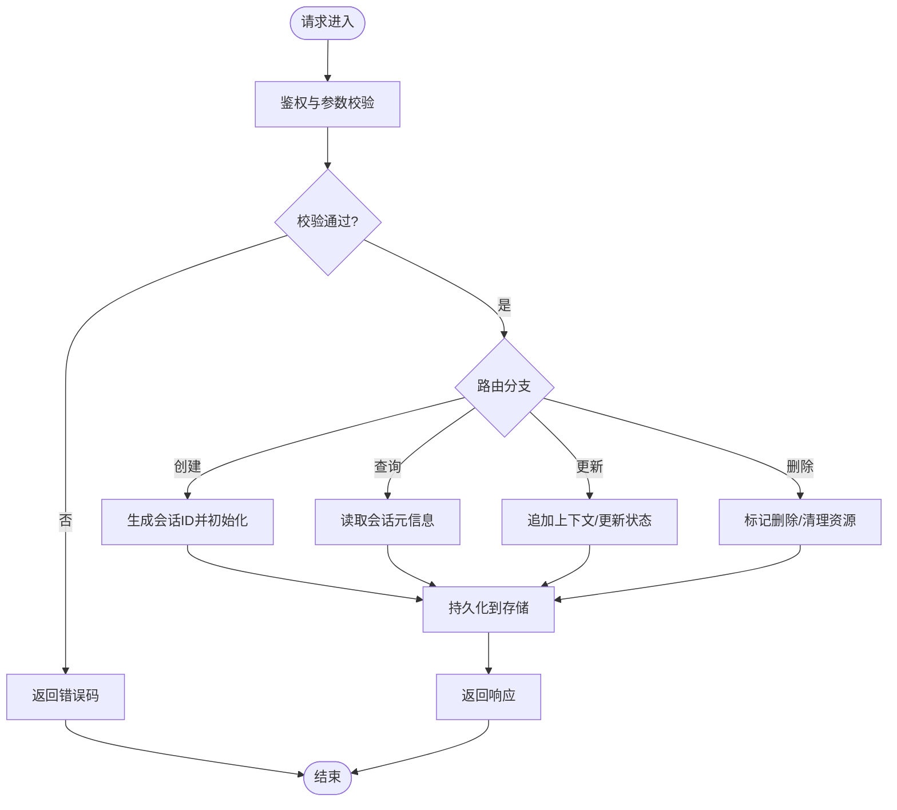
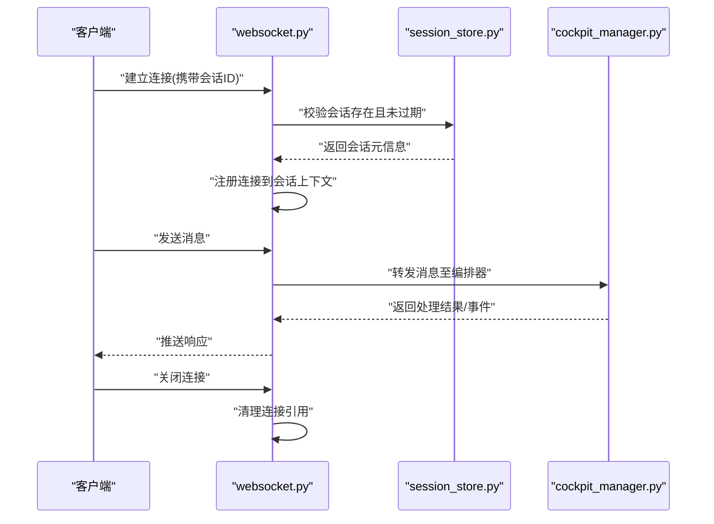
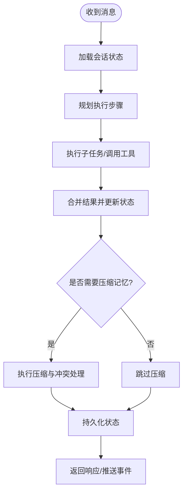
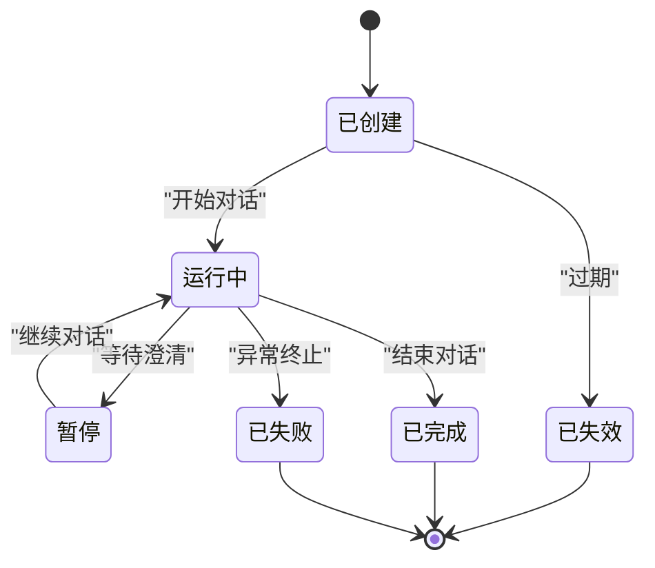
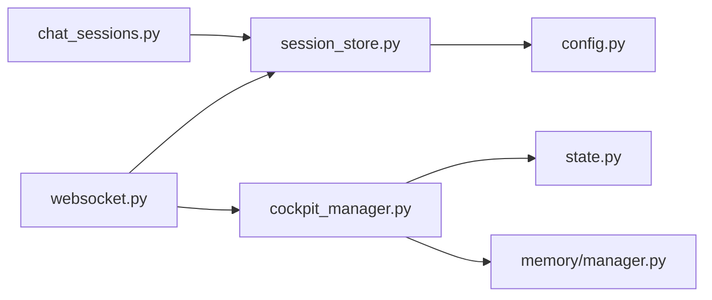

# 会话管理

<cite>
**本文引用的文件**   
- [backend_design/nexus/middleware/session_store.py](file://backend_design/nexus/middleware/session_store.py)
- [backend_design/nexus/api/routes/chat_sessions.py](file://backend_design/nexus/api/routes/chat_sessions.py)
- [backend_design/nexus/core/cockpit_manager.py](file://backend_design/nexus/core/cockpit_manager.py)
- [backend_design/nexus/models/state.py](file://backend_design/nexus/models/state.py)
- [backend_design/nexus/memory/manager.py](file://backend_design/nexus/memory/manager.py)
- [backend_design/nexus/config.py](file://backend_design/nexus/config.py)
- [backend_design/nexus/api/websocket.py](file://backend_design/nexus/api/websocket.py)
- [backend_design/nexus_gate/internal/ws/hub.go](file://backend_design/nexus_gate/internal/ws/hub.go)
</cite>

## 目录
1. [简介](#简介)
2. [项目结构](#项目结构)
3. [核心组件](#核心组件)
4. [架构总览](#架构总览)
5. [详细组件分析](#详细组件分析)
6. [依赖关系分析](#依赖关系分析)
7. [性能考虑](#性能考虑)
8. [故障排查指南](#故障排查指南)
9. [结论](#结论)
10. [附录](#附录)

## 简介
本技术文档聚焦于 NexusCockpit 的会话管理服务，围绕以下目标展开：
- 会话存储结构设计：用户状态持久化、会话生命周期管理、并发访问控制
- 安全机制：防篡改、防重放攻击等防护措施
- 运维能力：会话迁移、清理策略与性能优化方案
- 扩展性：自定义会话存储后端的实现指南

该服务贯穿 API 层、WebSocket 网关与内存/持久化后端，提供跨进程/跨节点的会话一致性保障。

## 项目结构
与会话管理相关的代码主要分布在以下模块：
- 中间件与会话存储抽象：定义会话存取接口与默认实现
- API 路由：会话创建、查询、更新、删除等 REST 接口
- WebSocket 网关：长连接上下文与会话绑定
- Cockpit 管理器：会话级业务编排与状态协调
- 模型与状态：会话数据模型与状态机
- 记忆管理：会话上下文的压缩与冲突处理
- 配置：会话相关参数（如过期时间、最大长度）

图表来源
- [backend_design/nexus/api/routes/chat_sessions.py](file://backend_design/nexus/api/routes/chat_sessions.py)
- [backend_design/nexus/api/websocket.py](file://backend_design/nexus/api/websocket.py)
- [backend_design/nexus/middleware/session_store.py](file://backend_design/nexus/middleware/session_store.py)
- [backend_design/nexus/core/cockpit_manager.py](file://backend_design/nexus/core/cockpit_manager.py)
- [backend_design/nexus/models/state.py](file://backend_design/nexus/models/state.py)
- [backend_design/nexus/memory/manager.py](file://backend_design/nexus/memory/manager.py)
- [backend_design/nexus_gate/internal/ws/hub.go](file://backend_design/nexus_gate/internal/ws/hub.go)

章节来源
- [backend_design/nexus/api/routes/chat_sessions.py](file://backend_design/nexus/api/routes/chat_sessions.py)
- [backend_design/nexus/api/websocket.py](file://backend_design/nexus/api/websocket.py)
- [backend_design/nexus/middleware/session_store.py](file://backend_design/nexus/middleware/session_store.py)
- [backend_design/nexus/core/cockpit_manager.py](file://backend_design/nexus/core/cockpit_manager.py)
- [backend_design/nexus/models/state.py](file://backend_design/nexus/models/state.py)
- [backend_design/nexus/memory/manager.py](file://backend_design/nexus/memory/manager.py)
- [backend_design/nexus_gate/internal/ws/hub.go](file://backend_design/nexus_gate/internal/ws/hub.go)

## 核心组件
- 会话存储抽象与默认实现
  - 职责：定义统一的会话读写接口；提供基于内存或外部存储的默认实现；封装序列化、键空间隔离、过期与锁语义
  - 关键点：原子操作、幂等写入、并发锁、TTL 支持
- 会话 API 路由
  - 职责：暴露会话创建、读取、更新、删除、列表等 REST 接口；校验请求参数；调用存储层完成持久化
- WebSocket 会话绑定
  - 职责：将长连接上下文与会话 ID 绑定；在连接建立/断开时维护会话活跃状态
- Cockpit 管理器
  - 职责：编排会话内任务执行；协调状态变更；触发记忆压缩与冲突合并
- 状态模型
  - 职责：定义会话状态枚举、字段约束与转换规则
- 记忆管理
  - 职责：对会话历史进行压缩、去重、冲突检测与合并，降低存储压力并提升检索效率

章节来源
- [backend_design/nexus/middleware/session_store.py](file://backend_design/nexus/middleware/session_store.py)
- [backend_design/nexus/api/routes/chat_sessions.py](file://backend_design/nexus/api/routes/chat_sessions.py)
- [backend_design/nexus/api/websocket.py](file://backend_design/nexus/api/websocket.py)
- [backend_design/nexus/core/cockpit_manager.py](file://backend_design/nexus/core/cockpit_manager.py)
- [backend_design/nexus/models/state.py](file://backend_design/nexus/models/state.py)
- [backend_design/nexus/memory/manager.py](file://backend_design/nexus/memory/manager.py)

## 架构总览
下图展示从客户端到存储层的完整会话交互路径，包括 REST 与 WebSocket 两条通道。

图表来源
- [backend_design/nexus/api/routes/chat_sessions.py](file://backend_design/nexus/api/routes/chat_sessions.py)
- [backend_design/nexus/api/websocket.py](file://backend_design/nexus/api/websocket.py)
- [backend_design/nexus/middleware/session_store.py](file://backend_design/nexus/middleware/session_store.py)
- [backend_design/nexus/core/cockpit_manager.py](file://backend_design/nexus/core/cockpit_manager.py)
- [backend_design/nexus/models/state.py](file://backend_design/nexus/models/state.py)
- [backend_design/nexus/memory/manager.py](file://backend_design/nexus/memory/manager.py)

## 详细组件分析

### 会话存储抽象与默认实现（session_store.py）
- 设计要点
  - 统一接口：提供 get/set/delete/list/clear 等方法，屏蔽底层差异
  - 键空间隔离：按租户/用户维度组织键前缀，避免碰撞
  - 原子性与幂等：写操作采用 CAS 或带版本号的写入，保证并发安全与幂等
  - TTL 与过期：支持会话级过期时间，配合定时清理任务回收资源
  - 并发控制：内部使用分布式锁或本地锁（视后端而定），防止竞态条件
- 数据结构
  - 会话元信息：会话ID、创建时间、更新时间、状态、过期时间、版本戳
  - 会话上下文：用户输入/输出摘要、工具调用记录、记忆索引
- 错误处理
  - 区分“不存在”、“权限不足”、“存储不可用”等错误类型，便于上层重试与降级
- 可插拔后端
  - 通过工厂或配置切换不同存储后端（内存、Redis、数据库等）

图表来源
- [backend_design/nexus/middleware/session_store.py](file://backend_design/nexus/middleware/session_store.py)

章节来源
- [backend_design/nexus/middleware/session_store.py](file://backend_design/nexus/middleware/session_store.py)

### 会话 API 路由（chat_sessions.py）
- 功能范围
  - 创建会话：生成唯一会话ID，初始化元信息与空上下文
  - 查询会话：返回会话元信息与必要上下文摘要
  - 更新会话：追加消息、更新状态、触发记忆压缩
  - 删除会话：软删除或硬删除，释放资源
  - 列表与过滤：按用户/租户/时间范围筛选
- 安全校验
  - 鉴权：验证请求来源与权限
  - 参数校验：会话ID格式、分页参数、过滤条件合法性
- 事务与幂等
  - 对关键写操作采用幂等键或版本号，避免重复提交导致的状态不一致

图表来源
- [backend_design/nexus/api/routes/chat_sessions.py](file://backend_design/nexus/api/routes/chat_sessions.py)
- [backend_design/nexus/middleware/session_store.py](file://backend_design/nexus/middleware/session_store.py)

章节来源
- [backend_design/nexus/api/routes/chat_sessions.py](file://backend_design/nexus/api/routes/chat_sessions.py)

### WebSocket 会话绑定（websocket.py）
- 连接建立
  - 解析握手参数中的会话ID，校验有效性
  - 将连接句柄注册到会话上下文，建立双向通道
- 消息路由
  - 根据会话ID将消息分发至 Cockpit 管理器进行处理
- 连接断开
  - 清理连接引用，必要时触发会话空闲检测与清理

图表来源
- [backend_design/nexus/api/websocket.py](file://backend_design/nexus/api/websocket.py)
- [backend_design/nexus/middleware/session_store.py](file://backend_design/nexus/middleware/session_store.py)
- [backend_design/nexus/core/cockpit_manager.py](file://backend_design/nexus/core/cockpit_manager.py)

章节来源
- [backend_design/nexus/api/websocket.py](file://backend_design/nexus/api/websocket.py)

### Cockpit 管理器（cockpit_manager.py）
- 职责
  - 编排会话内任务：接收消息、调度专家/技能、聚合结果
  - 状态协调：读取当前状态、应用状态转换、落盘持久化
  - 记忆集成：触发压缩、冲突检测与合并，保持上下文精简
- 并发控制
  - 针对同一会话的并发请求采用串行化或乐观锁，避免状态覆盖
- 异常恢复
  - 捕获异常并回滚部分状态，确保最终一致性

图表来源
- [backend_design/nexus/core/cockpit_manager.py](file://backend_design/nexus/core/cockpit_manager.py)
- [backend_design/nexus/memory/manager.py](file://backend_design/nexus/memory/manager.py)
- [backend_design/nexus/models/state.py](file://backend_design/nexus/models/state.py)

章节来源
- [backend_design/nexus/core/cockpit_manager.py](file://backend_design/nexus/core/cockpit_manager.py)
- [backend_design/nexus/memory/manager.py](file://backend_design/nexus/memory/manager.py)
- [backend_design/nexus/models/state.py](file://backend_design/nexus/models/state.py)

### 状态模型（state.py）
- 字段说明
  - 会话标识、创建/更新时间、状态枚举、版本戳、过期时间
  - 上下文摘要、记忆索引、审计日志指针
- 状态转换
  - 定义合法的状态转移图，禁止非法跳转
- 校验规则
  - 必填字段、取值范围、时间顺序约束

图表来源
- [backend_design/nexus/models/state.py](file://backend_design/nexus/models/state.py)

章节来源
- [backend_design/nexus/models/state.py](file://backend_design/nexus/models/state.py)

### 记忆管理（memory/manager.py）
- 功能
  - 压缩：对长上下文进行摘要与去重，保留关键信息
  - 冲突：检测多源写入导致的冲突，采用合并策略解决
  - 索引：为压缩后的记忆建立检索索引，加速召回
- 触发时机
  - 达到阈值（条数/大小）、定时任务、显式调用
- 性能影响
  - 异步执行、批处理、缓存热点片段

章节来源
- [backend_design/nexus/memory/manager.py](file://backend_design/nexus/memory/manager.py)

### Go 侧 WebSocket Hub（hub.go）
- 作用
  - 作为网关层负责 WS 连接的接入、广播与心跳检测
  - 与 Python 侧 API/WebSocket 协作，转发消息并维持连接健康
- 会话关联
  - 通过会话ID将连接映射到对应会话上下文，确保消息路由正确

章节来源
- [backend_design/nexus_gate/internal/ws/hub.go](file://backend_design/nexus_gate/internal/ws/hub.go)

## 依赖关系分析
- 耦合度
  - API 路由与存储层解耦，通过抽象接口减少直接依赖
  - Cockpit 管理器依赖状态模型与记忆管理，但通过接口隔离
- 外部依赖
  - 存储后端（内存/Redis/DB）通过配置注入
  - 认证与鉴权由上游网关或中间件提供
- 潜在循环依赖
  - 通过分层与接口化避免模块间相互导入

图表来源
- [backend_design/nexus/api/routes/chat_sessions.py](file://backend_design/nexus/api/routes/chat_sessions.py)
- [backend_design/nexus/api/websocket.py](file://backend_design/nexus/api/websocket.py)
- [backend_design/nexus/middleware/session_store.py](file://backend_design/nexus/middleware/session_store.py)
- [backend_design/nexus/core/cockpit_manager.py](file://backend_design/nexus/core/cockpit_manager.py)
- [backend_design/nexus/models/state.py](file://backend_design/nexus/models/state.py)
- [backend_design/nexus/memory/manager.py](file://backend_design/nexus/memory/manager.py)
- [backend_design/nexus/config.py](file://backend_design/nexus/config.py)

章节来源
- [backend_design/nexus/api/routes/chat_sessions.py](file://backend_design/nexus/api/routes/chat_sessions.py)
- [backend_design/nexus/api/websocket.py](file://backend_design/nexus/api/websocket.py)
- [backend_design/nexus/middleware/session_store.py](file://backend_design/nexus/middleware/session_store.py)
- [backend_design/nexus/core/cockpit_manager.py](file://backend_design/nexus/core/cockpit_manager.py)
- [backend_design/nexus/models/state.py](file://backend_design/nexus/models/state.py)
- [backend_design/nexus/memory/manager.py](file://backend_design/nexus/memory/manager.py)
- [backend_design/nexus/config.py](file://backend_design/nexus/config.py)

## 性能考虑
- 存储层优化
  - 批量写入与异步落盘，降低主路径延迟
  - 合理设置 TTL 与分片键，避免热点键
- 记忆压缩
  - 按需触发与增量压缩，避免全量重建
  - 压缩结果缓存，命中率高时减少计算开销
- 并发控制
  - 使用细粒度锁（会话级）而非全局锁，提高吞吐
  - 乐观锁结合重试，减少阻塞
- 监控与观测
  - 暴露关键指标（QPS、P99 延迟、命中率、压缩耗时）
  - 告警阈值与自动扩容策略

[本节为通用指导，不直接分析具体文件]

## 故障排查指南
- 常见问题
  - 会话不存在或已过期：检查 TTL 配置与清理任务是否正常运行
  - 并发冲突：查看版本戳与锁获取日志，确认是否存在长时间持有锁
  - 记忆压缩失败：检查压缩队列与下游依赖（向量库/索引服务）可用性
- 定位方法
  - 启用会话级追踪 ID，串联 API/WS/存储链路日志
  - 导出会话快照与审计日志，对比状态变化
- 恢复策略
  - 对失败写操作进行幂等重试
  - 对损坏的记忆片段进行重建或回滚

章节来源
- [backend_design/nexus/middleware/session_store.py](file://backend_design/nexus/middleware/session_store.py)
- [backend_design/nexus/core/cockpit_manager.py](file://backend_design/nexus/core/cockpit_manager.py)
- [backend_design/nexus/memory/manager.py](file://backend_design/nexus/memory/manager.py)

## 结论
NexusCockpit 的会话管理以清晰的抽象与分层为基础，实现了高可用、可扩展的会话生命周期管理。通过统一的存储接口、严格的并发控制与完善的记忆压缩策略，系统在性能与一致性之间取得良好平衡。建议在生产环境完善监控与告警，并结合业务特征调优 TTL、压缩阈值与锁粒度。

[本节为总结性内容，不直接分析具体文件]

## 附录

### 会话安全机制
- 防篡改
  - 会话元信息与关键上下文增加签名或哈希校验，变更时更新版本戳
  - 存储层对写操作进行完整性校验，拒绝不一致写入
- 防重放
  - 请求携带一次性令牌或时间戳+签名，服务端校验窗口与唯一性
  - 对幂等写操作使用幂等键，避免重复提交造成副作用
- 访问控制
  - 基于租户/用户的键空间隔离，结合鉴权中间件限制访问范围
- 传输安全
  - WebSocket 强制 TLS，网关层校验证书与来源白名单

[本节为通用安全实践，不直接分析具体文件]

### 会话迁移与清理策略
- 迁移
  - 灰度切换存储后端：双写旧/新存储，逐步切读，校验一致性后下线旧存储
  - 数据校验：比对计数、抽样校验关键字段，发现偏差立即回滚
- 清理
  - 基于 TTL 的定期扫描与惰性删除相结合
  - 冷数据归档：将长期未访问的会话迁移到低成本存储

[本节为通用运维策略，不直接分析具体文件]

### 自定义会话存储后端实现指南
- 步骤
  - 实现统一接口：get/set/delete/list/clear/lock/unlock
  - 提供键空间隔离与 TTL 支持
  - 实现原子写与幂等逻辑（CAS 或版本号）
  - 添加必要的错误类型与日志埋点
- 测试
  - 并发压测：验证锁与一致性
  - 故障注入：模拟网络抖动、存储不可用，验证重试与降级
- 集成
  - 通过配置注入新后端，替换默认实现
  - 开启观测指标，监控 QPS、延迟与错误率

[本节为通用扩展指南，不直接分析具体文件]