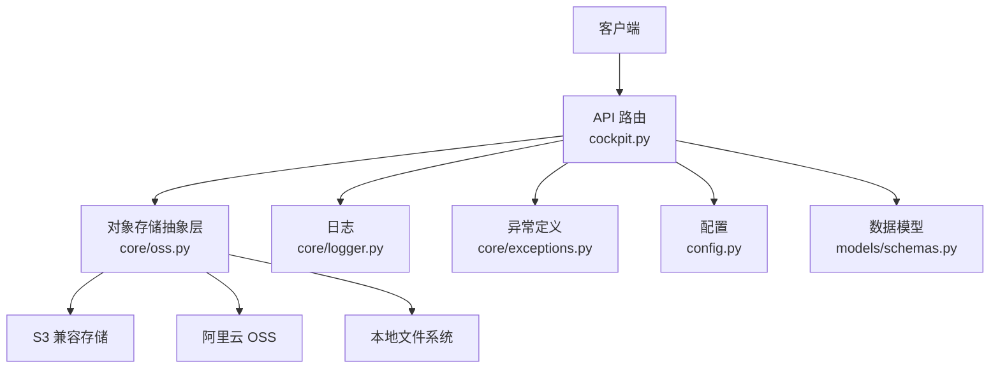
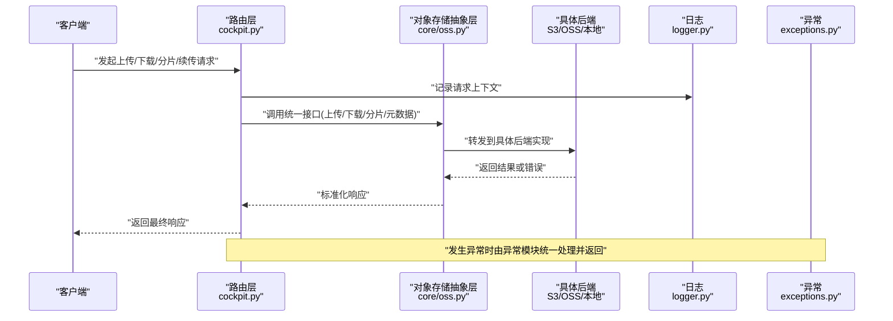
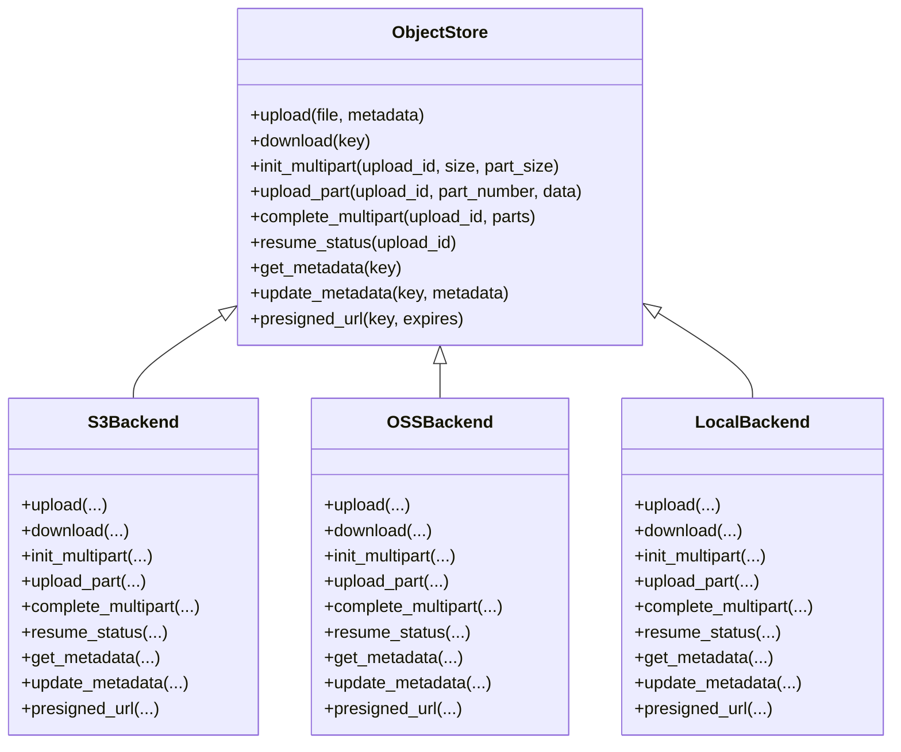
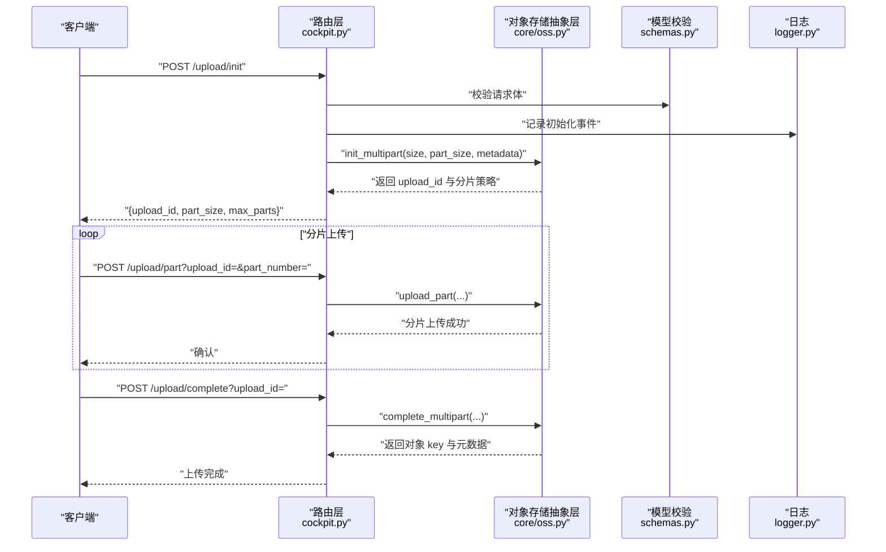
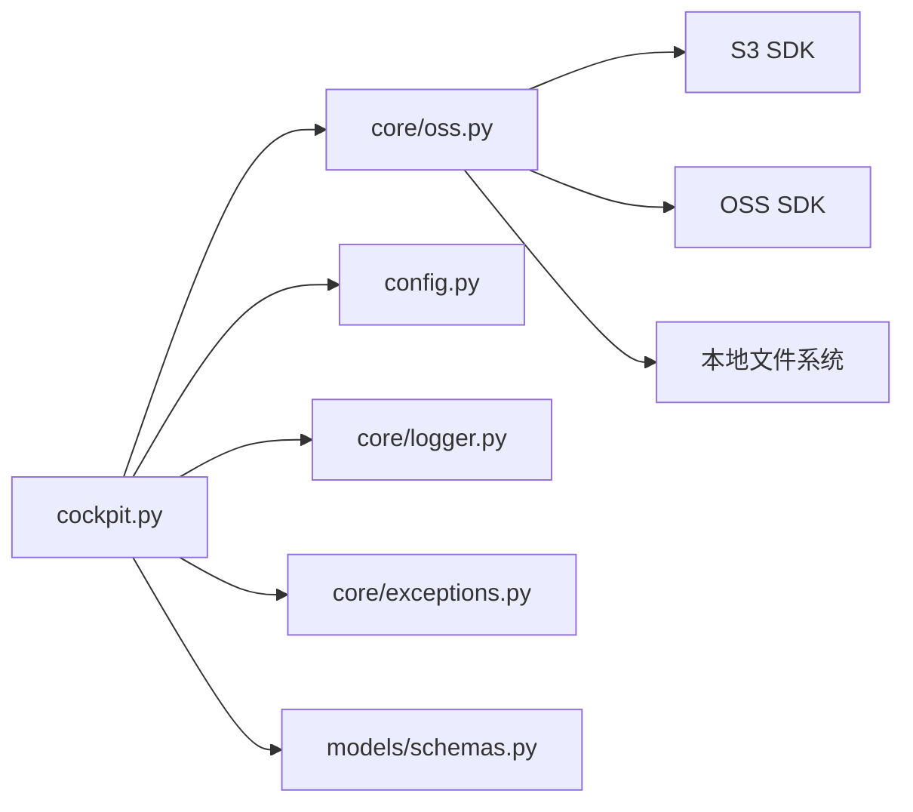
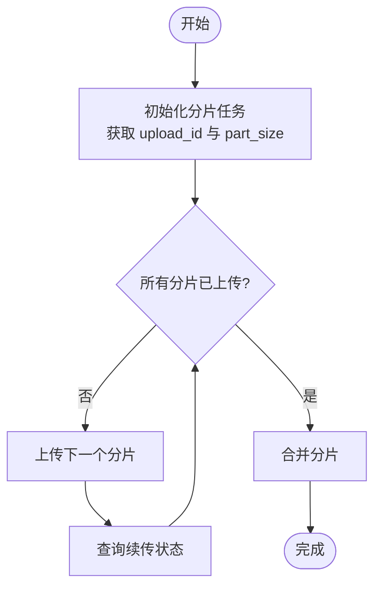

# 对象存储服务

<cite>
**本文引用的文件**   
- [backend_design/nexus/core/oss.py](file://backend_design/nexus/core/oss.py)
- [backend_design/nexus/api/routes/cockpit.py](file://backend_design/nexus/api/routes/cockpit.py)
- [backend_design/nexus/config.py](file://backend_design/nexus/config.py)
- [backend_design/nexus/core/logger.py](file://backend_design/nexus/core/logger.py)
- [backend_design/nexus/core/exceptions.py](file://backend_design/nexus/core/exceptions.py)
- [backend_design/nexus/middleware/session_store.py](file://backend_design/nexus/middleware/session_store.py)
- [backend_design/nexus/models/schemas.py](file://backend_design/nexus/models/schemas.py)
</cite>

## 目录
1. [简介](#简介)
2. [项目结构](#项目结构)
3. [核心组件](#核心组件)
4. [架构总览](#架构总览)
5. [详细组件分析](#详细组件分析)
6. [依赖关系分析](#依赖关系分析)
7. [性能考虑](#性能考虑)
8. [故障排查指南](#故障排查指南)
9. [结论](#结论)
10. [附录](#附录)

## 简介
本技术文档聚焦于 NexusCockpit 的对象存储服务，围绕以下目标展开：
- 文件上传与下载、分片传输与断点续传的实现机制
- 多云存储统一接口设计（S3、OSS、本地存储）
- 文件元数据管理、访问控制与 CDN 集成
- 自定义存储后端扩展指南与性能优化建议

该服务通过统一的抽象层屏蔽底层存储差异，为上层 API 提供一致的上传、下载、分片、续传与元数据管理能力。

## 项目结构
对象存储服务主要位于后端 Python 模块中，关键位置如下：
- 统一对象存储抽象与实现：backend_design/nexus/core/oss.py
- 面向前端的上传/下载路由：backend_design/nexus/api/routes/cockpit.py
- 配置加载与默认值：backend_design/nexus/config.py
- 日志与异常处理：backend_design/nexus/core/logger.py、backend_design/nexus/core/exceptions.py
- 会话与上下文：backend_design/nexus/middleware/session_store.py
- 请求/响应模型：backend_design/nexus/models/schemas.py

图表来源
- [backend_design/nexus/api/routes/cockpit.py](file://backend_design/nexus/api/routes/cockpit.py)
- [backend_design/nexus/core/oss.py](file://backend_design/nexus/core/oss.py)
- [backend_design/nexus/config.py](file://backend_design/nexus/config.py)
- [backend_design/nexus/core/logger.py](file://backend_design/nexus/core/logger.py)
- [backend_design/nexus/core/exceptions.py](file://backend_design/nexus/core/exceptions.py)
- [backend_design/nexus/models/schemas.py](file://backend_design/nexus/models/schemas.py)

章节来源
- [backend_design/nexus/core/oss.py](file://backend_design/nexus/core/oss.py)
- [backend_design/nexus/api/routes/cockpit.py](file://backend_design/nexus/api/routes/cockpit.py)
- [backend_design/nexus/config.py](file://backend_design/nexus/config.py)
- [backend_design/nexus/core/logger.py](file://backend_design/nexus/core/logger.py)
- [backend_design/nexus/core/exceptions.py](file://backend_design/nexus/core/exceptions.py)
- [backend_design/nexus/models/schemas.py](file://backend_design/nexus/models/schemas.py)

## 核心组件
- 统一对象存储抽象层
  - 职责：定义上传、下载、分片、续传、元数据读取/更新、预签名 URL 生成等统一接口；根据配置选择具体后端（S3/OSS/本地）。
  - 关键点：多后端适配、流式读写、分片策略、断点状态持久化、错误重试与幂等性。
- API 路由层
  - 职责：暴露上传、下载、分片初始化/合并、续传查询、元数据操作等 HTTP 接口；鉴权与会话上下文注入；参数校验与响应封装。
- 配置中心
  - 职责：集中管理存储后端类型、凭据、桶名、CDN 域名、分片大小、并发度等。
- 日志与异常
  - 职责：结构化日志记录、错误分类与标准化返回。
- 数据模型
  - 职责：定义上传任务、分片信息、元数据结构的 Pydantic 模型，用于请求/响应校验与序列化。

章节来源
- [backend_design/nexus/core/oss.py](file://backend_design/nexus/core/oss.py)
- [backend_design/nexus/api/routes/cockpit.py](file://backend_design/nexus/api/routes/cockpit.py)
- [backend_design/nexus/config.py](file://backend_design/nexus/config.py)
- [backend_design/nexus/core/logger.py](file://backend_design/nexus/core/logger.py)
- [backend_design/nexus/core/exceptions.py](file://backend_design/nexus/core/exceptions.py)
- [backend_design/nexus/models/schemas.py](file://backend_design/nexus/models/schemas.py)

## 架构总览
整体采用“路由层 + 抽象层 + 多后端”的分层架构。路由层负责协议与业务编排，抽象层屏蔽存储差异，后端可插拔扩展。

图表来源
- [backend_design/nexus/api/routes/cockpit.py](file://backend_design/nexus/api/routes/cockpit.py)
- [backend_design/nexus/core/oss.py](file://backend_design/nexus/core/oss.py)
- [backend_design/nexus/core/logger.py](file://backend_design/nexus/core/logger.py)
- [backend_design/nexus/core/exceptions.py](file://backend_design/nexus/core/exceptions.py)

## 详细组件分析

### 统一对象存储抽象层（core/oss.py）
- 设计要点
  - 统一接口：定义上传、下载、分片初始化、分片上传、分片合并、断点续传、元数据读取/更新、预签名 URL 生成等方法。
  - 多后端适配：依据配置选择 S3、OSS 或本地文件系统实现；对外暴露一致行为。
  - 流式处理：大文件采用流式读写，避免一次性加载到内存。
  - 分片与续传：支持分片大小、并发数、超时、重试次数等策略；维护分片状态以便断点续传。
  - 错误与重试：对网络抖动与临时失败进行指数退避重试；区分可重试与不可重试错误。
  - 元数据：在对象级别附加键值对元数据，便于检索与权限控制。
  - 安全：支持预签名 URL 与可选的访问令牌校验。
- 复杂度与性能
  - 上传/下载时间复杂度近似 O(N)，空间复杂度取决于分片大小与并发缓冲。
  - 分片合并通常按序或并行完成，需保证幂等与一致性。
- 可扩展性
  - 新增后端只需实现统一接口约定，并在注册/工厂处接入即可。

图表来源
- [backend_design/nexus/core/oss.py](file://backend_design/nexus/core/oss.py)

章节来源
- [backend_design/nexus/core/oss.py](file://backend_design/nexus/core/oss.py)

### API 路由层（api/routes/cockpit.py）
- 职责
  - 暴露上传、下载、分片初始化/上传/合并、续传状态查询、元数据操作等 REST 接口。
  - 鉴权与会话上下文注入，确保租户隔离与访问控制。
  - 参数校验、分页与限流（可与中间件配合）、响应体封装。
  - 与对象存储抽象层交互，将后端错误转换为标准 API 错误。
- 典型流程
  - 上传：创建任务 -> 初始化分片 -> 客户端循环上传分片 -> 合并分片 -> 返回结果。
  - 下载：校验权限 -> 生成直链或代理流式下载 -> 返回响应。
  - 续传：查询分片状态 -> 客户端仅补传缺失分片 -> 再次合并。
  - 元数据：读取/更新对象级元数据，供检索与策略使用。

图表来源
- [backend_design/nexus/api/routes/cockpit.py](file://backend_design/nexus/api/routes/cockpit.py)
- [backend_design/nexus/core/oss.py](file://backend_design/nexus/core/oss.py)
- [backend_design/nexus/models/schemas.py](file://backend_design/nexus/models/schemas.py)
- [backend_design/nexus/core/logger.py](file://backend_design/nexus/core/logger.py)

章节来源
- [backend_design/nexus/api/routes/cockpit.py](file://backend_design/nexus/api/routes/cockpit.py)
- [backend_design/nexus/models/schemas.py](file://backend_design/nexus/models/schemas.py)
- [backend_design/nexus/core/logger.py](file://backend_design/nexus/core/logger.py)

### 配置与运行时（config.py）
- 关键配置项（示例说明）
  - 存储后端类型：s3/oss/local
  - 凭据与端点：access_key、secret_key、endpoint、bucket
  - 分片策略：part_size、max_concurrency、timeout、retries
  - CDN：启用开关、域名、缓存策略
  - 安全：预签名有效期、访问令牌校验
- 作用
  - 驱动对象存储抽象层选择具体后端与策略。
  - 为路由层提供鉴权与限流相关参数。

章节来源
- [backend_design/nexus/config.py](file://backend_design/nexus/config.py)

### 日志与异常（logger.py、exceptions.py）
- 日志
  - 结构化记录上传/下载/分片生命周期事件，包含 upload_id、key、part_number、耗时等。
- 异常
  - 定义业务异常类型（如分片不完整、权限不足、后端不可用），路由层捕获后转换为标准错误响应。

章节来源
- [backend_design/nexus/core/logger.py](file://backend_design/nexus/core/logger.py)
- [backend_design/nexus/core/exceptions.py](file://backend_design/nexus/core/exceptions.py)

### 会话与上下文（middleware/session_store.py）
- 作用
  - 维护用户会话与租户上下文，辅助路由层进行访问控制与审计。
- 与对象存储的关系
  - 在生成预签名 URL 或执行元数据操作时，结合会话上下文决定是否允许访问。

章节来源
- [backend_design/nexus/middleware/session_store.py](file://backend_design/nexus/middleware/session_store.py)

## 依赖关系分析
- 组件耦合
  - 路由层依赖对象存储抽象层、配置、日志、异常与数据模型。
  - 对象存储抽象层依赖具体后端 SDK 与配置。
- 外部依赖
  - S3/OSS SDK、HTTP 客户端、文件系统 IO。
- 潜在循环依赖
  - 当前分层清晰，未见明显循环依赖风险。

图表来源
- [backend_design/nexus/api/routes/cockpit.py](file://backend_design/nexus/api/routes/cockpit.py)
- [backend_design/nexus/core/oss.py](file://backend_design/nexus/core/oss.py)
- [backend_design/nexus/config.py](file://backend_design/nexus/config.py)
- [backend_design/nexus/core/logger.py](file://backend_design/nexus/core/logger.py)
- [backend_design/nexus/core/exceptions.py](file://backend_design/nexus/core/exceptions.py)
- [backend_design/nexus/models/schemas.py](file://backend_design/nexus/models/schemas.py)

章节来源
- [backend_design/nexus/api/routes/cockpit.py](file://backend_design/nexus/api/routes/cockpit.py)
- [backend_design/nexus/core/oss.py](file://backend_design/nexus/core/oss.py)
- [backend_design/nexus/config.py](file://backend_design/nexus/config.py)
- [backend_design/nexus/core/logger.py](file://backend_design/nexus/core/logger.py)
- [backend_design/nexus/core/exceptions.py](file://backend_design/nexus/core/exceptions.py)
- [backend_design/nexus/models/schemas.py](file://backend_design/nexus/models/schemas.py)

## 性能考虑
- 分片大小与并发
  - 合理设置 part_size 与 max_concurrency，平衡吞吐与资源占用。
- 流式 I/O
  - 上传/下载采用流式处理，避免大对象占满内存。
- 重试与退避
  - 对瞬时错误采用指数退避与最大重试次数，提升稳定性。
- 缓存与 CDN
  - 静态资源开启 CDN 缓存，减少回源压力。
- 连接池与超时
  - 调整 HTTP 连接池大小与超时参数，匹配后端能力。
- 磁盘与网络
  - 本地存储注意磁盘 I/O 与网络带宽瓶颈，必要时迁移至云对象存储。

[本节为通用指导，不直接分析具体文件]

## 故障排查指南
- 常见问题定位
  - 上传中断：检查分片状态与续传接口，确认缺失分片并补传。
  - 权限错误：核对会话上下文与访问控制策略，确认预签名 URL 有效期。
  - 后端不可用：查看日志中的后端错误码与重试次数，评估是否需要扩容或切换后端。
- 日志关键字
  - 上传/下载事件、分片编号、upload_id、错误码、耗时。
- 快速恢复
  - 利用 resume_status 查询未完成的分片，仅重传缺失部分。
  - 若后端异常，尝试切换至备用后端或降级为本地存储。

章节来源
- [backend_design/nexus/core/logger.py](file://backend_design/nexus/core/logger.py)
- [backend_design/nexus/core/exceptions.py](file://backend_design/nexus/core/exceptions.py)
- [backend_design/nexus/api/routes/cockpit.py](file://backend_design/nexus/api/routes/cockpit.py)
- [backend_design/nexus/core/oss.py](file://backend_design/nexus/core/oss.py)

## 结论
对象存储服务通过统一抽象层屏蔽了 S3、OSS 与本地存储的差异，提供了完整的上传、下载、分片与断点续传能力，并结合配置、日志、异常与会话上下文实现了稳定、可扩展且易运维的服务形态。建议在大规模场景下优先使用云对象存储，并配合 CDN 与合理的分片策略以获得最佳性能与可用性。

[本节为总结性内容，不直接分析具体文件]

## 附录

### 自定义存储后端扩展指南
- 步骤
  - 实现统一接口：在 core/oss.py 中新增类，实现上传、下载、分片、续传、元数据与预签名 URL 等方法。
  - 注册后端：在配置或工厂处注册新后端类型，使路由层可通过配置选择。
  - 测试验证：覆盖正常路径、错误路径、分片与续传、并发与超时等用例。
- 注意事项
  - 保持幂等性与一致性，确保分片合并可重复执行。
  - 遵循统一的错误语义与日志格式，便于排障。
  - 关注性能指标：吞吐、延迟、资源占用。

章节来源
- [backend_design/nexus/core/oss.py](file://backend_design/nexus/core/oss.py)
- [backend_design/nexus/config.py](file://backend_design/nexus/config.py)

### 访问控制与 CDN 集成
- 访问控制
  - 基于会话上下文与租户 ID 限制对象访问范围。
  - 使用预签名 URL 控制短期访问权限。
- CDN 集成
  - 为只读对象启用 CDN 加速，配置缓存策略与刷新策略。
  - 动态内容仍经服务端校验与鉴权。

章节来源
- [backend_design/nexus/api/routes/cockpit.py](file://backend_design/nexus/api/routes/cockpit.py)
- [backend_design/nexus/config.py](file://backend_design/nexus/config.py)
- [backend_design/nexus/middleware/session_store.py](file://backend_design/nexus/middleware/session_store.py)

### 分片与续传流程图

图表来源
- [backend_design/nexus/api/routes/cockpit.py](file://backend_design/nexus/api/routes/cockpit.py)
- [backend_design/nexus/core/oss.py](file://backend_design/nexus/core/oss.py)