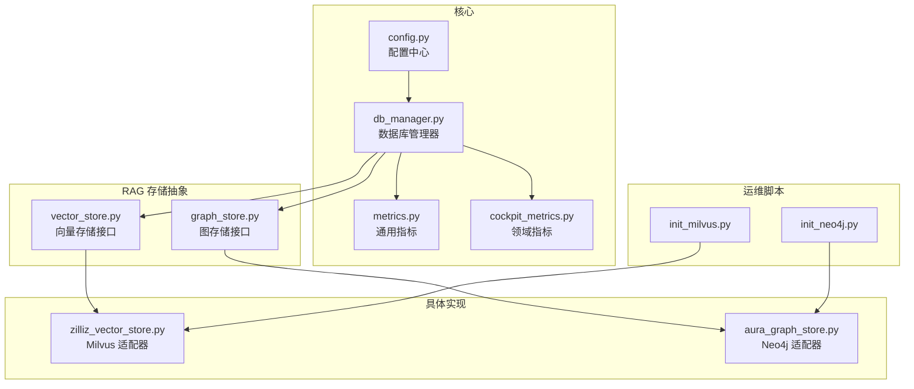
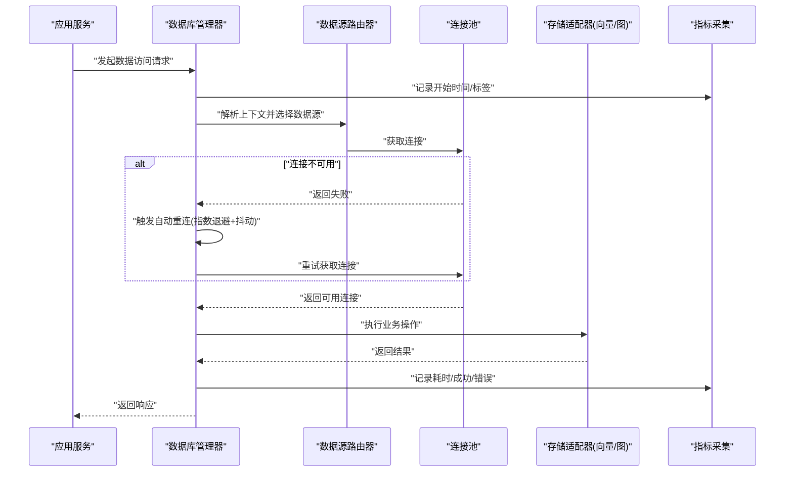
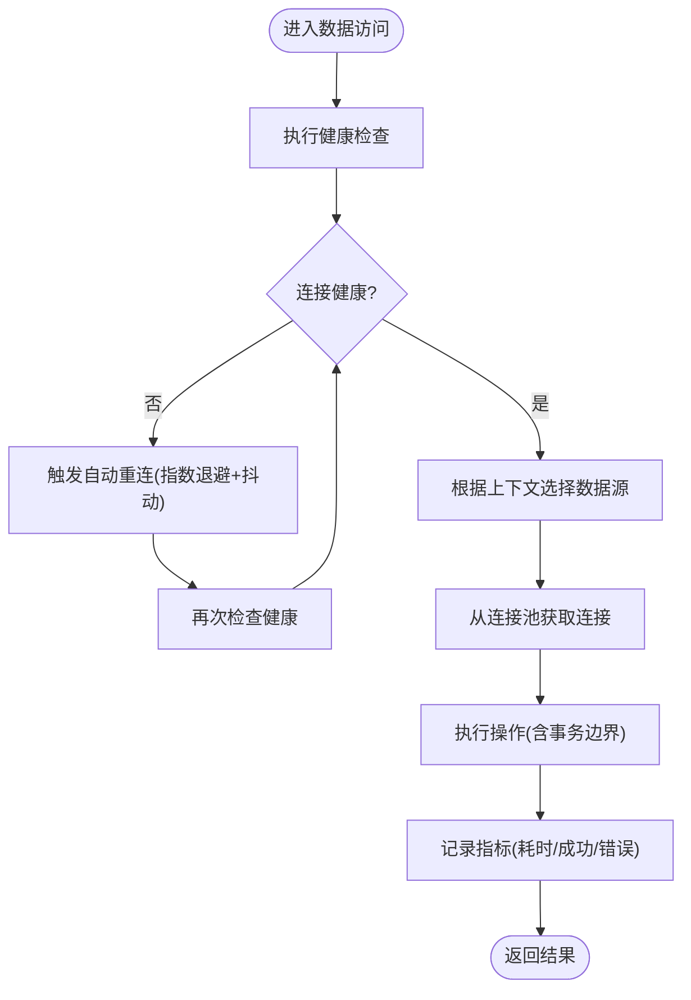
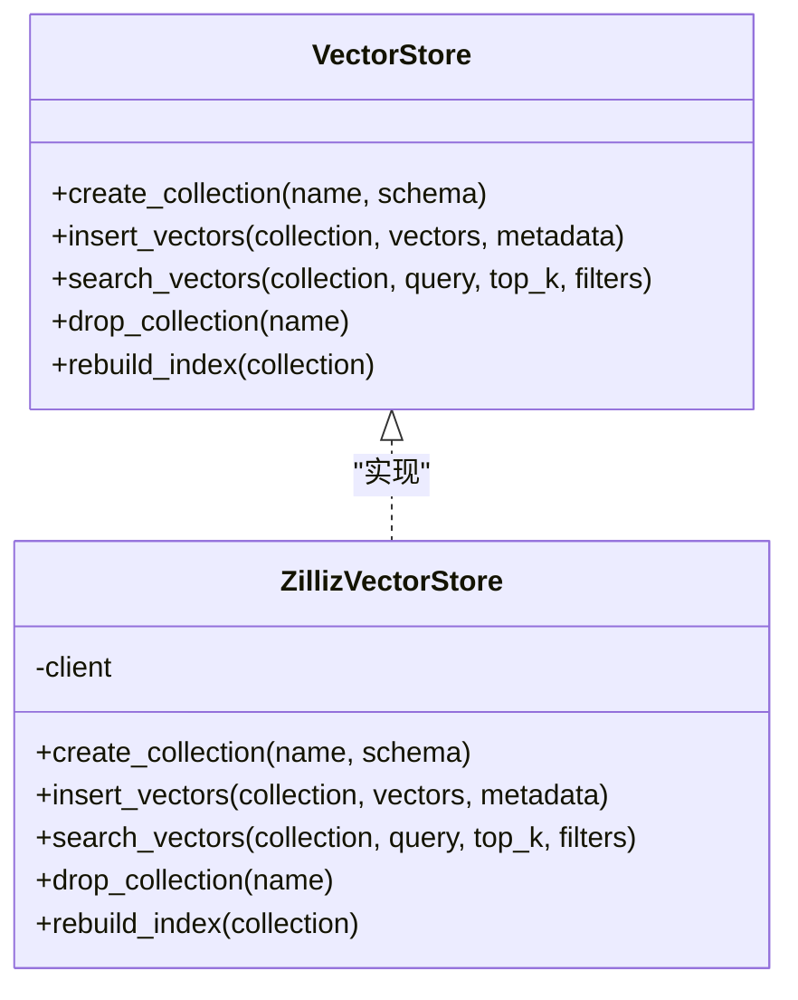
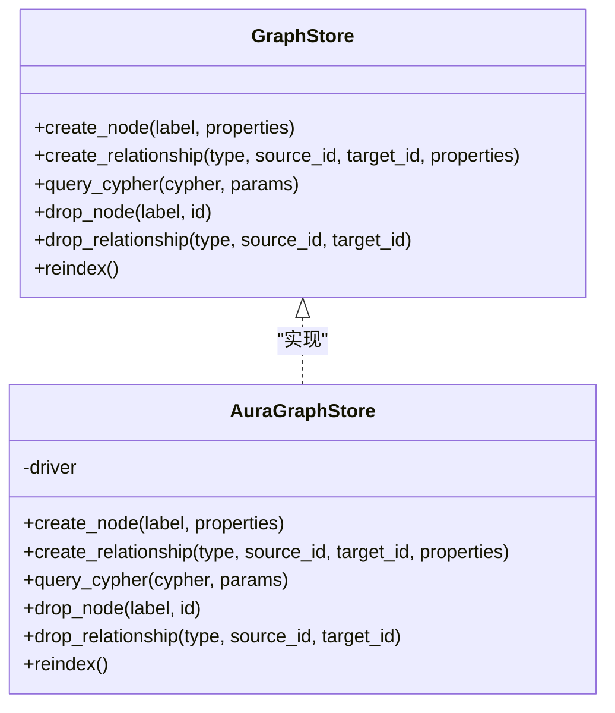
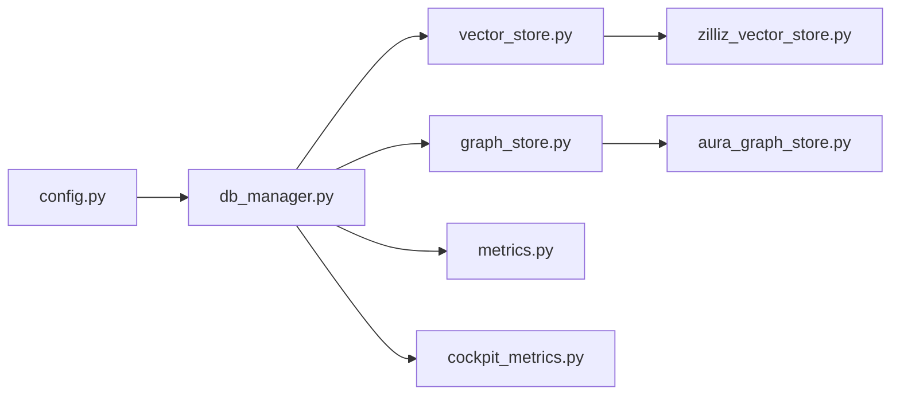

# 数据库管理

<cite>
**本文引用的文件**
- [backend_design/nexus/core/db_manager.py](file://backend_design/nexus/core/db_manager.py)
- [backend_design/nexus/config.py](file://backend_design/nexus/config.py)
- [backend_design/nexus/rag/vector_store.py](file://backend_design/nexus/rag/vector_store.py)
- [backend_design/nexus/rag/graph_store.py](file://backend_design/nexus/rag/graph_store.py)
- [backend_design/nexus/rag/zilliz_vector_store.py](file://backend_design/nexus/rag/zilliz_vector_store.py)
- [backend_design/nexus/rag/aura_graph_store.py](file://backend_design/nexus/rag/aura_graph_store.py)
- [backend_design/nexus/observability/metrics.py](file://backend_design/nexus/observability/metrics.py)
- [backend_design/nexus/observability/cockpit_metrics.py](file://backend_design/nexus/observability/cockpit_metrics.py)
- [backend_design/scripts/init_milvus.py](file://backend_design/scripts/init_milvus.py)
- [backend_design/scripts/init_neo4j.py](file://backend_design/scripts/init_neo4j.py)
- [backend_design/tests/test_core.py](file://backend_design/tests/test_core.py)
</cite>

## 目录
1. [简介](#简介)
2. [项目结构](#项目结构)
3. [核心组件](#核心组件)
4. [架构总览](#架构总览)
5. [详细组件分析](#详细组件分析)
6. [依赖关系分析](#依赖关系分析)
7. [性能考量](#性能考量)
8. [故障排查指南](#故障排查指南)
9. [结论](#结论)
10. [附录](#附录)

## 简介
本技术文档聚焦于 NexusCockpit 的数据库管理服务，围绕以下目标展开：
- 统一抽象层设计：对 PostgreSQL（关系型）、Neo4j（图数据库）、Milvus（向量数据库）提供一致的数据源访问接口。
- 连接池与事务管理：说明连接生命周期、健康检查、自动重连策略及事务边界。
- 数据源路由机制：基于租户上下文或业务域将请求路由到对应数据源。
- 可观测性：连接健康检查、自动重连与性能监控指标采集。
- 扩展性：自定义数据源适配器的开发指南与最佳实践。

## 项目结构
NexusCockpit 后端采用模块化组织，数据库相关能力主要分布在 core 与 rag 子系统中：
- core.db_manager：数据库管理器，负责多数据源初始化、连接池配置、健康检查、自动重连与路由。
- config：集中式配置加载，包含各数据源的连接参数与运行时开关。
- rag.vector_store / graph_store：向量与图存储的统一抽象接口。
- rag.zilliz_vector_store / aura_graph_store：具体实现（Milvus、Neo4j）。
- observability.metrics / cockpit_metrics：通用与领域指标收集，用于监控数据库操作。
- scripts.init_*：初始化脚本，用于环境准备与连通性验证。

图表来源
- [backend_design/nexus/core/db_manager.py](file://backend_design/nexus/core/db_manager.py)
- [backend_design/nexus/config.py](file://backend_design/nexus/config.py)
- [backend_design/nexus/rag/vector_store.py](file://backend_design/nexus/rag/vector_store.py)
- [backend_design/nexus/rag/graph_store.py](file://backend_design/nexus/rag/graph_store.py)
- [backend_design/nexus/rag/zilliz_vector_store.py](file://backend_design/nexus/rag/zilliz_vector_store.py)
- [backend_design/nexus/rag/aura_graph_store.py](file://backend_design/nexus/rag/aura_graph_store.py)
- [backend_design/nexus/observability/metrics.py](file://backend_design/nexus/observability/metrics.py)
- [backend_design/nexus/observability/cockpit_metrics.py](file://backend_design/nexus/observability/cockpit_metrics.py)
- [backend_design/scripts/init_milvus.py](file://backend_design/scripts/init_milvus.py)
- [backend_design/scripts/init_neo4j.py](file://backend_design/scripts/init_neo4j.py)

章节来源
- [backend_design/nexus/core/db_manager.py](file://backend_design/nexus/core/db_manager.py)
- [backend_design/nexus/config.py](file://backend_design/nexus/config.py)
- [backend_design/nexus/rag/vector_store.py](file://backend_design/nexus/rag/vector_store.py)
- [backend_design/nexus/rag/graph_store.py](file://backend_design/nexus/rag/graph_store.py)
- [backend_design/nexus/rag/zilliz_vector_store.py](file://backend_design/nexus/rag/zilliz_vector_store.py)
- [backend_design/nexus/rag/aura_graph_store.py](file://backend_design/nexus/rag/aura_graph_store.py)
- [backend_design/nexus/observability/metrics.py](file://backend_design/nexus/observability/metrics.py)
- [backend_design/nexus/observability/cockpit_metrics.py](file://backend_design/nexus/observability/cockpit_metrics.py)
- [backend_design/scripts/init_milvus.py](file://backend_design/scripts/init_milvus.py)
- [backend_design/scripts/init_neo4j.py](file://backend_design/scripts/init_neo4j.py)

## 核心组件
- 数据库管理器（db_manager）
  - 职责：统一初始化与管理多数据源；维护连接池；执行健康检查与自动重连；根据上下文进行数据源路由；记录指标。
  - 关键能力：
    - 连接池配置：最大连接数、空闲超时、最小连接数、连接获取超时等。
    - 事务管理：在单数据源内保证读写一致性，跨数据源通过补偿或编排保障最终一致性。
    - 健康检查：周期性探测连接可用性，失败时触发重连或降级。
    - 自动重连：指数退避、抖动、熔断保护，避免雪崩。
    - 数据源路由：依据租户上下文或业务域选择目标数据源实例。
- 配置中心（config）
  - 职责：集中加载并校验各数据源连接参数、连接池参数、重试与熔断策略、监控开关等。
- RAG 存储抽象（vector_store, graph_store）
  - 职责：定义统一的向量与图存储接口，屏蔽底层差异。
- 具体实现（zilliz_vector_store, aura_graph_store）
  - 职责：分别对接 Milvus 与 Neo4j，实现具体的查询、写入、索引与拓扑操作。
- 可观测性（metrics, cockpit_metrics）
  - 职责：采集连接池状态、操作耗时、错误率、重试次数等指标，供监控面板展示。

章节来源
- [backend_design/nexus/core/db_manager.py](file://backend_design/nexus/core/db_manager.py)
- [backend_design/nexus/config.py](file://backend_design/nexus/config.py)
- [backend_design/nexus/rag/vector_store.py](file://backend_design/nexus/rag/vector_store.py)
- [backend_design/nexus/rag/graph_store.py](file://backend_design/nexus/rag/graph_store.py)
- [backend_design/nexus/rag/zilliz_vector_store.py](file://backend_design/nexus/rag/zilliz_vector_store.py)
- [backend_design/nexus/rag/aura_graph_store.py](file://backend_design/nexus/rag/aura_graph_store.py)
- [backend_design/nexus/observability/metrics.py](file://backend_design/nexus/observability/metrics.py)
- [backend_design/nexus/observability/cockpit_metrics.py](file://backend_design/nexus/observability/cockpit_metrics.py)

## 架构总览
下图展示了从应用调用到具体数据源的完整路径，包括健康检查、自动重连与指标采集点。

图表来源
- [backend_design/nexus/core/db_manager.py](file://backend_design/nexus/core/db_manager.py)
- [backend_design/nexus/rag/vector_store.py](file://backend_design/nexus/rag/vector_store.py)
- [backend_design/nexus/rag/graph_store.py](file://backend_design/nexus/rag/graph_store.py)
- [backend_design/nexus/observability/metrics.py](file://backend_design/nexus/observability/metrics.py)

## 详细组件分析

### 数据库管理器（db_manager）
- 连接池配置
  - 支持为不同数据源设置独立的最大连接数、最小连接数、空闲超时、获取超时等参数。
  - 建议按读多写少场景调大读取池容量，写操作使用较小池以避免锁竞争。
- 事务管理
  - 单数据源事务：在适配器内部封装事务边界，确保原子性与隔离性。
  - 跨数据源事务：采用本地事务 + 补偿逻辑或消息驱动的最终一致性方案。
- 健康检查与自动重连
  - 周期性健康检查：定时探测连接是否可用，更新连接池状态。
  - 自动重连：失败后按指数退避与随机抖动策略重试，结合熔断器防止雪崩。
- 数据源路由
  - 基于租户上下文或业务域选择目标数据源实例，支持读写分离与多活部署。
- 指标采集
  - 记录连接池大小、活跃连接数、等待队列长度、操作耗时、错误率、重试次数等。

图表来源
- [backend_design/nexus/core/db_manager.py](file://backend_design/nexus/core/db_manager.py)
- [backend_design/nexus/observability/metrics.py](file://backend_design/nexus/observability/metrics.py)

章节来源
- [backend_design/nexus/core/db_manager.py](file://backend_design/nexus/core/db_manager.py)
- [backend_design/nexus/observability/metrics.py](file://backend_design/nexus/observability/metrics.py)

### 配置中心（config）
- 配置项范围
  - 数据源连接参数：主机、端口、用户名、密码、数据库名、SSL/TLS 选项等。
  - 连接池参数：最大/最小连接数、空闲超时、获取超时、最大生命周期等。
  - 重试与熔断：最大重试次数、退避基数、抖动系数、熔断阈值与恢复间隔。
  - 监控开关：是否启用指标采集、采样频率、标签维度。
- 校验与默认值
  - 启动时校验必填项与取值范围，提供合理默认值以降低配置复杂度。

章节来源
- [backend_design/nexus/config.py](file://backend_design/nexus/config.py)

### 向量存储抽象与实现（vector_store, zilliz_vector_store）
- 抽象接口（vector_store）
  - 定义统一的集合/命名空间管理、向量插入、相似度检索、元数据过滤、索引重建等操作。
- Milvus 实现（zilliz_vector_store）
  - 负责与 Milvus 集群交互，处理连接建立、集合创建、索引构建、批量写入与检索。
  - 针对大规模向量数据优化批处理与分页策略，降低网络往返与内存峰值。

图表来源
- [backend_design/nexus/rag/vector_store.py](file://backend_design/nexus/rag/vector_store.py)
- [backend_design/nexus/rag/zilliz_vector_store.py](file://backend_design/nexus/rag/zilliz_vector_store.py)

章节来源
- [backend_design/nexus/rag/vector_store.py](file://backend_design/nexus/rag/vector_store.py)
- [backend_design/nexus/rag/zilliz_vector_store.py](file://backend_design/nexus/rag/zilliz_vector_store.py)

### 图存储抽象与实现（graph_store, aura_graph_store）
- 抽象接口（graph_store）
  - 定义节点/关系的增删改查、图遍历、模式管理与事务边界。
- Neo4j 实现（aura_graph_store）
  - 负责与 Neo4j 集群交互，处理会话管理、Cypher 语句执行、索引与约束管理。
  - 针对大图场景优化批量写入与游标遍历，减少内存占用。

图表来源
- [backend_design/nexus/rag/graph_store.py](file://backend_design/nexus/rag/graph_store.py)
- [backend_design/nexus/rag/aura_graph_store.py](file://backend_design/nexus/rag/aura_graph_store.py)

章节来源
- [backend_design/nexus/rag/graph_store.py](file://backend_design/nexus/rag/graph_store.py)
- [backend_design/nexus/rag/aura_graph_store.py](file://backend_design/nexus/rag/aura_graph_store.py)

### 可观测性（metrics, cockpit_metrics）
- 指标维度
  - 连接池：活跃连接数、等待队列长度、最大连接数、空闲连接数。
  - 操作：耗时分布、QPS、成功率、错误码分类、重试次数。
  - 资源：CPU、内存、GC 停顿（如适用）、磁盘 IO。
- 采集方式
  - 在 db_manager 中埋点，统一上报至监控系统；cockpit_metrics 提供业务域聚合视图。

章节来源
- [backend_design/nexus/observability/metrics.py](file://backend_design/nexus/observability/metrics.py)
- [backend_design/nexus/observability/cockpit_metrics.py](file://backend_design/nexus/observability/cockpit_metrics.py)

### 初始化与连通性验证（scripts）
- init_milvus.py
  - 用于初始化 Milvus 集合、索引与基础数据，便于测试与演示。
- init_neo4j.py
  - 用于初始化 Neo4j 图模式与种子数据，验证连通性与基本查询。

章节来源
- [backend_design/scripts/init_milvus.py](file://backend_design/scripts/init_milvus.py)
- [backend_design/scripts/init_neo4j.py](file://backend_design/scripts/init_neo4j.py)

## 依赖关系分析
- 模块耦合
  - db_manager 强依赖 config 与 metrics；弱依赖 vector_store 与 graph_store 接口。
  - 具体实现（zilliz_vector_store、aura_graph_store）仅依赖各自 SDK 与公共指标采集。
- 外部依赖
  - Milvus SDK、Neo4j Driver、PostgreSQL 客户端（由 db_manager 统一管理）。
- 潜在循环依赖
  - 通过接口解耦避免循环依赖；db_manager 不直接引用具体实现类。

图表来源
- [backend_design/nexus/core/db_manager.py](file://backend_design/nexus/core/db_manager.py)
- [backend_design/nexus/config.py](file://backend_design/nexus/config.py)
- [backend_design/nexus/rag/vector_store.py](file://backend_design/nexus/rag/vector_store.py)
- [backend_design/nexus/rag/graph_store.py](file://backend_design/nexus/rag/graph_store.py)
- [backend_design/nexus/rag/zilliz_vector_store.py](file://backend_design/nexus/rag/zilliz_vector_store.py)
- [backend_design/nexus/rag/aura_graph_store.py](file://backend_design/nexus/rag/aura_graph_store.py)
- [backend_design/nexus/observability/metrics.py](file://backend_design/nexus/observability/metrics.py)
- [backend_design/nexus/observability/cockpit_metrics.py](file://backend_design/nexus/observability/cockpit_metrics.py)

章节来源
- [backend_design/nexus/core/db_manager.py](file://backend_design/nexus/core/db_manager.py)
- [backend_design/nexus/config.py](file://backend_design/nexus/config.py)
- [backend_design/nexus/rag/vector_store.py](file://backend_design/nexus/rag/vector_store.py)
- [backend_design/nexus/rag/graph_store.py](file://backend_design/nexus/rag/graph_store.py)
- [backend_design/nexus/rag/zilliz_vector_store.py](file://backend_design/nexus/rag/zilliz_vector_store.py)
- [backend_design/nexus/rag/aura_graph_store.py](file://backend_design/nexus/rag/aura_graph_store.py)
- [backend_design/nexus/observability/metrics.py](file://backend_design/nexus/observability/metrics.py)
- [backend_design/nexus/observability/cockpit_metrics.py](file://backend_design/nexus/observability/cockpit_metrics.py)

## 性能考量
- 连接池调优
  - 根据并发度与延迟目标调整最大连接数与获取超时；在高并发读场景下适当增大读取池。
- 批处理与分页
  - 向量与图写入尽量使用批量接口，减少网络往返；大数据集采用分页与游标遍历。
- 索引与查询优化
  - 向量检索选择合适的度量与索引类型；图查询限制深度与返回规模，避免全图扫描。
- 重试与熔断
  - 合理设置重试上限与退避策略，避免热点放大；熔断阈值需结合业务 SLA 设定。
- 监控与告警
  - 关注连接池饱和、高 P99 延迟、错误率突增等信号，及时扩容或限流。

[本节为通用指导，无需特定文件来源]

## 故障排查指南
- 常见问题定位
  - 连接失败：检查配置中心参数、网络可达性与认证信息。
  - 健康检查频繁失败：观察自动重连日志与熔断状态，确认下游服务稳定性。
  - 性能退化：查看指标中的等待队列长度与 P99 延迟，评估是否需要扩容或优化查询。
- 验证步骤
  - 使用初始化脚本验证连通性与基础功能。
  - 运行核心测试用例，覆盖连接、查询与异常路径。

章节来源
- [backend_design/scripts/init_milvus.py](file://backend_design/scripts/init_milvus.py)
- [backend_design/scripts/init_neo4j.py](file://backend_design/scripts/init_neo4j.py)
- [backend_design/tests/test_core.py](file://backend_design/tests/test_core.py)

## 结论
NexusCockpit 的数据库管理服务通过统一抽象层与稳健的连接管理，实现了多数据源的一致访问与高可用。配合完善的健康检查、自动重连与指标采集，系统能够在复杂生产环境中保持稳定与高性能。未来可进一步引入更细粒度的路由策略与自适应调优，以应对更大规模与更高吞吐的业务需求。

[本节为总结性内容，无需特定文件来源]

## 附录

### 自定义数据源适配器开发指南
- 步骤概览
  - 定义接口：在 vector_store 或 graph_store 中新增抽象方法，明确输入输出与语义。
  - 实现适配器：新建具体实现类，遵循接口契约，处理连接、重试与错误映射。
  - 注册与路由：在 db_manager 中注册新适配器，并在路由逻辑中增加选择分支。
  - 指标与日志：在关键路径埋点，记录耗时、错误与重试信息。
  - 测试与验证：编写单元测试与集成测试，覆盖正常与异常路径。
- 最佳实践
  - 幂等与重试：确保写入操作的幂等性，避免重复提交导致数据不一致。
  - 资源管理：严格管理连接与会话生命周期，避免泄漏。
  - 错误分类：区分可重试与不可重试错误，采取差异化处理。
  - 配置化：将敏感信息与可调参数放入配置中心，便于动态调整。

[本节为概念性指导，无需特定文件来源]