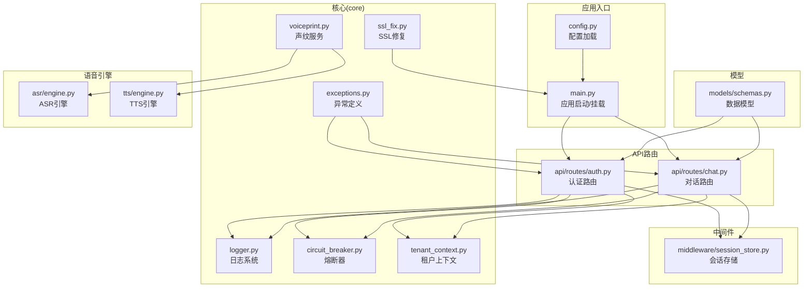
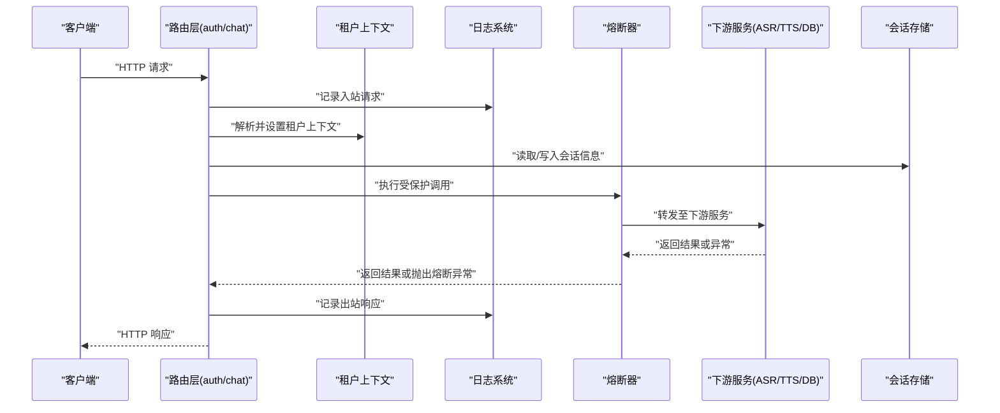
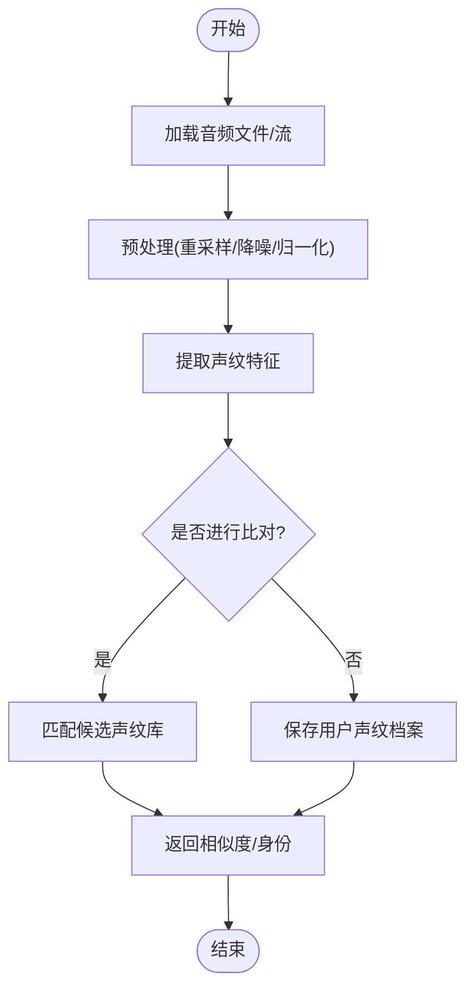
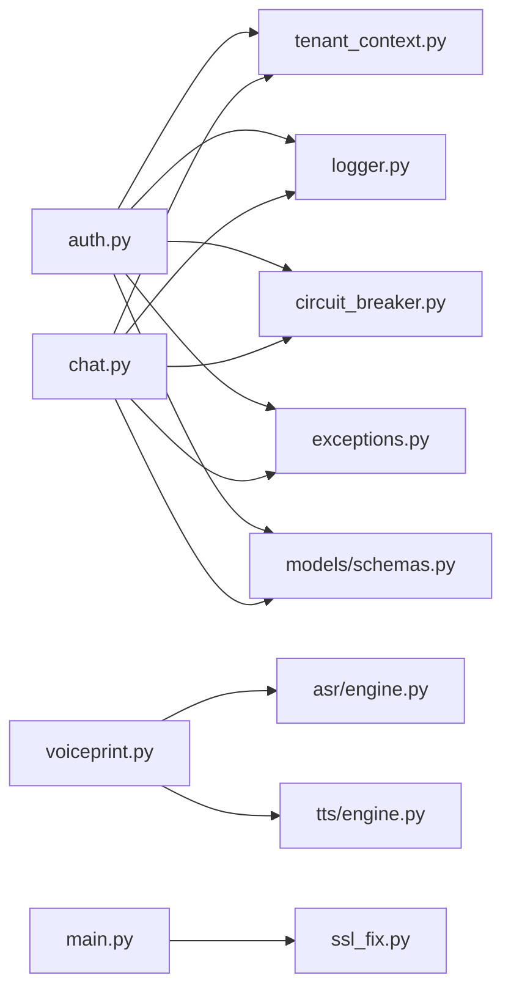

# 核心服务

<cite>
**本文引用的文件**   
- [backend_design/nexus/core/logger.py](file://backend_design/nexus/core/logger.py)
- [backend_design/nexus/core/circuit_breaker.py](file://backend_design/nexus/core/circuit_breaker.py)
- [backend_design/nexus/core/tenant_context.py](file://backend_design/nexus/core/tenant_context.py)
- [backend_design/nexus/core/voiceprint.py](file://backend_design/nexus/core/voiceprint.py)
- [backend_design/nexus/core/ssl_fix.py](file://backend_design/nexus/core/ssl_fix.py)
- [backend_design/nexus/core/exceptions.py](file://backend_design/nexus/core/exceptions.py)
- [backend_design/nexus/config.py](file://backend_design/nexus/config.py)
- [backend_design/nexus/main.py](file://backend_design/nexus/main.py)
- [backend_design/nexus/api/routes/auth.py](file://backend_design/nexus/api/routes/auth.py)
- [backend_design/nexus/api/routes/chat.py](file://backend_design/nexus/api/routes/chat.py)
- [backend_design/nexus/asr/engine.py](file://backend_design/nexus/asr/engine.py)
- [backend_design/nexus/tts/engine.py](file://backend_design/nexus/tts/engine.py)
- [backend_design/nexus/middleware/session_store.py](file://backend_design/nexus/middleware/session_store.py)
- [backend_design/nexus/models/schemas.py](file://backend_design/nexus/models/schemas.py)
</cite>

## 目录
1. [简介](#简介)
2. [项目结构](#项目结构)
3. [核心组件](#核心组件)
4. [架构总览](#架构总览)
5. [详细组件分析](#详细组件分析)
6. [依赖关系分析](#依赖关系分析)
7. [性能考量](#性能考量)
8. [故障排除指南](#故障排除指南)
9. [结论](#结论)
10. [附录](#附录)

## 简介
本文件聚焦 NexusCockpit 的核心基础服务，围绕以下关键能力进行系统化说明：
- 日志记录系统：统一日志配置、结构化输出与可观测性接入点。
- 熔断器模式：对外部依赖的容错保护与快速失败策略。
- 租户上下文管理：请求级租户隔离与传播机制。
- 声纹识别服务集成与音频处理流程：从 ASR/TTS 到声纹注册/比对的关键路径。
- SSL 证书管理与异常处理：安全传输加固与错误分类。
- 通用工具函数与配置选项：扩展点与最佳实践。
- 故障排除指南：常见问题定位与修复建议。

## 项目结构
核心基础服务主要位于 backend_design/nexus/core 目录，配合路由层、中间件、模型与配置模块共同构成后端核心能力。下图展示了与本次文档相关的核心文件及其职责边界。

图表来源
- [backend_design/nexus/core/logger.py](file://backend_design/nexus/core/logger.py)
- [backend_design/nexus/core/circuit_breaker.py](file://backend_design/nexus/core/circuit_breaker.py)
- [backend_design/nexus/core/tenant_context.py](file://backend_design/nexus/core/tenant_context.py)
- [backend_design/nexus/core/voiceprint.py](file://backend_design/nexus/core/voiceprint.py)
- [backend_design/nexus/core/ssl_fix.py](file://backend_design/nexus/core/ssl_fix.py)
- [backend_design/nexus/core/exceptions.py](file://backend_design/nexus/core/exceptions.py)
- [backend_design/nexus/config.py](file://backend_design/nexus/config.py)
- [backend_design/nexus/main.py](file://backend_design/nexus/main.py)
- [backend_design/nexus/api/routes/auth.py](file://backend_design/nexus/api/routes/auth.py)
- [backend_design/nexus/api/routes/chat.py](file://backend_design/nexus/api/routes/chat.py)
- [backend_design/nexus/middleware/session_store.py](file://backend_design/nexus/middleware/session_store.py)
- [backend_design/nexus/models/schemas.py](file://backend_design/nexus/models/schemas.py)
- [backend_design/nexus/asr/engine.py](file://backend_design/nexus/asr/engine.py)
- [backend_design/nexus/tts/engine.py](file://backend_design/nexus/tts/engine.py)

章节来源
- [backend_design/nexus/config.py](file://backend_design/nexus/config.py)
- [backend_design/nexus/main.py](file://backend_design/nexus/main.py)

## 核心组件
本节对日志、熔断器、租户上下文、声纹服务、SSL修复与异常体系进行概览式说明，后续章节将展开深入分析与图示。

- 日志记录系统：提供统一的初始化与分级输出，支持结构化字段注入（如租户ID、请求ID），便于集中采集与检索。
- 熔断器模式：封装外部调用（如第三方 API、数据库、向量库）的失败统计、阈值判定与状态切换，避免雪崩。
- 租户上下文管理：基于线程/协程本地存储实现请求级租户隔离，在中间件或路由入口处解析并注入，贯穿业务链路。
- 声纹识别服务：封装声纹注册、特征提取、比对等能力，并与 ASR/TTS 协同完成端到端语音交互。
- SSL 证书管理：提供证书加载与校验辅助逻辑，确保 HTTPS 通信安全。
- 异常处理：定义领域异常类型与统一错误码，配合全局异常处理器返回一致的错误响应。

章节来源
- [backend_design/nexus/core/logger.py](file://backend_design/nexus/core/logger.py)
- [backend_design/nexus/core/circuit_breaker.py](file://backend_design/nexus/core/circuit_breaker.py)
- [backend_design/nexus/core/tenant_context.py](file://backend_design/nexus/core/tenant_context.py)
- [backend_design/nexus/core/voiceprint.py](file://backend_design/nexus/core/voiceprint.py)
- [backend_design/nexus/core/ssl_fix.py](file://backend_design/nexus/core/ssl_fix.py)
- [backend_design/nexus/core/exceptions.py](file://backend_design/nexus/core/exceptions.py)

## 架构总览
下图展示核心服务在请求生命周期中的协作关系：请求进入后由路由层解析参数、校验权限、注入租户上下文，随后通过熔断器访问下游服务；日志贯穿全链路；声纹服务在需要时调用 ASR/TTS 完成语音处理。

图表来源
- [backend_design/nexus/api/routes/auth.py](file://backend_design/nexus/api/routes/auth.py)
- [backend_design/nexus/api/routes/chat.py](file://backend_design/nexus/api/routes/chat.py)
- [backend_design/nexus/core/tenant_context.py](file://backend_design/nexus/core/tenant_context.py)
- [backend_design/nexus/core/logger.py](file://backend_design/nexus/core/logger.py)
- [backend_design/nexus/core/circuit_breaker.py](file://backend_design/nexus/core/circuit_breaker.py)
- [backend_design/nexus/middleware/session_store.py](file://backend_design/nexus/middleware/session_store.py)
- [backend_design/nexus/asr/engine.py](file://backend_design/nexus/asr/engine.py)
- [backend_design/nexus/tts/engine.py](file://backend_design/nexus/tts/engine.py)

## 详细组件分析

### 日志记录系统
- 设计要点
  - 统一初始化：在应用启动阶段完成日志级别、输出目标与格式化器的配置。
  - 结构化字段：为每条日志附加租户ID、请求ID、操作名等上下文键，便于追踪。
  - 分层输出：区分调试、信息、警告、错误等级，结合可观测平台进行聚合。
- 使用建议
  - 在路由入口与关键分支处记录入参与出参摘要（脱敏）。
  - 对异常路径记录堆栈与上下文快照，缩短排障时间。
- 扩展点
  - 自定义 Formatter/Handler 以适配不同日志后端。
  - 增加采样开关以降低高吞吐场景下的日志开销。

章节来源
- [backend_design/nexus/core/logger.py](file://backend_design/nexus/core/logger.py)

### 熔断器模式
- 设计要点
  - 状态机：Closed → Open → Half-Open，依据失败率/超时次数触发切换。
  - 指标收集：记录成功/失败/拒绝计数与耗时分布，用于动态调优。
  - 降级策略：在 Open 状态下直接返回默认值或缓存结果，保障可用性。
- 使用建议
  - 对不稳定外部依赖（网络IO、第三方API）包裹调用。
  - 合理设置阈值与冷却时间，避免误判与抖动。
- 扩展点
  - 自定义失败判定规则（如按错误码分类）。
  - 接入监控告警，实时感知熔断状态变化。

章节来源
- [backend_design/nexus/core/circuit_breaker.py](file://backend_design/nexus/core/circuit_breaker.py)

### 租户上下文管理
- 设计要点
  - 隔离方式：基于线程/协程本地存储，保证并发安全。
  - 注入时机：在鉴权或网关层解析租户标识并注入上下文。
  - 传播机制：跨模块调用自动携带租户ID，无需显式传递。
- 使用建议
  - 所有持久化查询与缓存键需包含租户维度，防止数据串扰。
  - 在日志中始终打印租户ID，提升问题定位效率。
- 扩展点
  - 支持多租户策略（如按域名、Header、JWT Claim）。
  - 提供上下文快照与审计日志接口。

章节来源
- [backend_design/nexus/core/tenant_context.py](file://backend_design/nexus/core/tenant_context.py)
- [backend_design/nexus/api/routes/auth.py](file://backend_design/nexus/api/routes/auth.py)

### 声纹识别服务与音频处理流程
- 设计要点
  - 声纹服务：封装注册、特征提取、比对等能力，内部复用 ASR/TTS 提供的音频处理能力。
  - 音频处理：统一采样率、声道数与编码格式，确保模型输入一致性。
  - 错误处理：对音频解码失败、模型推理异常进行捕获与重试。
- 流程示意

图表来源
- [backend_design/nexus/core/voiceprint.py](file://backend_design/nexus/core/voiceprint.py)
- [backend_design/nexus/asr/engine.py](file://backend_design/nexus/asr/engine.py)
- [backend_design/nexus/tts/engine.py](file://backend_design/nexus/tts/engine.py)

章节来源
- [backend_design/nexus/core/voiceprint.py](file://backend_design/nexus/core/voiceprint.py)
- [backend_design/nexus/asr/engine.py](file://backend_design/nexus/asr/engine.py)
- [backend_design/nexus/tts/engine.py](file://backend_design/nexus/tts/engine.py)

### SSL 证书管理
- 设计要点
  - 证书加载：支持 PEM/CRT 格式，校验有效期与链完整性。
  - 运行时修复：针对特定环境（如容器、代理）的 SSL 握手问题进行兼容处理。
  - 密钥轮换：提供热更新或重启重载策略，降低停机影响。
- 使用建议
  - 在生产环境启用强制 HTTPS，禁用弱加密套件。
  - 定期巡检证书过期时间，提前续期。

章节来源
- [backend_design/nexus/core/ssl_fix.py](file://backend_design/nexus/core/ssl_fix.py)
- [backend_design/nexus/main.py](file://backend_design/nexus/main.py)

### 异常处理与通用工具
- 异常体系
  - 领域异常：按功能域划分（认证、权限、资源不存在、参数非法等）。
  - 错误码：统一错误码规范，便于前端与监控对接。
  - 全局处理器：捕获未处理异常，转换为标准 JSON 响应。
- 通用工具
  - 配置加载：集中读取环境变量与配置文件，提供默认值与校验。
  - 序列化/反序列化：基于 Pydantic 的数据模型校验与转换。
  - 时间/ID生成：提供单调递增ID与时间戳工具。

章节来源
- [backend_design/nexus/core/exceptions.py](file://backend_design/nexus/core/exceptions.py)
- [backend_design/nexus/config.py](file://backend_design/nexus/config.py)
- [backend_design/nexus/models/schemas.py](file://backend_design/nexus/models/schemas.py)

## 依赖关系分析
核心组件之间的耦合关系如下：
- 路由层依赖租户上下文与日志系统，并通过熔断器访问下游服务。
- 声纹服务依赖 ASR/TTS 引擎进行音频处理。
- SSL 修复与应用主进程绑定，确保启动阶段完成安全配置。
- 异常与模型定义被多处引用，形成稳定的契约层。

图表来源
- [backend_design/nexus/api/routes/auth.py](file://backend_design/nexus/api/routes/auth.py)
- [backend_design/nexus/api/routes/chat.py](file://backend_design/nexus/api/routes/chat.py)
- [backend_design/nexus/core/tenant_context.py](file://backend_design/nexus/core/tenant_context.py)
- [backend_design/nexus/core/logger.py](file://backend_design/nexus/core/logger.py)
- [backend_design/nexus/core/circuit_breaker.py](file://backend_design/nexus/core/circuit_breaker.py)
- [backend_design/nexus/core/voiceprint.py](file://backend_design/nexus/core/voiceprint.py)
- [backend_design/nexus/asr/engine.py](file://backend_design/nexus/asr/engine.py)
- [backend_design/nexus/tts/engine.py](file://backend_design/nexus/tts/engine.py)
- [backend_design/nexus/core/ssl_fix.py](file://backend_design/nexus/core/ssl_fix.py)
- [backend_design/nexus/core/exceptions.py](file://backend_design/nexus/core/exceptions.py)
- [backend_design/nexus/models/schemas.py](file://backend_design/nexus/models/schemas.py)
- [backend_design/nexus/main.py](file://backend_design/nexus/main.py)

章节来源
- [backend_design/nexus/api/routes/auth.py](file://backend_design/nexus/api/routes/auth.py)
- [backend_design/nexus/api/routes/chat.py](file://backend_design/nexus/api/routes/chat.py)
- [backend_design/nexus/core/tenant_context.py](file://backend_design/nexus/core/tenant_context.py)
- [backend_design/nexus/core/logger.py](file://backend_design/nexus/core/logger.py)
- [backend_design/nexus/core/circuit_breaker.py](file://backend_design/nexus/core/circuit_breaker.py)
- [backend_design/nexus/core/voiceprint.py](file://backend_design/nexus/core/voiceprint.py)
- [backend_design/nexus/asr/engine.py](file://backend_design/nexus/asr/engine.py)
- [backend_design/nexus/tts/engine.py](file://backend_design/nexus/tts/engine.py)
- [backend_design/nexus/core/ssl_fix.py](file://backend_design/nexus/core/ssl_fix.py)
- [backend_design/nexus/core/exceptions.py](file://backend_design/nexus/core/exceptions.py)
- [backend_design/nexus/models/schemas.py](file://backend_design/nexus/models/schemas.py)
- [backend_design/nexus/main.py](file://backend_design/nexus/main.py)

## 性能考量
- 日志采样：在高并发场景下开启采样，减少磁盘 IO 压力。
- 熔断阈值：根据历史 P99 延迟与错误率动态调整，避免过度保护。
- 上下文开销：租户上下文读写应轻量，避免在热点路径引入锁竞争。
- 音频处理：批量预处理与异步队列可降低峰值 CPU 占用。
- 连接池：对外部服务的连接池大小与超时时间进行压测调优。

[本节为通用指导，不直接分析具体文件]

## 故障排除指南
- 日志无输出或级别不对
  - 检查应用启动阶段的日志初始化与级别配置。
  - 确认输出目标（控制台/文件/远程）可用。
- 熔断频繁触发
  - 查看下游服务健康状态与错误码分布。
  - 调整失败阈值与冷却时间，观察状态切换频率。
- 租户数据串扰
  - 验证上下文注入点是否正确解析租户标识。
  - 检查缓存键与数据库查询是否包含租户维度。
- 声纹比对失败
  - 核对音频格式与采样率是否符合模型要求。
  - 查看推理日志与异常堆栈，定位解码或模型加载问题。
- SSL 握手失败
  - 检查证书链完整性与有效期。
  - 确认代理/负载均衡器透传 SNI 与协议版本。
- 异常响应不一致
  - 确认全局异常处理器已注册且覆盖所有路由。
  - 检查错误码映射与消息模板。

章节来源
- [backend_design/nexus/core/logger.py](file://backend_design/nexus/core/logger.py)
- [backend_design/nexus/core/circuit_breaker.py](file://backend_design/nexus/core/circuit_breaker.py)
- [backend_design/nexus/core/tenant_context.py](file://backend_design/nexus/core/tenant_context.py)
- [backend_design/nexus/core/voiceprint.py](file://backend_design/nexus/core/voiceprint.py)
- [backend_design/nexus/core/ssl_fix.py](file://backend_design/nexus/core/ssl_fix.py)
- [backend_design/nexus/core/exceptions.py](file://backend_design/nexus/core/exceptions.py)

## 结论
NexusCockpit 的核心基础服务通过日志、熔断器、租户上下文、声纹服务、SSL 修复与异常体系构建了稳定、可扩展的后端骨架。遵循本文的配置与最佳实践，可在生产环境中获得良好的可观测性与容错能力。

[本节为总结性内容，不直接分析具体文件]

## 附录
- 配置项速览
  - 日志：级别、输出目标、采样开关、结构化字段。
  - 熔断：失败阈值、冷却时间、半开探测间隔。
  - 租户：标识来源（Header/JWT）、上下文存储策略。
  - SSL：证书路径、私钥路径、协议版本、加密套件。
  - 声纹：采样率、模型路径、相似度阈值。
- 扩展点清单
  - 自定义日志 Handler/Formatter。
  - 熔断失败判定规则与告警回调。
  - 租户解析策略与审计钩子。
  - 声纹模型替换与特征对齐接口。
  - 全局异常处理器与错误码映射表。

[本节为补充信息，不直接分析具体文件]