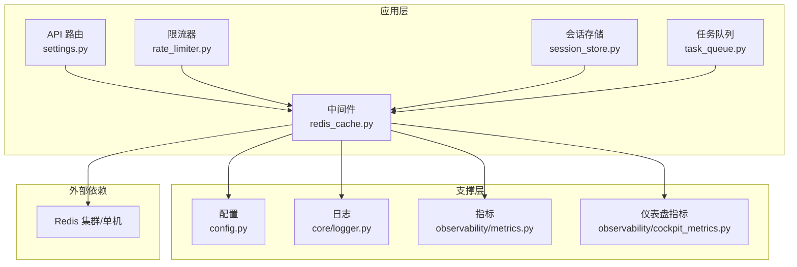
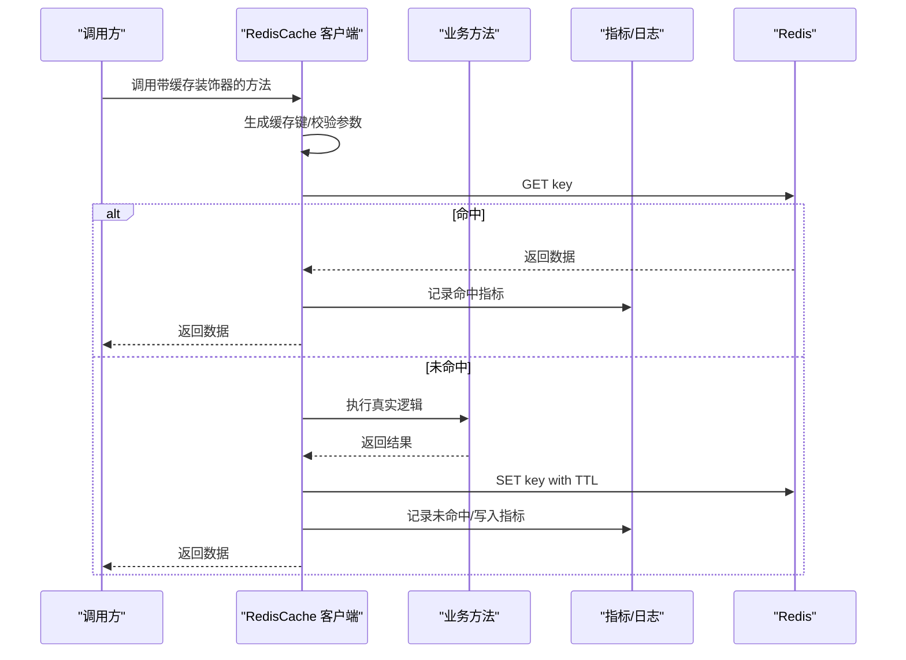
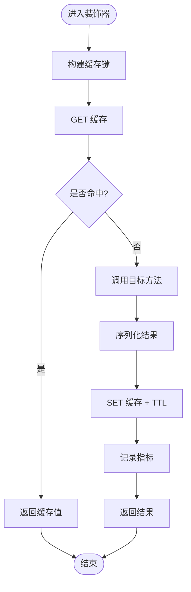
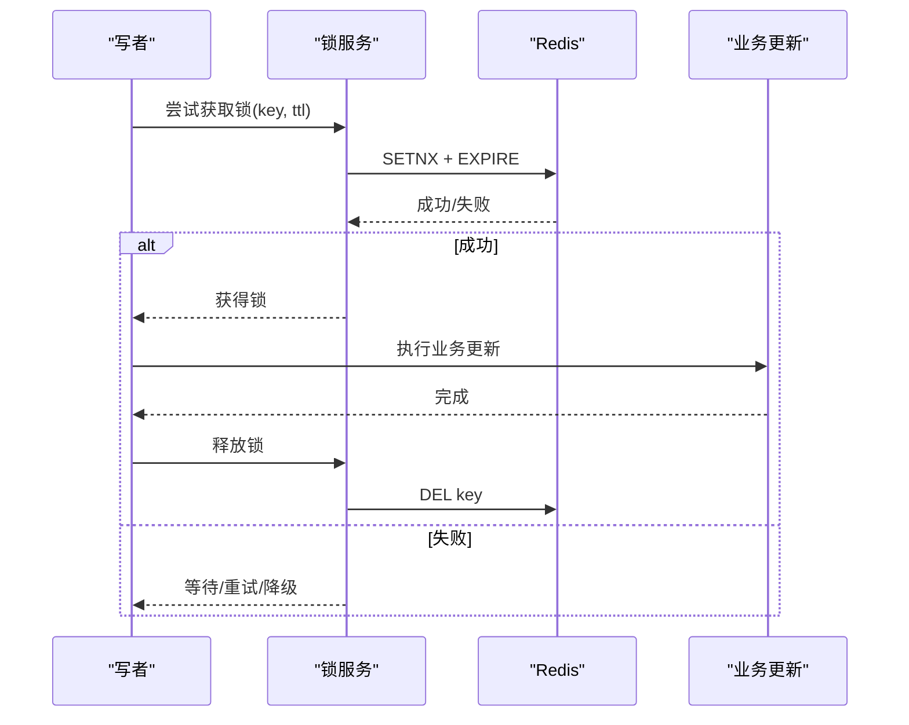
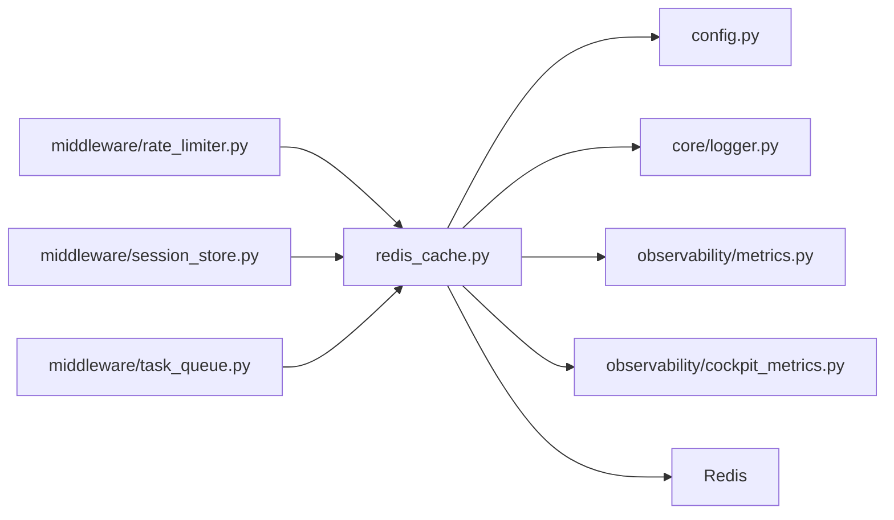

# 缓存服务

<cite>
**本文引用的文件**   
- [backend_design/nexus/middleware/redis_cache.py](file://backend_design/nexus/middleware/redis_cache.py)
- [backend_design/nexus/config.py](file://backend_design/nexus/config.py)
- [backend_design/nexus/core/logger.py](file://backend_design/nexus/core/logger.py)
- [backend_design/nexus/api/routes/settings.py](file://backend_design/nexus/api/routes/settings.py)
- [backend_design/nexus/observability/metrics.py](file://backend_design/nexus/observability/metrics.py)
- [backend_design/nexus/observability/cockpit_metrics.py](file://backend_design/nexus/observability/cockpit_metrics.py)
- [backend_design/nexus/middleware/rate_limiter.py](file://backend_design/nexus/middleware/rate_limiter.py)
- [backend_design/nexus/middleware/session_store.py](file://backend_design/nexus/middleware/session_store.py)
- [backend_design/nexus/middleware/task_queue.py](file://backend_design/nexus/middleware/task_queue.py)
</cite>

## 目录
1. [简介](#简介)
2. [项目结构](#项目结构)
3. [核心组件](#核心组件)
4. [架构总览](#架构总览)
5. [详细组件分析](#详细组件分析)
6. [依赖分析](#依赖分析)
7. [性能考虑](#性能考虑)
8. [故障排查指南](#故障排查指南)
9. [结论](#结论)
10. [附录](#附录)

## 简介
本文件为 NexusCockpit 的 Redis 缓存服务提供系统化技术文档，覆盖缓存策略设计、键生成与过期管理、穿透防护、一致性保证与分布式锁、预热与批量操作、监控指标、失效策略配置以及自定义后端扩展等主题。目标是帮助读者快速理解并正确使用该缓存层，同时为后续演进与扩展提供清晰路径。

## 项目结构
NexusCockpit 在后端模块中通过中间件方式集成 Redis 缓存能力，主要位于 middleware 子包内；配置集中于 config 模块；可观测性由 observability 模块提供；部分业务场景（如限流、会话存储、任务队列）复用同一缓存基础设施。

图表来源
- [backend_design/nexus/middleware/redis_cache.py](file://backend_design/nexus/middleware/redis_cache.py)
- [backend_design/nexus/config.py](file://backend_design/nexus/config.py)
- [backend_design/nexus/core/logger.py](file://backend_design/nexus/core/logger.py)
- [backend_design/nexus/observability/metrics.py](file://backend_design/nexus/observability/metrics.py)
- [backend_design/nexus/observability/cockpit_metrics.py](file://backend_design/nexus/observability/cockpit_metrics.py)
- [backend_design/nexus/middleware/rate_limiter.py](file://backend_design/nexus/middleware/rate_limiter.py)
- [backend_design/nexus/middleware/session_store.py](file://backend_design/nexus/middleware/session_store.py)
- [backend_design/nexus/middleware/task_queue.py](file://backend_design/nexus/middleware/task_queue.py)

章节来源
- [backend_design/nexus/middleware/redis_cache.py](file://backend_design/nexus/middleware/redis_cache.py)
- [backend_design/nexus/config.py](file://backend_design/nexus/config.py)
- [backend_design/nexus/core/logger.py](file://backend_design/nexus/core/logger.py)
- [backend_design/nexus/observability/metrics.py](file://backend_design/nexus/observability/metrics.py)
- [backend_design/nexus/observability/cockpit_metrics.py](file://backend_design/nexus/observability/cockpit_metrics.py)
- [backend_design/nexus/middleware/rate_limiter.py](file://backend_design/nexus/middleware/rate_limiter.py)
- [backend_design/nexus/middleware/session_store.py](file://backend_design/nexus/middleware/session_store.py)
- [backend_design/nexus/middleware/task_queue.py](file://backend_design/nexus/middleware/task_queue.py)

## 核心组件
- 缓存客户端与装饰器：提供统一的 get/set/del 接口、TTL 管理、序列化/反序列化、错误处理与指标上报。
- 键空间与命名规范：按租户、资源域、业务维度组织键前缀，避免冲突并便于清理。
- 过期策略：支持固定 TTL、惰性删除与定期扫描结合，兼顾命中率与内存占用。
- 穿透防护：空值缓存、布隆过滤器或请求去抖等机制可选。
- 一致性保障：写扩散+短 TTL 为主，必要时配合分布式锁与版本号控制。
- 分布式锁：基于原子操作的轻量锁实现，支持超时与重试。
- 预热与批量：启动时按需加载热点数据，批量读写减少网络往返。
- 监控与可观测性：命中/未命中、延迟、错误率、锁竞争等指标暴露。
- 配置化：集中式配置项驱动行为，支持运行时调整。

章节来源
- [backend_design/nexus/middleware/redis_cache.py](file://backend_design/nexus/middleware/redis_cache.py)
- [backend_design/nexus/config.py](file://backend_design/nexus/config.py)
- [backend_design/nexus/observability/metrics.py](file://backend_design/nexus/observability/metrics.py)
- [backend_design/nexus/observability/cockpit_metrics.py](file://backend_design/nexus/observability/cockpit_metrics.py)

## 架构总览
下图展示了缓存服务在请求链路中的位置与交互关系，包括装饰器拦截、键生成、TTL 管理、指标上报与异常降级。

图表来源
- [backend_design/nexus/middleware/redis_cache.py](file://backend_design/nexus/middleware/redis_cache.py)
- [backend_design/nexus/observability/metrics.py](file://backend_design/nexus/observability/metrics.py)

## 详细组件分析

### 缓存客户端与装饰器
- 职责
  - 封装 Redis 连接池与命令执行。
  - 提供 get/set/del 及批量操作接口。
  - 通过装饰器对函数返回值进行缓存，自动处理序列化、TTL 与异常。
- 关键流程
  - 键生成：组合租户、命名空间、方法名与入参签名，确保唯一性与可读性。
  - 序列化：统一 JSON/MessagePack 等格式，兼容不同版本。
  - 过期管理：支持绝对过期与相对过期，默认 TTL 可配置。
  - 错误处理：连接失败、超时、序列化异常均做降级与告警。
  - 指标上报：命中/未命中、延迟分位、错误计数。
- 使用建议
  - 对幂等且读多写少的接口优先加缓存。
  - 合理设置 TTL，避免长尾热点导致雪崩。
  - 大对象拆分或压缩，注意序列化成本。

图表来源
- [backend_design/nexus/middleware/redis_cache.py](file://backend_design/nexus/middleware/redis_cache.py)

章节来源
- [backend_design/nexus/middleware/redis_cache.py](file://backend_design/nexus/middleware/redis_cache.py)

### 键空间与命名规范
- 命名模式
  - 典型结构：tenant:domain:key:...
  - 示例域：user, vehicle, cockpit, settings
- 设计原则
  - 唯一性：包含租户与上下文信息，避免跨租户污染。
  - 可读性：便于定位问题与批量清理。
  - 可扩展性：预留层级，便于未来新增域。
- 最佳实践
  - 对复杂对象采用结构化键，避免过长键名。
  - 对集合类数据使用 Hash/Set/ZSet 等原生结构。

章节来源
- [backend_design/nexus/middleware/redis_cache.py](file://backend_design/nexus/middleware/redis_cache.py)

### 过期时间管理与失效策略
- 策略类型
  - 固定 TTL：适用于时效性明确的热点数据。
  - 惰性删除：读取时发现过期再刷新。
  - 定期扫描：后台任务清理过期键，降低内存压力。
- 配置项
  - 全局默认 TTL、最大 TTL、最小 TTL。
  - 按域或键前缀覆盖 TTL。
- 注意事项
  - 避免大量键同时过期造成雪崩，可采用随机抖动。
  - 热点键适当延长 TTL 并配合主动刷新。

章节来源
- [backend_design/nexus/middleware/redis_cache.py](file://backend_design/nexus/middleware/redis_cache.py)
- [backend_design/nexus/config.py](file://backend_design/nexus/config.py)

### 缓存穿透防护
- 风险
  - 恶意或异常查询导致大量未命中，击穿至下游。
- 防护手段
  - 空值缓存：对不存在的数据写入短 TTL 占位值。
  - 布隆过滤器：快速判断键是否存在，过滤无效请求。
  - 请求去抖：并发下合并重复计算，避免瞬时放大。
- 选择建议
  - 小范围热点可用空值缓存。
  - 大规模未知键场景推荐布隆过滤器。

章节来源
- [backend_design/nexus/middleware/redis_cache.py](file://backend_design/nexus/middleware/redis_cache.py)

### 缓存一致性与分布式锁
- 一致性模型
  - 最终一致：写后更新缓存并设置较短 TTL，容忍短暂不一致。
  - 强一致：通过分布式锁串行化写路径，代价较高。
- 分布式锁实现要点
  - 原子性：基于 SETNX/EXPIRE 或 Lua 脚本保证原子。
  - 超时释放：防止死锁，设置合理锁超时。
  - 重入与续期：支持可重入与看门狗续期。
- 适用场景
  - 库存扣减、配置热更、热点键重建等。

图表来源
- [backend_design/nexus/middleware/redis_cache.py](file://backend_design/nexus/middleware/redis_cache.py)

章节来源
- [backend_design/nexus/middleware/redis_cache.py](file://backend_design/nexus/middleware/redis_cache.py)

### 缓存预热与批量操作
- 预热
  - 启动阶段加载热点键，缩短冷启动延迟。
  - 支持增量预热与灰度预热。
- 批量
  - 批量 GET/SET/HGETALL/MGET 等，减少网络往返。
  - 注意事务与回滚语义，避免部分成功。
- 监控
  - 预热成功率、耗时、失败原因统计。

章节来源
- [backend_design/nexus/middleware/redis_cache.py](file://backend_design/nexus/middleware/redis_cache.py)

### 监控与可观测性
- 指标
  - 命中率、未命中率、P95/P99 延迟、错误数、锁竞争次数。
- 集成
  - 与 metrics 模块对接，输出 Prometheus 格式。
  - 仪表盘聚合展示，便于容量规划与问题定位。
- 日志
  - 关键路径打点，包含键空间、耗时、状态码。

章节来源
- [backend_design/nexus/observability/metrics.py](file://backend_design/nexus/observability/metrics.py)
- [backend_design/nexus/observability/cockpit_metrics.py](file://backend_design/nexus/observability/cockpit_metrics.py)
- [backend_design/nexus/core/logger.py](file://backend_design/nexus/core/logger.py)

### 配置项与运行时调整
- 配置来源
  - 配置文件与环境变量，支持分层覆盖。
- 关键项
  - 连接地址、密码、数据库索引、连接池大小。
  - 默认 TTL、最大 TTL、最小 TTL。
  - 序列化格式、压缩开关。
  - 预热开关、预热列表。
  - 指标开关、采样率。
- 动态调整
  - 通过设置接口或配置中心热更新，无需重启。

章节来源
- [backend_design/nexus/config.py](file://backend_design/nexus/config.py)
- [backend_design/nexus/api/routes/settings.py](file://backend_design/nexus/api/routes/settings.py)

### 与其他中间件的协作
- 限流器
  - 基于滑动窗口或令牌桶，使用 Redis 原子计数。
- 会话存储
  - 用户会话持久化到 Redis，支持过期与滚动续期。
- 任务队列
  - 简单队列或优先级队列，利用 List/ZSet 实现。

章节来源
- [backend_design/nexus/middleware/rate_limiter.py](file://backend_design/nexus/middleware/rate_limiter.py)
- [backend_design/nexus/middleware/session_store.py](file://backend_design/nexus/middleware/session_store.py)
- [backend_design/nexus/middleware/task_queue.py](file://backend_design/nexus/middleware/task_queue.py)

## 依赖分析
- 内部依赖
  - 配置模块：提供连接参数与行为开关。
  - 日志模块：记录关键事件与诊断信息。
  - 指标模块：采集与导出运行指标。
- 外部依赖
  - Redis：主数据存储与原子操作载体。
- 耦合与内聚
  - 缓存客户端高内聚，对外暴露稳定接口。
  - 通过装饰器与工具函数降低业务侵入性。

图表来源
- [backend_design/nexus/middleware/redis_cache.py](file://backend_design/nexus/middleware/redis_cache.py)
- [backend_design/nexus/config.py](file://backend_design/nexus/config.py)
- [backend_design/nexus/core/logger.py](file://backend_design/nexus/core/logger.py)
- [backend_design/nexus/observability/metrics.py](file://backend_design/nexus/observability/metrics.py)
- [backend_design/nexus/observability/cockpit_metrics.py](file://backend_design/nexus/observability/cockpit_metrics.py)
- [backend_design/nexus/middleware/rate_limiter.py](file://backend_design/nexus/middleware/rate_limiter.py)
- [backend_design/nexus/middleware/session_store.py](file://backend_design/nexus/middleware/session_store.py)
- [backend_design/nexus/middleware/task_queue.py](file://backend_design/nexus/middleware/task_queue.py)

章节来源
- [backend_design/nexus/middleware/redis_cache.py](file://backend_design/nexus/middleware/redis_cache.py)
- [backend_design/nexus/config.py](file://backend_design/nexus/config.py)
- [backend_design/nexus/core/logger.py](file://backend_design/nexus/core/logger.py)
- [backend_design/nexus/observability/metrics.py](file://backend_design/nexus/observability/metrics.py)
- [backend_design/nexus/observability/cockpit_metrics.py](file://backend_design/nexus/observability/cockpit_metrics.py)
- [backend_design/nexus/middleware/rate_limiter.py](file://backend_design/nexus/middleware/rate_limiter.py)
- [backend_design/nexus/middleware/session_store.py](file://backend_design/nexus/middleware/session_store.py)
- [backend_design/nexus/middleware/task_queue.py](file://backend_design/nexus/middleware/task_queue.py)

## 性能考虑
- 连接池
  - 合理设置最大连接数与空闲回收，避免连接风暴。
- 序列化
  - 大对象启用压缩，权衡 CPU 与带宽。
- 批量
  - 尽量合并请求，减少 RTT。
- 热点
  - 局部热点采用本地二级缓存（进程内），降低 Redis 压力。
- 雪崩与击穿
  - TTL 抖动、互斥重建、预取与限流组合。
- 监控
  - 关注 P99 延迟与错误率，及时扩容或优化。

[本节为通用指导，不直接分析具体文件]

## 故障排查指南
- 常见问题
  - 连接失败：检查地址、端口、认证、防火墙。
  - 超时：增大超时阈值或优化慢查询。
  - 序列化异常：确认前后端数据结构一致。
  - 内存不足：清理无用键、调小 TTL、增加实例。
- 定位步骤
  - 查看指标面板：命中率、延迟、错误分布。
  - 检索日志：按键空间与请求 ID 过滤。
  - 复现与压测：构造最小用例验证修复。
- 恢复策略
  - 降级：关闭非关键缓存，保护核心链路。
  - 熔断：对不稳定依赖快速失败。
  - 回滚：回退最近变更的配置或代码。

章节来源
- [backend_design/nexus/core/logger.py](file://backend_design/nexus/core/logger.py)
- [backend_design/nexus/observability/metrics.py](file://backend_design/nexus/observability/metrics.py)
- [backend_design/nexus/observability/cockpit_metrics.py](file://backend_design/nexus/observability/cockpit_metrics.py)

## 结论
NexusCockpit 的 Redis 缓存服务以中间件形式提供统一、可观测、易扩展的缓存能力。通过规范的键空间、灵活的过期策略、完善的穿透防护与一致性方案，以及丰富的监控与配置选项，能够满足多租户、高并发场景下的性能与稳定性需求。建议在业务侧遵循“读多写少优先”“短 TTL 为主”“批量与预热并重”的原则，并结合指标持续优化。

[本节为总结性内容，不直接分析具体文件]

## 附录

### 自定义缓存后端扩展指南
- 抽象接口
  - 定义统一的 get/set/del/get_multi/set_multi 等接口。
  - 约定键空间、序列化、TTL 与错误语义。
- 实现步骤
  - 新建后端实现类，注册到工厂或配置中心。
  - 接入指标与日志，保持可观测性一致。
  - 编写单元测试与集成测试，覆盖异常路径。
- 迁移策略
  - 双写过渡：新旧后端并行写入，逐步切流。
  - 数据迁移：离线清洗与校验，确保一致性。

章节来源
- [backend_design/nexus/middleware/redis_cache.py](file://backend_design/nexus/middleware/redis_cache.py)