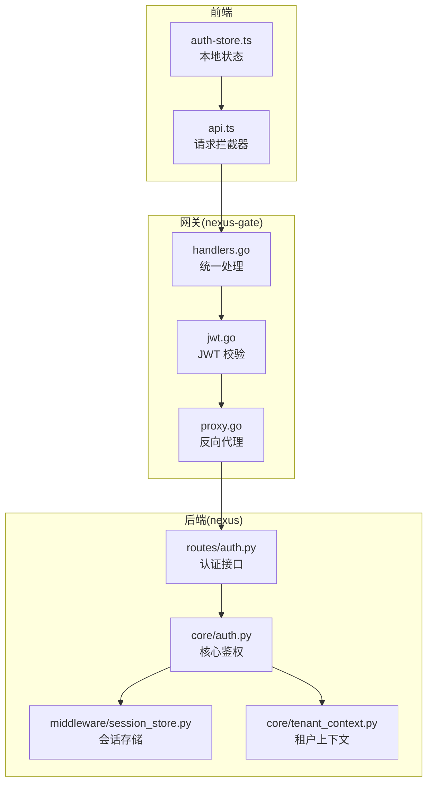
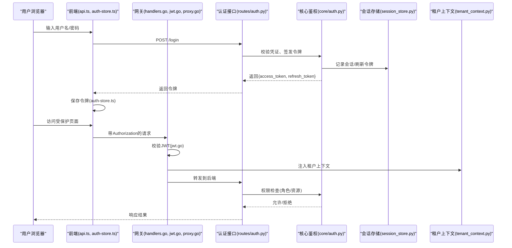
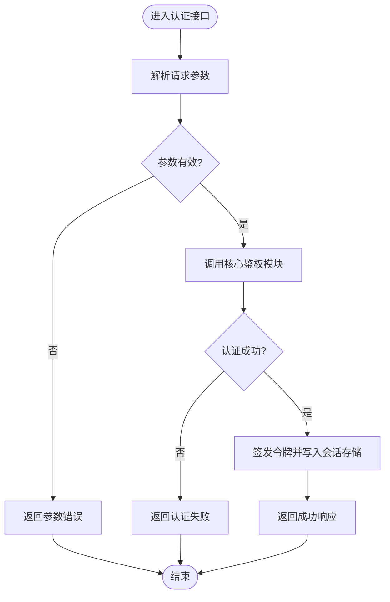
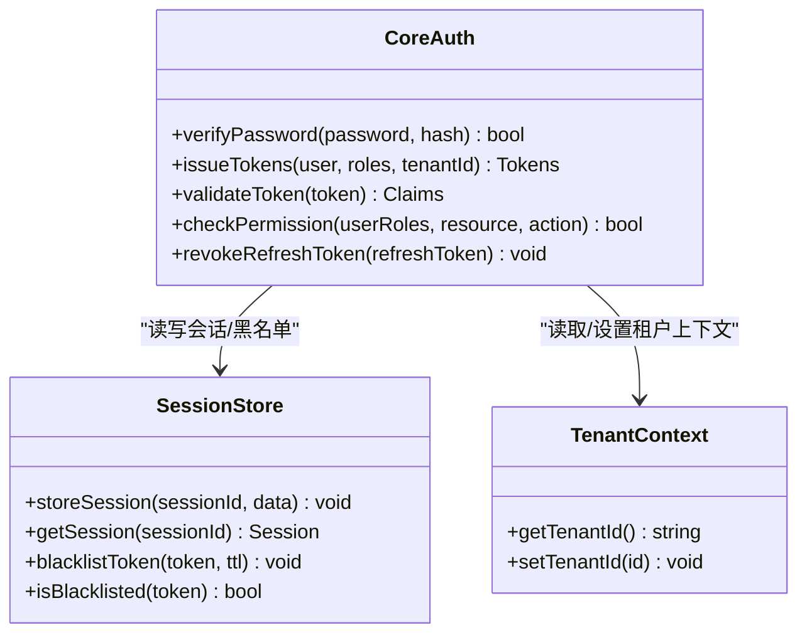
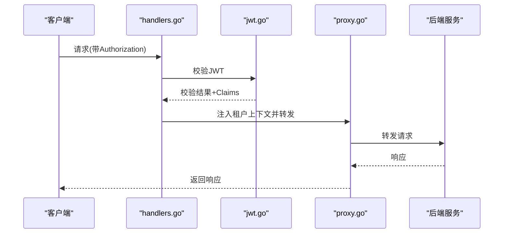
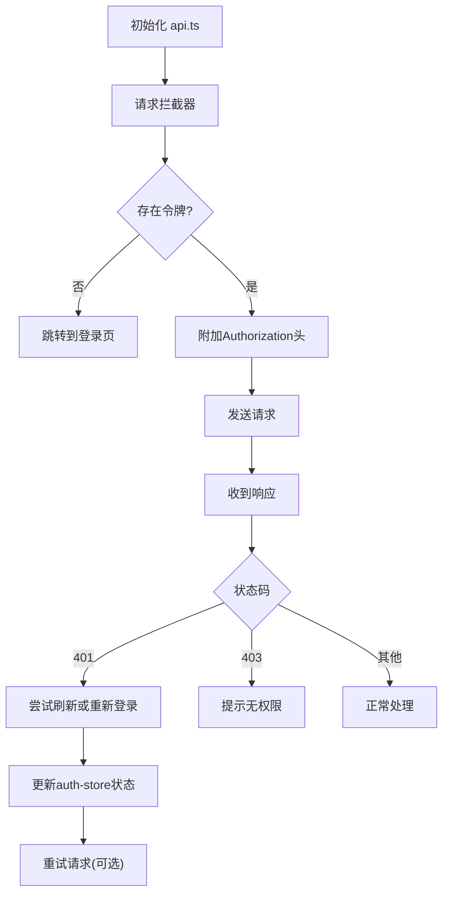
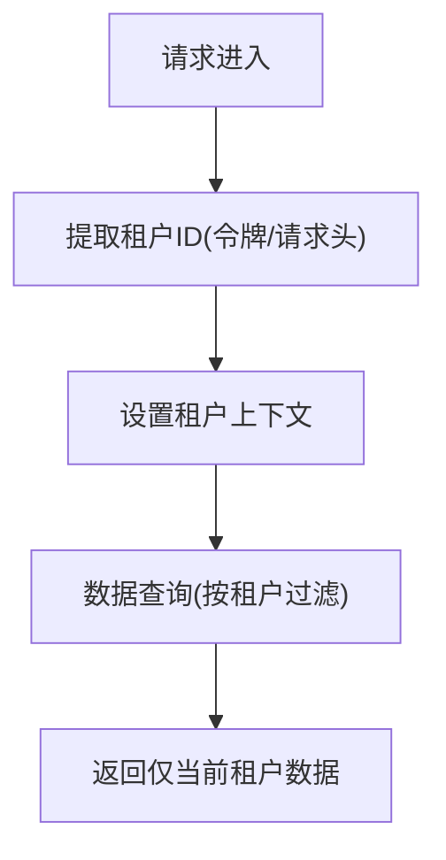
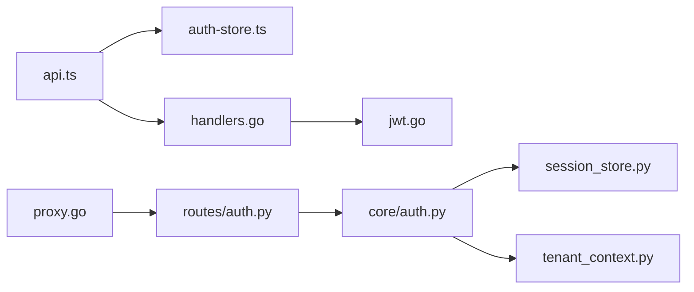

# 认证授权

<cite>
**本文引用的文件**   
- [backend_design/nexus/api/routes/auth.py](file://backend_design/nexus/api/routes/auth.py)
- [backend_design/nexus/core/auth.py](file://backend_design/nexus/core/auth.py)
- [backend_design/nexus/middleware/session_store.py](file://backend_design/nexus/middleware/session_store.py)
- [backend_design/nexus/core/tenant_context.py](file://backend_design/nexus/core/tenant_context.py)
- [backend_design/nexus_gate/internal/auth/jwt.go](file://backend_design/nexus_gate/internal/auth/jwt.go)
- [backend_design/nexus_gate/internal/handlers/handlers.go](file://backend_design/nexus_gate/internal/handlers/handlers.go)
- [backend_design/nexus_gate/internal/proxy/proxy.go](file://backend_design/nexus_gate/internal/proxy/proxy.go)
- [frontend_design/src/stores/auth-store.ts](file://frontend_design/src/stores/auth-store.ts)
- [frontend_design/src/lib/api.ts](file://frontend_design/src/lib/api.ts)
</cite>

## 目录
1. [简介](#简介)
2. [项目结构](#项目结构)
3. [核心组件](#核心组件)
4. [架构总览](#架构总览)
5. [详细组件分析](#详细组件分析)
6. [依赖分析](#依赖分析)
7. [性能考虑](#性能考虑)
8. [故障排查指南](#故障排查指南)
9. [结论](#结论)
10. [附录](#附录)

## 简介
本文件面向 NexusCockpit 的认证与授权子系统，系统性阐述以下主题：
- JWT 令牌机制（生成、校验、刷新、撤销）
- 用户身份验证流程（登录、鉴权、会话管理）
- 权限控制模型（基于角色的访问控制 RBAC、资源级权限）
- 前后端认证集成（前端存储、请求拦截、网关校验）
- 多租户隔离（租户上下文注入与数据隔离）
- 安全策略配置（密码加密、会话策略、审计日志）
- 扩展能力（自定义认证后端、自定义权限规则）

## 项目结构
认证授权相关代码分布在网关层（Go）、业务服务层（Python）以及前端（Next.js）三部分：
- 网关层（nexus-gate）：负责入口鉴权、JWT 校验、转发到后端服务
- 业务服务层（nexus）：提供认证 API、会话存储、租户上下文、核心鉴权逻辑
- 前端：维护登录态、携带令牌发起请求、路由守卫

**图示来源**
- [backend_design/nexus_gate/internal/handlers/handlers.go](file://backend_design/nexus_gate/internal/handlers/handlers.go)
- [backend_design/nexus_gate/internal/auth/jwt.go](file://backend_design/nexus_gate/internal/auth/jwt.go)
- [backend_design/nexus_gate/internal/proxy/proxy.go](file://backend_design/nexus_gate/internal/proxy/proxy.go)
- [backend_design/nexus/api/routes/auth.py](file://backend_design/nexus/api/routes/auth.py)
- [backend_design/nexus/core/auth.py](file://backend_design/nexus/core/auth.py)
- [backend_design/nexus/middleware/session_store.py](file://backend_design/nexus/middleware/session_store.py)
- [backend_design/nexus/core/tenant_context.py](file://backend_design/nexus/core/tenant_context.py)
- [frontend_design/src/lib/api.ts](file://frontend_design/src/lib/api.ts)
- [frontend_design/src/stores/auth-store.ts](file://frontend_design/src/stores/auth-store.ts)

**章节来源**
- [backend_design/nexus/api/routes/auth.py](file://backend_design/nexus/api/routes/auth.py)
- [backend_design/nexus/core/auth.py](file://backend_design/nexus/core/auth.py)
- [backend_design/nexus/middleware/session_store.py](file://backend_design/nexus/middleware/session_store.py)
- [backend_design/nexus/core/tenant_context.py](file://backend_design/nexus/core/tenant_context.py)
- [backend_design/nexus_gate/internal/auth/jwt.go](file://backend_design/nexus_gate/internal/auth/jwt.go)
- [backend_design/nexus_gate/internal/handlers/handlers.go](file://backend_design/nexus_gate/internal/handlers/handlers.go)
- [backend_design/nexus_gate/internal/proxy/proxy.go](file://backend_design/nexus_gate/internal/proxy/proxy.go)
- [frontend_design/src/stores/auth-store.ts](file://frontend_design/src/stores/auth-store.ts)
- [frontend_design/src/lib/api.ts](file://frontend_design/src/lib/api.ts)

## 核心组件
- 认证接口层（routes/auth.py）：暴露登录、登出、刷新令牌等 HTTP 接口，接收凭证并调用核心鉴权模块。
- 核心鉴权（core/auth.py）：实现密码校验、令牌签发与校验、权限判定、角色与资源映射。
- 会话存储（middleware/session_store.py）：持久化会话信息（如黑名单、刷新令牌），支持过期清理。
- 租户上下文（core/tenant_context.py）：在请求链路中注入当前租户标识，驱动后续数据隔离。
- 网关鉴权（nexus-gate jwt.go + handlers.go + proxy.go）：在入口校验 JWT，透传用户与租户信息至后端。
- 前端集成（api.ts + auth-store.ts）：保存令牌、自动附加 Authorization 头、处理未授权跳转。

**章节来源**
- [backend_design/nexus/api/routes/auth.py](file://backend_design/nexus/api/routes/auth.py)
- [backend_design/nexus/core/auth.py](file://backend_design/nexus/core/auth.py)
- [backend_design/nexus/middleware/session_store.py](file://backend_design/nexus/middleware/session_store.py)
- [backend_design/nexus/core/tenant_context.py](file://backend_design/nexus/core/tenant_context.py)
- [backend_design/nexus_gate/internal/auth/jwt.go](file://backend_design/nexus_gate/internal/auth/jwt.go)
- [backend_design/nexus_gate/internal/handlers/handlers.go](file://backend_design/nexus_gate/internal/handlers/handlers.go)
- [backend_design/nexus_gate/internal/proxy/proxy.go](file://backend_design/nexus_gate/internal/proxy/proxy.go)
- [frontend_design/src/stores/auth-store.ts](file://frontend_design/src/stores/auth-store.ts)
- [frontend_design/src/lib/api.ts](file://frontend_design/src/lib/api.ts)

## 架构总览
整体采用“网关前置校验 + 后端细粒度鉴权”的分层模式：
- 网关层快速拒绝非法或过期令牌，降低后端压力
- 后端根据角色与资源进行细粒度权限控制
- 通过租户上下文实现多租户数据隔离
- 前端集中管理令牌生命周期与请求拦截

**图示来源**
- [frontend_design/src/lib/api.ts](file://frontend_design/src/lib/api.ts)
- [frontend_design/src/stores/auth-store.ts](file://frontend_design/src/stores/auth-store.ts)
- [backend_design/nexus_gate/internal/handlers/handlers.go](file://backend_design/nexus_gate/internal/handlers/handlers.go)
- [backend_design/nexus_gate/internal/auth/jwt.go](file://backend_design/nexus_gate/internal/auth/jwt.go)
- [backend_design/nexus_gate/internal/proxy/proxy.go](file://backend_design/nexus_gate/internal/proxy/proxy.go)
- [backend_design/nexus/api/routes/auth.py](file://backend_design/nexus/api/routes/auth.py)
- [backend_design/nexus/core/auth.py](file://backend_design/nexus/core/auth.py)
- [backend_design/nexus/middleware/session_store.py](file://backend_design/nexus/middleware/session_store.py)
- [backend_design/nexus/core/tenant_context.py](file://backend_design/nexus/core/tenant_context.py)

## 详细组件分析

### 认证接口层（routes/auth.py）
职责：
- 提供登录、登出、刷新令牌等 REST 接口
- 解析请求体、参数校验、错误码封装
- 调用核心鉴权模块完成认证与授权

关键流程：
- 登录：校验凭证 -> 签发 access/refresh token -> 写入会话存储 -> 返回令牌
- 登出：将 access token 加入黑名单或使刷新令牌失效
- 刷新：校验 refresh token -> 签发新 access token

**图示来源**
- [backend_design/nexus/api/routes/auth.py](file://backend_design/nexus/api/routes/auth.py)
- [backend_design/nexus/core/auth.py](file://backend_design/nexus/core/auth.py)
- [backend_design/nexus/middleware/session_store.py](file://backend_design/nexus/middleware/session_store.py)

**章节来源**
- [backend_design/nexus/api/routes/auth.py](file://backend_design/nexus/api/routes/auth.py)

### 核心鉴权（core/auth.py）
职责：
- 密码校验（哈希比对）
- JWT 签发与校验（含签名、过期时间、载荷字段）
- 权限判定（RBAC：角色-资源-动作）
- 会话与黑名单管理（与 session_store 协作）

关键点：
- 密码加密：使用强哈希算法（如 bcrypt/scrypt/argon2）存储与校验
- JWT 载荷：包含用户标识、角色列表、租户 ID、签发时间、过期时间
- 权限模型：以角色为中心，结合资源与动作进行细粒度控制
- 会话策略：支持刷新令牌轮换、登出即失效、并发会话限制

**图示来源**
- [backend_design/nexus/core/auth.py](file://backend_design/nexus/core/auth.py)
- [backend_design/nexus/middleware/session_store.py](file://backend_design/nexus/middleware/session_store.py)
- [backend_design/nexus/core/tenant_context.py](file://backend_design/nexus/core/tenant_context.py)

**章节来源**
- [backend_design/nexus/core/auth.py](file://backend_design/nexus/core/auth.py)
- [backend_design/nexus/middleware/session_store.py](file://backend_design/nexus/middleware/session_store.py)
- [backend_design/nexus/core/tenant_context.py](file://backend_design/nexus/core/tenant_context.py)

### 网关鉴权（nexus-gate）
职责：
- 统一入口处理（handlers.go）
- JWT 校验（jwt.go）
- 反向代理转发（proxy.go）

流程要点：
- 从请求头提取 Authorization Bearer Token
- 校验签名、过期时间、必要载荷（用户、角色、租户）
- 校验通过后注入 X-Tenant-ID 等上下文头，转发至后端

**图示来源**
- [backend_design/nexus_gate/internal/handlers/handlers.go](file://backend_design/nexus_gate/internal/handlers/handlers.go)
- [backend_design/nexus_gate/internal/auth/jwt.go](file://backend_design/nexus_gate/internal/auth/jwt.go)
- [backend_design/nexus_gate/internal/proxy/proxy.go](file://backend_design/nexus_gate/internal/proxy/proxy.go)

**章节来源**
- [backend_design/nexus_gate/internal/handlers/handlers.go](file://backend_design/nexus_gate/internal/handlers/handlers.go)
- [backend_design/nexus_gate/internal/auth/jwt.go](file://backend_design/nexus_gate/internal/auth/jwt.go)
- [backend_design/nexus_gate/internal/proxy/proxy.go](file://backend_design/nexus_gate/internal/proxy/proxy.go)

### 前端集成（api.ts + auth-store.ts）
职责：
- 维护登录态与令牌缓存
- 请求拦截：自动附加 Authorization 头
- 响应拦截：处理 401/403，触发重新登录或刷新令牌

**图示来源**
- [frontend_design/src/lib/api.ts](file://frontend_design/src/lib/api.ts)
- [frontend_design/src/stores/auth-store.ts](file://frontend_design/src/stores/auth-store.ts)

**章节来源**
- [frontend_design/src/lib/api.ts](file://frontend_design/src/lib/api.ts)
- [frontend_design/src/stores/auth-store.ts](file://frontend_design/src/stores/auth-store.ts)

### 多租户隔离（tenant_context.py）
职责：
- 从请求上下文获取租户标识（来自网关注入或令牌载荷）
- 为后续数据查询与资源访问提供租户过滤条件
- 确保跨租户数据不可见

**图示来源**
- [backend_design/nexus/core/tenant_context.py](file://backend_design/nexus/core/tenant_context.py)

**章节来源**
- [backend_design/nexus/core/tenant_context.py](file://backend_design/nexus/core/tenant_context.py)

## 依赖分析
- 网关对 JWT 库的依赖用于签名校验与载荷解析
- 后端鉴权模块依赖会话存储（Redis/内存）与租户上下文
- 前端依赖本地存储（localStorage/cookie）与网络请求库

**图示来源**
- [frontend_design/src/lib/api.ts](file://frontend_design/src/lib/api.ts)
- [frontend_design/src/stores/auth-store.ts](file://frontend_design/src/stores/auth-store.ts)
- [backend_design/nexus_gate/internal/handlers/handlers.go](file://backend_design/nexus_gate/internal/handlers/handlers.go)
- [backend_design/nexus_gate/internal/auth/jwt.go](file://backend_design/nexus_gate/internal/auth/jwt.go)
- [backend_design/nexus_gate/internal/proxy/proxy.go](file://backend_design/nexus_gate/internal/proxy/proxy.go)
- [backend_design/nexus/api/routes/auth.py](file://backend_design/nexus/api/routes/auth.py)
- [backend_design/nexus/core/auth.py](file://backend_design/nexus/core/auth.py)
- [backend_design/nexus/middleware/session_store.py](file://backend_design/nexus/middleware/session_store.py)
- [backend_design/nexus/core/tenant_context.py](file://backend_design/nexus/core/tenant_context.py)

**章节来源**
- [backend_design/nexus/api/routes/auth.py](file://backend_design/nexus/api/routes/auth.py)
- [backend_design/nexus/core/auth.py](file://backend_design/nexus/core/auth.py)
- [backend_design/nexus/middleware/session_store.py](file://backend_design/nexus/middleware/session_store.py)
- [backend_design/nexus/core/tenant_context.py](file://backend_design/nexus/core/tenant_context.py)
- [backend_design/nexus_gate/internal/auth/jwt.go](file://backend_design/nexus_gate/internal/auth/jwt.go)
- [backend_design/nexus_gate/internal/handlers/handlers.go](file://backend_design/nexus_gate/internal/handlers/handlers.go)
- [backend_design/nexus_gate/internal/proxy/proxy.go](file://backend_design/nexus_gate/internal/proxy/proxy.go)
- [frontend_design/src/stores/auth-store.ts](file://frontend_design/src/stores/auth-store.ts)
- [frontend_design/src/lib/api.ts](file://frontend_design/src/lib/api.ts)

## 性能考虑
- 网关层 JWT 校验应使用高效库并启用缓存（公钥/密钥缓存）
- 会话存储建议使用 Redis，避免频繁磁盘 IO
- 权限判定可引入缓存（角色-资源-动作映射）以减少计算开销
- 前端令牌刷新应避免重复刷新，采用去抖与队列机制
- 批量操作时合并权限检查，减少多次鉴权调用

[本节为通用指导，不直接分析具体文件]

## 故障排查指南
常见问题与定位步骤：
- 401 未授权：检查前端是否携带 Authorization 头；确认 JWT 未过期且签名正确；核对网关与后端密钥一致
- 403 无权限：检查用户角色与资源权限映射；确认权限规则是否覆盖目标资源
- 会话异常：检查会话存储连通性与 TTL 配置；确认登出后令牌是否被加入黑名单
- 多租户数据错乱：确认租户上下文是否正确注入；检查数据查询是否按租户过滤

建议日志与审计：
- 记录登录成功/失败、令牌签发/刷新、权限拒绝事件
- 审计日志包含用户 ID、租户 ID、资源、动作、IP、时间戳
- 对敏感操作（管理员变更、权限调整）进行额外审计

**章节来源**
- [backend_design/nexus/api/routes/auth.py](file://backend_design/nexus/api/routes/auth.py)
- [backend_design/nexus/core/auth.py](file://backend_design/nexus/core/auth.py)
- [backend_design/nexus/middleware/session_store.py](file://backend_design/nexus/middleware/session_store.py)
- [backend_design/nexus/core/tenant_context.py](file://backend_design/nexus/core/tenant_context.py)
- [backend_design/nexus_gate/internal/auth/jwt.go](file://backend_design/nexus_gate/internal/auth/jwt.go)
- [backend_design/nexus_gate/internal/handlers/handlers.go](file://backend_design/nexus_gate/internal/handlers/handlers.go)
- [backend_design/nexus_gate/internal/proxy/proxy.go](file://backend_design/nexus_gate/internal/proxy/proxy.go)
- [frontend_design/src/lib/api.ts](file://frontend_design/src/lib/api.ts)
- [frontend_design/src/stores/auth-store.ts](file://frontend_design/src/stores/auth-store.ts)

## 结论
NexusCockpit 的认证授权体系通过网关前置校验与后端细粒度鉴权的分层设计，实现了高可用与安全可控的访问控制。配合多租户上下文与会话存储，系统能够在复杂业务场景下保障数据安全与合规性。前端集中化的令牌管理与请求拦截进一步提升了用户体验与安全性。

[本节为总结，不直接分析具体文件]

## 附录

### 安全策略配置清单
- 密码加密：使用强哈希算法（bcrypt/scrypt/argon2），禁止明文存储
- JWT 策略：合理设置有效期、刷新令牌轮换、黑名单机制
- 会话管理：设置合理的 TTL、并发会话限制、登出即失效
- 审计日志：记录关键认证与授权事件，保留足够时长
- 网络安全：强制 HTTPS、启用 CORS 白名单、限制请求频率

[本节为通用指导，不直接分析具体文件]

### 扩展指南：自定义认证后端
- 定义认证接口：统一输入（用户名/密码/第三方凭证）与输出（用户对象、角色列表、租户 ID）
- 适配现有流程：在 routes/auth.py 中新增认证路径，调用自定义后端
- 权限映射：将外部角色映射到内部角色，确保权限规则兼容
- 测试与回滚：编写单元测试与集成测试，确保向后兼容

**章节来源**
- [backend_design/nexus/api/routes/auth.py](file://backend_design/nexus/api/routes/auth.py)
- [backend_design/nexus/core/auth.py](file://backend_design/nexus/core/auth.py)

### 扩展指南：自定义权限规则
- 规则引擎：在 core/auth.py 中扩展权限判定逻辑，支持表达式或策略文件
- 资源模型：定义资源类型、动作与层级关系，便于细粒度控制
- 缓存策略：对静态规则进行缓存，动态规则按需加载
- 审计增强：记录规则命中情况，便于分析与优化

**章节来源**
- [backend_design/nexus/core/auth.py](file://backend_design/nexus/core/auth.py)