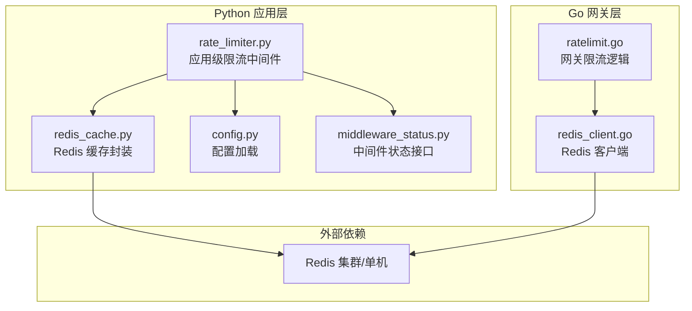
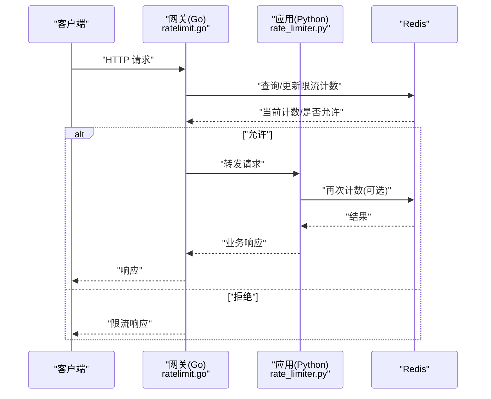
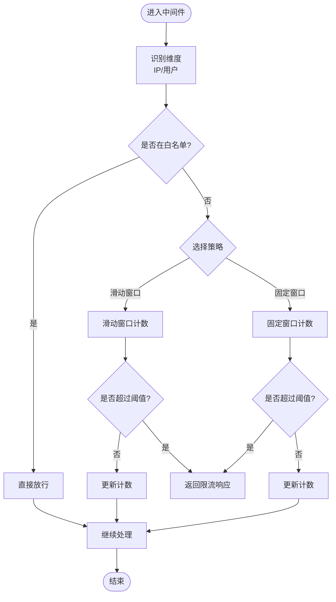
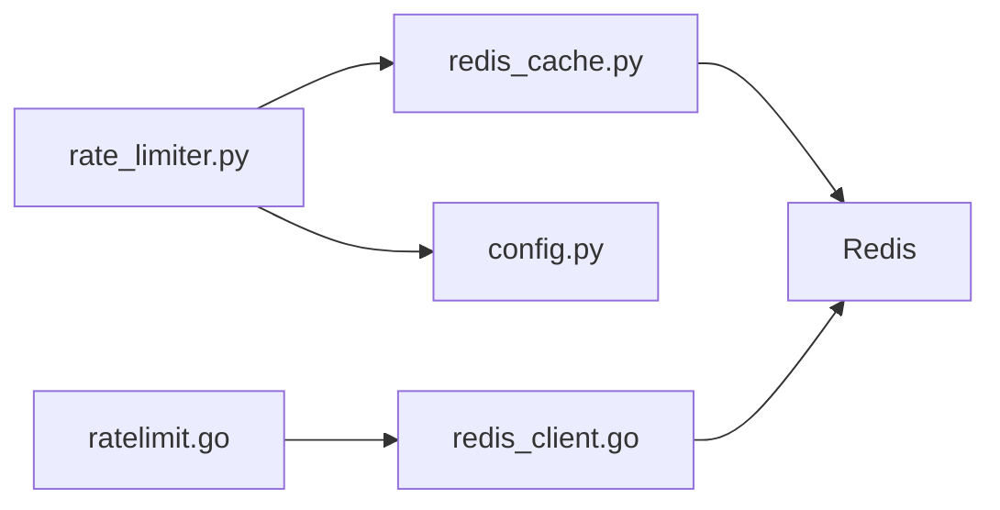

# 限流中间件

<cite>
**本文引用的文件**   
- [backend_design/nexus/middleware/rate_limiter.py](file://backend_design/nexus/middleware/rate_limiter.py)
- [backend_design/nexus/middleware/redis_cache.py](file://backend_design/nexus/middleware/redis_cache.py)
- [backend_design/nexus/config.py](file://backend_design/nexus/config.py)
- [backend_design/nexus/api/routes/middleware_status.py](file://backend_design/nexus/api/routes/middleware_status.py)
- [backend_design/nexus_gate/internal/ratelimit/ratelimit.go](file://backend_design/nexus_gate/internal/ratelimit/ratelimit.go)
- [backend_design/nexus_gate/internal/handlers/redis_client.go](file://backend_design/nexus_gate/internal/handlers/redis_client.go)
</cite>

## 目录
1. [简介](#简介)
2. [项目结构](#项目结构)
3. [核心组件](#核心组件)
4. [架构总览](#架构总览)
5. [详细组件分析](#详细组件分析)
6. [依赖分析](#依赖分析)
7. [性能考虑](#性能考虑)
8. [故障恢复与容错](#故障恢复与容错)
9. [配置与使用指南](#配置与使用指南)
10. [自定义限流规则实现指南](#自定义限流规则实现指南)
11. [排障指南](#排障指南)
12. [结论](#结论)

## 简介
本技术文档聚焦于 NexusCockpit 的限流中间件，围绕基于 Redis 的分布式限流算法展开，涵盖滑动窗口、固定窗口等策略；说明请求频率限制、IP 白名单、用户级别限流等能力；并提供性能调优参数与故障恢复机制建议。同时给出自定义限流规则的实现指南与最佳实践，帮助读者在网关层（Go）与应用层（Python）协同部署时获得一致、可观测、可扩展的限流体验。

## 项目结构
限流相关代码分布在两个子系统：
- Python 应用层：位于 backend_design/nexus/middleware 下，提供应用内限流中间件与 Redis 缓存封装。
- Go 网关层：位于 backend_design/nexus_gate/internal/ratelimit 与 handlers 下，提供网关侧分布式限流与 Redis 客户端。



图表来源
- [backend_design/nexus/middleware/rate_limiter.py](file://backend_design/nexus/middleware/rate_limiter.py)
- [backend_design/nexus/middleware/redis_cache.py](file://backend_design/nexus/middleware/redis_cache.py)
- [backend_design/nexus/config.py](file://backend_design/nexus/config.py)
- [backend_design/nexus/api/routes/middleware_status.py](file://backend_design/nexus/api/routes/middleware_status.py)
- [backend_design/nexus_gate/internal/ratelimit/ratelimit.go](file://backend_design/nexus_gate/internal/ratelimit/ratelimit.go)
- [backend_design/nexus_gate/internal/handlers/redis_client.go](file://backend_design/nexus_gate/internal/handlers/redis_client.go)

章节来源
- [backend_design/nexus/middleware/rate_limiter.py](file://backend_design/nexus/middleware/rate_limiter.py)
- [backend_design/nexus/middleware/redis_cache.py](file://backend_design/nexus/middleware/redis_cache.py)
- [backend_design/nexus/config.py](file://backend_design/nexus/config.py)
- [backend_design/nexus/api/routes/middleware_status.py](file://backend_design/nexus/api/routes/middleware_status.py)
- [backend_design/nexus_gate/internal/ratelimit/ratelimit.go](file://backend_design/nexus_gate/internal/ratelimit/ratelimit.go)
- [backend_design/nexus_gate/internal/handlers/redis_client.go](file://backend_design/nexus_gate/internal/handlers/redis_client.go)

## 核心组件
- 应用层限流中间件（Python）
  - 职责：在请求进入业务路由前进行速率判定，支持按 IP、用户维度统计，并返回统一响应。
  - 关键能力：滑动窗口/固定窗口策略选择、阈值控制、白名单跳过、指标上报。
- Redis 缓存封装（Python）
  - 职责：对 Redis 连接、键空间管理、原子计数与过期处理进行封装，屏蔽底层差异。
- 网关限流（Go）
  - 职责：在入口网关侧执行分布式限流，避免将超限流量打入后端服务。
  - 关键能力：全局/租户/用户维度限流、与 Redis 交互、错误降级。
- 中间件状态接口（Python）
  - 职责：暴露限流器健康状态、统计信息，便于监控与运维。

章节来源
- [backend_design/nexus/middleware/rate_limiter.py](file://backend_design/nexus/middleware/rate_limiter.py)
- [backend_design/nexus/middleware/redis_cache.py](file://backend_design/nexus/middleware/redis_cache.py)
- [backend_design/nexus_gate/internal/ratelimit/ratelimit.go](file://backend_design/nexus_gate/internal/ratelimit/ratelimit.go)
- [backend_design/nexus/api/routes/middleware_status.py](file://backend_design/nexus/api/routes/middleware_status.py)

## 架构总览
整体采用“网关 + 应用”双层限流：
- 网关层（Go）：快速拦截，保护后端资源，减少无效请求进入应用。
- 应用层（Python）：精细化控制，结合业务上下文（如用户、租户）做更细粒度的限流。
- 共享存储（Redis）：作为分布式计数器与键值存储，保证多实例一致性。



图表来源
- [backend_design/nexus_gate/internal/ratelimit/ratelimit.go](file://backend_design/nexus_gate/internal/ratelimit/ratelimit.go)
- [backend_design/nexus_gate/internal/handlers/redis_client.go](file://backend_design/nexus_gate/internal/handlers/redis_client.go)
- [backend_design/nexus/middleware/rate_limiter.py](file://backend_design/nexus/middleware/rate_limiter.py)
- [backend_design/nexus/middleware/redis_cache.py](file://backend_design/nexus/middleware/redis_cache.py)

## 详细组件分析

### 应用层限流中间件（Python）
- 设计要点
  - 策略抽象：支持固定窗口与滑动窗口两种策略，通过配置切换。
  - 维度识别：支持按 IP、用户标识（如 JWT 中的子字段）生成限流键。
  - 白名单：对特定 IP 或用户直接放行，不消耗配额。
  - 响应规范：统一返回限流状态码与提示，便于前端处理。
- 数据模型
  - 限流键：由维度（IP/用户）、时间窗口、策略类型组合而成。
  - 计数与过期：利用 Redis 原子操作与 TTL 管理窗口边界。
- 复杂度
  - 时间复杂度：O(1) 单次计数/更新（Redis 原子命令）。
  - 空间复杂度：O(N) N 为活跃键数量，受窗口大小与并发维度影响。



图表来源
- [backend_design/nexus/middleware/rate_limiter.py](file://backend_design/nexus/middleware/rate_limiter.py)
- [backend_design/nexus/middleware/redis_cache.py](file://backend_design/nexus/middleware/redis_cache.py)

章节来源
- [backend_design/nexus/middleware/rate_limiter.py](file://backend_design/nexus/middleware/rate_limiter.py)
- [backend_design/nexus/middleware/redis_cache.py](file://backend_design/nexus/middleware/redis_cache.py)

### Redis 缓存封装（Python）
- 职责
  - 连接池与重试：管理 Redis 连接、失败重试与超时控制。
  - 原子操作：提供 INCR、EXPIRE、GETSET 等原子操作的封装。
  - 键空间：统一管理限流键前缀、命名约定与清理策略。
- 可靠性
  - 网络异常：捕获并记录错误，必要时降级到本地内存计数（可选）。
  - 幂等性：确保计数更新具备幂等语义，避免重复扣减。

章节来源
- [backend_design/nexus/middleware/redis_cache.py](file://backend_design/nexus/middleware/redis_cache.py)

### 网关限流（Go）
- 设计要点
  - 前置拦截：在请求到达应用前完成限流判断，降低后端压力。
  - 分布式一致性：通过 Redis 原子计数保证多实例一致性。
  - 错误降级：当 Redis 不可用时，可选择放行或拒绝策略（可配置）。
- 维度与键
  - 支持全局、租户、用户等多维限流键，便于精细化治理。
- 指标与可观测性
  - 暴露限流命中次数、拒绝率等指标，便于监控告警。

```mermaid
classDiagram
class RateLimiter {
+Check(key, limit, window) bool
+Update(key, count) void
+Reset(key) void
+Status() map[string]interface{}
}
class RedisClient {
+Get(key) string
+Incr(key) int64
+Expire(key, ttl) bool
+SetNX(key, value, ttl) bool
}
class Config {
+GlobalLimit int
+UserLimit int
+WindowSeconds int
+Strategy string
+Whitelist []string
}
RateLimiter --> RedisClient : "使用"
RateLimiter --> Config : "读取配置"
```

图表来源
- [backend_design/nexus_gate/internal/ratelimit/ratelimit.go](file://backend_design/nexus_gate/internal/ratelimit/ratelimit.go)
- [backend_design/nexus_gate/internal/handlers/redis_client.go](file://backend_design/nexus_gate/internal/handlers/redis_client.go)

章节来源
- [backend_design/nexus_gate/internal/ratelimit/ratelimit.go](file://backend_design/nexus_gate/internal/ratelimit/ratelimit.go)
- [backend_design/nexus_gate/internal/handlers/redis_client.go](file://backend_design/nexus_gate/internal/handlers/redis_client.go)

### 中间件状态接口（Python）
- 职责
  - 暴露限流器健康状态、统计信息（如命中率、拒绝数），供监控系统采集。
- 典型字段
  - 状态：正常/异常
  - 指标：请求总数、限流次数、平均延迟
  - 配置快照：当前生效的策略与阈值

章节来源
- [backend_design/nexus/api/routes/middleware_status.py](file://backend_design/nexus/api/routes/middleware_status.py)

## 依赖分析
- 组件耦合
  - rate_limiter.py 依赖 redis_cache.py 与 config.py，低耦合高内聚。
  - ratelimit.go 依赖 redis_client.go，通过接口化调用保持扩展性。
- 外部依赖
  - Redis：作为分布式计数与键值存储，要求高可用与低延迟。
- 潜在循环依赖
  - 未发现循环导入；各模块职责清晰，依赖方向单一。



图表来源
- [backend_design/nexus/middleware/rate_limiter.py](file://backend_design/nexus/middleware/rate_limiter.py)
- [backend_design/nexus/middleware/redis_cache.py](file://backend_design/nexus/middleware/redis_cache.py)
- [backend_design/nexus/config.py](file://backend_design/nexus/config.py)
- [backend_design/nexus_gate/internal/ratelimit/ratelimit.go](file://backend_design/nexus_gate/internal/ratelimit/ratelimit.go)
- [backend_design/nexus_gate/internal/handlers/redis_client.go](file://backend_design/nexus_gate/internal/handlers/redis_client.go)

章节来源
- [backend_design/nexus/middleware/rate_limiter.py](file://backend_design/nexus/middleware/rate_limiter.py)
- [backend_design/nexus/middleware/redis_cache.py](file://backend_design/nexus/middleware/redis_cache.py)
- [backend_design/nexus/config.py](file://backend_design/nexus/config.py)
- [backend_design/nexus_gate/internal/ratelimit/ratelimit.go](file://backend_design/nexus_gate/internal/ratelimit/ratelimit.go)
- [backend_design/nexus_gate/internal/handlers/redis_client.go](file://backend_design/nexus_gate/internal/handlers/redis_client.go)

## 性能考虑
- 窗口策略选择
  - 固定窗口：实现简单、开销小，适合粗粒度限流。
  - 滑动窗口：更平滑，但需维护更多键或分段计数，开销略高。
- Redis 优化
  - 使用原子命令（INCR/EXPIRE）减少往返与竞争。
  - 合理设置 TTL，避免键膨胀；定期清理过期键。
  - 连接池复用，减少握手开销。
- 键空间设计
  - 使用前缀区分维度（全局/租户/用户），便于批量管理与监控。
  - 控制键长度与数量，避免热点键导致单分片压力过大。
- 指标与采样
  - 采样上报限流命中与拒绝率，避免全量上报造成额外负载。

[本节为通用性能指导，无需列出具体文件来源]

## 故障恢复与容错
- Redis 不可用
  - 网关层：可配置降级策略（放行或拒绝），优先保障可用性。
  - 应用层：可回退至本地内存计数（短期），并记录告警。
- 网络抖动
  - 重试与退避：对 Redis 操作增加有限次重试与指数退避。
  - 超时控制：设置合理的读写超时，避免长尾阻塞。
- 数据一致性
  - 使用原子操作保证计数正确性；避免非原子复合操作。
- 监控与自愈
  - 暴露健康检查接口，配合编排系统自动重启或切换节点。

章节来源
- [backend_design/nexus/middleware/redis_cache.py](file://backend_design/nexus/middleware/redis_cache.py)
- [backend_design/nexus_gate/internal/ratelimit/ratelimit.go](file://backend_design/nexus_gate/internal/ratelimit/ratelimit.go)

## 配置与使用指南
- 请求频率限制
  - 全局阈值：限制所有用户的总请求数。
  - 用户阈值：限制单个用户的请求数。
  - 时间窗口：秒为单位，决定窗口大小。
- IP 白名单
  - 支持列表配置，命中白名单的请求直接放行。
- 用户级别限流
  - 从认证上下文提取用户标识，生成独立限流键。
- 策略选择
  - 固定窗口：适用于稳定流量场景。
  - 滑动窗口：适用于需要更平滑控制的场景。
- 示例配置项（概念性说明）
  - 全局限流开关、阈值、窗口时长
  - 用户限流开关、阈值、窗口时长
  - 白名单 IP/用户列表
  - 策略类型（固定/滑动）
  - Redis 连接参数（地址、密码、数据库号、连接池大小）

章节来源
- [backend_design/nexus/config.py](file://backend_design/nexus/config.py)
- [backend_design/nexus/middleware/rate_limiter.py](file://backend_design/nexus/middleware/rate_limiter.py)

## 自定义限流规则实现指南
- 步骤概览
  - 定义新的维度：例如按 API 路径、租户 ID 或设备指纹。
  - 生成限流键：将维度与时间窗口组合成唯一键。
  - 选择策略：根据场景选择固定或滑动窗口。
  - 集成中间件：在路由前插入限流逻辑。
  - 暴露状态：为新规则添加健康与指标上报。
- 最佳实践
  - 键空间隔离：不同规则使用不同前缀，避免冲突。
  - 阈值分层：先网关后应用，逐步收紧。
  - 灰度发布：新规则先在少量实例启用，观察指标后再全量。
  - 可观测性：记录命中与拒绝详情，便于定位问题。

[本节为通用实现指导，无需列出具体文件来源]

## 排障指南
- 常见问题
  - Redis 连接失败：检查网络连通性与凭据，查看连接池日志。
  - 限流误判：核对键空间设计与维度提取逻辑。
  - 性能抖动：关注 Redis 延迟与 CPU 使用率，调整窗口与阈值。
- 诊断方法
  - 查看中间件状态接口，确认健康与指标。
  - 抓取 Redis 慢查询与键分布，评估热点键。
  - 对比网关与应用层的限流统计，定位瓶颈。

章节来源
- [backend_design/nexus/api/routes/middleware_status.py](file://backend_design/nexus/api/routes/middleware_status.py)
- [backend_design/nexus/middleware/redis_cache.py](file://backend_design/nexus/middleware/redis_cache.py)

## 结论
NexusCockpit 的限流中间件在网关与应用两层协同工作，借助 Redis 实现分布式一致的速率控制。通过灵活的策略与维度配置、完善的容错与可观测性，能够在复杂生产环境中提供稳定可靠的限流能力。建议在生产中结合业务特征选择合适的窗口策略与阈值，并持续监控与调优，以获得最佳的性能与用户体验。