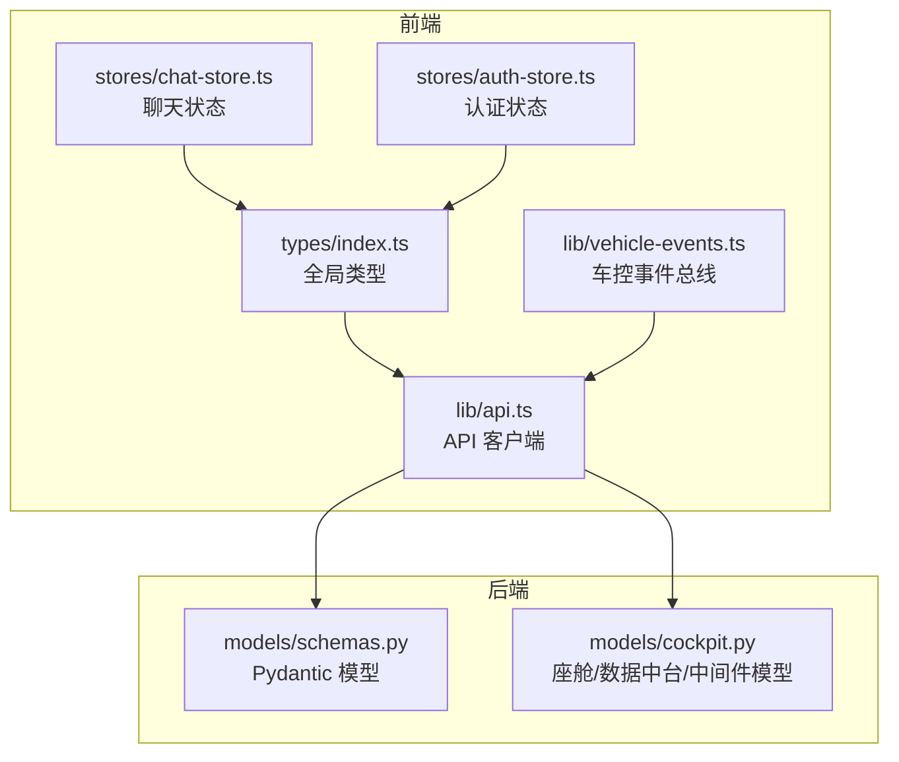
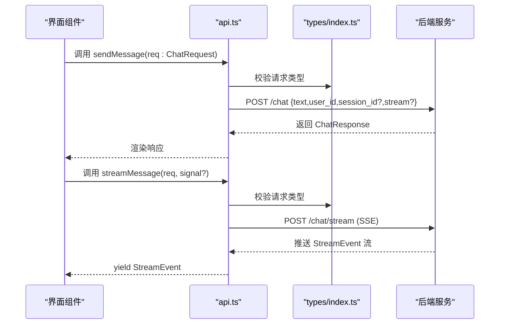
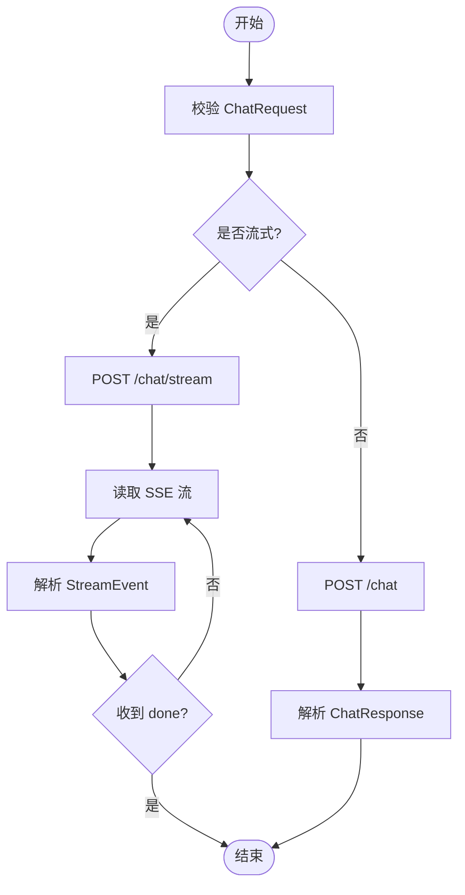
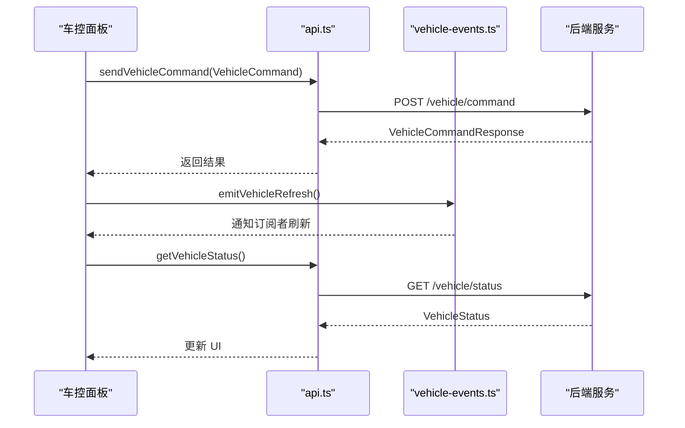
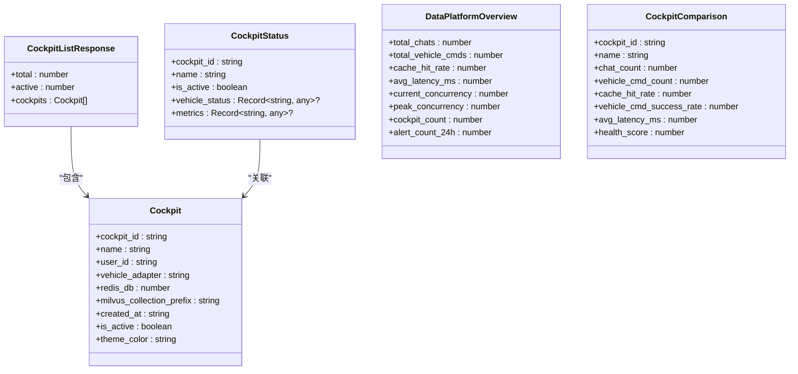
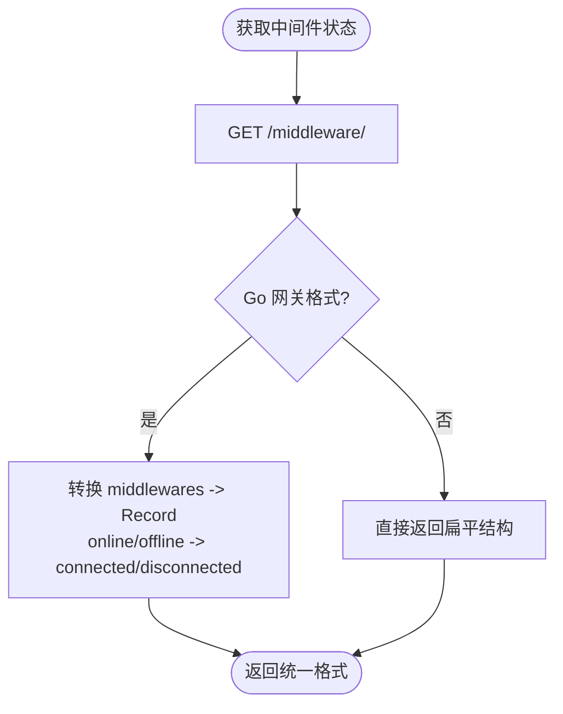
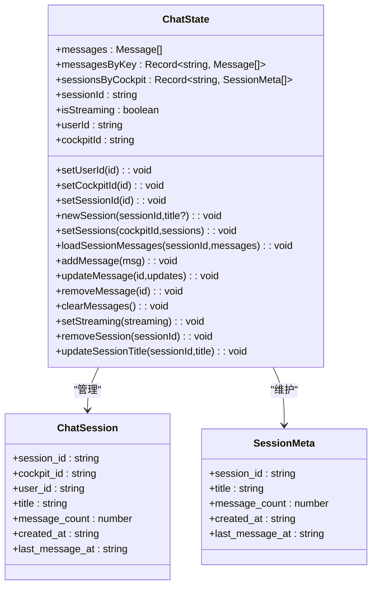
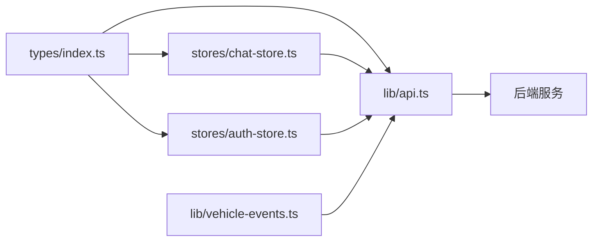

# API 类型与数据模型

<cite>
**本文引用的文件**   
- [frontend_design/src/types/index.ts](file://frontend_design/src/types/index.ts)
- [frontend_design/src/lib/api.ts](file://frontend_design/src/lib/api.ts)
- [backend_design/nexus/models/schemas.py](file://backend_design/nexus/models/schemas.py)
- [backend_design/nexus/models/cockpit.py](file://backend_design/nexus/models/cockpit.py)
- [frontend_design/src/stores/chat-store.ts](file://frontend_design/src/stores/chat-store.ts)
- [frontend_design/src/stores/auth-store.ts](file://frontend_design/src/stores/auth-store.ts)
- [frontend_design/src/lib/vehicle-events.ts](file://frontend_design/src/lib/vehicle-events.ts)
</cite>

## 目录
1. [简介](#简介)
2. [项目结构](#项目结构)
3. [核心组件](#核心组件)
4. [架构总览](#架构总览)
5. [详细组件分析](#详细组件分析)
6. [依赖关系分析](#依赖关系分析)
7. [性能考虑](#性能考虑)
8. [故障排查指南](#故障排查指南)
9. [结论](#结论)
10. [附录](#附录)

## 简介
本文件为 NexusCockpit 前端使用的 TypeScript 接口与数据模型的权威参考，覆盖对话、车控、健康检查、座舱管理、数据中台、中间件状态、用户与声纹等关键领域。文档将：
- 精确定义 ChatRequest、ChatResponse、VehicleCommand、VehicleStatus、HealthData、Cockpit 等核心类型
- 解释字段含义、数据类型、必填/可选、嵌套结构与联合类型
- 说明前后端类型的对应关系与依赖
- 提供类型安全最佳实践（向后兼容、版本策略）
- 给出使用场景与调用序列图，帮助开发者正确使用 API

## 项目结构
NexusCockpit 的前端类型集中在单一入口文件，API 客户端统一封装在 api.ts；后端 Pydantic 模型定义在 schemas.py 与 cockpit.py。会话与认证状态分别由 chat-store.ts 与 auth-store.ts 管理。



图表来源
- [frontend_design/src/types/index.ts:1-277](file://frontend_design/src/types/index.ts#L1-L277)
- [frontend_design/src/lib/api.ts:1-786](file://frontend_design/src/lib/api.ts#L1-L786)
- [backend_design/nexus/models/schemas.py:1-88](file://backend_design/nexus/models/schemas.py#L1-L88)
- [backend_design/nexus/models/cockpit.py:1-214](file://backend_design/nexus/models/cockpit.py#L1-L214)

章节来源
- [frontend_design/src/types/index.ts:1-277](file://frontend_design/src/types/index.ts#L1-L277)
- [frontend_design/src/lib/api.ts:1-786](file://frontend_design/src/lib/api.ts#L1-L786)
- [backend_design/nexus/models/schemas.py:1-88](file://backend_design/nexus/models/schemas.py#L1-L88)
- [backend_design/nexus/models/cockpit.py:1-214](file://backend_design/nexus/models/cockpit.py#L1-L214)

## 核心组件
本节聚焦前端核心类型与后端对应模型，明确字段语义、约束与关系。

### 对话相关类型
- ChatRequest
  - text: string，必填，用户输入文本
  - user_id: string，必填，用户标识
  - session_id?: string，可选，会话标识
  - stream?: boolean，可选，是否流式返回
- ChatResponse
  - response: string，必填，回复文本
  - user_id?: string，可选
  - session_id?: string，可选
  - latency_ms?: number，可选，延迟毫秒
  - metadata?: Record<string, any>，可选，扩展元数据
  - cache_hit?: boolean，可选，缓存命中标记
  - intent?: string，可选，意图识别结果
  - action?: string，可选，技能动作
  - trace_id?: string，可选，追踪 ID
- StreamEvent
  - type: string，必填，事件类型（chunk/intent/action/experts/done/error）
  - data?: object，可选，事件载荷，包含 chunk/intent/source/action/experts/response/latency_ms/message 等字段
- Message
  - id: string，必填
  - role: "user" | "assistant" | "system"，必填
  - content: string，必填
  - timestamp: Date，必填
  - intent?: string，可选
  - action?: string，可选
  - loading?: boolean，可选

后端对应模型（Pydantic）
- ChatRequest / ChatResponse：见 schemas.py，字段与描述一致，支持默认值与长度约束

章节来源
- [frontend_design/src/types/index.ts:18-63](file://frontend_design/src/types/index.ts#L18-L63)
- [backend_design/nexus/models/schemas.py:19-37](file://backend_design/nexus/models/schemas.py#L19-L37)

### 车控相关类型
- VehicleCommand
  - command: string，必填，命令名称（如 vehicle_climate）
  - arguments: Record<string, any>，必填，命令参数
- TrackInfo
  - title: string，必填，曲目标题
  - filename: string，必填，文件名
  - url: string，必填，可播放相对路径
  - format: string，必填，音频格式
- VehicleStatus
  - climate: object，空调状态（temperature/fan_speed/mode/power）
  - windows: Record<string, number>，各车窗开度百分比
  - seats: Record<string, any>，座椅状态
  - media: object，媒体状态（playing/volume/source/track/play_mode/playlist）
    - track: string | TrackInfo | null，当前曲目，支持字符串或对象两种格式
    - playlist: (string | TrackInfo)[]，完整播放列表
  - navigation: object，导航状态（destination/mode）
  - status: object，车辆整体状态（tire_pressure/range_km/fuel_percent/battery_percent/maintenance）

后端对应模型（Pydantic）
- VehicleCommandRequest / VehicleCommandResponse：见 schemas.py，command/arguments/user_id 与 success/message/data/error

章节来源
- [frontend_design/src/types/index.ts:69-115](file://frontend_design/src/types/index.ts#L69-L115)
- [backend_design/nexus/models/schemas.py:55-68](file://backend_design/nexus/models/schemas.py#L55-L68)

### 健康与缓存统计
- HealthData
  - status: string，必填，整体状态（healthy/offline）
  - services: Record<string, string>，必填，各服务状态映射
- CacheStats
  - hits: number，必填，命中次数
  - misses: number，必填，未命中次数
  - hit_rate: number，必填，命中率（%）
  - size: number，必填，缓存大小
  - index_ready?: boolean，可选，索引就绪标记

后端对应模型（Pydantic）
- HealthResponse：见 schemas.py，status/version/services

章节来源
- [frontend_design/src/types/index.ts:121-134](file://frontend_design/src/types/index.ts#L121-L134)
- [backend_design/nexus/models/schemas.py:70-75](file://backend_design/nexus/models/schemas.py#L70-L75)

### 座舱与数据中台
- Cockpit
  - cockpit_id/name/user_id/vehicle_adapter/redis_db/milvus_collection_prefix/created_at/is_active/theme_color
- CockpitListResponse
  - total: number
  - active: number
  - cockpits: Cockpit[]
- CockpitStatus
  - cockpit_id/name/is_active
  - vehicle_status?: Record<string, any>
  - metrics?: Record<string, any>
- DataPlatformOverview
  - total_chats/total_vehicle_cmds/cache_hit_rate/avg_latency_ms/current_concurrency/peak_concurrency/cockpit_count/alert_count_24h
- CockpitComparison
  - cockpit_id/name/chat_count/vehicle_cmd_count/cache_hit_rate/vehicle_cmd_success_rate/avg_latency_ms/health_score
- AlertRecord
  - id/cockpit_id/alert_time/alert_type/severity/action_taken
- AgentActivity
  - id/cockpit_id/check_time/is_anomaly/check_items/llm_judgment?

后端对应模型（Pydantic）
- CockpitCreateRequest/UpdateRequest/Response/ListResponse/StatusResponse
- DataPlatformOverview/CockpitComparison/AlertRecord/AgentActivityRecord/MiddlewareStatus/UserCreateRequest/UserResponse/MiddlewareConfigUpdate/RBACRole 等

章节来源
- [frontend_design/src/types/index.ts:159-231](file://frontend_design/src/types/index.ts#L159-L231)
- [backend_design/nexus/models/cockpit.py:21-214](file://backend_design/nexus/models/cockpit.py#L21-L214)

### 中间件与用户
- MiddlewareStatus
  - name/status/version?/error?/[key: any]
- User
  - user_id/username/cockpit_id/role/created_at
- UserRole
  - "super_admin" | "cockpit_admin" | "cockpit_user" | "cockpit_viewer"

后端对应模型（Pydantic）
- MiddlewareStatus/UserResponse/RBACRole 等

章节来源
- [frontend_design/src/types/index.ts:233-252](file://frontend_design/src/types/index.ts#L233-L252)
- [backend_design/nexus/models/cockpit.py:125-192](file://backend_design/nexus/models/cockpit.py#L125-L192)

### 声纹相关
- VoiceprintStatus
  - cockpit_id/users: [{user_id/enroll_count/completed}]
- VoiceprintVerifyResult
  - verified/user_id/similarity/threshold/message/access_token?/token_type?/expires_in?/auth_method?

章节来源
- [frontend_design/src/types/index.ts:254-276](file://frontend_design/src/types/index.ts#L254-L276)

## 架构总览
前端通过统一的 API 客户端与后端交互，类型集中管理，状态分模块存储。



图表来源
- [frontend_design/src/lib/api.ts:247-341](file://frontend_design/src/lib/api.ts#L247-L341)
- [frontend_design/src/types/index.ts:18-63](file://frontend_design/src/types/index.ts#L18-L63)

## 详细组件分析

### 对话流程与类型契约
- 非流式发送消息
  - 输入：ChatRequest
  - 输出：ChatResponse
  - 错误处理：HTTP 状态码与网络异常
- 流式发送消息
  - 输入：ChatRequest + AbortSignal
  - 输出：AsyncGenerator<StreamEvent>
  - 事件类型：chunk/intent/action/experts/done/error
  - 取消机制：AbortSignal 中断读取



图表来源
- [frontend_design/src/lib/api.ts:247-341](file://frontend_design/src/lib/api.ts#L247-L341)

章节来源
- [frontend_design/src/lib/api.ts:247-341](file://frontend_design/src/lib/api.ts#L247-L341)
- [frontend_design/src/types/index.ts:18-63](file://frontend_design/src/types/index.ts#L18-L63)

### 车控命令与状态刷新
- 发送车控命令
  - 输入：VehicleCommand
  - 输出：VehicleCommandResponse（success/message/data/error）
- 获取车辆状态
  - 输出：VehicleStatus（含 climate/windows/seats/media/navigation/status）
- 事件总线刷新
  - emitVehicleRefresh() 触发刷新
  - onVehicleRefresh(listener) 订阅刷新回调



图表来源
- [frontend_design/src/lib/api.ts:360-376](file://frontend_design/src/lib/api.ts#L360-L376)
- [frontend_design/src/lib/vehicle-events.ts:18-33](file://frontend_design/src/lib/vehicle-events.ts#L18-L33)

章节来源
- [frontend_design/src/lib/api.ts:360-376](file://frontend_design/src/lib/api.ts#L360-L376)
- [frontend_design/src/lib/vehicle-events.ts:18-33](file://frontend_design/src/lib/vehicle-events.ts#L18-L33)
- [frontend_design/src/types/index.ts:69-115](file://frontend_design/src/types/index.ts#L69-L115)

### 座舱管理与数据中台
- 座舱 CRUD
  - getCockpits/registerCockpit/updateCockpit/deleteCockpit
  - 返回 Cockpit/CockpitListResponse/CockpitStatus
- 数据中台
  - getDataPlatformOverview/getCockpitDetail/getConcurrency/getAlerts/getAgentActivity/getCockpitComparison/getCacheTrend
  - 返回 DataPlatformOverview/CockpitComparison/AlertRecord/AgentActivity 等



图表来源
- [frontend_design/src/types/index.ts:159-211](file://frontend_design/src/types/index.ts#L159-L211)
- [backend_design/nexus/models/cockpit.py:38-118](file://backend_design/nexus/models/cockpit.py#L38-L118)

章节来源
- [frontend_design/src/lib/api.ts:462-555](file://frontend_design/src/lib/api.ts#L462-L555)
- [frontend_design/src/types/index.ts:159-211](file://frontend_design/src/types/index.ts#L159-L211)
- [backend_design/nexus/models/cockpit.py:38-118](file://backend_design/nexus/models/cockpit.py#L38-L118)

### 中间件状态适配
- getAllMiddlewareStatus 同时适配 Go 网关与 Python 后端两种响应格式
- 统一输出扁平的 Record<string, MiddlewareStatus>，status 标准化为 connected/disconnected



图表来源
- [frontend_design/src/lib/api.ts:575-599](file://frontend_design/src/lib/api.ts#L575-L599)

章节来源
- [frontend_design/src/lib/api.ts:575-599](file://frontend_design/src/lib/api.ts#L575-L599)

### 会话与状态管理
- ChatSession：会话元信息（session_id/cockpit_id/user_id/title/message_count/created_at/last_message_at）
- ChatState：Zustand 管理的聊天状态（messages/messagesByKey/sessionsByCockpit/sessionId/isStreaming/userId/cockpitId）
- SessionMeta：会话元数据（session_id/title/message_count/created_at/last_message_at）



图表来源
- [frontend_design/src/lib/api.ts:675-721](file://frontend_design/src/lib/api.ts#L675-L721)
- [frontend_design/src/stores/chat-store.ts:22-69](file://frontend_design/src/stores/chat-store.ts#L22-L69)

章节来源
- [frontend_design/src/lib/api.ts:675-721](file://frontend_design/src/lib/api.ts#L675-L721)
- [frontend_design/src/stores/chat-store.ts:22-69](file://frontend_design/src/stores/chat-store.ts#L22-L69)

### 认证与 RBAC
- JWTPayload：sub/cockpit_id?/role?/exp?/auth_method?
- AuthState：token/userId/role/cockpitId/isAuthenticated
- UserRole：四种角色层级
- 权限工具函数：hasRole/canViewDataPlatform/canViewMiddleware/canAccessSettings/canManageCockpits/canManageUsers

```mermaid
classDiagram
class JWTPayload {
+sub : string
+cockpit_id? : string
+role? : string
+exp? : number
+auth_method? : string
}
class AuthState {
+token : string|null
+userId : string
+role : UserRole
+cockpitId : string
+isAuthenticated : boolean
}
class UserRole {
<<enum>>
"super_admin"
"cockpit_admin"
"cockpit_user"
"cockpit_viewer"
}
AuthState --> UserRole : "拥有"
```

图表来源
- [frontend_design/src/stores/auth-store.ts:28-52](file://frontend_design/src/stores/auth-store.ts#L28-L52)
- [frontend_design/src/types/index.ts:252](file://frontend_design/src/types/index.ts#L252)

章节来源
- [frontend_design/src/stores/auth-store.ts:28-52](file://frontend_design/src/stores/auth-store.ts#L28-L52)
- [frontend_design/src/types/index.ts:252](file://frontend_design/src/types/index.ts#L252)

## 依赖关系分析
- 前端类型集中导出，被 api.ts 与 stores 复用
- api.ts 依赖 types 进行请求/响应类型约束
- chat-store.ts 依赖 types.Message 与 SessionMeta
- auth-store.ts 依赖 types.UserRole 与本地 JWT 解析
- vehicle-events.ts 提供车控刷新事件解耦 UI 与 API



图表来源
- [frontend_design/src/types/index.ts:1-277](file://frontend_design/src/types/index.ts#L1-L277)
- [frontend_design/src/lib/api.ts:1-786](file://frontend_design/src/lib/api.ts#L1-L786)
- [frontend_design/src/stores/chat-store.ts:1-311](file://frontend_design/src/stores/chat-store.ts#L1-L311)
- [frontend_design/src/stores/auth-store.ts:1-228](file://frontend_design/src/stores/auth-store.ts#L1-L228)
- [frontend_design/src/lib/vehicle-events.ts:1-34](file://frontend_design/src/lib/vehicle-events.ts#L1-L34)

章节来源
- [frontend_design/src/types/index.ts:1-277](file://frontend_design/src/types/index.ts#L1-L277)
- [frontend_design/src/lib/api.ts:1-786](file://frontend_design/src/lib/api.ts#L1-L786)
- [frontend_design/src/stores/chat-store.ts:1-311](file://frontend_design/src/stores/chat-store.ts#L1-L311)
- [frontend_design/src/stores/auth-store.ts:1-228](file://frontend_design/src/stores/auth-store.ts#L1-L228)
- [frontend_design/src/lib/vehicle-events.ts:1-34](file://frontend_design/src/lib/vehicle-events.ts#L1-L34)

## 性能考虑
- 流式响应优先：长文本与复杂推理建议使用 streamMessage，降低首屏等待时间
- 缓存命中：利用 ChatResponse.cache_hit 与 CacheStats.hit_rate 监控优化命中率
- 并发控制：数据中台的 current_concurrency/peak_concurrency 用于容量规划
- 超时设置：ASR 接口较长耗时，已设置为 60s；通用接口 30s
- 事件驱动刷新：通过 vehicle-events.ts 减少不必要的轮询

[本节为通用指导，不直接分析具体文件]

## 故障排查指南
- 登录失败/Token 过期
  - 检查 ensureAuthToken 与 refreshToken 逻辑
  - 确认环境变量 NEXT_PUBLIC_DEFAULT_USER/PASSWORD 与后端一致
- 流式请求错误
  - StreamError 携带 HTTP 状态码，区分网络错误与服务端错误
  - 检查 AbortSignal 是否正确传入并释放 reader
- 中间件状态不一致
  - getAllMiddlewareStatus 自动适配 Go/Python 格式，若仍异常请检查后端返回结构
- 车控无刷新
  - 确保 emitVehicleRefresh 在命令执行后调用
  - 组件需订阅 onVehicleRefresh 并拉取 getVehicleStatus

章节来源
- [frontend_design/src/lib/api.ts:55-115](file://frontend_design/src/lib/api.ts#L55-L115)
- [frontend_design/src/lib/api.ts:346-354](file://frontend_design/src/lib/api.ts#L346-L354)
- [frontend_design/src/lib/api.ts:575-599](file://frontend_design/src/lib/api.ts#L575-L599)
- [frontend_design/src/lib/vehicle-events.ts:18-33](file://frontend_design/src/lib/vehicle-events.ts#L18-L33)

## 结论
本文档系统化梳理了 NexusCockpit 前端的 TypeScript 类型与后端 Pydantic 模型，明确了字段语义、约束与依赖关系，并通过序列图与流程图展示了关键调用链。遵循本文的类型契约与最佳实践，可有效提升类型安全、可维护性与用户体验。

[本节为总结性内容，不直接分析具体文件]

## 附录

### 类型安全最佳实践
- 接口设计原则
  - 最小必要字段：仅暴露前端所需字段，避免冗余
  - 可选字段显式标注：使用 ? 明确可选性
  - 联合类型与字面量类型：role、intent、play_mode 等使用精确字面量
  - 嵌套对象结构化：VehicleStatus.media.track 支持 string|TrackInfo|null
- 向后兼容性
  - 新增字段一律可选，避免破坏旧客户端
  - 对后端返回差异做兼容层（如中间件状态格式）
- 版本管理策略
  - 前端持久化键带版本号（如 nexus-chat-store-v2），便于迁移
  - 后端 Pydantic 模型默认值与 Field(description) 保持可读性与稳定性

章节来源
- [frontend_design/src/types/index.ts:1-277](file://frontend_design/src/types/index.ts#L1-L277)
- [frontend_design/src/stores/chat-store.ts:286-308](file://frontend_design/src/stores/chat-store.ts#L286-L308)
- [backend_design/nexus/models/schemas.py:19-88](file://backend_design/nexus/models/schemas.py#L19-L88)

### 使用示例与场景
- 发送非流式消息
  - 构造 ChatRequest，调用 sendMessage，处理 ChatResponse
- 流式对话
  - 使用 streamMessage，逐条处理 StreamEvent，最终渲染 response
- 车控操作
  - 构造 VehicleCommand，调用 sendVehicleCommand，成功后触发 emitVehicleRefresh 刷新 UI
- 座舱管理
  - registerCockpit/updateCockpit/deleteCockpit，配合 CockpitListResponse 展示列表
- 数据中台概览
  - getDataPlatformOverview 获取全局指标，结合 CockpitComparison 对比多座舱表现

章节来源
- [frontend_design/src/lib/api.ts:247-341](file://frontend_design/src/lib/api.ts#L247-L341)
- [frontend_design/src/lib/api.ts:360-376](file://frontend_design/src/lib/api.ts#L360-L376)
- [frontend_design/src/lib/api.ts:462-555](file://frontend_design/src/lib/api.ts#L462-L555)