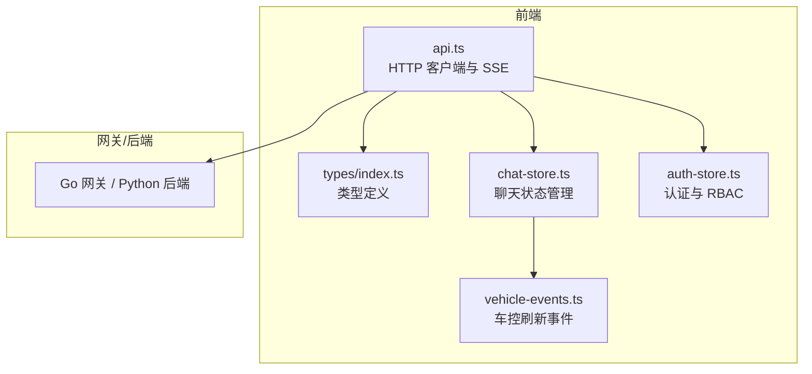
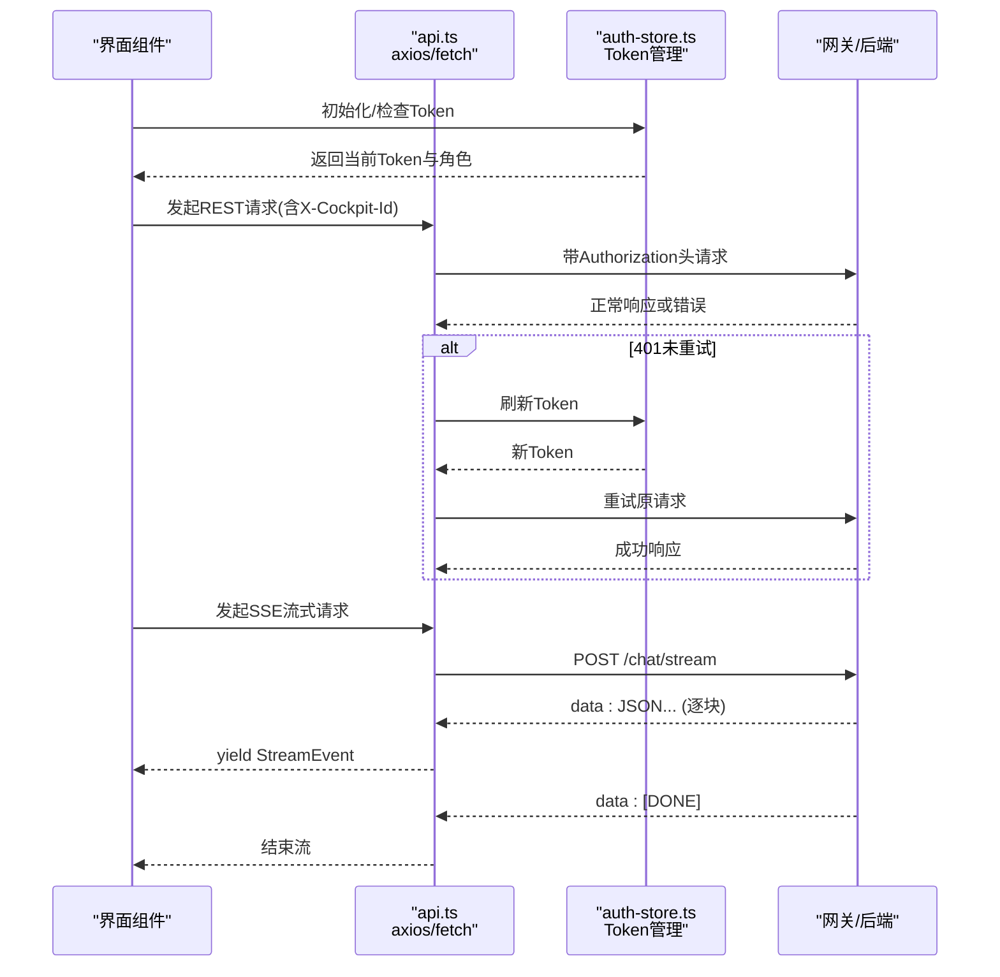
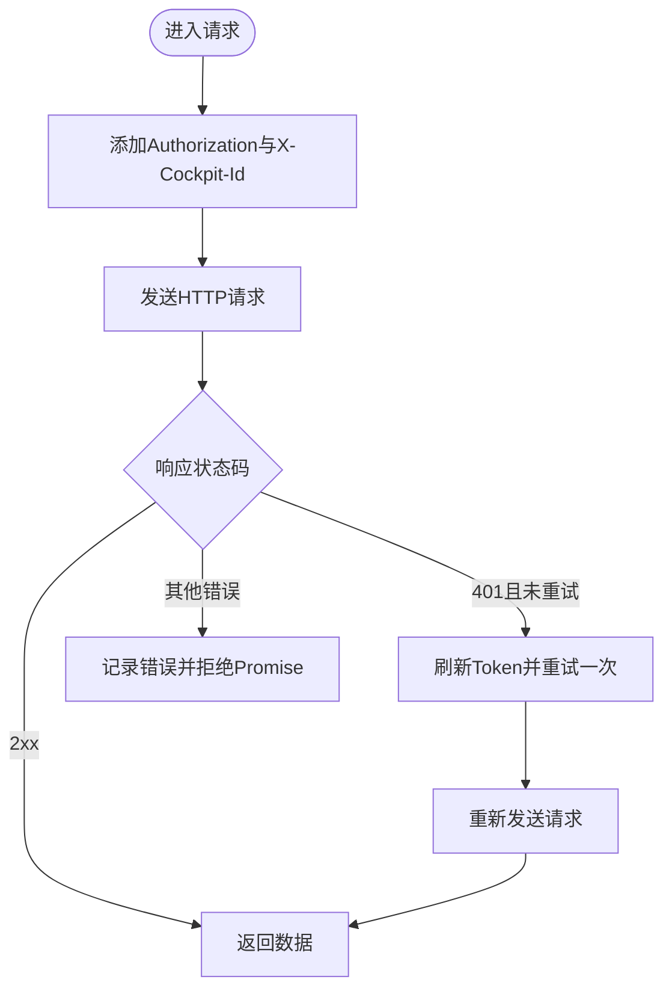
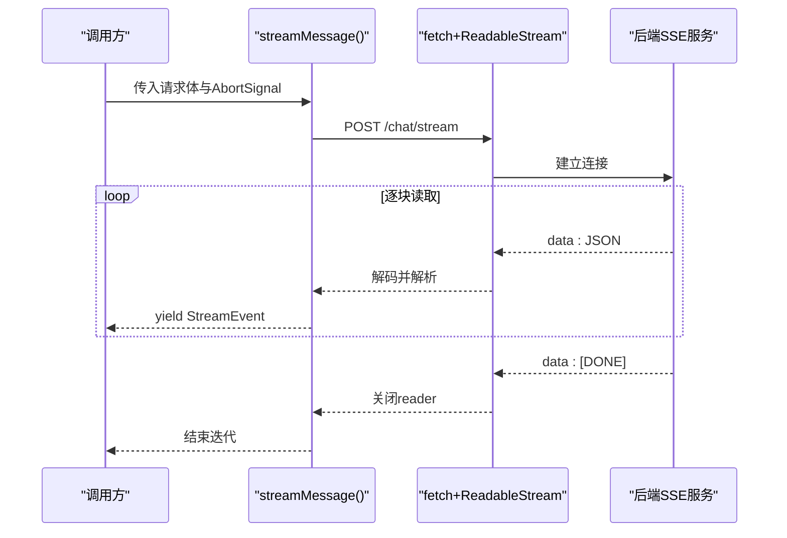
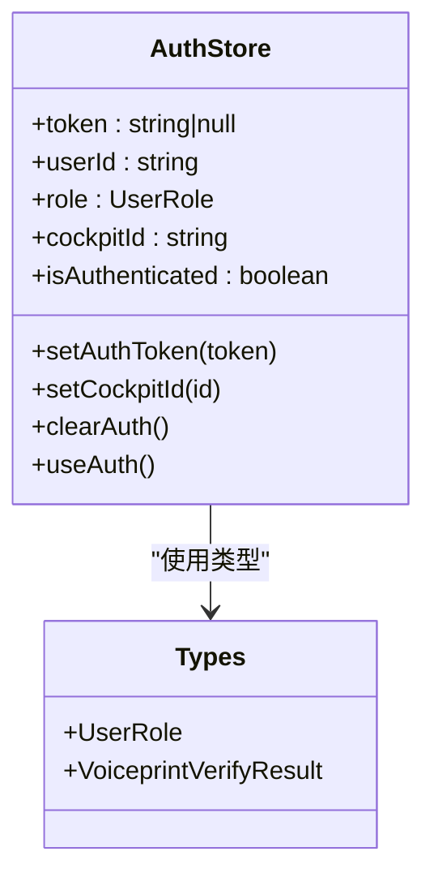
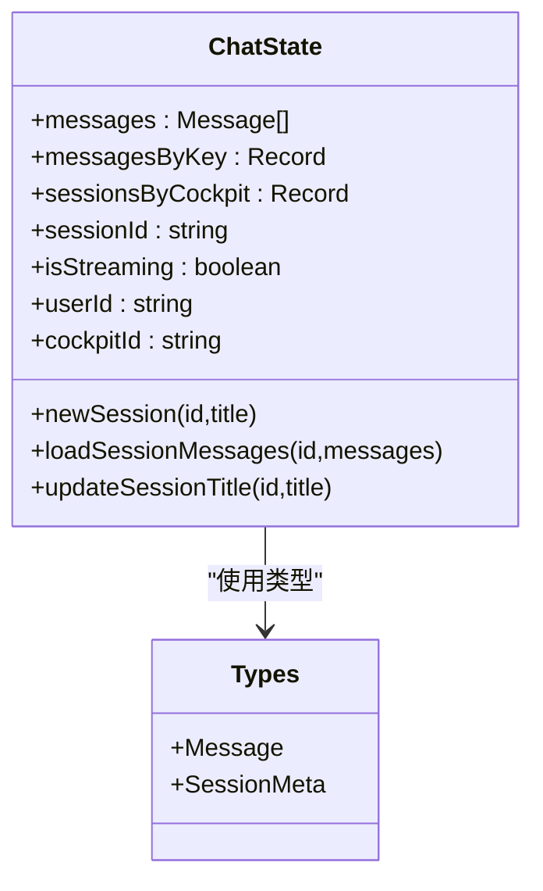
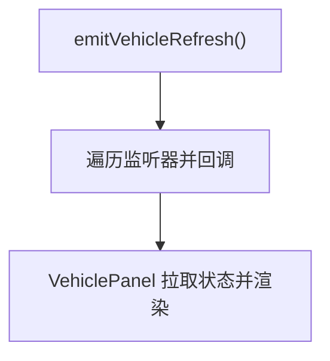
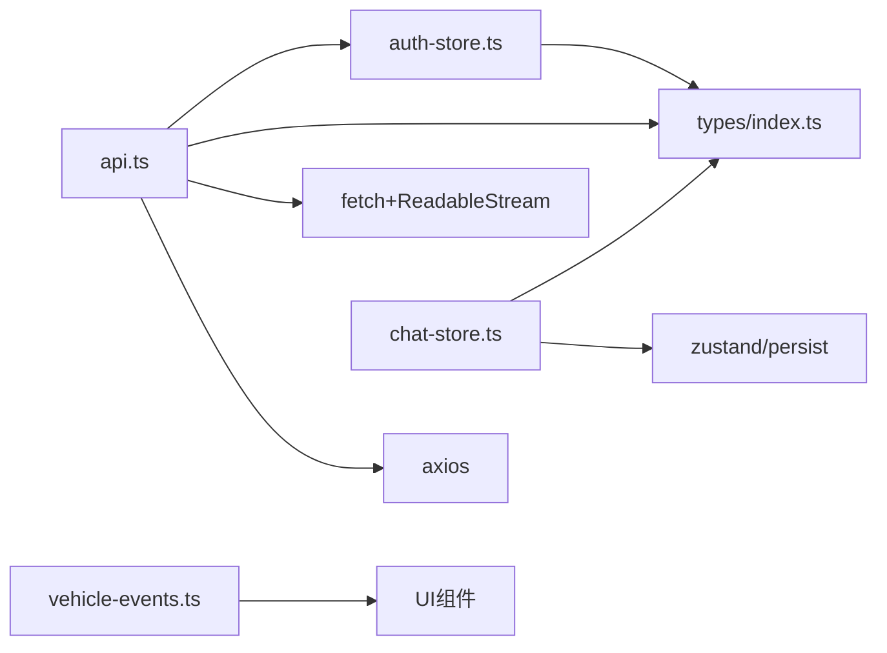

# API 集成层

<cite>
**本文引用的文件**   
- [api.ts](file://frontend_design/src/lib/api.ts)
- [index.ts](file://frontend_design/src/types/index.ts)
- [chat-store.ts](file://frontend_design/src/stores/chat-store.ts)
- [auth-store.ts](file://frontend_design/src/stores/auth-store.ts)
- [vehicle-events.ts](file://frontend_design/src/lib/vehicle-events.ts)
</cite>

## 目录
1. [简介](#简介)
2. [项目结构](#项目结构)
3. [核心组件](#核心组件)
4. [架构总览](#架构总览)
5. [详细组件分析](#详细组件分析)
6. [依赖关系分析](#依赖关系分析)
7. [性能与缓存策略](#性能与缓存策略)
8. [故障排查指南](#故障排查指南)
9. [结论](#结论)
10. [附录：调用示例与最佳实践](#附录调用示例与最佳实践)

## 简介
本技术文档聚焦于 NexusCockpit 前端 API 集成层，系统性阐述 RESTful 客户端设计、请求拦截器、响应处理、错误重试与超时控制；深入说明 SSE（Server-Sent Events）流式输出处理；并给出版本管理、缓存策略与性能优化建议。同时提供实际调用后端接口和处理实时数据流的代码级参考路径，帮助开发者快速理解与扩展。

## 项目结构
API 集成层主要位于前端 lib 与 stores 模块中，围绕统一的 axios 实例、原生 fetch 流式读取、状态管理与类型定义构建。关键文件职责如下：
- api.ts：统一 HTTP 客户端、拦截器、SSE 流式处理、各业务域 API 封装
- types/index.ts：全局共享的 TypeScript 类型定义
- chat-store.ts：基于 Zustand 的多会话聊天状态管理
- auth-store.ts：认证状态、RBAC 角色、座舱切换与 Token 生命周期管理
- vehicle-events.ts：车控状态刷新事件总线，驱动 UI 联动

图表来源
- [api.ts:118-175](file://frontend_design/src/lib/api.ts#L118-L175)
- [index.ts:18-52](file://frontend_design/src/types/index.ts#L18-L52)
- [chat-store.ts:77-110](file://frontend_design/src/stores/chat-store.ts#L77-L110)
- [auth-store.ts:58-103](file://frontend_design/src/stores/auth-store.ts#L58-L103)
- [vehicle-events.ts:22-33](file://frontend_design/src/lib/vehicle-events.ts#L22-L33)

章节来源
- [api.ts:1-176](file://frontend_design/src/lib/api.ts#L1-L176)
- [index.ts:1-52](file://frontend_design/src/types/index.ts#L1-L52)
- [chat-store.ts:77-110](file://frontend_design/src/stores/chat-store.ts#L77-L110)
- [auth-store.ts:58-103](file://frontend_design/src/stores/auth-store.ts#L58-L103)
- [vehicle-events.ts:18-33](file://frontend_design/src/lib/vehicle-events.ts#L18-L33)

## 核心组件
- 统一 HTTP 客户端与拦截器
  - 使用 axios.create 创建实例，设置 baseURL、timeout、默认 Content-Type
  - 请求拦截器自动附加 Authorization（Bearer Token）与 X-Cockpit-Id（多租户隔离）
  - 响应拦截器统一错误处理，并在 401 时自动刷新 Token 并重试一次
- 流式 SSE 客户端
  - 通过原生 fetch + ReadableStream 实现逐块读取
  - 按行解析 data: JSON 或 [DONE] 结束符，支持 AbortSignal 取消
- 认证与权限
  - 开发环境自动获取 JWT Token，过期前复用，失败静默降级
  - 本地存储持久化 Token 与 cockpit_id，配合 RBAC 控制菜单与页面访问
- 聊天状态管理
  - 基于 Zustand 的多会话、多座舱消息存储与持久化
  - 支持新建会话、切换会话、加载历史消息、更新标题等
- 车控事件总线
  - 命令执行后触发刷新事件，UI 订阅后拉取最新车辆状态

章节来源
- [api.ts:118-175](file://frontend_design/src/lib/api.ts#L118-L175)
- [api.ts:261-341](file://frontend_design/src/lib/api.ts#L261-L341)
- [auth-store.ts:58-103](file://frontend_design/src/stores/auth-store.ts#L58-L103)
- [chat-store.ts:77-110](file://frontend_design/src/stores/chat-store.ts#L77-L110)
- [vehicle-events.ts:22-33](file://frontend_design/src/lib/vehicle-events.ts#L22-L33)

## 架构总览
下图展示从前端到网关/后端的整体交互流程，包括认证、REST 请求、SSE 流式响应与错误重试。

图表来源
- [api.ts:118-175](file://frontend_design/src/lib/api.ts#L118-L175)
- [api.ts:261-341](file://frontend_design/src/lib/api.ts#L261-L341)
- [auth-store.ts:58-103](file://frontend_design/src/stores/auth-store.ts#L58-L103)

## 详细组件分析

### REST 客户端与拦截器
- 设计要点
  - 统一 baseURL、超时、Content-Type
  - 请求拦截器注入 Authorization 与 X-Cockpit-Id
  - 响应拦截器集中处理错误，401 自动刷新并重试一次
- 错误重试
  - 仅对 401 且未重试过的请求进行自动重试
  - 使用 _retried 标记避免无限循环
- 超时控制
  - 默认 30s，ASR 等特殊接口可单独设置更长超时

图表来源
- [api.ts:118-175](file://frontend_design/src/lib/api.ts#L118-L175)

章节来源
- [api.ts:118-175](file://frontend_design/src/lib/api.ts#L118-L175)

### SSE 流式输出处理
- 设计要点
  - 使用原生 fetch + ReadableStream 逐块读取
  - 按行解析 data: JSON，遇到 [DONE] 结束
  - 支持 AbortSignal 取消，finally 释放 reader
- 错误处理
  - 非 2xx 抛出 StreamError，携带 status 便于上层回退
- 性能考虑
  - 缓冲跨 chunk 的不完整行，减少重复解析
  - 解码采用 stream 模式，降低内存占用

图表来源
- [api.ts:261-341](file://frontend_design/src/lib/api.ts#L261-L341)

章节来源
- [api.ts:261-341](file://frontend_design/src/lib/api.ts#L261-L341)

### 认证与权限（RBAC）
- 设计要点
  - 开发环境自动获取 Token，缓存至 localStorage
  - 解析 JWT payload 提取 role、cockpit_id、exp
  - 提供 hasRole/canViewDataPlatform 等权限判断工具
- 生命周期
  - 登录/声纹验证成功后写入 Token，并同步到 auth-store
  - 定时检查过期，必要时清理并提示重新登录

图表来源
- [auth-store.ts:27-52](file://frontend_design/src/stores/auth-store.ts#L27-L52)
- [index.ts:251-276](file://frontend_design/src/types/index.ts#L251-L276)

章节来源
- [auth-store.ts:58-103](file://frontend_design/src/stores/auth-store.ts#L58-L103)
- [auth-store.ts:199-227](file://frontend_design/src/stores/auth-store.ts#L199-L227)
- [index.ts:251-276](file://frontend_design/src/types/index.ts#L251-L276)

### 聊天状态管理（多会话）
- 设计要点
  - 以 cockpitId:sessionId 为键维护 messagesByKey
  - sessionsByCockpit 分组会话元信息
  - 使用 persist 中间件持久化到 localStorage
- 操作能力
  - 新建/删除/切换会话，加载历史消息，更新标题
  - 流式接收期间维护 isStreaming 标志

图表来源
- [chat-store.ts:31-69](file://frontend_design/src/stores/chat-store.ts#L31-L69)
- [index.ts:54-63](file://frontend_design/src/types/index.ts#L54-L63)

章节来源
- [chat-store.ts:77-110](file://frontend_design/src/stores/chat-store.ts#L77-L110)
- [chat-store.ts:169-180](file://frontend_design/src/stores/chat-store.ts#L169-L180)
- [chat-store.ts:237-249](file://frontend_design/src/stores/chat-store.ts#L237-L249)

### 车控事件总线
- 设计要点
  - 简单发布/订阅模型，用于命令执行后刷新 UI
- 使用方式
  - VoiceAssistantBar 执行命令后 emitVehicleRefresh
  - VehiclePanel 订阅 onVehicleRefresh 并拉取最新状态

图表来源
- [vehicle-events.ts:22-33](file://frontend_design/src/lib/vehicle-events.ts#L22-L33)

章节来源
- [vehicle-events.ts:18-33](file://frontend_design/src/lib/vehicle-events.ts#L18-L33)

## 依赖关系分析
- api.ts 依赖
  - axios 用于常规 REST 请求
  - fetch + ReadableStream 用于 SSE 流式
  - 类型来自 types/index.ts
  - 与 auth-store.ts 协作完成 Token 注入与刷新
- chat-store.ts 依赖
  - zustand 与 persist 中间件
  - types/index.ts 中的 Message、SessionMeta
- auth-store.ts 依赖
  - 本地存储 localStorage
  - types/index.ts 中的 UserRole、VoiceprintVerifyResult
- vehicle-events.ts 独立事件总线，被 UI 组件订阅

图表来源
- [api.ts:118-175](file://frontend_design/src/lib/api.ts#L118-L175)
- [chat-store.ts:77-110](file://frontend_design/src/stores/chat-store.ts#L77-L110)
- [auth-store.ts:58-103](file://frontend_design/src/stores/auth-store.ts#L58-L103)
- [vehicle-events.ts:22-33](file://frontend_design/src/lib/vehicle-events.ts#L22-L33)

章节来源
- [api.ts:118-175](file://frontend_design/src/lib/api.ts#L118-L175)
- [chat-store.ts:77-110](file://frontend_design/src/stores/chat-store.ts#L77-L110)
- [auth-store.ts:58-103](file://frontend_design/src/stores/auth-store.ts#L58-L103)
- [vehicle-events.ts:22-33](file://frontend_design/src/lib/vehicle-events.ts#L22-L33)

## 性能与缓存策略
- 请求层面
  - 合理设置超时：默认 30s，ASR 等长耗时接口提升至 60s
  - 使用 AbortSignal 取消长时间无响应的流式请求，释放资源
- 缓存策略
  - 前端 Token 与 cockpit_id 持久化，避免重复获取
  - 聊天状态持久化到 localStorage，提升首屏恢复速度
  - 后端缓存命中情况可通过 ChatResponse.cache_hit 与 CacheStats 监控
- 网络优化
  - 流式传输减少首屏延迟，提升用户体验
  - 批量操作与去重请求（如并发 Token 获取共用 Promise）

[本节为通用指导，不直接分析具体文件]

## 故障排查指南
- 常见问题
  - 401 未刷新：检查响应拦截器是否启用，确认 _retried 标记逻辑
  - SSE 中断：检查 AbortSignal 是否提前 abort，确保 finally 释放 reader
  - 多租户隔离：确认 X-Cockpit-Id 是否正确注入
- 定位方法
  - 查看控制台错误日志（响应拦截器已打印）
  - 检查 localStorage 中 nexus_token 与 nexus_cockpit_id
  - 使用浏览器网络面板观察请求头与流式响应

章节来源
- [api.ts:152-175](file://frontend_design/src/lib/api.ts#L152-L175)
- [api.ts:261-341](file://frontend_design/src/lib/api.ts#L261-L341)
- [auth-store.ts:71-103](file://frontend_design/src/stores/auth-store.ts#L71-L103)

## 结论
NexusCockpit 的 API 集成层以 axios 为核心，结合原生 fetch 实现 SSE 流式，辅以完善的拦截器、错误重试与超时控制。通过 auth-store 与 chat-store 分别管理认证与会话状态，形成清晰的前端通信与状态管理边界。建议在后续迭代中继续完善版本管理、缓存策略与性能监控，以提升系统的稳定性与可观测性。

[本节为总结性内容，不直接分析具体文件]

## 附录：调用示例与最佳实践
- 登录与 Token 管理
  - 调用 login(userId, password) 获取并保存 Token
  - 使用 ensureAuthToken() 在需要时自动获取或刷新
  - 退出调用 logout() 清除 Token 与状态
- 发送对话消息（非流式）
  - sendMessage(req) 等待完整回复
- 发送对话消息（流式）
  - streamMessage(req, signal) 使用异步生成器逐块接收 StreamEvent
  - 可在 UI 层根据 type 字段渲染不同事件（chunk/intent/action/done/error）
- 车控命令
  - sendVehicleCommand(cmd) 直接下发命令
  - 命令完成后调用 emitVehicleRefresh() 触发 UI 刷新
- 健康与管理接口
  - getHealth()、getCacheStats()、saveConfig() 等用于系统运维

章节来源
- [api.ts:203-241](file://frontend_design/src/lib/api.ts#L203-L241)
- [api.ts:247-251](file://frontend_design/src/lib/api.ts#L247-L251)
- [api.ts:261-341](file://frontend_design/src/lib/api.ts#L261-L341)
- [api.ts:361-376](file://frontend_design/src/lib/api.ts#L361-L376)
- [api.ts:382-423](file://frontend_design/src/lib/api.ts#L382-L423)
- [vehicle-events.ts:22-33](file://frontend_design/src/lib/vehicle-events.ts#L22-L33)