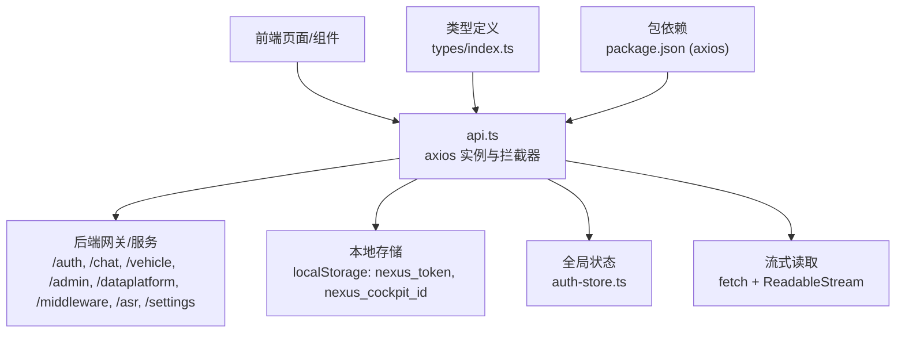
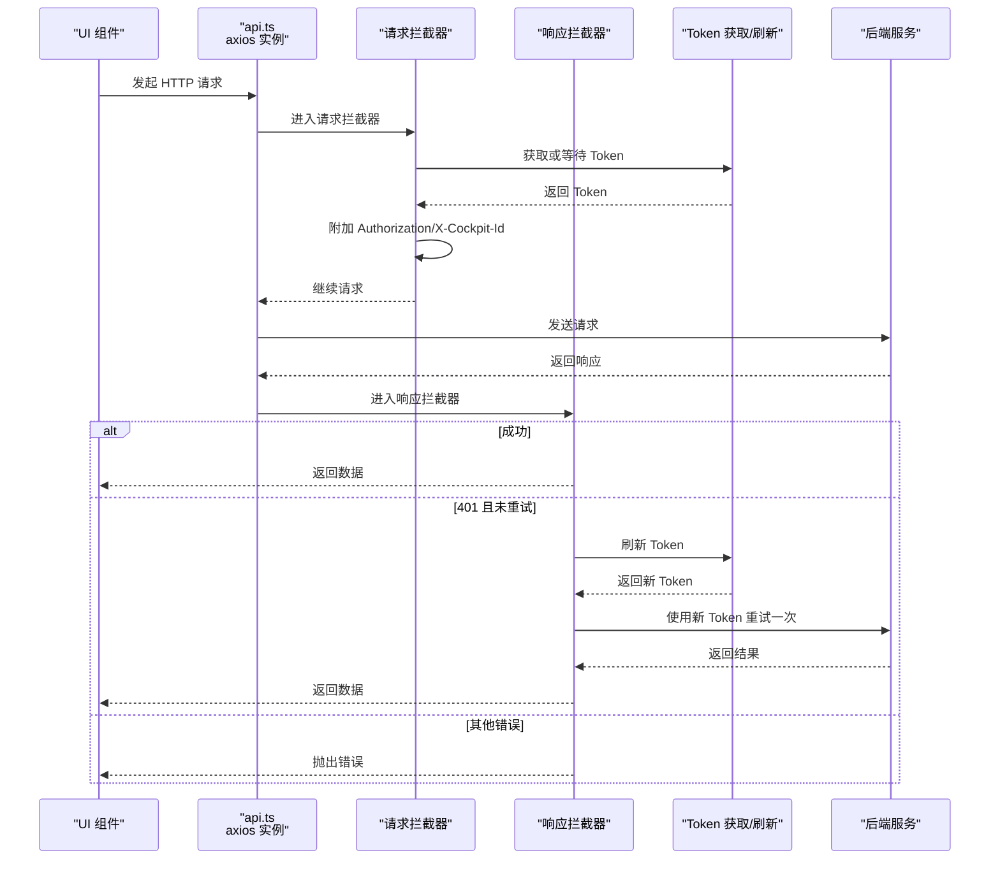
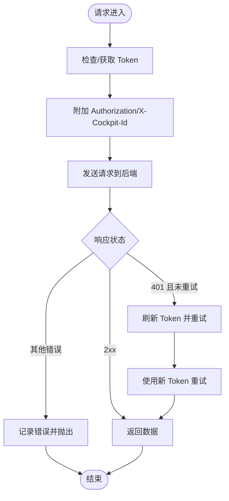
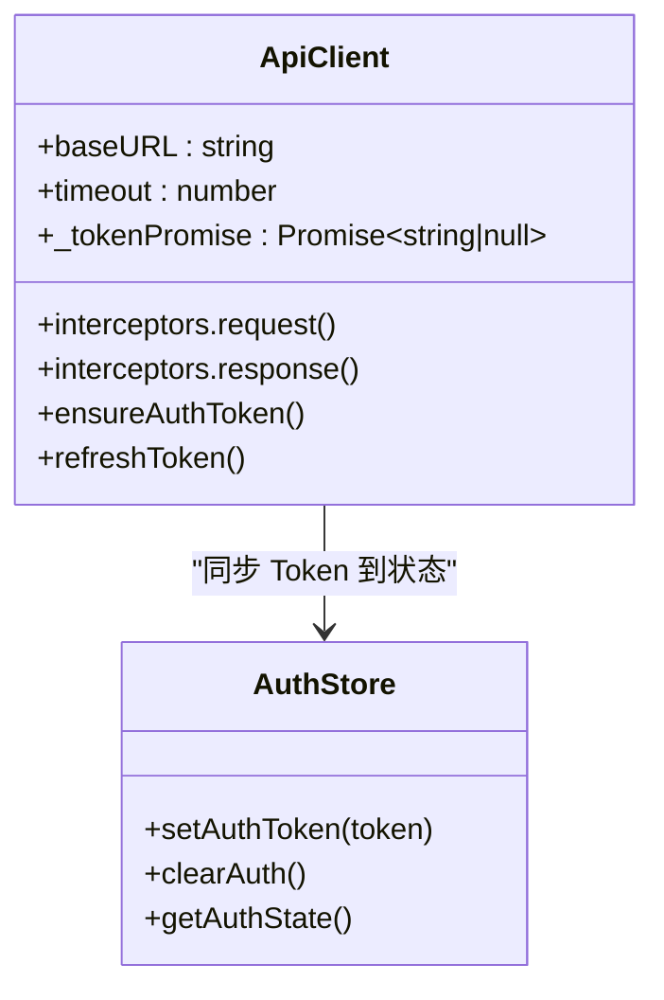
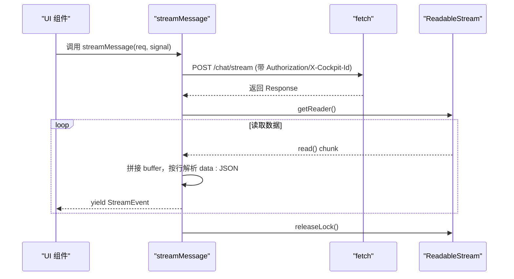
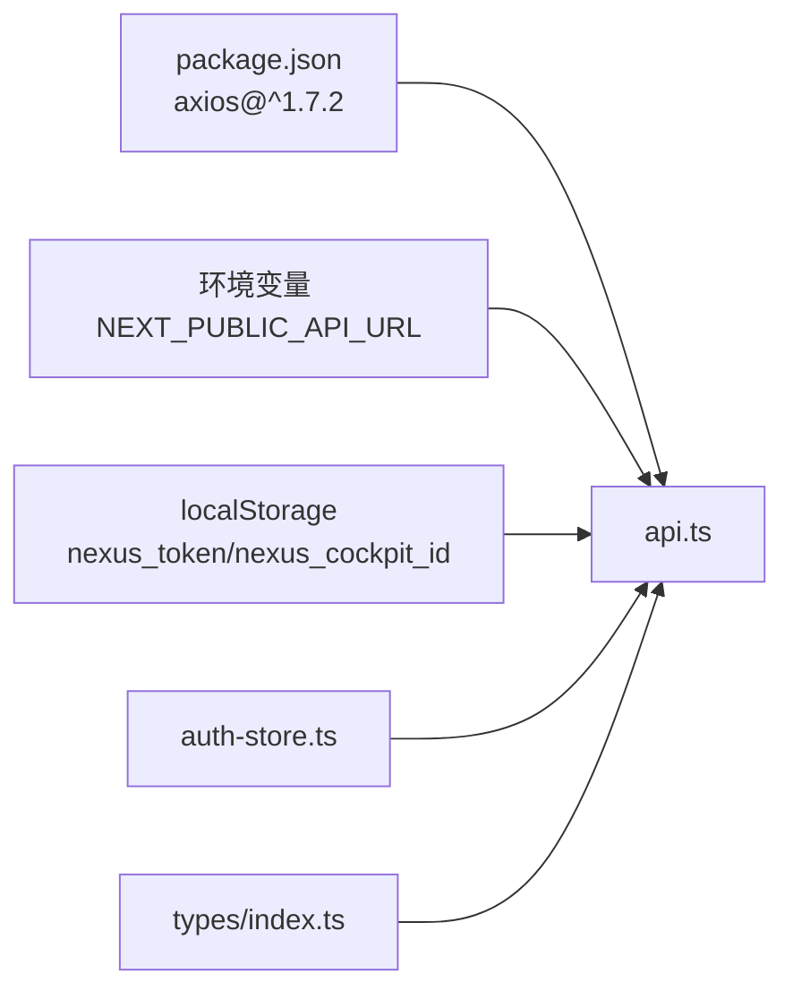

# REST API 客户端

<cite>
**本文引用的文件**   
- [api.ts](file://frontend_design/src/lib/api.ts)
- [index.ts](file://frontend_design/src/types/index.ts)
- [auth-store.ts](file://frontend_design/src/stores/auth-store.ts)
- [chat-store.ts](file://frontend_design/src/stores/chat-store.ts)
- [package.json](file://frontend_design/package.json)
</cite>

## 目录
1. [简介](#简介)
2. [项目结构](#项目结构)
3. [核心组件](#核心组件)
4. [架构总览](#架构总览)
5. [详细组件分析](#详细组件分析)
6. [依赖关系分析](#依赖关系分析)
7. [性能与超时控制](#性能与超时控制)
8. [故障排查指南](#故障排查指南)
9. [结论](#结论)
10. [附录：API 调用示例与最佳实践](#附录api-调用示例与最佳实践)

## 简介
本技术文档面向 NexusCockpit 前端的 REST API 客户端，基于 axios 构建统一 HTTP 访问层。重点覆盖以下能力：
- 实例配置与默认策略（基础地址、超时、请求头）
- 请求拦截器：自动附加 JWT Token、多租户隔离（X-Cockpit-Id）
- 响应拦截器：统一错误处理、401 自动刷新 Token 并重试一次
- 流式接口：原生 fetch + ReadableStream 实现 SSE，支持 AbortSignal 取消
- 错误重试与异常处理模式
- 各业务模块 API 调用方法（认证、聊天、车控、管理、数据中台、中间件、ASR、设置、会话、声纹）
- 最佳实践：请求取消、并发控制、性能优化技巧

## 项目结构
前端 API 客户端位于 frontend_design/src/lib/api.ts，类型定义在 types/index.ts，认证状态管理在 stores/auth-store.ts，聊天状态管理在 stores/chat-store.ts。axios 作为 HTTP 客户端通过 package.json 引入。

图表来源
- [api.ts:118-175](file://frontend_design/src/lib/api.ts#L118-L175)
- [auth-store.ts:58-103](file://frontend_design/src/stores/auth-store.ts#L58-L103)
- [package.json:17](file://frontend_design/package.json#L17)

章节来源
- [api.ts:1-175](file://frontend_design/src/lib/api.ts#L1-L175)
- [package.json:12-20](file://frontend_design/package.json#L12-L20)

## 核心组件
- axios 实例与拦截器
  - baseURL 从环境变量读取，默认 Go 网关地址
  - 默认超时 30 秒
  - 请求拦截器：自动注入 Authorization 与 X-Cockpit-Id
  - 响应拦截器：统一错误打印；401 时清除旧 Token 并刷新后重试一次
- Token 获取与缓存
  - ensureAuthToken：开发环境自动拉取 /auth/token，解析 exp 判断是否复用
  - refreshToken：强制刷新并清理旧 Token，返回新 Promise
  - 全局 _tokenPromise 保证并发请求共用同一 Token 获取流程
- 流式接口
  - streamMessage：原生 fetch 发送 POST，使用 ReadableStream 逐块解析 data: JSON 行，支持 AbortSignal 取消
  - StreamError：携带 HTTP 状态码的错误类
- 业务 API 封装
  - 认证、聊天、车控、健康与管理、知识库、座舱、数据中台、中间件、ASR、设置、会话、声纹等

章节来源
- [api.ts:40-175](file://frontend_design/src/lib/api.ts#L40-L175)
- [api.ts:247-354](file://frontend_design/src/lib/api.ts#L247-L354)

## 架构总览
下图展示前端 API 客户端与后端交互的关键路径，包括鉴权、多租户隔离、错误重试与流式传输。

图表来源
- [api.ts:118-175](file://frontend_design/src/lib/api.ts#L118-L175)
- [api.ts:55-115](file://frontend_design/src/lib/api.ts#L55-L115)

## 详细组件分析

### 实例配置与拦截器
- 实例配置
  - baseURL 来自环境变量，默认 Go 网关地址
  - timeout 默认 30 秒
  - headers 默认 application/json
- 请求拦截器
  - 确保 Token 存在并附加 Authorization
  - 附加 X-Cockpit-Id 实现多租户隔离
- 响应拦截器
  - 统一错误日志输出
  - 401 自动刷新 Token 并重试一次（标记 _retried 防止死循环）

图表来源
- [api.ts:118-175](file://frontend_design/src/lib/api.ts#L118-L175)

章节来源
- [api.ts:118-175](file://frontend_design/src/lib/api.ts#L118-L175)

### Token 管理与多租户隔离
- Token 获取
  - ensureAuthToken：若 localStorage 中存在有效 Token（含 role 且未过期），直接复用并同步到 auth-store
  - 否则调用 /auth/token 获取新 Token，写入 localStorage 并同步到 auth-store
- 强制刷新
  - refreshToken：删除旧 Token，重新获取并返回 Promise
- 并发安全
  - 全局 _tokenPromise 避免重复获取，所有并发请求共享同一 Token 获取过程
- 多租户隔离
  - 请求拦截器从 localStorage 读取 nexus_cockpit_id，并附加为 X-Cockpit-Id 请求头
  - 流式接口也显式附加该头部

图表来源
- [api.ts:55-115](file://frontend_design/src/lib/api.ts#L55-L115)
- [auth-store.ts:111-135](file://frontend_design/src/stores/auth-store.ts#L111-L135)

章节来源
- [api.ts:55-115](file://frontend_design/src/lib/api.ts#L55-L115)
- [auth-store.ts:58-103](file://frontend_design/src/stores/auth-store.ts#L58-L103)

### 流式接口（SSE）
- 使用原生 fetch 发送 POST，传递 AbortSignal 以支持取消
- 使用 ReadableStream 逐块读取，按行解析 data: JSON，遇到 [DONE] 结束
- 非 2xx 响应抛出 StreamError，携带 status 便于上层回退
- 与 axios 拦截器一致的 Token 与多租户头部附加逻辑

图表来源
- [api.ts:261-341](file://frontend_design/src/lib/api.ts#L261-L341)

章节来源
- [api.ts:261-341](file://frontend_design/src/lib/api.ts#L261-L341)

### 业务 API 封装概览
- 认证
  - login(userId, password)：POST /auth/token，成功后写 Token 并同步到 auth-store
  - logout()：清除 Token 并同步到 auth-store
- 聊天
  - sendMessage(req)：POST /chat，返回完整回复
  - streamMessage(req, signal)：SSE 流式事件
- 车控
  - sendVehicleCommand(cmd)：POST /vehicle/command
  - getVehicleStatus()：GET /vehicle/status
  - updateVehicleLocation(lat, lng)：POST /vehicle/location
- 健康与管理
  - getHealth()：GET /health
  - getSkills()：GET /admin/skills
  - changePassword(old, new)：POST /auth/change-password
  - sendVerifyCode(phone)：POST /auth/send-code
  - changePasswordByCode(phone, code, new)：POST /auth/reset-password-by-code
  - getCacheStats()：GET /admin/cache/stats
- 知识库
  - saveConfig(config)：POST /admin/config
  - getKBStats()：GET /admin/kb/stats
  - uploadKBDocument(file, category)：POST /admin/kb/upload (multipart)
  - reindexKB()：POST /admin/kb/reindex
- 座舱
  - getCockpits()：GET /settings/cockpits
  - registerCockpit(body)：POST /settings/cockpits
  - updateCockpit(id, body)：PUT /settings/cockpits/:id
  - deleteCockpit(id)：DELETE /settings/cockpits/:id
  - getCockpitStatus(id)：GET /cockpit/:id/status
  - sendCockpitChat(id, text, userId)：POST /cockpit/:id/chat
- 数据中台
  - getDataPlatformOverview()：GET /dataplatform/overview
  - getCockpitDetail(id)：GET /dataplatform/cockpit/:id
  - getConcurrency()：GET /dataplatform/concurrency
  - getAlerts(hours, cockpitId)：GET /dataplatform/alerts?hours&cockpit_id
  - getAgentActivity(hours, cockpitId)：GET /dataplatform/agent/activity?hours&cockpit_id
  - getCockpitComparison()：GET /dataplatform/comparison
  - getCacheTrend()：GET /dataplatform/cache-trend
- 中间件状态
  - getAllMiddlewareStatus()：GET /middleware/，兼容 Go 网关与 Python 后端两种格式
  - getMiddlewareStatus(name)：GET /middleware/:name
- ASR
  - transcribeAudio(blob)：POST /asr/transcribe (multipart)，超时 60s
- 设置
  - getMiddlewareConfig()：GET /settings/middleware
  - updateMiddlewareConfig(body)：PUT /settings/middleware
  - getUsers()：GET /settings/users
  - registerUser(body)：POST /settings/users
  - deleteUser(user_id)：DELETE /settings/users/:user_id
  - resetUserPassword(user_id, body)：PUT /settings/users/:user_id/password
- 会话
  - listChatSessions()：GET /chat/sessions
  - createChatSession(title, userId)：POST /chat/sessions
  - deleteChatSession(sessionId)：DELETE /chat/sessions/:sessionId
  - getSessionMessages(sessionId)：GET /chat/sessions/:sessionId/messages
  - updateChatSessionTitle(sessionId, title)：PATCH /chat/sessions/:sessionId/title
- 声纹
  - getVoiceprintStatus(cockpitId)：GET /settings/voiceprint/status
  - enrollVoiceprint(cockpitId, userId, audioFile)：POST /settings/voiceprint/enroll (multipart)
  - verifyVoiceprint(cockpitId, audioFile)：POST /settings/voiceprint/verify (multipart)，成功后自动保存 Token
  - deleteVoiceprint(userId, cockpitId)：DELETE /settings/voiceprint/:userId

章节来源
- [api.ts:203-786](file://frontend_design/src/lib/api.ts#L203-L786)

## 依赖关系分析
- axios：HTTP 客户端库，提供实例、拦截器、超时控制
- 环境变量：NEXT_PUBLIC_API_URL 决定 baseURL
- 本地存储：nexus_token、nexus_cockpit_id
- 状态管理：auth-store.ts 负责 Token 与角色、座舱 ID 的持久化与监听

图表来源
- [package.json:17](file://frontend_design/package.json#L17)
- [api.ts:40-48](file://frontend_design/src/lib/api.ts#L40-L48)
- [auth-store.ts:24-26](file://frontend_design/src/stores/auth-store.ts#L24-L26)

章节来源
- [package.json:12-20](file://frontend_design/package.json#L12-L20)
- [api.ts:40-48](file://frontend_design/src/lib/api.ts#L40-L48)

## 性能与超时控制
- 默认超时
  - axios 实例默认 30 秒，适用于大多数短请求
  - ASR 识别接口单独设置为 60 秒，避免长耗时任务被中断
- 并发控制
  - 全局 _tokenPromise 避免重复 Token 获取，减少网络抖动影响
  - 建议对高频读接口进行前端缓存（如健康检查、中间件状态）
- 流式传输
  - 使用 ReadableStream 逐步渲染，降低首屏延迟
  - 支持 AbortSignal 取消，避免无效资源占用
- 错误重试
  - 仅针对 401 自动刷新 Token 并重试一次，避免无限重试
  - 其他错误由调用方决定重试策略（指数退避、限流）

[本节为通用指导，不直接分析具体文件]

## 故障排查指南
- 常见问题定位
  - 401 未刷新：确认 refreshToken 是否被触发，检查 _retried 标记与 Token 有效性
  - 多租户隔离失败：检查 localStorage 中 nexus_cockpit_id 是否存在且正确
  - 流式接口无响应：检查浏览器控制台是否有 StreamError，确认服务端 SSE 协议
  - 超时问题：确认接口耗时是否超过默认 30 秒，必要时提高特定接口超时
- 调试建议
  - 在响应拦截器中打印错误信息，定位状态码与消息
  - 使用浏览器开发者工具查看请求头是否包含 Authorization 与 X-Cockpit-Id
  - 对于流式接口，观察 ReadableStream 读取过程与缓冲区拼接

章节来源
- [api.ts:152-175](file://frontend_design/src/lib/api.ts#L152-L175)
- [api.ts:283-341](file://frontend_design/src/lib/api.ts#L283-L341)

## 结论
NexusCockpit 前端 REST API 客户端以 axios 为核心，结合拦截器实现了统一的鉴权、多租户隔离、错误处理与自动重试机制。流式接口采用原生 fetch + ReadableStream，满足实时交互需求。通过合理的超时控制与并发管理，整体具备高可用性与良好扩展性。

[本节为总结，不直接分析具体文件]

## 附录：API 调用示例与最佳实践

### 认证模块
- 登录
  - 调用 login(userId, password)，成功后 Token 自动写入 localStorage 并同步到 auth-store
- 退出
  - 调用 logout()，清除 Token 并重置状态

章节来源
- [api.ts:203-241](file://frontend_design/src/lib/api.ts#L203-L241)
- [auth-store.ts:111-135](file://frontend_design/src/stores/auth-store.ts#L111-L135)

### 聊天模块
- 非流式发送
  - sendMessage(req) 返回完整回复
- 流式发送
  - streamMessage(req, signal) 异步生成器，yield StreamEvent
  - 使用 AbortController 传入 signal 可取消正在进行的流式请求

章节来源
- [api.ts:247-354](file://frontend_design/src/lib/api.ts#L247-L354)

### 车控模块
- 发送命令
  - sendVehicleCommand(cmd)
- 查询状态
  - getVehicleStatus()
- 更新位置
  - updateVehicleLocation(latitude, longitude)

章节来源
- [api.ts:360-376](file://frontend_design/src/lib/api.ts#L360-L376)

### 健康与管理模块
- 健康检查
  - getHealth()
- 技能列表
  - getSkills()
- 密码修改
  - changePassword(old, new)
- 验证码相关
  - sendVerifyCode(phone), changePasswordByCode(phone, code, new)
- 缓存统计
  - getCacheStats()

章节来源
- [api.ts:382-423](file://frontend_design/src/lib/api.ts#L382-L423)

### 知识库模块
- 保存配置
  - saveConfig(config)
- 知识库统计
  - getKBStats()
- 上传文档
  - uploadKBDocument(file, category)
- 重建索引
  - reindexKB()

章节来源
- [api.ts:429-456](file://frontend_design/src/lib/api.ts#L429-L456)

### 座舱模块
- 列表/注册/更新/注销
  - getCockpits(), registerCockpit(body), updateCockpit(id, body), deleteCockpit(id)
- 状态/对话
  - getCockpitStatus(id), sendCockpitChat(id, text, userId)

章节来源
- [api.ts:462-511](file://frontend_design/src/lib/api.ts#L462-L511)

### 数据中台模块
- 概览/详情/并发
  - getDataPlatformOverview(), getCockpitDetail(id), getConcurrency()
- 告警/活动/对比/趋势
  - getAlerts(hours, cockpitId), getAgentActivity(hours, cockpitId), getCockpitComparison(), getCacheTrend()

章节来源
- [api.ts:517-561](file://frontend_design/src/lib/api.ts#L517-L561)

### 中间件状态模块
- 获取全部状态
  - getAllMiddlewareStatus() 兼容 Go 网关与 Python 后端两种格式
- 获取单个状态
  - getMiddlewareStatus(name)

章节来源
- [api.ts:575-605](file://frontend_design/src/lib/api.ts#L575-L605)

### ASR 模块
- 语音转文字
  - transcribeAudio(audioBlob)，超时 60 秒

章节来源
- [api.ts:611-625](file://frontend_design/src/lib/api.ts#L611-L625)

### 设置模块
- 中间件配置
  - getMiddlewareConfig(), updateMiddlewareConfig(body)
- 用户管理
  - getUsers(), registerUser(body), deleteUser(user_id), resetUserPassword(user_id, body)

章节来源
- [api.ts:631-668](file://frontend_design/src/lib/api.ts#L631-L668)

### 会话模块
- 会话管理
  - listChatSessions(), createChatSession(title, userId), deleteChatSession(sessionId)
- 消息管理
  - getSessionMessages(sessionId), updateChatSessionTitle(sessionId, title)

章节来源
- [api.ts:685-721](file://frontend_design/src/lib/api.ts#L685-L721)

### 声纹模块
- 状态/注册/验证/删除
  - getVoiceprintStatus(cockpitId), enrollVoiceprint(cockpitId, userId, audioFile), verifyVoiceprint(cockpitId, audioFile), deleteVoiceprint(userId, cockpitId)
- 验证成功后自动保存 Token

章节来源
- [api.ts:727-785](file://frontend_design/src/lib/api.ts#L727-L785)

### 最佳实践
- 请求取消
  - 对长耗时或流式请求使用 AbortController，及时释放资源
- 并发控制
  - 利用全局 _tokenPromise 避免重复 Token 获取
  - 对高频接口增加前端缓存与去抖
- 性能优化
  - 合理设置超时，区分短请求与长耗时任务
  - 使用流式传输提升用户体验
  - 统一错误处理，减少重复代码

[本节为通用指导，不直接分析具体文件]