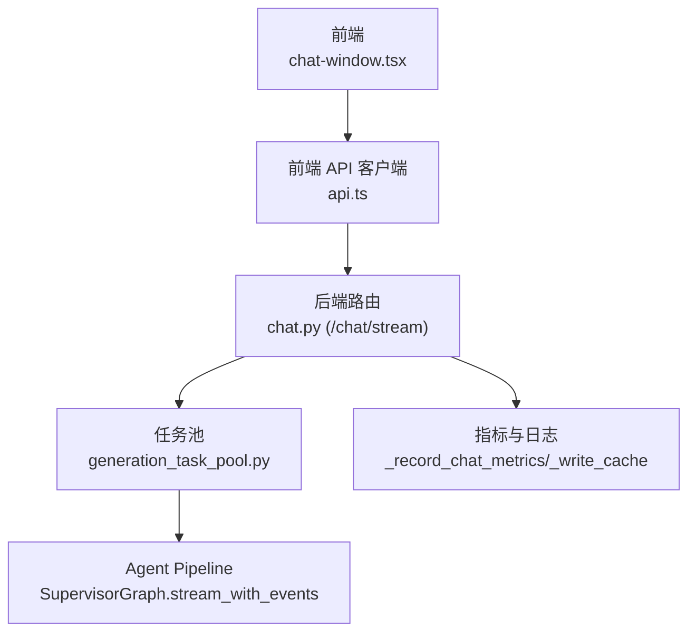
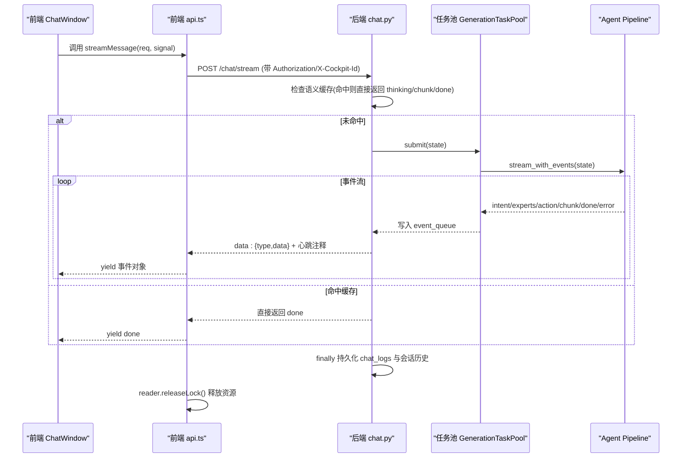
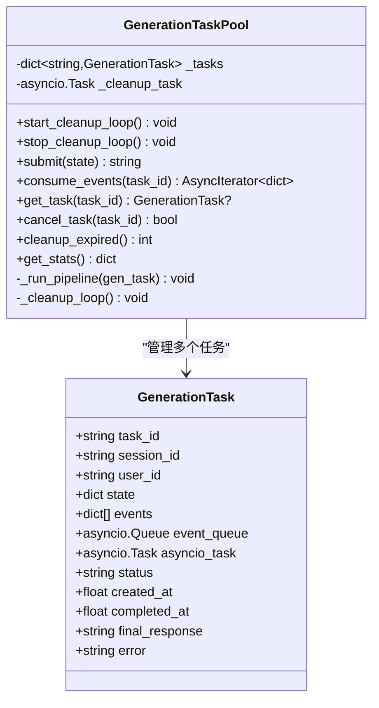
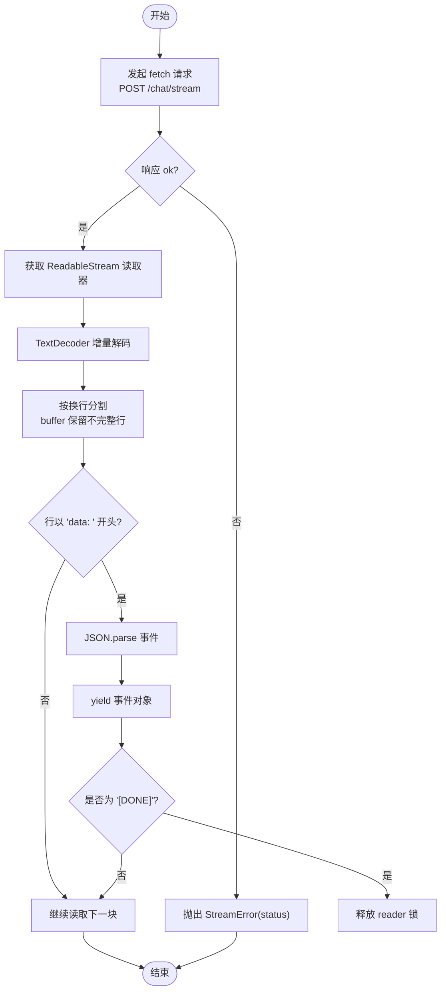
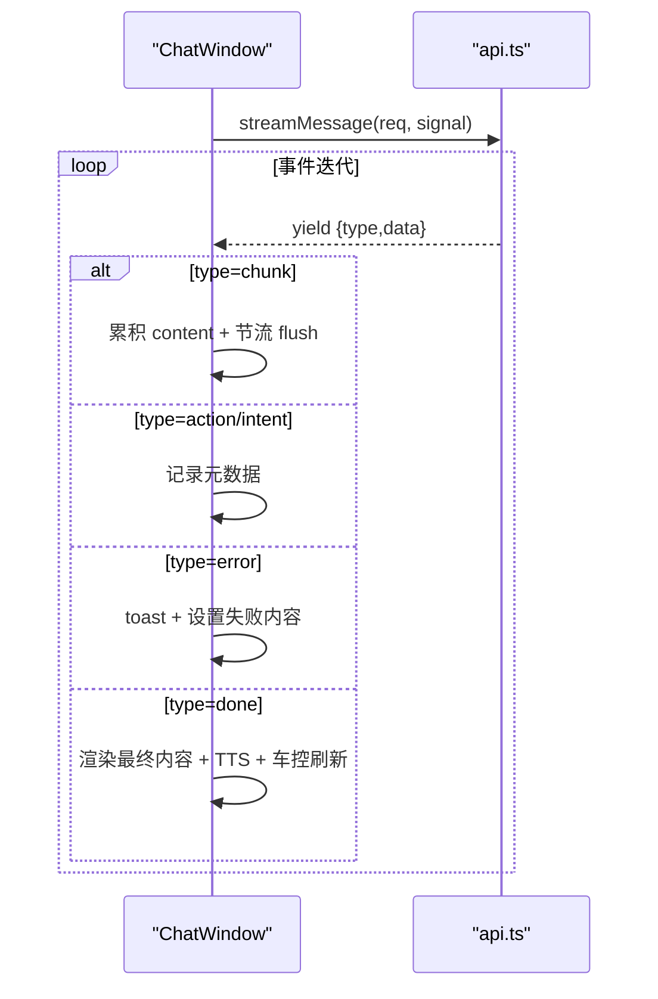
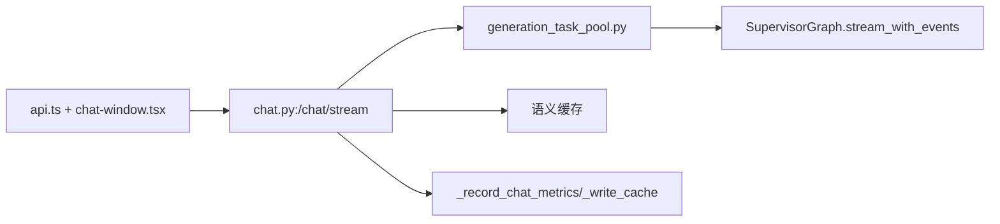

# SSE 流式通信

<cite>
**本文引用的文件**   
- [chat.py](file://backend_design/nexus/api/routes/chat.py)
- [generation_task_pool.py](file://backend_design/nexus/agent/generation_task_pool.py)
- [api.ts](file://frontend_design/src/lib/api.ts)
- [chat-window.tsx](file://frontend_design/src/components/chat/chat-window.tsx)
- [index.ts](file://frontend_design/src/types/index.ts)
</cite>

## 目录
1. [简介](#简介)
2. [项目结构](#项目结构)
3. [核心组件](#核心组件)
4. [架构总览](#架构总览)
5. [详细组件分析](#详细组件分析)
6. [依赖关系分析](#依赖关系分析)
7. [性能考量](#性能考量)
8. [故障排查指南](#故障排查指南)
9. [结论](#结论)
10. [附录：使用示例与最佳实践](#附录使用示例与最佳实践)

## 简介
本技术文档围绕 NexusCockpit 的 SSE（Server-Sent Events）流式通信实现，系统阐述前后端在流式对话中的协作机制。重点包括：
- 后端 FastAPI 通过 StreamingResponse 输出结构化事件，结合 GenerationTaskPool 将 Agent pipeline 生命周期与 SSE 连接解耦
- 前端使用原生 fetch + ReadableStream 逐块读取、TextDecoder 解码、缓冲区管理保证跨 chunk 数据完整性
- 异步生成器模式实现逐块 yield 事件对象，AbortSignal 支持请求取消，finally 中释放资源
- StreamError 自定义错误类承载 HTTP 状态码，便于调用方差异化处理
- 心跳保活、降级策略、指标记录与日志持久化等工程化能力

## 项目结构
SSE 相关代码主要分布在后端 API 路由与任务池、前端 API 客户端与聊天窗口组件中：
- 后端
  - chat.py：定义 /chat/stream 端点，负责事件生成、心跳、缓存命中快速返回、会话锁、指标与日志持久化
  - generation_task_pool.py：GenerationTaskPool 托管后台 pipeline，事件缓冲队列解耦消费者（SSE）与生产者（Agent）
- 前端
  - api.ts：streamMessage() 使用 fetch + ReadableStream 解析 data: 行，实现 AbortSignal 取消与资源释放
  - chat-window.tsx：消费 streamMessage 的 AsyncGenerator，节流更新 UI，TTS 播放与车控联动
  - types/index.ts：StreamEvent 类型定义，统一事件字段

**图示来源** 
- [chat.py:467-686](file://backend_design/nexus/api/routes/chat.py#L467-L686)
- [generation_task_pool.py:68-112](file://backend_design/nexus/agent/generation_task_pool.py#L68-L112)
- [api.ts:261-341](file://frontend_design/src/lib/api.ts#L261-L341)
- [chat-window.tsx:288-401](file://frontend_design/src/components/chat/chat-window.tsx#L288-L401)

**章节来源**
- [chat.py:467-686](file://backend_design/nexus/api/routes/chat.py#L467-L686)
- [generation_task_pool.py:68-112](file://backend_design/nexus/agent/generation_task_pool.py#L68-L112)
- [api.ts:261-341](file://frontend_design/src/lib/api.ts#L261-L341)
- [chat-window.tsx:288-401](file://frontend_design/src/components/chat/chat-window.tsx#L288-L401)

## 核心组件
- 后端事件生成器（FastAPI StreamingResponse）
  - 通过 event_generator() 异步生成器按配置间隔发送心跳注释行，避免中间代理超时
  - 优先走语义缓存命中路径，直接以 thinking/chunk/done 事件返回
  - 未命中时进入任务池或直连 Agent 图，逐事件产出 intent/experts/action/chunk/done/error
  - finally 块保障会话历史与 chat_logs 成对写入，即使流中断也填充兜底话术
- 任务池（GenerationTaskPool）
  - submit() 提交后台 asyncio.Task 执行 pipeline，事件写入 event_queue 与 events 列表
  - consume_events() 提供 SSE 消费者接口，超时轮询队列并处理 completed/failed/cancelled 收尾
  - cancel_task() 仅用户主动调用才终止 pipeline；页面切换不终止
  - 后台清理循环定期删除过期任务，防止内存泄漏
- 前端流式客户端（fetch + ReadableStream）
  - streamMessage() 使用 TextDecoder(stream=true) 增量解码，维护 buffer 拼接完整行
  - 按 data: 前缀解析 JSON，yield 事件对象；[DONE] 提前结束
  - AbortSignal 传入 fetch，reader.releaseLock() 确保资源释放
  - StreamError 携带 status，用于区分 404/501 触发降级到非流式
- 前端消费与 UI 更新（ChatWindow）
  - 模块级持有 _abortController、_streamingContent、_assistantId，组件卸载不中断后台推理
  - 节流 flush（每 50ms）避免频繁 setState，done 事件后 TTS 朗读与车控刷新

**章节来源**
- [chat.py:467-686](file://backend_design/nexus/api/routes/chat.py#L467-L686)
- [generation_task_pool.py:113-232](file://backend_design/nexus/agent/generation_task_pool.py#L113-L232)
- [api.ts:261-341](file://frontend_design/src/lib/api.ts#L261-L341)
- [chat-window.tsx:184-208](file://frontend_design/src/components/chat/chat-window.tsx#L184-L208)

## 架构总览
下图展示一次完整的 SSE 流式对话流程，从前端发起请求到后端事件推送与最终完成。

**图示来源** 
- [chat.py:467-686](file://backend_design/nexus/api/routes/chat.py#L467-L686)
- [generation_task_pool.py:146-232](file://backend_design/nexus/agent/generation_task_pool.py#L146-L232)
- [api.ts:261-341](file://frontend_design/src/lib/api.ts#L261-L341)

## 详细组件分析

### 后端事件生成与任务池
- 事件生成器要点
  - 心跳保活：按 sse_heartbeat_interval 发送 ": heartbeat\n\n"
  - 缓存命中：直接返回 thinking/chunk/done，不走 Agent 流式
  - 任务池路径：task_pool.submit -> consume_events -> yield 事件
  - 降级路径：无任务池时回退 agent_graph.stream_with_events
  - finally 保障：full_response 为空时填充兜底话术，强制写入 chat_logs
- 任务池设计
  - GenerationTask：封装 task_id/session/user/state/events/event_queue/task/status/timestamps/final_response/error
  - _run_pipeline：遍历 stream_with_events，写入 events 与 event_queue，捕获 done/error/cancelled
  - consume_events：超时轮询队列，任务完成后补齐剩余事件并发送 done
  - cancel_task：仅用户主动调用，终止 asyncio.Task
  - cleanup_expired：定时清理已完成超过 _EXPIRE_SECONDS 的任务

**图示来源** 
- [generation_task_pool.py:36-112](file://backend_design/nexus/agent/generation_task_pool.py#L36-L112)
- [generation_task_pool.py:146-232](file://backend_design/nexus/agent/generation_task_pool.py#L146-L232)

**章节来源**
- [chat.py:467-686](file://backend_design/nexus/api/routes/chat.py#L467-L686)
- [generation_task_pool.py:68-232](file://backend_design/nexus/agent/generation_task_pool.py#L68-L232)

### 前端流式客户端与错误处理
- streamMessage() 实现
  - fetch POST /chat/stream，附加 Authorization 与 X-Cockpit-Id
  - response.body.getReader() 获取 ReadableStream，new TextDecoder() 增量解码
  - buffer 累积跨 chunk 的不完整行，按 "\n" 分割，过滤 "data: " 前缀
  - JSON.parse 解析事件，yield 给调用方；"[DONE]" 提前结束
  - finally 中 reader.releaseLock() 确保资源释放
- StreamError 自定义错误
  - 继承 Error，携带 status 字段，便于调用方判断是否降级
- 降级策略
  - 当 status 为 404/501 时，自动回退到非流式 sendMessage()

**图示来源** 
- [api.ts:261-341](file://frontend_design/src/lib/api.ts#L261-L341)

**章节来源**
- [api.ts:261-341](file://frontend_design/src/lib/api.ts#L261-L341)
- [types/index.ts:39-52](file://frontend_design/src/types/index.ts#L39-L52)

### 前端消费与 UI 更新
- ChatWindow 消费流式事件
  - for await (const event of streamMessage(...)) 逐块更新
  - type=chunk：累积 fullContent，节流 scheduleFlush（每 50ms）
  - type=intent/action：记录意图与动作，done 后写入消息元数据
  - type=error：toast 提示并设置失败内容
  - type=done：最终渲染、TTS 朗读、车控面板刷新
- 模块级状态管理
  - _abortController、_streamingContent、_assistantId 提升为模块级变量，组件卸载不中断后台推理
  - 仅 handleStop 主动调用 abort 才能停止生成

**图示来源** 
- [chat-window.tsx:288-401](file://frontend_design/src/components/chat/chat-window.tsx#L288-L401)

**章节来源**
- [chat-window.tsx:288-401](file://frontend_design/src/components/chat/chat-window.tsx#L288-L401)

## 依赖关系分析
- 后端依赖
  - FastAPI StreamingResponse 与 async generator
  - GenerationTaskPool 依赖 SupervisorGraph.stream_with_events
  - 指标与日志：_record_chat_metrics、_write_cache、SessionStore/DB
- 前端依赖
  - fetch + ReadableStream + TextDecoder
  - AbortController/AbortSignal 控制取消
  - Zustand store 更新消息与会话
- 耦合与内聚
  - 任务池与 SSE 解耦：事件队列作为契约，降低连接生命周期影响
  - 前端流式逻辑集中在 api.ts，UI 消费集中在 chat-window.tsx，职责清晰

**图示来源** 
- [chat.py:467-686](file://backend_design/nexus/api/routes/chat.py#L467-L686)
- [generation_task_pool.py:68-112](file://backend_design/nexus/agent/generation_task_pool.py#L68-L112)
- [api.ts:261-341](file://frontend_design/src/lib/api.ts#L261-L341)

**章节来源**
- [chat.py:467-686](file://backend_design/nexus/api/routes/chat.py#L467-L686)
- [generation_task_pool.py:68-112](file://backend_design/nexus/agent/generation_task_pool.py#L68-L112)
- [api.ts:261-341](file://frontend_design/src/lib/api.ts#L261-L341)

## 性能考量
- 后端
  - 语义缓存命中直接返回，减少 LLM 调用与延迟
  - 会话级并发锁避免历史交叉污染
  - 任务池限流（最大并发）与后台清理循环防止内存泄漏
  - 心跳保活避免中间代理超时断开
- 前端
  - 节流 flush（50ms）降低 setState 频率
  - 增量解码与缓冲区管理避免重复分配
  - AbortSignal 及时释放 reader，避免资源泄露
- 网络与代理
  - 设置 no-cache、keep-alive、X-Accel-Buffering=no 等头部，确保实时性

[本节为通用指导，无需特定文件引用]

## 故障排查指南
- 常见问题定位
  - 流中断但 pipeline 仍在运行：检查是否调用了 cancel_generation 接口；页面切换不会终止 pipeline
  - 事件缺失或乱码：确认 TextDecoder 与 buffer 拼接逻辑，检查 data: 前缀过滤
  - 401/404/501 错误：根据 StreamError.status 判断，必要时降级为非流式
  - 指标与日志未写入：查看 finally 块是否执行，确认 DB/Redis 连接状态
- 调试技巧
  - 启用后端日志，观察 _record_chat_metrics 与 _write_cache 调用
  - 前端控制台打印事件序列，验证事件顺序与完整性
  - 使用浏览器 Network 面板查看 SSE 响应头与 data: 行

**章节来源**
- [chat.py:633-676](file://backend_design/nexus/api/routes/chat.py#L633-L676)
- [api.ts:283-341](file://frontend_design/src/lib/api.ts#L283-L341)

## 结论
NexusCockpit 的 SSE 流式通信通过后端任务池与前端流式客户端的协同，实现了高可靠、低延迟、可观测的实时对话体验。关键优势包括：
- 生命周期解耦：pipeline 独立于 SSE 连接，断连不丢失结果
- 健壮的数据解析：增量解码与缓冲区管理保证跨 chunk 完整性
- 完善的错误处理：StreamError 与降级策略提升用户体验
- 工程化能力：心跳保活、指标记录、日志持久化与资源释放

[本节为总结，无需特定文件引用]

## 附录：使用示例与最佳实践
- 后端端点
  - POST /chat/stream：接收 ChatRequest，返回 text/event-stream
  - POST /chat：非流式对话（备用）
  - POST /chat/cancel：用户主动取消生成
- 前端调用
  - 使用 streamMessage(req, signal) 获取 AsyncGenerator，for await 消费事件
  - 在 handleStop 中调用 controller.abort() 停止生成
  - 捕获 StreamError 并根据 status 决定降级策略
- 事件类型与字段
  - type=thinking：命中缓存思考提示
  - type=chunk：文本块
  - type=intent/action：意图与动作元数据
  - type=done：完成事件，包含 response/latency_ms/cache_hit
  - type=error：错误信息 message
- 最佳实践
  - 始终在 finally 中释放 reader 锁
  - 合理设置心跳间隔，避免代理超时
  - 使用会话锁保护历史一致性
  - 对敏感查询跳过缓存，避免上下文污染

**章节来源**
- [chat.py:467-719](file://backend_design/nexus/api/routes/chat.py#L467-L719)
- [api.ts:261-341](file://frontend_design/src/lib/api.ts#L261-L341)
- [types/index.ts:39-52](file://frontend_design/src/types/index.ts#L39-L52)