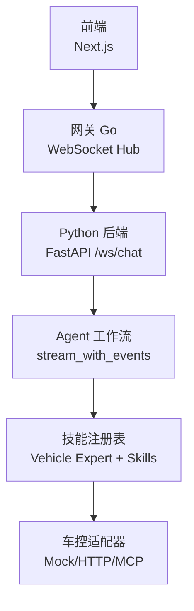
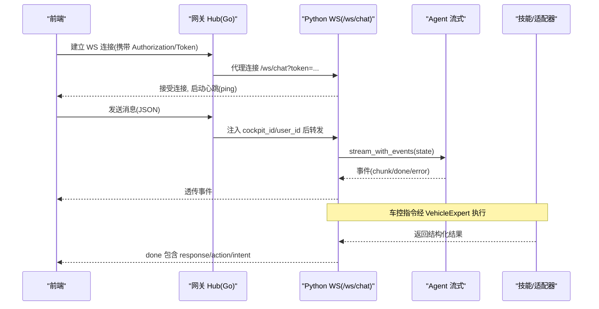
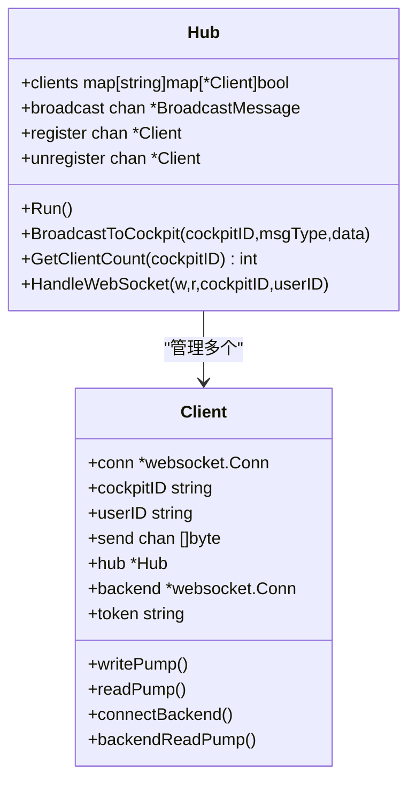
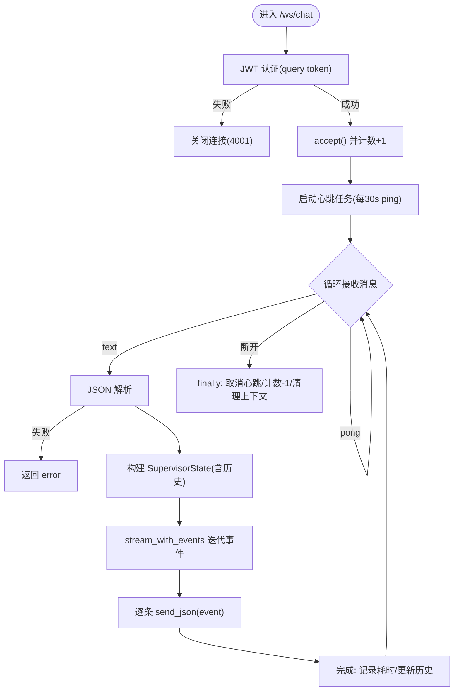
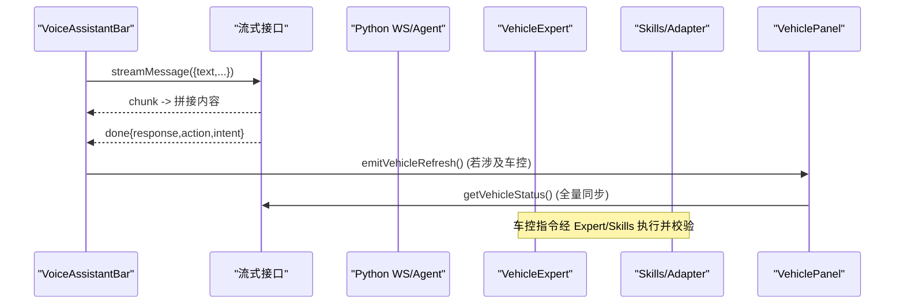
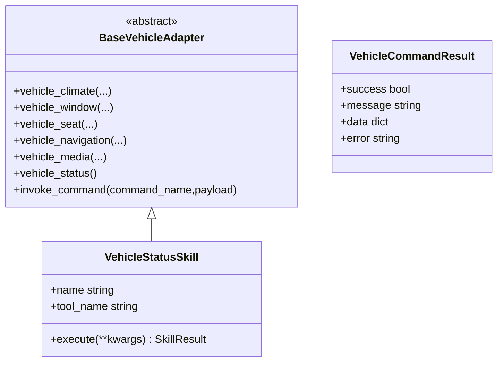
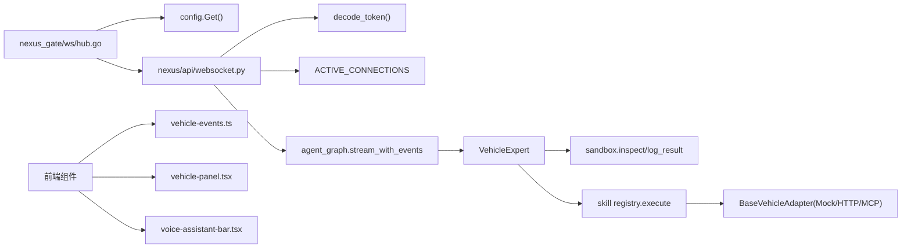

# WebSocket 实时通信

<cite>
**本文引用的文件**   
- [backend_design/nexus/api/websocket.py](file://backend_design/nexus/api/websocket.py)
- [backend_design/nexus_gate/internal/ws/hub.go](file://backend_design/nexus_gate/internal/ws/hub.go)
- [frontend_design/src/lib/vehicle-events.ts](file://frontend_design/src/lib/vehicle-events.ts)
- [frontend_design/src/components/vehicle/vehicle-panel.tsx](file://frontend_design/src/components/vehicle/vehicle-panel.tsx)
- [frontend_design/src/components/vehicle/voice-assistant-bar.tsx](file://frontend_design/src/components/vehicle/voice-assistant-bar.tsx)
- [backend_design/nexus/agent/experts/vehicle_expert.py](file://backend_design/nexus/agent/experts/vehicle_expert.py)
- [backend_design/nexus/vehicle/base.py](file://backend_design/nexus/vehicle/base.py)
- [backend_design/nexus/skills/vehicle/status.py](file://backend_design/nexus/skills/vehicle/status.py)
- [backend_design/nexus/core/cockpit_manager.py](file://backend_design/nexus/core/cockpit_manager.py)
</cite>

## 目录
1. [简介](#简介)
2. [项目结构](#项目结构)
3. [核心组件](#核心组件)
4. [架构总览](#架构总览)
5. [详细组件分析](#详细组件分析)
6. [依赖关系分析](#依赖关系分析)
7. [性能与稳定性](#性能与稳定性)
8. [故障排查指南](#故障排查指南)
9. [结论](#结论)
10. [附录：事件协议与最佳实践](#附录事件协议与最佳实践)

## 简介
本技术文档围绕 NexusCockpit 的 WebSocket 实时通信与车辆事件系统，系统性阐述连接管理、消息格式、心跳检测、重连机制、状态同步与实时推送。同时给出车控事件订阅/发布、状态校验与反馈闭环的实现要点，并提供前端监听与集成示例路径，以及连接池、内存泄漏防护与性能监控的最佳实践。

## 项目结构
NexusCockpit 在网关层（Go）提供 WebSocket Hub，负责客户端连接管理与到 Python AI 后端的代理转发；Python 后端通过 FastAPI 暴露 /ws/chat 接口，实现鉴权、心跳与流式 Agent 响应；前端通过 HTTP 流式接口与事件总线完成交互与 UI 联动。

**图表来源** 
- [backend_design/nexus_gate/internal/ws/hub.go:150-190](file://backend_design/nexus_gate/internal/ws/hub.go#L150-L190)
- [backend_design/nexus/api/websocket.py:71-115](file://backend_design/nexus/api/websocket.py#L71-L115)
- [backend_design/nexus/agent/experts/vehicle_expert.py:43-75](file://backend_design/nexus/agent/experts/vehicle_expert.py#L43-L75)
- [backend_design/nexus/vehicle/base.py:35-92](file://backend_design/nexus/vehicle/base.py#L35-L92)

**章节来源**
- [backend_design/nexus/api/websocket.py:1-209](file://backend_design/nexus/api/websocket.py#L1-L209)
- [backend_design/nexus_gate/internal/ws/hub.go:1-353](file://backend_design/nexus_gate/internal/ws/hub.go#L1-L353)

## 核心组件
- 网关 WebSocket Hub（Go）
  - 负责客户端连接生命周期、广播、心跳 Ping/Pong、到 Python 后端的代理转发与错误处理。
- Python WebSocket 处理器（FastAPI）
  - 基于 query token 进行 JWT 认证，维护活跃连接计数，周期性发送 ping，接收文本消息并驱动 Agent 流式输出。
- 车控专家与技能（Python）
  - VehicleExpert 解析多意图并行执行，沙箱审查与互斥组串行化，结果聚合与验证。
- 前端事件总线与面板（React）
  - vehicle-events 事件总线用于语音助手触发后的车控刷新；VehiclePanel 拉取状态、乐观更新与全量同步；VoiceAssistantBar 流式回复与 TTS 播报。

**章节来源**
- [backend_design/nexus_gate/internal/ws/hub.go:40-121](file://backend_design/nexus_gate/internal/ws/hub.go#L40-L121)
- [backend_design/nexus/api/websocket.py:48-115](file://backend_design/nexus/api/websocket.py#L48-L115)
- [backend_design/nexus/agent/experts/vehicle_expert.py:43-116](file://backend_design/nexus/agent/experts/vehicle_expert.py#L43-L116)
- [frontend_design/src/lib/vehicle-events.ts:18-34](file://frontend_design/src/lib/vehicle-events.ts#L18-L34)
- [frontend_design/src/components/vehicle/vehicle-panel.tsx:167-210](file://frontend_design/src/components/vehicle/vehicle-panel.tsx#L167-L210)
- [frontend_design/src/components/vehicle/voice-assistant-bar.tsx:156-195](file://frontend_design/src/components/vehicle/voice-assistant-bar.tsx#L156-L195)

## 架构总览
整体数据流：前端通过 Gateway WS 建立连接，Gateway 将消息注入 cockpit_id/user_id 后转发至 Python WS；Python 端鉴权后进入 Agent 流式处理，返回 chunk/done/error 等事件；车控指令经 VehicleExpert 并行/串行执行，最终通过技能适配器与 Mock/HTTP/MCP 交互，并将结果回传前端。

**图表来源** 
- [backend_design/nexus_gate/internal/ws/hub.go:150-190](file://backend_design/nexus_gate/internal/ws/hub.go#L150-L190)
- [backend_design/nexus/api/websocket.py:71-115](file://backend_design/nexus/api/websocket.py#L71-L115)
- [backend_design/nexus/agent/experts/vehicle_expert.py:117-177](file://backend_design/nexus/agent/experts/vehicle_expert.py#L117-L177)

## 详细组件分析

### 网关 WebSocket Hub（Go）
- 连接管理
  - Upgrader 按白名单校验 Origin，防止跨站劫持。
  - Hub 以 cockpit_id 为维度维护客户端集合，支持广播与统计。
- 心跳与保活
  - writePump 每 30s 发送 Ping，设置写超时；readPump 设置 PongHandler 重置读超时。
- 后端代理
  - connectBackend 使用配置构建 ws://host:port/ws/chat?token=... 连接。
  - readPump 读取客户端消息，injectCockpitInfo 注入上下文后转发；若后端断开则尝试重连。
  - backendReadPump 将 AI 响应原样转发给客户端。

**图表来源** 
- [backend_design/nexus_gate/internal/ws/hub.go:51-121](file://backend_design/nexus_gate/internal/ws/hub.go#L51-L121)
- [backend_design/nexus_gate/internal/ws/hub.go:150-190](file://backend_design/nexus_gate/internal/ws/hub.go#L150-L190)
- [backend_design/nexus_gate/internal/ws/hub.go:192-274](file://backend_design/nexus_gate/internal/ws/hub.go#L192-L274)

**章节来源**
- [backend_design/nexus_gate/internal/ws/hub.go:22-38](file://backend_design/nexus_gate/internal/ws/hub.go#L22-L38)
- [backend_design/nexus_gate/internal/ws/hub.go:150-190](file://backend_design/nexus_gate/internal/ws/hub.go#L150-L190)
- [backend_design/nexus_gate/internal/ws/hub.go:192-274](file://backend_design/nexus_gate/internal/ws/hub.go#L192-L274)
- [backend_design/nexus_gate/internal/ws/hub.go:276-353](file://backend_design/nexus_gate/internal/ws/hub.go#L276-L353)

### Python WebSocket 处理器（FastAPI）
- 认证与鉴权
  - 从 query 参数 token 解码 JWT，失败直接关闭连接。
- 心跳与连接计数
  - 服务端每 30s 发送 ping，客户端需回复 pong；连接建立时增加 ACTIVE_CONNECTIONS，断开时减少。
- 消息处理与 Agent 流式
  - 接收 JSON 文本，构造 SupervisorState，调用 agent_graph.stream_with_events 逐块推送事件。
  - 会话历史优先从 SessionStore 加载，完成后持久化。

**图表来源** 
- [backend_design/nexus/api/websocket.py:71-115](file://backend_design/nexus/api/websocket.py#L71-L115)
- [backend_design/nexus/api/websocket.py:117-209](file://backend_design/nexus/api/websocket.py#L117-L209)

**章节来源**
- [backend_design/nexus/api/websocket.py:48-92](file://backend_design/nexus/api/websocket.py#L48-L92)
- [backend_design/nexus/api/websocket.py:94-115](file://backend_design/nexus/api/websocket.py#L94-L115)
- [backend_design/nexus/api/websocket.py:117-209](file://backend_design/nexus/api/websocket.py#L117-L209)

### 车控事件系统与状态同步
- 事件订阅与发布
  - 前端通过 vehicle-events.ts 的 emitVehicleRefresh/onVehicleRefresh 实现“命令执行后通知刷新”。
  - VoiceAssistantBar 在收到 done 事件且涉及车控时触发刷新。
- 状态拉取与乐观更新
  - VehiclePanel 首次拉取状态，失败延迟重试后降级 Mock；操作成功后先做乐观更新再异步全量同步。
- 车控执行与校验
  - VehicleExpert 解析多动作，沙箱审查，互斥组串行，独立动作并行；对空调温度、车窗位置、媒体播放等进行结果验证。

**图表来源** 
- [frontend_design/src/components/vehicle/voice-assistant-bar.tsx:156-195](file://frontend_design/src/components/vehicle/voice-assistant-bar.tsx#L156-L195)
- [frontend_design/src/lib/vehicle-events.ts:22-34](file://frontend_design/src/lib/vehicle-events.ts#L22-L34)
- [frontend_design/src/components/vehicle/vehicle-panel.tsx:167-210](file://frontend_design/src/components/vehicle/vehicle-panel.tsx#L167-L210)
- [backend_design/nexus/agent/experts/vehicle_expert.py:117-177](file://backend_design/nexus/agent/experts/vehicle_expert.py#L117-L177)

**章节来源**
- [frontend_design/src/lib/vehicle-events.ts:18-34](file://frontend_design/src/lib/vehicle-events.ts#L18-L34)
- [frontend_design/src/components/vehicle/voice-assistant-bar.tsx:156-195](file://frontend_design/src/components/vehicle/voice-assistant-bar.tsx#L156-L195)
- [frontend_design/src/components/vehicle/vehicle-panel.tsx:167-210](file://frontend_design/src/components/vehicle/vehicle-panel.tsx#L167-L210)
- [backend_design/nexus/agent/experts/vehicle_expert.py:43-116](file://backend_design/nexus/agent/experts/vehicle_expert.py#L43-L116)
- [backend_design/nexus/agent/experts/vehicle_expert.py:327-428](file://backend_design/nexus/agent/experts/vehicle_expert.py#L327-L428)

### 车控适配器抽象与技能
- BaseVehicleAdapter 定义统一接口（空调/车窗/座椅/导航/媒体/状态查询/通用命令）。
- VehicleStatusSkill 作为状态查询技能的示例，封装参数与执行流程。

**图表来源** 
- [backend_design/nexus/vehicle/base.py:19-92](file://backend_design/nexus/vehicle/base.py#L19-L92)
- [backend_design/nexus/skills/vehicle/status.py:15-33](file://backend_design/nexus/skills/vehicle/status.py#L15-L33)

**章节来源**
- [backend_design/nexus/vehicle/base.py:35-92](file://backend_design/nexus/vehicle/base.py#L35-L92)
- [backend_design/nexus/skills/vehicle/status.py:15-33](file://backend_design/nexus/skills/vehicle/status.py#L15-L33)

### 座舱隔离与管理
- CockpitManager 维护座舱配置、默认初始化、中间件资源初始化（Redis/Milvus/MySQL），并提供统计摘要。
- 与 WS 结合：Gateway 根据 cockpit_id 路由与广播，Python 侧可通过 session_key 关联会话与缓存。

**章节来源**
- [backend_design/nexus/core/cockpit_manager.py:75-111](file://backend_design/nexus/core/cockpit_manager.py#L75-L111)
- [backend_design/nexus/core/cockpit_manager.py:136-191](file://backend_design/nexus/core/cockpit_manager.py#L136-L191)
- [backend_design/nexus/core/cockpit_manager.py:193-297](file://backend_design/nexus/core/cockpit_manager.py#L193-L297)

## 依赖关系分析
- 网关 Hub 依赖配置（AllowedOrigins、AIHost/AIPort）、gorilla/websocket。
- Python WS 依赖 FastAPI、JWT 解码、日志、指标、Agent 图与 SessionStore。
- VehicleExpert 依赖沙箱、技能注册表与状态模型。
- 前端依赖 Next.js、事件总线、TTS、音频存储与 Toast。

**图表来源** 
- [backend_design/nexus_gate/internal/ws/hub.go:22-38](file://backend_design/nexus_gate/internal/ws/hub.go#L22-L38)
- [backend_design/nexus/api/websocket.py:35-41](file://backend_design/nexus/api/websocket.py#L35-L41)
- [backend_design/nexus/agent/experts/vehicle_expert.py:76-116](file://backend_design/nexus/agent/experts/vehicle_expert.py#L76-L116)
- [backend_design/nexus/vehicle/base.py:35-92](file://backend_design/nexus/vehicle/base.py#L35-L92)

**章节来源**
- [backend_design/nexus_gate/internal/ws/hub.go:1-353](file://backend_design/nexus_gate/internal/ws/hub.go#L1-L353)
- [backend_design/nexus/api/websocket.py:1-209](file://backend_design/nexus/api/websocket.py#L1-L209)
- [backend_design/nexus/agent/experts/vehicle_expert.py:1-428](file://backend_design/nexus/agent/experts/vehicle_expert.py#L1-L428)
- [backend_design/nexus/vehicle/base.py:1-92](file://backend_design/nexus/vehicle/base.py#L1-L92)
- [frontend_design/src/lib/vehicle-events.ts:1-34](file://frontend_design/src/lib/vehicle-events.ts#L1-L34)
- [frontend_design/src/components/vehicle/vehicle-panel.tsx:1-800](file://frontend_design/src/components/vehicle/vehicle-panel.tsx#L1-L800)
- [frontend_design/src/components/vehicle/voice-assistant-bar.tsx:1-430](file://frontend_design/src/components/vehicle/voice-assistant-bar.tsx#L1-L430)

## 性能与稳定性
- 连接与心跳
  - 网关每 30s Ping，写超时 10s；读超时 60s，PongHandler 重置读超时，避免僵尸连接。
  - Python 端每 30s 发送 ping，异常捕获自动退出心跳协程。
- 并发与限流
  - VehicleExpert 对独立动作并行执行，互斥组内串行，避免硬件冲突；可结合 rate_limiter 限制请求频率。
- 缓冲与背压
  - Gateway 客户端 send 通道容量 256，满则关闭连接，避免内存膨胀；Python 侧逐块推送，降低峰值内存。
- 指标与监控
  - ACTIVE_CONNECTIONS 指标跟踪活跃连接数；建议补充端到端延迟、错误率、重连次数等指标。
- 内存泄漏防护
  - 确保 finally 中取消心跳任务、关闭连接、清理上下文；Hub 在 unregister 时关闭 send channel 并从 map 删除引用。

**章节来源**
- [backend_design/nexus_gate/internal/ws/hub.go:192-219](file://backend_design/nexus_gate/internal/ws/hub.go#L192-L219)
- [backend_design/nexus_gate/internal/ws/hub.go:276-326](file://backend_design/nexus_gate/internal/ws/hub.go#L276-L326)
- [backend_design/nexus/api/websocket.py:101-115](file://backend_design/nexus/api/websocket.py#L101-L115)
- [backend_design/nexus/api/websocket.py:201-209](file://backend_design/nexus/api/websocket.py#L201-L209)
- [backend_design/nexus/agent/experts/vehicle_expert.py:117-177](file://backend_design/nexus/agent/experts/vehicle_expert.py#L117-L177)

## 故障排查指南
- 连接失败
  - 检查 Origin 白名单与 CORS；确认 Authorization Bearer 或 query token 正确传递。
  - 查看 Gateway 日志中 “WS upgrade error”、“WS backend connect failed”。
- 心跳超时
  - 确认客户端是否回复 pong；检查网络延迟与防火墙策略。
- 后端不可用
  - Gateway 会返回 “AI service unavailable”；检查 Python WS 服务健康与端口连通性。
- 车控指令失败
  - 查看 VehicleExpert 的沙箱拦截与结果验证日志；核对目标值与实际值一致性（温度、车窗百分比、媒体状态）。
- 前端状态不同步
  - 检查 emitVehicleRefresh 是否在 done 事件中触发；确认 fetchStatus 重试逻辑与 Mock 降级行为。

**章节来源**
- [backend_design/nexus_gate/internal/ws/hub.go:150-190](file://backend_design/nexus_gate/internal/ws/hub.go#L150-L190)
- [backend_design/nexus_gate/internal/ws/hub.go:276-326](file://backend_design/nexus_gate/internal/ws/hub.go#L276-L326)
- [backend_design/nexus/api/websocket.py:88-92](file://backend_design/nexus/api/websocket.py#L88-L92)
- [backend_design/nexus/agent/experts/vehicle_expert.py:327-428](file://backend_design/nexus/agent/experts/vehicle_expert.py#L327-L428)
- [frontend_design/src/components/vehicle/vehicle-panel.tsx:167-210](file://frontend_design/src/components/vehicle/vehicle-panel.tsx#L167-L210)

## 结论
NexusCockpit 的 WebSocket 实时通信由网关 Hub 与 Python WS 协同完成，具备完善的鉴权、心跳、代理转发与错误恢复能力。车控事件系统通过前端事件总线与后端 Agent/技能协作，实现了稳定的状态同步与实时反馈。建议在关键路径上补充更丰富的指标与告警，持续优化连接池与内存占用，提升大规模并发下的稳定性与性能。

## 附录：事件协议与最佳实践
- 统一消息格式（JSON）
  - type: intent/action/chunk/done/error/ping/pong
  - data: 业务字段（如 text、chunk、response、latency_ms、message、timestamp）
- 心跳机制
  - 服务端定时 ping，客户端必须回复 pong；未回复视为连接失效。
- 重连机制
  - 客户端检测到断线应指数退避重连；Gateway 在后端断开时尝试重连并恢复转发。
- 序列化与反序列化
  - 所有消息均为 JSON；Gateway 在非 JSON 场景下包装为文本并注入 cockpit_id/user_id。
- 连接池与资源管理
  - 控制 send 通道大小，避免阻塞；确保连接关闭时释放所有资源。
- 性能监控
  - 活跃连接数、端到端延迟、错误率、重连次数、消息吞吐等指标纳入观测平台。

**章节来源**
- [backend_design/nexus/api/websocket.py:17-25](file://backend_design/nexus/api/websocket.py#L17-L25)
- [backend_design/nexus/api/websocket.py:101-115](file://backend_design/nexus/api/websocket.py#L101-L115)
- [backend_design/nexus_gate/internal/ws/hub.go:276-353](file://backend_design/nexus_gate/internal/ws/hub.go#L276-L353)