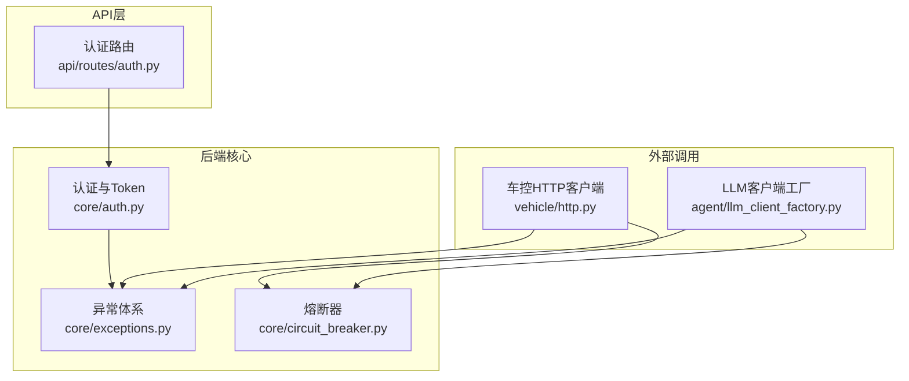
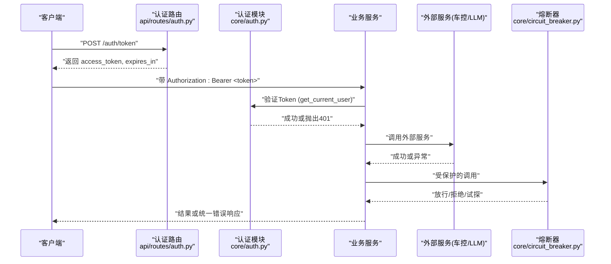
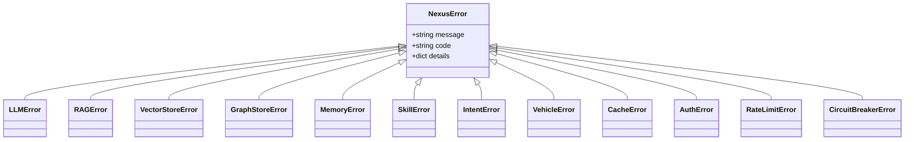
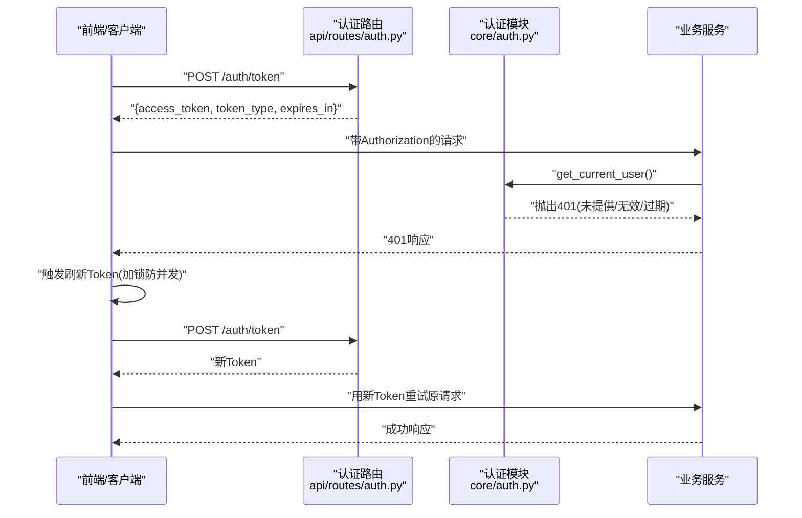
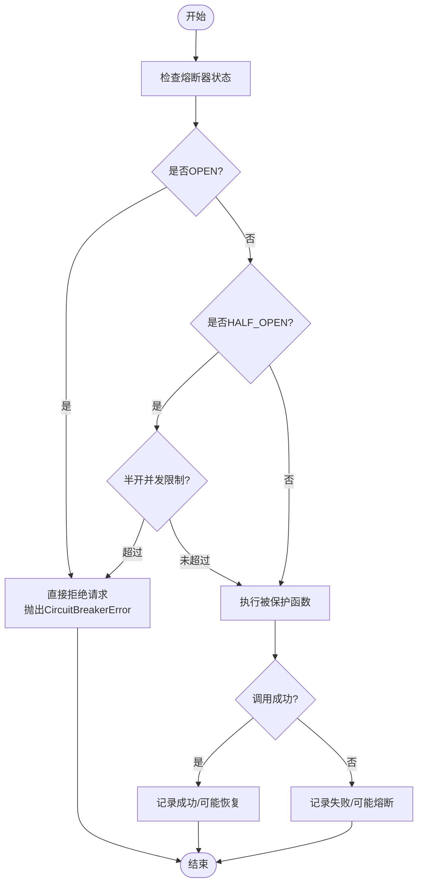
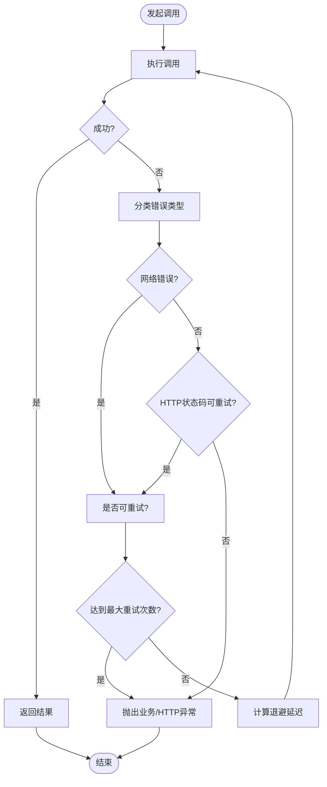
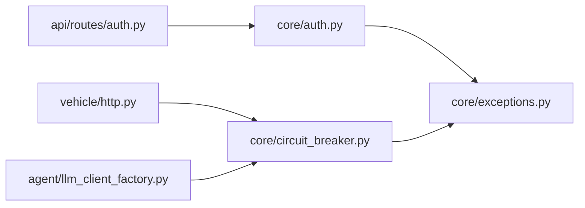

# 错误处理与重试机制

<cite>
**本文引用的文件**   
- [backend_design/nexus/core/exceptions.py](file://backend_design/nexus/core/exceptions.py)
- [backend_design/nexus/core/auth.py](file://backend_design/nexus/core/auth.py)
- [backend_design/nexus/api/routes/auth.py](file://backend_design/nexus/api/routes/auth.py)
- [backend_design/nexus/core/circuit_breaker.py](file://backend_design/nexus/core/circuit_breaker.py)
- [backend_design/nexus/vehicle/http.py](file://backend_design/nexus/vehicle/http.py)
- [backend_design/nexus/agent/llm_client_factory.py](file://backend_design/nexus/agent/llm_client_factory.py)
</cite>

## 目录
1. [引言](#引言)
2. [项目结构](#项目结构)
3. [核心组件](#核心组件)
4. [架构总览](#架构总览)
5. [详细组件分析](#详细组件分析)
6. [依赖关系分析](#依赖关系分析)
7. [性能考量](#性能考量)
8. [故障排查指南](#故障排查指南)
9. [结论](#结论)
10. [附录](#附录)

## 引言
本技术文档聚焦 NexusCockpit 的错误处理与重试机制，系统化阐述统一的错误分类、HTTP 状态码处理、业务异常体系、401 未授权的自动刷新 Token 流程、熔断保护以及可扩展的重试策略。目标是帮助开发者快速理解并正确扩展错误处理与重试逻辑，确保系统在高可用与可观测性方面达到生产要求。

## 项目结构
围绕错误与重试的关键代码主要分布在以下模块：
- 自定义异常体系：backend_design/nexus/core/exceptions.py
- 认证与 Token：backend_design/nexus/core/auth.py、backend_design/nexus/api/routes/auth.py
- 熔断器（故障隔离）：backend_design/nexus/core/circuit_breaker.py
- 车控 HTTP 客户端（外部服务调用示例）：backend_design/nexus/vehicle/http.py
- LLM 客户端工厂（外部服务调用示例）：backend_design/nexus/agent/llm_client_factory.py

图表来源
- [backend_design/nexus/core/exceptions.py:1-128](file://backend_design/nexus/core/exceptions.py#L1-L128)
- [backend_design/nexus/core/auth.py:1-140](file://backend_design/nexus/core/auth.py#L1-L140)
- [backend_design/nexus/api/routes/auth.py:1-194](file://backend_design/nexus/api/routes/auth.py#L1-L194)
- [backend_design/nexus/core/circuit_breaker.py:1-177](file://backend_design/nexus/core/circuit_breaker.py#L1-L177)
- [backend_design/nexus/vehicle/http.py](file://backend_design/nexus/vehicle/http.py)
- [backend_design/nexus/agent/llm_client_factory.py](file://backend_design/nexus/agent/llm_client_factory.py)

章节来源
- [backend_design/nexus/core/exceptions.py:1-128](file://backend_design/nexus/core/exceptions.py#L1-L128)
- [backend_design/nexus/core/auth.py:1-140](file://backend_design/nexus/core/auth.py#L1-L140)
- [backend_design/nexus/api/routes/auth.py:1-194](file://backend_design/nexus/api/routes/auth.py#L1-L194)
- [backend_design/nexus/core/circuit_breaker.py:1-177](file://backend_design/nexus/core/circuit_breaker.py#L1-L177)
- [backend_design/nexus/vehicle/http.py](file://backend_design/nexus/vehicle/http.py)
- [backend_design/nexus/agent/llm_client_factory.py](file://backend_design/nexus/agent/llm_client_factory.py)

## 核心组件
- 统一异常体系：所有业务异常继承自基类，携带人类可读消息、错误码与详情字典，便于前端差异化处理与日志追踪。
- 认证与 Token：提供签发与校验，失败时返回标准 401 响应，并附带 WWW-Authenticate 头，便于客户端识别与刷新。
- 熔断器：对外部不稳定服务进行故障隔离，避免雪崩；支持 CLOSED/OPEN/HALF_OPEN 三态转换与试探恢复。
- 外部调用封装：车控 HTTP 客户端与 LLM 客户端工厂作为典型的外部依赖，应结合熔断与重试策略使用。

章节来源
- [backend_design/nexus/core/exceptions.py:1-128](file://backend_design/nexus/core/exceptions.py#L1-L128)
- [backend_design/nexus/core/auth.py:1-140](file://backend_design/nexus/core/auth.py#L1-L140)
- [backend_design/nexus/api/routes/auth.py:1-194](file://backend_design/nexus/api/routes/auth.py#L1-L194)
- [backend_design/nexus/core/circuit_breaker.py:1-177](file://backend_design/nexus/core/circuit_breaker.py#L1-L177)

## 架构总览
下图展示请求从 API 路由进入，经过认证、业务处理、外部服务调用，并在异常发生时通过统一异常体系与熔断器进行保护与降级。

图表来源
- [backend_design/nexus/api/routes/auth.py:1-194](file://backend_design/nexus/api/routes/auth.py#L1-L194)
- [backend_design/nexus/core/auth.py:1-140](file://backend_design/nexus/core/auth.py#L1-L140)
- [backend_design/nexus/core/circuit_breaker.py:1-177](file://backend_design/nexus/core/circuit_breaker.py#L1-L177)

## 详细组件分析

### 统一异常体系设计
- 基类 NexusError：包含 message、code、details，用于全局捕获与标准化响应。
- 领域异常子类：如 LLMError、RAGError、VectorStoreError、GraphStoreError、MemoryError、SkillError、IntentError、VehicleError、CacheError、AuthError、RateLimitError、CircuitBreakerError。
- 设计要点：
  - 每个异常都有稳定错误码，便于前端按 code 做差异化提示。
  - details 可携带上下文信息（如请求ID、参数摘要），利于日志与监控。
  - 建议在全局异常处理器中将异常转换为 JSON {error, message, details}。

图表来源
- [backend_design/nexus/core/exceptions.py:1-128](file://backend_design/nexus/core/exceptions.py#L1-L128)

章节来源
- [backend_design/nexus/core/exceptions.py:1-128](file://backend_design/nexus/core/exceptions.py#L1-L128)

### 认证与 401 未授权处理及 Token 刷新流程
- 认证流程：
  - 客户端 POST /auth/token 获取 access_token 与 expires_in。
  - 后续请求在 Authorization 头中携带 Bearer Token。
  - get_current_user 依赖解析并验证 Token，失败返回 401，并附带 WWW-Authenticate: Bearer。
- 401 自动刷新策略（建议实现）：
  - 检测过期：decode_token 捕获 ExpiredSignatureError 并抛出 AuthError。
  - 刷新流程：客户端收到 401 后，先尝试刷新 Token（调用 /auth/token），成功后重试原请求。
  - 并发同步：使用单例锁或队列保证同一时刻仅一次刷新，避免风暴。
  - 失败回退：刷新失败则引导用户重新登录。

图表来源
- [backend_design/nexus/api/routes/auth.py:1-194](file://backend_design/nexus/api/routes/auth.py#L1-L194)
- [backend_design/nexus/core/auth.py:1-140](file://backend_design/nexus/core/auth.py#L1-L140)

章节来源
- [backend_design/nexus/api/routes/auth.py:1-194](file://backend_design/nexus/api/routes/auth.py#L1-L194)
- [backend_design/nexus/core/auth.py:1-140](file://backend_design/nexus/core/auth.py#L1-L140)

### 熔断器与故障隔离
- 状态机：CLOSED → OPEN（连续失败≥阈值）→ HALF_OPEN（等待恢复期）→ CLOSED（试探成功）。
- 关键参数：failure_threshold、recovery_period、half_open_max_calls。
- 使用方式：对不稳定外部服务（车控、LLM、Milvus）的调用包裹在熔断器 call(func, *args, **kwargs) 中，失败时抛出 CircuitBreakerError，触发降级逻辑。

图表来源
- [backend_design/nexus/core/circuit_breaker.py:1-177](file://backend_design/nexus/core/circuit_breaker.py#L1-L177)

章节来源
- [backend_design/nexus/core/circuit_breaker.py:1-177](file://backend_design/nexus/core/circuit_breaker.py#L1-L177)

### 外部服务调用与重试策略（建议方案）
- 适用场景：车控 HTTP 客户端与 LLM 客户端工厂等外部依赖。
- 重试策略配置项（建议）：
  - max_retries：最大重试次数（默认 3）。
  - base_delay：基础延迟秒数（默认 1）。
  - backoff_factor：退避因子（默认 2，指数退避）。
  - retryable_status_codes：可重试的 HTTP 状态码集合（如 408、429、500、502、503、504）。
  - timeout：单次请求超时时间。
- 算法流程：
  - 首次失败后等待 base_delay × backoff_factor^(attempt-1)。
  - 若仍在最大重试次数内且状态码可重试，继续重试。
  - 超过阈值或不可重试状态码，抛出对应异常（如 NetworkError、HttpError）。
  - 结合熔断器：当连续失败达到阈值，熔断器开启，直接拒绝请求，避免雪崩。

[该图为概念流程图，不直接映射具体源码文件]

### StreamError 自定义错误类（扩展方式）
- 设计目标：为流式传输（如 SSE/WS）定义专用错误类型，便于区分普通 HTTP 错误与流式协议错误。
- 建议实现要点：
  - 继承 NexusError，设置 code 为 "STREAM_ERROR"。
  - 携带 details：如 stream_id、chunk_index、protocol_error。
  - 在网关或中间件层捕获并转换为统一响应格式。
- 扩展方式：
  - 新增子类覆盖默认 message/code。
  - 在统一异常处理器中针对 STREAM_ERROR 做特殊处理（如关闭连接、清理资源）。

[本节为概念性说明，不直接引用具体源码文件]

## 依赖关系分析
- 认证模块依赖异常体系（AuthError）与 FastAPI 安全组件。
- 熔断器依赖异常体系（CircuitBreakerError）与日志模块。
- 外部调用（车控、LLM）应结合熔断器与重试策略，降低级联故障风险。

图表来源
- [backend_design/nexus/core/auth.py:1-140](file://backend_design/nexus/core/auth.py#L1-L140)
- [backend_design/nexus/core/exceptions.py:1-128](file://backend_design/nexus/core/exceptions.py#L1-L128)
- [backend_design/nexus/core/circuit_breaker.py:1-177](file://backend_design/nexus/core/circuit_breaker.py#L1-L177)
- [backend_design/nexus/vehicle/http.py](file://backend_design/nexus/vehicle/http.py)
- [backend_design/nexus/agent/llm_client_factory.py](file://backend_design/nexus/agent/llm_client_factory.py)
- [backend_design/nexus/api/routes/auth.py:1-194](file://backend_design/nexus/api/routes/auth.py#L1-L194)

章节来源
- [backend_design/nexus/core/auth.py:1-140](file://backend_design/nexus/core/auth.py#L1-L140)
- [backend_design/nexus/core/exceptions.py:1-128](file://backend_design/nexus/core/exceptions.py#L1-L128)
- [backend_design/nexus/core/circuit_breaker.py:1-177](file://backend_design/nexus/core/circuit_breaker.py#L1-L177)
- [backend_design/nexus/vehicle/http.py](file://backend_design/nexus/vehicle/http.py)
- [backend_design/nexus/agent/llm_client_factory.py](file://backend_design/nexus/agent/llm_client_factory.py)
- [backend_design/nexus/api/routes/auth.py:1-194](file://backend_design/nexus/api/routes/auth.py#L1-L194)

## 性能考量
- 重试与退避：指数退避可降低瞬时拥塞，但需设置合理上限，避免放大延迟。
- 熔断器阈值：根据历史错误率与 SLA 调整 failure_threshold 与 recovery_period，平衡可用性与时延。
- 并发控制：刷新 Token 时需加锁，防止并发风暴；半开状态限制试探请求数量。
- 超时与限流：为外部调用设置合理超时，配合限流中间件避免过载。

[本节为通用指导，不直接分析具体文件]

## 故障排查指南
- 常见 401 问题：
  - 未携带 Authorization 头或格式错误：检查客户端是否正确设置 Bearer Token。
  - Token 过期：确认 expires_in 与本地时钟同步，必要时刷新 Token。
  - Token 无效：检查 secret_key 与算法配置一致性。
- 熔断器频繁开启：
  - 观察下游服务健康度，调整 failure_threshold 与 recovery_period。
  - 检查重试策略是否过于激进导致雪崩。
- 日志与监控：
  - 在异常 details 中注入请求 ID、用户 ID、操作上下文。
  - 将错误码与指标上报至监控系统（如 Prometheus/Grafana）。

章节来源
- [backend_design/nexus/core/auth.py:1-140](file://backend_design/nexus/core/auth.py#L1-L140)
- [backend_design/nexus/core/exceptions.py:1-128](file://backend_design/nexus/core/exceptions.py#L1-L128)
- [backend_design/nexus/core/circuit_breaker.py:1-177](file://backend_design/nexus/core/circuit_breaker.py#L1-L177)

## 结论
NexusCockpit 通过统一的异常体系、严格的认证与 401 处理、熔断器保护以及可扩展的重试策略，构建了稳健的错误处理与容错框架。建议在外部调用处全面引入熔断与重试，并结合监控告警提升系统可观测性与稳定性。

[本节为总结性内容，不直接分析具体文件]

## 附录
- 最佳实践清单：
  - 所有外部调用必须包裹在熔断器中。
  - 重试策略需区分网络错误与业务错误，避免重试幂等性风险。
  - 401 刷新 Token 需加锁与去重，失败时明确提示用户重新登录。
  - 异常 details 必须包含必要上下文，便于定位问题。
  - 前端对用户友好提示，后端保持结构化错误码与消息。

[本节为补充性内容，不直接分析具体文件]