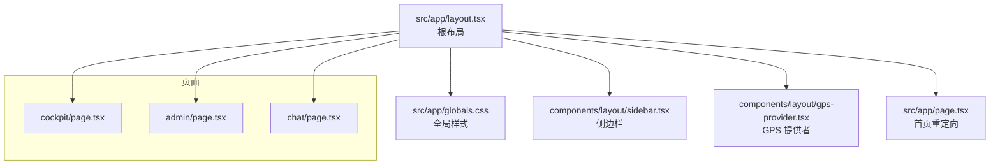
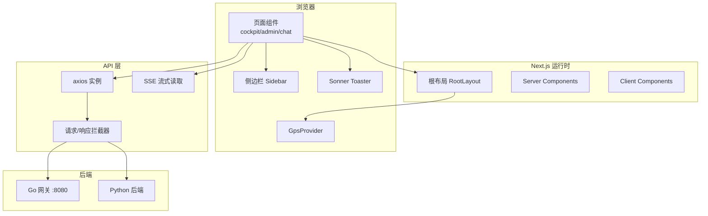
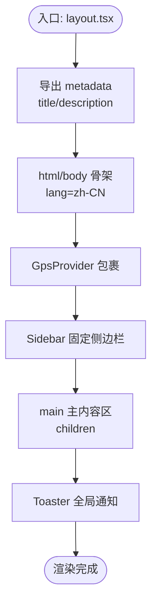
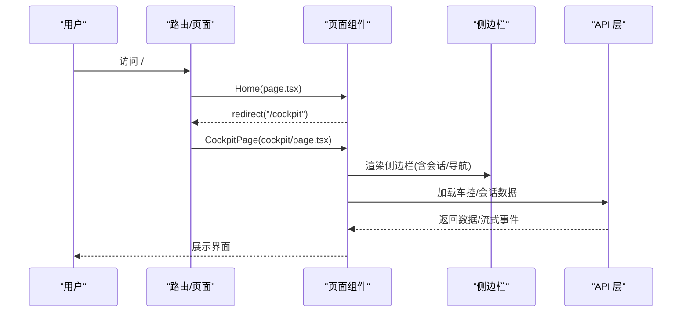
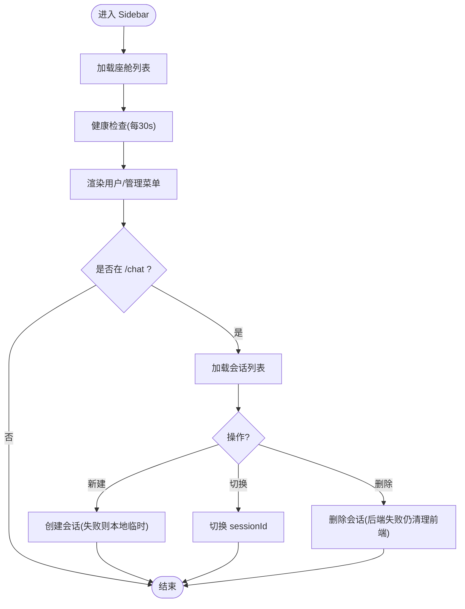
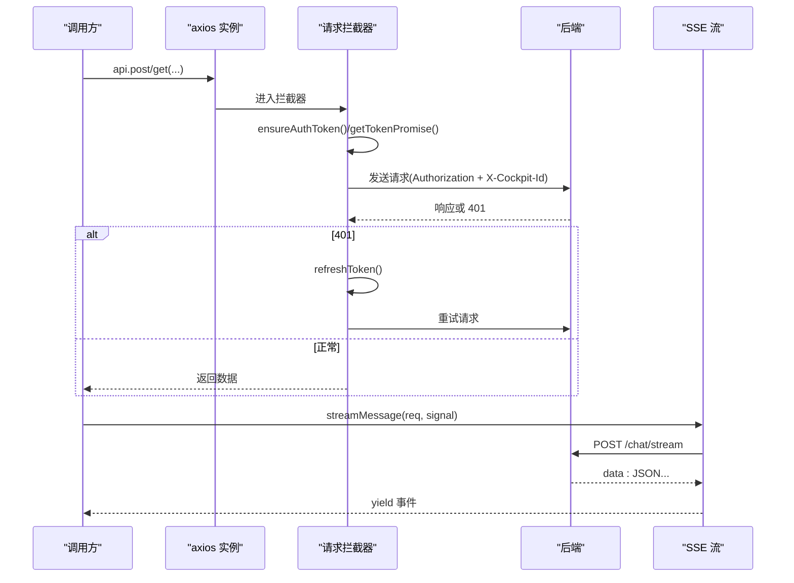
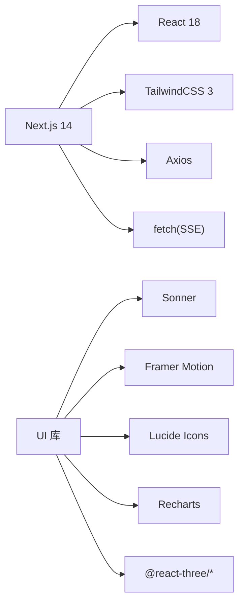

# Next.js 架构设计

<cite>
**本文引用的文件**   
- [package.json](file://frontend_design/package.json)
- [next.config.js](file://frontend_design/next.config.js)
- [Dockerfile](file://frontend_design/Dockerfile)
- [tailwind.config.ts](file://frontend_design/tailwind.config.ts)
- [tsconfig.json](file://frontend_design/tsconfig.json)
- [layout.tsx](file://frontend_design/src/app/layout.tsx)
- [page.tsx](file://frontend_design/src/app/page.tsx)
- [cockpit/page.tsx](file://frontend_design/src/app/cockpit/page.tsx)
- [admin/page.tsx](file://frontend_design/src/app/admin/page.tsx)
- [chat/page.tsx](file://frontend_design/src/app/chat/page.tsx)
- [globals.css](file://frontend_design/src/app/globals.css)
- [sidebar.tsx](file://frontend_design/src/components/layout/sidebar.tsx)
- [gps-provider.tsx](file://frontend_design/src/components/layout/gps-provider.tsx)
- [api.ts](file://frontend_design/src/lib/api.ts)
- [auth-store.ts](file://frontend_design/src/stores/auth-store.ts)
</cite>

## 目录
1. [简介](#简介)
2. [项目结构](#项目结构)
3. [核心组件](#核心组件)
4. [架构总览](#架构总览)
5. [详细组件分析](#详细组件分析)
6. [依赖关系分析](#依赖关系分析)
7. [性能与构建优化](#性能与构建优化)
8. [故障排查指南](#故障排查指南)
9. [结论](#结论)
10. [附录：新增页面与布局实践](#附录新增页面与布局实践)

## 简介
本文件为 NexusCockpit 前端（Next.js 14）的架构文档，聚焦 App Router 的文件路由、根布局设计模式、SEO 与元数据管理、Server/Client Components 选择策略、数据获取模式、环境变量与构建配置、以及部署最佳实践。文档同时提供实际代码路径示例，帮助读者快速创建新页面与布局。

## 项目结构
NexusCockpit 前端采用 Next.js App Router 约定式路由：
- src/app 下每个目录对应一个路由，page.tsx 为页面组件；layout.tsx 为布局组件；error.tsx/global-error.tsx 为错误边界。
- 根布局 layout.tsx 定义全局 HTML 骨架、全局样式、SEO 元数据、共享 UI（侧边栏、Toast、GPS Provider）。
- 业务页面如 cockpit、admin、chat 等位于各自目录下。
- 公共 UI 组件在 src/components，状态管理在 src/stores，API 客户端在 src/lib，类型定义在 src/types。



图表来源
- [layout.tsx:1-55](file://frontend_design/src/app/layout.tsx#L1-L55)
- [globals.css:1-74](file://frontend_design/src/app/globals.css#L1-L74)
- [sidebar.tsx:1-430](file://frontend_design/src/components/layout/sidebar.tsx#L1-L430)
- [gps-provider.tsx:1-21](file://frontend_design/src/components/layout/gps-provider.tsx#L1-L21)
- [page.tsx:1-18](file://frontend_design/src/app/page.tsx#L1-L18)
- [cockpit/page.tsx:1-41](file://frontend_design/src/app/cockpit/page.tsx#L1-L41)
- [admin/page.tsx:1-555](file://frontend_design/src/app/admin/page.tsx#L1-L555)
- [chat/page.tsx:1-22](file://frontend_design/src/app/chat/page.tsx#L1-L22)

章节来源
- [package.json:1-43](file://frontend_design/package.json#L1-L43)
- [next.config.js:1-80](file://frontend_design/next.config.js#L1-L80)
- [tsconfig.json:1-24](file://frontend_design/tsconfig.json#L1-L24)

## 核心组件
- 根布局（RootLayout）
  - 职责：HTML 骨架、语言设置、全局样式引入、SEO metadata、侧边栏、主内容区、Toast 容器、GPS Provider。
  - SEO：通过导出 metadata 对象设置 title/description。
  - 全局能力：GpsProvider 持续更新位置；Toaster 提供全局通知。
- 侧边栏（Sidebar）
  - 职责：导航菜单、会话列表、座舱切换、健康状态展示、用户信息与登出。
  - 权限控制：基于 RBAC 角色动态显示“座舱功能”和“管理功能”。
  - 会话管理：新建/切换/删除对话，支持后端不可达时的临时会话。
- 认证与状态（auth-store）
  - 职责：JWT Token 解析、角色与座舱 ID 维护、监听器机制、RBAC 工具函数。
  - 持久化：localStorage 存储 token 与 cockpitId，定时刷新过期检查。
- API 客户端（api.ts）
  - 职责：axios 实例封装、请求拦截（自动附加 Authorization 与 X-Cockpit-Id）、响应拦截（401 重试）、流式 SSE 读取、统一错误处理。
  - 环境：NEXT_PUBLIC_API_URL 决定后端地址；开发默认走 Go 网关 8080。

章节来源
- [layout.tsx:1-55](file://frontend_design/src/app/layout.tsx#L1-L55)
- [sidebar.tsx:1-430](file://frontend_design/src/components/layout/sidebar.tsx#L1-L430)
- [auth-store.ts:1-228](file://frontend_design/src/stores/auth-store.ts#L1-L228)
- [api.ts:1-786](file://frontend_design/src/lib/api.ts#L1-L786)

## 架构总览
Next.js 14 应用以 App Router 为核心，Server Components 作为默认渲染模型，Client Components 用于交互与浏览器 API。根布局承载全局样式与共享能力，页面组件按路由组织，API 层统一封装并处理认证与多租户隔离头。



图表来源
- [layout.tsx:1-55](file://frontend_design/src/app/layout.tsx#L1-L55)
- [sidebar.tsx:1-430](file://frontend_design/src/components/layout/sidebar.tsx#L1-L430)
- [api.ts:1-786](file://frontend_design/src/lib/api.ts#L1-L786)

## 详细组件分析

### 根布局与 SEO/元数据
- 根布局负责注入全局样式、侧边栏、主内容区与 Toast。
- 通过导出 metadata 实现 SEO 标题与描述。
- 使用 GpsProvider 包裹子树，确保所有页面可访问定位上下文。



图表来源
- [layout.tsx:1-55](file://frontend_design/src/app/layout.tsx#L1-L55)
- [globals.css:1-74](file://frontend_design/src/app/globals.css#L1-L74)

章节来源
- [layout.tsx:1-55](file://frontend_design/src/app/layout.tsx#L1-L55)
- [globals.css:1-74](file://frontend_design/src/app/globals.css#L1-L74)

### 页面组件与路由
- 首页 page.tsx：根据角色重定向到 /cockpit（由客户端再判断是否跳转管理页）。
- 座舱控制 cockpit/page.tsx：用户主界面，包含语音助手栏与车控面板。
- 管理设置 admin/page.tsx：仅管理员可见，包含座舱/用户/系统配置三个 Tab。
- 语音助手 chat/page.tsx：聊天窗口入口。



图表来源
- [page.tsx:1-18](file://frontend_design/src/app/page.tsx#L1-L18)
- [cockpit/page.tsx:1-41](file://frontend_design/src/app/cockpit/page.tsx#L1-L41)
- [sidebar.tsx:1-430](file://frontend_design/src/components/layout/sidebar.tsx#L1-L430)
- [api.ts:1-786](file://frontend_design/src/lib/api.ts#L1-L786)

章节来源
- [page.tsx:1-18](file://frontend_design/src/app/page.tsx#L1-L18)
- [cockpit/page.tsx:1-41](file://frontend_design/src/app/cockpit/page.tsx#L1-L41)
- [admin/page.tsx:1-555](file://frontend_design/src/app/admin/page.tsx#L1-L555)
- [chat/page.tsx:1-22](file://frontend_design/src/app/chat/page.tsx#L1-L22)

### 侧边栏与会话管理
- 导航项按角色分组：用户功能与管理功能。
- 会话列表仅在 /chat 时显示，支持新建、切换、删除（含临时会话回退逻辑）。
- 健康状态轮询，底部常驻展示。



图表来源
- [sidebar.tsx:1-430](file://frontend_design/src/components/layout/sidebar.tsx#L1-L430)
- [api.ts:1-786](file://frontend_design/src/lib/api.ts#L1-L786)

章节来源
- [sidebar.tsx:1-430](file://frontend_design/src/components/layout/sidebar.tsx#L1-L430)

### 认证与 RBAC
- auth-store 维护 token、userId、role、cockpitId，并提供 setAuthToken/clearAuth/useAuth。
- 角色层级：cockpit_viewer < cockpit_user < cockpit_admin < super_admin。
- 权限工具：canViewDataPlatform/canViewMiddleware/canAccessSettings/canManageCockpits/canManageUsers。

```mermaid
classDiagram
class AuthState {
+token : string|null
+userId : string
+role : UserRole
+cockpitId : string
+isAuthenticated : boolean
}
class AuthStore {
+setAuthToken(token)
+clearAuth()
+useAuth() : AuthState & {switchCockpit, logout}
+hasRole(userRole, requiredRole) : bool
+canViewDataPlatform(role) : bool
+canViewMiddleware(role) : bool
+canAccessSettings(role) : bool
+canManageCockpits(role) : bool
+canManageUsers(role) : bool
}
AuthStore --> AuthState : "维护与暴露"
```

图表来源
- [auth-store.ts:1-228](file://frontend_design/src/stores/auth-store.ts#L1-L228)

章节来源
- [auth-store.ts:1-228](file://frontend_design/src/stores/auth-store.ts#L1-L228)

### API 客户端与数据获取
- axios 实例统一 baseURL、超时、Content-Type。
- 请求拦截器：自动附加 Authorization（Bearer）与 X-Cockpit-Id（多租户）。
- 响应拦截器：401 自动刷新 Token 并重试一次。
- 流式接口：streamMessage 使用原生 fetch + ReadableStream，支持 AbortSignal 取消。
- 环境变量：NEXT_PUBLIC_API_URL 指定后端地址；开发默认 NEXT_PUBLIC_DEFAULT_USER/PASSWORD。



图表来源
- [api.ts:1-786](file://frontend_design/src/lib/api.ts#L1-L786)

章节来源
- [api.ts:1-786](file://frontend_design/src/lib/api.ts#L1-L786)

## 依赖关系分析
- Next.js 14.2.5 与 React 18 生态；TailwindCSS 3.x 与 PostCSS/Autoprefixer。
- 状态管理：Zustand（可选，当前主要用模块级单例+监听器）。
- HTTP：Axios + 原生 fetch（流式）。
- UI：Lucide 图标、Framer Motion 动画、Sonner 通知、Recharts 图表、Three.js/R3F 三维。



图表来源
- [package.json:1-43](file://frontend_design/package.json#L1-L43)

章节来源
- [package.json:1-43](file://frontend_design/package.json#L1-L43)

## 性能与构建优化
- 构建输出：output: "standalone"，生成独立运行包，减小镜像体积。
- Docker 多阶段构建：builder 安装依赖并构建，runner 仅复制产物，最小化运行镜像。
- 日志：开发环境下将 console.log/error/warn 写入 logs/frontend_logs/*.log，便于调试。
- 样式：Tailwind 按需扫描 src/app、src/components、src/pages，减少 CSS 体积。
- TypeScript：strict 模式、isolatedModules、增量编译，提升类型安全与构建速度。
- 环境变量：NEXT_PUBLIC_* 在构建期注入前端；NEXT_PUBLIC_API_URL 控制后端地址。

章节来源
- [next.config.js:1-80](file://frontend_design/next.config.js#L1-L80)
- [Dockerfile:1-32](file://frontend_design/Dockerfile#L1-L32)
- [tailwind.config.ts:1-55](file://frontend_design/tailwind.config.ts#L1-L55)
- [tsconfig.json:1-24](file://frontend_design/tsconfig.json#L1-L24)

## 故障排查指南
- 登录/鉴权问题
  - 现象：401 未授权或 Token 失效。
  - 排查：确认 localStorage 中 nexus_token 是否存在且未过期；检查 ensureAuthToken/refreshToken 流程；验证 NEXT_PUBLIC_DEFAULT_USER/PASSWORD 与后端一致。
  - 参考：[api.ts:55-115](file://frontend_design/src/lib/api.ts#L55-L115), [auth-store.ts:59-103](file://frontend_design/src/stores/auth-store.ts#L59-L103)
- 跨域与代理
  - 现象：CORS 错误或无法直连后端。
  - 排查：确认 NEXT_PUBLIC_API_URL 指向正确；如需代理，可在 next.config.js 启用 rewrites（已注释），并将 baseURL 改为 "/api"。
  - 参考：[next.config.js:1-18](file://frontend_design/next.config.js#L1-L18)
- 会话删除不一致
  - 现象：后端删除失败但前端仍显示会话。
  - 排查：删除逻辑对后端 success=false 或网络异常做了回退清理，若仍有“幽灵会话”，检查后端返回 message 字段与前端分支处理。
  - 参考：[sidebar.tsx:173-208](file://frontend_design/src/components/layout/sidebar.tsx#L173-L208)
- 流式响应中断
  - 现象：SSE 流提前结束或无数据。
  - 排查：检查 AbortSignal 是否被调用；确认后端 /chat/stream 返回 data: JSON 行格式；查看 StreamError 状态码。
  - 参考：[api.ts:261-341](file://frontend_design/src/lib/api.ts#L261-L341)
- 构建/运行问题
  - 现象：Docker 构建失败或运行端口冲突。
  - 排查：确认 node 版本、npm ci 成功、构建产物 .next/standalone 存在；运行 CMD 为 node server.js，端口 3000。
  - 参考：[Dockerfile:1-32](file://frontend_design/Dockerfile#L1-L32)

章节来源
- [api.ts:55-115](file://frontend_design/src/lib/api.ts#L55-L115)
- [auth-store.ts:59-103](file://frontend_design/src/stores/auth-store.ts#L59-L103)
- [next.config.js:1-18](file://frontend_design/next.config.js#L1-L18)
- [sidebar.tsx:173-208](file://frontend_design/src/components/layout/sidebar.tsx#L173-L208)
- [Dockerfile:1-32](file://frontend_design/Dockerfile#L1-L32)

## 结论
NexusCockpit 前端基于 Next.js 14 App Router，采用 Server Components 优先、Client Components 按需的策略，根布局集中管理全局样式、SEO、共享组件与能力。API 层统一处理认证、多租户隔离与流式通信，配合 TailwindCSS 与模块化组件体系，具备良好的可维护性与扩展性。构建与部署采用 standalone 输出与多阶段 Docker 镜像，兼顾体积与运行效率。

## 附录：新增页面与布局实践
- 新增页面
  - 在 src/app 下创建目录与 page.tsx，例如 src/app/new-feature/page.tsx。
  - 若需要客户端交互，在文件顶部添加 "use client";。
  - 如需自定义该路由的元数据，导出 metadata 对象覆盖或补充。
  - 参考路径：[cockpit/page.tsx:1-41](file://frontend_design/src/app/cockpit/page.tsx#L1-L41)、[admin/page.tsx:1-555](file://frontend_design/src/app/admin/page.tsx#L1-L555)
- 新增布局
  - 在目标路由目录下创建 layout.tsx，包裹 children 并注入该区域共享 UI。
  - 根布局已在 src/app/layout.tsx 定义，避免重复注入全局样式与 Provider。
  - 参考路径：[layout.tsx:1-55](file://frontend_design/src/app/layout.tsx#L1-L55)
- 数据获取
  - 服务端渲染：直接在 Server Component 中使用异步函数获取数据（无需 "use client"）。
  - 客户端交互：使用 api.ts 中的 axios/fetch/SSE 方法，结合 useAuth 与 Zustand/模块单例管理状态。
  - 参考路径：[api.ts:1-786](file://frontend_design/src/lib/api.ts#L1-L786)、[auth-store.ts:1-228](file://frontend_design/src/stores/auth-store.ts#L1-L228)
- 环境变量
  - 前端可用 NEXT_PUBLIC_* 变量，如 NEXT_PUBLIC_API_URL、NEXT_PUBLIC_DEFAULT_USER/PASSWORD。
  - 参考路径：[api.ts:40-48](file://frontend_design/src/lib/api.ts#L40-L48)
- 构建与部署
  - 开发：npm run dev（端口 3000）。
  - 构建：npm run build（生成 .next/standalone）。
  - 运行：node server.js（Docker 镜像暴露 3000 端口）。
  - 参考路径：[package.json:1-43](file://frontend_design/package.json#L1-L43)、[Dockerfile:1-32](file://frontend_design/Dockerfile#L1-L32)