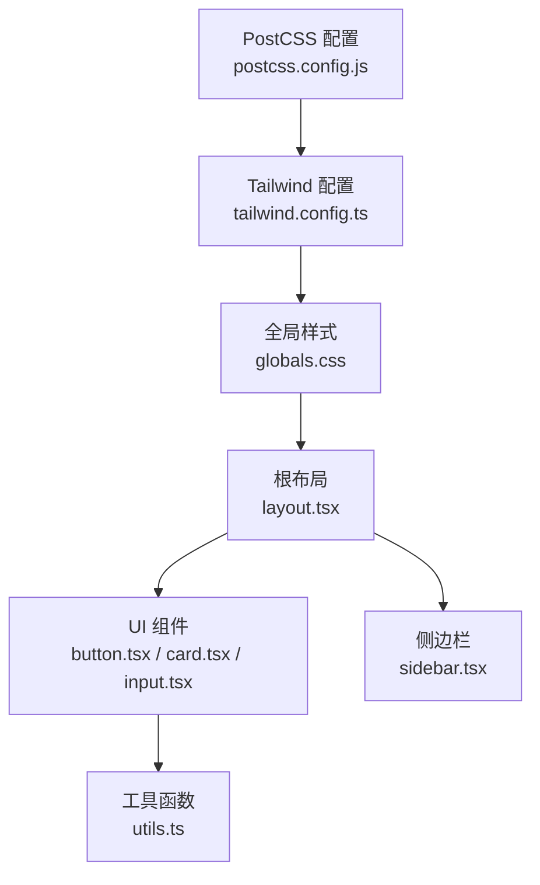
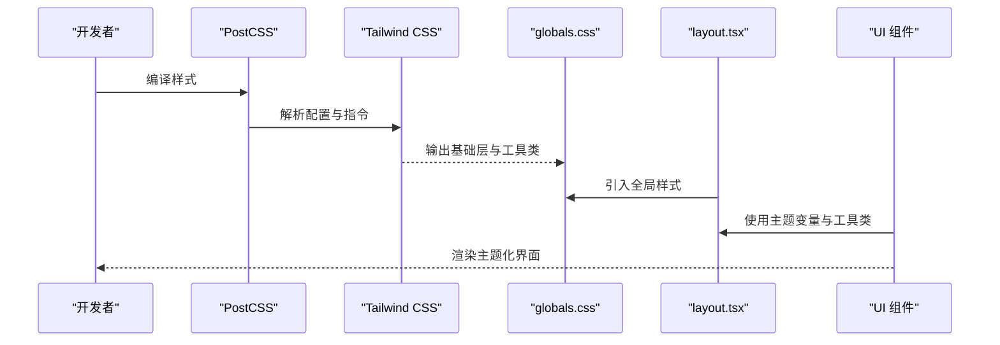
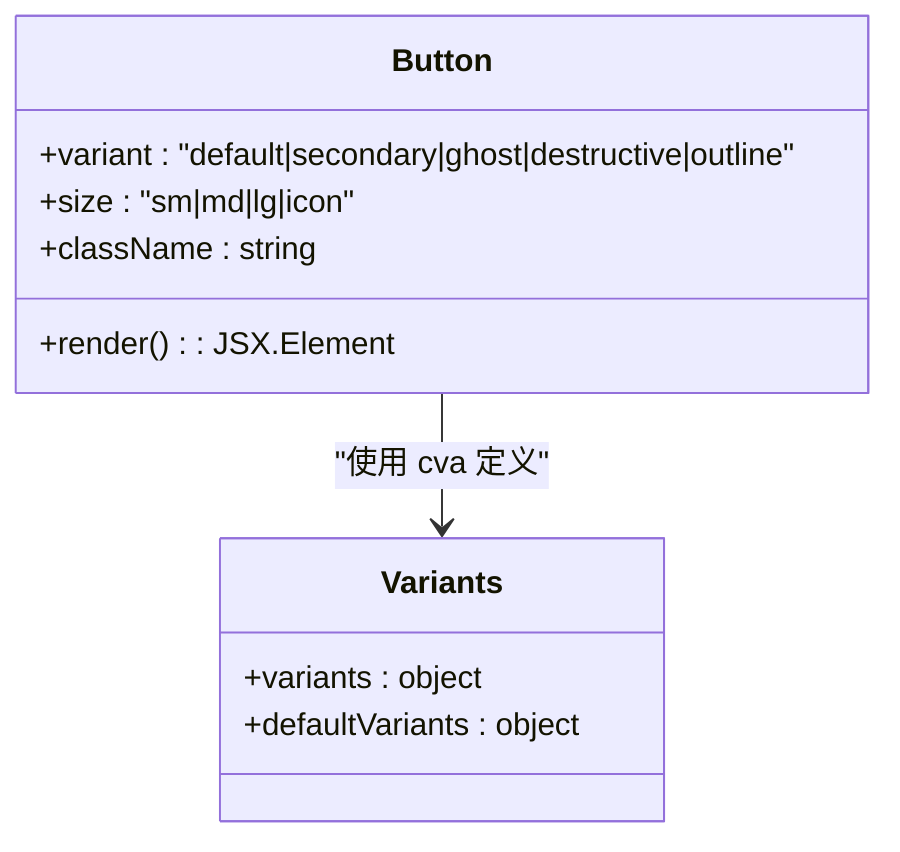
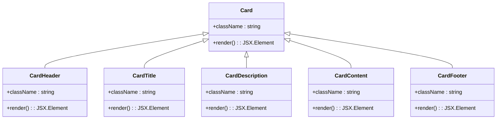
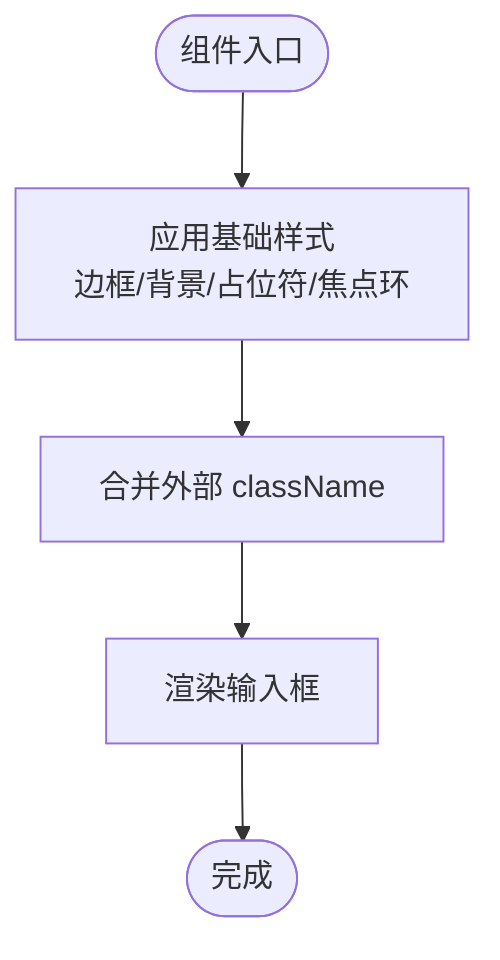
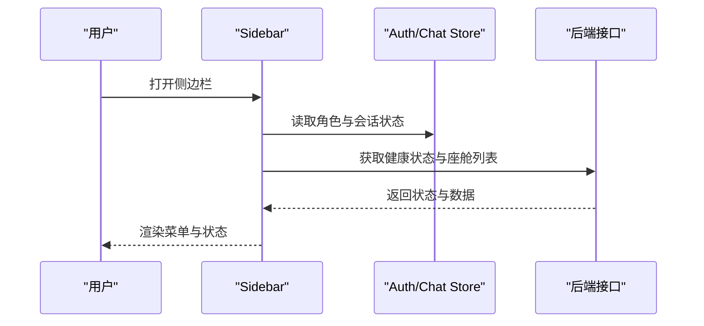
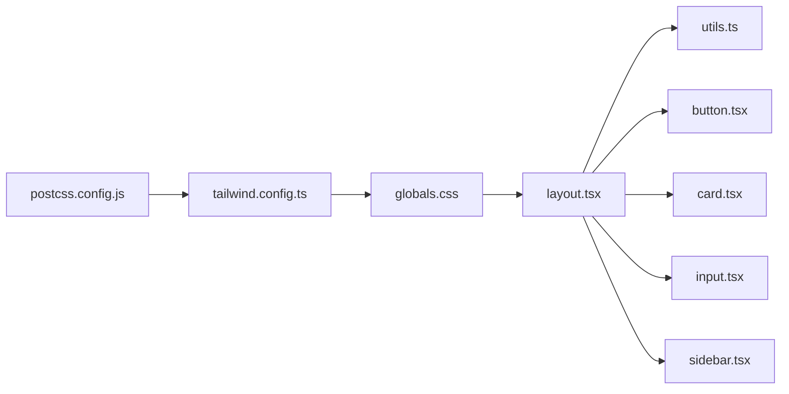

# UI 主题与样式

<cite>
**本文引用的文件**   
- [tailwind.config.ts](file://frontend_design/tailwind.config.ts)
- [globals.css](file://frontend_design/src/app/globals.css)
- [postcss.config.js](file://frontend_design/postcss.config.js)
- [package.json](file://frontend_design/package.json)
- [layout.tsx](file://frontend_design/src/app/layout.tsx)
- [utils.ts](file://frontend_design/src/lib/utils.ts)
- [button.tsx](file://frontend_design/src/components/ui/button.tsx)
- [card.tsx](file://frontend_design/src/components/ui/card.tsx)
- [input.tsx](file://frontend_design/src/components/ui/input.tsx)
- [sidebar.tsx](file://frontend_design/src/components/layout/sidebar.tsx)
</cite>

## 目录
1. [简介](#简介)
2. [项目结构](#项目结构)
3. [核心组件](#核心组件)
4. [架构总览](#架构总览)
5. [详细组件分析](#详细组件分析)
6. [依赖关系分析](#依赖关系分析)
7. [性能考量](#性能考量)
8. [故障排查指南](#故障排查指南)
9. [结论](#结论)
10. [附录](#附录)

## 简介
本技术文档围绕 NexusCockpit 前端 UI 主题系统，系统性阐述基于 Tailwind CSS 的主题定制方案。内容涵盖：
- 颜色系统与 CSS 变量定义、动态主题切换机制
- 字体配置、间距规范与动画/关键帧扩展
- 组件样式覆盖策略（Button、Card、Input）
- 响应式设计最佳实践（移动端适配、断点、触摸交互优化）
- 国际化支持的配置方法与多语言文本管理建议
- 自定义主题与响应式组件的实操示例路径

## 项目结构
NexusCockpit 的前端采用 Next.js + Tailwind CSS + PostCSS 的技术栈。主题相关的关键文件分布如下：
- 构建与样式管线：postcss.config.js、tailwind.config.ts、globals.css
- 根布局与全局样式注入：src/app/layout.tsx、src/app/globals.css
- 工具函数与类名合并：src/lib/utils.ts
- 基础 UI 组件：src/components/ui/{button,card,input}.tsx
- 布局与导航：src/components/layout/sidebar.tsx

**图表来源** 
- [postcss.config.js:1-7](file://frontend_design/postcss.config.js#L1-L7)
- [tailwind.config.ts:1-55](file://frontend_design/tailwind.config.ts#L1-L55)
- [globals.css:1-74](file://frontend_design/src/app/globals.css#L1-L74)
- [layout.tsx:1-55](file://frontend_design/src/app/layout.tsx#L1-L55)
- [button.tsx:1-55](file://frontend_design/src/components/ui/button.tsx#L1-L55)
- [card.tsx:1-92](file://frontend_design/src/components/ui/card.tsx#L1-L92)
- [input.tsx:1-26](file://frontend_design/src/components/ui/input.tsx#L1-L26)
- [sidebar.tsx:1-430](file://frontend_design/src/components/layout/sidebar.tsx#L1-L430)
- [utils.ts:1-56](file://frontend_design/src/lib/utils.ts#L1-L56)

**章节来源**
- [postcss.config.js:1-7](file://frontend_design/postcss.config.js#L1-L7)
- [tailwind.config.ts:1-55](file://frontend_design/tailwind.config.ts#L1-L55)
- [globals.css:1-74](file://frontend_design/src/app/globals.css#L1-L74)
- [layout.tsx:1-55](file://frontend_design/src/app/layout.tsx#L1-L55)

## 核心组件
本节聚焦主题系统的核心实现与使用方式，包括颜色系统、CSS 变量、动画与组件样式覆盖。

- 颜色系统与 CSS 变量
  - 在 tailwind.config.ts 中通过 HSL 映射到 CSS 变量，如 background、foreground、primary、secondary、muted、accent、destructive、border、input、ring 等。
  - 在 globals.css 的 :root 中定义这些变量的具体色值，便于运行时通过修改变量实现主题切换。
  - borderRadius 也通过 --radius 变量统一管理，提供 lg/md/sm 三级圆角。

- 动画与关键帧
  - 在 tailwind.config.ts 中扩展 animation 与 keyframes，提供 fade-in、slide-up、pulse-slow 等常用动效。

- 组件样式覆盖
  - Button：使用 class-variance-authority 定义变体（default、secondary、ghost、destructive、outline）与尺寸（sm、md、lg、icon），并通过 cn() 合并类名。
  - Card：拆分为 Header/Title/Description/Content/Footer，统一使用语义化类名与主题变量。
  - Input：统一的边框、背景、焦点环、禁用态等样式，遵循主题变量。

- 工具函数
  - utils.ts 中的 cn() 使用 clsx 与 tailwind-merge 合并并去重冲突类名，确保样式覆盖稳定可控。

**章节来源**
- [tailwind.config.ts:1-55](file://frontend_design/tailwind.config.ts#L1-L55)
- [globals.css:1-74](file://frontend_design/src/app/globals.css#L1-L74)
- [button.tsx:1-55](file://frontend_design/src/components/ui/button.tsx#L1-L55)
- [card.tsx:1-92](file://frontend_design/src/components/ui/card.tsx#L1-L92)
- [input.tsx:1-26](file://frontend_design/src/components/ui/input.tsx#L1-L26)
- [utils.ts:1-56](file://frontend_design/src/lib/utils.ts#L1-L56)

## 架构总览
下图展示主题系统在构建与运行时的数据流与依赖关系：PostCSS 调用 Tailwind，Tailwind 读取配置生成样式；globals.css 定义 CSS 变量与基础层；Next.js 根布局注入全局样式；组件通过 cn() 组合类名并使用主题变量。

**图表来源** 
- [postcss.config.js:1-7](file://frontend_design/postcss.config.js#L1-L7)
- [tailwind.config.ts:1-55](file://frontend_design/tailwind.config.ts#L1-L55)
- [globals.css:1-74](file://frontend_design/src/app/globals.css#L1-L74)
- [layout.tsx:1-55](file://frontend_design/src/app/layout.tsx#L1-L55)

## 详细组件分析

### 按钮组件（Button）
- 设计要点
  - 使用 cva 定义变体与尺寸，默认 variant=default、size=md。
  - 所有颜色均通过主题变量（bg-primary、text-primary-foreground 等）实现主题化。
  - 通过 cn() 合并外部 className，支持覆盖与扩展。

**图表来源** 
- [button.tsx:1-55](file://frontend_design/src/components/ui/button.tsx#L1-L55)

**章节来源**
- [button.tsx:1-55](file://frontend_design/src/components/ui/button.tsx#L1-L55)

### 卡片组件（Card）
- 设计要点
  - 将卡片拆分为 Header、Title、Description、Content、Footer，便于组合与复用。
  - 统一使用主题变量（bg-card、text-card-foreground、border-border）。
  - 通过 cn() 合并外部样式，保持灵活性与一致性。

**图表来源** 
- [card.tsx:1-92](file://frontend_design/src/components/ui/card.tsx#L1-L92)

**章节来源**
- [card.tsx:1-92](file://frontend_design/src/components/ui/card.tsx#L1-L92)

### 输入框组件（Input）
- 设计要点
  - 统一边框、背景、占位符、焦点环与禁用态，全部基于主题变量。
  - 通过 cn() 合并外部样式，支持覆盖。

**图表来源** 
- [input.tsx:1-26](file://frontend_design/src/components/ui/input.tsx#L1-L26)

**章节来源**
- [input.tsx:1-26](file://frontend_design/src/components/ui/input.tsx#L1-L26)

### 侧边栏（Sidebar）
- 设计要点
  - 固定定位、毛玻璃背景（backdrop-blur）、主题变量配色。
  - 根据角色显示不同菜单项（用户功能与管理功能）。
  - 会话列表与状态指示器使用主题变量与动画。

**图表来源** 
- [sidebar.tsx:1-430](file://frontend_design/src/components/layout/sidebar.tsx#L1-L430)

**章节来源**
- [sidebar.tsx:1-430](file://frontend_design/src/components/layout/sidebar.tsx#L1-L430)

## 依赖关系分析
- 构建与样式管线
  - postcss.config.js 启用 tailwindcss 与 autoprefixer。
  - tailwind.config.ts 定义主题扩展（颜色、圆角、动画、关键帧）。
  - globals.css 定义 :root 变量与基础层样式。
- 组件与工具
  - 组件通过 cn() 合并类名，避免冲突并保持可覆盖性。
  - layout.tsx 注入全局样式与 Toaster 容器。

**图表来源** 
- [postcss.config.js:1-7](file://frontend_design/postcss.config.js#L1-L7)
- [tailwind.config.ts:1-55](file://frontend_design/tailwind.config.ts#L1-L55)
- [globals.css:1-74](file://frontend_design/src/app/globals.css#L1-L74)
- [layout.tsx:1-55](file://frontend_design/src/app/layout.tsx#L1-L55)
- [utils.ts:1-56](file://frontend_design/src/lib/utils.ts#L1-L56)
- [button.tsx:1-55](file://frontend_design/src/components/ui/button.tsx#L1-L55)
- [card.tsx:1-92](file://frontend_design/src/components/ui/card.tsx#L1-L92)
- [input.tsx:1-26](file://frontend_design/src/components/ui/input.tsx#L1-L26)
- [sidebar.tsx:1-430](file://frontend_design/src/components/layout/sidebar.tsx#L1-L430)

**章节来源**
- [package.json:1-43](file://frontend_design/package.json#L1-L43)
- [postcss.config.js:1-7](file://frontend_design/postcss.config.js#L1-L7)
- [tailwind.config.ts:1-55](file://frontend_design/tailwind.config.ts#L1-L55)
- [globals.css:1-74](file://frontend_design/src/app/globals.css#L1-L74)
- [layout.tsx:1-55](file://frontend_design/src/app/layout.tsx#L1-L55)

## 性能考量
- 样式体积与按需生成
  - Tailwind 通过 content 配置仅扫描必要文件，减少无用样式。
  - PostCSS 自动添加浏览器前缀，保证兼容性同时控制体积。
- 运行时主题切换
  - 通过修改 :root 下的 CSS 变量实现无刷新主题切换，避免重新加载样式。
- 动画与过渡
  - 使用轻量级 keyframes 与 transition-colors，避免复杂动画影响性能。
- 类名合并
  - 使用 cn() 合并并去重冲突类名，减少重复计算与样式抖动。

[本节为通用指导，不直接分析具体文件]

## 故障排查指南
- 主题变量未生效
  - 检查 globals.css 中 :root 是否定义了所需变量。
  - 确认 tailwind.config.ts 的颜色映射是否正确指向 CSS 变量。
- 样式冲突或覆盖无效
  - 检查 cn() 的使用是否正确，确保外部 className 被正确合并。
  - 查看 Tailwind 生成的样式顺序，必要时提高选择器优先级。
- 动画不生效
  - 确认 tailwind.config.ts 中 animation 与 keyframes 已扩展。
  - 检查浏览器控制台是否有 CSS 语法错误。
- 构建失败
  - 检查 postcss.config.js 是否正确启用 tailwindcss 与 autoprefixer。
  - 确认 package.json 中依赖版本兼容。

**章节来源**
- [globals.css:1-74](file://frontend_design/src/app/globals.css#L1-L74)
- [tailwind.config.ts:1-55](file://frontend_design/tailwind.config.ts#L1-L55)
- [postcss.config.js:1-7](file://frontend_design/postcss.config.js#L1-L7)
- [package.json:1-43](file://frontend_design/package.json#L1-L43)

## 结论
NexusCockpit 的 UI 主题系统以 Tailwind CSS 为核心，结合 CSS 变量与 PostCSS 构建管线，实现了高度可定制、易维护且高性能的主题方案。通过统一的变量体系、组件样式覆盖策略与工具函数，开发者可以快速创建自定义主题与响应式组件。建议在后续迭代中进一步完善国际化支持与移动端适配细节，以提升用户体验与可访问性。

[本节为总结性内容，不直接分析具体文件]

## 附录

### 颜色系统与 CSS 变量
- 颜色变量
  - background、foreground、card、card-foreground、primary、primary-foreground、secondary、secondary-foreground、muted、muted-foreground、accent、accent-foreground、destructive、destructive-foreground、border、input、ring。
- 圆角变量
  - --radius 用于 lg/md/sm 三级圆角。
- 动画与关键帧
  - fade-in、slide-up、pulse-slow 及其关键帧定义。

**章节来源**
- [tailwind.config.ts:1-55](file://frontend_design/tailwind.config.ts#L1-L55)
- [globals.css:1-74](file://frontend_design/src/app/globals.css#L1-L74)

### 动态主题切换实现
- 在运行时修改 :root 下的 CSS 变量即可切换主题，无需重新加载页面。
- 可通过设置属性或事件监听触发变量更新，例如点击“深色/浅色”按钮切换 --background、--foreground 等变量。

**章节来源**
- [globals.css:1-74](file://frontend_design/src/app/globals.css#L1-L74)

### 响应式设计最佳实践
- 断点与布局
  - 使用 Tailwind 内置断点（sm、md、lg、xl）进行布局调整。
  - 侧边栏在小屏下可折叠或隐藏，主内容区自适应宽度。
- 移动端适配
  - 增大触控区域（h-10、px-4 py-2），提升可操作性。
  - 使用 flex 与 grid 布局，确保在不同屏幕尺寸下良好展示。
- 触摸交互优化
  - 避免 hover 依赖，提供 focus-visible 与 active 状态反馈。
  - 使用 touch-action 与滚动优化，提升滑动体验。

**章节来源**
- [sidebar.tsx:1-430](file://frontend_design/src/components/layout/sidebar.tsx#L1-L430)
- [button.tsx:1-55](file://frontend_design/src/components/ui/button.tsx#L1-L55)
- [input.tsx:1-26](file://frontend_design/src/components/ui/input.tsx#L1-L26)

### 国际化支持配置方法
- 文本管理
  - 建议使用 i18n 库（如 next-intl）集中管理多语言文本。
  - 将硬编码字符串替换为键值对，按模块拆分翻译文件。
- 配置步骤
  - 安装 i18n 依赖并在 Next.js 中初始化。
  - 在组件中使用 useTranslations 或 hooks 获取本地化文本。
  - 根据用户偏好或系统语言动态切换语言。

[本节为通用指导，不直接分析具体文件]

### 自定义主题与响应式组件示例路径
- 自定义主题
  - 修改 globals.css 中的 :root 变量，或新增主题类并切换 root 属性。
  - 在 tailwind.config.ts 中扩展颜色与动画，保持一致性。
- 响应式组件
  - 在组件中使用 Tailwind 断点类（如 md:flex、lg:w-1/2）实现布局变化。
  - 使用 cn() 合并条件类名，根据状态或设备类型动态应用样式。

**章节来源**
- [globals.css:1-74](file://frontend_design/src/app/globals.css#L1-L74)
- [tailwind.config.ts:1-55](file://frontend_design/tailwind.config.ts#L1-L55)
- [utils.ts:1-56](file://frontend_design/src/lib/utils.ts#L1-L56)