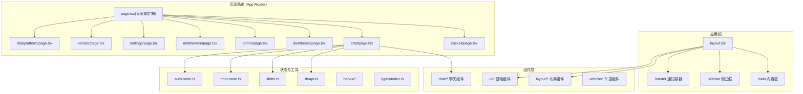
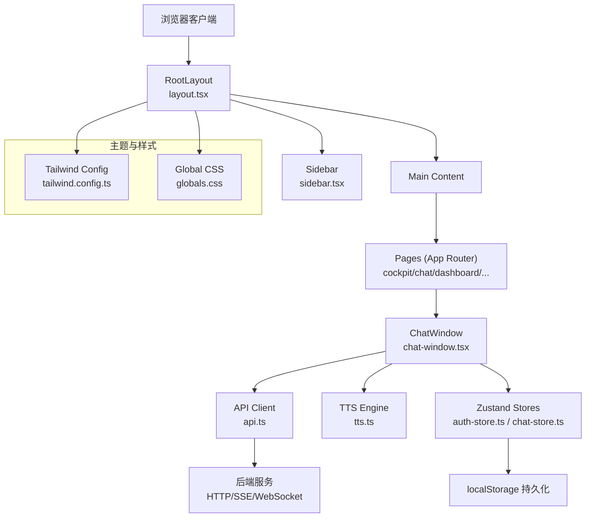
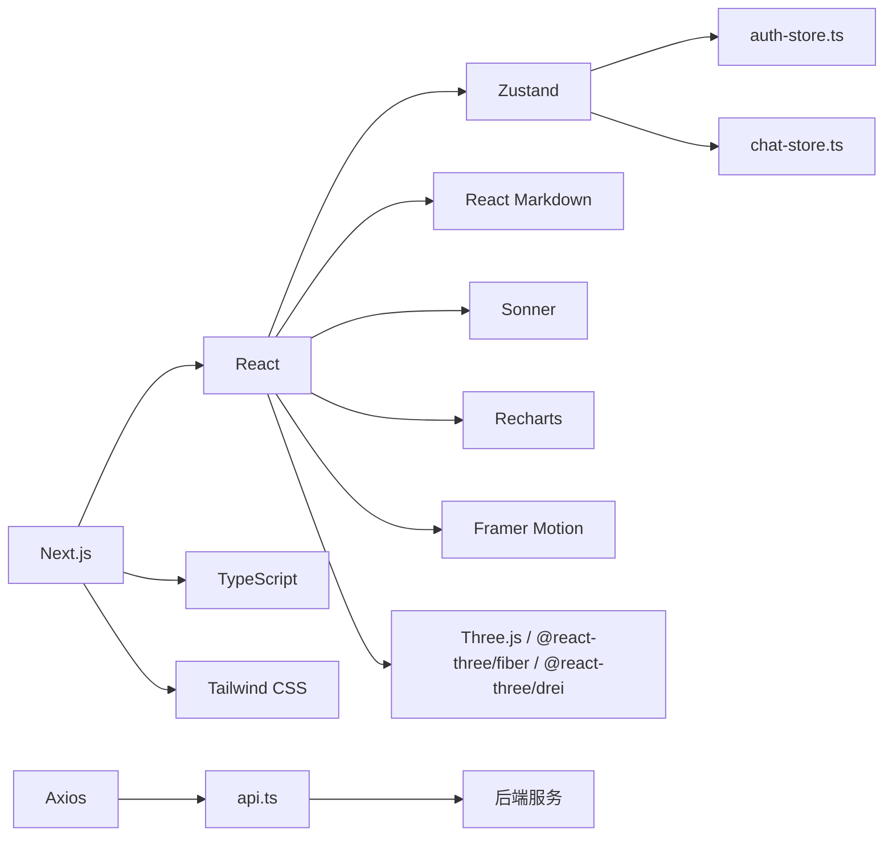

# 前端应用

<cite>
**本文引用的文件**
- [package.json](file://frontend_design/package.json)
- [next.config.js](file://frontend_design/next.config.js)
- [Dockerfile](file://frontend_design/Dockerfile)
- [tailwind.config.ts](file://frontend_design/tailwind.config.ts)
- [globals.css](file://frontend_design/src/app/globals.css)
- [layout.tsx](file://frontend_design/src/app/layout.tsx)
- [page.tsx](file://frontend_design/src/app/page.tsx)
- [sidebar.tsx](file://frontend_design/src/components/layout/sidebar.tsx)
- [chat-window.tsx](file://frontend_design/src/components/chat/chat-window.tsx)
- [api.ts](file://frontend_design/src/lib/api.ts)
- [auth-store.ts](file://frontend_design/src/stores/auth-store.ts)
- [chat-store.ts](file://frontend_design/src/stores/chat-store.ts)
- [use-speech-recognition.ts](file://frontend_design/src/hooks/use-speech-recognition.ts)
- [tts.ts](file://frontend_design/src/lib/tts.ts)
- [index.ts](file://frontend_design/src/types/index.ts)
</cite>

## 目录
1. [简介](#简介)
2. [项目结构](#项目结构)
3. [核心组件](#核心组件)
4. [架构总览](#架构总览)
5. [详细组件分析](#详细组件分析)
6. [依赖关系分析](#依赖关系分析)
7. [性能考量](#性能考量)
8. [故障排查指南](#故障排查指南)
9. [结论](#结论)
10. [附录](#附录)

## 简介
本技术文档面向 NexusCockpit 的 Next.js 前端应用，围绕基于 App Router 的现代化 React 架构与文件路由组织、组件分层（UI 组件、业务组件、页面组件）、状态管理（Zustand + 持久化）、API 集成层与错误处理、实时通信（SSE 流式输出与 WebSocket 双向通信）、响应式设计与主题定制、国际化支持、SEO 配置、性能优化与部署最佳实践进行全面说明。文档同时提供创建新页面、组件与 hooks 的实践示例路径，帮助开发者快速上手与扩展。

## 项目结构
前端采用 Next.js App Router 的文件路由约定：
- src/app 下按功能划分页面目录（如 cockpit、chat、dashboard、admin、middleware、settings、vehicle、dataplatform），每个目录包含 page.tsx 作为路由入口。
- src/components 分为 ui（基础 UI 组件）、layout（布局组件）、chat（聊天相关）、vehicle（车控相关）等子目录。
- src/hooks 存放可复用的自定义 hooks（语音识别、录音、GPS 定位等）。
- src/lib 封装 API 客户端、TTS 引擎、工具函数与事件总线。
- src/stores 使用 Zustand 管理全局状态（认证、聊天会话等）。
- src/types 集中定义跨模块共享的类型接口。

图表来源
- [layout.tsx:1-55](file://frontend_design/src/app/layout.tsx#L1-L55)
- [page.tsx:1-18](file://frontend_design/src/app/page.tsx#L1-L18)
- [sidebar.tsx:1-430](file://frontend_design/src/components/layout/sidebar.tsx#L1-L430)
- [chat-window.tsx:1-652](file://frontend_design/src/components/chat/chat-window.tsx#L1-L652)
- [api.ts:1-786](file://frontend_design/src/lib/api.ts#L1-L786)
- [auth-store.ts:1-228](file://frontend_design/src/stores/auth-store.ts#L1-L228)
- [chat-store.ts:1-311](file://frontend_design/src/stores/chat-store.ts#L1-L311)
- [tts.ts:1-443](file://frontend_design/src/lib/tts.ts#L1-L443)
- [index.ts:1-277](file://frontend_design/src/types/index.ts#L1-L277)

章节来源
- [package.json:1-43](file://frontend_design/package.json#L1-L43)
- [next.config.js:1-80](file://frontend_design/next.config.js#L1-L80)
- [Dockerfile:1-32](file://frontend_design/Dockerfile#L1-L32)

## 核心组件
- 根布局与 SEO：根 layout.tsx 定义全局 HTML 骨架、主题变量、侧边栏、主内容区与 Toast 通知容器，并设置 Metadata（标题、描述）用于 SEO。
- 首页重定向：page.tsx 将用户统一重定向到座舱控制页，后续角色判断由客户端组件完成。
- 侧边栏导航：sidebar.tsx 实现 RBAC 菜单可见性、座舱切换、会话列表管理与健康状态展示。
- 聊天窗口：chat-window.tsx 是用户与 AI 交互的核心界面，支持文本输入、SSE 流式接收、语音识别、本地 ASR 录音、TTS 朗读、多会话管理与降级策略。
- API 客户端：api.ts 统一封装 axios 实例、JWT 自动注入、401 重试、SSE 流式读取、各业务域接口（聊天、车控、健康、管理、数据中台、中间件、ASR、设置、声纹等）。
- 状态管理：auth-store.ts 管理认证与 RBAC；chat-store.ts 管理多会话消息、会话元数据与持久化。
- 语音与合成：use-speech-recognition.ts 封装 Web Speech API；tts.ts 实现分句播放、全局播放状态机、Chrome 保活机制与音乐联动。
- 类型系统：types/index.ts 集中定义 Chat/Vehicle/Admin/Middleware/Voiceprint 等接口。

章节来源
- [layout.tsx:1-55](file://frontend_design/src/app/layout.tsx#L1-L55)
- [page.tsx:1-18](file://frontend_design/src/app/page.tsx#L1-L18)
- [sidebar.tsx:1-430](file://frontend_design/src/components/layout/sidebar.tsx#L1-L430)
- [chat-window.tsx:1-652](file://frontend_design/src/components/chat/chat-window.tsx#L1-L652)
- [api.ts:1-786](file://frontend_design/src/lib/api.ts#L1-L786)
- [auth-store.ts:1-228](file://frontend_design/src/stores/auth-store.ts#L1-L228)
- [chat-store.ts:1-311](file://frontend_design/src/stores/chat-store.ts#L1-L311)
- [use-speech-recognition.ts:1-113](file://frontend_design/src/hooks/use-speech-recognition.ts#L1-L113)
- [tts.ts:1-443](file://frontend_design/src/lib/tts.ts#L1-L443)
- [index.ts:1-277](file://frontend_design/src/types/index.ts#L1-L277)

## 架构总览
前端以 Next.js App Router 为路由与渲染框架，结合 Tailwind CSS 与 CSS 变量实现主题化；通过 Zustand 进行轻量级全局状态管理；API 层统一封装请求、鉴权、错误处理与流式传输；实时通信主要采用 SSE 流式输出，WebSocket 能力可通过 api.ts 扩展。

图表来源
- [layout.tsx:1-55](file://frontend_design/src/app/layout.tsx#L1-L55)
- [sidebar.tsx:1-430](file://frontend_design/src/components/layout/sidebar.tsx#L1-L430)
- [chat-window.tsx:1-652](file://frontend_design/src/components/chat/chat-window.tsx#L1-L652)
- [api.ts:1-786](file://frontend_design/src/lib/api.ts#L1-L786)
- [auth-store.ts:1-228](file://frontend_design/src/stores/auth-store.ts#L1-L228)
- [chat-store.ts:1-311](file://frontend_design/src/stores/chat-store.ts#L1-L311)
- [tts.ts:1-443](file://frontend_design/src/lib/tts.ts#L1-L443)
- [tailwind.config.ts:1-55](file://frontend_design/tailwind.config.ts#L1-L55)
- [globals.css:1-74](file://frontend_design/src/app/globals.css#L1-L74)

## 详细组件分析

### 根布局与 SEO（layout.tsx）
- 职责：定义全局 HTML 结构、引入全局样式、挂载侧边栏与主内容区、配置 Toaster 通知容器、设置 Metadata 用于 SEO。
- 关键点：lang="zh-CN" 指定语言；body 使用 Tailwind 类名与 CSS 变量；GpsProvider 提供全局位置更新；Toaster 提供全局 toast 能力。
- SEO：metadata.title 与 metadata.description 为搜索引擎提供页面标题与描述。

章节来源
- [layout.tsx:1-55](file://frontend_design/src/app/layout.tsx#L1-L55)

### 首页重定向（page.tsx）
- 职责：统一入口重定向至座舱控制页，避免在服务端直接读取 localStorage 中的 JWT。
- 关键点：使用 next/navigation 的 redirect 实现服务端跳转。

章节来源
- [page.tsx:1-18](file://frontend_design/src/app/page.tsx#L1-L18)

### 侧边栏导航（sidebar.tsx）
- 职责：根据 RBAC 显示不同菜单项；加载并展示座舱列表；在聊天页面显示会话列表（新建/切换/删除）；轮询健康状态并在底部状态栏展示。
- 关键点：
  - 用户功能与管理功能菜单分离，管理员可见更多选项。
  - 会话管理调用 listChatSessions/createChatSession/deleteChatSession，失败时回退前端临时会话。
  - 座舱切换同步 auth-store 与 chat-store 的 cockpitId。
  - 健康检查静默运行，仅影响底部状态指示。

章节来源
- [sidebar.tsx:1-430](file://frontend_design/src/components/layout/sidebar.tsx#L1-L430)

### 聊天窗口（chat-window.tsx）
- 职责：用户与 AI 对话的核心界面，支持文本输入、SSE 流式接收、语音识别、本地 ASR 录音、TTS 朗读、多会话管理、降级策略。
- 关键点：
  - 模块级流式状态（_abortController、_streamingContent、_assistantId、_streamingFlushScheduled）确保页面切换不中断后台推理任务。
  - 节流刷新：使用 setTimeout 替代 rAF，保证组件卸载后仍可写入 store。
  - 流式优先，失败时自动降级为非流式请求。
  - 车控动作触发 VehiclePanel 刷新（emitVehicleRefresh）。
  - 首次消息后更新会话标题（豆包风格）。
  - 键盘快捷键（Enter 发送，Shift+Enter 换行）。

章节来源
- [chat-window.tsx:1-652](file://frontend_design/src/components/chat/chat-window.tsx#L1-L652)

### API 客户端（api.ts）
- 职责：统一 HTTP 客户端、JWT 自动注入、401 自动刷新并重试、SSE 流式读取、各业务域接口封装。
- 关键点：
  - axios.create 配置 baseURL、timeout、headers。
  - 请求拦截器：自动附加 Authorization 与 X-Cockpit-Id。
  - 响应拦截器：401 自动刷新 Token 并重试一次。
  - streamMessage：原生 fetch + ReadableStream，支持 AbortSignal 取消。
  - StreamError 携带 HTTP 状态码便于调用方区分错误类型。
  - 覆盖 Auth/Chat/Vehicle/Health/Admin/Cockpit/DataPlatform/Middleware/ASR/Settings/Voiceprint 等接口。

章节来源
- [api.ts:1-786](file://frontend_design/src/lib/api.ts#L1-L786)

### 认证状态管理（auth-store.ts）
- 职责：RBAC 角色管理、座舱选择、Token 解析与过期检测、持久化到 localStorage。
- 关键点：
  - parseToken 解析 JWT payload（sub、role、exp、cockpit_id）。
  - loadAuthFromStorage 从 localStorage 加载并校验 Token，保留上次选择的 cockpitId。
  - useAuth hook 订阅状态变化，定时检查 Token 是否过期。
  - hasRole/canViewDataPlatform/canViewMiddleware/canAccessSettings/canManageCockpits/canManageUsers 权限工具函数。

章节来源
- [auth-store.ts:1-228](file://frontend_design/src/stores/auth-store.ts#L1-L228)

### 聊天状态管理（chat-store.ts）
- 职责：多会话支持（按座舱 ID + 会话 ID 分组存储）、会话元数据、消息增删改查、持久化到 localStorage。
- 关键点：
  - persist 中间件只持久化必要字段（messagesByKey、sessionsByCockpit、sessionId、userId、cockpitId）。
  - onRehydrateStorage 恢复当前会话 messages，并修正 timestamp 与 loading 状态。
  - setCockpitId/setSessionId/newSession/loadSessionMessages/addMessage/updateMessage/removeMessage/clearMessages/setStreaming/updateSessionTitle/removeSession 等方法。

章节来源
- [chat-store.ts:1-311](file://frontend_design/src/stores/chat-store.ts#L1-L311)

### 语音识别 Hook（use-speech-recognition.ts）
- 职责：封装 Web Speech API，支持开始/停止、实时转写、错误处理与兼容性检查。
- 关键点：
  - 兼容 window.SpeechRecognition 与 webkitSpeechRecognition。
  - continuous=false、interimResults=true、lang="zh-CN"。
  - onresult/onerror/onend 事件处理，错误过滤（no-speech、aborted）。

章节来源
- [use-speech-recognition.ts:1-113](file://frontend_design/src/hooks/use-speech-recognition.ts#L1-L113)

### TTS 语音合成（tts.ts）
- 职责：分句播放、全局播放状态机、Chrome 保活机制、音乐联动、代际计数器防止回调干扰。
- 关键点：
  - splitIntoSentences 按标点智能分句。
  - speakSentences/pausePlayback/resumePlayback/replayCurrentSentence/replayPlayback/stopPlayback/jumpToSentence 等公共 API。
  - _startKeepAlive/_stopKeepAlive 解决 Chrome speechSynthesis 长时间播放冻结问题。
  - 与 audio-store 联动暂停/恢复音乐。

章节来源
- [tts.ts:1-443](file://frontend_design/src/lib/tts.ts#L1-L443)

### 类型系统（types/index.ts）
- 职责：集中定义 Chat/Vehicle/Admin/Middleware/Voiceprint 等接口，避免重复定义。
- 关键点：
  - ChatRequest/ChatResponse/StreamEvent/Message。
  - VehicleCommand/VehicleStatus/TrackInfo。
  - HealthData/CacheStats。
  - Cockpit/CockpitListResponse/CockpitStatus/DataPlatformOverview/CockpitComparison/AlertRecord/AgentActivity/MiddlewareStatus/User/VoiceprintStatus/VoiceprintVerifyResult。
  - UserRole 枚举。

章节来源
- [index.ts:1-277](file://frontend_design/src/types/index.ts#L1-L277)

### 主题与样式（tailwind.config.ts, globals.css）
- 职责：Tailwind 主题扩展、CSS 变量定义、滚动条与特效（玻璃态、发光、渐变文字）。
- 关键点：
  - tailwind.config.ts 扩展 colors、borderRadius、animation/keyframes。
  - globals.css 定义 :root CSS 变量（背景、前景、卡片、主色等），并提供 .glass/.glow-primary/.gradient-text 等实用类。

章节来源
- [tailwind.config.ts:1-55](file://frontend_design/tailwind.config.ts#L1-L55)
- [globals.css:1-74](file://frontend_design/src/app/globals.css#L1-L74)

## 依赖关系分析
前端依赖包括 Next.js、React、Zustand、Axios、Tailwind、Lucide 图标、React Markdown、Sonner 通知、Recharts 图表、Framer Motion 动画、Three.js 与 React Three Fiber 等。构建产物通过 Docker 多阶段构建生成独立运行包。

图表来源
- [package.json:1-43](file://frontend_design/package.json#L1-L43)
- [api.ts:1-786](file://frontend_design/src/lib/api.ts#L1-L786)
- [auth-store.ts:1-228](file://frontend_design/src/stores/auth-store.ts#L1-L228)
- [chat-store.ts:1-311](file://frontend_design/src/stores/chat-store.ts#L1-L311)

章节来源
- [package.json:1-43](file://frontend_design/package.json#L1-L43)

## 性能考量
- 流式优先与降级：聊天窗口优先使用 SSE 流式接收，失败时自动降级为非流式请求，提升用户体验与鲁棒性。
- 节流刷新：使用 setTimeout 替代 rAF，避免组件卸载导致流式内容无法更新。
- 模块级状态：流式状态提升到模块级，确保页面切换不中断后台推理任务。
- 缓存与持久化：Zustand persist 中间件仅持久化必要字段，减少 localStorage 体积与序列化开销。
- 网络超时与重试：axios 默认 30s 超时，401 自动刷新 Token 并重试一次。
- 构建优化：Next.js output: standalone 生成独立运行包，减小镜像体积；Docker 多阶段构建利用缓存加速。

章节来源
- [chat-window.tsx:1-652](file://frontend_design/src/components/chat/chat-window.tsx#L1-L652)
- [api.ts:1-786](file://frontend_design/src/lib/api.ts#L1-L786)
- [chat-store.ts:1-311](file://frontend_design/src/stores/chat-store.ts#L1-L311)
- [next.config.js:1-80](file://frontend_design/next.config.js#L1-L80)
- [Dockerfile:1-32](file://frontend_design/Dockerfile#L1-L32)

## 故障排查指南
- 登录与鉴权：
  - 确认 NEXT_PUBLIC_DEFAULT_USER/NEXT_PUBLIC_DEFAULT_PASSWORD 与后端一致。
  - 检查 localStorage 中 nexus_token 是否存在且未过期。
  - 401 错误会触发自动刷新 Token 并重试，若仍失败需检查后端鉴权逻辑。
- 流式请求失败：
  - StreamError 携带 status，404/501 会触发降级为非流式请求。
  - 检查后端 /chat/stream 是否可用，或网络代理配置。
- 会话管理：
  - 后端不可达时，侧边栏会创建临时会话（temp_ 前缀），删除时直接清理前端状态。
  - 删除会话失败但返回 success=false 且 message 包含“会话不存在”时，视为已删除并清理前端状态。
- 语音识别与 TTS：
  - 浏览器兼容性：Web Speech API 需要 Chrome 等现代浏览器。
  - Chrome 长时间播放冻结：tts.ts 内置保活机制，若仍异常可检查 keepAlive 定时器。
- 健康检查与中间件状态：
  - 侧边栏每 30s 轮询健康状态，若离线则显示“系统离线”。
  - 中间件状态适配 Go 网关与 Python 后端两种格式，统一映射为 connected/disconnected。

章节来源
- [api.ts:1-786](file://frontend_design/src/lib/api.ts#L1-L786)
- [sidebar.tsx:1-430](file://frontend_design/src/components/layout/sidebar.tsx#L1-L430)
- [chat-window.tsx:1-652](file://frontend_design/src/components/chat/chat-window.tsx#L1-L652)
- [use-speech-recognition.ts:1-113](file://frontend_design/src/hooks/use-speech-recognition.ts#L1-L113)
- [tts.ts:1-443](file://frontend_design/src/lib/tts.ts#L1-L443)

## 结论
NexusCockpit 前端基于 Next.js App Router 与 React 生态，构建了清晰的分层架构与模块化设计。通过 Zustand 实现轻量级状态管理，API 层统一封装鉴权、错误处理与流式通信，聊天窗口具备强大的实时交互与降级策略。主题与样式通过 Tailwind 与 CSS 变量灵活定制，Docker 多阶段构建保障部署效率。整体方案兼顾性能、可维护性与可扩展性，适合企业级车载语音 Agent 控制台的前端需求。

## 附录

### 创建新页面的步骤（App Router）
- 在 src/app 下新建目录（例如 new-feature），并添加 page.tsx 作为路由入口。
- 如需布局，可在该目录下添加 layout.tsx 覆盖根布局。
- 在 sidebar.tsx 中添加对应菜单项（用户功能或管理功能）。
- 参考现有页面（如 cockpit/page.tsx、chat/page.tsx）的组织方式。

章节来源
- [page.tsx:1-18](file://frontend_design/src/app/page.tsx#L1-L18)
- [sidebar.tsx:1-430](file://frontend_design/src/components/layout/sidebar.tsx#L1-L430)

### 创建新组件的步骤
- 在 src/components/ui 或对应功能目录（如 chat、vehicle）中新建组件文件（例如 my-component.tsx）。
- 使用 Tailwind 类名进行样式定义，必要时扩展 tailwind.config.ts 的主题。
- 在页面或父组件中导入并使用。

章节来源
- [tailwind.config.ts:1-55](file://frontend_design/tailwind.config.ts#L1-L55)
- [globals.css:1-74](file://frontend_design/src/app/globals.css#L1-L74)

### 创建新 Hooks 的步骤
- 在 src/hooks 下新建文件（例如 use-my-hook.ts）。
- 封装可复用逻辑（如 API 调用、状态管理、浏览器 API 封装）。
- 在组件中通过 import 使用。

章节来源
- [use-speech-recognition.ts:1-113](file://frontend_design/src/hooks/use-speech-recognition.ts#L1-L113)

### 集成 WebSocket 双向通信（建议）
- 在 api.ts 中新增 WebSocket 客户端封装（如 connectWebSocket(url, onMessage, onError)）。
- 在需要的页面或组件中初始化连接，监听消息并更新 Zustand store。
- 注意连接生命周期管理（重连、断开、错误处理）。

章节来源
- [api.ts:1-786](file://frontend_design/src/lib/api.ts#L1-L786)

### 国际化支持（i18n）建议
- 使用 next-intl 或 react-i18next 集成。
- 在 src/app 下按 locale 组织路由（如 en/, zh/）。
- 提取文案到 JSON 文件，通过 hooks 获取翻译。

章节来源
- [layout.tsx:1-55](file://frontend_design/src/app/layout.tsx#L1-L55)

### SEO 配置
- 在 layout.tsx 中设置 metadata.title 与 metadata.description。
- 在各页面中按需覆盖 metadata（如 Open Graph、Twitter Card）。
- 使用 next/image 优化图片加载。

章节来源
- [layout.tsx:1-55](file://frontend_design/src/app/layout.tsx#L1-L55)

### 部署最佳实践
- 使用 Docker 多阶段构建生成最小镜像。
- 设置环境变量（NEXT_PUBLIC_API_URL、NEXT_PUBLIC_DEFAULT_USER 等）。
- 在生产环境启用 HTTPS 与反向代理（Nginx/Traefik）。
- 监控与日志：结合 Prometheus/Grafana/Loki 进行观测。

章节来源
- [Dockerfile:1-32](file://frontend_design/Dockerfile#L1-L32)
- [next.config.js:1-80](file://frontend_design/next.config.js#L1-L80)