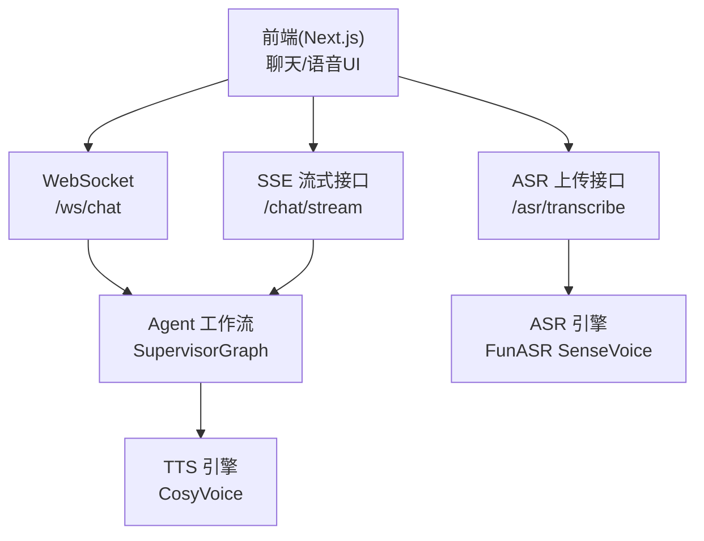
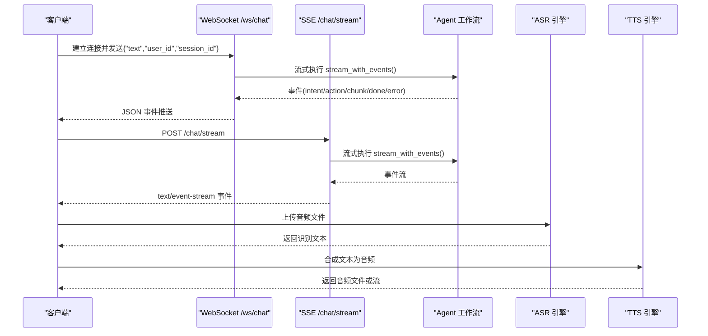
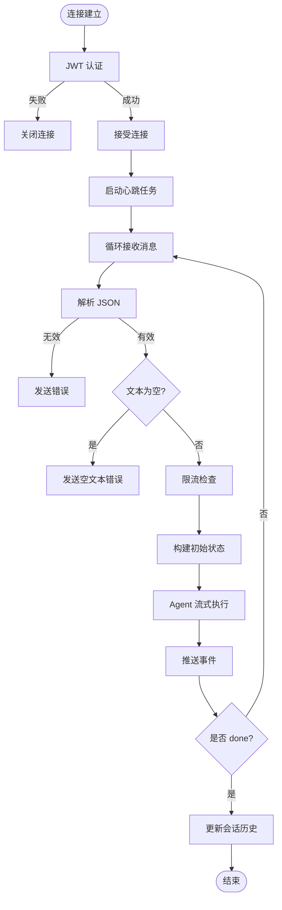
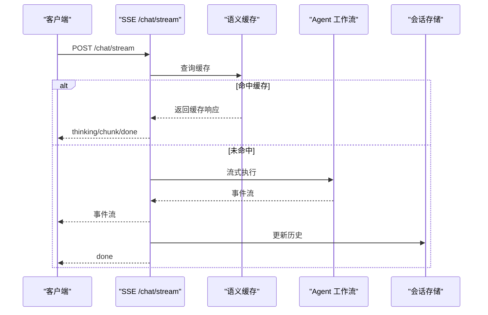
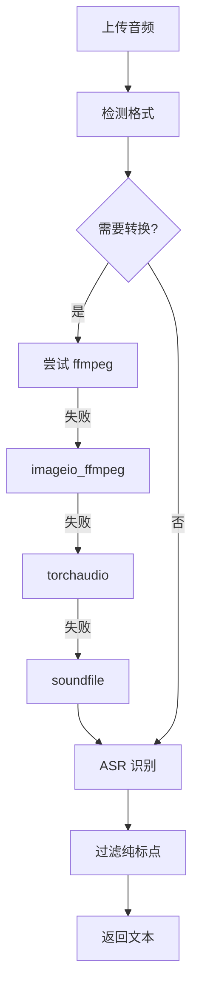
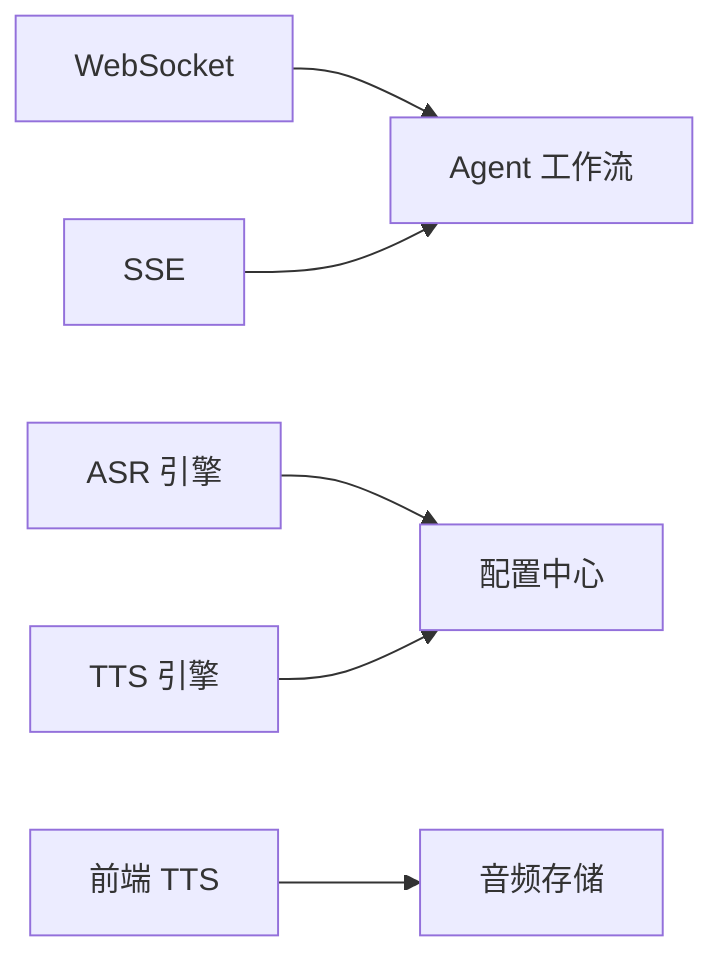

# 实时通信

<cite>
**本文引用的文件**   
- [backend_design/nexus/api/websocket.py](file://backend_design/nexus/api/websocket.py)
- [backend_design/nexus/api/routes/chat.py](file://backend_design/nexus/api/routes/chat.py)
- [backend_design/nexus/api/routes/asr.py](file://backend_design/nexus/api/routes/asr.py)
- [backend_design/nexus/asr/engine.py](file://backend_design/nexus/asr/engine.py)
- [backend_design/nexus/tts/engine.py](file://backend_design/nexus/tts/engine.py)
- [frontend_design/src/lib/tts.ts](file://frontend_design/src/lib/tts.ts)
- [frontend_design/src/hooks/use-speech-recognition.ts](file://frontend_design/src/hooks/use-speech-recognition.ts)
</cite>

## 目录
1. [简介](#简介)
2. [项目结构](#项目结构)
3. [核心组件](#核心组件)
4. [架构总览](#架构总览)
5. [详细组件分析](#详细组件分析)
6. [依赖关系分析](#依赖关系分析)
7. [性能考量](#性能考量)
8. [故障排查指南](#故障排查指南)
9. [结论](#结论)
10. [附录：实战示例与最佳实践](#附录实战示例与最佳实践)

## 简介
本技术文档聚焦 NexusCockpit 的实时通信系统，覆盖以下关键能力：
- WebSocket 双向通信：连接建立、消息协议、心跳检测与断线重连。
- SSE（Server-Sent Events）流式输出：数据接收、进度更新、错误恢复与保活机制。
- 语音识别（ASR）与语音合成（TTS）的实时交互流程。
- 实时数据的本地缓存、离线支持与用户体验优化策略。
- 实际代码示例路径，展示如何实现实时聊天、语音交互和数据同步。

## 项目结构
NexusCockpit 的实时通信由后端 FastAPI 服务与前端 Next.js 应用协同实现：
- 后端提供两类通道：
  - WebSocket 接口用于双向实时交互（如语音对话）。
  - SSE 接口用于单向流式输出（如文本对话增量渲染）。
- 前端通过浏览器原生 API 或自定义 Hook 完成录音、转写、播放与状态管理。

图表来源
- [backend_design/nexus/api/websocket.py:71-209](file://backend_design/nexus/api/websocket.py#L71-L209)
- [backend_design/nexus/api/routes/chat.py:467-686](file://backend_design/nexus/api/routes/chat.py#L467-L686)
- [backend_design/nexus/api/routes/asr.py:48-121](file://backend_design/nexus/api/routes/asr.py#L48-L121)
- [backend_design/nexus/asr/engine.py:78-178](file://backend_design/nexus/asr/engine.py#L78-L178)
- [backend_design/nexus/tts/engine.py:21-116](file://backend_design/nexus/tts/engine.py#L21-L116)

章节来源
- [backend_design/nexus/api/websocket.py:1-209](file://backend_design/nexus/api/websocket.py#L1-L209)
- [backend_design/nexus/api/routes/chat.py:1-719](file://backend_design/nexus/api/routes/chat.py#L1-L719)
- [backend_design/nexus/api/routes/asr.py:1-248](file://backend_design/nexus/api/routes/asr.py#L1-L248)
- [backend_design/nexus/asr/engine.py:1-178](file://backend_design/nexus/asr/engine.py#L1-L178)
- [backend_design/nexus/tts/engine.py:1-116](file://backend_design/nexus/tts/engine.py#L1-L116)

## 核心组件
- WebSocket 处理器：负责认证、心跳、事件收发与 Agent 流式事件转发。
- SSE 路由：负责限流、语义缓存、会话历史、流式事件输出与指标持久化。
- ASR 引擎：封装 FunASR SenseVoice，支持多种音频格式转换与识别。
- TTS 引擎：封装 CosyVoice，支持多说话人合成与音频保存。
- 前端 TTS 播放器：分句播放、全局状态机、Chrome 保活、音乐联动。
- 前端语音识别 Hook：基于 Web Speech API 的实时转写。

章节来源
- [backend_design/nexus/api/websocket.py:48-209](file://backend_design/nexus/api/websocket.py#L48-L209)
- [backend_design/nexus/api/routes/chat.py:112-686](file://backend_design/nexus/api/routes/chat.py#L112-L686)
- [backend_design/nexus/api/routes/asr.py:28-121](file://backend_design/nexus/api/routes/asr.py#L28-L121)
- [backend_design/nexus/asr/engine.py:78-178](file://backend_design/nexus/asr/engine.py#L78-L178)
- [backend_design/nexus/tts/engine.py:21-116](file://backend_design/nexus/tts/engine.py#L21-L116)
- [frontend_design/src/lib/tts.ts:1-443](file://frontend_design/src/lib/tts.ts#L1-L443)
- [frontend_design/src/hooks/use-speech-recognition.ts:1-113](file://frontend_design/src/hooks/use-speech-recognition.ts#L1-L113)

## 架构总览
整体实时通信链路如下：
- 客户端发起 WebSocket 或 SSE 请求。
- 后端进行鉴权、限流、语义缓存检查与会话历史加载。
- 通过 SupervisorGraph 执行多智能体编排，输出结构化事件。
- 语音交互路径中，ASR 将音频转文本，TTS 将文本合成为音频。
- 前端对 SSE/WebSocket 事件进行解析、渲染与播放控制。

图表来源
- [backend_design/nexus/api/websocket.py:71-209](file://backend_design/nexus/api/websocket.py#L71-L209)
- [backend_design/nexus/api/routes/chat.py:467-686](file://backend_design/nexus/api/routes/chat.py#L467-L686)
- [backend_design/nexus/api/routes/asr.py:48-121](file://backend_design/nexus/api/routes/asr.py#L48-L121)
- [backend_design/nexus/tts/engine.py:63-116](file://backend_design/nexus/tts/engine.py#L63-L116)

## 详细组件分析

### WebSocket 双向通信
- 连接建立与认证：
  - 通过 query 参数 token 进行 JWT 认证，失败则关闭连接。
  - 接受连接后增加活跃连接计数，绑定上下文。
- 心跳检测：
  - 服务端每 30 秒发送 ping，客户端需回复 pong；若发送失败则认为连接已断开。
- 消息协议（统一 JSON）：
  - intent、action、chunk、done、error、ping、pong。
- 处理流程：
  - 接收文本消息，构建初始状态，调用 Agent 图流式执行，逐块推送事件。
  - 完成后更新会话历史（优先 SessionStore），记录延迟与日志。
- 错误处理：
  - JSON 解析失败、空文本、Agent 未初始化等场景均有明确响应。

图表来源
- [backend_design/nexus/api/websocket.py:71-209](file://backend_design/nexus/api/websocket.py#L71-L209)

章节来源
- [backend_design/nexus/api/websocket.py:48-209](file://backend_design/nexus/api/websocket.py#L48-L209)

### SSE 流式输出
- 接口特性：
  - media_type=text/event-stream，支持注释行心跳保活。
  - 支持语义缓存命中直接返回 done 事件。
- 处理流程：
  - 限流 → 语义缓存检查 → 会话锁 → 加载历史 → 构建状态 → 流式执行 → 推送事件 → 更新历史 → 写入缓存 → 记录指标与日志。
- 错误恢复：
  - 流中断时强制兜底回复，确保 chat_logs 成对写入。
  - 任务池不可用时回退到直接流式。

图表来源
- [backend_design/nexus/api/routes/chat.py:467-686](file://backend_design/nexus/api/routes/chat.py#L467-L686)

章节来源
- [backend_design/nexus/api/routes/chat.py:112-686](file://backend_design/nexus/api/routes/chat.py#L112-L686)

### 语音识别（ASR）
- 接口说明：
  - 支持 WAV、WebM、MP3、M4A 等格式上传，自动转换为 16kHz 单声道 WAV。
  - 使用 FunASR SenseVoice 模型进行识别，过滤纯标点结果。
- 转换策略优先级：
  - 系统 ffmpeg → imageio_ffmpeg → torchaudio → soundfile。
- 错误处理：
  - 模型未加载、转换失败、识别异常均返回明确信息。

图表来源
- [backend_design/nexus/api/routes/asr.py:142-248](file://backend_design/nexus/api/routes/asr.py#L142-L248)
- [backend_design/nexus/asr/engine.py:138-178](file://backend_design/nexus/asr/engine.py#L138-L178)

章节来源
- [backend_design/nexus/api/routes/asr.py:48-121](file://backend_design/nexus/api/routes/asr.py#L48-L121)
- [backend_design/nexus/asr/engine.py:78-178](file://backend_design/nexus/asr/engine.py#L78-L178)

### 语音合成（TTS）
- 引擎能力：
  - 支持多说话人合成，零样本推理。
  - 生成音频文件，默认采样率 22050Hz。
- 使用方式：
  - 传入文本与说话人，返回音频路径或 None。
- 错误处理：
  - 模型未加载、导入失败、合成异常均记录日志并返回 None。

章节来源
- [backend_design/nexus/tts/engine.py:21-116](file://backend_design/nexus/tts/engine.py#L21-L116)

### 前端 TTS 播放器
- 核心特性：
  - 按标点智能分句，逐句播报。
  - 全局播放状态机：idle/playing/paused/stopped。
  - 支持暂停、断点续播、单句重放、整条重放、终止播放。
  - Chrome speechSynthesis 保活机制防止长时间播放冻结。
  - 音乐联动：朗读前暂停音乐，结束后恢复。
- 使用方式：
  - speakSentences(text, messageId) 开始播放。
  - pausePlayback()/resumePlayback()/replayPlayback()/stopPlayback() 控制播放。

章节来源
- [frontend_design/src/lib/tts.ts:1-443](file://frontend_design/src/lib/tts.ts#L1-L443)

### 前端语音识别 Hook
- 功能：
  - 基于 Web Speech API 的实时转写。
  - 支持开始/停止、实时结果、错误处理。
- 兼容性：
  - 检测浏览器支持，不支持时提示使用 Chrome。

章节来源
- [frontend_design/src/hooks/use-speech-recognition.ts:1-113](file://frontend_design/src/hooks/use-speech-recognition.ts#L1-L113)

## 依赖关系分析
- 模块耦合：
  - WebSocket 与 SSE 均依赖 Agent 工作流与配置中心。
  - ASR/TTS 引擎通过配置获取模型路径与设备信息。
  - 前端 TTS 播放器与音频存储库联动，管理播放状态。
- 外部依赖：
  - FunASR、CosyVoice、torchaudio、ffmpeg 等。
- 潜在循环依赖：
  - 当前设计无循环依赖，各模块职责清晰。

图表来源
- [backend_design/nexus/api/websocket.py:71-209](file://backend_design/nexus/api/websocket.py#L71-L209)
- [backend_design/nexus/api/routes/chat.py:467-686](file://backend_design/nexus/api/routes/chat.py#L467-L686)
- [backend_design/nexus/asr/engine.py:78-178](file://backend_design/nexus/asr/engine.py#L78-L178)
- [backend_design/nexus/tts/engine.py:21-116](file://backend_design/nexus/tts/engine.py#L21-L116)
- [frontend_design/src/lib/tts.ts:1-443](file://frontend_design/src/lib/tts.ts#L1-L443)

章节来源
- [backend_design/nexus/api/websocket.py:1-209](file://backend_design/nexus/api/websocket.py#L1-L209)
- [backend_design/nexus/api/routes/chat.py:1-719](file://backend_design/nexus/api/routes/chat.py#L1-L719)
- [backend_design/nexus/asr/engine.py:1-178](file://backend_design/nexus/asr/engine.py#L1-L178)
- [backend_design/nexus/tts/engine.py:1-116](file://backend_design/nexus/tts/engine.py#L1-L116)
- [frontend_design/src/lib/tts.ts:1-443](file://frontend_design/src/lib/tts.ts#L1-L443)

## 性能考量
- 语义缓存：
  - 车控指令与上下文敏感查询跳过缓存，避免副作用与错误命中。
- 会话锁：
  - 同一 session 并发请求串行化，防止历史交叉污染。
- 心跳保活：
  - SSE 注释行心跳防止连接超时。
- 资源清理：
  - WebSocket 心跳任务在连接断开时取消，释放内存。
- 降级路径：
  - 任务池不可用时回退到直接流式，保证可用性。

[本节为通用指导，无需特定文件引用]

## 故障排查指南
- WebSocket 连接失败：
  - 检查 token 是否有效，确认 JWT 解码逻辑。
  - 查看心跳任务是否正常发送 ping。
- SSE 流中断：
  - 检查 finally 块是否执行，确认兜底回复写入。
  - 验证任务池是否可用，必要时回退到直接流式。
- ASR 识别失败：
  - 确认模型路径存在，ffmpeg 可用。
  - 查看转换策略日志，定位失败环节。
- TTS 合成失败：
  - 检查模型加载状态，确认说话人列表。
  - 查看合成异常日志。

章节来源
- [backend_design/nexus/api/websocket.py:88-209](file://backend_design/nexus/api/websocket.py#L88-L209)
- [backend_design/nexus/api/routes/chat.py:633-686](file://backend_design/nexus/api/routes/chat.py#L633-L686)
- [backend_design/nexus/api/routes/asr.py:142-248](file://backend_design/nexus/api/routes/asr.py#L142-L248)
- [backend_design/nexus/tts/engine.py:63-116](file://backend_design/nexus/tts/engine.py#L63-L116)

## 结论
NexusCockpit 的实时通信系统通过 WebSocket 与 SSE 双通道实现高可靠、低延迟的交互体验。结合语义缓存、会话锁、心跳保活与错误恢复机制，系统在复杂场景下仍保持稳定。语音识别与合成的集成进一步提升了用户体验，前端播放器提供了丰富的控制能力。建议在生产环境中监控关键指标，定期评估缓存命中率与错误率，持续优化性能与稳定性。

[本节为总结性内容，无需特定文件引用]

## 附录：实战示例与最佳实践

### 实现实时聊天（SSE）
- 步骤：
  - 前端发起 POST /chat/stream，携带 text、user_id、session_id。
  - 监听 text/event-stream 事件，渲染 chunk 与 done。
  - 处理 error 事件，显示友好提示。
- 参考路径：
  - [backend_design/nexus/api/routes/chat.py:467-686](file://backend_design/nexus/api/routes/chat.py#L467-L686)

### 实现语音交互（ASR + WebSocket）
- 步骤：
  - 前端使用 useSpeechRecognition Hook 录制语音。
  - 上传音频至 /asr/transcribe，获取文本。
  - 通过 WebSocket 发送文本，接收流式事件。
- 参考路径：
  - [frontend_design/src/hooks/use-speech-recognition.ts:1-113](file://frontend_design/src/hooks/use-speech-recognition.ts#L1-L113)
  - [backend_design/nexus/api/routes/asr.py:48-121](file://backend_design/nexus/api/routes/asr.py#L48-L121)
  - [backend_design/nexus/api/websocket.py:71-209](file://backend_design/nexus/api/websocket.py#L71-L209)

### 实现数据同步（本地缓存与离线支持）
- 策略：
  - 前端缓存最近对话历史，网络恢复后同步。
  - 使用 IndexedDB 或 localStorage 存储离线数据。
  - 冲突解决采用时间戳或版本号。
- 参考路径：
  - [backend_design/nexus/api/routes/chat.py:151-187](file://backend_design/nexus/api/routes/chat.py#L151-L187)

### 最佳实践
- 心跳检测：
  - WebSocket 每 30 秒 ping，SSE 每 15 秒注释行。
- 错误重试：
  - 网络异常时指数退避重试，限制最大次数。
- 用户体验：
  - 流式渲染提升感知速度，占位符缓解等待焦虑。
- 安全加固：
  - JWT 校验、限流、输入验证、日志脱敏。

[本节为通用指导，无需特定文件引用]