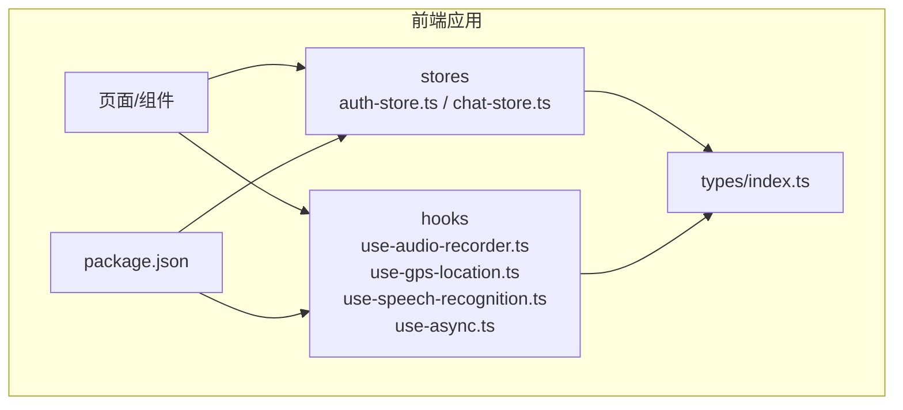
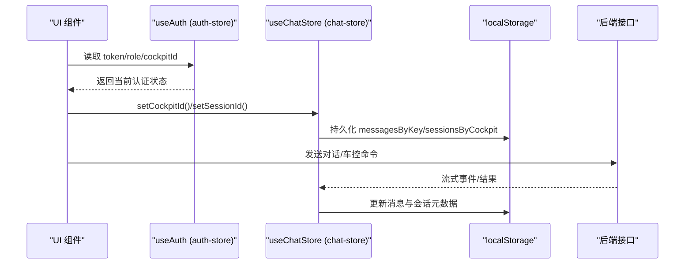
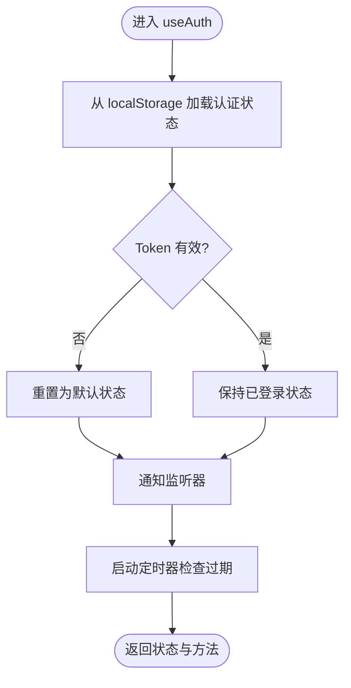
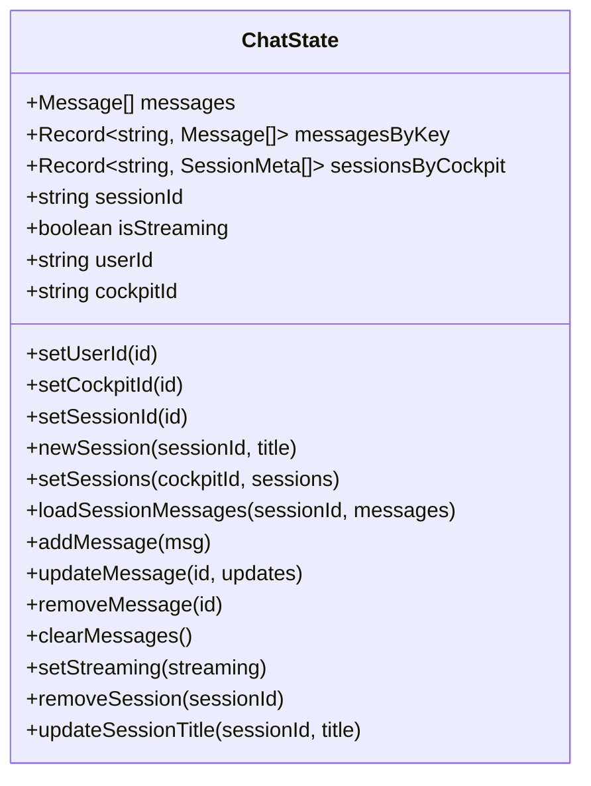
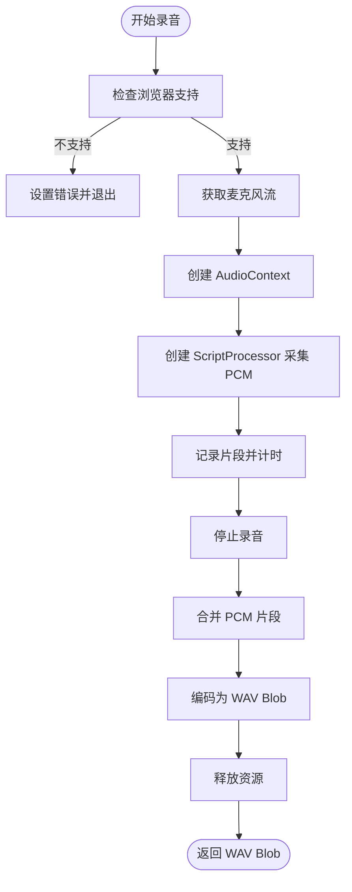
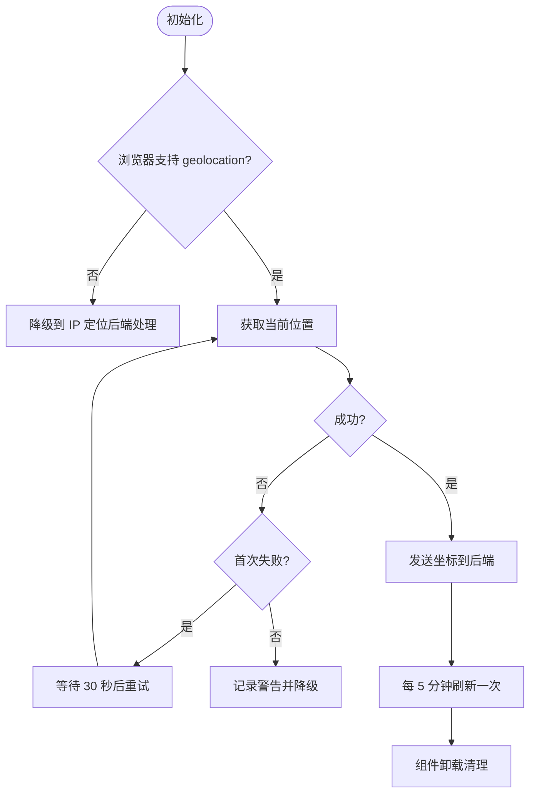
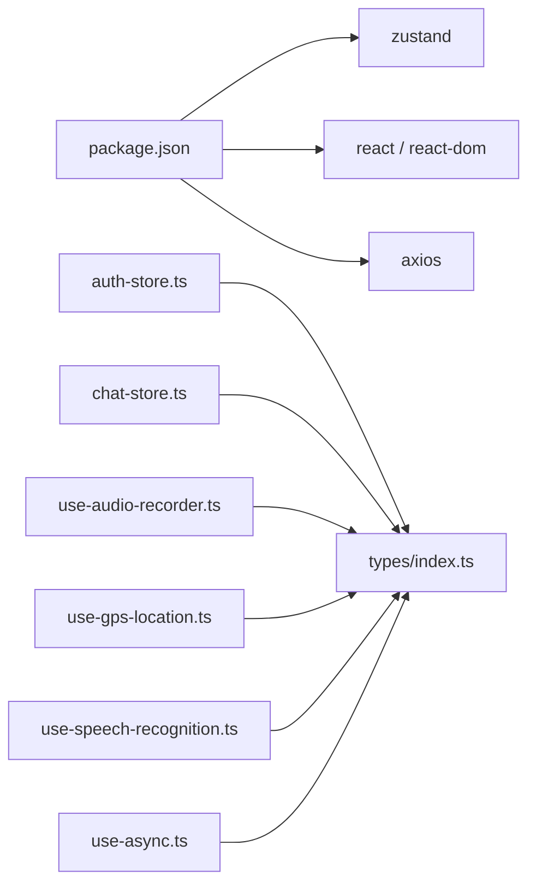

# 状态管理

<cite>
**本文引用的文件**   
- [frontend_design/src/stores/auth-store.ts](file://frontend_design/src/stores/auth-store.ts)
- [frontend_design/src/stores/chat-store.ts](file://frontend_design/src/stores/chat-store.ts)
- [frontend_design/src/hooks/use-audio-recorder.ts](file://frontend_design/src/hooks/use-audio-recorder.ts)
- [frontend_design/src/hooks/use-gps-location.ts](file://frontend_design/src/hooks/use-gps-location.ts)
- [frontend_design/src/hooks/use-speech-recognition.ts](file://frontend_design/src/hooks/use-speech-recognition.ts)
- [frontend_design/src/hooks/use-async.ts](file://frontend_design/src/hooks/use-async.ts)
- [frontend_design/src/types/index.ts](file://frontend_design/src/types/index.ts)
- [frontend_design/package.json](file://frontend_design/package.json)
</cite>

## 目录
1. [简介](#简介)
2. [项目结构](#项目结构)
3. [核心组件](#核心组件)
4. [架构总览](#架构总览)
5. [详细组件分析](#详细组件分析)
6. [依赖分析](#依赖分析)
7. [性能考虑](#性能考虑)
8. [故障排查指南](#故障排查指南)
9. [结论](#结论)
10. [附录：实战示例与最佳实践](#附录实战示例与最佳实践)

## 简介
本技术文档聚焦 NexusCockpit 前端的状态管理系统，围绕基于 Zustand 的 store 设计、状态持久化与中间件使用，以及自定义 hooks 的设计原则与实现进行深入解析。内容涵盖认证与聊天两大核心 store、音频录制与 GPS 定位等能力型 hooks，并给出状态同步策略、错误处理与性能优化建议，同时提供调试工具与最佳实践，帮助开发者快速扩展新的 store 与 hooks。

## 项目结构
NexusCockpit 前端采用 Next.js + React + TypeScript 技术栈，状态管理与能力型逻辑通过以下模块组织：
- stores：全局状态（认证、聊天）
- hooks：可复用的能力封装（异步请求、录音、GPS、语音识别）
- types：统一类型定义
- package.json：依赖声明（Zustand、React、Next.js 等）

图表来源
- [frontend_design/src/stores/auth-store.ts](file://frontend_design/src/stores/auth-store.ts)
- [frontend_design/src/stores/chat-store.ts](file://frontend_design/src/stores/chat-store.ts)
- [frontend_design/src/hooks/use-audio-recorder.ts](file://frontend_design/src/hooks/use-audio-recorder.ts)
- [frontend_design/src/hooks/use-gps-location.ts](file://frontend_design/src/hooks/use-gps-location.ts)
- [frontend_design/src/hooks/use-speech-recognition.ts](file://frontend_design/src/hooks/use-speech-recognition.ts)
- [frontend_design/src/hooks/use-async.ts](file://frontend_design/src/hooks/use-async.ts)
- [frontend_design/src/types/index.ts](file://frontend_design/src/types/index.ts)
- [frontend_design/package.json](file://frontend_design/package.json)

章节来源
- [frontend_design/package.json:12-16](file://frontend_design/package.json#L12-L16)

## 核心组件
- 认证状态管理（auth-store）
  - 职责：维护用户 token、角色、座舱 ID 等认证信息；提供 RBAC 权限判断；本地持久化与过期检测。
  - 特点：模块级单例 + 监听器通知机制；localStorage 持久化；定时刷新校验 token 过期。
- 聊天状态管理（chat-store）
  - 职责：多会话、多座舱的消息与元数据管理；流式接收状态；持久化到 localStorage。
  - 特点：使用 Zustand persist 中间件；按 cockpitId:sessionId 键分组存储消息；恢复时重建 Date 对象并清理加载态。

章节来源
- [frontend_design/src/stores/auth-store.ts:1-228](file://frontend_design/src/stores/auth-store.ts#L1-L228)
- [frontend_design/src/stores/chat-store.ts:1-311](file://frontend_design/src/stores/chat-store.ts#L1-L311)

## 架构总览
整体状态流由“组件调用 hooks/store 方法”驱动，store 负责状态变更与持久化，hooks 封装浏览器 API 或通用异步逻辑，类型系统保证数据结构一致性。

图表来源
- [frontend_design/src/stores/auth-store.ts:110-185](file://frontend_design/src/stores/auth-store.ts#L110-L185)
- [frontend_design/src/stores/chat-store.ts:77-310](file://frontend_design/src/stores/chat-store.ts#L77-L310)

## 详细组件分析

### 认证状态管理（auth-store）
- 设计模式
  - 模块级单例 + 订阅者模式：内部维护 _authState 与 _listeners，提供 set/get/clear 方法与 useAuth hook。
  - 持久化：token 与 cockpitId 写入 localStorage；未登录也保留 cockpitId，避免刷新后 UI 异常。
  - 过期检测：定时器每分钟检查 token 是否过期，自动清理并通知监听器。
- 关键流程
  - 设置 token：写入 localStorage → 重新解析 → 通知监听器。
  - 切换座舱：更新 cockpitId → 持久化 → 通知监听器。
  - 登出：清除 token → 重置状态 → 通知监听器。
- 权限控制
  - 基于角色的层级比较函数 hasRole 及多个 canXxx 辅助函数，便于在 UI 层做路由与按钮级权限控制。

图表来源
- [frontend_design/src/stores/auth-store.ts:70-103](file://frontend_design/src/stores/auth-store.ts#L70-L103)
- [frontend_design/src/stores/auth-store.ts:110-185](file://frontend_design/src/stores/auth-store.ts#L110-L185)

章节来源
- [frontend_design/src/stores/auth-store.ts:1-228](file://frontend_design/src/stores/auth-store.ts#L1-L228)

### 聊天状态管理（chat-store）
- 设计模式
  - 使用 Zustand create + persist 中间件，将多座舱、多会话的消息与元数据持久化到 localStorage。
  - 以 cockpitId:sessionId 作为 key，维护 messagesByKey 与 sessionsByCockpit，支持高效切换与增量更新。
- 关键流程
  - 切换座舱：保存当前会话消息 → 加载目标座舱会话列表 → 若存在会话则加载首个会话消息。
  - 新建会话：保存当前会话 → 新增会话元数据 → 清空当前消息。
  - 删除会话：清理孤儿消息 → 若删除的是当前会话则切换到下一个。
  - 流式接收：isStreaming 标记，配合 onRehydrateStorage 恢复时重置加载态。
- 持久化策略
  - partialize 仅持久化必要字段（messagesByKey、sessionsByCockpit、sessionId、userId、cockpitId）。
  - onRehydrateStorage 恢复时重建 Date 对象并关闭 isStreaming。

图表来源
- [frontend_design/src/stores/chat-store.ts:31-69](file://frontend_design/src/stores/chat-store.ts#L31-L69)
- [frontend_design/src/stores/chat-store.ts:77-310](file://frontend_design/src/stores/chat-store.ts#L77-L310)

章节来源
- [frontend_design/src/stores/chat-store.ts:1-311](file://frontend_design/src/stores/chat-store.ts#L1-L311)

### 音频录制 Hook（useAudioRecorder）
- 设计原则
  - 直接在前端生成标准 WAV（16kHz/16bit/mono），避免后端解码 webm/opus 的额外依赖，提升 ASR 效率。
  - 使用 AudioContext + ScriptProcessorNode 采集 PCM 片段，stop 时合并并编码为 WAV Blob。
  - 完善的资源清理与错误提示（麦克风权限、设备缺失、浏览器不支持）。
- 关键流程
  - startRecording：获取媒体流 → 创建 AudioContext → 连接 Source 与 Processor → 计时器累计时长。
  - stopRecording：断开节点 → 停止音轨 → 合并 PCM 片段 → 构建 AudioBuffer → encodeWav → 释放上下文。
  - cancelRecording/reset：彻底清理所有引用与定时器，确保无内存泄漏。

图表来源
- [frontend_design/src/hooks/use-audio-recorder.ts:100-303](file://frontend_design/src/hooks/use-audio-recorder.ts#L100-L303)

章节来源
- [frontend_design/src/hooks/use-audio-recorder.ts:1-304](file://frontend_design/src/hooks/use-audio-recorder.ts#L1-L304)

### GPS 定位 Hook（useGpsLocation）
- 设计原则
  - 仅获取坐标并发送到后端，不触发逆地理编码，节省 API 调用量。
  - 首次失败自动重试一次（30 秒后），降低偶发网络/权限问题影响。
  - 低频率轮询（5 分钟）刷新坐标缓存，平衡精度与性能。
- 关键流程
  - getCurrentPosition：成功则调用 updateVehicleLocation 发送经纬度；失败则根据错误码输出诊断日志并决定是否重试。
  - 清理：组件卸载时取消定时器与重试定时器，避免后台任务残留。

图表来源
- [frontend_design/src/hooks/use-gps-location.ts:30-118](file://frontend_design/src/hooks/use-gps-location.ts#L30-L118)

章节来源
- [frontend_design/src/hooks/use-gps-location.ts:1-119](file://frontend_design/src/hooks/use-gps-location.ts#L1-L119)

### 语音识别 Hook（useSpeechRecognition）
- 设计原则
  - 基于 Web Speech API，实时返回识别文本，兼容不同浏览器的命名差异。
  - 对常见非错误状态（no-speech、aborted）进行过滤，避免误报。
- 关键流程
  - 初始化：检测浏览器支持 → 创建 SpeechRecognition 实例 → 绑定 onresult/onerror/onend。
  - 控制：startListening/stopListening/resetTranscript 管理识别生命周期。

章节来源
- [frontend_design/src/hooks/use-speech-recognition.ts:1-113](file://frontend_design/src/hooks/use-speech-recognition.ts#L1-L113)

### 异步请求 Hook（useAsync）
- 设计原则
  - 封装 Promise 执行，自动处理 loading/error/data 状态，并在组件卸载时防止竞态更新。
  - 提供 refetch 手动刷新能力，依赖数组变化时自动重执行。
- 关键流程
  - execute：设置 loading=true → try/catch 捕获结果或错误 → finally 重置 loading。
  - useEffect：挂载时执行，卸载时置 mountedRef=false 防止 setState 后渲染。

章节来源
- [frontend_design/src/hooks/use-async.ts:1-64](file://frontend_design/src/hooks/use-async.ts#L1-L64)

## 依赖分析
- 运行时依赖
  - zustand：轻量状态库，用于 create 与 persist 中间件。
  - react/react-dom：组件框架与渲染。
  - axios：HTTP 客户端（在 API 层使用，被 hooks 间接调用）。
- 类型系统
  - types/index.ts 集中定义跨模块类型，如 Message、StreamEvent、UserRole、VoiceprintStatus 等，保障 store 与 hooks 的数据契约一致。

图表来源
- [frontend_design/package.json:12-16](file://frontend_design/package.json#L12-L16)
- [frontend_design/src/types/index.ts:1-277](file://frontend_design/src/types/index.ts#L1-L277)

章节来源
- [frontend_design/package.json:1-43](file://frontend_design/package.json#L1-L43)
- [frontend_design/src/types/index.ts:1-277](file://frontend_design/src/types/index.ts#L1-L277)

## 性能考虑
- Zustand 持久化
  - 使用 partialize 仅持久化必要字段，减少 localStorage 体积与序列化开销。
  - onRehydrateStorage 中避免重复计算，仅恢复必需字段并关闭 isStreaming。
- 状态粒度与选择器
  - 在组件中使用选择器订阅最小状态切片，避免不必要的重渲染（例如只订阅 isStreaming 或特定消息）。
- 音频录制
  - 合理设置 bufferSize（4096）平衡延迟与 CPU；及时释放 AudioContext 与 MediaStream 资源。
- GPS 定位
  - 降低轮询频率（5 分钟）与单次重试策略，减少网络与电池消耗。
- 异步请求
  - useAsync 通过 mountedRef 避免卸载后的 setState，防止内存泄漏与无效渲染。

[本节为通用指导，无需列出具体文件来源]

## 故障排查指南
- 认证相关
  - Token 过期：检查定时器是否正常运行；确认 loadAuthFromStorage 是否正确清理 localStorage。
  - cockpitId 丢失：确认 setCockpitId 是否在登录后正确写入；未登录场景下也应保留 cockpitId。
- 聊天相关
  - 消息回显异常：检查 onRehydrateStorage 是否重建 Date 对象；确认 messagesByKey 的 key 拼接是否正确。
  - 删除会话后仍有消息：检查 removeSession 是否清理了孤儿消息。
- 音频录制
  - 无法录音：检查浏览器支持与麦克风权限；查看 error 字段提示信息。
  - 后端无法识别格式：确认输出为 audio/wav 且采样率 16kHz/16bit/mono。
- GPS 定位
  - 定位失败：查看控制台日志中的错误码描述；确认 enableHighAccuracy/timeout 配置。
  - 频繁调用逆地理编码：确认仅在用户主动查询时触发，避免在定位回调中调用。

章节来源
- [frontend_design/src/stores/auth-store.ts:70-103](file://frontend_design/src/stores/auth-store.ts#L70-L103)
- [frontend_design/src/stores/chat-store.ts:286-310](file://frontend_design/src/stores/chat-store.ts#L286-L310)
- [frontend_design/src/hooks/use-audio-recorder.ts:138-192](file://frontend_design/src/hooks/use-audio-recorder.ts#L138-L192)
- [frontend_design/src/hooks/use-gps-location.ts:72-98](file://frontend_design/src/hooks/use-gps-location.ts#L72-L98)

## 结论
NexusCockpit 的前端状态管理以 Zustand 为核心，结合 localStorage 持久化与中间件，实现了高内聚、低耦合的认证与聊天状态体系。能力型 hooks 封装了浏览器 API 与通用异步逻辑，提升了复用性与可维护性。通过合理的持久化策略、错误处理与性能优化，系统在复杂交互场景下仍保持良好体验。后续可扩展更多领域 store（如车辆状态、仪表盘指标）与 hooks（如文件上传、WebSocket 订阅），遵循本文档的设计原则即可保持一致性与稳定性。

[本节为总结性内容，无需列出具体文件来源]

## 附录：实战示例与最佳实践

### 如何创建新的 Zustand Store
- 步骤
  - 定义状态接口与默认值。
  - 使用 create 定义状态与方法，必要时使用 persist 中间件。
  - 在 onRehydrateStorage 中恢复必要字段与清理临时状态。
  - 导出 store 与必要的操作方法。
- 参考路径
  - [chat-store.ts:77-310](file://frontend_design/src/stores/chat-store.ts#L77-L310)

### 如何在组件中使用 store
- 步骤
  - 导入 useChatStore 或 useAuth。
  - 使用选择器订阅所需状态切片。
  - 调用 store 方法更新状态。
- 参考路径
  - [chat-store.ts:77-310](file://frontend_design/src/stores/chat-store.ts#L77-L310)
  - [auth-store.ts:148-185](file://frontend_design/src/stores/auth-store.ts#L148-L185)

### 如何封装一个新的能力型 Hook
- 步骤
  - 明确输入参数与返回值（状态、方法、错误）。
  - 使用 useRef 管理不稳定引用（如浏览器 API 实例）。
  - 在 useEffect 中初始化与清理资源。
  - 提供 start/stop/reset 等方法，确保幂等与健壮性。
- 参考路径
  - [use-audio-recorder.ts:100-303](file://frontend_design/src/hooks/use-audio-recorder.ts#L100-L303)
  - [use-gps-location.ts:30-118](file://frontend_design/src/hooks/use-gps-location.ts#L30-L118)
  - [use-speech-recognition.ts:19-112](file://frontend_design/src/hooks/use-speech-recognition.ts#L19-L112)
  - [use-async.ts:21-63](file://frontend_design/src/hooks/use-async.ts#L21-L63)

### 状态调试工具与技巧
- 浏览器 DevTools
  - 使用 React DevTools 观察组件 re-render 与状态变化。
  - 使用 Application → Local Storage 查看持久化数据。
- Zustand 调试
  - 开发环境启用 logger 中间件（可选）打印状态变更。
  - 在 onRehydrateStorage 中打印恢复后的状态，验证数据完整性。
- 日志与错误
  - 在 hooks 中输出关键步骤日志（如 GPS 错误码、录音权限拒绝）。
  - 统一错误类型与提示，便于前端展示与后端联调。

[本节为通用指导，无需列出具体文件来源]