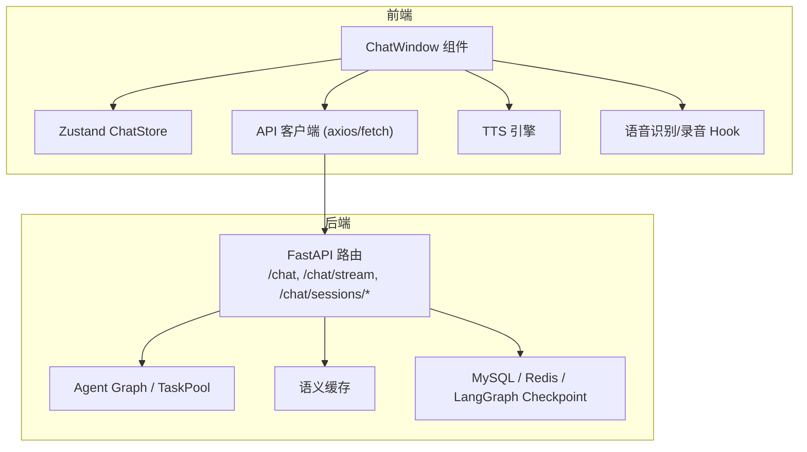
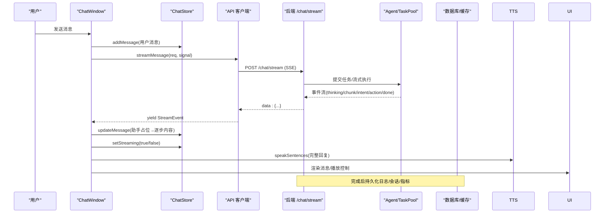
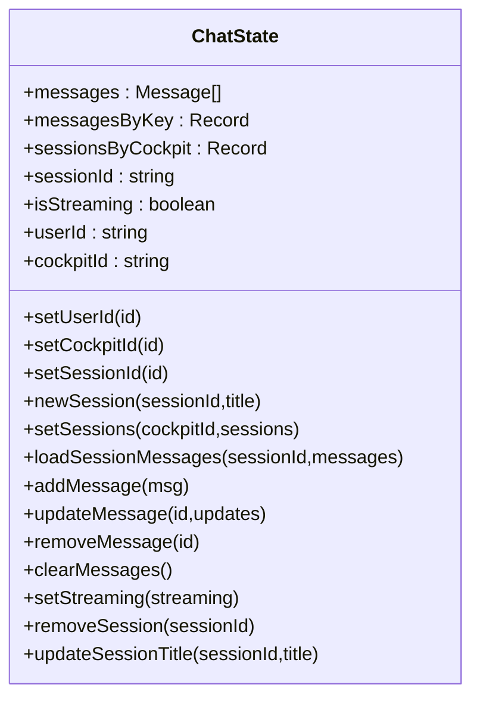
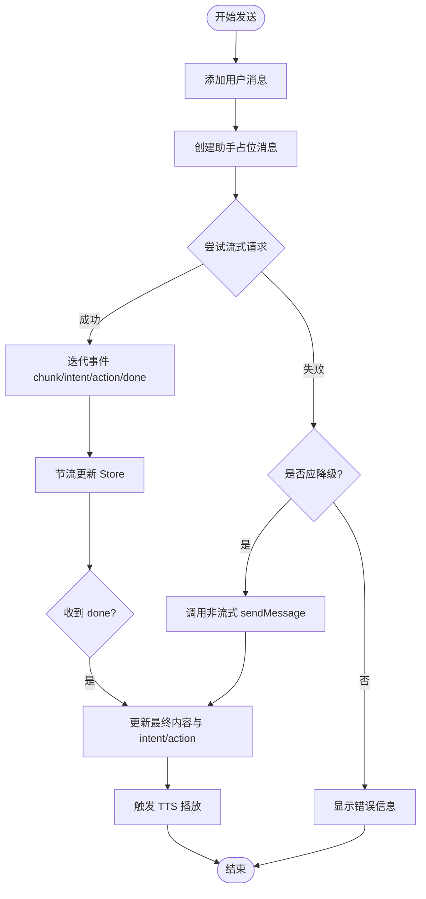
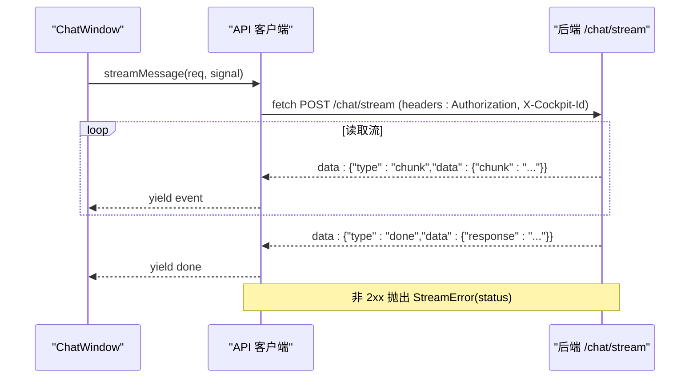
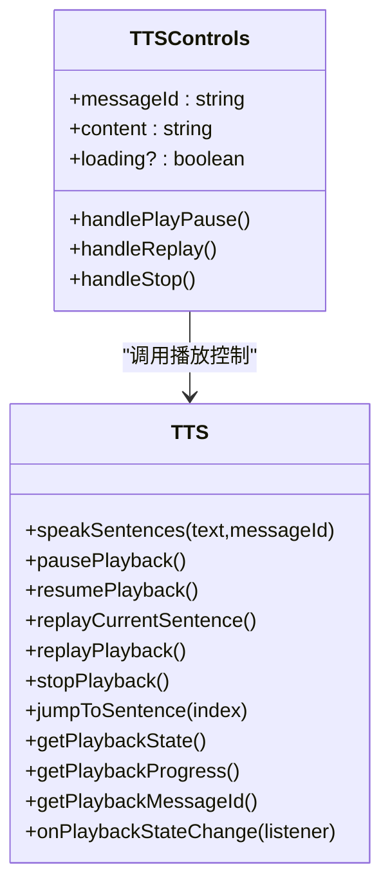
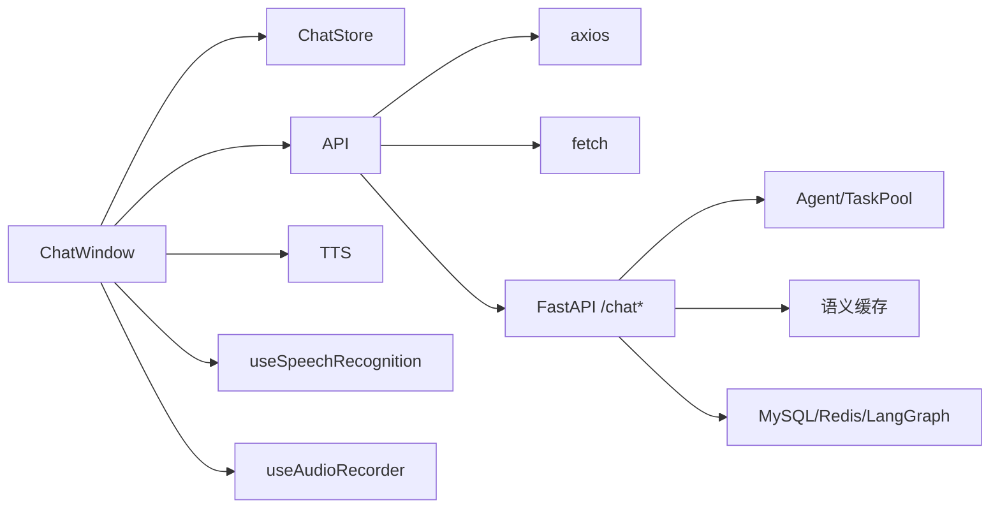

# 聊天状态管理

<cite>
**本文引用的文件**   
- [chat-store.ts](file://frontend_design/src/stores/chat-store.ts)
- [chat-window.tsx](file://frontend_design/src/components/chat/chat-window.tsx)
- [api.ts](file://frontend_design/src/lib/api.ts)
- [types/index.ts](file://frontend_design/src/types/index.ts)
- [utils.ts](file://frontend_design/src/lib/utils.ts)
- [tts-controls.tsx](file://frontend_design/src/components/chat/tts-controls.tsx)
- [tts.ts](file://frontend_design/src/lib/tts.ts)
- [use-speech-recognition.ts](file://frontend_design/src/hooks/use-speech-recognition.ts)
- [use-audio-recorder.ts](file://frontend_design/src/hooks/use-audio-recorder.ts)
- [auth-store.ts](file://frontend_design/src/stores/auth-store.ts)
- [page.tsx](file://frontend_design/src/app/chat/page.tsx)
- [chat.py](file://backend_design/nexus/api/routes/chat.py)
- [chat_sessions.py](file://backend_design/nexus/api/routes/chat_sessions.py)
</cite>

## 目录
1. [简介](#简介)
2. [项目结构](#项目结构)
3. [核心组件](#核心组件)
4. [架构总览](#架构总览)
5. [详细组件分析](#详细组件分析)
6. [依赖关系分析](#依赖关系分析)
7. [性能考量](#性能考量)
8. [故障排查指南](#故障排查指南)
9. [结论](#结论)
10. [附录](#附录)

## 简介
本技术文档聚焦 NexusCockpit 的聊天状态管理系统，系统性阐述前端聊天会话的状态结构设计、消息列表与上下文状态管理、流式响应处理机制，以及与后端 SSE 流的集成方式（实时数据接收、状态同步、错误重试/降级）。同时给出聊天 store 的核心方法说明、组件集成示例、性能优化技巧，以及消息持久化与会话恢复策略。

## 项目结构
前端采用 React + Zustand 进行状态管理，通过 API 层统一封装 HTTP/SSE 请求；后端使用 FastAPI 提供 REST 与 SSE 接口，并实现多会话管理与持久化。

图表来源
- [chat-window.tsx:1-652](file://frontend_design/src/components/chat/chat-window.tsx#L1-L652)
- [chat-store.ts:1-311](file://frontend_design/src/stores/chat-store.ts#L1-L311)
- [api.ts:1-786](file://frontend_design/src/lib/api.ts#L1-L786)
- [chat.py:1-719](file://backend_design/nexus/api/routes/chat.py#L1-L719)
- [chat_sessions.py:1-534](file://backend_design/nexus/api/routes/chat_sessions.py#L1-L534)

章节来源
- [chat-window.tsx:1-652](file://frontend_design/src/components/chat/chat-window.tsx#L1-L652)
- [chat-store.ts:1-311](file://frontend_design/src/stores/chat-store.ts#L1-L311)
- [api.ts:1-786](file://frontend_design/src/lib/api.ts#L1-L786)
- [chat.py:1-719](file://backend_design/nexus/api/routes/chat.py#L1-L719)
- [chat_sessions.py:1-534](file://backend_design/nexus/api/routes/chat_sessions.py#L1-L534)

## 核心组件
- 聊天 Store（Zustand）：维护当前会话消息、按座舱+会话分组的消息索引、会话元数据、流式状态等，并提供增删改查与持久化能力。
- 聊天窗口组件：用户输入、SSE 流式接收、TTS 播放、语音识别/录音、会话切换与历史加载。
- API 客户端：统一的 axios/fetch 封装，JWT 认证、自动刷新 Token、SSE 流式读取、错误分类与降级。
- TTS 引擎：分句播放、全局播放状态机、断点续播、保活机制、音乐联动。
- 语音相关 Hook：浏览器 Web Speech API 语音识别、本地音频录制为 WAV 并上传 ASR。
- 认证 Store：JWT Token 解析、角色权限、座舱 ID 管理。

章节来源
- [chat-store.ts:1-311](file://frontend_design/src/stores/chat-store.ts#L1-L311)
- [chat-window.tsx:1-652](file://frontend_design/src/components/chat/chat-window.tsx#L1-L652)
- [api.ts:1-786](file://frontend_design/src/lib/api.ts#L1-L786)
- [tts.ts:1-443](file://frontend_design/src/lib/tts.ts#L1-L443)
- [use-speech-recognition.ts:1-113](file://frontend_design/src/hooks/use-speech-recognition.ts#L1-L113)
- [use-audio-recorder.ts:1-304](file://frontend_design/src/hooks/use-audio-recorder.ts#L1-L304)
- [auth-store.ts:1-228](file://frontend_design/src/stores/auth-store.ts#L1-L228)

## 架构总览
前端通过 ChatWindow 发起对话，调用 API 层的 streamMessage（SSE）或 sendMessage（非流式），后端 chat_stream 返回结构化事件（thinking/chunk/intent/action/done/error），前端节流更新 Store，最终触发 TTS 与车控面板刷新。

图表来源
- [chat-window.tsx:222-401](file://frontend_design/src/components/chat/chat-window.tsx#L222-L401)
- [api.ts:261-341](file://frontend_design/src/lib/api.ts#L261-L341)
- [chat.py:467-686](file://backend_design/nexus/api/routes/chat.py#L467-L686)

## 详细组件分析

### 聊天 Store（Zustand）
- 数据结构
  - messages：当前会话消息数组
  - messagesByKey：按 cockpitId:sessionId 键存储的消息数组，用于跨会话快速恢复
  - sessionsByCockpit：按座舱分组会话元数据
  - sessionId/isStreaming/userId/cockpitId：当前会话与流式状态
- 核心方法
  - addMessage/updateMessage/removeMessage/clearMessages：消息 CRUD
  - newSession/setSessionId/loadSessionMessages：会话创建/切换/加载
  - setSessions/updateSessionTitle/removeSession：会话列表与标题管理
  - setStreaming：流式状态开关
  - persist：持久化到 localStorage，onRehydrateStorage 恢复 messages 与 isStreaming=false

图表来源
- [chat-store.ts:31-69](file://frontend_design/src/stores/chat-store.ts#L31-L69)
- [chat-store.ts:77-310](file://frontend_design/src/stores/chat-store.ts#L77-L310)

章节来源
- [chat-store.ts:1-311](file://frontend_design/src/stores/chat-store.ts#L1-L311)

### 聊天窗口组件（ChatWindow）
- 功能要点
  - 文本输入 + SSE 流式接收 AI 回复
  - 浏览器语音识别与本地 ASR 录音
  - 多会话管理（新建/切换/加载历史）
  - 流式请求可取消（AbortController）
  - 降级策略：流式失败时回退到非流式请求
- 关键流程
  - handleSend：添加用户消息→创建占位助手消息→streamMessage 迭代事件→节流 flush→done 后更新 intent/action→TTS 朗读→必要时触发车控刷新
  - scheduleFlush：每 50ms 最多一次 setState，避免 rAF 在组件卸载后失效
  - handleStop：仅用户主动点击暂停生成时中断

图表来源
- [chat-window.tsx:222-401](file://frontend_design/src/components/chat/chat-window.tsx#L222-L401)
- [api.ts:261-341](file://frontend_design/src/lib/api.ts#L261-L341)

章节来源
- [chat-window.tsx:1-652](file://frontend_design/src/components/chat/chat-window.tsx#L1-L652)

### API 客户端（SSE 与非流式）
- 非流式：sendMessage 直接 POST /chat，返回完整响应
- 流式：streamMessage 使用原生 fetch + ReadableStream，逐行解析 data: JSON，支持 AbortSignal 取消
- 错误分类：StreamError 携带 status，便于前端区分 404/501 等场景进行降级

图表来源
- [api.ts:261-341](file://frontend_design/src/lib/api.ts#L261-L341)
- [chat.py:467-686](file://backend_design/nexus/api/routes/chat.py#L467-L686)

章节来源
- [api.ts:1-786](file://frontend_design/src/lib/api.ts#L1-L786)

### TTS 引擎与控制组件
- 分句播放：按中文/英文标点切分，逐句播报，支持暂停/继续/重放/终止
- 全局状态机：playing/paused/stopped/idle，监听器通知 UI 进度
- 保活机制：Chrome speechSynthesis 周期性 pause/resume 防止长时间播放冻结
- 音乐联动：朗读前暂停音乐，结束后恢复

图表来源
- [tts.ts:1-443](file://frontend_design/src/lib/tts.ts#L1-L443)
- [tts-controls.tsx:1-178](file://frontend_design/src/components/chat/tts-controls.tsx#L1-L178)

章节来源
- [tts.ts:1-443](file://frontend_design/src/lib/tts.ts#L1-L443)
- [tts-controls.tsx:1-178](file://frontend_design/src/components/chat/tts-controls.tsx#L1-L178)

### 语音识别与录音 Hook
- useSpeechRecognition：基于 Web Speech API，实时转写，自动处理兼容性与错误
- useAudioRecorder：使用 AudioContext + ScriptProcessorNode 采集 PCM，编码为 WAV（16kHz/16bit/mono），可直接上传 ASR

章节来源
- [use-speech-recognition.ts:1-113](file://frontend_design/src/hooks/use-speech-recognition.ts#L1-L113)
- [use-audio-recorder.ts:1-304](file://frontend_design/src/hooks/use-audio-recorder.ts#L1-L304)

### 认证与座舱管理
- auth-store：解析 JWT，维护 token/role/cockpitId，提供切换座舱与登出能力
- 与 ChatWindow 联动：当 auth cockpitId 变化时同步到 chat store 并加载会话列表

章节来源
- [auth-store.ts:1-228](file://frontend_design/src/stores/auth-store.ts#L1-L228)
- [chat-window.tsx:103-141](file://frontend_design/src/components/chat/chat-window.tsx#L103-L141)

### 页面入口
- page.tsx：简单包裹 ChatWindow，作为“语音助手”页面入口

章节来源
- [page.tsx:1-22](file://frontend_design/src/app/chat/page.tsx#L1-L22)

## 依赖关系分析
- ChatWindow 依赖：
  - ChatStore：消息与会话状态管理
  - API：SSE/REST 通信
  - TTS：语音合成
  - Hooks：语音识别/录音
  - utils：时间格式化与类名合并
- API 依赖：
  - axios：非流式请求与拦截器（Token/座舱头）
  - fetch：流式读取
- 后端依赖：
  - FastAPI：路由与 StreamingResponse
  - Agent/TaskPool：流式事件生成
  - 语义缓存/数据库：缓存命中与持久化

图表来源
- [chat-window.tsx:1-652](file://frontend_design/src/components/chat/chat-window.tsx#L1-L652)
- [api.ts:1-786](file://frontend_design/src/lib/api.ts#L1-L786)
- [chat.py:1-719](file://backend_design/nexus/api/routes/chat.py#L1-L719)

章节来源
- [chat-window.tsx:1-652](file://frontend_design/src/components/chat/chat-window.tsx#L1-L652)
- [api.ts:1-786](file://frontend_design/src/lib/api.ts#L1-L786)
- [chat.py:1-719](file://backend_design/nexus/api/routes/chat.py#L1-L719)

## 性能考量
- 流式更新节流：使用 setTimeout 替代 rAF，确保组件卸载后仍可写入 Store，避免卡顿与丢失更新
- 批量持久化：messagesByKey 按 key 聚合，减少重复渲染与 localStorage 写入
- SSE 心跳：后端定期发送注释行保持连接，避免中间设备超时断开
- 降级策略：流式失败（404/501）自动回退非流式，提升可用性
- TTS 保活：周期 pause/resume 防止 Chrome 语音合成冻结
- 并发锁：后端会话级锁防止同一 session 并发交叉污染

章节来源
- [chat-window.tsx:196-208](file://frontend_design/src/components/chat/chat-window.tsx#L196-L208)
- [chat-store.ts:286-310](file://frontend_design/src/stores/chat-store.ts#L286-L310)
- [api.ts:261-341](file://frontend_design/src/lib/api.ts#L261-L341)
- [chat.py:520-594](file://backend_design/nexus/api/routes/chat.py#L520-L594)
- [tts.ts:164-183](file://frontend_design/src/lib/tts.ts#L164-L183)

## 故障排查指南
- 流式连接失败
  - 检查网络与后端 /chat/stream 可达性
  - 查看 StreamError.status 判断 404/501 等，确认是否触发降级
- Token 过期/鉴权失败
  - 观察 401 是否触发自动刷新 Token 并重试
  - 确认 localStorage 中 nexus_token 有效且 role 存在
- 会话数据不一致
  - 使用后端一致性自检接口扫描孤立日志/僵尸缓存/孤儿向量
  - 删除会话后确认 MySQL/Redis/LangGraph/Milvus 清理完成
- 语音识别异常
  - 检查浏览器支持与麦克风权限
  - 本地录音格式是否为 WAV（16kHz/16bit/mono）
- TTS 播放卡死
  - 确认保活定时器运行，避免长时间无事件导致 onend 不触发

章节来源
- [api.ts:152-175](file://frontend_design/src/lib/api.ts#L152-L175)
- [chat_sessions.py:404-534](file://backend_design/nexus/api/routes/chat_sessions.py#L404-L534)
- [use-speech-recognition.ts:53-74](file://frontend_design/src/hooks/use-speech-recognition.ts#L53-L74)
- [use-audio-recorder.ts:183-192](file://frontend_design/src/hooks/use-audio-recorder.ts#L183-L192)
- [tts.ts:164-183](file://frontend_design/src/lib/tts.ts#L164-L183)

## 结论
NexusCockpit 的聊天状态管理以 Zustand Store 为核心，结合 ChatWindow 的流式交互与 TTS 引擎，实现了高可用、低延迟、易扩展的对话体验。前后端通过 SSE 紧密协作，配合语义缓存与会话持久化，保障数据一致性与用户体验。通过节流更新、降级策略与保活机制，系统在复杂环境下仍保持稳定。

## 附录

### 消息类型与会话元数据
- Message：id/role/content/timestamp/intent/action/loading
- SessionMeta：session_id/title/message_count/created_at/last_message_at

章节来源
- [types/index.ts:55-63](file://frontend_design/src/types/index.ts#L55-L63)
- [chat-store.ts:22-28](file://frontend_design/src/stores/chat-store.ts#L22-L28)

### 后端会话管理接口
- GET /chat/sessions：获取当前座舱会话列表
- POST /chat/sessions：创建新会话
- DELETE /chat/sessions/{id}：删除会话及关联资源
- GET /chat/sessions/{id}/messages：获取会话消息记录
- PATCH /chat/sessions/{id}/title：更新会话标题

章节来源
- [chat_sessions.py:58-135](file://backend_design/nexus/api/routes/chat_sessions.py#L58-L135)
- [chat_sessions.py:138-324](file://backend_design/nexus/api/routes/chat_sessions.py#L138-L324)
- [chat_sessions.py:327-401](file://backend_design/nexus/api/routes/chat_sessions.py#L327-L401)

### 流式事件类型
- thinking：思考中
- chunk：文本块增量
- intent：意图名称
- action：技能动作
- done：完成（包含完整 response）
- error：错误（包含 message）

章节来源
- [types/index.ts:40-52](file://frontend_design/src/types/index.ts#L40-L52)
- [chat.py:467-686](file://backend_design/nexus/api/routes/chat.py#L467-L686)

### 组件集成示例（路径引用）
- 聊天页面入口：[page.tsx:9-21](file://frontend_design/src/app/chat/page.tsx#L9-L21)
- 聊天窗口主逻辑：[chat-window.tsx:222-401](file://frontend_design/src/components/chat/chat-window.tsx#L222-L401)
- Store 初始化与持久化：[chat-store.ts:77-310](file://frontend_design/src/stores/chat-store.ts#L77-L310)
- SSE 流式读取：[api.ts:261-341](file://frontend_design/src/lib/api.ts#L261-L341)
- TTS 播放控制：[tts-controls.tsx:53-176](file://frontend_design/src/components/chat/tts-controls.tsx#L53-L176)