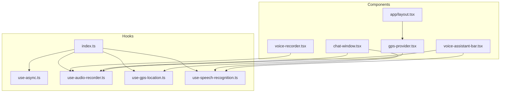
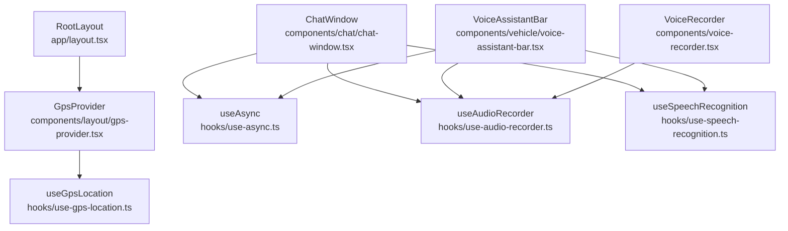
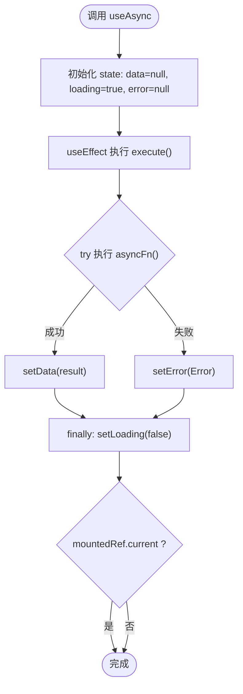
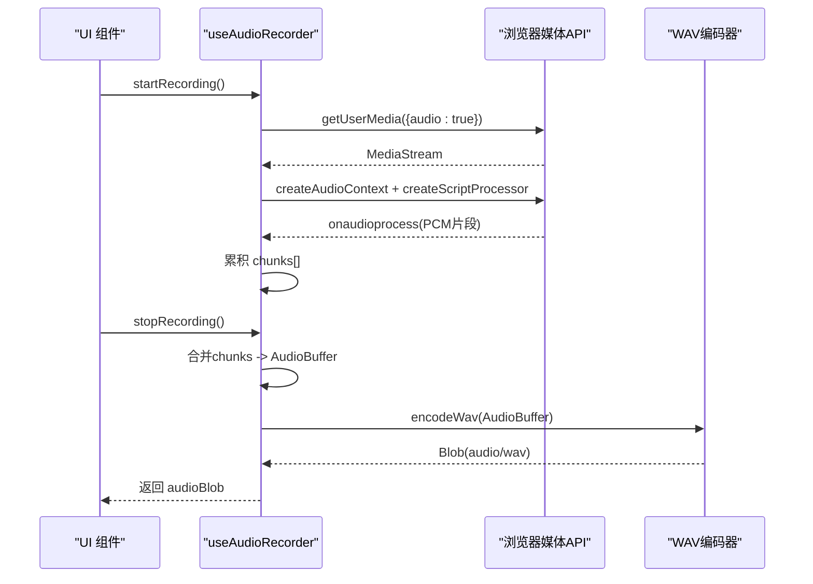
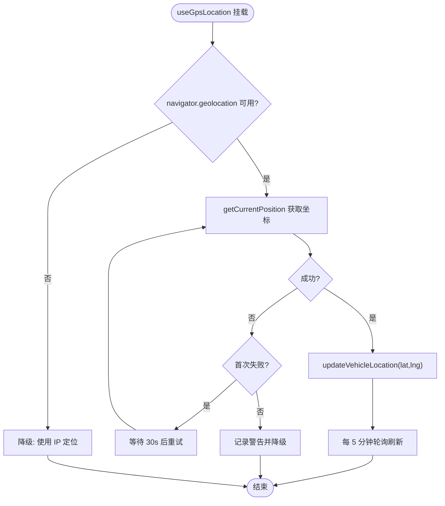
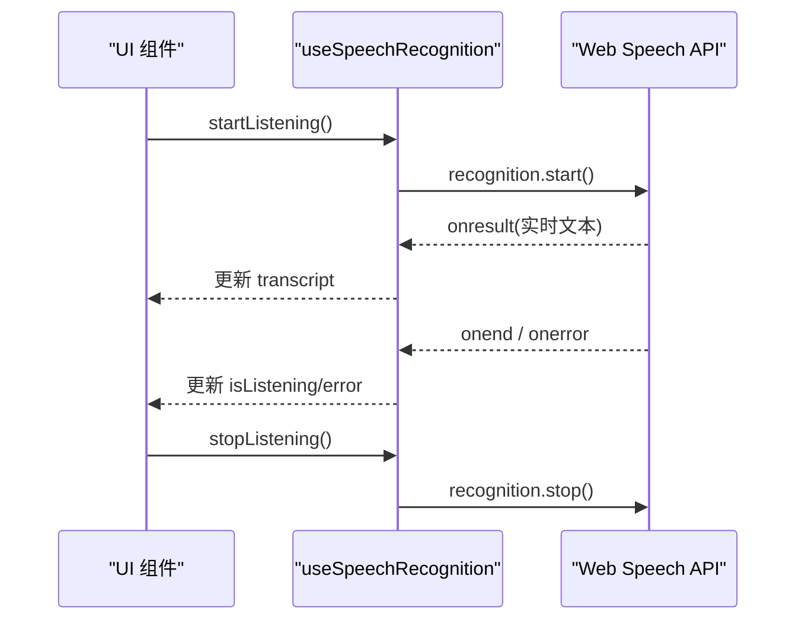
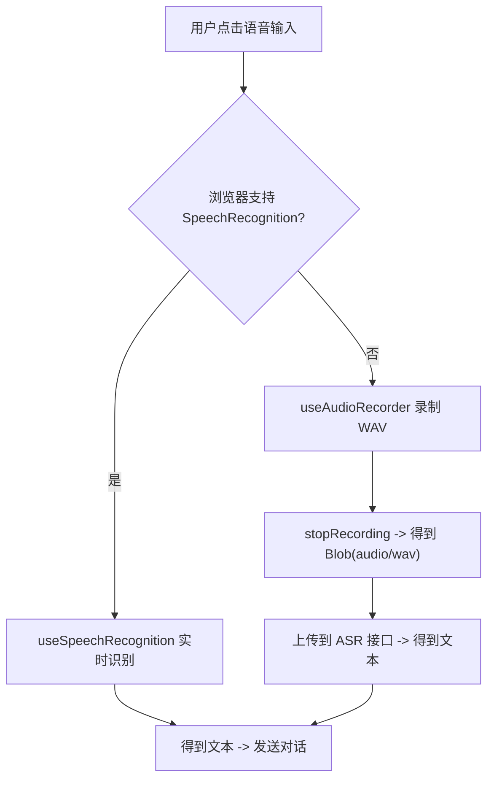
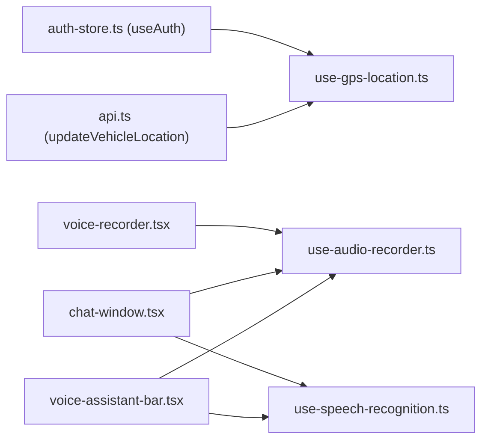

# 自定义 Hooks

<cite>
**本文引用的文件**   
- [frontend_design/src/hooks/index.ts](file://frontend_design/src/hooks/index.ts)
- [frontend_design/src/hooks/use-async.ts](file://frontend_design/src/hooks/use-async.ts)
- [frontend_design/src/hooks/use-audio-recorder.ts](file://frontend_design/src/hooks/use-audio-recorder.ts)
- [frontend_design/src/hooks/use-gps-location.ts](file://frontend_design/src/hooks/use-gps-location.ts)
- [frontend_design/src/hooks/use-speech-recognition.ts](file://frontend_design/src/hooks/use-speech-recognition.ts)
- [frontend_design/src/components/voice-recorder.tsx](file://frontend_design/src/components/voice-recorder.tsx)
- [frontend_design/src/components/layout/gps-provider.tsx](file://frontend_design/src/components/layout/gps-provider.tsx)
- [frontend_design/src/app/layout.tsx](file://frontend_design/src/app/layout.tsx)
- [frontend_design/src/components/chat/chat-window.tsx](file://frontend_design/src/components/chat/chat-window.tsx)
- [frontend_design/src/components/vehicle/voice-assistant-bar.tsx](file://frontend_design/src/components/vehicle/voice-assistant-bar.tsx)
</cite>

## 目录
1. [简介](#简介)
2. [项目结构](#项目结构)
3. [核心组件](#核心组件)
4. [架构总览](#架构总览)
5. [详细组件分析](#详细组件分析)
6. [依赖关系分析](#依赖关系分析)
7. [性能考量](#性能考量)
8. [故障排查指南](#故障排查指南)
9. [结论](#结论)
10. [附录](#附录)

## 简介
本技术文档聚焦 NexusCockpit 前端自定义 Hooks 系统，系统性解析 useAsync、useAudioRecorder、useGpsLocation、useSpeechRecognition 等关键 Hook 的设计模式与实现原理。内容涵盖 API 设计、参数配置、返回值结构、错误处理、状态与生命周期管理、使用场景与最佳实践，并提供扩展新 Hook 的方法、性能优化与调试技巧，帮助开发者快速理解并高效复用这些能力。

## 项目结构
NexusCockpit 的前端采用 Next.js App Router，Hooks 统一位于 frontend_design/src/hooks 目录，并通过 index.ts 进行集中导出。各功能 Hook 被不同业务组件按需引入：
- useAsync：通用异步数据获取封装
- useAudioRecorder：基于 AudioContext + ScriptProcessor 的 WAV 录音
- useGpsLocation：浏览器地理定位与坐标上报
- useSpeechRecognition：Web Speech API 语音转文字

图表来源
- [frontend_design/src/hooks/index.ts:1-12](file://frontend_design/src/hooks/index.ts#L1-L12)
- [frontend_design/src/hooks/use-async.ts:1-64](file://frontend_design/src/hooks/use-async.ts#L1-L64)
- [frontend_design/src/hooks/use-audio-recorder.ts:1-304](file://frontend_design/src/hooks/use-audio-recorder.ts#L1-L304)
- [frontend_design/src/hooks/use-gps-location.ts:1-119](file://frontend_design/src/hooks/use-gps-location.ts#L1-L119)
- [frontend_design/src/hooks/use-speech-recognition.ts:1-113](file://frontend_design/src/hooks/use-speech-recognition.ts#L1-L113)
- [frontend_design/src/components/voice-recorder.tsx:1-212](file://frontend_design/src/components/voice-recorder.tsx#L1-L212)
- [frontend_design/src/components/layout/gps-provider.tsx:1-21](file://frontend_design/src/components/layout/gps-provider.tsx#L1-L21)
- [frontend_design/src/app/layout.tsx:1-55](file://frontend_design/src/app/layout.tsx#L1-L55)
- [frontend_design/src/components/chat/chat-window.tsx:1-200](file://frontend_design/src/components/chat/chat-window.tsx#L1-L200)
- [frontend_design/src/components/vehicle/voice-assistant-bar.tsx:1-200](file://frontend_design/src/components/vehicle/voice-assistant-bar.tsx#L1-L200)

章节来源
- [frontend_design/src/hooks/index.ts:1-12](file://frontend_design/src/hooks/index.ts#L1-L12)
- [frontend_design/src/app/layout.tsx:1-55](file://frontend_design/src/app/layout.tsx#L1-L55)

## 核心组件
本节对四个核心 Hook 进行概览性说明，包括职责、API、返回值与典型用法。

- useAsync
  - 职责：封装 Promise 异步操作，自动处理 loading/error/data 状态与卸载竞态问题
  - 输入：异步函数（返回 Promise<T>），依赖数组
  - 输出：{ data, loading, error, refetch }
  - 适用场景：页面初始化数据加载、手动刷新、条件触发请求

- useAudioRecorder
  - 职责：基于 AudioContext + ScriptProcessorNode 采集 PCM 并编码为 WAV Blob（16kHz/16bit/mono）
  - 输入：无
  - 输出：{ isRecording, duration, error, audioBlob, supported, startRecording, stopRecording, cancelRecording, reset }
  - 适用场景：声纹注册/验证、ASR 音频采集、语音消息录制

- useGpsLocation
  - 职责：调用浏览器 Geolocation API，定时更新坐标并上报后端；失败时自动重试一次
  - 输入：无
  - 输出：副作用型 Hook（不直接返回 UI 状态）
  - 适用场景：全局位置缓存、后续逆地理编码按需触发

- useSpeechRecognition
  - 职责：基于 Web Speech API 实现实时语音转文字
  - 输入：无
  - 输出：{ isListening, transcript, error, startListening, stopListening, resetTranscript, supported }
  - 适用场景：聊天窗口语音输入、语音助手栏即时识别

章节来源
- [frontend_design/src/hooks/use-async.ts:1-64](file://frontend_design/src/hooks/use-async.ts#L1-L64)
- [frontend_design/src/hooks/use-audio-recorder.ts:1-304](file://frontend_design/src/hooks/use-audio-recorder.ts#L1-L304)
- [frontend_design/src/hooks/use-gps-location.ts:1-119](file://frontend_design/src/hooks/use-gps-location.ts#L1-L119)
- [frontend_design/src/hooks/use-speech-recognition.ts:1-113](file://frontend_design/src/hooks/use-speech-recognition.ts#L1-L113)

## 架构总览
下图展示 Hooks 在应用中的挂载点与交互关系：GPS 通过 Provider 在根布局中启动；语音相关 Hook 在聊天与车载助手界面中使用；useAsync 作为通用工具被多处复用。

图表来源
- [frontend_design/src/app/layout.tsx:1-55](file://frontend_design/src/app/layout.tsx#L1-L55)
- [frontend_design/src/components/layout/gps-provider.tsx:1-21](file://frontend_design/src/components/layout/gps-provider.tsx#L1-L21)
- [frontend_design/src/hooks/use-gps-location.ts:1-119](file://frontend_design/src/hooks/use-gps-location.ts#L1-L119)
- [frontend_design/src/components/chat/chat-window.tsx:1-200](file://frontend_design/src/components/chat/chat-window.tsx#L1-L200)
- [frontend_design/src/components/vehicle/voice-assistant-bar.tsx:1-200](file://frontend_design/src/components/vehicle/voice-assistant-bar.tsx#L1-L200)
- [frontend_design/src/components/voice-recorder.tsx:1-212](file://frontend_design/src/components/voice-recorder.tsx#L1-L212)
- [frontend_design/src/hooks/use-async.ts:1-64](file://frontend_design/src/hooks/use-async.ts#L1-L64)
- [frontend_design/src/hooks/use-audio-recorder.ts:1-304](file://frontend_design/src/hooks/use-audio-recorder.ts#L1-L304)
- [frontend_design/src/hooks/use-speech-recognition.ts:1-113](file://frontend_design/src/hooks/use-speech-recognition.ts#L1-L113)

## 详细组件分析

### useAsync 异步操作封装
- 设计要点
  - 使用 useState 维护 data/loading/error
  - 使用 useRef 标记组件是否已卸载，避免 setState 导致内存泄漏或警告
  - useEffect 监听依赖变化执行异步函数，提供 refetch 手动触发
- 复杂度与性能
  - 每次依赖变化重新执行，refetch 可复用同一 execute 引用
  - 异常捕获将非 Error 对象包装为 Error，保证 error 字段类型一致
- 错误处理
  - try/catch 捕获异常，finally 确保 loading 复位
  - 组件卸载后不再更新状态
- 使用建议
  - 将稳定依赖放入 deps 数组，避免不必要的重执行
  - 结合 UI 层 loading 骨架屏提升体验

图表来源
- [frontend_design/src/hooks/use-async.ts:1-64](file://frontend_design/src/hooks/use-async.ts#L1-L64)

章节来源
- [frontend_design/src/hooks/use-async.ts:1-64](file://frontend_design/src/hooks/use-async.ts#L1-L64)

### useAudioRecorder 音频录制
- 设计要点
  - 使用 AudioContext + MediaStream + ScriptProcessorNode 采集 PCM 片段
  - 将 PCM 合并后创建 AudioBuffer，再编码为标准 WAV Blob（16kHz/16bit/mono）
  - 计时器累计 duration，支持开始/停止/取消/重置
- 兼容性检测
  - 检查 navigator.mediaDevices 与 AudioContext/webkitAudioContext
  - 不支持时设置 supported=false 并提示错误
- 错误处理
  - 权限拒绝（NotAllowedError）、设备缺失（NotFoundError）等分类提示
  - 清理资源：断开节点、停止音轨、关闭 AudioContext、清除定时器
- 使用建议
  - 在父组件中根据 audioBlob 生成 File 上传至 ASR
  - 回放时使用 URL.createObjectURL，并在卸载时 revokeObjectURL

图表来源
- [frontend_design/src/hooks/use-audio-recorder.ts:1-304](file://frontend_design/src/hooks/use-audio-recorder.ts#L1-L304)
- [frontend_design/src/components/voice-recorder.tsx:1-212](file://frontend_design/src/components/voice-recorder.tsx#L1-L212)

章节来源
- [frontend_design/src/hooks/use-audio-recorder.ts:1-304](file://frontend_design/src/hooks/use-audio-recorder.ts#L1-L304)
- [frontend_design/src/components/voice-recorder.tsx:1-212](file://frontend_design/src/components/voice-recorder.tsx#L1-L212)

### useGpsLocation GPS 定位
- 设计要点
  - 首次获取坐标后调用 updateVehicleLocation 仅上报经纬度，不触发逆地理编码
  - 每 5 分钟轮询一次以刷新坐标缓存
  - 首次失败时 30 秒后自动重试一次
- 错误处理
  - 区分用户拒绝、不可用、超时等错误码并记录日志
  - 失败降级到后端 IP 定位
- 使用建议
  - 在根布局通过 GpsProvider 挂载，确保全局生效
  - 逆地理编码应在用户主动查询时触发，节省 API 配额

图表来源
- [frontend_design/src/hooks/use-gps-location.ts:1-119](file://frontend_design/src/hooks/use-gps-location.ts#L1-L119)
- [frontend_design/src/components/layout/gps-provider.tsx:1-21](file://frontend_design/src/components/layout/gps-provider.tsx#L1-L21)
- [frontend_design/src/app/layout.tsx:1-55](file://frontend_design/src/app/layout.tsx#L1-L55)

章节来源
- [frontend_design/src/hooks/use-gps-location.ts:1-119](file://frontend_design/src/hooks/use-gps-location.ts#L1-L119)
- [frontend_design/src/components/layout/gps-provider.tsx:1-21](file://frontend_design/src/components/layout/gps-provider.tsx#L1-L21)
- [frontend_design/src/app/layout.tsx:1-55](file://frontend_design/src/app/layout.tsx#L1-L55)

### useSpeechRecognition 语音识别
- 设计要点
  - 基于 Web Speech API（SpeechRecognition/webkitSpeechRecognition）
  - 开启 interimResults 实现实时结果回传
  - 语言设置为 zh-CN，continuous=false 单次识别
- 错误处理
  - no-speech 与 aborted 视为正常行为，不显示错误
  - 其他错误记录并停止识别
- 使用建议
  - 在聊天窗口或语音助手栏中集成，结合 useAudioRecorder 做备选方案（当浏览器不支持时）

图表来源
- [frontend_design/src/hooks/use-speech-recognition.ts:1-113](file://frontend_design/src/hooks/use-speech-recognition.ts#L1-L113)
- [frontend_design/src/components/chat/chat-window.tsx:1-200](file://frontend_design/src/components/chat/chat-window.tsx#L1-L200)
- [frontend_design/src/components/vehicle/voice-assistant-bar.tsx:1-200](file://frontend_design/src/components/vehicle/voice-assistant-bar.tsx#L1-L200)

章节来源
- [frontend_design/src/hooks/use-speech-recognition.ts:1-113](file://frontend_design/src/hooks/use-speech-recognition.ts#L1-L113)
- [frontend_design/src/components/chat/chat-window.tsx:1-200](file://frontend_design/src/components/chat/chat-window.tsx#L1-L200)
- [frontend_design/src/components/vehicle/voice-assistant-bar.tsx:1-200](file://frontend_design/src/components/vehicle/voice-assistant-bar.tsx#L1-L200)

### 概念总览
以下流程图展示语音输入在不同场景下的选择策略：优先使用 Web Speech 实时识别；若不可用则回退到录音后上传 ASR 的流程。

[此图为概念流程，不直接映射具体源码文件]

## 依赖关系分析
- 模块耦合
  - useGpsLocation 依赖 @/lib/api.updateVehicleLocation 与 @/stores/auth-store.useAuth
  - useAudioRecorder 与 useSpeechRecognition 主要依赖浏览器原生 API
  - useAsync 为纯函数式 Hook，无外部依赖
- 组件引用
  - voice-recorder.tsx 使用 useAudioRecorder
  - gps-provider.tsx 使用 useGpsLocation
  - chat-window.tsx 与 voice-assistant-bar.tsx 同时使用 useAudioRecorder 与 useSpeechRecognition

图表来源
- [frontend_design/src/hooks/use-gps-location.ts:1-119](file://frontend_design/src/hooks/use-gps-location.ts#L1-L119)
- [frontend_design/src/components/voice-recorder.tsx:1-212](file://frontend_design/src/components/voice-recorder.tsx#L1-L212)
- [frontend_design/src/components/chat/chat-window.tsx:1-200](file://frontend_design/src/components/chat/chat-window.tsx#L1-L200)
- [frontend_design/src/components/vehicle/voice-assistant-bar.tsx:1-200](file://frontend_design/src/components/vehicle/voice-assistant-bar.tsx#L1-L200)

章节来源
- [frontend_design/src/hooks/use-gps-location.ts:1-119](file://frontend_design/src/hooks/use-gps-location.ts#L1-L119)
- [frontend_design/src/components/voice-recorder.tsx:1-212](file://frontend_design/src/components/voice-recorder.tsx#L1-L212)
- [frontend_design/src/components/chat/chat-window.tsx:1-200](file://frontend_design/src/components/chat/chat-window.tsx#L1-L200)
- [frontend_design/src/components/vehicle/voice-assistant-bar.tsx:1-200](file://frontend_design/src/components/vehicle/voice-assistant-bar.tsx#L1-L200)

## 性能考量
- useAsync
  - 合理设置依赖数组，避免频繁重执行
  - 利用 refetch 仅在需要时触发，减少无效请求
- useAudioRecorder
  - ScriptProcessorNode 的 bufferSize=4096 平衡延迟与性能
  - 合并 PCM 片段与 WAV 编码在 stop 时一次性完成，避免渲染阻塞
  - 注意 Object URL 的生命周期，及时释放防止内存泄漏
- useGpsLocation
  - 降低轮询频率（5 分钟）以减少网络与计算开销
  - 仅上报坐标，逆地理编码按需触发，节省 API 配额
- useSpeechRecognition
  - 仅在必要时启动识别，避免持续占用麦克风
  - 对 no-speech/aborted 等正常事件静默处理，减少 UI 抖动

[本节为通用指导，不直接分析具体文件]

## 故障排查指南
- useAsync
  - 现象：组件卸载后仍尝试 setState
  - 排查：确认 mountedRef 的使用与 finally 分支是否正确复位 loading
  - 参考路径：[frontend_design/src/hooks/use-async.ts:1-64](file://frontend_design/src/hooks/use-async.ts#L1-L64)
- useAudioRecorder
  - 现象：浏览器不支持或权限被拒绝
  - 排查：检查 supported 标志与错误信息；确认麦克风权限与设备可用性
  - 参考路径：[frontend_design/src/hooks/use-audio-recorder.ts:1-304](file://frontend_design/src/hooks/use-audio-recorder.ts#L1-L304)
- useGpsLocation
  - 现象：定位失败或无法更新
  - 排查：查看控制台错误描述（权限/不可用/超时）；确认 30 秒重试逻辑与 5 分钟轮询
  - 参考路径：[frontend_design/src/hooks/use-gps-location.ts:1-119](file://frontend_design/src/hooks/use-gps-location.ts#L1-L119)
- useSpeechRecognition
  - 现象：浏览器不支持或识别中断
  - 排查：确认 SpeechRecognition/webkitSpeechRecognition 存在；检查 onerror 事件与 isListening 状态
  - 参考路径：[frontend_design/src/hooks/use-speech-recognition.ts:1-113](file://frontend_design/src/hooks/use-speech-recognition.ts#L1-L113)

章节来源
- [frontend_design/src/hooks/use-async.ts:1-64](file://frontend_design/src/hooks/use-async.ts#L1-L64)
- [frontend_design/src/hooks/use-audio-recorder.ts:1-304](file://frontend_design/src/hooks/use-audio-recorder.ts#L1-L304)
- [frontend_design/src/hooks/use-gps-location.ts:1-119](file://frontend_design/src/hooks/use-gps-location.ts#L1-L119)
- [frontend_design/src/hooks/use-speech-recognition.ts:1-113](file://frontend_design/src/hooks/use-speech-recognition.ts#L1-L113)

## 结论
NexusCockpit 的自定义 Hooks 体系围绕“高内聚、低耦合”的原则构建：useAsync 提供通用的异步状态管理；useAudioRecorder 与 useSpeechRecognition 分别覆盖高质量音频采集与实时语音识别；useGpsLocation 以最小代价维持全局位置缓存。通过清晰的 API 设计与完善的错误处理、生命周期管理，这些 Hook 能够在多场景中稳定复用。建议在新增功能时遵循现有模式，保持统一的错误处理与资源清理策略，并结合性能优化与调试手段持续提升用户体验。

[本节为总结性内容，不直接分析具体文件]

## 附录

### API 速查表
- useAsync
  - 参数：asyncFn(() => Promise<T>), deps(React.DependencyList)
  - 返回：{ data: T | null, loading: boolean, error: Error | null, refetch(): void }
  - 参考路径：[frontend_design/src/hooks/use-async.ts:1-64](file://frontend_design/src/hooks/use-async.ts#L1-L64)
- useAudioRecorder
  - 参数：无
  - 返回：{ isRecording: boolean, duration: number, error: string | null, audioBlob: Blob | null, supported: boolean, startRecording(): Promise<void>, stopRecording(): Promise<Blob | null>, cancelRecording(): void, reset(): void }
  - 参考路径：[frontend_design/src/hooks/use-audio-recorder.ts:1-304](file://frontend_design/src/hooks/use-audio-recorder.ts#L1-L304)
- useGpsLocation
  - 参数：无
  - 返回：副作用型（不返回 UI 状态）
  - 参考路径：[frontend_design/src/hooks/use-gps-location.ts:1-119](file://frontend_design/src/hooks/use-gps-location.ts#L1-L119)
- useSpeechRecognition
  - 参数：无
  - 返回：{ isListening: boolean, transcript: string, error: string | null, startListening(): void, stopListening(): void, resetTranscript(): void, supported: boolean }
  - 参考路径：[frontend_design/src/hooks/use-speech-recognition.ts:1-113](file://frontend_design/src/hooks/use-speech-recognition.ts#L1-L113)

### 使用示例（路径指引）
- 在聊天窗口中使用语音识别与录音
  - 参考路径：[frontend_design/src/components/chat/chat-window.tsx:1-200](file://frontend_design/src/components/chat/chat-window.tsx#L1-L200)
- 在车载助手栏中使用语音识别与录音
  - 参考路径：[frontend_design/src/components/vehicle/voice-assistant-bar.tsx:1-200](file://frontend_design/src/components/vehicle/voice-assistant-bar.tsx#L1-L200)
- 声纹录音组件使用 useAudioRecorder
  - 参考路径：[frontend_design/src/components/voice-recorder.tsx:1-212](file://frontend_design/src/components/voice-recorder.tsx#L1-L212)
- 全局 GPS 提供者挂载
  - 参考路径：[frontend_design/src/components/layout/gps-provider.tsx:1-21](file://frontend_design/src/components/layout/gps-provider.tsx#L1-L21)
  - 根布局引用
  - 参考路径：[frontend_design/src/app/layout.tsx:1-55](file://frontend_design/src/app/layout.tsx#L1-L55)

### 扩展新 Hook 的最佳实践
- 明确职责边界：单一功能、可独立测试
- 统一状态模型：loading/error/data 三态管理
- 生命周期安全：使用 useRef 标记挂载状态，避免卸载后 setState
- 错误处理：分类错误信息，提供用户友好提示
- 资源清理：在 useEffect 返回清理函数中释放媒体、定时器、订阅等
- 兼容性检测：对浏览器 API 进行特性检测并提供降级方案
- 导出规范：在 hooks/index.ts 集中导出，便于统一导入

[本节为通用指导，不直接分析具体文件]