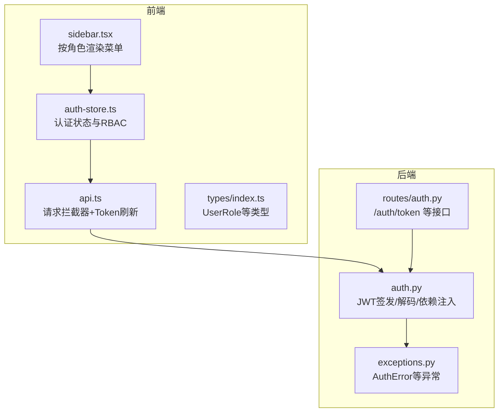
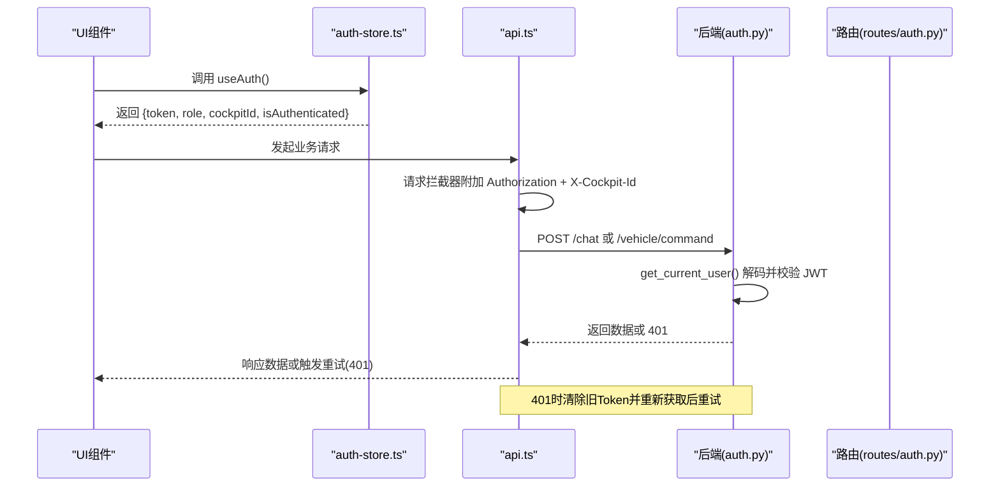
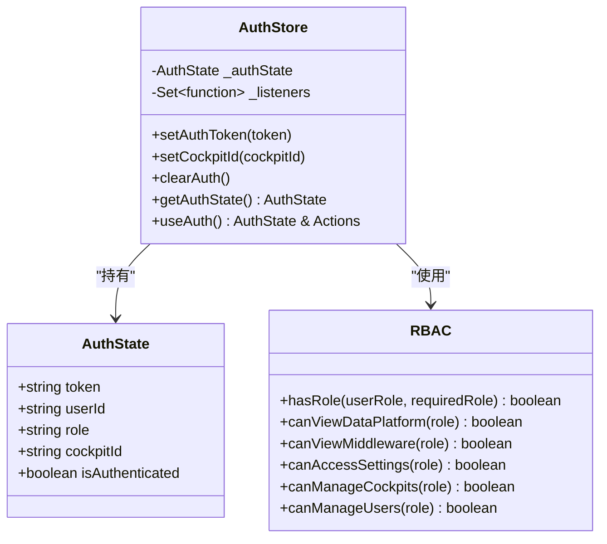
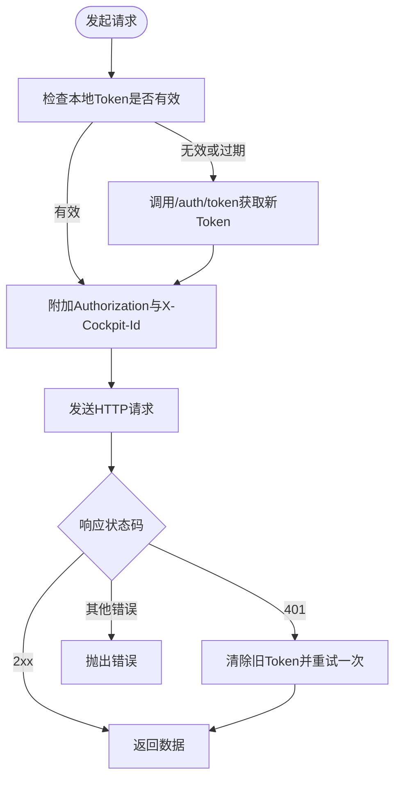
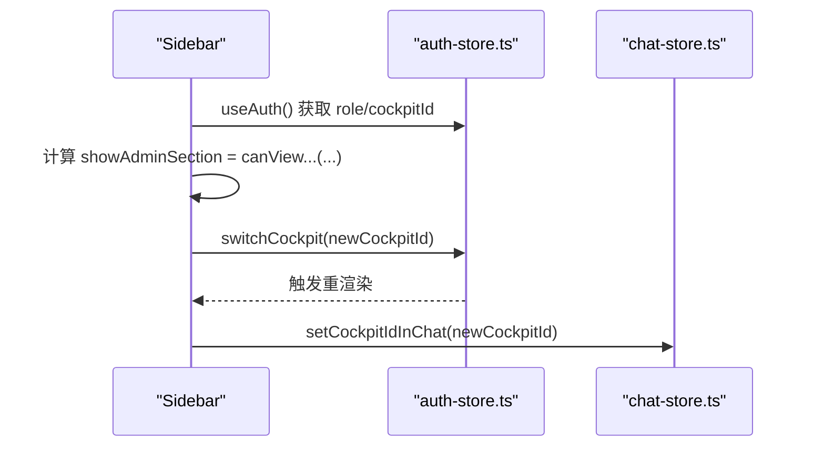
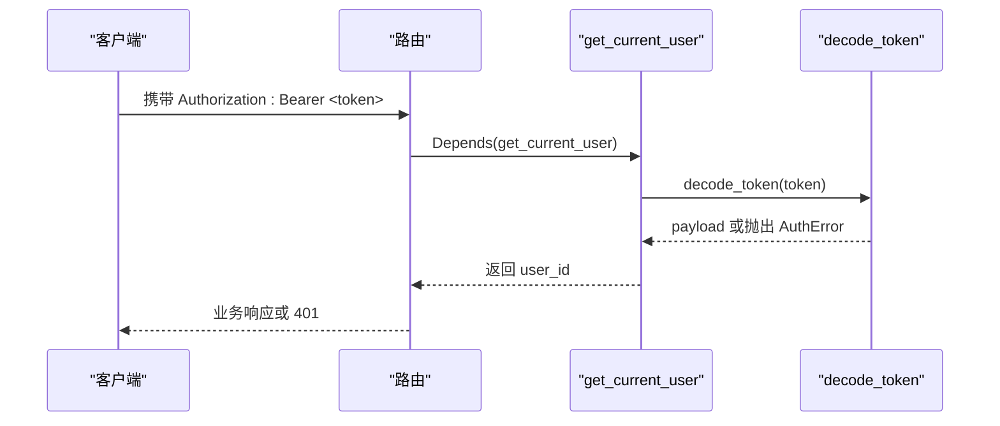
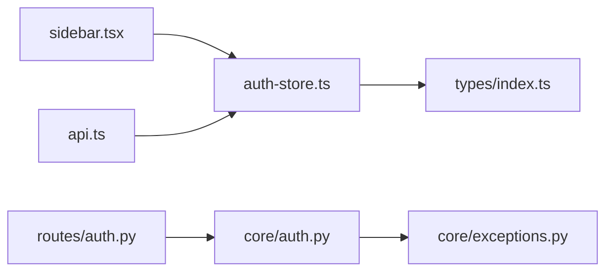

# 认证状态管理

<cite>
**本文引用的文件**   
- [auth-store.ts](file://frontend_design/src/stores/auth-store.ts)
- [index.ts](file://frontend_design/src/types/index.ts)
- [api.ts](file://frontend_design/src/lib/api.ts)
- [sidebar.tsx](file://frontend_design/src/components/layout/sidebar.tsx)
- [auth.py](file://backend_design/nexus/core/auth.py)
- [auth_routes.py](file://backend_design/nexus/api/routes/auth.py)
- [exceptions.py](file://backend_design/nexus/core/exceptions.py)
</cite>

## 目录
1. [简介](#简介)
2. [项目结构](#项目结构)
3. [核心组件](#核心组件)
4. [架构总览](#架构总览)
5. [详细组件分析](#详细组件分析)
6. [依赖关系分析](#依赖关系分析)
7. [性能考量](#性能考量)
8. [故障排查指南](#故障排查指南)
9. [结论](#结论)
10. [附录](#附录)

## 简介
本技术文档围绕 NexusCockpit 的认证状态管理系统展开，重点阐述基于模块级单例的认证状态管理模式、JWT Token 解析与持久化、RBAC 权限控制、座舱切换机制，以及 useAuth Hook 的状态订阅与定时过期检查。同时给出 RBAC 权限检查函数的使用示例与最佳实践，并总结错误处理策略与安全注意事项。

## 项目结构
认证相关的前后端代码分布如下：
- 前端
  - 认证状态与 RBAC：stores/auth-store.ts
  - 类型定义（含 UserRole）：types/index.ts
  - API 客户端与自动鉴权拦截：lib/api.ts
  - 侧边栏菜单按角色渲染：components/layout/sidebar.tsx
- 后端
  - JWT 签发与校验：nexus/core/auth.py
  - 认证接口路由：nexus/api/routes/auth.py
  - 自定义异常体系（含 AuthError）：nexus/core/exceptions.py

**图表来源** 
- [auth-store.ts:1-228](file://frontend_design/src/stores/auth-store.ts#L1-L228)
- [api.ts:1-786](file://frontend_design/src/lib/api.ts#L1-L786)
- [sidebar.tsx:1-430](file://frontend_design/src/components/layout/sidebar.tsx#L1-L430)
- [index.ts:1-277](file://frontend_design/src/types/index.ts#L1-L277)
- [auth.py:1-140](file://backend_design/nexus/core/auth.py#L1-L140)
- [auth_routes.py:1-194](file://backend_design/nexus/api/routes/auth.py#L1-L194)
- [exceptions.py:1-128](file://backend_design/nexus/core/exceptions.py#L1-L128)

**章节来源**
- [auth-store.ts:1-228](file://frontend_design/src/stores/auth-store.ts#L1-L228)
- [api.ts:1-786](file://frontend_design/src/lib/api.ts#L1-L786)
- [sidebar.tsx:1-430](file://frontend_design/src/components/layout/sidebar.tsx#L1-L430)
- [index.ts:1-277](file://frontend_design/src/types/index.ts#L1-L277)
- [auth.py:1-140](file://backend_design/nexus/core/auth.py#L1-L140)
- [auth_routes.py:1-194](file://backend_design/nexus/api/routes/auth.py#L1-L194)
- [exceptions.py:1-128](file://backend_design/nexus/core/exceptions.py#L1-L128)

## 核心组件
- 认证状态模型与默认值
  - AuthState 包含 token、userId、role、cockpitId、isAuthenticated
  - 默认未登录状态 role 为 cockpit_user，cockpitId 默认 cockpit-01
- 模块级单例与监听器
  - 全局 _authState 与 _listeners Set 实现跨组件共享与订阅通知
- JWT 解析与持久化
  - parseToken 从 localStorage 中读取并解析 payload
  - loadAuthFromStorage 负责加载、校验过期、合并 cockpitId 优先级
- useAuth Hook
  - 初始化时同步本地状态，注册监听器，启动每分钟一次的 Token 过期检查
- RBAC 权限函数
  - hasRole 及 canViewDataPlatform/canViewMiddleware/canAccessSettings/canManageCockpits/canManageUsers
- API 客户端集成
  - axios 请求拦截器自动附加 Authorization 与 X-Cockpit-Id
  - 401 自动刷新并重试一次
  - 声纹验证成功后自动保存 Token 并同步到 auth-store

**章节来源**
- [auth-store.ts:1-228](file://frontend_design/src/stores/auth-store.ts#L1-L228)
- [api.ts:1-786](file://frontend_design/src/lib/api.ts#L1-L786)

## 架构总览
下图展示前后端认证流程与数据流：用户通过 /auth/token 获取 JWT；前端将 Token 存入 localStorage 并通过 useAuth 暴露给组件；API 拦截器在每次请求中附加 Token 和 Cockpit-Id；后端通过 FastAPI 依赖 get_current_user 校验 Token 并返回 user_id。

**图表来源** 
- [auth-store.ts:148-185](file://frontend_design/src/stores/auth-store.ts#L148-L185)
- [api.ts:137-175](file://frontend_design/src/lib/api.ts#L137-L175)
- [auth.py:85-122](file://backend_design/nexus/core/auth.py#L85-L122)
- [auth_routes.py:48-77](file://backend_design/nexus/api/routes/auth.py#L48-L77)

## 详细组件分析

### 认证状态与 RBAC（auth-store.ts）
- 设计要点
  - 模块级单例 _authState 保证全局一致性
  - _listeners 集合实现发布-订阅模式，状态变更时通知所有订阅者
  - setAuthToken/setCockpitId/clearAuth 提供统一修改入口
  - loadAuthFromStorage 负责从 localStorage 恢复状态、解析 JWT、处理过期与 cockpitId 优先级
  - useAuth Hook 封装订阅与定时器，确保组件重渲染与 Token 过期检测
- 数据结构复杂度
  - 状态对象为常量大小 O(1)，监听器遍历为 O(n)
- 错误处理
  - parseToken 捕获 JSON/Base64 解析异常，返回 null
  - loadAuthFromStorage 对过期 Token 清理并回退默认状态
- 安全考虑
  - Token 仅存于 localStorage，避免内存泄漏泄露
  - cockpitId 优先采用用户手动选择（localStorage），避免被 Token 覆盖

**图表来源** 
- [auth-store.ts:36-56](file://frontend_design/src/stores/auth-store.ts#L36-L56)
- [auth-store.ts:110-140](file://frontend_design/src/stores/auth-store.ts#L110-L140)
- [auth-store.ts:191-227](file://frontend_design/src/stores/auth-store.ts#L191-L227)

**章节来源**
- [auth-store.ts:1-228](file://frontend_design/src/stores/auth-store.ts#L1-L228)

### API 客户端与自动鉴权（api.ts）
- 自动获取与缓存 Token
  - ensureAuthToken 检查 localStorage 中的 Token，若有效则复用并同步到 auth-store
  - 失败或过期时调用 /auth/token 获取新 Token，并更新 Promise 缓存
- 请求拦截器
  - 自动附加 Authorization 与 X-Cockpit-Id
- 响应拦截器
  - 401 时触发 refreshToken，清除旧 Token 并重试一次
- 流式请求
  - streamMessage 使用原生 fetch + ReadableStream，支持 AbortSignal 取消
- 声纹验证联动
  - verifyVoiceprint 成功后自动保存 Token 并同步到 auth-store

**图表来源** 
- [api.ts:55-103](file://frontend_design/src/lib/api.ts#L55-L103)
- [api.ts:137-175](file://frontend_design/src/lib/api.ts#L137-L175)
- [api.ts:751-777](file://frontend_design/src/lib/api.ts#L751-L777)

**章节来源**
- [api.ts:1-786](file://frontend_design/src/lib/api.ts#L1-L786)

### 侧边栏与 RBAC 渲染（sidebar.tsx）
- 使用 useAuth 获取当前 role、cockpitId、userId、isAuthenticated
- 根据 canViewDataPlatform/canViewMiddleware/canAccessSettings 决定是否显示管理功能区域
- 座舱切换通过 switchCockpit 更新 cockpitId，并与聊天存储同步

**图表来源** 
- [sidebar.tsx:76-90](file://frontend_design/src/components/layout/sidebar.tsx#L76-L90)
- [sidebar.tsx:218-220](file://frontend_design/src/components/layout/sidebar.tsx#L218-L220)
- [sidebar.tsx:274-278](file://frontend_design/src/components/layout/sidebar.tsx#L274-L278)

**章节来源**
- [sidebar.tsx:1-430](file://frontend_design/src/components/layout/sidebar.tsx#L1-L430)

### 后端 JWT 与认证依赖（auth.py）
- create_access_token 签发 JWT，支持 extra_claims（如 role、cockpit_id）
- decode_token 解码并校验，抛出 AuthError（过期或无效）
- get_current_user 作为 FastAPI 依赖，从 Authorization 头提取并校验 Token，返回 user_id
- get_optional_user 可选认证，适用于非强制鉴权的场景

**图表来源** 
- [auth.py:35-61](file://backend_design/nexus/core/auth.py#L35-L61)
- [auth.py:64-83](file://backend_design/nexus/core/auth.py#L64-L83)
- [auth.py:85-122](file://backend_design/nexus/core/auth.py#L85-L122)

**章节来源**
- [auth.py:1-140](file://backend_design/nexus/core/auth.py#L1-L140)

### 认证接口路由（routes/auth.py）
- /auth/token 开发模式下直接签发 Token，附带 role 与 cockpit_id
- /auth/me 用于验证 Token 有效性
- 密码修改与验证码重置接口（开发模式简化逻辑）

**章节来源**
- [auth_routes.py:1-194](file://backend_design/nexus/api/routes/auth.py#L1-L194)

### 类型定义（types/index.ts）
- UserRole 枚举：super_admin、cockpit_admin、cockpit_user、cockpit_viewer
- VoiceprintVerifyResult 包含 access_token 字段，便于声纹验证后自动登录

**章节来源**
- [index.ts:1-277](file://frontend_design/src/types/index.ts#L1-L277)

## 依赖关系分析
- 前端
  - sidebar.tsx 依赖 auth-store.ts 的 useAuth 与 RBAC 函数
  - api.ts 依赖 auth-store.ts 的 setAuthToken/clearAuth 以同步状态
  - auth-store.ts 依赖 types/index.ts 的 UserRole
- 后端
  - routes/auth.py 依赖 core/auth.py 的 create_access_token 与 get_current_user
  - core/auth.py 依赖 core/exceptions.py 的 AuthError

**图表来源** 
- [sidebar.tsx:46-50](file://frontend_design/src/components/layout/sidebar.tsx#L46-L50)
- [api.ts:222-241](file://frontend_design/src/lib/api.ts#L222-L241)
- [auth-store.ts:22-23](file://frontend_design/src/stores/auth-store.ts#L22-L23)
- [auth_routes.py:27-28](file://backend_design/nexus/api/routes/auth.py#L27-L28)
- [auth.py:25-27](file://backend_design/nexus/core/auth.py#L25-L27)

**章节来源**
- [sidebar.tsx:1-430](file://frontend_design/src/components/layout/sidebar.tsx#L1-L430)
- [api.ts:1-786](file://frontend_design/src/lib/api.ts#L1-L786)
- [auth-store.ts:1-228](file://frontend_design/src/stores/auth-store.ts#L1-L228)
- [index.ts:1-277](file://frontend_design/src/types/index.ts#L1-L277)
- [auth_routes.py:1-194](file://backend_design/nexus/api/routes/auth.py#L1-L194)
- [auth.py:1-140](file://backend_design/nexus/core/auth.py#L1-L140)
- [exceptions.py:1-128](file://backend_design/nexus/core/exceptions.py#L1-L128)

## 性能考量
- 模块级单例与监听器
  - 状态更新为 O(1)，通知监听器为 O(n)，建议合理拆分组件以减少监听器数量
- Token 过期检查
  - 每分钟一次轮询，开销较低；可在高频页面减少频率或按需启用
- API 拦截器
  - 使用 Promise 缓存确保并发请求只触发一次 Token 获取，避免重复网络请求
- 流式请求
  - 原生 fetch + ReadableStream 降低内存占用，支持取消操作

[本节为通用指导，不直接分析具体文件]

## 故障排查指南
- 常见错误
  - Token 无效或过期：后端抛出 AuthError，前端 401 自动刷新并重试
  - 解析失败：parseToken 捕获异常返回 null，loadAuthFromStorage 回退默认状态
  - 座舱 ID 不一致：确认 localStorage 中的 cockpitId 与用户选择一致
- 定位步骤
  - 检查浏览器 localStorage 中的 nexus_token 与 nexus_cockpit_id
  - 查看 API 拦截器日志与 401 重试行为
  - 后端日志中搜索 AuthError 与 decode_token 异常信息
- 修复建议
  - 确保 .env.local/.env 配置正确（密钥、过期时间）
  - 生产环境接入真实用户数据库与密码校验
  - 限制敏感接口访问范围，结合 RBAC 控制

**章节来源**
- [auth.py:64-83](file://backend_design/nexus/core/auth.py#L64-L83)
- [exceptions.py:105-110](file://backend_design/nexus/core/exceptions.py#L105-L110)
- [api.ts:153-175](file://frontend_design/src/lib/api.ts#L153-L175)
- [auth-store.ts:59-103](file://frontend_design/src/stores/auth-store.ts#L59-L103)

## 结论
NexusCockpit 的认证状态管理通过模块级单例与监听器模式实现了高效、可订阅的全局状态管理；JWT 在前端解析与持久化，配合 API 拦截器完成自动鉴权与 401 重试；RBAC 权限函数与侧边栏渲染紧密结合，保障不同角色的功能可见性；后端通过 FastAPI 依赖注入实现统一的 Token 校验。整体方案简洁可靠，具备良好的扩展性与安全性。

[本节为总结，不直接分析具体文件]

## 附录
- RBAC 权限检查函数使用示例与最佳实践
  - 在组件中通过 useAuth 获取 role，再调用 hasRole 或专用函数判断权限
  - 推荐在路由守卫与按钮级渲染处双重校验，避免越权
  - 对于敏感操作，应在后端再次校验角色与资源归属
- 安全注意事项
  - Token 仅存储在 localStorage，避免 XSS 风险；必要时考虑 httpOnly Cookie
  - 定期轮换密钥与缩短过期时间，结合刷新机制提升安全性
  - 生产环境务必接入真实用户库与密码校验，禁用开发模式的宽松逻辑

[本节为通用指导，不直接分析具体文件]