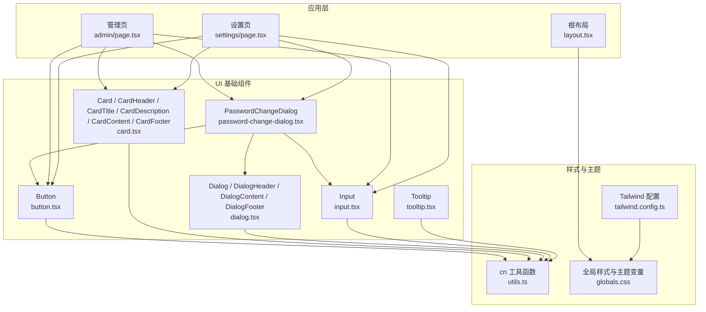
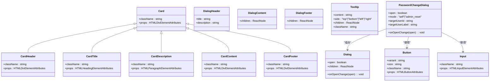
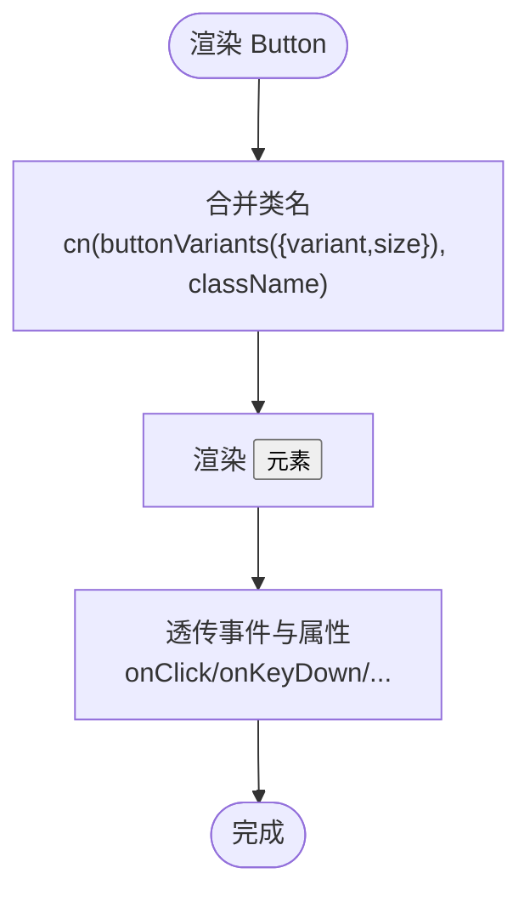
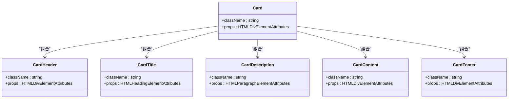
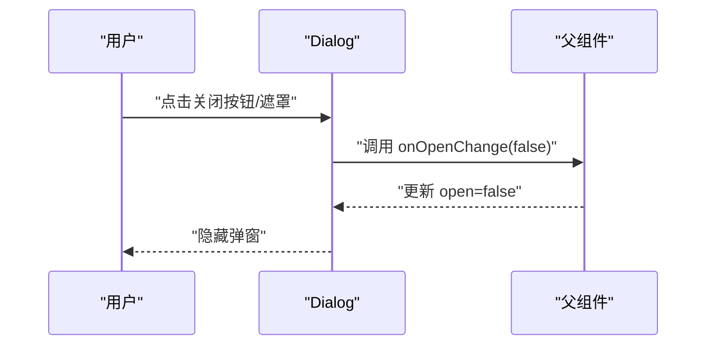
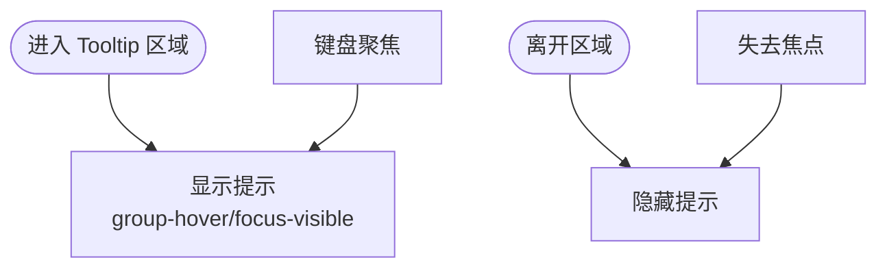
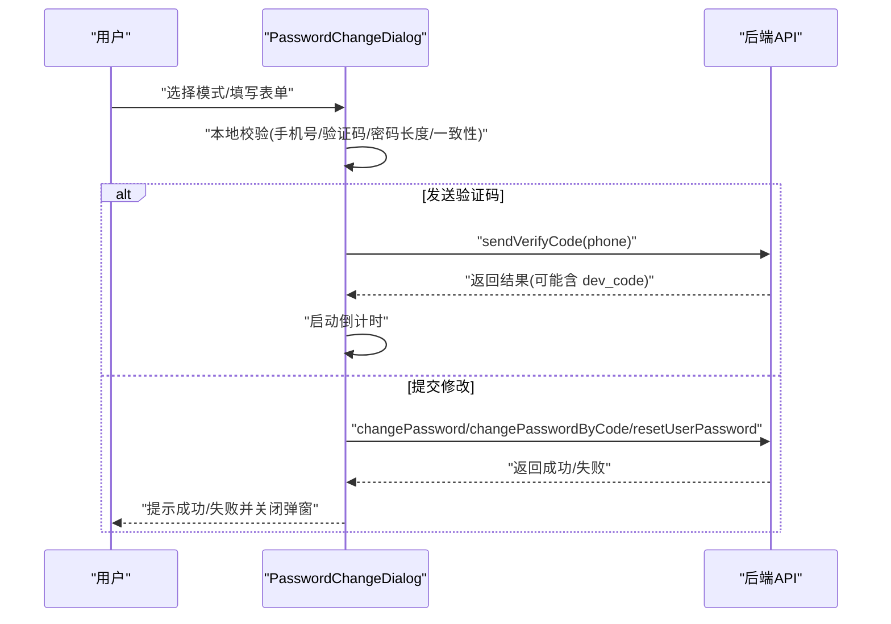
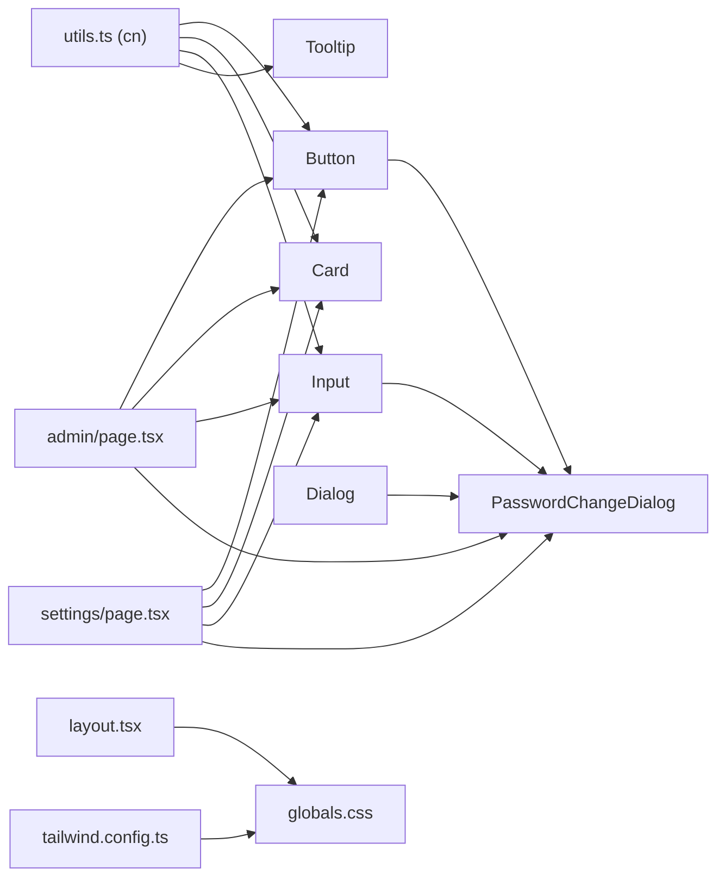

# UI基础组件

<cite>
**本文引用的文件**   
- [button.tsx](file://frontend_design/src/components/ui/button.tsx)
- [card.tsx](file://frontend_design/src/components/ui/card.tsx)
- [dialog.tsx](file://frontend_design/src/components/ui/dialog.tsx)
- [input.tsx](file://frontend_design/src/components/ui/input.tsx)
- [tooltip.tsx](file://frontend_design/src/components/ui/tooltip.tsx)
- [password-change-dialog.tsx](file://frontend_design/src/components/ui/password-change-dialog.tsx)
- [utils.ts](file://frontend_design/src/lib/utils.ts)
- [tailwind.config.ts](file://frontend_design/tailwind.config.ts)
- [globals.css](file://frontend_design/src/app/globals.css)
- [layout.tsx](file://frontend_design/src/app/layout.tsx)
- [admin/page.tsx](file://frontend_design/src/app/admin/page.tsx)
- [settings/page.tsx](file://frontend_design/src/app/settings/page.tsx)
- [package.json](file://frontend_design/package.json)
</cite>

## 目录
1. [简介](#简介)
2. [项目结构](#项目结构)
3. [核心组件](#核心组件)
4. [架构总览](#架构总览)
5. [组件详细分析](#组件详细分析)
6. [依赖关系分析](#依赖关系分析)
7. [性能与可访问性](#性能与可访问性)
8. [故障排查指南](#故障排查指南)
9. [结论](#结论)
10. [附录：使用示例与最佳实践](#附录使用示例与最佳实践)

## 简介
本技术文档聚焦 NexusCockpit 前端 UI 基础组件系统，系统性阐述按钮、卡片、对话框、输入框、工具提示等基础组件的设计原则、Props 接口、事件处理机制、样式定制与主题支持，并覆盖可访问性、响应式设计与性能优化策略。同时提供实际页面中的组合使用示例与扩展建议，帮助开发者快速上手与二次开发。

## 项目结构
UI 基础组件位于 frontend_design/src/components/ui 目录下，采用“原子化 + 组合”的组件组织方式：每个基础组件独立文件，通过统一的样式工具函数 cn 与 Tailwind 主题变量实现一致的视觉风格与主题能力。全局样式与主题色由 globals.css 定义，Tailwind 配置在 tailwind.config.ts 中扩展颜色与动画。根布局 layout.tsx 注入全局 Toast 容器与侧边栏等公共结构。

**图表来源** 
- [button.tsx:1-55](file://frontend_design/src/components/ui/button.tsx#L1-L55)
- [card.tsx:1-92](file://frontend_design/src/components/ui/card.tsx#L1-L92)
- [dialog.tsx:1-59](file://frontend_design/src/components/ui/dialog.tsx#L1-L59)
- [input.tsx:1-26](file://frontend_design/src/components/ui/input.tsx#L1-L26)
- [tooltip.tsx:1-65](file://frontend_design/src/components/ui/tooltip.tsx#L1-L65)
- [password-change-dialog.tsx:1-383](file://frontend_design/src/components/ui/password-change-dialog.tsx#L1-L383)
- [utils.ts:1-56](file://frontend_design/src/lib/utils.ts#L1-L56)
- [tailwind.config.ts:1-55](file://frontend_design/tailwind.config.ts#L1-L55)
- [globals.css:1-74](file://frontend_design/src/app/globals.css#L1-L74)
- [layout.tsx:1-55](file://frontend_design/src/app/layout.tsx#L1-L55)
- [admin/page.tsx:1-555](file://frontend_design/src/app/admin/page.tsx#L1-L555)
- [settings/page.tsx:1-428](file://frontend_design/src/app/settings/page.tsx#L1-L428)

**章节来源**
- [layout.tsx:1-55](file://frontend_design/src/app/layout.tsx#L1-L55)
- [tailwind.config.ts:1-55](file://frontend_design/tailwind.config.ts#L1-L55)
- [globals.css:1-74](file://frontend_design/src/app/globals.css#L1-L74)

## 核心组件
- Button：基于 class-variance-authority 的变体与尺寸控制，统一焦点环与禁用态，支持透传原生按钮属性。
- Card：语义化分块（Header/Title/Description/Content/Footer），便于信息分组展示。
- Dialog：轻量可控弹窗，支持 open/onOpenChange 受控模式，内置关闭按钮与遮罩点击拦截。
- Input：标准输入控件，包含占位符、禁用态、焦点环等通用样式。
- Tooltip：纯 CSS 悬停提示，支持 top/bottom/left/right 四向定位，无外部依赖。
- PasswordChangeDialog：业务级复合弹窗，支持旧密码验证与手机验证码两种模式，集成表单校验与异步提交。

**章节来源**
- [button.tsx:1-55](file://frontend_design/src/components/ui/button.tsx#L1-L55)
- [card.tsx:1-92](file://frontend_design/src/components/ui/card.tsx#L1-L92)
- [dialog.tsx:1-59](file://frontend_design/src/components/ui/dialog.tsx#L1-L59)
- [input.tsx:1-26](file://frontend_design/src/components/ui/input.tsx#L1-L26)
- [tooltip.tsx:1-65](file://frontend_design/src/components/ui/tooltip.tsx#L1-L65)
- [password-change-dialog.tsx:1-383](file://frontend_design/src/components/ui/password-change-dialog.tsx#L1-L383)

## 架构总览
UI 基础组件遵循“样式解耦 + 主题变量 + 组合复用”的架构理念：
- 样式层：Tailwind 类名 + 自定义 CSS 变量，通过 cn 合并避免冲突。
- 组件层：原子组件（Button/Input/Tooltip）与复合组件（Card/Dialog/PasswordChangeDialog）。
- 应用层：页面通过组合原子与复合组件构建业务界面，并通过状态与回调驱动交互。

**图表来源** 
- [button.tsx:1-55](file://frontend_design/src/components/ui/button.tsx#L1-L55)
- [card.tsx:1-92](file://frontend_design/src/components/ui/card.tsx#L1-L92)
- [dialog.tsx:1-59](file://frontend_design/src/components/ui/dialog.tsx#L1-L59)
- [input.tsx:1-26](file://frontend_design/src/components/ui/input.tsx#L1-L26)
- [tooltip.tsx:1-65](file://frontend_design/src/components/ui/tooltip.tsx#L1-L65)
- [password-change-dialog.tsx:1-383](file://frontend_design/src/components/ui/password-change-dialog.tsx#L1-L383)

## 组件详细分析

### Button 组件
- 设计原则：通过 cva 定义 variant 与 size 变体，确保类型安全与一致性；默认提供 default/secondary/ghost/destructive/outilne 五种变体与 sm/md/lg/icon 四种尺寸。
- Props 接口：继承 React.ButtonHTMLAttributes<HTMLButtonElement>，并叠加 VariantProps<typeof buttonVariants>，支持 className 与所有原生按钮属性透传。
- 事件处理：完全透传 onClick 等事件，适合封装业务逻辑。
- 样式定制：通过 cn 合并 Tailwind 类名，支持覆盖默认样式；焦点环与禁用态符合无障碍要求。
- 主题支持：颜色来自 Tailwind 变量（primary/secondary/accent 等），可通过 globals.css 与 tailwind.config.ts 调整。

**图表来源** 
- [button.tsx:1-55](file://frontend_design/src/components/ui/button.tsx#L1-L55)

**章节来源**
- [button.tsx:1-55](file://frontend_design/src/components/ui/button.tsx#L1-L55)
- [utils.ts:1-56](file://frontend_design/src/lib/utils.ts#L1-L56)
- [tailwind.config.ts:1-55](file://frontend_design/tailwind.config.ts#L1-L55)
- [globals.css:1-74](file://frontend_design/src/app/globals.css#L1-L74)

### Card 组件族
- 设计原则：将卡片拆分为 Header/Title/Description/Content/Footer，便于灵活组合与信息分层。
- Props 接口：各子组件均接受 className 与对应 HTML 元素的属性，保持语义化标签（h3/p/div）。
- 事件处理：作为容器组件，不绑定业务事件，仅透传原生属性。
- 样式定制：通过 cn 合并类名，默认圆角、边框、阴影与间距，适配暗色主题。
- 主题支持：颜色与边框均来自主题变量（card/card-foreground/muted-foreground 等）。

**图表来源** 
- [card.tsx:1-92](file://frontend_design/src/components/ui/card.tsx#L1-L92)

**章节来源**
- [card.tsx:1-92](file://frontend_design/src/components/ui/card.tsx#L1-L92)
- [utils.ts:1-56](file://frontend_design/src/lib/utils.ts#L1-L56)
- [globals.css:1-74](file://frontend_design/src/app/globals.css#L1-L74)

### Dialog 组件族
- 设计原则：受控弹窗（open/onOpenChange），遮罩背景与居中布局，右上角关闭按钮，阻止冒泡避免误触关闭。
- Props 接口：Dialog 暴露 open 与 onOpenChange；DialogHeader/DialogContent/DialogFooter 为布局容器。
- 事件处理：点击遮罩或关闭按钮触发 onOpenChange(false)。
- 样式定制：通过 cn 合并类名，支持自定义宽度、内边距与背景透明度。
- 主题支持：背景与文字颜色使用 card/card-foreground/muted-foreground 等变量。

**图表来源** 
- [dialog.tsx:1-59](file://frontend_design/src/components/ui/dialog.tsx#L1-L59)

**章节来源**
- [dialog.tsx:1-59](file://frontend_design/src/components/ui/dialog.tsx#L1-L59)
- [utils.ts:1-56](file://frontend_design/src/lib/utils.ts#L1-L56)
- [globals.css:1-74](file://frontend_design/src/app/globals.css#L1-L74)

### Input 组件
- 设计原则：标准化输入控件，包含占位符、禁用态、焦点环与边框样式。
- Props 接口：继承 React.InputHTMLAttributes<HTMLInputElement>，支持所有原生输入属性。
- 事件处理：透传 onChange/onFocus/onBlur 等事件，便于表单集成。
- 样式定制：通过 cn 合并类名，支持覆盖默认样式。
- 主题支持：颜色与边框来自 input/background/muted-foreground/ring 等变量。

**章节来源**
- [input.tsx:1-26](file://frontend_design/src/components/ui/input.tsx#L1-L26)
- [utils.ts:1-56](file://frontend_design/src/lib/utils.ts#L1-L56)
- [globals.css:1-74](file://frontend_design/src/app/globals.css#L1-L74)

### Tooltip 组件
- 设计原则：纯 CSS 实现，无外部依赖；通过 group/group-hover 与绝对定位实现四向提示。
- Props 接口：content、side（top/bottom/left/right）、children、className。
- 事件处理：鼠标悬停或键盘聚焦时显示提示，支持 focus-visible 提升可访问性。
- 样式定制：通过 cn 合并类名，支持自定义方向与位置偏移。
- 主题支持：背景与边框使用 card/card-foreground/border 等变量。

**图表来源** 
- [tooltip.tsx:1-65](file://frontend_design/src/components/ui/tooltip.tsx#L1-L65)

**章节来源**
- [tooltip.tsx:1-65](file://frontend_design/src/components/ui/tooltip.tsx#L1-L65)
- [utils.ts:1-56](file://frontend_design/src/lib/utils.ts#L1-L56)
- [globals.css:1-74](file://frontend_design/src/app/globals.css#L1-L74)

### PasswordChangeDialog 组件
- 设计原则：业务级复合弹窗，支持“旧密码验证”和“手机验证码”两种模式；Tab 切换交互，表单校验与倒计时。
- Props 接口：open、onOpenChange、mode（self/admin_reset）、targetUserId、targetUserLabel。
- 事件处理：发送验证码、提交修改、取消关闭；内部维护 tab、countdown、submitting 等状态。
- 样式定制：使用 Card/Button/Input 组合，结合 Tailwind 类名与主题变量。
- 主题支持：沿用全局主题变量，保证一致视觉体验。

**图表来源** 
- [password-change-dialog.tsx:1-383](file://frontend_design/src/components/ui/password-change-dialog.tsx#L1-L383)

**章节来源**
- [password-change-dialog.tsx:1-383](file://frontend_design/src/components/ui/password-change-dialog.tsx#L1-L383)
- [dialog.tsx:1-59](file://frontend_design/src/components/ui/dialog.tsx#L1-L59)
- [button.tsx:1-55](file://frontend_design/src/components/ui/button.tsx#L1-L55)
- [input.tsx:1-26](file://frontend_design/src/components/ui/input.tsx#L1-L26)
- [globals.css:1-74](file://frontend_design/src/app/globals.css#L1-L74)

## 依赖关系分析
- 组件依赖：
  - Button/Card/Input/Tooltip 依赖 utils.ts 的 cn 进行类名合并。
  - PasswordChangeDialog 组合 Dialog/Button/Input，并调用 API（通过 @/lib/api）。
- 样式依赖：
  - 所有组件通过 Tailwind 类名与 globals.css 的主题变量实现主题化。
  - tailwind.config.ts 扩展颜色、圆角与动画，增强视觉一致性。
- 应用依赖：
  - admin/page.tsx 与 settings/page.tsx 广泛使用 Button/Card/Input/PasswordChangeDialog 构建管理界面与个人设置。
  - layout.tsx 注入 Toaster 容器，使 toast.success/error() 全局可用。

**图表来源** 
- [utils.ts:1-56](file://frontend_design/src/lib/utils.ts#L1-L56)
- [button.tsx:1-55](file://frontend_design/src/components/ui/button.tsx#L1-L55)
- [card.tsx:1-92](file://frontend_design/src/components/ui/card.tsx#L1-L92)
- [input.tsx:1-26](file://frontend_design/src/components/ui/input.tsx#L1-L26)
- [tooltip.tsx:1-65](file://frontend_design/src/components/ui/tooltip.tsx#L1-L65)
- [dialog.tsx:1-59](file://frontend_design/src/components/ui/dialog.tsx#L1-L59)
- [password-change-dialog.tsx:1-383](file://frontend_design/src/components/ui/password-change-dialog.tsx#L1-L383)
- [admin/page.tsx:1-555](file://frontend_design/src/app/admin/page.tsx#L1-L555)
- [settings/page.tsx:1-428](file://frontend_design/src/app/settings/page.tsx#L1-L428)
- [layout.tsx:1-55](file://frontend_design/src/app/layout.tsx#L1-L55)
- [globals.css:1-74](file://frontend_design/src/app/globals.css#L1-L74)
- [tailwind.config.ts:1-55](file://frontend_design/tailwind.config.ts#L1-L55)

**章节来源**
- [package.json:1-43](file://frontend_design/package.json#L1-L43)

## 性能与可访问性
- 性能优化策略
  - 类名合并：使用 cn 合并 Tailwind 类名，减少冲突与重复计算。
  - 条件渲染：Dialog 在未打开时直接返回 null，避免不必要的 DOM 节点。
  - 最小重绘：组件仅传递必要 props，避免过度渲染。
  - 动画与过渡：使用 Tailwind 内置 transition 与 keyframes，避免复杂 JS 动画。
- 可访问性实现
  - 焦点管理：Button/Input 提供 focus-visible 样式，确保键盘导航可见性。
  - 语义化标签：CardTitle 使用 h3，CardDescription 使用 p，提升屏幕阅读器可读性。
  - 提示与反馈：Tooltip 支持 focus-visible 显示，PasswordChangeDialog 使用 toast 提供操作反馈。
  - 无障碍属性：Tooltip 使用 role="tooltip"，明确提示语义。
- 响应式设计
  - 使用 Tailwind 的栅格与间距（如 grid-cols-*、gap-*、p-*）适配不同屏幕尺寸。
  - 组件默认样式在小屏下仍保持可用性（如 Input 全宽、Dialog 居中且最大宽度限制）。

[本节为通用指导，不直接分析具体文件]

## 故障排查指南
- 样式未生效
  - 检查 cn 是否正确合并类名，确认 Tailwind 扫描路径包含组件目录。
  - 确认 globals.css 已引入并在 layout.tsx 中加载。
- 主题颜色不一致
  - 核对 tailwind.config.ts 的颜色映射与 globals.css 的 CSS 变量是否匹配。
- 弹窗无法关闭
  - 检查 open/onOpenChange 受控状态是否正确更新，确认遮罩点击与关闭按钮事件未被阻止。
- 表单校验失败
  - 检查 PasswordChangeDialog 的本地校验逻辑（手机号格式、验证码位数、密码长度与一致性）。
- Toast 未显示
  - 确认 layout.tsx 中已注入 Toaster 容器，且 theme 与 position 配置正确。

**章节来源**
- [layout.tsx:1-55](file://frontend_design/src/app/layout.tsx#L1-L55)
- [password-change-dialog.tsx:1-383](file://frontend_design/src/components/ui/password-change-dialog.tsx#L1-L383)
- [dialog.tsx:1-59](file://frontend_design/src/components/ui/dialog.tsx#L1-L59)
- [utils.ts:1-56](file://frontend_design/src/lib/utils.ts#L1-L56)
- [tailwind.config.ts:1-55](file://frontend_design/tailwind.config.ts#L1-L55)
- [globals.css:1-74](file://frontend_design/src/app/globals.css#L1-L74)

## 结论
NexusCockpit 的 UI 基础组件系统以原子化与组合为核心，借助 Tailwind 与 CSS 变量实现主题化与样式解耦。Button、Card、Dialog、Input、Tooltip 提供了稳定可靠的交互与视觉基础，PasswordChangeDialog 展示了复合组件的最佳实践。通过统一的样式工具与可访问性设计，系统在易用性、可维护性与性能方面达到良好平衡。

[本节为总结，不直接分析具体文件]

## 附录：使用示例与最佳实践
- 正确使用基础组件
  - 按钮：通过 variant 与 size 控制外观，透传 onClick 处理业务逻辑。
  - 卡片：使用 CardHeader/CardTitle/CardDescription/CardContent/CardFooter 组织内容层次。
  - 对话框：使用 open/onOpenChange 受控模式，避免状态不一致。
  - 输入框：结合 onChange 与校验逻辑，提供即时反馈。
  - 工具提示：用 Tooltip 包裹需要说明的元素，提升用户体验。
- 组合使用示例
  - 管理页（admin/page.tsx）：使用 Card 展示数据列表，Button 触发操作，Input 收集表单数据，PasswordChangeDialog 处理密码重置。
  - 设置页（settings/page.tsx）：使用 Card 分组个人信息与声纹管理，Button 触发登录/退出，PasswordChangeDialog 用于修改密码。
- 自定义样式与主题
  - 通过 cn 合并自定义类名，覆盖默认样式。
  - 在 globals.css 中调整 CSS 变量，或在 tailwind.config.ts 中扩展颜色与动画。
- 最佳实践
  - 保持组件职责单一，复杂交互通过组合实现。
  - 使用受控模式管理弹窗与表单状态。
  - 利用 toast 提供清晰的用户反馈。
  - 关注可访问性与键盘导航，确保所有交互均可被辅助技术识别。

**章节来源**
- [admin/page.tsx:1-555](file://frontend_design/src/app/admin/page.tsx#L1-L555)
- [settings/page.tsx:1-428](file://frontend_design/src/app/settings/page.tsx#L1-L428)
- [button.tsx:1-55](file://frontend_design/src/components/ui/button.tsx#L1-L55)
- [card.tsx:1-92](file://frontend_design/src/components/ui/card.tsx#L1-L92)
- [dialog.tsx:1-59](file://frontend_design/src/components/ui/dialog.tsx#L1-L59)
- [input.tsx:1-26](file://frontend_design/src/components/ui/input.tsx#L1-L26)
- [tooltip.tsx:1-65](file://frontend_design/src/components/ui/tooltip.tsx#L1-L65)
- [password-change-dialog.tsx:1-383](file://frontend_design/src/components/ui/password-change-dialog.tsx#L1-L383)
- [utils.ts:1-56](file://frontend_design/src/lib/utils.ts#L1-L56)
- [tailwind.config.ts:1-55](file://frontend_design/tailwind.config.ts#L1-L55)
- [globals.css:1-74](file://frontend_design/src/app/globals.css#L1-L74)
- [layout.tsx:1-55](file://frontend_design/src/app/layout.tsx#L1-L55)