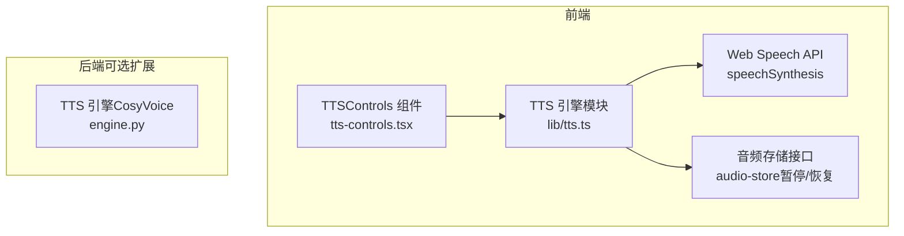
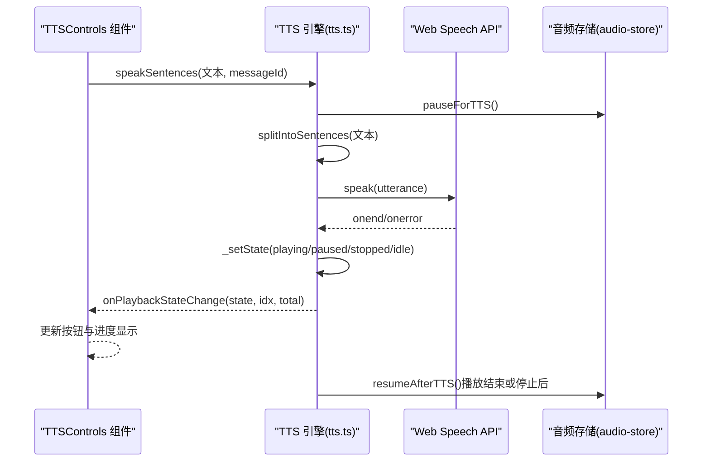
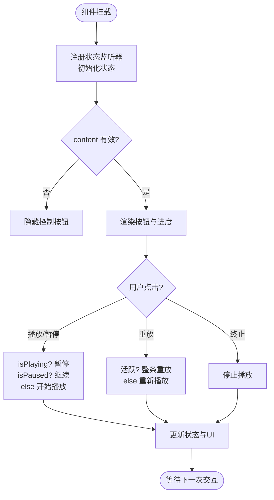
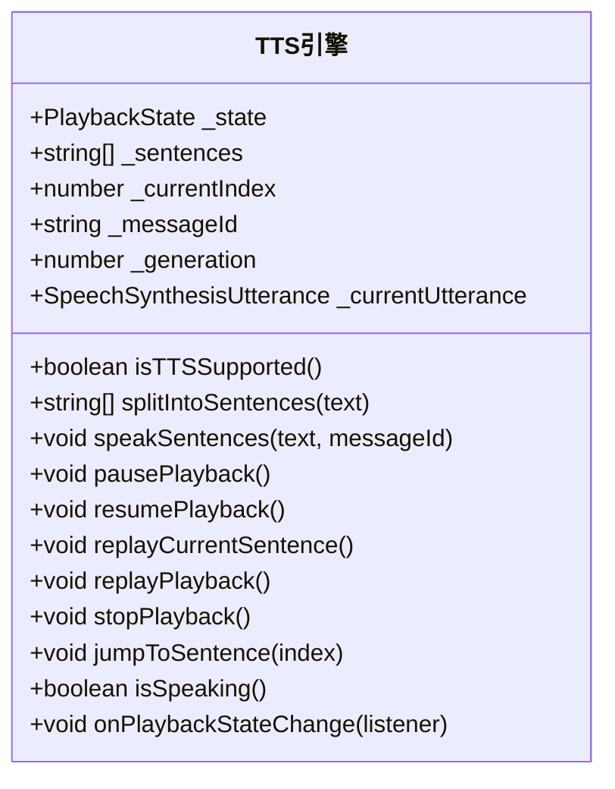
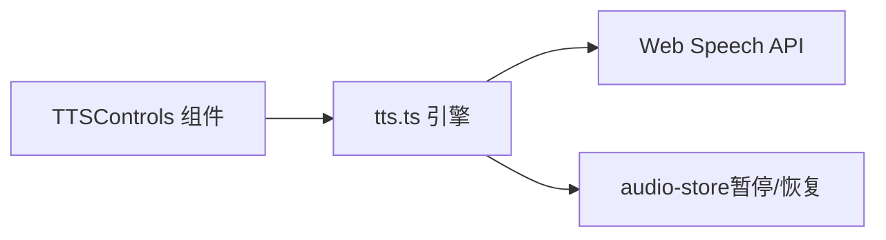

# TTS控制组件

<cite>
**本文引用的文件**   
- [tts-controls.tsx](file://frontend_design/src/components/chat/tts-controls.tsx)
- [tts.ts](file://frontend_design/src/lib/tts.ts)
- [engine.py](file://backend_design/nexus/tts/engine.py)
</cite>

## 目录
1. [简介](#简介)
2. [项目结构](#项目结构)
3. [核心组件](#核心组件)
4. [架构总览](#架构总览)
5. [详细组件分析](#详细组件分析)
6. [依赖关系分析](#依赖关系分析)
7. [性能考量](#性能考量)
8. [故障排查指南](#故障排查指南)
9. [结论](#结论)
10. [附录：集成与使用示例](#附录集成与使用示例)

## 简介
本技术文档围绕 NexusCockpit 前端的 TTS 控制组件展开，系统性说明 TTSControls 组件的功能实现、播放状态管理、音频队列处理、错误处理机制，以及与浏览器 Web Speech API 的集成方式。文档还涵盖与座舱音乐系统的联动（暂停/恢复）、播放中断与恢复逻辑、进度跟踪、以及可扩展的高级功能（如音量、语速等）的设计建议。同时提供后端 TTS 引擎（CosyVoice）的集成要点，便于在需要离线或高质量语音合成时扩展方案。

## 项目结构
前端 TTS 控制由两部分组成：
- 组件层：TTSControls 组件负责 UI 交互与状态展示
- 引擎层：tts.ts 模块封装 Web Speech API，提供分句播放、全局状态机、保活机制、与音乐系统联动等能力

图表来源 
- [tts-controls.tsx:1-178](file://frontend_design/src/components/chat/tts-controls.tsx#L1-L178)
- [tts.ts:1-443](file://frontend_design/src/lib/tts.ts#L1-L443)
- [engine.py:1-116](file://backend_design/nexus/tts/engine.py#L1-L116)

章节来源
- [tts-controls.tsx:1-178](file://frontend_design/src/components/chat/tts-controls.tsx#L1-L178)
- [tts.ts:1-443](file://frontend_design/src/lib/tts.ts#L1-L443)

## 核心组件
- TTSControls 组件
  - 职责：为每条 AI 消息提供播放/暂停、重放、终止按钮；显示当前播放进度与状态；仅对活跃消息高亮。
  - 关键行为：通过 onPlaybackStateChange 订阅全局状态变化；根据 messageId 判断是否活跃；调用 speakSentences/pausePlayback/resumePlayback/replayPlayback/stopPlayback 等 API。
- tts.ts 模块
  - 职责：维护全局播放状态机（idle/playing/paused/stopped），按标点智能分句逐句播报；实现 Chrome 保活机制；与音频存储联动实现音乐暂停/恢复；暴露统一 API 供组件调用。

章节来源
- [tts-controls.tsx:1-178](file://frontend_design/src/components/chat/tts-controls.tsx#L1-L178)
- [tts.ts:1-443](file://frontend_design/src/lib/tts.ts#L1-L443)

## 架构总览
TTS 控制采用“组件 + 引擎”的分层设计：
- 组件层只关注 UI 与用户操作，不直接操作底层播放细节
- 引擎层集中管理播放状态、句子队列、事件回调、保活定时器、与外部音频系统的协作
- 通过全局监听器将状态变更推送到所有订阅的组件，保证多消息场景下的一致性

图表来源 
- [tts-controls.tsx:1-178](file://frontend_design/src/components/chat/tts-controls.tsx#L1-L178)
- [tts.ts:1-443](file://frontend_design/src/lib/tts.ts#L1-L443)

## 详细组件分析

### TTSControls 组件
- 输入属性
  - messageId：关联的消息 ID，用于确定活跃播放消息
  - content：消息文本内容，作为 TTS 输入
  - loading：加载状态，加载中隐藏控制按钮
- 内部状态
  - playbackState：当前播放状态（idle/playing/paused/stopped）
  - currentIndex/total：当前播放句索引与总数
  - activeMessageId：当前活跃消息 ID
- 交互流程
  - 首次挂载时注册 onPlaybackStateChange 监听器并初始化状态
  - 播放/暂停：根据 isPlaying/isPaused 决定调用 pausePlayback 或 resumePlayback；否则调用 speakSentences
  - 重放：若为活跃消息则 replayPlayback，否则重新 speakSentences
  - 终止：调用 stopPlayback
- 渲染逻辑
  - 非活跃或非播放状态仅显示播放按钮
  - 活跃且正在播放/暂停时显示重放与终止按钮
  - 当 total > 1 时显示进度 “当前句/总数”
  - 播放中显示“播放中”，暂停显示“已暂停”

图表来源 
- [tts-controls.tsx:1-178](file://frontend_design/src/components/chat/tts-controls.tsx#L1-L178)

章节来源
- [tts-controls.tsx:1-178](file://frontend_design/src/components/chat/tts-controls.tsx#L1-L178)

### TTS 引擎模块（tts.ts）
- 类型与状态
  - PlaybackState：idle/playing/paused/stopped
  - 全局变量：_state、_sentences、_currentIndex、_messageId、_generation、_currentUtterance、_keepAliveTimer
- 核心能力
  - 分句：splitIntoSentences 清理 Markdown 并按中文/英文句子级标点切分，保留标点，过滤空句
  - 播放：_playSentence 创建 utterance，设置语言、语速、音高、音量，选择中文语音；绑定 onend/onerror 回调，代际检查防止旧回调干扰
  - 保活：_startKeepAlive 每 10 秒执行 pause→resume，避免 Chrome 长时间播放事件丢失
  - 状态机：_setState 统一更新状态并通知监听器
  - 公共 API：speakSentences、pausePlayback、resumePlayback、replayCurrentSentence、replayPlayback、stopPlayback、jumpToSentence、isSpeaking 等
  - 音乐联动：speakSentences 开始时 pauseForTTS，结束或停止时 resumeAfterTTS
- 错误处理
  - onerror 记录警告并跳过当前句继续下一句
  - 代际计数器确保旧 utterance 回调被丢弃，避免竞态
  - 支持跳转与单句重放，增强容错与用户体验

图表来源 
- [tts.ts:1-443](file://frontend_design/src/lib/tts.ts#L1-L443)

章节来源
- [tts.ts:1-443](file://frontend_design/src/lib/tts.ts#L1-L443)

### 后端 TTS 引擎（engine.py）
- 职责：封装 CosyVoice 模型，提供 load/synthesize 接口，返回音频文件路径
- 特性：支持指定说话人或零样本推理；保存 WAV；失败返回 None 并记录日志
- 适用场景：需要离线或高质量语音合成时，可将 tts.ts 的 Web Speech API 替换为后端流式音频播放（需前端新增音频播放器与流式接收逻辑）

章节来源
- [engine.py:1-116](file://backend_design/nexus/tts/engine.py#L1-L116)

## 依赖关系分析
- 组件依赖
  - TTSControls 依赖 tts.ts 提供的 API 与状态监听
  - tts.ts 依赖 Web Speech API 与 audio-store 的暂停/恢复接口
- 耦合与内聚
  - 组件层低耦合，仅处理 UI 与用户交互
  - 引擎层高内聚，集中管理播放状态、队列、事件、保活、音乐联动
- 潜在循环依赖
  - 无直接循环依赖；tts.ts 与 audio-store 为单向依赖

图表来源 
- [tts-controls.tsx:1-178](file://frontend_design/src/components/chat/tts-controls.tsx#L1-L178)
- [tts.ts:1-443](file://frontend_design/src/lib/tts.ts#L1-L443)

章节来源
- [tts-controls.tsx:1-178](file://frontend_design/src/components/chat/tts-controls.tsx#L1-L178)
- [tts.ts:1-443](file://frontend_design/src/lib/tts.ts#L1-L443)

## 性能考量
- 分句策略
  - 按句子级标点切分，减少单次播放长度，提升响应性与可中断性
- 保活机制
  - 每 10 秒触发一次 pause→resume，避免 Chrome 长时间播放事件丢失导致卡死
- 代际计数器
  - 每次新播放递增 generation，旧回调自动丢弃，避免竞态与内存泄漏
- 资源释放
  - 停止或结束时及时 cancel 与清理定时器，释放 utterance 引用
- 扩展建议
  - 如需更高音质或离线能力，可接入后端 engine.py，并在前端引入流式音频播放器（如 MediaSource API），同时保持状态机与队列逻辑不变

[本节为通用指导，无需具体文件引用]

## 故障排查指南
- 常见问题
  - 播放无声音：检查 isTTSSupported 是否为真；确认浏览器支持 speechSynthesis
  - 播放中途卡住：检查保活定时器是否运行；查看 onerror 是否频繁触发
  - 状态不同步：确认 onPlaybackStateChange 是否正确注册与注销；检查代际计数是否递增
  - 音乐未恢复：确认 pauseForTTS 与 resumeAfterTTS 成对调用；检查是否在异常路径遗漏恢复
- 定位方法
  - 在 tts.ts 的 onerror 回调中打印错误信息
  - 在 _setState 前后打印状态变化，观察 UI 更新是否符合预期
  - 使用浏览器开发者工具监控 speechSynthesis 的状态与事件

章节来源
- [tts.ts:1-443](file://frontend_design/src/lib/tts.ts#L1-L443)

## 结论
TTSControls 与 tts.ts 共同构成了一个健壮、易用的前端 TTS 控制方案。通过分句播放、全局状态机、保活机制与音乐联动，实现了流畅的用户体验与良好的错误处理能力。未来可在需要时平滑扩展到后端引擎，保持现有状态机与队列逻辑不变，从而兼顾在线与离线场景。

[本节为总结，无需具体文件引用]

## 附录：集成与使用示例
- 基本用法
  - 在聊天消息渲染处引入 TTSControls，传入 messageId 与 content
  - 在收到 Reviewer 终审通过的文本后调用 speakSentences
- 配置选项
  - 语速与音高：可在 tts.ts 的 _createUtterance 中调整 rate 与 pitch
  - 音量：可在 _createUtterance 中调整 volume（默认 0.8）
  - 语言：默认 zh-CN，可按需切换
- 事件监听
  - 使用 onPlaybackStateChange 订阅状态变化，自行扩展 UI 或业务逻辑
- 自定义样式
  - 通过 Button 的 variant、className 等属性定制外观
- 与其他语音组件协作
  - 与座舱音乐系统通过 pauseForTTS/resumeAfterTTS 协同，确保朗读期间音乐暂停、结束后恢复
- 最佳实践
  - 仅在已校验文本上调用 speakSentences，避免未审核内容进入播放
  - 合理处理错误与中断，保证用户体验一致
  - 在多消息场景中，利用 messageId 区分活跃播放消息，避免状态冲突

章节来源
- [tts-controls.tsx:1-178](file://frontend_design/src/components/chat/tts-controls.tsx#L1-L178)
- [tts.ts:1-443](file://frontend_design/src/lib/tts.ts#L1-L443)
- [engine.py:1-116](file://backend_design/nexus/tts/engine.py#L1-L116)