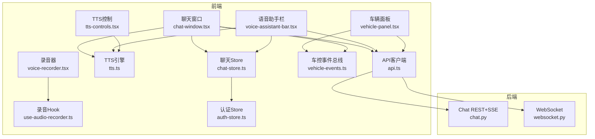
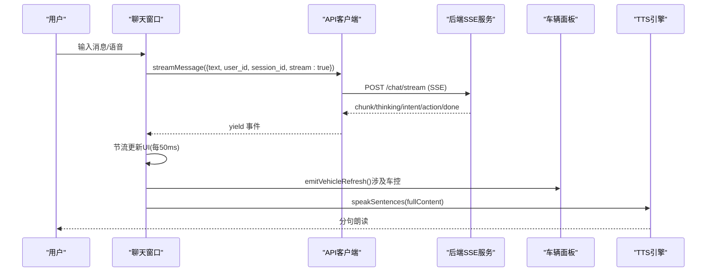
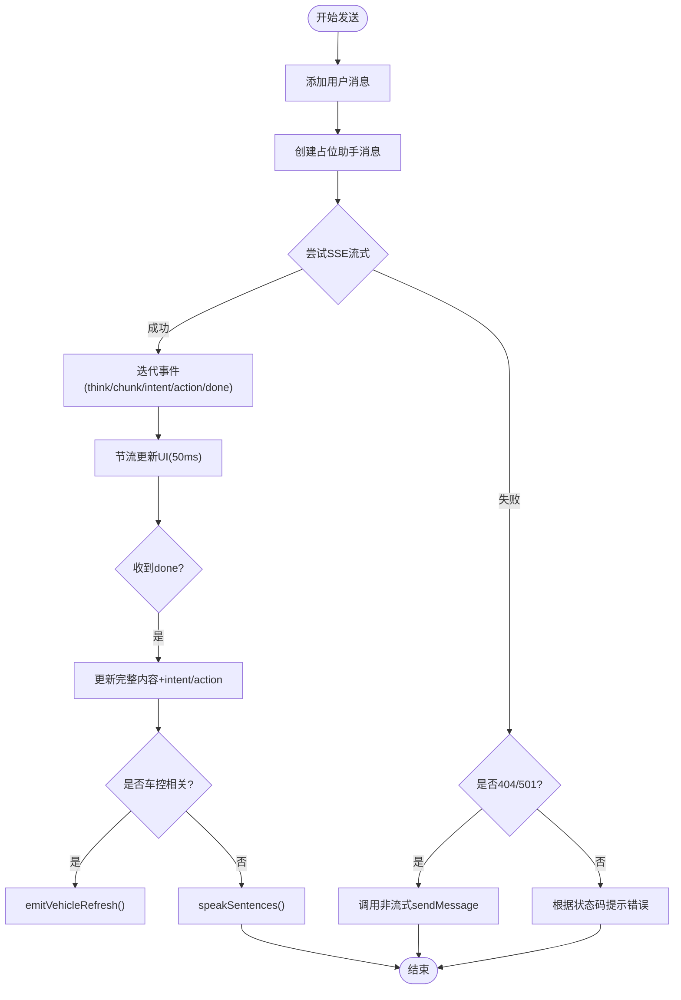
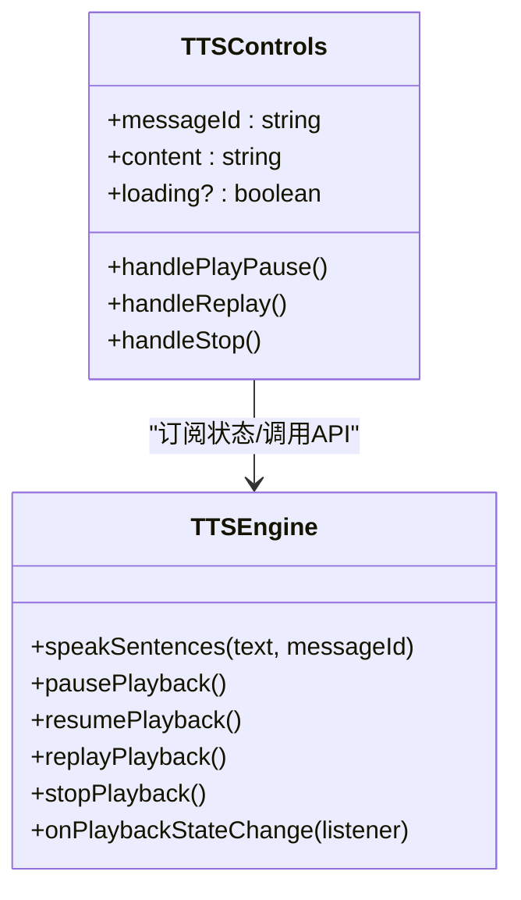
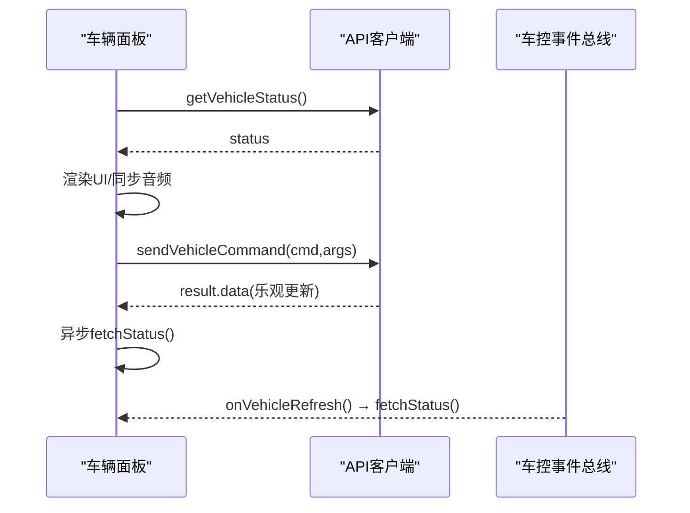
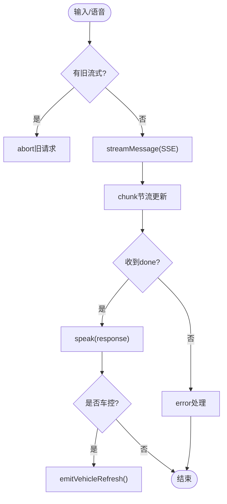
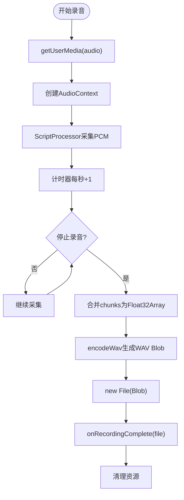
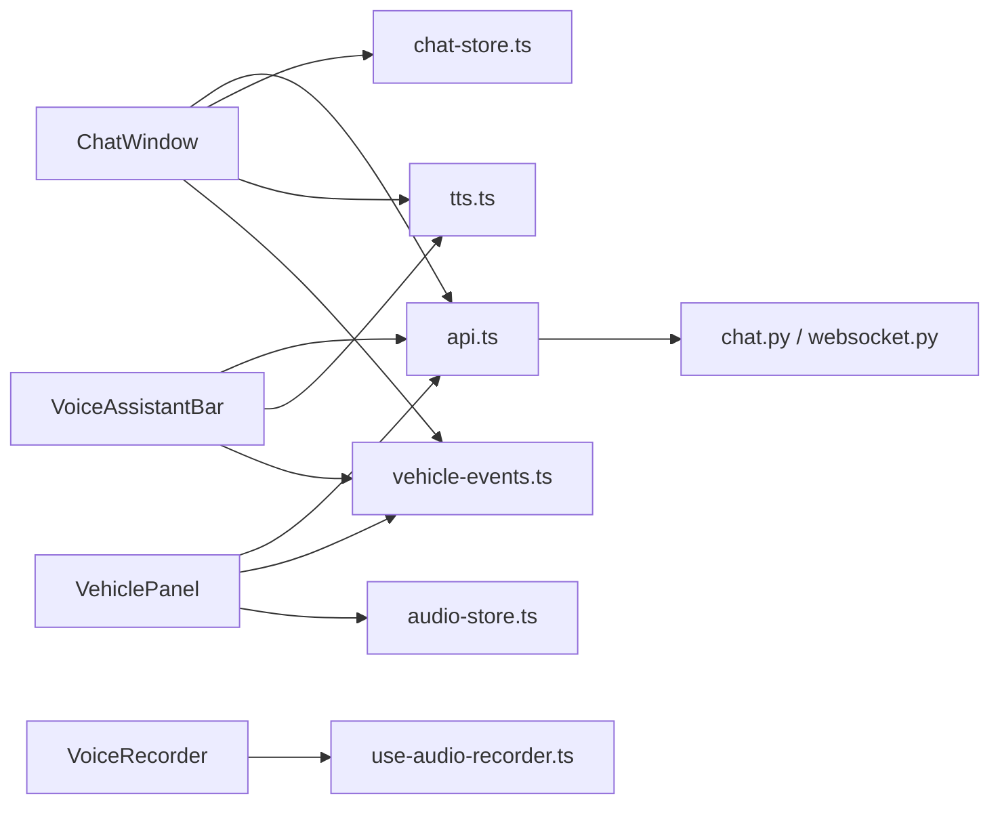

# 业务组件

<cite>
**本文引用的文件**   
- [chat-window.tsx](file://frontend_design/src/components/chat/chat-window.tsx)
- [tts-controls.tsx](file://frontend_design/src/components/chat/tts-controls.tsx)
- [vehicle-panel.tsx](file://frontend_design/src/components/vehicle/vehicle-panel.tsx)
- [voice-assistant-bar.tsx](file://frontend_design/src/components/vehicle/voice-assistant-bar.tsx)
- [voice-recorder.tsx](file://frontend_design/src/components/voice-recorder.tsx)
- [use-audio-recorder.ts](file://frontend_design/src/hooks/use-audio-recorder.ts)
- [tts.ts](file://frontend_design/src/lib/tts.ts)
- [api.ts](file://frontend_design/src/lib/api.ts)
- [vehicle-events.ts](file://frontend_design/src/lib/vehicle-events.ts)
- [chat-store.ts](file://frontend_design/src/stores/chat-store.ts)
- [auth-store.ts](file://frontend_design/src/stores/auth-store.ts)
- [chat.py](file://backend_design/nexus/api/routes/chat.py)
- [websocket.py](file://backend_design/nexus/api/websocket.py)
</cite>

## 目录
1. [简介](#简介)
2. [项目结构](#项目结构)
3. [核心组件](#核心组件)
4. [架构总览](#架构总览)
5. [详细组件分析](#详细组件分析)
6. [依赖关系分析](#依赖关系分析)
7. [性能考量](#性能考量)
8. [故障排查指南](#故障排查指南)
9. [结论](#结论)
10. [附录：使用示例与扩展点](#附录使用示例与扩展点)

## 简介
本技术文档聚焦 NexusCockpit 前端业务组件，系统性阐述聊天窗口、TTS控制、车辆面板、语音助手栏、录音器等核心模块的功能实现与交互逻辑。内容覆盖状态管理、API集成、实时通信（SSE/WebSocket）、错误处理、组件间通信模式、数据流管理与性能优化策略，并提供基于源码的调用路径与扩展点说明，帮助开发者快速理解并二次开发。

## 项目结构
前端采用 Next.js + React + TypeScript，核心业务组件位于 frontend_design/src/components，状态管理通过 Zustand store 与自定义 hooks，API 封装在 lib/api.ts，TTS 引擎与事件总线分别位于 lib/tts.ts 与 lib/vehicle-events.ts。后端提供 REST + SSE 对话接口与 WebSocket 双向通道，位于 backend_design/nexus/api 下。

图表来源
- [chat-window.tsx:1-652](file://frontend_design/src/components/chat/chat-window.tsx#L1-L652)
- [tts-controls.tsx:1-178](file://frontend_design/src/components/chat/tts-controls.tsx#L1-L178)
- [vehicle-panel.tsx:1-886](file://frontend_design/src/components/vehicle/vehicle-panel.tsx#L1-L886)
- [voice-assistant-bar.tsx:1-430](file://frontend_design/src/components/vehicle/voice-assistant-bar.tsx#L1-L430)
- [voice-recorder.tsx:1-212](file://frontend_design/src/components/voice-recorder.tsx#L1-L212)
- [use-audio-recorder.ts:1-304](file://frontend_design/src/hooks/use-audio-recorder.ts#L1-L304)
- [tts.ts:1-443](file://frontend_design/src/lib/tts.ts#L1-L443)
- [api.ts:1-786](file://frontend_design/src/lib/api.ts#L1-L786)
- [vehicle-events.ts:1-34](file://frontend_design/src/lib/vehicle-events.ts#L1-L34)
- [chat-store.ts:1-311](file://frontend_design/src/stores/chat-store.ts#L1-L311)
- [auth-store.ts:1-228](file://frontend_design/src/stores/auth-store.ts#L1-L228)
- [chat.py:1-719](file://backend_design/nexus/api/routes/chat.py#L1-L719)
- [websocket.py:1-209](file://backend_design/nexus/api/websocket.py#L1-L209)

章节来源
- [chat-window.tsx:1-652](file://frontend_design/src/components/chat/chat-window.tsx#L1-L652)
- [vehicle-panel.tsx:1-886](file://frontend_design/src/components/vehicle/vehicle-panel.tsx#L1-L886)
- [api.ts:1-786](file://frontend_design/src/lib/api.ts#L1-L786)
- [chat.py:1-719](file://backend_design/nexus/api/routes/chat.py#L1-L719)

## 核心组件
- 聊天窗口：文本输入、浏览器语音识别、本地ASR录音、SSE流式接收AI回复、多会话管理、车控联动刷新、降级回退。
- TTS控制：分句播放、全局播放状态机、断点续播、整条重放、终止播放、与音乐联动。
- 车辆面板：空调/座椅/媒体/导航/车窗控制，乐观更新+全量同步，离线Mock降级，GPS定位更新。
- 语音助手栏：快捷语音/文字输入、流式回复、TTS朗读、快捷指令、与车控面板联动刷新。
- 录音器：WAV录制（16kHz/16bit/mono），回放与删除，用于声纹注册/验证。

章节来源
- [chat-window.tsx:1-652](file://frontend_design/src/components/chat/chat-window.tsx#L1-L652)
- [tts-controls.tsx:1-178](file://frontend_design/src/components/chat/tts-controls.tsx#L1-L178)
- [vehicle-panel.tsx:1-886](file://frontend_design/src/components/vehicle/vehicle-panel.tsx#L1-L886)
- [voice-assistant-bar.tsx:1-430](file://frontend_design/src/components/vehicle/voice-assistant-bar.tsx#L1-L430)
- [voice-recorder.tsx:1-212](file://frontend_design/src/components/voice-recorder.tsx#L1-L212)

## 架构总览
前端通过 api.ts 统一发起REST请求与SSE流式读取；聊天窗口与语音助手栏使用 streamMessage 进行SSE流式对话；车辆面板通过 sendVehicleCommand/getVehicleStatus 直接操作车控；TTS引擎按句播放并与音频库协作；车控事件总线解耦聊天与面板的状态刷新。

图表来源
- [chat-window.tsx:222-401](file://frontend_design/src/components/chat/chat-window.tsx#L222-L401)
- [api.ts:261-341](file://frontend_design/src/lib/api.ts#L261-L341)
- [chat.py:467-686](file://backend_design/nexus/api/routes/chat.py#L467-L686)
- [vehicle-events.ts:22-33](file://frontend_design/src/lib/vehicle-events.ts#L22-L33)
- [tts.ts:282-312](file://frontend_design/src/lib/tts.ts#L282-L312)

## 详细组件分析

### 聊天窗口（ChatWindow）
- 功能要点
  - 支持文本输入与两种语音输入：浏览器 Web Speech API 实时转写、本地 ASR 录音上传后端 SenseVoice 模型识别。
  - SSE 流式接收 AI 回复，逐块更新消息，支持 thinking/chunk/intent/action/done/error 事件。
  - 多会话管理：新建/切换/加载历史消息，首次消息自动设置标题。
  - 车控联动：当检测到意图或动作包含车控关键词时，触发 vehicle-events 刷新车辆面板。
  - 降级策略：流式失败（404/501）自动回退到非流式 sendMessage。
  - 流式取消：AbortController 中断旧请求，仅用户主动点击“暂停生成”才真正停止后台任务。
- 状态管理
  - 使用 chat-store 维护 messages/messagesByKey/sessionsByCockpit/sessionId/isStreaming 等。
  - 模块级变量持有 _abortController/_streamingContent/_assistantId，避免页面切换导致的中断。
- 关键流程
  - handleSend：添加用户消息→创建占位助手消息→SSE流式→done后更新intent/action→触发车控刷新→TTS朗读。
  - scheduleFlush：每50ms一次节流写入store，避免频繁setState。
  - handleStop：中止流式请求、停止TTS、清理loading状态。
- 错误处理
  - AbortError：显示“已停止生成”。
  - StreamError 401/500+：提示鉴权失败或服务异常。
  - 网络异常：提示检查网络。

图表来源
- [chat-window.tsx:222-401](file://frontend_design/src/components/chat/chat-window.tsx#L222-L401)
- [api.ts:261-341](file://frontend_design/src/lib/api.ts#L261-L341)

章节来源
- [chat-window.tsx:1-652](file://frontend_design/src/components/chat/chat-window.tsx#L1-L652)
- [chat-store.ts:1-311](file://frontend_design/src/stores/chat-store.ts#L1-L311)
- [api.ts:247-341](file://frontend_design/src/lib/api.ts#L247-L341)

### TTS控制（TTSControls）
- 功能要点
  - 挂载于每条助手消息下方，提供播放/暂停、整条重放、终止播放、进度指示。
  - 订阅全局播放状态变化，高亮当前活跃消息。
- 状态管理
  - 通过 tts.ts 的全局状态机（idle/playing/paused/stopped）与监听器 onPlaybackStateChange。
  - 代际计数器防止旧utterance回调干扰新播放。
- 交互逻辑
  - 播放：speakSentences(content, messageId)
  - 暂停/继续：pausePlayback/resumePlayback
  - 重放：replayPlayback/replayCurrentSentence
  - 终止：stopPlayback（立即重置状态并恢复音乐）

图表来源
- [tts-controls.tsx:1-178](file://frontend_design/src/components/chat/tts-controls.tsx#L1-L178)
- [tts.ts:1-443](file://frontend_design/src/lib/tts.ts#L1-L443)

章节来源
- [tts-controls.tsx:1-178](file://frontend_design/src/components/chat/tts-controls.tsx#L1-L178)
- [tts.ts:1-443](file://frontend_design/src/lib/tts.ts#L1-L443)

### 车辆面板（VehiclePanel）
- 功能要点
  - 展示与控制：空调、座椅、媒体、导航、车窗、车辆状态概览。
  - 数据来源：初始化拉取 getVehicleStatus，用户操作 sendVehicleCommand 后乐观更新再全量同步。
  - 离线降级：后端不可用时使用 MOCK_STATUS。
  - GPS定位：定期获取坐标并更新位置，延迟刷新状态。
  - 事件订阅：onVehicleRefresh 响应语音助手触发的刷新。
- 并发与状态
  - executingCmds Set 记录正在执行的命令键，支持多命令并行不阻塞其他按钮。
  - mediaKey 深度比较避免对象引用变化导致音频重启。
- 关键流程
  - fetchStatus：优先后端，失败重试2秒后降级Mock。
  - handleCommand：乐观更新data→异步fetchStatus→Toast反馈。
  - 媒体联动：syncAudioFromMedia 同步播放状态到全局 audio-store。

图表来源
- [vehicle-panel.tsx:167-308](file://frontend_design/src/components/vehicle/vehicle-panel.tsx#L167-L308)
- [api.ts:360-376](file://frontend_design/src/lib/api.ts#L360-L376)
- [vehicle-events.ts:22-33](file://frontend_design/src/lib/vehicle-events.ts#L22-L33)

章节来源
- [vehicle-panel.tsx:1-886](file://frontend_design/src/components/vehicle/vehicle-panel.tsx#L1-L886)
- [api.ts:360-376](file://frontend_design/src/lib/api.ts#L360-L376)

### 语音助手栏（VoiceAssistantBar）
- 功能要点
  - 集成在车控面板顶部的快捷输入区，支持麦克风、本地ASR、文字输入、快捷指令。
  - 流式回复：与聊天窗口相同的SSE体验，rAF节流渲染。
  - TTS朗读：收到done事件后直接朗读。
  - 车控联动：检测意图/动作关键词触发刷新。
- 关键流程
  - handleSend：中止旧请求→SSE流式→节流更新→done后朗读+刷新。
  - handleLocalASRToggle：录音→transcribeAudio→填入输入框。

图表来源
- [voice-assistant-bar.tsx:132-229](file://frontend_design/src/components/vehicle/voice-assistant-bar.tsx#L132-L229)
- [api.ts:261-341](file://frontend_design/src/lib/api.ts#L261-L341)

章节来源
- [voice-assistant-bar.tsx:1-430](file://frontend_design/src/components/vehicle/voice-assistant-bar.tsx#L1-L430)

### 录音器（VoiceRecorder）
- 功能要点
  - 使用 useAudioRecorder 录制标准WAV（16kHz/16bit/mono PCM），兼容后端 torchaudio。
  - 支持播放、删除、时长显示、错误提示。
- 关键流程
  - startRecording：获取麦克风→AudioContext→ScriptProcessor采集PCM→计时。
  - stopRecording：合并chunks→encodeWav→Blob→File→回调父组件。
  - 资源清理：撤销ObjectURL、关闭AudioContext、停止音轨。

图表来源
- [voice-recorder.tsx:46-81](file://frontend_design/src/components/voice-recorder.tsx#L46-L81)
- [use-audio-recorder.ts:138-257](file://frontend_design/src/hooks/use-audio-recorder.ts#L138-L257)

章节来源
- [voice-recorder.tsx:1-212](file://frontend_design/src/components/voice-recorder.tsx#L1-L212)
- [use-audio-recorder.ts:1-304](file://frontend_design/src/hooks/use-audio-recorder.ts#L1-L304)

## 依赖关系分析
- 组件耦合
  - ChatWindow 依赖 api.ts（SSE/REST）、chat-store（消息与会话）、tts.ts（朗读）、vehicle-events（刷新）。
  - VehiclePanel 依赖 api.ts（车控）、vehicle-events（刷新）、audio-store（媒体同步）。
  - VoiceAssistantBar 依赖 api.ts、tts.ts、vehicle-events。
  - VoiceRecorder 依赖 use-audio-recorder。
- 外部依赖
  - 后端：chat.py（REST+SSE）、websocket.py（双向实时）。
  - 浏览器API：Web Speech API、MediaDevices、AudioContext、SpeechSynthesis。
- 潜在循环依赖
  - 无直接循环，通过事件总线与store解耦。

图表来源
- [chat-window.tsx:1-652](file://frontend_design/src/components/chat/chat-window.tsx#L1-L652)
- [vehicle-panel.tsx:1-886](file://frontend_design/src/components/vehicle/vehicle-panel.tsx#L1-L886)
- [voice-assistant-bar.tsx:1-430](file://frontend_design/src/components/vehicle/voice-assistant-bar.tsx#L1-L430)
- [voice-recorder.tsx:1-212](file://frontend_design/src/components/voice-recorder.tsx#L1-L212)
- [api.ts:1-786](file://frontend_design/src/lib/api.ts#L1-L786)
- [chat.py:1-719](file://backend_design/nexus/api/routes/chat.py#L1-L719)
- [websocket.py:1-209](file://backend_design/nexus/api/websocket.py#L1-L209)

章节来源
- [api.ts:1-786](file://frontend_design/src/lib/api.ts#L1-L786)
- [chat.py:1-719](file://backend_design/nexus/api/routes/chat.py#L1-L719)
- [websocket.py:1-209](file://backend_design/nexus/api/websocket.py#L1-L209)

## 性能考量
- 流式渲染节流
  - ChatWindow 使用 setTimeout 每50ms一次flush，避免rAF在组件卸载后失效。
  - VoiceAssistantBar 使用 requestAnimationFrame 节流，减少高频重渲染。
- 状态持久化与恢复
  - chat-store 使用 persist 中间件将 messagesByKey/sessionsByCockpit 持久化，恢复时重建messages。
- 音频与TTS
  - TTS 分句播放，Chrome保活定时器防止长时间播放冻结；与音乐库协作避免打断播放。
- 网络与降级
  - VehiclePanel 首次失败延迟2秒重试，避免Token刷新时序问题；失败降级Mock。
  - ChatWindow 流式失败（404/501）回退非流式。
- 并发与锁
  - 后端会话级并发锁防止历史交叉污染；前端执行命令Set避免重复提交。

[本节为通用指导，无需源码引用]

## 故障排查指南
- 常见问题
  - 语音识别失败：检查浏览器权限与设备可用性（use-audio-recorder error）。
  - TTS无法播放：确认 isTTSSupported 与浏览器语音合成支持。
  - 车控无响应：查看 offline 标志与 Toast 描述；检查网络连接与后端状态。
  - SSE连接断开：检查网络与后端心跳配置；确认 AbortController 未误用。
- 调试建议
  - 打开控制台查看 StreamError 状态码与消息。
  - 使用 toast 提示定位错误来源。
  - 检查 localStorage 中的 nexus_token 与 nexus_cockpit_id。

章节来源
- [use-audio-recorder.ts:183-191](file://frontend_design/src/hooks/use-audio-recorder.ts#L183-L191)
- [tts.ts:94-96](file://frontend_design/src/lib/tts.ts#L94-L96)
- [vehicle-panel.tsx:278-300](file://frontend_design/src/components/vehicle/vehicle-panel.tsx#L278-L300)
- [api.ts:283-289](file://frontend_design/src/lib/api.ts#L283-L289)

## 结论
NexusCockpit 业务组件以清晰的职责划分、健壮的错误处理与高性能的流式渲染机制，实现了车载场景下的自然语言交互与车控一体化体验。通过事件总线与store解耦，组件间通信灵活可扩展；结合后端SSE/WebSocket与降级策略，确保用户体验稳定可靠。

[本节为总结性内容，无需源码引用]

## 附录：使用示例与扩展点
- 聊天窗口使用
  - 配置：userId、sessionId、cockpitId 由 store 管理；默认用户可通过环境变量设置。
  - 事件回调：onPlaybackStateChange 可监听TTS状态；emitVehicleRefresh 触发车控刷新。
  - 扩展点：新增意图关键词可加入车控判断条件；自定义节流策略替换scheduleFlush。
- TTS控制扩展
  - 自定义分句规则：修改 splitIntoSentences 正则。
  - 增加播放模式：在 TTSEngine 中添加新状态与对应行为。
- 车辆面板扩展
  - 新增控制项：在 UI 中增加按钮，调用 handleCommand 发送命令。
  - 自定义Mock数据：扩展 MOCK_STATUS 结构。
- 录音器扩展
  - 支持更多格式：在 encodeWav 基础上扩展编码逻辑。
  - 集成声纹：使用 onRecordingComplete 回调上传至后端。

章节来源
- [chat-window.tsx:222-401](file://frontend_design/src/components/chat/chat-window.tsx#L222-L401)
- [tts.ts:104-124](file://frontend_design/src/lib/tts.ts#L104-L124)
- [vehicle-panel.tsx:270-308](file://frontend_design/src/components/vehicle/vehicle-panel.tsx#L270-L308)
- [voice-recorder.tsx:58-81](file://frontend_design/src/components/voice-recorder.tsx#L58-L81)