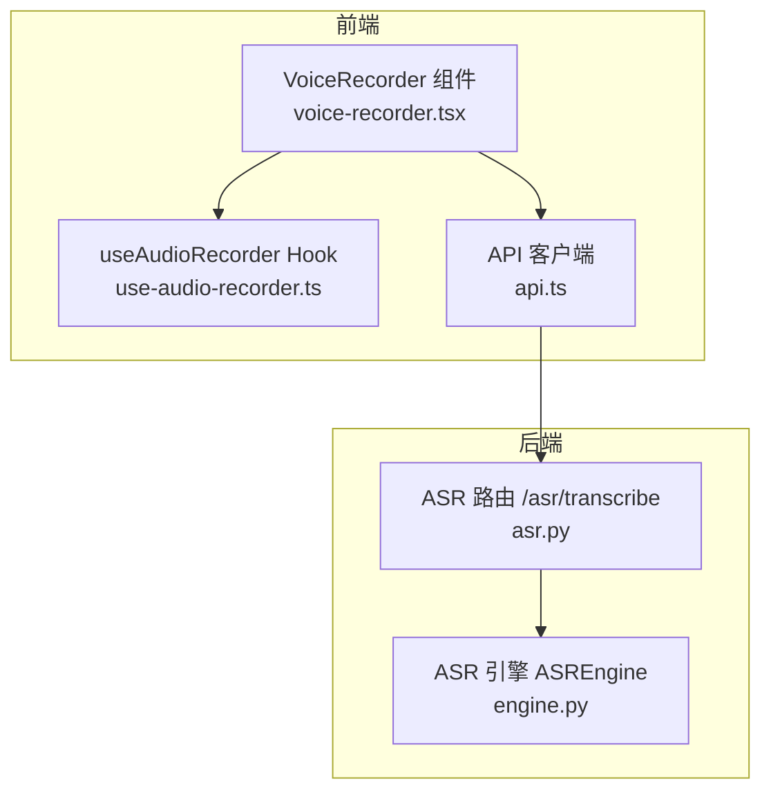
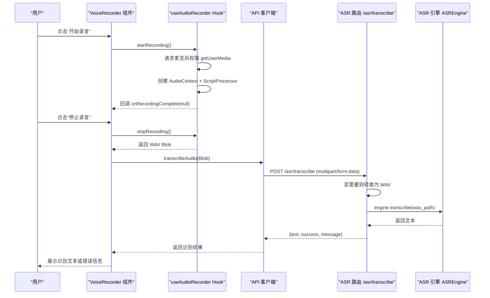
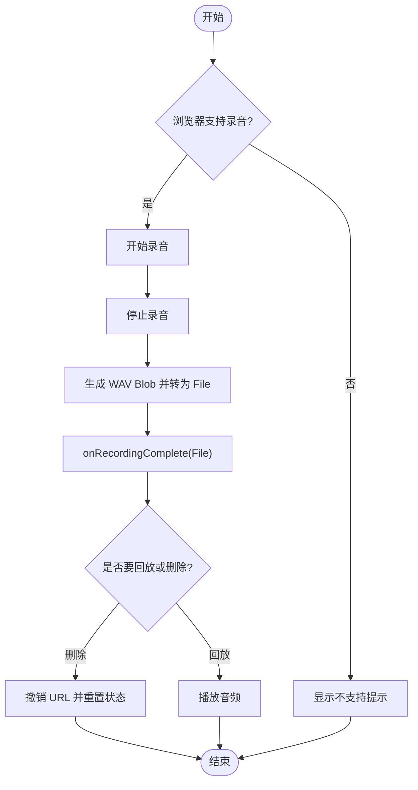
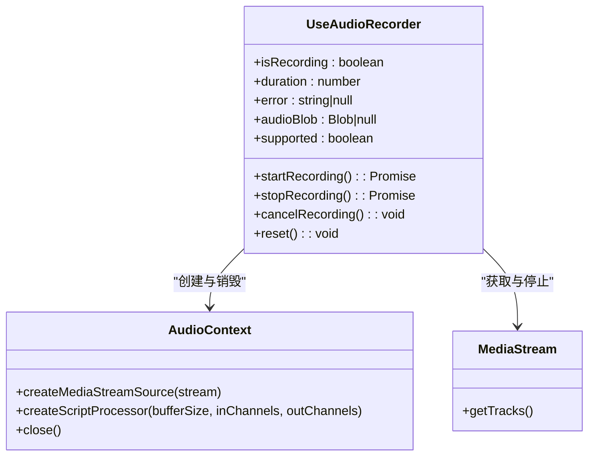
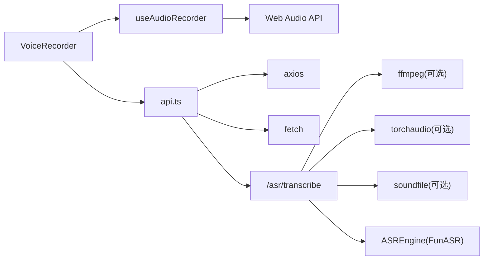

# 录音器组件

<cite>
**本文引用的文件**
- [voice-recorder.tsx](file://frontend_design/src/components/voice-recorder.tsx)
- [use-audio-recorder.ts](file://frontend_design/src/hooks/use-audio-recorder.ts)
- [api.ts](file://frontend_design/src/lib/api.ts)
- [asr.py](file://backend_design/nexus/api/routes/asr.py)
- [engine.py](file://backend_design/nexus/asr/engine.py)
- [index.ts](file://frontend_design/src/types/index.ts)
</cite>

## 目录
1. [简介](#简介)
2. [项目结构](#项目结构)
3. [核心组件](#核心组件)
4. [架构总览](#架构总览)
5. [详细组件分析](#详细组件分析)
6. [依赖关系分析](#依赖关系分析)
7. [性能考量](#性能考量)
8. [故障排查指南](#故障排查指南)
9. [结论](#结论)
10. [附录：集成与使用示例](#附录集成与使用示例)

## 简介
本技术文档围绕 NexusCockpit 的录音器组件展开，重点解析 VoiceRecorder 组件及其底层 Hook useAudioRecorder 的实现原理、状态管理、音频采集与编码流程、与浏览器 Media API 的集成方式，以及与后端 ASR 服务的完整对接链路。文档同时涵盖错误处理、性能优化策略、以及在前端页面中的集成与使用示例，帮助开发者快速理解并正确扩展该能力。

## 项目结构
录音器相关代码主要分布在以下位置：
- 前端 UI 组件：VoiceRecorder（React 组件）
- 前端录音逻辑：useAudioRecorder（自定义 Hook）
- 前端 API 客户端：transcribeAudio（上传音频到后端 ASR）
- 后端 ASR 路由：/asr/transcribe（接收音频并识别为文本）
- 后端 ASR 引擎：ASREngine（封装 FunASR SenseVoice 模型）
- 类型定义：VoiceprintStatus、VoiceprintVerifyResult 等（与语音相关）

图表来源
- [voice-recorder.tsx:1-212](file://frontend_design/src/components/voice-recorder.tsx#L1-L212)
- [use-audio-recorder.ts:1-304](file://frontend_design/src/hooks/use-audio-recorder.ts#L1-L304)
- [api.ts:612-625](file://frontend_design/src/lib/api.ts#L612-L625)
- [asr.py:48-121](file://backend_design/nexus/api/routes/asr.py#L48-L121)
- [engine.py:78-178](file://backend_design/nexus/asr/engine.py#L78-L178)

章节来源
- [voice-recorder.tsx:1-212](file://frontend_design/src/components/voice-recorder.tsx#L1-L212)
- [use-audio-recorder.ts:1-304](file://frontend_design/src/hooks/use-audio-recorder.ts#L1-L304)
- [api.ts:612-625](file://frontend_design/src/lib/api.ts#L612-L625)
- [asr.py:48-121](file://backend_design/nexus/api/routes/asr.py#L48-L121)
- [engine.py:78-178](file://backend_design/nexus/asr/engine.py#L78-L178)

## 核心组件
- VoiceRecorder 组件
  - 负责用户交互：开始/停止录音、回放、删除录音、时长显示、错误提示
  - 通过 useAudioRecorder Hook 获取录制状态、时长、Blob、支持性检测
  - 将 Blob 包装为 File 并通过回调 onRecordingComplete 通知父组件
- useAudioRecorder Hook
  - 基于 AudioContext + ScriptProcessorNode 采集 PCM 数据
  - 将 PCM 重采样至 16kHz、转换为 16-bit PCM，并手动构建 WAV 文件头
  - 提供 startRecording、stopRecording、cancelRecording、reset 等方法
  - 管理计时器、媒体流、AudioContext 生命周期，避免内存泄漏
- 前端 API 客户端
  - transcribeAudio 将 Blob 以 multipart/form-data 上传至 /asr/transcribe
  - 自动附加 JWT Token 和座舱 ID，统一超时与错误处理
- 后端 ASR 路由
  - 接收音频文件，必要时进行格式转换（webm/m4a/mp3/ogg -> wav）
  - 调用 ASREngine 进行识别，返回结构化响应
- 后端 ASR 引擎
  - 懒加载 FunASR SenseVoice 模型，过滤无意义标点结果
  - 提供 is_loaded 状态查询与 transcribe 方法

章节来源
- [voice-recorder.tsx:1-212](file://frontend_design/src/components/voice-recorder.tsx#L1-L212)
- [use-audio-recorder.ts:1-304](file://frontend_design/src/hooks/use-audio-recorder.ts#L1-L304)
- [api.ts:612-625](file://frontend_design/src/lib/api.ts#L612-L625)
- [asr.py:48-121](file://backend_design/nexus/api/routes/asr.py#L48-L121)
- [engine.py:78-178](file://backend_design/nexus/asr/engine.py#L78-L178)

## 架构总览
下图展示了从前端录音到后端识别的端到端流程，包括浏览器权限请求、PCM 采集、WAV 编码、上传、格式转换、模型推理与结果返回。

图表来源
- [voice-recorder.tsx:46-81](file://frontend_design/src/components/voice-recorder.tsx#L46-L81)
- [use-audio-recorder.ts:138-257](file://frontend_design/src/hooks/use-audio-recorder.ts#L138-L257)
- [api.ts:612-625](file://frontend_design/src/lib/api.ts#L612-L625)
- [asr.py:48-121](file://backend_design/nexus/api/routes/asr.py#L48-L121)
- [engine.py:138-173](file://backend_design/nexus/asr/engine.py#L138-L173)

## 详细组件分析

### VoiceRecorder 组件
- 功能要点
  - 控制录音生命周期：开始、停止、回放、删除
  - 维护播放状态与 Object URL，避免内存泄漏
  - 格式化时长显示，提供友好的错误提示
  - 将录音结果以 File 形式通过 onRecordingComplete 回调给父组件
- 关键实现点
  - 在开始录音前撤销旧 Object URL，确保资源释放
  - 停止录音后生成 WAV Blob，构造 File 并触发回调
  - 删除录音时清理 URL、重置状态并通知父组件清除旧文件
  - 隐藏 audio 元素用于回放，监听结束事件更新播放状态

图表来源
- [voice-recorder.tsx:46-81](file://frontend_design/src/components/voice-recorder.tsx#L46-L81)
- [voice-recorder.tsx:108-211](file://frontend_design/src/components/voice-recorder.tsx#L108-L211)

章节来源
- [voice-recorder.tsx:1-212](file://frontend_design/src/components/voice-recorder.tsx#L1-L212)

### useAudioRecorder Hook
- 功能要点
  - 使用 AudioContext + ScriptProcessorNode 采集原始 PCM
  - 重采样至 16kHz，转换为 16-bit PCM，构建标准 WAV 文件头
  - 管理媒体流、处理器、定时器生命周期，防止内存泄漏
  - 提供 startRecording、stopRecording、cancelRecording、reset
- 关键实现点
  - 兼容性检查：navigator.mediaDevices 与 AudioContext/webkitAudioContext
  - 启动录音：getUserMedia -> createMediaStreamSource -> createScriptProcessor -> onaudioprocess 收集 Float32Array
  - 停止录音：合并 chunks -> createBuffer -> encodeWav -> 关闭上下文与定时器
  - 错误处理：区分 NotAllowedError、NotFoundError 与未知错误
  - 资源清理：卸载时停止音轨、关闭 AudioContext、清除定时器

图表来源
- [use-audio-recorder.ts:100-303](file://frontend_design/src/hooks/use-audio-recorder.ts#L100-L303)

章节来源
- [use-audio-recorder.ts:1-304](file://frontend_design/src/hooks/use-audio-recorder.ts#L1-L304)

### 前端 API 客户端（ASR 上传）
- 功能要点
  - transcribeAudio 将 Blob 以 multipart/form-data 上传至 /asr/transcribe
  - 根据 Blob type 推断文件扩展名（webm/m4a/ogg/wav）
  - 使用 axios 实例统一添加 Authorization 与 X-Cockpit-Id 头
  - 设置较长超时（60s）以适应 ASR 推理耗时
- 关键实现点
  - FormData 构造与 Content-Type 设置
  - 错误与重试由拦截器统一处理（401 自动刷新 Token）

章节来源
- [api.ts:612-625](file://frontend_design/src/lib/api.ts#L612-L625)

### 后端 ASR 路由（/asr/transcribe）
- 功能要点
  - 接收音频文件，读取字节写入临时文件
  - 对 webm/m4a/mp3/ogg 进行格式转换（优先 ffmpeg，其次 torchaudio/soundfile）
  - 调用 ASREngine 进行识别，返回结构化响应
  - 异常捕获与日志记录，保证健壮性
- 关键实现点
  - 转换策略优先级：系统 ffmpeg -> imageio_ffmpeg -> torchaudio -> soundfile
  - 临时文件清理（finally 块中删除）
  - 空输入与未加载模型的错误处理

章节来源
- [asr.py:48-121](file://backend_design/nexus/api/routes/asr.py#L48-L121)
- [asr.py:142-247](file://backend_design/nexus/api/routes/asr.py#L142-L247)

### 后端 ASR 引擎（ASREngine）
- 功能要点
  - 懒加载 FunASR SenseVoice 模型，抑制噪音日志
  - 提供 transcribe(audio_path) 识别方法，过滤纯标点结果
  - 暴露 is_loaded 属性供路由层判断
- 关键实现点
  - 加载期间临时禁用 INFO 级别日志并重定向 stdout
  - 自动选择 CUDA 或 CPU 设备
  - rich_transcription_postprocess 后处理与标点过滤

章节来源
- [engine.py:78-178](file://backend_design/nexus/asr/engine.py#L78-L178)

## 依赖关系分析
- 前端依赖
  - React Hooks（useState、useRef、useEffect、useCallback）
  - Web Audio API（AudioContext、MediaStream、ScriptProcessorNode）
  - axios（HTTP 客户端）、fetch（流式请求）
- 后端依赖
  - FastAPI（路由与文件上传）
  - FunASR（SenseVoice 模型）
  - 可选工具：ffmpeg、torchaudio、soundfile、numpy

图表来源
- [voice-recorder.tsx:1-212](file://frontend_design/src/components/voice-recorder.tsx#L1-L212)
- [use-audio-recorder.ts:1-304](file://frontend_design/src/hooks/use-audio-recorder.ts#L1-L304)
- [api.ts:612-625](file://frontend_design/src/lib/api.ts#L612-L625)
- [asr.py:142-247](file://backend_design/nexus/api/routes/asr.py#L142-L247)
- [engine.py:78-178](file://backend_design/nexus/asr/engine.py#L78-L178)

章节来源
- [voice-recorder.tsx:1-212](file://frontend_design/src/components/voice-recorder.tsx#L1-L212)
- [use-audio-recorder.ts:1-304](file://frontend_design/src/hooks/use-audio-recorder.ts#L1-L304)
- [api.ts:612-625](file://frontend_design/src/lib/api.ts#L612-L625)
- [asr.py:142-247](file://backend_design/nexus/api/routes/asr.py#L142-L247)
- [engine.py:78-178](file://backend_design/nexus/asr/engine.py#L78-L178)

## 性能考量
- 内存管理
  - 及时撤销 Object URL，避免内存泄漏
  - 停止录音后立即断开处理器与媒体流，关闭 AudioContext
  - 合并 PCM 数据时使用预分配数组，减少频繁扩容
- 压缩与编码
  - 前端直接输出 WAV（16kHz/16bit/mono），减少后端转换开销
  - 后端仅在必要时进行格式转换，优先使用系统 ffmpeg
- 异步处理
  - 使用 setInterval 计时，避免阻塞主线程
  - ASR 推理采用独立进程/线程，前端长超时等待
- 缓存与状态
  - 支持性检测使用 state 触发重渲染，避免首次渲染按钮误禁用
  - Token 与座舱 ID 在请求拦截器中统一注入，减少重复逻辑

[本节为通用指导，不直接分析具体文件]

## 故障排查指南
- 浏览器不支持录音
  - 现象：按钮禁用或提示“当前浏览器不支持录音功能”
  - 原因：缺少 navigator.mediaDevices 或 AudioContext/webkitAudioContext
  - 解决：升级浏览器或使用 HTTPS 环境
- 麦克风权限被拒绝
  - 现象：错误提示“麦克风权限被拒绝”
  - 原因：用户拒绝权限或未启用 HTTPS
  - 解决：允许权限并确保安全上下文
- 未找到麦克风设备
  - 现象：错误提示“未找到麦克风设备”
  - 原因：设备缺失或被占用
  - 解决：检查设备连接与其他应用占用情况
- ASR 模型未加载
  - 现象：后端返回“ASR 模型未加载”
  - 原因：模型路径错误或 FunASR 未安装
  - 解决：检查配置路径与依赖安装
- 格式转换失败
  - 现象：后端尝试多种转换策略均失败
  - 原因：缺少 ffmpeg/torchaudio/soundfile
  - 解决：安装相应依赖或确保系统 ffmpeg 可用

章节来源
- [use-audio-recorder.ts:138-192](file://frontend_design/src/hooks/use-audio-recorder.ts#L138-L192)
- [asr.py:82-121](file://backend_design/nexus/api/routes/asr.py#L82-L121)
- [engine.py:124-137](file://backend_design/nexus/asr/engine.py#L124-L137)

## 结论
NexusCockpit 的录音器组件通过前端 Web Audio API 与后端 FunASR 引擎协同工作，实现了稳定可靠的语音转文字能力。组件设计清晰、状态管理完善、错误处理健全，并在性能与内存管理方面做了充分优化。结合统一的 API 客户端与后端路由，形成了完整的端到端语音识别链路，便于在座舱界面中快速集成与扩展。

[本节为总结性内容，不直接分析具体文件]

## 附录：集成与使用示例
- 在页面中引入 VoiceRecorder 组件
  - 通过 onRecordingComplete 回调接收 File 对象
  - 可将 File 传递给上层业务逻辑（如聊天输入、声纹注册）
- 配置选项
  - 仅需要传入 onRecordingComplete 回调函数
  - 组件内部已处理支持性检测、错误提示与资源清理
- 事件监听
  - 组件内部维护 isRecording、duration、audioBlob、error、supported 等状态
  - 可通过回调或外部状态同步获取录音结果
- 自定义样式
  - 组件使用 Tailwind CSS 类名，可按需覆盖样式
- 与 ASR 服务集成
  - 使用 api.ts 中的 transcribeAudio 上传录音
  - 后端返回 text、success、message，可据此更新 UI

章节来源
- [voice-recorder.tsx:26-81](file://frontend_design/src/components/voice-recorder.tsx#L26-L81)
- [api.ts:612-625](file://frontend_design/src/lib/api.ts#L612-L625)
- [index.ts:254-276](file://frontend_design/src/types/index.ts#L254-L276)