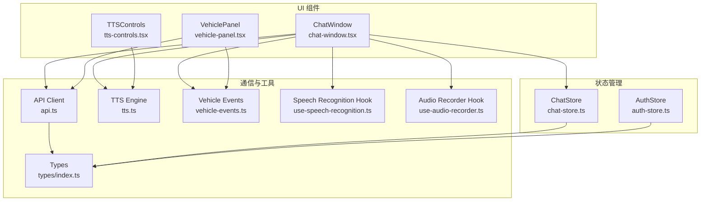
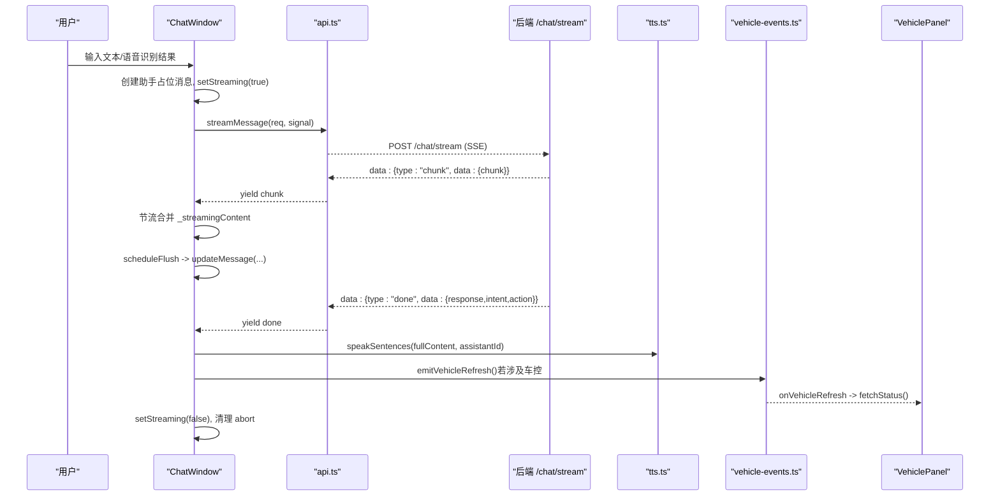
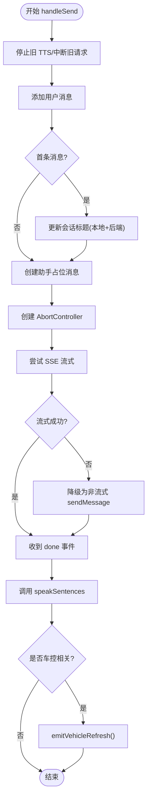
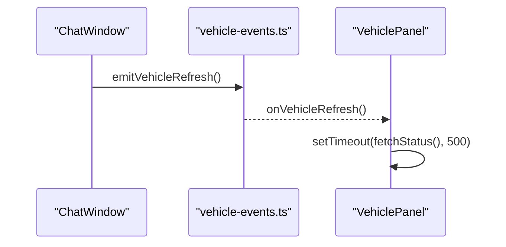
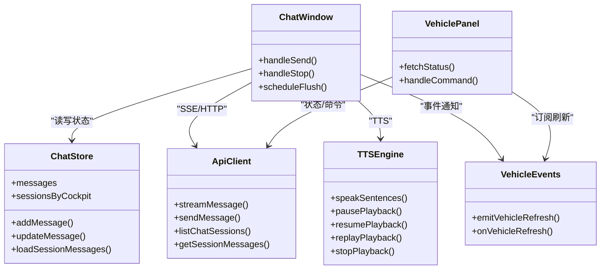

# 聊天窗口组件

<cite>
**本文引用的文件**   
- [chat-window.tsx](file://frontend_design/src/components/chat/chat-window.tsx)
- [tts-controls.tsx](file://frontend_design/src/components/chat/tts-controls.tsx)
- [chat-store.ts](file://frontend_design/src/stores/chat-store.ts)
- [api.ts](file://frontend_design/src/lib/api.ts)
- [tts.ts](file://frontend_design/src/lib/tts.ts)
- [use-speech-recognition.ts](file://frontend_design/src/hooks/use-speech-recognition.ts)
- [use-audio-recorder.ts](file://frontend_design/src/hooks/use-audio-recorder.ts)
- [vehicle-panel.tsx](file://frontend_design/src/components/vehicle/vehicle-panel.tsx)
- [vehicle-events.ts](file://frontend_design/src/lib/vehicle-events.ts)
- [auth-store.ts](file://frontend_design/src/stores/auth-store.ts)
- [index.ts](file://frontend_design/src/types/index.ts)
</cite>

## 目录
1. [简介](#简介)
2. [项目结构](#项目结构)
3. [核心组件](#核心组件)
4. [架构总览](#架构总览)
5. [详细组件分析](#详细组件分析)
6. [依赖关系分析](#依赖关系分析)
7. [性能考量](#性能考量)
8. [故障排查指南](#故障排查指南)
9. [结论](#结论)
10. [附录：使用示例与扩展点](#附录使用示例与扩展点)

## 简介
本技术文档聚焦 NexusCockpit 前端的聊天窗口组件 ChatWindow，系统性阐述其核心能力与实现细节，包括：
- SSE 流式消息处理与降级策略
- 多会话管理（新建、切换、历史加载）
- 语音识别集成（浏览器 Web Speech API 与本地 ASR 上传后端 SenseVoice）
- TTS 语音合成朗读（分句播放、全局状态机、音乐联动）
- 车控指令联动（通过事件总线触发 VehiclePanel 刷新）
- 模块级流式状态设计、AbortController 请求取消、节流更新策略
- 与后端服务的通信模式（SSE 流式响应、错误降级、WebSocket/SSE 实时通信说明）
- 组件间通信模式与数据流管理
- 完整的使用示例、配置选项、事件回调与自定义扩展点

## 项目结构
ChatWindow 位于前端 React/Next.js 应用，围绕以下关键文件组织：
- 组件层：chat-window.tsx、tts-controls.tsx
- 状态层：chat-store.ts（Zustand）、auth-store.ts（认证与座舱）
- 通信层：api.ts（Axios + fetch SSE）
- 语音能力：tts.ts（TTS 引擎）、use-speech-recognition.ts（Web Speech API）、use-audio-recorder.ts（本地录音转 WAV）
- 车控联动：vehicle-panel.tsx、vehicle-events.ts
- 类型定义：types/index.ts

图表来源
- [chat-window.tsx:1-652](file://frontend_design/src/components/chat/chat-window.tsx#L1-L652)
- [tts-controls.tsx:1-178](file://frontend_design/src/components/chat/tts-controls.tsx#L1-L178)
- [chat-store.ts:1-311](file://frontend_design/src/stores/chat-store.ts#L1-L311)
- [api.ts:1-786](file://frontend_design/src/lib/api.ts#L1-L786)
- [tts.ts:1-443](file://frontend_design/src/lib/tts.ts#L1-L443)
- [use-speech-recognition.ts:1-113](file://frontend_design/src/hooks/use-speech-recognition.ts#L1-L113)
- [use-audio-recorder.ts:1-304](file://frontend_design/src/hooks/use-audio-recorder.ts#L1-L304)
- [vehicle-panel.tsx:1-886](file://frontend_design/src/components/vehicle/vehicle-panel.tsx#L1-L886)
- [vehicle-events.ts:1-34](file://frontend_design/src/lib/vehicle-events.ts#L1-L34)
- [auth-store.ts:1-228](file://frontend_design/src/stores/auth-store.ts#L1-L228)
- [index.ts:1-277](file://frontend_design/src/types/index.ts#L1-L277)

章节来源
- [chat-window.tsx:1-652](file://frontend_design/src/components/chat/chat-window.tsx#L1-L652)
- [api.ts:1-786](file://frontend_design/src/lib/api.ts#L1-L786)
- [chat-store.ts:1-311](file://frontend_design/src/stores/chat-store.ts#L1-L311)

## 核心组件
- ChatWindow：用户输入、SSE 流式接收、多会话管理、ASR/TTS 集成、车控联动、请求取消与降级。
- TTSControls：每条 AI 消息的播放控制（播放/暂停/重放/终止），与全局 TTS 状态机同步。
- ChatStore：Zustand 全局状态，按座舱+会话维度持久化消息与会话列表。
- api.ts：统一 HTTP 客户端（Axios）与 SSE 流式读取（fetch + ReadableStream）。
- tts.ts：基于浏览器 Web Speech API 的分句播放引擎，含保活机制与音乐联动。
- use-speech-recognition.ts：浏览器 Web Speech API 封装。
- use-audio-recorder.ts：本地录音并编码为 WAV 后上传后端 ASR。
- vehicle-panel.tsx：车辆控制面板，订阅刷新事件以同步 UI。
- vehicle-events.ts：轻量事件总线，用于跨组件通知刷新。
- auth-store.ts：JWT Token、角色与座舱 ID 管理。
- types/index.ts：全量类型定义（ChatRequest/Response、StreamEvent、Message、VehicleStatus 等）。

章节来源
- [chat-window.tsx:1-652](file://frontend_design/src/components/chat/chat-window.tsx#L1-L652)
- [tts-controls.tsx:1-178](file://frontend_design/src/components/chat/tts-controls.tsx#L1-L178)
- [chat-store.ts:1-311](file://frontend_design/src/stores/chat-store.ts#L1-L311)
- [api.ts:1-786](file://frontend_design/src/lib/api.ts#L1-L786)
- [tts.ts:1-443](file://frontend_design/src/lib/tts.ts#L1-L443)
- [use-speech-recognition.ts:1-113](file://frontend_design/src/hooks/use-speech-recognition.ts#L1-L113)
- [use-audio-recorder.ts:1-304](file://frontend_design/src/hooks/use-audio-recorder.ts#L1-L304)
- [vehicle-panel.tsx:1-886](file://frontend_design/src/components/vehicle/vehicle-panel.tsx#L1-L886)
- [vehicle-events.ts:1-34](file://frontend_design/src/lib/vehicle-events.ts#L1-L34)
- [auth-store.ts:1-228](file://frontend_design/src/stores/auth-store.ts#L1-L228)
- [index.ts:1-277](file://frontend_design/src/types/index.ts#L1-L277)

## 架构总览
ChatWindow 的核心交互流程如下：
- 用户输入或语音识别结果进入 handleSend
- 创建占位助手消息，设置 isStreaming=true
- 优先走 streamMessage（SSE），逐块更新内容；失败时降级到 sendMessage（非流式）
- done 事件后触发 TTS 朗读与车控联动刷新
- 支持 AbortController 中断生成，模块级变量保证页面切换不中断后台任务

图表来源
- [chat-window.tsx:222-401](file://frontend_design/src/components/chat/chat-window.tsx#L222-L401)
- [api.ts:261-341](file://frontend_design/src/lib/api.ts#L261-L341)
- [tts.ts:282-312](file://frontend_design/src/lib/tts.ts#L282-L312)
- [vehicle-events.ts:22-33](file://frontend_design/src/lib/vehicle-events.ts#L22-L33)
- [vehicle-panel.tsx:245-252](file://frontend_design/src/components/vehicle/vehicle-panel.tsx#L245-L252)

## 详细组件分析

### ChatWindow 组件
- 功能要点
  - 文本输入 + 两种语音输入：浏览器 Web Speech API 实时转写、本地录音上传后端 ASR
  - SSE 流式接收：使用异步生成器逐块渲染，避免阻塞
  - 多会话管理：按座舱维度维护会话列表与消息缓存，首次自动创建会话
  - 流式状态提升：模块级变量持有 AbortController、流式内容缓存、当前助手消息 ID，确保页面切换不断流
  - 节流更新：每 50ms 最多一次 setState，避免频繁重渲染
  - 降级策略：SSE 返回 404/501 时回退到非流式接口
  - 车控联动：根据 intent/action 关键词判断是否触发 VehiclePanel 刷新
  - TTS 集成：在 done 事件后调用分句朗读，支持断点续播与重放

- 关键实现路径
  - 发送与流式处理：[handleSend:222-401](file://frontend_design/src/components/chat/chat-window.tsx#L222-L401)
  - 停止生成：[handleStop:404-422](file://frontend_design/src/components/chat/chat-window.tsx#L404-L422)
  - 节流刷新：[scheduleFlush/flushStreamingContent:196-208](file://frontend_design/src/components/chat/chat-window.tsx#L196-L208)
  - 模块级流式状态：[_abortController/_streamingContent/_assistantId/_streamingFlushScheduled:54-65](file://frontend_design/src/components/chat/chat-window.tsx#L54-L65)
  - 会话初始化与加载：[useEffect 加载会话列表/消息:110-159](file://frontend_design/src/components/chat/chat-window.tsx#L110-L159)
  - 语音识别自动发送：[transcript 监听与延时发送:162-178](file://frontend_design/src/components/chat/chat-window.tsx#L162-L178)
  - 键盘事件：Enter 发送，Shift+Enter 换行（未启用）[handleKeyDown:425-430](file://frontend_design/src/components/chat/chat-window.tsx#L425-L430)

图表来源
- [chat-window.tsx:222-401](file://frontend_design/src/components/chat/chat-window.tsx#L222-L401)

章节来源
- [chat-window.tsx:54-65](file://frontend_design/src/components/chat/chat-window.tsx#L54-L65)
- [chat-window.tsx:110-159](file://frontend_design/src/components/chat/chat-window.tsx#L110-L159)
- [chat-window.tsx:162-178](file://frontend_design/src/components/chat/chat-window.tsx#L162-L178)
- [chat-window.tsx:196-208](file://frontend_design/src/components/chat/chat-window.tsx#L196-L208)
- [chat-window.tsx:222-401](file://frontend_design/src/components/chat/chat-window.tsx#L222-L401)
- [chat-window.tsx:404-422](file://frontend_design/src/components/chat/chat-window.tsx#L404-L422)

### TTSControls 组件
- 功能要点
  - 播放/暂停/重放/终止按钮，显示进度“当前句/总句”
  - 订阅全局 TTS 状态变化，仅对活跃消息高亮
  - 与 tts.ts 的全局状态机协作，确保同一时间只有一条消息在播放

- 关键实现路径
  - 订阅状态变更：[onPlaybackStateChange:59-76](file://frontend_design/src/components/chat/tts-controls.tsx#L59-L76)
  - 播放控制逻辑：[handlePlayPause/handleReplay/handleStop:91-112](file://frontend_design/src/components/chat/tts-controls.tsx#L91-L112)

章节来源
- [tts-controls.tsx:1-178](file://frontend_design/src/components/chat/tts-controls.tsx#L1-L178)

### ChatStore（Zustand）
- 功能要点
  - 按 cockpitId:sessionId 维度存储 messagesByKey，持久化到 localStorage
  - 会话切换时保存当前会话消息并加载目标会话
  - 提供 add/update/remove/clear 等方法，支持流式更新 loading/content/intent/action

- 关键实现路径
  - 状态结构与持久化：[persist 配置与 partialize:286-308](file://frontend_design/src/stores/chat-store.ts#L286-L308)
  - 会话切换与消息加载：[setSessionId/loadSessionMessages:112-180](file://frontend_design/src/stores/chat-store.ts#L112-L180)
  - 流式更新：[updateMessage:195-208](file://frontend_design/src/stores/chat-store.ts#L195-L208)

章节来源
- [chat-store.ts:1-311](file://frontend_design/src/stores/chat-store.ts#L1-L311)

### API 客户端与 SSE
- 功能要点
  - Axios 实例统一拦截 JWT Token、座舱头、401 自动刷新重试
  - 原生 fetch + ReadableStream 实现 SSE 流式读取，支持 AbortSignal
  - StreamError 携带 HTTP 状态码，便于调用方区分错误类型与降级策略

- 关键实现路径
  - 流式读取：[streamMessage 异步生成器:261-341](file://frontend_design/src/lib/api.ts#L261-L341)
  - 错误类：[StreamError:346-354](file://frontend_design/src/lib/api.ts#L346-L354)
  - 非流式发送：[sendMessage:248-251](file://frontend_design/src/lib/api.ts#L248-L251)
  - 会话管理接口：[list/create/delete/get sessions/messages:686-721](file://frontend_design/src/lib/api.ts#L686-L721)

章节来源
- [api.ts:1-786](file://frontend_design/src/lib/api.ts#L1-L786)

### TTS 引擎
- 功能要点
  - 分句播放：按中文/英文标点切分句子，逐句播报
  - 全局状态机：idle/playing/paused/stopped，支持断点续播与整条重放
  - Chrome 保活：周期性 pause→resume 防止长时间播放冻结
  - 音乐联动：朗读前暂停音乐，结束后恢复

- 关键实现路径
  - 分句函数：[splitIntoSentences:104-124](file://frontend_design/src/lib/tts.ts#L104-L124)
  - 播放控制：[speak/pause/resume/replay/stop/jumpToSentence:282-420](file://frontend_design/src/lib/tts.ts#L282-L420)
  - 保活机制：[_startKeepAlive/_stopKeepAlive:165-183](file://frontend_design/src/lib/tts.ts#L165-L183)

章节来源
- [tts.ts:1-443](file://frontend_design/src/lib/tts.ts#L1-L443)

### 语音识别 Hook
- 浏览器 Web Speech API
  - 实时转写、错误处理、自动停止
  - 路径：[use-speech-recognition.ts:1-113](file://frontend_design/src/hooks/use-speech-recognition.ts#L1-L113)

- 本地 ASR 录音
  - 使用 AudioContext + ScriptProcessorNode 采集 PCM，编码为 16kHz/16bit mono WAV
  - 上传至后端 /asr/transcribe，返回文本填入输入框
  - 路径：[use-audio-recorder.ts:1-304](file://frontend_design/src/hooks/use-audio-recorder.ts#L1-L304)

章节来源
- [use-speech-recognition.ts:1-113](file://frontend_design/src/hooks/use-speech-recognition.ts#L1-L113)
- [use-audio-recorder.ts:1-304](file://frontend_design/src/hooks/use-audio-recorder.ts#L1-L304)

### 车控联动
- ChatWindow 检测到意图/动作包含车控关键词时，触发事件总线
- VehiclePanel 订阅事件，延迟拉取最新车辆状态，实现 UI 联动刷新

图表来源
- [chat-window.tsx:324-329](file://frontend_design/src/components/chat/chat-window.tsx#L324-L329)
- [vehicle-events.ts:22-33](file://frontend_design/src/lib/vehicle-events.ts#L22-L33)
- [vehicle-panel.tsx:245-252](file://frontend_design/src/components/vehicle/vehicle-panel.tsx#L245-L252)

章节来源
- [vehicle-events.ts:1-34](file://frontend_design/src/lib/vehicle-events.ts#L1-L34)
- [vehicle-panel.tsx:245-252](file://frontend_design/src/components/vehicle/vehicle-panel.tsx#L245-L252)

## 依赖关系分析
- ChatWindow 依赖：
  - chat-store.ts：消息与会话状态
  - api.ts：SSE 与非流式接口、会话管理
  - tts.ts：TTS 播放控制
  - use-speech-recognition.ts / use-audio-recorder.ts：语音输入
  - vehicle-events.ts：车控刷新事件
  - auth-store.ts：座舱 ID 同步
- VehiclePanel 依赖：
  - api.ts：获取车辆状态、发送命令
  - vehicle-events.ts：订阅刷新事件
- 类型定义集中在 types/index.ts，供各模块共享

图表来源
- [chat-window.tsx:1-652](file://frontend_design/src/components/chat/chat-window.tsx#L1-L652)
- [chat-store.ts:1-311](file://frontend_design/src/stores/chat-store.ts#L1-L311)
- [api.ts:1-786](file://frontend_design/src/lib/api.ts#L1-L786)
- [tts.ts:1-443](file://frontend_design/src/lib/tts.ts#L1-L443)
- [vehicle-events.ts:1-34](file://frontend_design/src/lib/vehicle-events.ts#L1-L34)
- [vehicle-panel.tsx:1-886](file://frontend_design/src/components/vehicle/vehicle-panel.tsx#L1-L886)

章节来源
- [chat-window.tsx:1-652](file://frontend_design/src/components/chat/chat-window.tsx#L1-L652)
- [api.ts:1-786](file://frontend_design/src/lib/api.ts#L1-L786)
- [chat-store.ts:1-311](file://frontend_design/src/stores/chat-store.ts#L1-L311)
- [tts.ts:1-443](file://frontend_design/src/lib/tts.ts#L1-L443)
- [vehicle-events.ts:1-34](file://frontend_design/src/lib/vehicle-events.ts#L1-L34)
- [vehicle-panel.tsx:1-886](file://frontend_design/src/components/vehicle/vehicle-panel.tsx#L1-L886)

## 性能考量
- 节流更新：使用 50ms 定时器替代 rAF，确保组件卸载后仍可写入 store，避免 rAF 失效导致流式内容无法更新
- 模块级流式状态：AbortController、_streamingContent、_assistantId 在模块级持有，不受组件生命周期影响
- 防抖与去重：scheduleFlush 使用布尔标记避免重复调度
- 音频保活：TTS 引擎周期性 pause→resume 解决 Chrome 长时间播放事件丢失问题
- 乐观更新：VehiclePanel 先利用返回 data 做局部更新，再异步全量同步，减少闪烁
- 降级策略：SSE 失败时回退非流式接口，提高可用性

[本节为通用指导，无需引用具体文件]

## 故障排查指南
- 流式请求失败（404/501）：自动降级为非流式接口，检查后端 /chat/stream 路由是否可用
- 鉴权失败（401）：api.ts 自动刷新 Token 并重试，确认 Token 有效期与 RBAC 角色
- 网络异常：提示用户检查网络，必要时重试
- 语音识别错误：浏览器不支持或权限被拒绝，检查浏览器兼容性与麦克风权限
- 录音失败：MediaDevices 不可用或权限问题，提示用户允许访问麦克风
- TTS 无声音：检查浏览器 speechSynthesis 支持，确认已传入已通过 Reviewer 终审的文本
- 车控面板未刷新：确认 emitVehicleRefresh 被调用，VehiclePanel 订阅正常

章节来源
- [api.ts:261-341](file://frontend_design/src/lib/api.ts#L261-L341)
- [api.ts:346-354](file://frontend_design/src/lib/api.ts#L346-L354)
- [use-speech-recognition.ts:1-113](file://frontend_design/src/hooks/use-speech-recognition.ts#L1-L113)
- [use-audio-recorder.ts:1-304](file://frontend_design/src/hooks/use-audio-recorder.ts#L1-L304)
- [tts.ts:1-443](file://frontend_design/src/lib/tts.ts#L1-L443)
- [vehicle-events.ts:1-34](file://frontend_design/src/lib/vehicle-events.ts#L1-L34)

## 结论
ChatWindow 通过模块级流式状态、SSE 流式处理、TTS 分句播放与车控联动，提供了稳定、流畅且可扩展的聊天体验。结合 Zustand 多会话管理与 Axios/fetch 双通道通信，实现了高可用与良好用户体验。建议在后续迭代中继续优化错误提示、增加更多扩展点与可观测性指标。

[本节为总结，无需引用具体文件]

## 附录：使用示例与扩展点

### 基本用法
- 在页面中引入 ChatWindow 组件，默认即可使用文本输入与 SSE 流式回复
- 可选开启浏览器语音识别与本地 ASR 录音
- 自动管理会话：首次对话自动创建会话，后续切换会话加载历史消息

参考路径
- [chat-window.tsx:110-159](file://frontend_design/src/components/chat/chat-window.tsx#L110-L159)
- [chat-window.tsx:222-401](file://frontend_design/src/components/chat/chat-window.tsx#L222-L401)

### 配置选项
- 环境变量
  - NEXT_PUBLIC_API_URL：后端网关地址（默认 http://localhost:8080）
  - NEXT_PUBLIC_DEFAULT_USER / NEXT_PUBLIC_DEFAULT_PASSWORD：开发环境默认用户与密码
- 座舱 ID
  - 通过 auth-store 的 setCockpitId 设置，所有请求自动附加 X-Cockpit-Id 头

参考路径
- [api.ts:40-48](file://frontend_design/src/lib/api.ts#L40-L48)
- [auth-store.ts:119-126](file://frontend_design/src/stores/auth-store.ts#L119-L126)

### 事件回调与扩展点
- 流式事件类型：chunk/thinking/intent/action/done/error
- 自定义扩展点
  - 在 handleSend 的 done 分支插入自定义逻辑（如埋点、审计）
  - 在 emitVehicleRefresh 前后扩展业务逻辑（如记录操作日志）
  - 在 tts.ts 的 splitIntoSentences 中调整分句规则

参考路径
- [api.ts:261-341](file://frontend_design/src/lib/api.ts#L261-L341)
- [chat-window.tsx:306-331](file://frontend_design/src/components/chat/chat-window.tsx#L306-L331)
- [tts.ts:104-124](file://frontend_design/src/lib/tts.ts#L104-L124)

### WebSocket/SSE 实时通信说明
- 当前 ChatWindow 使用 SSE（/chat/stream）进行流式响应
- 如需 WebSocket，可在 api.ts 中新增 ws 客户端，并在 ChatWindow 中替换 streamMessage 的实现
- 注意保持 AbortController 与节流更新的一致性

参考路径
- [api.ts:261-341](file://frontend_design/src/lib/api.ts#L261-L341)