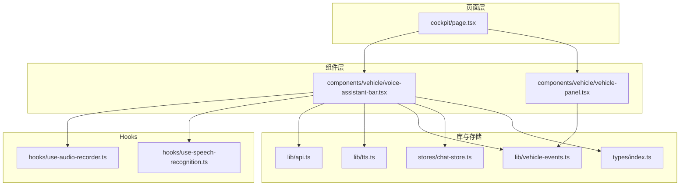
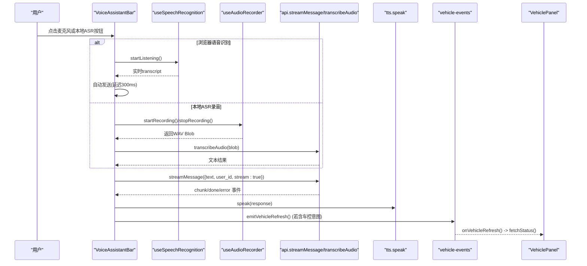
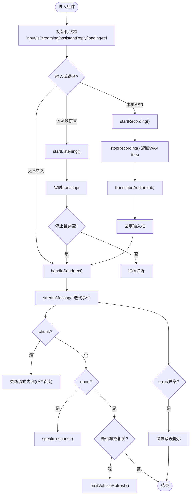
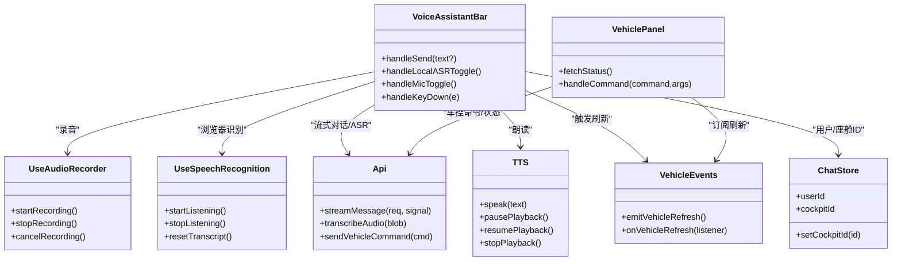

# 语音助手栏组件

<cite>
**本文引用的文件**   
- [voice-assistant-bar.tsx](file://frontend_design/src/components/vehicle/voice-assistant-bar.tsx)
- [use-audio-recorder.ts](file://frontend_design/src/hooks/use-audio-recorder.ts)
- [use-speech-recognition.ts](file://frontend_design/src/hooks/use-speech-recognition.ts)
- [tts.ts](file://frontend_design/src/lib/tts.ts)
- [api.ts](file://frontend_design/src/lib/api.ts)
- [vehicle-events.ts](file://frontend_design/src/lib/vehicle-events.ts)
- [chat-store.ts](file://frontend_design/src/stores/chat-store.ts)
- [vehicle-panel.tsx](file://frontend_design/src/components/vehicle/vehicle-panel.tsx)
- [page.tsx](file://frontend_design/src/app/cockpit/page.tsx)
- [index.ts](file://frontend_design/src/types/index.ts)
</cite>

## 目录
1. [简介](#简介)
2. [项目结构](#项目结构)
3. [核心组件](#核心组件)
4. [架构总览](#架构总览)
5. [详细组件分析](#详细组件分析)
6. [依赖关系分析](#依赖关系分析)
7. [性能与体验优化](#性能与体验优化)
8. [故障排查指南](#故障排查指南)
9. [结论](#结论)
10. [附录：集成与使用示例](#附录集成与使用示例)

## 简介
本技术文档围绕 NexusCockpit 的“语音助手栏”组件（VoiceAssistantBar）展开，系统性说明其功能实现、与语音系统的集成方式、状态管理机制、与其他组件的协作模式，以及移动端适配与用户体验优化策略。该组件提供语音输入按钮、状态指示器、快捷操作入口和响应式布局，并与 ASR/TTS、流式对话、车控面板等模块深度集成，为车载座舱提供自然、流畅的人机交互入口。

## 项目结构
语音助手栏位于前端设计工程中的车辆组件目录下，配合 hooks、lib、stores 等模块共同完成语音输入、识别、合成、对话与车控联动。

图表来源
- [page.tsx:1-41](file://frontend_design/src/app/cockpit/page.tsx#L1-L41)
- [voice-assistant-bar.tsx:1-430](file://frontend_design/src/components/vehicle/voice-assistant-bar.tsx#L1-L430)
- [vehicle-panel.tsx:1-800](file://frontend_design/src/components/vehicle/vehicle-panel.tsx#L1-L800)
- [use-audio-recorder.ts:1-304](file://frontend_design/src/hooks/use-audio-recorder.ts#L1-L304)
- [use-speech-recognition.ts:1-113](file://frontend_design/src/hooks/use-speech-recognition.ts#L1-L113)
- [api.ts:1-786](file://frontend_design/src/lib/api.ts#L1-L786)
- [tts.ts:1-443](file://frontend_design/src/lib/tts.ts#L1-L443)
- [vehicle-events.ts:1-34](file://frontend_design/src/lib/vehicle-events.ts#L1-L34)
- [chat-store.ts:1-311](file://frontend_design/src/stores/chat-store.ts#L1-L311)
- [index.ts:1-277](file://frontend_design/src/types/index.ts#L1-L277)

章节来源
- [page.tsx:1-41](file://frontend_design/src/app/cockpit/page.tsx#L1-L41)
- [voice-assistant-bar.tsx:1-430](file://frontend_design/src/components/vehicle/voice-assistant-bar.tsx#L1-L430)

## 核心组件
- VoiceAssistantBar：语音助手栏主组件，封装语音输入、本地ASR录音、文字输入、流式回复展示、TTS朗读、错误提示与快捷指令。
- useAudioRecorder：浏览器端录音 Hook，采集 PCM 并编码为 WAV Blob，用于上传后端 ASR。
- useSpeechRecognition：浏览器 Web Speech API 语音识别 Hook，支持实时转写与停止控制。
- tts：TTS 引擎，按句分播、全局播放状态机、音乐联动、保活机制。
- api：统一 API 客户端，包含流式对话 streamMessage、ASR 转录 transcribeAudio、车控命令等。
- vehicle-events：车控刷新事件总线，用于语音助手触发车控后通知 VehiclePanel 刷新。
- chat-store：Zustand 聊天状态管理，维护用户 ID、座舱 ID、会话消息等。
- vehicle-panel：车控面板，订阅事件总线刷新状态，支持离线降级。

章节来源
- [voice-assistant-bar.tsx:1-430](file://frontend_design/src/components/vehicle/voice-assistant-bar.tsx#L1-L430)
- [use-audio-recorder.ts:1-304](file://frontend_design/src/hooks/use-audio-recorder.ts#L1-L304)
- [use-speech-recognition.ts:1-113](file://frontend_design/src/hooks/use-speech-recognition.ts#L1-L113)
- [tts.ts:1-443](file://frontend_design/src/lib/tts.ts#L1-L443)
- [api.ts:1-786](file://frontend_design/src/lib/api.ts#L1-L786)
- [vehicle-events.ts:1-34](file://frontend_design/src/lib/vehicle-events.ts#L1-L34)
- [chat-store.ts:1-311](file://frontend_design/src/stores/chat-store.ts#L1-L311)
- [vehicle-panel.tsx:1-800](file://frontend_design/src/components/vehicle/vehicle-panel.tsx#L1-L800)

## 架构总览
VoiceAssistantBar 作为入口，协调浏览器语音识别、本地录音、流式对话与 TTS 播报，并在涉及车控时通过事件总线驱动 VehiclePanel 刷新。

图表来源
- [voice-assistant-bar.tsx:120-229](file://frontend_design/src/components/vehicle/voice-assistant-bar.tsx#L120-L229)
- [use-speech-recognition.ts:76-96](file://frontend_design/src/hooks/use-speech-recognition.ts#L76-L96)
- [use-audio-recorder.ts:138-257](file://frontend_design/src/hooks/use-audio-recorder.ts#L138-L257)
- [api.ts:261-341](file://frontend_design/src/lib/api.ts#L261-L341)
- [api.ts:612-625](file://frontend_design/src/lib/api.ts#L612-L625)
- [tts.ts:430-432](file://frontend_design/src/lib/tts.ts#L430-L432)
- [vehicle-events.ts:23-33](file://frontend_design/src/lib/vehicle-events.ts#L23-L33)
- [vehicle-panel.tsx:246-252](file://frontend_design/src/components/vehicle/vehicle-panel.tsx#L246-L252)

## 详细组件分析

### VoiceAssistantBar 组件
- 功能要点
  - 浏览器语音识别：点击开始/停止，实时转写到输入框，结束后自动发送。
  - 本地 ASR 录音：录制 WAV 并上传后端 SenseVoice 模型识别，结果回填输入框。
  - 流式回复：SSE 逐块渲染，rAF 节流避免频繁重渲染；新请求可中断旧请求。
  - TTS 朗读：收到 done 事件后调用 speak 进行整段朗读。
  - 车控联动：根据 response 元数据判断是否触发车控刷新事件。
  - 错误处理：区分网络异常、鉴权失败、服务不可用等场景，友好提示。
  - 快捷指令：预设常用车控指令一键发送。
- 状态管理
  - 输入内容 input、流式状态 isStreaming、助手回复 assistantReply、加载状态 replyLoading/asrLoading。
  - 流式内容缓存 streamingContentRef + rAF 节流标志 rafScheduledRef。
  - AbortController 取消上一次流式请求，避免阻塞。
- 与 Store 同步
  - 从 auth store 同步 cockpitId 到 chat store，保证多租户隔离。
- 事件与回调
  - handleSend：统一发送入口，处理流式事件、错误回退、TTS 与车控刷新。
  - handleLocalASRToggle：录音/停止录音 → 上传 ASR → toast 反馈。
  - handleMicToggle：切换浏览器语音识别。
  - handleKeyDown：回车发送。
- 样式与响应式
  - 使用 Card 容器与 flex 布局，适配不同屏幕尺寸；按钮图标与动画提示状态。

图表来源
- [voice-assistant-bar.tsx:120-229](file://frontend_design/src/components/vehicle/voice-assistant-bar.tsx#L120-L229)
- [voice-assistant-bar.tsx:254-283](file://frontend_design/src/components/vehicle/voice-assistant-bar.tsx#L254-L283)
- [voice-assistant-bar.tsx:286-291](file://frontend_design/src/components/vehicle/voice-assistant-bar.tsx#L286-L291)

章节来源
- [voice-assistant-bar.tsx:1-430](file://frontend_design/src/components/vehicle/voice-assistant-bar.tsx#L1-L430)

### useAudioRecorder Hook
- 能力
  - 使用 AudioContext + ScriptProcessorNode 采集 PCM，合并为 Float32Array。
  - 将 AudioBuffer 编码为 16kHz/16bit/单声道 WAV Blob，便于后端直接识别。
  - 计时器统计录音时长，支持 cancel/reset。
  - 权限与设备检测：捕获 NotAllowedError/NotFoundError 并给出明确提示。
- 关键流程
  - startRecording：获取媒体流、创建上下文与处理器、连接音频链、启动计时器。
  - stopRecording：断开节点、停止音轨、合并数据、编码 WAV、关闭上下文、返回 Blob。
  - cancelRecording：清理所有资源，重置状态。
- 兼容性
  - 检测 navigator.mediaDevices 与 AudioContext/webkitAudioContext 可用性。

章节来源
- [use-audio-recorder.ts:1-304](file://frontend_design/src/hooks/use-audio-recorder.ts#L1-L304)

### useSpeechRecognition Hook
- 能力
  - 基于 Web Speech API，支持中文识别、实时结果、连续识别开关。
  - 错误过滤：忽略 no-speech/aborted 等正常行为，其他错误显示提示。
  - 生命周期：start/stop/resetTranscript，卸载时安全停止。
- 使用场景
  - 快速语音输入，无需上传后端，适合低延迟场景。

章节来源
- [use-speech-recognition.ts:1-113](file://frontend_design/src/hooks/use-speech-recognition.ts#L1-L113)

### TTS 引擎（tts.ts）
- 能力
  - 分句播放：按标点智能切分，逐句播报，提升听感与可控性。
  - 全局状态机：idle/playing/paused/stopped，支持暂停、续播、重放、跳转。
  - 代际计数器：防止旧 utterance 回调干扰新播放。
  - Chrome 保活：周期性 pause→resume 避免长时间播放冻结。
  - 音乐联动：朗读前暂停音乐，结束后恢复，保留进度。
- 接口
  - speakSentences/speak（兼容）、pausePlayback/resumePlayback/replayPlayback/stopPlayback/jumpToSentence。
  - getPlaybackState/getPlaybackProgress/onPlaybackStateChange。

章节来源
- [tts.ts:1-443](file://frontend_design/src/lib/tts.ts#L1-L443)

### API 客户端（api.ts）
- 流式对话
  - streamMessage：原生 fetch + ReadableStream，解析 SSE data: JSON，支持 AbortSignal 取消。
  - StreamError：携带 HTTP 状态码，便于上层差异化处理。
- ASR 转录
  - transcribeAudio：上传 WAV/WebM/MP4/OGG，后端 SenseVoice 识别，超时 60s。
- 认证与会话
  - axios 拦截器自动附加 JWT Token 与 X-Cockpit-Id 头，401 自动刷新并重试。
- 车控接口
  - sendVehicleCommand/getVehicleStatus/updateVehicleLocation。

章节来源
- [api.ts:261-341](file://frontend_design/src/lib/api.ts#L261-L341)
- [api.ts:612-625](file://frontend_design/src/lib/api.ts#L612-L625)
- [api.ts:137-175](file://frontend_design/src/lib/api.ts#L137-L175)

### 车控事件总线（vehicle-events.ts）
- 作用
  - 当语音助手触发了车控命令后，通知 VehiclePanel 重新拉取车辆状态，实现 UI 联动刷新。
- 接口
  - emitVehicleRefresh：触发刷新事件。
  - onVehicleRefresh：订阅刷新事件，返回取消订阅函数。

章节来源
- [vehicle-events.ts:1-34](file://frontend_design/src/lib/vehicle-events.ts#L1-L34)

### 聊天状态管理（chat-store.ts）
- 作用
  - 管理用户 ID、座舱 ID、会话列表与消息历史，持久化至 localStorage。
- 与 VoiceAssistantBar 的关系
  - 同步 auth store 的 cockpitId，确保多租户隔离；在发送消息时携带 userId。

章节来源
- [chat-store.ts:1-311](file://frontend_design/src/stores/chat-store.ts#L1-L311)

### 车控面板（vehicle-panel.tsx）
- 作用
  - 可视化车控界面，支持空调、座椅、媒体、导航、车窗控制。
- 与事件总线集成
  - 订阅 onVehicleRefresh，延迟 500ms 拉取最新状态，避免竞态。
- 离线降级
  - 首次失败延迟重试，仍失败则降级 Mock 数据，保障可用性。

章节来源
- [vehicle-panel.tsx:246-252](file://frontend_design/src/components/vehicle/vehicle-panel.tsx#L246-L252)
- [vehicle-panel.tsx:173-197](file://frontend_design/src/components/vehicle/vehicle-panel.tsx#L173-L197)

## 依赖关系分析
- VoiceAssistantBar 依赖
  - Hooks：useAudioRecorder、useSpeechRecognition
  - Lib：api（streamMessage、transcribeAudio）、tts（speak）、vehicle-events（emitVehicleRefresh）
  - Stores：chat-store（userId、cockpitId）
  - Types：ChatRequest、StreamEvent、VehicleCommand、VehicleStatus
- VehiclePanel 依赖
  - Lib：api（getVehicleStatus、sendVehicleCommand）、vehicle-events（onVehicleRefresh）
  - Stores：audio-store（音乐联动）
- 页面集成
  - cockpit/page.tsx 将 VoiceAssistantBar 置于顶部，下方放置 VehiclePanel。

图表来源
- [voice-assistant-bar.tsx:1-430](file://frontend_design/src/components/vehicle/voice-assistant-bar.tsx#L1-L430)
- [use-audio-recorder.ts:1-304](file://frontend_design/src/hooks/use-audio-recorder.ts#L1-L304)
- [use-speech-recognition.ts:1-113](file://frontend_design/src/hooks/use-speech-recognition.ts#L1-L113)
- [api.ts:1-786](file://frontend_design/src/lib/api.ts#L1-L786)
- [tts.ts:1-443](file://frontend_design/src/lib/tts.ts#L1-L443)
- [vehicle-events.ts:1-34](file://frontend_design/src/lib/vehicle-events.ts#L1-L34)
- [chat-store.ts:1-311](file://frontend_design/src/stores/chat-store.ts#L1-L311)
- [vehicle-panel.tsx:1-800](file://frontend_design/src/components/vehicle/vehicle-panel.tsx#L1-L800)

章节来源
- [index.ts:1-277](file://frontend_design/src/types/index.ts#L1-L277)

## 性能与体验优化
- 流式渲染优化
  - 使用 useRef 缓存 streamingContent，requestAnimationFrame 节流更新，避免高频重渲染阻塞 UI。
- 并发与取消
  - AbortController 中断旧请求，新请求不阻塞用户操作。
- 权限与兼容性
  - 浏览器语音识别与录音能力检测，失败时给出明确提示，避免误禁用。
- TTS 稳定性
  - 分句播放、代际计数、Chrome 保活定时器，避免长时播放卡死。
- 车控刷新防抖
  - 事件触发后延迟 500ms 拉取状态，减少竞态与重复请求。
- 离线降级
  - 车控面板首次失败延迟重试，仍失败则使用 Mock 数据，保障基本可用。

[本节为通用指导，不直接分析具体文件]

## 故障排查指南
- 浏览器不支持语音识别
  - 现象：麦克风按钮被禁用或提示不支持。
  - 排查：确认使用 Chrome 或支持 Web Speech API 的浏览器。
  - 参考：use-speech-recognition 的错误提示逻辑。
- 麦克风权限被拒绝
  - 现象：录音启动失败，提示权限问题。
  - 排查：检查浏览器设置中麦克风权限，允许访问。
  - 参考：use-audio-recorder 的 NotAllowedError 处理。
- 未找到麦克风设备
  - 现象：录音启动失败，提示无设备。
  - 排查：确认系统已连接麦克风设备。
  - 参考：use-audio-recorder 的 NotFoundError 处理。
- 流式请求失败
  - 现象：网络异常、鉴权失败、服务不可用。
  - 排查：查看 StreamError 的状态码，检查 Token 与后端服务健康。
  - 参考：api.ts 的 streamMessage 错误抛出与 VoiceAssistantBar 的回退逻辑。
- 车控面板未刷新
  - 现象：语音助手执行车控后，面板状态未更新。
  - 排查：确认 emitVehicleRefresh 被调用，VehiclePanel 订阅成功，网络可达。
  - 参考：vehicle-events 与 vehicle-panel 的事件订阅与 fetchStatus。

章节来源
- [use-speech-recognition.ts:53-59](file://frontend_design/src/hooks/use-speech-recognition.ts#L53-L59)
- [use-audio-recorder.ts:183-191](file://frontend_design/src/hooks/use-audio-recorder.ts#L183-L191)
- [api.ts:283-289](file://frontend_design/src/lib/api.ts#L283-L289)
- [voice-assistant-bar.tsx:190-217](file://frontend_design/src/components/vehicle/voice-assistant-bar.tsx#L190-L217)
- [vehicle-panel.tsx:246-252](file://frontend_design/src/components/vehicle/vehicle-panel.tsx#L246-L252)

## 结论
VoiceAssistantBar 以简洁直观的交互入口整合了浏览器语音识别、本地 ASR 录音、流式对话与 TTS 朗读，并通过事件总线与车控面板联动，形成完整的语音助手闭环。其在性能、兼容性、错误处理与用户体验方面做了充分优化，适用于车载座舱的高频交互场景。

[本节为总结，不直接分析具体文件]

## 附录：集成与使用示例
- 页面集成
  - 在 cockpit/page.tsx 中引入并渲染 VoiceAssistantBar，置于 VehiclePanel 上方。
- 配置选项
  - 环境变量：NEXT_PUBLIC_API_URL 指定后端地址；默认开发用户可通过 NEXT_PUBLIC_DEFAULT_USER/NEXT_PUBLIC_DEFAULT_PASSWORD 配置。
- 事件回调
  - 流式事件：chunk/done/error，由 streamMessage 迭代返回。
  - 车控刷新：emitVehicleRefresh 触发 VehiclePanel 刷新。
- 样式定制
  - 使用 Tailwind 类名与 lucide-react 图标，可按需调整按钮样式与布局。
- 与其他组件协作
  - 与 chat-store 同步用户与座舱 ID，确保多租户隔离。
  - 与 tts 联动朗读回复，与 vehicle-panel 联动刷新车控状态。

章节来源
- [page.tsx:1-41](file://frontend_design/src/app/cockpit/page.tsx#L1-L41)
- [api.ts:41-47](file://frontend_design/src/lib/api.ts#L41-L47)
- [voice-assistant-bar.tsx:286-291](file://frontend_design/src/components/vehicle/voice-assistant-bar.tsx#L286-L291)
- [vehicle-events.ts:23-33](file://frontend_design/src/lib/vehicle-events.ts#L23-L33)
- [chat-store.ts:88-110](file://frontend_design/src/stores/chat-store.ts#L88-L110)